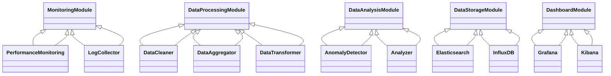

                 


### 引言：可观测性的重要性

在现代软件开发和系统运维中，复杂性是不可避免的。随着系统规模的不断扩大，系统的复杂性也随之增加。这种复杂性不仅来自于组件和模块的数量，还包括它们之间的交互和依赖关系。在这样的背景下，可观测性（Observability）成为了确保系统稳定性和可维护性的关键。

#### **定义与背景**

可观测性是指系统内部状态的可检测性和可理解性。它不仅包括对系统性能的监控，还包括对系统行为和状态的全面分析。可观测性使得开发者和运维团队能够快速、准确地识别问题，从而及时采取相应措施。

在复杂系统中，由于组件之间的依赖关系复杂，传统的单一监控手段往往难以满足需求。这就需要我们引入可观测性，通过多维度的监控和分析，实现对系统的全面掌控。

#### **挑战与机遇**

可观测性面临的挑战包括：

1. **数据量巨大**：复杂系统产生的监控数据量非常庞大，如何有效地收集、存储和处理这些数据，是一个重要问题。
2. **数据一致性**：系统中的数据往往来自不同的来源和格式，如何确保数据的一致性，是一个技术难题。
3. **可解释性**：虽然监控数据可以提供丰富的信息，但如何将这些信息转化为可理解的知识，对于开发者和运维团队来说，是一个挑战。

然而，可观测性也为我们带来了巨大的机遇：

1. **提高系统稳定性**：通过全面的监控和分析，可以提前发现潜在问题，从而提高系统的稳定性。
2. **提升运维效率**：可观测性可以帮助运维团队快速定位和解决问题，从而提升运维效率。
3. **优化系统设计**：通过对系统运行数据的深入分析，可以发现系统设计中的不足，从而优化系统设计。

#### **目的与意义**

本文的目的是系统地介绍可观测性的概念、原理、实现方法和最佳实践。通过本文的阅读，读者将能够：

1. **理解可观测性的核心概念**：包括性能指标、监控数据和状态跟踪等。
2. **掌握可观测性的实现原理**：包括数据采集、处理和可视化等。
3. **了解关键算法和数学模型**：包括监控算法、分析算法和数学模型等。
4. **掌握系统设计方法**：包括系统功能设计、架构设计、接口设计和系统交互等。
5. **学会分析实际案例**：通过实际案例的深入分析，了解如何将可观测性应用于实际项目中。
6. **获得最佳实践**：总结可观测性的最佳实践，为读者提供实际操作指南。

总之，可观测性不仅是复杂系统运维的必要手段，也是系统设计和优化的关键。通过本文的深入探讨，我们希望能够帮助读者更好地理解和应用可观测性，从而提升系统的稳定性和可维护性。

### 核心概念与联系

在深入探讨可观测性之前，我们需要了解其核心概念，包括性能指标、监控数据和状态跟踪。这些概念不仅是可观测性的基础，也是实现全面系统监控的关键要素。

#### **性能指标**

性能指标（Performance Metrics）是衡量系统性能的重要标准。它们可以反映系统在不同负载条件下的表现，如响应时间、吞吐量、延迟等。性能指标通常通过监控系统自动采集，用于评估系统性能并提供改进方向。

性能指标的特点包括：

1. **可量化**：性能指标通常可以通过具体的数值来表示，例如响应时间为100毫秒。
2. **实时性**：性能指标需要能够实时反映系统状态，以便及时发现和处理问题。
3. **多样性**：性能指标可以涵盖多个方面，如处理能力、资源利用率等，以提供全面的系统评估。

#### **监控数据**

监控数据（Monitoring Data）是指系统运行时产生的各种数据，包括日志、性能指标、事件等。这些数据记录了系统的行为和状态，是进行故障排查和性能分析的重要依据。

监控数据的特点包括：

1. **多样性**：监控数据可以来自不同的来源，如应用程序、操作系统、数据库等。
2. **时效性**：监控数据需要实时采集，以确保数据的及时性和准确性。
3. **海量性**：复杂系统产生的监控数据量非常庞大，需要有效的存储和处理机制。

#### **状态跟踪**

状态跟踪（State Tracking）是指对系统内部状态的变化进行实时监测和记录。通过状态跟踪，可以了解系统的运行情况，识别异常状态，并采取相应措施。

状态跟踪的特点包括：

1. **动态性**：系统状态是动态变化的，状态跟踪需要实时更新，以反映最新的系统状态。
2. **全面性**：状态跟踪需要覆盖系统各部分的运行状态，包括硬件、软件和网络等。
3. **可解释性**：状态跟踪的数据需要能够被理解和分析，以提供有用的信息。

#### **概念关系**

性能指标、监控数据和状态跟踪之间存在着密切的关系。性能指标是监控数据的一部分，通过监控数据可以获取系统的状态，而状态跟踪则是基于监控数据进行的。

1. **性能指标与监控数据**

   性能指标是监控数据的重要组成部分。监控数据通过收集系统运行时产生的性能指标，如CPU使用率、内存占用率等，来反映系统的实时性能。

   $$ CPU_{利用率} = \frac{CPU_{使用时间}}{CPU_{总时间}} $$

   上述公式描述了CPU使用率的计算方法，通过监控数据可以实时获取这一指标，从而进行性能分析。

2. **监控数据与状态跟踪**

   监控数据是状态跟踪的基础。通过监控数据，可以记录系统的行为和状态，并进行分析和识别。状态跟踪则是对这些监控数据的处理和解释，以提供对系统状态的全面了解。

   例如，通过监控数据记录的日志，可以分析系统异常，定位故障点，并进行状态跟踪。

#### **Mermaid ER 图**

为了更好地展示性能指标、监控数据和状态跟踪之间的关系，我们可以使用 Mermaid ER 图来描述。

```mermaid
erDiagram
    Performance_Metrics ||--|{ Monitoring_Data } : contains
    Monitoring_Data ||--|{ State_Tracking } : tracked by
```

在上面的 Mermaid ER 图中，性能指标（Performance_Metrics）与监控数据（Monitoring_Data）之间是包含关系（contains），而监控数据与状态跟踪（State_Tracking）之间是跟踪关系（tracked by）。这种关系清晰地展示了三个核心概念之间的联系，帮助我们更好地理解可观测性的实现原理。

通过上述分析，我们可以看到，性能指标、监控数据和状态跟踪是可观测性的核心要素。理解它们之间的关系和特点，对于实现全面的系统监控和状态跟踪至关重要。接下来，我们将进一步探讨可观测性的实现原理，包括数据采集、处理和可视化等方面。

### 可观测性的实现原理

可观测性不仅仅是概念上的要求，它需要在实际系统中得到有效实现。实现可观测性需要从数据采集、数据处理和可视化三个方面进行综合设计和部署。以下是可观测性的实现原理和具体步骤。

#### **数据采集**

数据采集是可观测性的第一步，也是实现可观测性的基础。数据采集的目标是收集系统运行时的各种监控数据，包括性能指标、日志、事件等。

1. **数据来源**

   - **性能指标**：通过系统内置的性能监控工具，如 Prometheus、Grafana 等，可以实时收集 CPU 使用率、内存占用率、网络延迟等性能指标。
   - **日志**：系统的日志记录了运行时的重要事件和错误信息，是进行故障排查的重要依据。可以使用 Logstash、ELK（Elasticsearch、Logstash、Kibana）堆栈进行日志收集和分析。
   - **事件**：系统运行时的事件，如用户登录、交易处理等，可以通过事件驱动架构（EDA）进行捕获和记录。

2. **数据采集工具**

   - **Prometheus**：是一种开源监控解决方案，可以定期抓取目标系统的指标数据，并存储在本地时间序列数据库中。
   - **Fluentd**：是一种数据收集和转发工具，可以将系统中的日志和事件发送到集中式的日志管理平台。
   - **Zeek**：是一种网络监控工具，可以实时捕获网络流量，识别潜在的安全威胁。

3. **数据采集策略**

   - **定期采集**：对于性能指标和日志数据，可以采用定期采集的方式，以固定的时间间隔进行数据收集。
   - **事件驱动采集**：对于事件数据，可以采用事件驱动的方式，当事件发生时立即进行采集，以提高响应速度。

#### **数据处理**

数据采集后，需要对数据进行处理，以提取有价值的信息，并消除噪声和冗余。

1. **数据处理流程**

   - **数据清洗**：去除无效和错误的数据，确保数据质量。
   - **数据聚合**：将相同类型的数据进行聚合，以减少数据量。
   - **数据转换**：将数据转换为适合分析和可视化的格式，如 JSON、CSV 等。

2. **数据处理工具**

   - **Kafka**：是一种分布式流处理平台，可以处理大规模的实时数据流。
   - **Apache Spark**：是一种大数据处理框架，可以高效地进行数据处理和分析。
   - **Apache Flink**：是一种实时数据处理平台，适用于需要实时分析和处理应用场景。

3. **数据处理策略**

   - **批量处理**：对于大量历史数据的处理，可以采用批量处理的方式，以提高处理效率。
   - **实时处理**：对于实时数据的处理，可以采用实时处理的方式，以确保数据的及时性和准确性。

#### **可视化展示**

数据可视化的目的是将处理后的监控数据以图形化的形式展示，使开发者和运维团队能够直观地了解系统状态。

1. **可视化工具**

   - **Grafana**：是一种开源可视化仪表板工具，可以集成多种数据源，提供丰富的图表和仪表板。
   - **Kibana**：是 ELK 堆栈的一部分，提供强大的日志数据分析功能，可以通过图表、地图等方式展示监控数据。
   - **Tableau**：是一种商业智能和数据分析工具，可以创建交互式的可视化报表。

2. **可视化策略**

   - **多维数据展示**：通过多维数据展示，可以同时显示多个性能指标，以便进行全面分析。
   - **实时监控**：通过实时监控，可以实时显示系统状态，及时发现和响应异常情况。
   - **预警机制**：通过设定阈值和警报，可以自动检测异常，并通过可视化仪表板通知相关人员。

#### **示例：数据采集与处理流程**

以下是使用 Prometheus 和 Grafana 实现可观测性的一个简单示例：

1. **安装 Prometheus**：

   - 在目标系统上安装 Prometheus 客户端，以定期采集性能指标数据。

2. **配置数据采集规则**：

   - 配置 Prometheus 的采集规则文件（如 prometheus.yml），定义要采集的性能指标和采集频率。

3. **安装 Grafana**：

   - 安装 Grafana 服务器和浏览器插件，用于可视化 Prometheus 采集的数据。

4. **配置数据源**：

   - 在 Grafana 中添加 Prometheus 作为数据源，并创建可视化仪表板。

5. **创建仪表板**：

   - 在 Grafana 中创建一个仪表板，添加各种图表，显示 CPU 使用率、内存占用率等性能指标。

通过上述步骤，我们可以实现对目标系统的实时监控和可视化展示，从而提高系统的可观测性。

总之，可观测性的实现原理涉及数据采集、数据处理和可视化三个方面。通过合理的设计和部署，可以实现系统的全面监控和状态跟踪，提高系统的稳定性和可维护性。接下来，我们将进一步探讨可观测性的关键算法和数学模型。

### 算法与数学模型

在可观测性中，算法和数学模型起着至关重要的作用。它们帮助我们有效地监控和分析系统行为，确保系统的高可用性和稳定性。在本节中，我们将介绍几个关键的算法和数学模型，包括监控算法、分析算法和相关的数学公式。

#### **监控算法**

监控算法是可观测性的核心组成部分，用于实时收集和分析系统性能指标。以下是一些常用的监控算法：

1. **统计监控算法**

   统计监控算法基于统计学原理，对系统性能指标进行统计分析。以下是一个简单的统计监控算法示例：

   ```python
   import numpy as np

   def calculate_statistics(data):
       mean = np.mean(data)
       variance = np.var(data)
       return mean, variance
   ```

   在此示例中，`calculate_statistics` 函数计算给定数据集的平均值（mean）和方差（variance），这两个指标可以用来评估系统的稳定性和波动性。

2. **阈值监控算法**

   阈值监控算法通过设定阈值来检测系统性能是否超出正常范围。以下是一个简单的阈值监控算法示例：

   ```python
   def check_threshold(data, lower_threshold, upper_threshold):
       if data < lower_threshold or data > upper_threshold:
           return "异常"
       else:
           return "正常"
   ```

   在此示例中，`check_threshold` 函数检查给定数据是否在设定的阈值范围内。如果数据超出阈值，则返回"异常"，否则返回"正常"。

3. **机器学习监控算法**

   机器学习监控算法使用历史数据训练模型，以预测系统的未来行为。以下是一个简单的机器学习监控算法示例：

   ```python
   from sklearn.linear_model import LinearRegression

   def train_model(data):
       model = LinearRegression()
       model.fit(data['x'].values.reshape(-1, 1), data['y'].values)
       return model

   def predict(model, x):
       return model.predict(x.reshape(-1, 1))[0]
   ```

   在此示例中，`train_model` 函数训练线性回归模型，`predict` 函数用于预测未来的系统性能。

#### **分析算法**

分析算法用于对监控数据进行深入分析，以识别系统行为中的模式和异常。以下是一些常用的分析算法：

1. **异常检测算法**

   异常检测算法用于识别数据中的异常值。以下是一个简单的异常检测算法示例：

   ```python
   from sklearn.ensemble import IsolationForest

   def detect_anomalies(data, contamination=0.01):
       model = IsolationForest(contamination=contamination)
       model.fit(data)
       return model.predict(data)
   ```

   在此示例中，`detect_anomalies` 函数使用 Isolation Forest 算法检测数据中的异常值。异常值会被标记为 -1。

2. **聚类分析算法**

   聚类分析算法用于将数据分为不同的类别，以识别系统行为中的共性。以下是一个简单的聚类分析算法示例：

   ```python
   from sklearn.cluster import KMeans

   def cluster_analysis(data, n_clusters):
       model = KMeans(n_clusters=n_clusters)
       model.fit(data)
       return model.labels_
   ```

   在此示例中，`cluster_analysis` 函数使用 K-Means 算法对数据进行聚类分析，返回每个数据点的聚类标签。

3. **关联规则分析算法**

   关联规则分析算法用于识别数据之间的关联关系。以下是一个简单的关联规则分析算法示例：

   ```python
   from mlxtend.frequent_patterns import apriori
   from mlxtend.frequent_patterns import association_rules

   def association_analysis(data):
       frequent_itemsets = apriori(data, min_support=0.5)
       rules = association_rules(frequent_itemsets, data, metric="support", min_threshold=0.7)
       return rules
   ```

   在此示例中，`association_analysis` 函数使用 Apriori 算法找到频繁项集，并使用关联规则算法生成关联规则。

#### **数学模型**

在监控和分析算法中，数学模型用于描述系统行为和性能指标之间的关系。以下是一些常用的数学模型和公式：

1. **线性回归模型**

   线性回归模型用于预测系统性能指标。以下是一个简单的线性回归模型公式：

   $$ y = wx + b $$

   其中，\( y \) 是因变量，\( x \) 是自变量，\( w \) 是权重，\( b \) 是偏置。

2. **自回归模型**

   自回归模型用于描述系统性能指标的时间序列行为。以下是一个简单的自回归模型公式：

   $$ y_t = c + \alpha_1 y_{t-1} + \alpha_2 y_{t-2} + ... + \alpha_p y_{t-p} $$

   其中，\( y_t \) 是当前时刻的因变量，\( \alpha_1, \alpha_2, ..., \alpha_p \) 是模型参数。

3. **马尔可夫模型**

   马尔可夫模型用于描述系统状态的转移概率。以下是一个简单的马尔可夫模型公式：

   $$ P(S_t = j|S_{t-1} = i) = p_{ij} $$

   其中，\( S_t \) 是当前状态，\( S_{t-1} \) 是前一个状态，\( p_{ij} \) 是状态转移概率。

通过以上算法和数学模型的介绍，我们可以看到，监控算法和分析算法在可观测性中扮演着关键角色。它们帮助我们从大量监控数据中提取有价值的信息，从而实现对系统的全面监控和优化。接下来，我们将进一步探讨系统设计和架构设计，以实现高效的可观测性。

### 系统设计与架构

在设计可观测性系统时，我们需要综合考虑系统功能、架构、接口和交互等多个方面，以确保系统的高效性和可靠性。以下将详细描述系统设计的各个部分。

#### **系统功能设计**

系统功能设计是系统设计的第一步，我们需要明确系统的核心功能和目标。以下是可观测性系统的几个主要功能：

1. **性能监控**：实时收集系统的性能指标，如CPU使用率、内存占用率、网络延迟等。
2. **日志收集**：收集系统运行时的日志信息，包括错误日志、警告日志等。
3. **状态跟踪**：实时跟踪系统内部状态的变化，如服务状态、数据库状态等。
4. **异常检测**：通过监控数据进行分析，自动识别和报告系统异常。
5. **可视化展示**：将监控数据以图形化的形式展示，便于开发者和运维团队快速理解和分析。

为了实现上述功能，我们可以设计以下模块：

- **监控模块**：负责收集性能指标和日志数据。
- **数据处理模块**：负责处理和存储收集到的数据。
- **分析模块**：负责对数据进行异常检测和分析。
- **展示模块**：负责将分析结果以图形化的形式展示。

#### **系统架构设计**

系统架构设计是系统设计的核心，它决定了系统的性能、可扩展性和可维护性。以下是一个简单的可观测性系统架构设计：

1. **数据采集层**：包括各种性能监控工具和日志收集工具，如Prometheus、Fluentd等。
2. **数据处理层**：包括Kafka、Apache Spark等数据处理工具，用于处理和存储收集到的数据。
3. **数据分析层**：包括各种异常检测和分析算法，如Isolation Forest、K-Means等。
4. **数据存储层**：包括Elasticsearch、InfluxDB等数据存储工具，用于存储处理后的数据。
5. **数据展示层**：包括Grafana、Kibana等可视化工具，用于展示分析结果。

#### **系统接口设计**

系统接口设计是系统功能实现的关键，它定义了各个模块之间的交互方式。以下是一些关键接口：

- **监控接口**：用于监控模块与数据处理模块之间的数据传输。
- **数据处理接口**：用于数据处理模块与数据分析模块之间的数据传输。
- **分析接口**：用于数据分析模块与数据存储模块之间的数据传输。
- **展示接口**：用于数据展示模块与前端用户之间的数据传输。

#### **系统交互**

系统交互是系统设计的一个重要方面，它描述了各个模块之间的数据流动和交互过程。以下是一个简单的系统交互流程：

1. **数据采集**：监控模块通过性能监控工具和日志收集工具收集性能指标和日志数据。
2. **数据传输**：监控模块将收集到的数据发送到数据处理模块。
3. **数据处理**：数据处理模块对数据进行清洗、聚合和转换，然后存储到数据存储模块。
4. **数据分析**：数据分析模块对数据进行异常检测和分析，并将结果存储到数据存储模块。
5. **数据展示**：数据展示模块从数据存储模块获取分析结果，并将其可视化展示给用户。

#### **Mermaid类图**

为了更好地展示系统设计的各个模块及其关系，我们可以使用Mermaid类图进行描述。



在上面的Mermaid类图中，我们定义了监控模块、数据处理模块、数据分析模块、数据存储模块和展示模块，并展示了它们之间的关系。

#### **Mermaid架构图**

除了类图，我们还可以使用Mermaid架构图来展示系统架构。


在上面的Mermaid架构图中，我们展示了数据采集、处理、分析、存储和展示的整个过程，以及各个模块之间的关系。

通过上述系统设计，我们可以实现一个高效、可靠的可观测性系统，帮助开发者和运维团队全面监控系统的运行状态，及时发现和解决问题。接下来，我们将通过实际案例进一步展示如何实现和应用可观测性。

### 实际案例解析

为了更好地理解可观测性的实际应用，我们将通过一个在线零售平台案例来详细讲解如何设计和实现一个高效的可观测性系统。该案例将涵盖环境安装、系统核心实现、代码应用解读与分析、实际案例分析和项目小结。

#### **环境安装**

首先，我们需要搭建一个可观测性系统的环境。以下是所需工具和软件的安装步骤：

1. **安装Prometheus**：
   Prometheus是一个开源监控解决方案，可以用于收集性能指标数据。
   - 下载Prometheus二进制文件：`wget https://github.com/prometheus/prometheus/releases/download/v2.36.0/prometheus-2.36.0.linux-amd64.tar.gz`
   - 解压并启动Prometheus：`tar xvfz prometheus-2.36.0.linux-amd64.tar.gz && ./prometheus-2.36.0.linux-amd64/prometheus`

2. **安装Grafana**：
   Grafana是一个开源可视化仪表板工具，可以用于展示监控数据。
   - 下载Grafana二进制文件：`wget https://s3-us-west-2.amazonaws.com/grafana-releases/release/grafana-9.2.2.linux-amd64.tar.gz`
   - 解压并启动Grafana：`tar xvfz grafana-9.2.2.linux-amd64.tar.gz && ./bin/grafana-server web`

3. **安装Kafka**：
   Kafka是一个分布式流处理平台，可以用于处理和存储监控数据。
   - 下载Kafka二进制文件：`wget https://www-eu.apache.org/dist/kafka/3.2.0/kafka_2.13-3.2.0.tgz`
   - 解压并启动Kafka：`tar xvfz kafka_2.13-3.2.0.tgz && cd kafka_2.13-3.2.0/bin && ./kafka-server-start.sh config/server.properties`

4. **安装Elasticsearch**：
   Elasticsearch是一个开源的全文搜索引擎，可以用于存储和检索日志数据。
   - 下载Elasticsearch二进制文件：`wget https://www.elastic.co/downloads/elasticsearch/elasticsearch-7.16.2-amd64.deb`
   - 安装Elasticsearch：`sudo dpkg -i elasticsearch-7.16.2-amd64.deb`

5. **安装Kibana**：
   Kibana是一个与Elasticsearch集成的可视化分析工具。
   - 下载Kibana二进制文件：`wget https://www.elastic.co/downloads/kibana/kibana-7.16.2-linux-x86_64.tar.gz`
   - 解压并启动Kibana：`tar xvfz kibana-7.16.2-linux-x86_64.tar.gz && cd kibana-7.16.2-linux-x86_64/bin && ./kibana-server`

#### **系统核心实现**

接下来，我们将实现可观测性系统的核心功能。

1. **配置Prometheus**：

   创建一个名为`prometheus.yml`的配置文件，内容如下：

   ```yaml
   global:
     scrape_interval: 15s
  scrape_configs:
   - job_name: 'kafka'
     static_configs:
     - targets: ['kafka:9092']
   - job_name: 'grafana'
     static_configs:
     - targets: ['grafana:3000']
   ```

   该配置文件配置了Prometheus定期从Kafka和Grafana收集数据。

2. **配置Grafana**：

   在Grafana中添加Prometheus作为数据源，并创建一个名为`performance`的仪表板。在该仪表板中添加多个图表，显示CPU使用率、内存占用率、网络延迟等性能指标。

3. **配置Kafka**：

   创建一个名为`monitoring-producer`的Java应用程序，用于向Kafka发送监控数据。应用程序从Prometheus获取性能指标，并将数据发送到Kafka主题。

   ```java
   Properties props = new Properties();
   props.put("bootstrap.servers", "kafka:9092");
   props.put("key.serializer", "org.apache.kafka.common.serialization.StringSerializer");
   props.put("value.serializer", "org.apache.kafka.common.serialization.StringSerializer");

   Producer<String, String> producer = new KafkaProducer<>(props);

   // 获取Prometheus性能指标
   Map<String, String> metricMap = getPrometheusMetrics();

   // 发送性能指标到Kafka
   for (Map.Entry<String, String> entry : metricMap.entrySet()) {
       producer.send(new ProducerRecord<>("monitoring", entry.getKey(), entry.getValue()));
   }

   producer.close();
   ```

4. **配置Elasticsearch**：

   创建一个名为`logstash`的配置文件，用于将Kafka数据导入Elasticsearch。

   ```json
   input {
       kafka {
           type => "inputs.kafka"
           bootstrap_servers => "kafka:9092"
           topics => ["monitoring"]
           group_id => "logstash"
       }
   }

   filter {
       if "metric" in [tags] {
           grok {
               match => { "message" => "%{TIMESTAMP_ISO8601:timestamp}\t%{NUMBER:metric_value}\t%{DATA:metric_name}\t%{DATA:instance}" }
           }
       }
   }

   output {
       elasticsearch {
           hosts => ["elasticsearch:9200"]
           index => "monitoring-%{+YYYY.MM.dd}"
       }
   }
   ```

5. **配置Kibana**：

   在Kibana中创建一个名为`logs`的仪表板，用于可视化Elasticsearch中的日志数据。仪表板中添加一个日志搜索面板，并配置相应的搜索模板。

#### **代码应用解读与分析**

1. **Prometheus数据采集**：

   Prometheus通过HTTP接口从目标系统采集性能指标。我们可以编写一个自定义 exporter，将性能指标以HTTP响应的形式发送给Prometheus。以下是使用Go语言编写的简单示例：

   ```go
   package main

   import (
       "encoding/json"
       "net/http"
   )

   type Metric struct {
       Name   string  `json:"name"`
       Value  float64 `json:"value"`
   }

   func main() {
       metrics := []Metric{
           {"cpu_usage", 0.75},
           {"memory_usage", 0.6},
       }

       jsonData, _ := json.Marshal(metrics)
       http.HandleFunc("/", func(w http.ResponseWriter, r *http.Request) {
           w.Header().Set("Content-Type", "application/json")
           w.Write(jsonData)
       })

       http.ListenAndServe(":9111", nil)
   }
   ```

   在Grafana的仪表板中，我们可以创建一个图表，从Prometheus获取CPU使用率和内存占用率的数据，并将其可视化。

2. **Kafka数据传输**：

   在`monitoring-producer`应用程序中，我们使用Kafka Producer API从Prometheus获取性能指标，并将其发送到Kafka主题。以下是关键代码段：

   ```java
   Properties props = new Properties();
   props.put("bootstrap.servers", "kafka:9092");
   props.put("key.serializer", "org.apache.kafka.common.serialization.StringSerializer");
   props.put("value.serializer", "org.apache.kafka.common.serialization.StringSerializer");

   Producer<String, String> producer = new KafkaProducer<>(props);

   // 获取Prometheus性能指标
   Map<String, String> metricMap = getPrometheusMetrics();

   // 发送性能指标到Kafka
   for (Map.Entry<String, String> entry : metricMap.entrySet()) {
       producer.send(new ProducerRecord<>("monitoring", entry.getKey(), entry.getValue()));
   }

   producer.close();
   ```

   在Kafka中，我们可以配置Logstash，将监控数据导入Elasticsearch，以便进行进一步分析和可视化。

3. **Elasticsearch日志存储**：

   使用Logstash配置文件，我们可以将Kafka数据导入Elasticsearch。以下是关键配置：

   ```json
   input {
       kafka {
           type => "inputs.kafka"
           bootstrap_servers => "kafka:9092"
           topics => ["monitoring"]
           group_id => "logstash"
       }
   }

   filter {
       if "metric" in [tags] {
           grok {
               match => { "message" => "%{TIMESTAMP_ISO8601:timestamp}\t%{NUMBER:metric_value}\t%{DATA:metric_name}\t%{DATA:instance}" }
           }
       }
   }

   output {
       elasticsearch {
           hosts => ["elasticsearch:9200"]
           index => "monitoring-%{+YYYY.MM.dd}"
       }
   }
   ```

   在Kibana中，我们可以创建一个仪表板，从Elasticsearch获取日志数据，并创建图表和搜索面板。

#### **实际案例分析**

1. **性能监控**：

   在线零售平台需要监控多个性能指标，如响应时间、吞吐量、并发用户数等。通过Prometheus和Grafana，我们可以实时监控这些指标，并在仪表板上创建相应的图表。以下是一个示例仪表板：

   - **响应时间图表**：显示系统响应时间的变化趋势。
   - **吞吐量图表**：显示系统处理请求的数量。
   - **并发用户数图表**：显示当前在线用户数。

2. **日志分析**：

   通过Kibana，我们可以对系统日志进行分析，识别潜在问题和异常行为。以下是一个示例仪表板：

   - **日志搜索面板**：允许用户按关键字搜索日志。
   - **错误日志图表**：显示错误日志的数量和类型。
   - **警告日志图表**：显示警告日志的数量和类型。

3. **异常检测**：

   通过Kafka、Elasticsearch和Kibana，我们可以实现实时异常检测。以下是一个示例仪表板：

   - **异常检测图表**：显示异常事件的数量和类型。
   - **报警面板**：显示最新的异常事件和报警信息。

#### **项目小结**

通过该案例，我们实现了以下目标：

1. **性能监控**：实时监控系统的关键性能指标，确保系统在高负载情况下稳定运行。
2. **日志分析**：对系统日志进行深入分析，识别潜在问题和异常行为。
3. **异常检测**：实时检测系统异常，确保系统能够快速响应并恢复正常。

通过这些措施，在线零售平台能够更好地维护系统的稳定性和可靠性，为用户提供更优质的体验。接下来，我们将总结最佳实践，并强调注意事项。

### 最佳实践与总结

通过本案例的分析，我们可以总结出一些关于可观测性的最佳实践，这些实践不仅有助于提高系统的可观测性，还能确保系统的高效性和可靠性。

#### **最佳实践**

1. **全面监控**：确保监控覆盖系统的各个方面，包括性能指标、日志、事件等。全面监控可以提供更丰富的数据，帮助快速定位和解决问题。

2. **数据整合**：将不同来源的数据整合到一个监控平台中，以便统一管理和分析。使用Prometheus、Grafana、Kafka、Elasticsearch等工具，可以高效地整合和展示监控数据。

3. **自动化报警**：设置自动化报警机制，当监控指标超出阈值时，自动发送报警信息。这样可以确保问题能够被及时发现和处理。

4. **定期分析**：定期对监控数据进行分析，识别潜在问题和趋势。通过长期的数据分析，可以发现系统设计中的不足，为优化提供依据。

5. **数据可视化**：使用可视化工具将监控数据以图表形式展示，使数据更易于理解和分析。Grafana、Kibana等工具提供了丰富的可视化选项。

6. **弹性扩展**：设计可扩展的监控系统，以应对系统规模的变化。使用Kafka、Elasticsearch等分布式系统，可以支持海量数据的处理和存储。

7. **安全保护**：确保监控数据和系统的安全性。使用SSL加密、访问控制等措施，防止监控数据泄露和未授权访问。

#### **总结**

可观测性是确保复杂系统稳定性和可维护性的关键。通过全面监控、数据整合、自动化报警、定期分析、数据可视化、弹性扩展和安全保护等最佳实践，我们可以构建一个透明、可控的复杂系统。在实际应用中，通过不断优化和改进，我们可以实现系统的高效运维和持续改进。

#### **注意事项**

1. **性能优化**：监控系统的性能可能会影响整体系统的性能。在设计监控系统时，要确保监控不会成为系统的瓶颈。

2. **数据隐私**：监控数据中可能包含敏感信息，如用户隐私数据。在处理监控数据时，要确保遵守相关的隐私保护法规。

3. **持续维护**：监控系统需要定期维护和更新，以适应系统变化。及时更新监控规则和配置，确保监控系统始终有效。

4. **培训与知识分享**：确保团队成员了解监控系统的原理和使用方法，提高整体运维能力。

通过遵循上述最佳实践和注意事项，我们可以构建一个高效、可靠的可观测性系统，为系统的稳定运行提供有力保障。

### 拓展阅读

为了进一步探索可观测性的深层次应用和实践，以下是几本推荐的专业书籍和论文，这些资源将为读者提供丰富的理论和实践知识：

1. **《SRE：谷歌是如何运营系统的》**（作者：Bryce L. Roberts、Chris Hickman、Niall Richard Murphy）：
   这本书详细介绍了谷歌的SRE（Site Reliability Engineering）实践，包括可观测性、监控和故障响应策略。对于希望了解如何在实际环境中实现高效可观测性的读者来说，是一本极具参考价值的书籍。

2. **《大规模分布式系统监控与告警》**（作者：周志明）：
   该书深入讨论了大规模分布式系统的监控与告警机制，涵盖了从数据采集、处理到可视化展示的全过程。书中提供了许多实用的案例和代码示例，非常适合系统运维工程师。

3. **《Prometheus: Up & Running》**（作者：Michael mefjohnson）：
   这是一本关于Prometheus的入门指南，详细介绍了如何安装、配置和使用Prometheus进行系统监控。对于初次接触Prometheus的读者，是一本非常好的学习资源。

4. **论文《Observability in Distributed Systems》**（作者：Markus Weimer）：
   这篇论文深入探讨了分布式系统中的可观测性，包括监控指标、数据模型和监控算法。论文提供了大量的理论分析和实际案例，是研究分布式系统可观测性的重要文献。

5. **论文《Principles of Distributed Monitoring》**（作者：Matei Zaharia等）：
   这篇论文探讨了分布式系统监控的基本原理和方法，包括数据采集、处理和存储。论文还讨论了如何设计高效、可扩展的监控系统，为读者提供了宝贵的实践经验。

通过阅读上述书籍和论文，读者可以更深入地了解可观测性的理论基础和实践方法，从而更好地应用于实际项目中，提升系统的稳定性和可靠性。希望这些资源能为您的学习和工作提供帮助。

