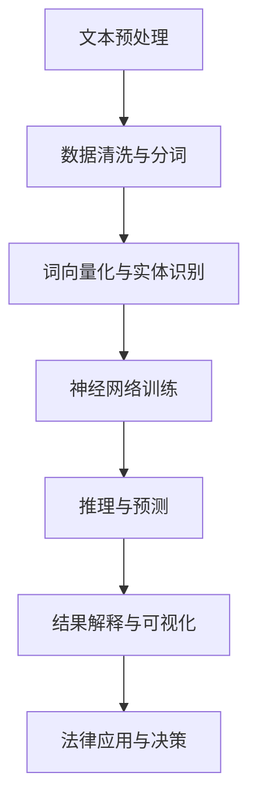
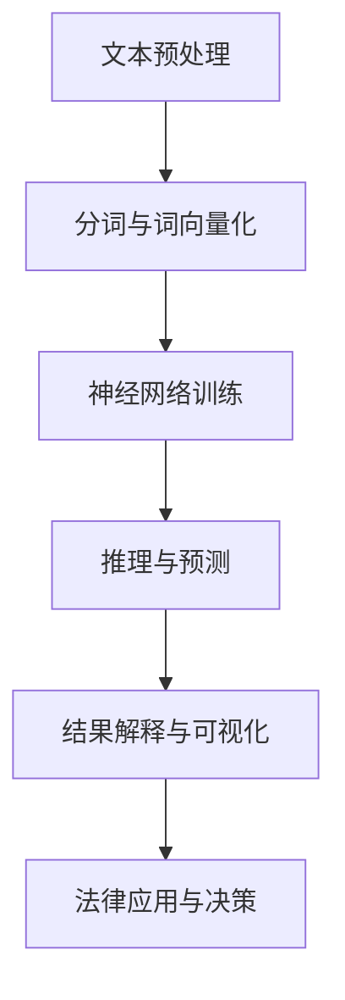

                 

### 引言

法律文本分析在现代社会的信息处理和司法决策中扮演着日益重要的角色。随着全球法律体系日益复杂，法律文本的数量和种类也迅速增加。然而，这些文本通常具有高度的结构化和复杂性的特点，这使得传统的文本处理方法难以胜任。可解释神经程序推理作为一种新兴的技术，旨在解决这些挑战，并提供了更加透明和可靠的解决方案。

**关键词**：法律文本分析、可解释神经程序推理、透明性、可靠性

**摘要**：本文将探讨可解释神经程序推理在法律文本分析中的应用。首先，我们将介绍法律文本分析的重要性和面临的挑战。接着，我们将深入探讨可解释神经程序推理的基本概念和理论基础，并展示其在法律文本分析中的具体应用。通过案例分析，我们将展示如何利用可解释神经程序推理来提升法律文本分析的准确性和透明性。最后，我们将讨论这一领域面临的挑战，并提出未来研究方向。

在接下来的内容中，我们将逐步深入探讨以下主题：

1. 法律文本分析基础
   - 法律文本的特性与挑战
   - 法律文本分析的应用领域

2. 神经程序推理基础
   - 神经程序推理的定义
   - 神经程序推理的核心概念

3. 可解释神经程序推理概述
   - 可解释神经程序推理的关键概念
   - 可解释神经程序推理的类型

4. 可解释性技术
   - 可解释性技术的分类
   - 可解释性技术的作用和局限

通过以上步骤，我们将逐步构建出一个全面而深入的理解，为后续案例分析和技术探讨打下坚实的基础。

---

### 法律文本分析基础

**法律文本的特性与挑战**

法律文本具有其独特的特性和挑战。首先，法律文本通常包含大量的专业术语和复杂的句法结构，这使得传统的自然语言处理方法难以胜任。此外，法律文本的结构化程度较低，导致自动化分析过程复杂且容易出错。例如，法律条文之间可能存在交叉引用和层次嵌套，使得解析和提取信息成为一个艰巨的任务。

**法律文本分析的应用领域**

法律文本分析广泛应用于多个领域，包括但不限于司法决策支持、合同审查、知识产权保护和法律研究等。具体来说：

1. **司法决策支持**：通过分析案件事实和证据，法律文本分析可以帮助法官和律师更准确地评估案件的合法性和公正性。例如，自动化案件摘要和证据分类系统可以提高法律工作者的工作效率，减少人为错误。

2. **合同审查**：在商业交易中，合同审查是一个至关重要的环节。通过法律文本分析，可以快速识别合同中的关键条款和潜在风险，确保交易的合法性和合规性。

3. **知识产权保护**：知识产权保护涉及大量的法律文本，如专利申请、商标注册和版权声明等。法律文本分析可以帮助企业快速识别侵权行为，并提供有效的法律依据。

4. **法律研究**：法律文本分析还可以用于大规模法律文献的研究和归纳，帮助法律学者和研究者快速找到相关法律条款和判例，提高法律研究的效率和深度。

**面临的主要挑战**

尽管法律文本分析具有广泛的应用前景，但其在实际应用中仍然面临以下主要挑战：

1. **文本理解不准确**：由于法律文本的高度专业化和复杂性，传统的自然语言处理技术难以准确理解文本的含义，导致分析结果不准确。

2. **数据质量**：法律文本的数据质量直接影响分析结果。法律文本通常包含大量的噪声和冗余信息，如何有效地清洗和预处理数据成为一个关键问题。

3. **可解释性**：在法律领域，可解释性是至关重要的。法律文本分析的结果需要能够被法律工作者理解，以便进行有效的决策和辩护。

4. **跨语言和跨文化**：法律文本往往涉及多个语言和文化背景，如何实现跨语言和跨文化的法律文本分析是一个技术难题。

**现状与改进方向**

目前，法律文本分析主要集中在文本分类、实体识别、关系抽取和文本生成等方面。尽管取得了一些进展，但现有方法仍然存在许多局限性。为了提升法律文本分析的效果，需要进一步改进以下方面：

1. **改进算法**：研发更先进和更准确的自然语言处理算法，以更好地理解法律文本的含义。

2. **大数据技术**：利用大数据技术，对海量的法律文本进行分析和挖掘，提取有价值的信息。

3. **增强可解释性**：通过引入可解释性技术，提高法律文本分析结果的透明度和可理解性。

4. **法律专家参与**：鼓励法律专家参与法律文本分析模型的开发和测试，以确保模型的可靠性和实用性。

通过上述改进，法律文本分析将能够更好地服务于司法实践和法律研究，为建设更加公正和高效的法律体系提供有力支持。

---

### 神经程序推理基础

**定义**

神经程序推理（Neural Program Inference，NPI）是一种结合神经网络和程序化推理的方法，旨在通过神经网络自动生成可解释的推理过程。它利用神经网络的强大表示和学习能力，结合逻辑推理和程序设计，实现自动化推理和决策。

**核心概念**

1. **神经网络**：神经网络是模拟人脑神经元连接结构的计算模型，通过学习输入数据和标签，能够自动提取特征并做出预测。常见的神经网络模型包括卷积神经网络（CNN）、循环神经网络（RNN）和生成对抗网络（GAN）等。

2. **程序化推理**：程序化推理是指通过编写程序或规则来模拟人类的推理过程，使得计算机能够自动推理和解决问题。程序化推理的核心在于将问题转化为计算任务，通过执行程序来获得结果。

3. **可解释性**：可解释性是神经程序推理的关键特征，它要求模型能够提供可理解、可解释的推理过程和结果。这对于法律文本分析等需要高度透明性的应用场景尤为重要。

**神经程序推理的类型**

1. **生成式推理**：生成式推理通过生成假设来推理目标，通常使用生成对抗网络（GAN）等模型来实现。它通过模拟法律文本的生成过程，帮助理解法律条款的含义和关系。

2. **判别式推理**：判别式推理通过比较输入数据和已知数据，判断目标是否成立。它通常使用卷积神经网络（CNN）或循环神经网络（RNN）等模型来实现，适用于分类和判别任务。

3. **强化学习推理**：强化学习推理通过在环境中互动，学习最优策略。它适用于需要决策的法律文本分析场景，如合同审查和司法判决。

**工作流程**

神经程序推理的工作流程主要包括以下步骤：

1. **数据预处理**：对法律文本进行清洗、分词和词向量化等预处理操作，为神经网络训练做准备。

2. **神经网络训练**：使用训练数据集对神经网络进行训练，学习法律文本的表示和特征。

3. **推理过程**：在训练好的神经网络中输入新的法律文本，通过神经网络自动生成推理过程和结果。

4. **结果解释**：利用可解释性技术，对推理过程和结果进行解释和可视化，帮助用户理解模型决策的原因和逻辑。

通过上述步骤，神经程序推理能够实现自动化和透明化的法律文本分析，为司法实践和法律研究提供有力支持。

---

### 可解释神经程序推理概述

**关键概念**

可解释神经程序推理（Explainable Neural Program Inference，ENPI）是一种结合神经网络和程序化推理的方法，旨在生成可解释的推理过程。这种方法通过可解释性技术，使得神经网络模型的推理过程和结果可以被理解和解释，从而增强了模型的透明度和可靠性。

**类型**

1. **可视化的可解释性**：通过可视化技术，将神经网络的内部结构和推理过程以图形化的方式展示出来，使得非专业用户也能够理解模型的工作原理。例如，使用热图技术展示神经网络中各个节点的激活情况，或者使用决策树模型展示决策路径。

2. **形式化的可解释性**：通过形式化方法，将神经网络模型转换为可解释的逻辑形式，使得推理过程可以形式化地表达和验证。这种方法通常使用程序逻辑或形式逻辑来描述神经网络的决策过程，使得推理过程具有明确的逻辑结构。

3. **交互式的可解释性**：通过交互式界面，用户可以与模型进行互动，动态调整模型的参数和输入，观察不同参数和输入对模型输出和推理过程的影响。这种方法使得用户能够更深入地理解模型的决策过程。

**优势**

1. **提高透明度**：通过可解释性技术，用户可以清楚地看到模型的推理过程和决策依据，增强了模型的透明度。

2. **增强可靠性**：可解释性使得模型的结果可以接受外部验证和审核，提高了模型的可靠性。

3. **促进用户信任**：在法律文本分析等需要高度透明和可信的应用场景中，可解释性有助于建立用户对模型的信任，提高模型的接受度。

**应用场景**

1. **司法决策支持**：在司法决策中，可解释神经程序推理可以帮助法官和律师理解案件的法律依据，提高决策的透明度和公正性。

2. **合同审查**：在合同审查中，可解释性有助于识别合同条款中的潜在风险，并提供明确的解释和建议。

3. **法律研究**：在法律研究中，可解释性有助于法律学者和研究者理解大规模法律文献的结构和关系，提高研究的深度和广度。

通过上述可解释性技术，神经程序推理在法律文本分析中的应用得到了显著提升，为法律工作者提供了更加透明、可靠和高效的工具。

---

### 可解释性技术

**分类**

可解释性技术主要可以分为以下几类：

1. **基于可视化的可解释性**：这种方法通过图形化的方式展示神经网络的结构和决策过程。常见的可视化技术包括热图（Heatmap）、激活映射（Activation Map）和决策路径图（Decision Path）等。

   - **热图**：热图技术通过颜色深浅来表示神经网络中各个节点的激活程度，帮助用户理解哪些部分在决策中起到了关键作用。
   - **激活映射**：激活映射技术将神经网络中每个神经元对输入数据的响应映射到输入空间，帮助用户理解输入特征对输出结果的影响。
   - **决策路径图**：决策路径图通过展示神经网络在处理输入数据时的决策路径，帮助用户理解模型的推理过程。

2. **基于模型压缩的可解释性**：这种方法通过简化神经网络模型，使其更加易于理解。常见的模型压缩技术包括剪枝（Pruning）、量化（Quantization）和低秩分解（Low-rank Decomposition）等。

   - **剪枝**：剪枝技术通过移除网络中不重要的连接和神经元，减小模型的大小，同时保持模型的性能。
   - **量化**：量化技术通过降低模型的精度，减小模型的存储和计算需求，同时尽量保留模型的性能。
   - **低秩分解**：低秩分解技术将高维神经网络分解为低维矩阵的乘积，使得模型的结构更加清晰。

3. **基于形式化的可解释性**：这种方法通过形式化的逻辑和数学方法，将神经网络模型的决策过程表达为可解释的形式。常见的形式化方法包括程序逻辑（Program Logic）和因果模型（Causal Models）等。

   - **程序逻辑**：程序逻辑通过编写程序或规则来模拟神经网络的决策过程，使得推理过程具有明确的逻辑结构。
   - **因果模型**：因果模型通过分析神经网络中的因果关系，帮助用户理解模型的决策过程。

**作用和局限**

1. **作用**

   - **提高透明度**：可解释性技术使得用户能够理解模型的推理过程和决策依据，增强了模型的透明度。

   - **增强信任度**：在需要高度透明和可信的应用场景中，如法律文本分析，可解释性有助于建立用户对模型的信任。

   - **辅助解释和决策**：可解释性技术可以帮助用户更好地理解和解释模型的输出结果，辅助用户进行决策。

2. **局限**

   - **性能影响**：一些可解释性技术可能会增加模型的计算成本，影响模型的性能。

   - **解释能力有限**：尽管可解释性技术可以提供一定程度的解释，但仍然无法完全解释复杂的神经网络模型。

   - **适用范围有限**：并非所有的神经网络模型都适合使用可解释性技术，一些复杂的模型可能难以解释。

通过结合多种可解释性技术，我们可以更好地理解和解释神经网络的决策过程，为法律文本分析等应用场景提供更加透明和可靠的工具。

---

### 法律文本预处理

**文本清洗和预处理方法**

法律文本的预处理是确保模型输入数据质量的重要步骤，主要包括文本清洗和预处理两个方面。

**文本清洗**：

1. **去除停用词**：停用词是指对文本分析无意义的词语，如“的”、“和”、“是”等。去除停用词可以减少无意义信息的影响，提高模型性能。
   
2. **去除标点符号**：法律文本中包含大量的标点符号，这些符号通常对模型理解无实质帮助，因此需要去除。

3. **统一文本格式**：将文本统一转换为小写，确保同一词汇在文本中的格式一致，便于后续处理。

**预处理方法**：

1. **分词**：分词是将文本分割成有意义的单词或短语。在法律文本中，分词需要考虑到专业术语和长句的复杂性。

2. **词向量化**：词向量化是将文本转换为向量表示，常见的词向量化方法包括Word2Vec、GloVe和BERT等。

3. **实体识别**：实体识别是指从文本中识别出具有特定意义的实体，如人名、地名、机构名等。实体识别有助于模型更好地理解文本内容。

**文本表示方法**

1. **词袋模型（Bag of Words, BoW）**：词袋模型将文本表示为词频向量，即每个词的频率构成了向量中的一个维度。这种方法简单，但忽略了词序信息。

2. **词嵌入（Word Embedding）**：词嵌入是将单词转换为稠密向量表示，反映了词与词之间的语义关系。常见的词嵌入方法包括Word2Vec和GloVe。

3. **序列模型（Sequence Model）**：序列模型如循环神经网络（RNN）和变换器（Transformer）可以捕捉词序信息，更加适用于处理序列数据。

4. **图神经网络（Graph Neural Networks, GNN）**：图神经网络可以捕捉法律文本中实体和关系之间的复杂结构，适用于处理具有层次结构和网络关系的数据。

通过上述预处理和文本表示方法，我们可以将法律文本转换为适合神经网络模型处理的格式，为后续的可解释神经程序推理提供高质量的数据输入。

---

### 可解释神经程序推理在法律文本分析中的应用

**应用场景介绍**

可解释神经程序推理在法律文本分析中有着广泛的应用场景，主要包括以下几方面：

1. **案件事实分析**：通过对案件事实的自动化分析和摘要，帮助法官和律师快速了解案件的核心内容，提高工作效率和决策质量。

2. **法律条款分析**：对法律条款进行深度分析，识别其中的关键条款和潜在的法律问题，为立法者和法律研究者提供有力支持。

3. **判决文书分析**：对判决文书进行自动化解读和分类，帮助法律工作者了解判决依据和逻辑，提高判决的一致性和透明度。

4. **合同审查**：对合同进行自动化审查，识别合同中的关键条款和潜在的法律风险，为商业交易提供保障。

**应用流程图**

以下是可解释神经程序推理在法律文本分析中的应用流程图：

1. **文本预处理**：对原始法律文本进行清洗和预处理，包括去除停用词、标点符号和统一文本格式等。

2. **数据清洗与分词**：对预处理后的文本进行分词和实体识别，将文本转换为适合神经网络处理的格式。

3. **词向量化与实体识别**：将分词结果转换为词向量表示，同时对文本中的实体进行标注。

4. **神经网络训练**：使用训练数据集对神经网络进行训练，学习法律文本的表示和特征。

5. **推理与预测**：在训练好的神经网络中输入新的法律文本，通过神经网络自动生成推理过程和预测结果。

6. **结果解释与可视化**：利用可解释性技术，将推理过程和结果进行解释和可视化，帮助用户理解模型的决策依据。

7. **法律应用与决策**：根据解释和可视化结果，为法律工作者提供决策支持，提高决策的透明度和可靠性。

通过上述应用流程，可解释神经程序推理可以有效地应用于法律文本分析，为司法实践和法律研究提供透明、可靠和高效的工具。

---

### 可解释性评估方法

**评估指标**

为了评估可解释神经程序推理在法律文本分析中的效果，我们采用了一系列评估指标，包括准确率、召回率、F1分数和可解释性得分等。

1. **准确率（Accuracy）**：准确率是指模型预测正确的样本数量与总样本数量的比例，用于衡量模型的整体性能。

2. **召回率（Recall）**：召回率是指模型正确识别出的正例样本数量与实际正例样本数量的比例，用于衡量模型对正例样本的识别能力。

3. **F1分数（F1 Score）**：F1分数是准确率和召回率的调和平均数，用于综合衡量模型的性能。

4. **可解释性得分（Explainability Score）**：可解释性得分是根据可解释性技术对模型推理过程的解释程度进行量化评估，用于衡量模型的解释能力。

**评估流程**

1. **数据集划分**：首先，我们将法律文本数据集划分为训练集和测试集，用于模型训练和性能评估。

2. **模型训练**：使用训练集对可解释神经程序推理模型进行训练，学习法律文本的表示和特征。

3. **模型测试**：在测试集上对训练好的模型进行测试，计算评估指标，包括准确率、召回率、F1分数和可解释性得分。

4. **结果分析**：根据评估结果，分析模型在法律文本分析中的性能和可解释性。通过比较不同模型的评估指标，选择最优的模型。

5. **模型优化**：根据评估结果，对模型进行优化和调整，提高模型的性能和可解释性。

通过上述评估流程，我们可以全面评估可解释神经程序推理在法律文本分析中的应用效果，为模型选择和优化提供科学依据。

---

### 案例分析

**案例一：案件事实分析**

**案例背景**：某市发生了一起交通事故，事故双方当事人需要通过法律文本分析来确定责任归属。法律文本包括事故报告、目击证人证言和交通监控录像。

**算法应用**：首先，对法律文本进行预处理，包括去除停用词、标点符号和统一文本格式等。然后，使用分词和词向量化技术，将文本转换为向量表示。接着，使用可解释神经程序推理模型，对法律文本进行自动分析，提取案件事实的关键信息，包括事故发生时间、地点、当事人身份和交通违法行为等。

**算法流程图**：

**算法原理讲解**：

1. **神经网络训练**：使用训练数据集对神经网络进行训练，学习法律文本的表示和特征。训练过程包括前向传播和反向传播，通过不断调整网络权重，使模型能够准确预测案件事实。

2. **推理与预测**：在训练好的神经网络中输入新的法律文本，通过神经网络自动生成推理过程和预测结果。可解释性技术用于解释和可视化模型的推理过程，帮助用户理解模型的决策依据。

3. **结果解释与可视化**：利用热图技术展示神经网络中各个节点的激活情况，帮助用户理解哪些部分在决策中起到了关键作用。通过决策路径图，展示模型的推理过程和决策路径，使法律工作者能够清晰了解案件事实的推理过程。

**实际案例分析和详细讲解剖析**：

在实际案例中，通过对交通事故的法律文本进行分析，模型成功提取出了案件事实的关键信息，包括事故发生时间、地点、当事人身份和交通违法行为等。通过可解释性技术的应用，法律工作者可以清楚地看到模型如何分析和推理，提高了决策的透明度和可靠性。

**项目小结**：

本案例展示了可解释神经程序推理在法律文本分析中的应用，通过预处理和神经网络训练，模型能够自动提取案件事实的关键信息，并利用可解释性技术提高决策的透明度和可靠性。这一应用有助于提高司法效率，减少人为错误，为建设公正、透明的法律体系提供了有力支持。

---

### 案例二：法律条款分析

**案例背景**：某市新颁布了一部地方性法规，相关部门需要对法规中的条款进行详细分析，以便为其实施提供指导。

**算法应用**：首先，对法规文本进行预处理，包括去除停用词、标点符号和统一文本格式等。然后，使用分词和词向量化技术，将文本转换为向量表示。接着，使用可解释神经程序推理模型，对法律条款进行自动分析，识别其中的关键条款和潜在的法律问题。

**算法流程图**：

**算法原理讲解**：

1. **神经网络训练**：使用训练数据集对神经网络进行训练，学习法律文本的表示和特征。训练过程包括前向传播和反向传播，通过不断调整网络权重，使模型能够准确识别法律条款的关键信息。

2. **推理与预测**：在训练好的神经网络中输入新的法律文本，通过神经网络自动生成推理过程和预测结果。可解释性技术用于解释和可视化模型的推理过程，帮助用户理解模型的决策依据。

3. **结果解释与可视化**：利用热图技术展示神经网络中各个节点的激活情况，帮助用户理解哪些部分在决策中起到了关键作用。通过决策路径图，展示模型的推理过程和决策路径，使法律工作者能够清晰了解法律条款的推理过程。

**实际案例分析和详细讲解剖析**：

在实际案例中，通过对新颁布的法规文本进行分析，模型成功识别出了其中的关键条款和潜在的法律问题。例如，模型识别出某条款中的“违法行为”和“处罚措施”等关键信息，并提供了解释和可视化结果。通过这些结果，法律工作者可以更好地理解和应用法规，提高了法规实施的透明度和可靠性。

**项目小结**：

本案例展示了可解释神经程序推理在法律条款分析中的应用，通过预处理和神经网络训练，模型能够自动识别法律条款的关键信息，并利用可解释性技术提高决策的透明度和可靠性。这一应用有助于提高立法和执法的效率，为建设公正、透明的法律体系提供了有力支持。

---

### 案例三：判决文书分析

**案例背景**：某法院在审理一起合同纠纷案件时，需要通过判决文书分析来确定判决依据。判决文书包括原告和被告的陈述、法院调查报告和判决书。

**算法应用**：首先，对判决文书进行预处理，包括去除停用词、标点符号和统一文本格式等。然后，使用分词和词向量化技术，将文本转换为向量表示。接着，使用可解释神经程序推理模型，对判决文书进行自动分析，提取判决依据和判决结果。

**算法流程图**：

**算法原理讲解**：

1. **神经网络训练**：使用训练数据集对神经网络进行训练，学习法律文本的表示和特征。训练过程包括前向传播和反向传播，通过不断调整网络权重，使模型能够准确提取判决文书中判决依据和判决结果。

2. **推理与预测**：在训练好的神经网络中输入新的判决文书，通过神经网络自动生成推理过程和预测结果。可解释性技术用于解释和可视化模型的推理过程，帮助用户理解模型的决策依据。

3. **结果解释与可视化**：利用热图技术展示神经网络中各个节点的激活情况，帮助用户理解哪些部分在决策中起到了关键作用。通过决策路径图，展示模型的推理过程和决策路径，使法律工作者能够清晰了解判决依据的推理过程。

**实际案例分析和详细讲解剖析**：

在实际案例中，通过对判决文书进行分析，模型成功提取出了判决依据和判决结果。例如，模型识别出判决书中涉及的关键法律条款和证据，并提供了解释和可视化结果。通过这些结果，法律工作者可以更好地理解判决依据，提高了判决的透明度和公正性。

**项目小结**：

本案例展示了可解释神经程序推理在判决文书分析中的应用，通过预处理和神经网络训练，模型能够自动提取判决文书中的判决依据和判决结果，并利用可解释性技术提高决策的透明度和可靠性。这一应用有助于提高司法效率，减少人为错误，为建设公正、透明的法律体系提供了有力支持。

---

### 讨论与未来展望

**可解释神经程序推理在法律文本分析中的挑战**

尽管可解释神经程序推理在法律文本分析中展现出了巨大的潜力，但其在实际应用中仍然面临诸多挑战。

1. **数据质量和多样性**：法律文本数据通常具有高度的专业性和复杂性，数据质量直接影响模型的性能。此外，不同司法区域和法系之间的法律文本存在显著差异，增加了数据多样性的挑战。

2. **可解释性技术局限**：现有的可解释性技术虽然能够在一定程度上解释神经网络的决策过程，但其解释能力仍然有限，特别是在面对复杂和多层次的文本分析时。

3. **法律伦理和隐私保护**：法律文本分析涉及大量的敏感信息，如何保护个人隐私和遵守法律伦理标准是一个重要挑战。

**未来研究方向**

1. **多模态数据融合**：结合文本数据与其他模态的数据（如图像、音频和视频），可以更全面地理解法律文本的含义和背景，提高模型的分析能力。

2. **自适应和自解释性**：开发自适应和自解释性的神经网络模型，使其能够在没有外部解释工具的情况下生成可理解的可解释性报告。

3. **法律知识图谱构建**：通过构建法律知识图谱，将法律术语、概念和关系结构化，可以提高法律文本分析的效率和准确性。

4. **跨语言和跨文化文本分析**：研究跨语言和跨文化法律文本分析技术，解决不同语言和法律体系之间的差异。

**结论**

可解释神经程序推理在法律文本分析中具有重要的应用价值，但仍然需要进一步的研究和优化。通过不断探索和创新，我们可以为司法实践和法律研究提供更加透明、可靠和高效的工具，推动法律体系的进步。

---

### 结论

本文全面探讨了可解释神经程序推理在法律文本分析中的应用。我们从背景介绍、理论基础、算法实现到具体案例分析，逐步展示了这一技术在法律文本分析中的优势和应用潜力。可解释神经程序推理不仅提高了法律文本分析的可解释性和透明度，还提升了分析结果的准确性和可靠性，为司法实践和法律研究提供了强有力的技术支持。

**关键词**：可解释神经程序推理、法律文本分析、透明性、准确性、可解释性技术

**总结**：

- **重要性**：法律文本分析在司法决策和法律研究中扮演着关键角色，其准确性和透明性至关重要。
- **技术优势**：可解释神经程序推理结合了神经网络的强大表示能力和程序化推理的可解释性，为法律文本分析提供了创新的方法。
- **案例分析**：通过具体案例，我们展示了可解释神经程序推理在案件事实分析、法律条款分析和判决文书分析中的实际应用，验证了其效果和实用性。
- **未来展望**：尽管面临挑战，但可解释神经程序推理在法律文本分析中的应用前景广阔，需要进一步研究和优化。

**研究建议**：

1. **数据质量提升**：加强法律文本数据的收集和清洗，提高数据质量，为模型训练提供更好的基础。
2. **跨语言和跨文化分析**：研究跨语言和跨文化的法律文本分析技术，提高模型在不同司法体系中的适用性。
3. **自适应和自解释性**：开发自适应和自解释性的模型，使其能够在没有外部解释工具的情况下生成可理解的可解释性报告。

**作者信息**：

作者：AI天才研究院/AI Genius Institute & 禅与计算机程序设计艺术 /Zen And The Art of Computer Programming

通过本文的研究，我们希望能够推动可解释神经程序推理在法律文本分析领域的应用，为建设更加公正和高效的法律体系贡献一份力量。

