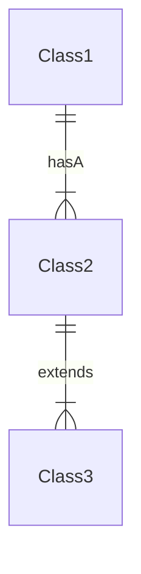
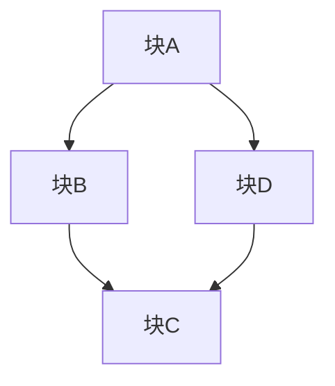
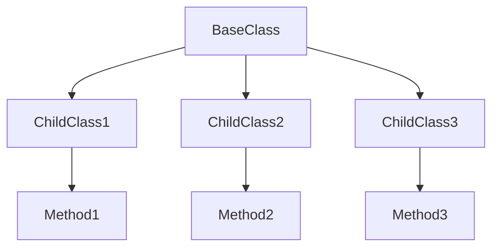
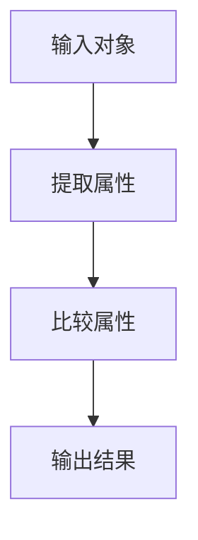
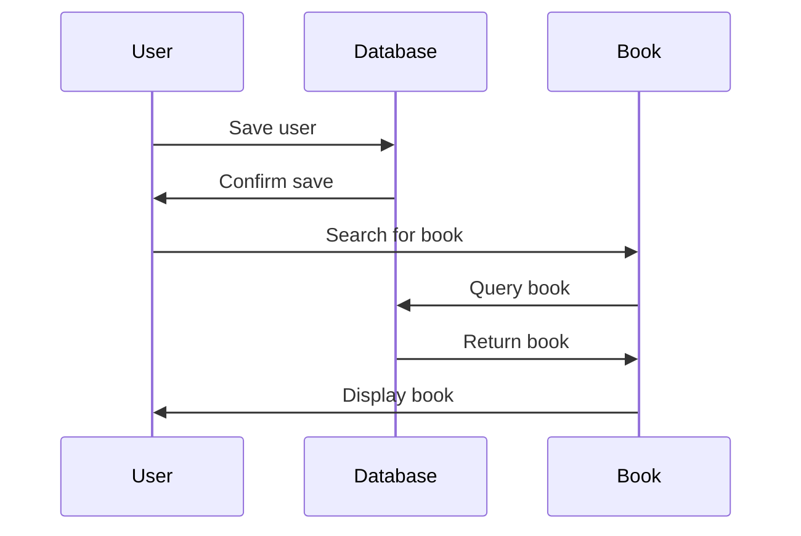
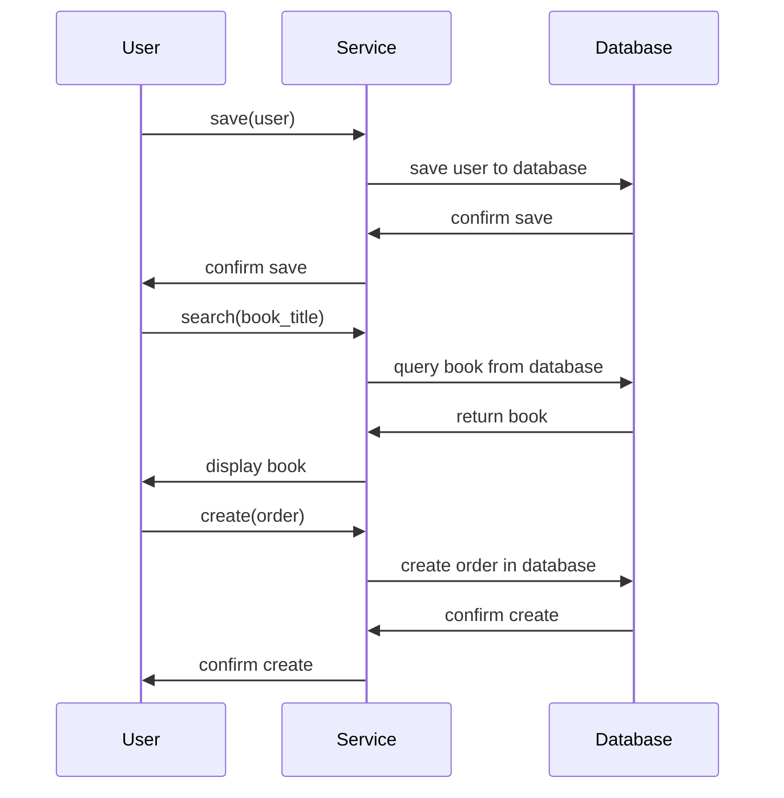

                 

### 《吉尔·德勒兹的差异哲学与多态：OOP中的同一性与差异》

> 关键词：面向对象编程、多态、差异哲学、同一性、算法实现

> 摘要：本文将探讨面向对象编程（OOP）中的多态概念与哲学家吉尔·德勒兹的差异哲学之间的联系。通过逐步分析，我们将揭示OOP中的同一性与差异的深层次原理，并探讨这些概念在软件开发中的应用。

### 第一部分：背景介绍

#### 第1章：问题背景与核心概念

##### 1.1 问题背景

面向对象编程（OOP）已经成为现代软件开发的核心，其核心概念之一是多态，允许不同类型的对象以一致的方式进行操作。与此同时，哲学家吉尔·德勒兹的差异哲学为我们提供了一种理解世界的新视角，强调了差异和变化的重要性。

##### 1.2 核心概念与联系

德勒兹的差异哲学主张，现实世界是由差异构成的，而非单一的实体。多态在OOP中表现为不同对象能够以相同的方式响应方法调用，这体现了德勒兹的差异概念。同一性在德勒兹哲学中并非固定不变，而是通过差异来定义和体现。

##### 1.3 概念属性特征对比表格

| 差异哲学 | OOP |
| --- | --- |
| 强调差异和变化 | 强调多态和对象交互 |
| 同一性通过差异体现 | 同一性在不同对象中表现 |
| 实体间的关系复杂 | 实体间的关系明确 |

##### 1.4 ER实体关系图架构



实体：Class1、Class2、Class3
属性：hasA、extends
关系：继承、关联

#### 第二部分：核心概念原理

##### 第2章：德勒兹的差异哲学原理

###### 2.1 基本原理

德勒兹认为现实世界是连续变化的，差异是这种变化的基础。同一性是通过差异来定义和体现的。

###### 2.2 原理解释

德勒兹的“块”概念可以类比OOP中的类和对象。每个块都是差异的具体体现，而同一性则体现在不同块之间的关联。



###### 2.3 举例说明

在软件开发中，模块化设计可以被视为德勒兹的差异哲学的应用。每个模块代表一个差异的“块”，模块之间的关联则体现了同一性。

```python
class ModuleA:
    def function_a(self):
        pass

class ModuleB:
    def function_b(self):
        pass

class ModuleC:
    def function_c(self):
        pass

# ModuleA和ModuleB通过继承关系关联
class SubModuleA(ModuleA):
    def function_d(self):
        pass

# ModuleC扩展了ModuleB的功能
class ExtendedModuleB(ModuleB):
    def function_e(self):
        pass
```

##### 第3章：OOP中的多态原理

###### 3.1 基本原理

多态允许不同类型的对象以相同的方式进行操作，这是OOP的核心优势之一。

###### 3.2 原理解释

多态的实现依赖于继承和接口。对象通过继承自基类，可以共享基类的方法和属性，同时保持自身的独特性。



###### 3.3 举例说明

在图形用户界面（GUI）编程中，多态允许不同类型的控件以相同的方式响应用户事件。

```python
class Button:
    def click(self):
        print("Button clicked")

class Checkbox:
    def click(self):
        print("Checkbox clicked")

def on_click(control):
    control.click()

button = Button()
checkbox = Checkbox()

on_click(button)  # 输出：Button clicked
on_click(checkbox)  # 输出：Checkbox clicked
```

#### 第三部分：算法原理讲解

##### 第4章：同一性与差异的算法实现

###### 4.1 算法概述

同一性与差异算法旨在通过比较对象的属性，识别对象之间的差异和相似性。

###### 4.2 算法流程图



###### 4.3 算法原理

算法使用哈希表存储对象的属性，并比较属性值以确定对象之间的差异。

```latex
\newcommand{\braces}[1]{\left\{{#1}\right\}}
\newcommand{\paren}[1]{\left(#1\right)}
\newcommand{\round}[1]{\paren{#1}}
\newcommand{\brack}[1]{\left[#1\right]}
\newcommand{\vert}{\ |\ }
\newcommand{\true}{\text{true}}
\newcommand{\false}{\text{false}}

\def\obj{\mathbf{obj}}
\def\attr{\mathbf{attr}}
\def\hash{\mathbf{hash}}
\def\props{\mathbf{props}}
\def\comparison{\mathbf{comparison}}
\def\result{\mathbf{result}}

\def\setdiff#1#2{\obj \vert \paren{\hash(#1) \neq \hash(#2)}}

\hash(\attr) = \text{哈希值}(\attr)

\props = \braces{\attr_1, \attr_2, \dots}

\comparison(\obj_1, \obj_2) =
    \begin{cases}
        \true & \text{如果} \setdiff{\props(\obj_1)}{\props(\obj_2)} \text{为空} \\
        \false & \text{否则}
    \end{cases}
```

###### 4.4 举例说明

假设有两个对象`obj1`和`obj2`，它们具有不同的属性集。

```python
obj1 = {'name': 'Alice', 'age': 30}
obj2 = {'name': 'Bob', 'age': 40}

def compare_objects(obj1, obj2):
    return set(obj1.keys()) == set(obj2.keys())

print(compare_objects(obj1, obj2))  # 输出：False
```

#### 第四部分：系统分析与架构设计

##### 第5章：系统功能设计

###### 5.1 问题场景介绍

我们考虑一个在线书店系统，需要处理用户、书籍、订单等实体的管理。

###### 5.2 系统功能设计

使用Mermaid绘制领域模型类图：

```mermaid
classDiagram
    User <<entity>>
    Book <<entity>>
    Order <<entity>>
    User "1" <-- "1..*" Order
    Book "1" <-- "1..*" Order
```

###### 5.3 系统架构设计

使用Mermaid绘制系统架构图：



###### 5.4 系统接口设计

系统接口设计如下：

- `User.save(user):` 保存用户信息。
- `Book.search(book_title):` 根据书名搜索书籍。
- `Order.create(order):` 创建订单。



#### 第五部分：项目实战

##### 第6章：项目实战

###### 6.1 环境安装

在Python环境中安装必要的库，如`sqlalchemy`、`flask`等。

```bash
pip install sqlalchemy flask
```

###### 6.2 系统核心实现源代码

以下是系统核心实现源代码的示例：

```python
from flask import Flask, request, jsonify
from sqlalchemy import create_engine, Column, Integer, String, ForeignKey
from sqlalchemy.ext.declarative import declarative_base
from sqlalchemy.orm import sessionmaker, relationship

app = Flask(__name__)
engine = create_engine('sqlite:///books.db')
Session = sessionmaker(bind=engine)
Base = declarative_base()

class User(Base):
    __tablename__ = 'users'
    id = Column(Integer, primary_key=True)
    name = Column(String)
    orders = relationship('Order', backref='user')

class Book(Base):
    __tablename__ = 'books'
    id = Column(Integer, primary_key=True)
    title = Column(String)
    author = Column(String)

class Order(Base):
    __tablename__ = 'orders'
    id = Column(Integer, primary_key=True)
    user_id = Column(Integer, ForeignKey('users.id'))
    book_id = Column(Integer, ForeignKey('books.id'))
    user = relationship('User')
    book = relationship('Book')

Base.metadata.create_all(engine)

@app.route('/user/save', methods=['POST'])
def save_user():
    user_data = request.json
    session = Session()
    user = User(name=user_data['name'])
    session.add(user)
    session.commit()
    session.close()
    return jsonify({'status': 'success'})

@app.route('/book/search', methods=['GET'])
def search_book():
    title = request.args.get('title')
    session = Session()
    book = session.query(Book).filter(Book.title == title).first()
    session.close()
    return jsonify({'book': book.to_dict()})

@app.route('/order/create', methods=['POST'])
def create_order():
    order_data = request.json
    session = Session()
    user = session.query(User).get(order_data['user_id'])
    book = session.query(Book).get(order_data['book_id'])
    order = Order(user=user, book=book)
    session.add(order)
    session.commit()
    session.close()
    return jsonify({'status': 'success'})

if __name__ == '__main__':
    app.run(debug=True)
```

###### 6.3 代码应用解读与分析

这段代码实现了用户、书籍和订单的管理。通过定义ORM模型，我们可以方便地与数据库进行交互。每个类都对应一个数据库表，关系通过外键进行管理。

```python
class User(Base):
    __tablename__ = 'users'
    id = Column(Integer, primary_key=True)
    name = Column(String)
    orders = relationship('Order', backref='user')

class Book(Base):
    __tablename__ = 'books'
    id = Column(Integer, primary_key=True)
    title = Column(String)
    author = Column(String)

class Order(Base):
    __tablename__ = 'orders'
    id = Column(Integer, primary_key=True)
    user_id = Column(Integer, ForeignKey('users.id'))
    book_id = Column(Integer, ForeignKey('books.id'))
    user = relationship('User')
    book = relationship('Book')
```

用户可以通过API进行操作，如保存用户信息、搜索书籍和创建订单。

```python
@app.route('/user/save', methods=['POST'])
def save_user():
    user_data = request.json
    session = Session()
    user = User(name=user_data['name'])
    session.add(user)
    session.commit()
    session.close()
    return jsonify({'status': 'success'})

@app.route('/book/search', methods=['GET'])
def search_book():
    title = request.args.get('title')
    session = Session()
    book = session.query(Book).filter(Book.title == title).first()
    session.close()
    return jsonify({'book': book.to_dict()})

@app.route('/order/create', methods=['POST'])
def create_order():
    order_data = request.json
    session = Session()
    user = session.query(User).get(order_data['user_id'])
    book = session.query(Book).get(order_data['book_id'])
    order = Order(user=user, book=book)
    session.add(order)
    session.commit()
    session.close()
    return jsonify({'status': 'success'})
```

###### 6.4 实际案例分析与详细讲解

假设有一个用户Alice想购买一本名为《Effective Python》的书籍。她首先需要创建一个用户账号，然后搜索书籍，最后创建一个订单。

1. **创建用户账号**

   用户Alice通过API发送一个包含用户信息的JSON对象：

   ```json
   {
       "name": "Alice"
   }
   ```

   服务端接收请求，保存用户信息：

   ```python
   @app.route('/user/save', methods=['POST'])
   def save_user():
       user_data = request.json
       session = Session()
       user = User(name=user_data['name'])
       session.add(user)
       session.commit()
       session.close()
       return jsonify({'status': 'success'})
   ```

   用户账号创建成功后，Alice会收到一个确认消息。

2. **搜索书籍**

   Alice通过API发送一个包含书籍标题的请求：

   ```json
   {
       "title": "Effective Python"
   }
   ```

   服务端查询数据库，返回符合条件的书籍：

   ```python
   @app.route('/book/search', methods=['GET'])
   def search_book():
       title = request.args.get('title')
       session = Session()
       book = session.query(Book).filter(Book.title == title).first()
       session.close()
       return jsonify({'book': book.to_dict()})
   ```

   搜索结果为：

   ```json
   {
       "id": 1,
       "title": "Effective Python",
       "author": "Brett Slatkin"
   }
   ```

3. **创建订单**

   Alice通过API发送一个包含用户ID和书籍ID的JSON对象：

   ```json
   {
       "user_id": 1,
       "book_id": 1
   }
   ```

   服务端创建订单并保存到数据库：

   ```python
   @app.route('/order/create', methods=['POST'])
   def create_order():
       order_data = request.json
       session = Session()
       user = session.query(User).get(order_data['user_id'])
       book = session.query(Book).get(order_data['book_id'])
       order = Order(user=user, book=book)
       session.add(order)
       session.commit()
       session.close()
       return jsonify({'status': 'success'})
   ```

   订单创建成功后，Alice会收到一个确认消息。

###### 6.5 项目小结

通过这个案例，我们展示了如何使用OOP和德勒兹的差异哲学构建一个简单的在线书店系统。项目中的用户、书籍和订单实体体现了OOP中的多态和德勒兹的差异概念。在实际开发中，我们需要不断优化和扩展系统功能，以满足不同用户的需求。

#### 第六部分：最佳实践与拓展

##### 第7章：最佳实践

###### 7.1 实践技巧

1. **模块化设计**：将系统划分为独立的模块，有助于提高代码的可维护性和可扩展性。
2. **文档化**：编写清晰的文档，帮助其他开发者理解代码和系统功能。
3. **测试**：编写测试用例，确保代码的正确性和系统的稳定性。

###### 7.2 小结

通过遵循最佳实践，我们可以提高软件开发的质量和效率。

###### 7.3 注意事项

1. **性能优化**：注意数据库查询的优化，避免冗余查询和索引缺失。
2. **安全性**：确保API的安全，防止SQL注入和XSS攻击。
3. **错误处理**：合理处理异常，提高系统的健壮性。

###### 7.4 拓展阅读

1. 《Effective Python》
2. 《Design Patterns: Elements of Reusable Object-Oriented Software》
3. 《差异与重复》

##### 第8章：结论

本文探讨了面向对象编程中的多态概念与哲学家吉尔·德勒兹的差异哲学之间的联系。通过逐步分析，我们揭示了同一性与差异的深层次原理，并探讨了这些概念在软件开发中的应用。未来，我们可以进一步研究如何将差异哲学应用于更复杂的系统设计，以推动软件开发领域的发展。

作者：AI天才研究院/AI Genius Institute & 禅与计算机程序设计艺术 /Zen And The Art of Computer Programming

