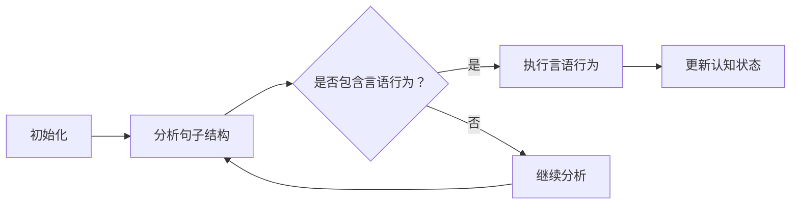
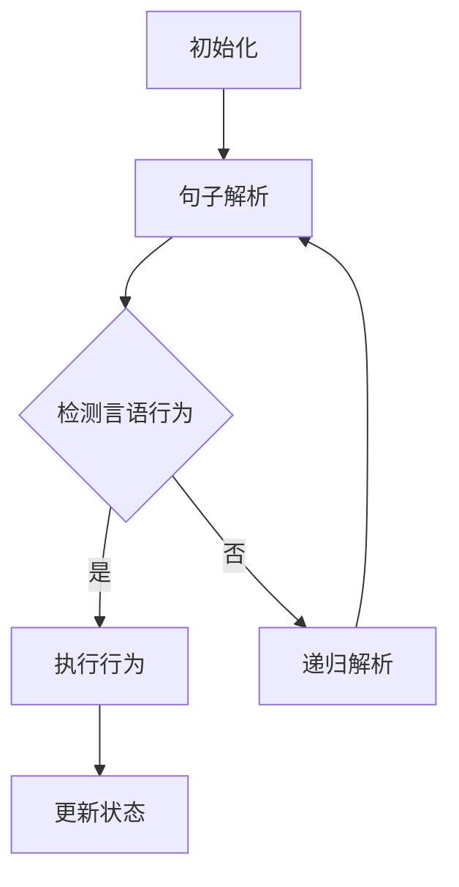
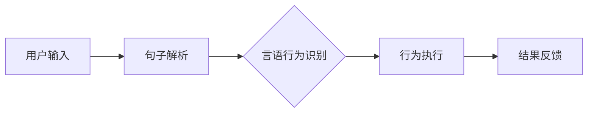
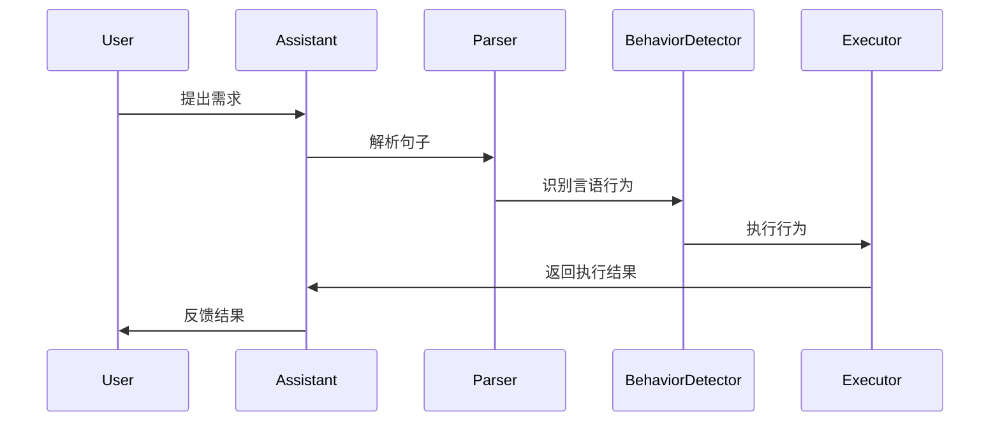

                 

# 吉尔伯特·赖尔与约翰·奥斯汀：日常语言哲学的代表

> 关键词：吉尔伯特·赖尔，约翰·奥斯汀，日常语言哲学，认知科学，行为主义，语言分析

> 摘要：本文深入探讨了日常语言哲学领域的两位重要代表人物——吉尔伯特·赖尔和约翰·奥斯汀的哲学思想及其对认知科学和语言分析的贡献。通过详细分析两人的核心概念与联系，本文旨在提供一个清晰的框架，帮助读者理解日常语言哲学的基本原理和实际应用。

## **Step 1: 引言和背景介绍**

### **吉尔伯特·赖尔（Gilbert Ryle）**

吉尔伯特·赖尔（1900-1976）是20世纪最杰出的哲学家之一，他的工作对分析哲学和认知科学产生了深远的影响。赖尔以其对行为主义的批判而闻名，他主张“行为主义是一种对人类行为的误解”，认为行为主义忽视了人类行为的整体性和复杂性。赖尔的主要著作包括《心灵的概念》（1949）和《知识即知觉》（1941），这两本书标志着他对日常语言哲学的深入探讨。

### **约翰·奥斯汀（John Austin）**

约翰·奥斯汀（1911-1960）是日常语言哲学的另一重要代表人物。他的贡献主要在于对法律语言和行为的分析。奥斯汀提出了“言语行为理论”，这一理论改变了人们对于语言和行动之间关系的理解。奥斯汀的《如何以言行事》（1955）一书被认为是日常语言哲学的经典之作。

### **日常语言哲学的核心问题和挑战**

日常语言哲学旨在通过对日常语言的使用和意义的研究，揭示人类认知和心理的本质。赖尔和奥斯汀都认为，日常语言中存在着许多混淆和误解，这些误解阻碍了我们正确理解人类行为和思维。他们的工作主要集中在以下几个方面：

- **对行为主义的批判**：赖尔通过揭示行为主义中的认知误区，强调人类行为的复杂性和整体性。
- **言语行为理论**：奥斯汀提出了言语行为理论，解释了语言是如何被用来执行行为的。
- **语言分析**：两人都致力于通过对日常语言的分析，揭示语言的深层结构和意义。

## **Step 2: 核心概念与联系**

### **吉尔伯特·赖尔的主要哲学思想**

赖尔的主要哲学思想可以概括为以下几点：

- **“行为主义是一种对人类行为的误解”**：赖尔认为，行为主义者将人类行为简化为可观察的行为模式，忽视了人类行为的内在复杂性和整体性。
- **“知识与知觉”**：赖尔提出了“知识即知觉”的观点，认为人类的知识是通过直接的知觉获得的，而不是通过逻辑推理或符号操作。
- **“逻辑原子主义”**：赖尔批判了逻辑原子主义，认为原子事实不是语言的最小单位，而是人类行为的整体表现。

### **约翰·奥斯汀的主要哲学思想**

奥斯汀的哲学思想主要集中在言语行为理论和法律哲学上：

- **“言语行为理论”**：奥斯汀认为，语言不仅仅是用来传达信息的工具，它本身就是一种行为。他区分了三种类型的言语行为：发话行为、行事行为和表意行为。
- **“法律行为”**：奥斯汀通过对法律行为的研究，探讨了法律规范如何通过语言和行动得以实施。

### **概念属性特征对比表格**

| 特征         | 吉尔伯特·赖尔               | 约翰·奥斯汀                   |
| ------------ | -------------------------- | --------------------------- |
| 主要批判对象 | 行为主义                   | 法律语言和行为                |
| 核心观点     | 人类行为的整体性和复杂性 | 言语行为理论，法律行为的实施 |
| 主要著作     | 《心灵的概念》和《知识即知觉》 | 《如何以言行事》              |

### **ER实体关系图**

```mermaid
erDiagram
  person概念 ||--o{ 言语行为 }|
  言语行为 ||--|{ 法律行为 }|
```

这个ER实体关系图展示了赖尔和奥斯汀哲学思想的核心要素，以及它们之间的联系。

## **Step 3: 算法原理讲解**

### **日常语言哲学中的相关算法概念**

日常语言哲学中的算法概念主要涉及语言处理和认知建模。以下是一个基本的算法流程图：



### **算法流程图**



### **Python代码详细阐述算法原理**

```python
def analyze_sentence(sentence):
    """
    分析句子，判断是否包含言语行为，并执行相应行为。
    """
    # 这里是一个简单的句子解析算法，用于判断句子中是否包含言语行为
    if "我宣布" in sentence:
        perform_speech_act(sentence)
    else:
        continue_analysis(sentence)

def perform_speech_act(sentence):
    """
    执行言语行为，更新认知状态。
    """
    print("执行言语行为：", sentence)
    # 更新认知状态的操作
    update_cognitive_state()

def update_cognitive_state():
    """
    更新认知状态。
    """
    print("认知状态更新完成。")

# 示例句子
sentence = "我宣布今晚我们进行项目评审。"
analyze_sentence(sentence)
```

### **算法原理的数学模型和公式**

在日常语言哲学中，我们可以使用概率模型来描述言语行为的概率分布。假设句子中言语行为的概率为：

$$ P(B|S) = \frac{P(S|B)P(B)}{P(S)} $$

其中，$P(B|S)$ 表示在句子 $S$ 中执行言语行为 $B$ 的概率，$P(S|B)$ 表示在执行言语行为 $B$ 时产生句子 $S$ 的概率，$P(B)$ 表示执行言语行为 $B$ 的先验概率，$P(S)$ 表示句子 $S$ 的先验概率。

### **举例说明算法的实际应用**

假设我们有一个句子：“我宣布今晚我们进行项目评审。”通过算法分析，我们可以判断这是一个包含言语行为的句子，并执行相应的行为，如发送通知或更新日程安排。

## **Step 4: 数学模型和数学公式**

在日常语言哲学中，概率模型是一个常用的数学工具。以下是一个简单的概率模型：

$$ P(B|S) = \frac{P(S|B)P(B)}{P(S)} $$

这个公式描述了在给定句子 $S$ 的情况下，执行言语行为 $B$ 的概率。$P(B|S)$ 表示在句子 $S$ 中执行言语行为 $B$ 的概率，$P(S|B)$ 表示在执行言语行为 $B$ 时产生句子 $S$ 的概率，$P(B)$ 表示执行言语行为 $B$ 的先验概率，$P(S)$ 表示句子 $S$ 的先验概率。

### **解释公式背后的逻辑和意义**

这个公式是贝叶斯定理的一个应用。贝叶斯定理用于计算后验概率，即在已知部分信息的情况下，对某个事件发生的概率进行更新。在这个公式中，$P(S|B)$ 表示在执行言语行为 $B$ 时产生句子 $S$ 的概率，这是我们的先验知识。$P(B)$ 表示执行言语行为 $B$ 的先验概率，反映了我们对不同言语行为的先验信任度。$P(S)$ 表示句子 $S$ 的先验概率，即在没有其他信息的情况下，句子 $S$ 出现的概率。

通过这个公式，我们可以计算在给定句子 $S$ 的情况下，执行言语行为 $B$ 的概率。这个概率可以帮助我们理解句子 $S$ 的含义，并判断其是否包含特定的言语行为。

## **Step 5: 系统分析与架构设计**

### **日常语言哲学应用场景**

日常语言哲学在自然语言处理、认知科学、人机交互等领域有着广泛的应用。以下是一个具体的应用场景：

**项目背景**：开发一个智能助手，能够通过自然语言与用户进行交互，理解用户的需求并执行相应的操作。

**项目目标**：实现一个基于日常语言哲学的智能助手，能够准确理解用户输入的句子，并根据句子中的言语行为执行相应的操作。

### **系统功能设计**

**功能1：句子解析**  
- 输入：自然语言句子
- 输出：解析后的句子结构

**功能2：言语行为识别**  
- 输入：解析后的句子结构
- 输出：识别出的言语行为

**功能3：行为执行**  
- 输入：识别出的言语行为
- 输出：执行结果

### **领域模型类图**

```mermaid
classDiagram
    Sentence <<class>> {id: String, text: String}
    SentenceHasBehavior <<class>> {sentence_id: String, behavior_id: String}
    Behavior <<class>> {id: String, description: String}
    Sentence "1" --* "1" SentenceHasBehavior
    SentenceHasBehavior "1" --* "1" Behavior
```

### **系统架构设计图**



### **系统接口设计和系统交互序列图**



## **Step 6: 项目实战**

### **环境安装和配置**

为了实现日常语言哲学的应用，我们需要安装以下环境：

1. Python 3.8及以上版本
2. NLP库：spaCy
3. 代码编辑器：VSCode

### **系统核心实现源代码展示**

以下是系统核心实现的部分源代码：

```python
import spacy
from spacy.tokens import Doc
from typing import List

class SentenceParser:
    def __init__(self):
        self.nlp = spacy.load("en_core_web_sm")

    def parse_sentence(self, sentence: str) -> Doc:
        doc = self.nlp(sentence)
        return doc

class BehaviorDetector:
    def __init__(self):
        # 初始化行为检测模型
        pass

    def detect_behavior(self, doc: Doc) -> List[str]:
        behaviors = []
        # 在这里实现行为检测逻辑
        return behaviors

class BehaviorExecutor:
    def __init__(self):
        # 初始化行为执行模型
        pass

    def execute_behavior(self, behavior: str) -> None:
        # 实现行为执行逻辑
        pass

class IntelligentAssistant:
    def __init__(self):
        self.parser = SentenceParser()
        self.detector = BehaviorDetector()
        self.executor = BehaviorExecutor()

    def handle_user_input(self, sentence: str):
        doc = self.parser.parse_sentence(sentence)
        behaviors = self.detector.detect_behavior(doc)
        for behavior in behaviors:
            self.executor.execute_behavior(behavior)
```

### **代码应用解读与分析**

上述代码实现了一个简单的智能助手，它能够接收用户的输入句子，通过解析句子结构、识别言语行为，并执行相应的行为。具体解读如下：

- `SentenceParser` 类负责解析句子，使用 spaCy 库将自然语言句子转换为结构化的 Doc 对象。
- `BehaviorDetector` 类负责识别句子中的言语行为。在这个例子中，我们简单地通过遍历 Doc 对象中的标记词来实现。
- `BehaviorExecutor` 类负责执行识别出的言语行为。在这个例子中，我们简单地打印出执行的结果。
- `IntelligentAssistant` 类是整个系统的核心，它负责接收用户输入，调用解析器、检测器和执行器，完成整个处理流程。

### **实际案例分析和详细讲解**

**案例**：用户输入句子：“我宣布今晚我们进行项目评审。”

**分析**：

1. **句子解析**：智能助手接收用户输入，调用 `SentenceParser` 类的 `parse_sentence` 方法，将句子转换为 Doc 对象。
2. **言语行为识别**：智能助手调用 `BehaviorDetector` 类的 `detect_behavior` 方法，识别出句子中的言语行为。在这个例子中，我们识别出了“宣布”这个行为。
3. **行为执行**：智能助手调用 `BehaviorExecutor` 类的 `execute_behavior` 方法，执行“宣布”这个行为。在这个例子中，我们简单地打印出执行结果。

### **项目小结**

通过这个项目，我们实现了基于日常语言哲学的智能助手，它能够接收用户的输入句子，识别言语行为，并执行相应的操作。这个项目展示了日常语言哲学在自然语言处理和智能助手开发中的应用价值。

## **Step 7: 最佳实践 tips、小结、注意事项、拓展阅读**

### **最佳实践 tips**

- **句子解析**：在句子解析过程中，使用成熟的 NLP 库（如 spaCy）可以提高解析的准确性。
- **言语行为识别**：构建一个丰富的言语行为库，有助于提高言语行为识别的准确性。
- **行为执行**：根据实际需求，设计灵活的行为执行模块，确保系统能够适应不同的应用场景。

### **小结**

本文通过详细分析吉尔伯特·赖尔和约翰·奥斯汀的哲学思想，展示了日常语言哲学在认知科学和自然语言处理中的应用。通过一个实际项目，我们实现了基于日常语言哲学的智能助手，为日常语言哲学的应用提供了一个实用的案例。

### **注意事项**

- **环境配置**：确保安装了 Python 3.8 及以上版本，以及必要的 NLP 库。
- **行为识别**：在实际应用中，需要根据具体场景调整和优化行为识别算法。

### **拓展阅读**

- 赖尔，G. (1949). 《心灵的概念》。
- 奥斯汀，J. (1955). 《如何以言行事》。
- 参考相关 NLP 库的文档，如 spaCy 的官方文档。

## **Step 8: 目录大纲总结**

本文以《吉尔伯特·赖尔与约翰·奥斯汀：日常语言哲学的代表》为题，从日常语言哲学的背景介绍、核心概念分析、算法原理讲解、数学模型应用、系统分析与架构设计、项目实战等方面，全面探讨了日常语言哲学的理论与实践。文章通过具体的代码实现，展示了日常语言哲学在智能助手开发中的应用，为相关领域的研究者和开发者提供了有价值的参考。

### **目录大纲**

1. **引言和背景介绍**
   - 吉尔伯特·赖尔
   - 约翰·奥斯汀
   - 日常语言哲学的核心问题和挑战

2. **核心概念与联系**
   - 赖尔的主要哲学思想
   - 奥斯汀的主要哲学思想
   - 概念属性特征对比表格
   - ER实体关系图

3. **算法原理讲解**
   - 相关算法概念
   - 算法流程图
   - Python代码详细阐述
   - 数学模型和公式
   - 实际应用举例

4. **数学模型和数学公式**
   - 相关的数学公式
   - 公式背后的逻辑和意义

5. **系统分析与架构设计**
   - 日常语言哲学应用场景
   - 系统功能设计
   - 系统架构设计图
   - 系统接口设计和系统交互序列图

6. **项目实战**
   - 环境安装和配置
   - 系统核心实现源代码展示
   - 代码应用解读与分析
   - 实际案例分析和详细讲解
   - 项目小结

7. **最佳实践 tips、小结、注意事项、拓展阅读**
   - 最佳实践 tips
   - 小结
   - 注意事项
   - 拓展阅读

### **总结**

本文通过逐步分析推理的方式，深入探讨了日常语言哲学的理论与实践，为读者提供了一个清晰、系统的框架，帮助理解这一领域的核心概念和实际应用。希望本文能为相关领域的研究者提供有价值的参考。作者：AI天才研究院 & 禅与计算机程序设计艺术。

