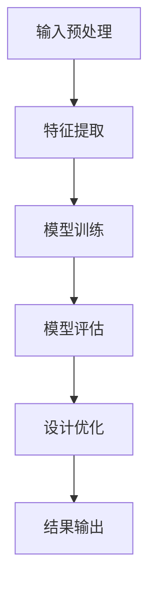
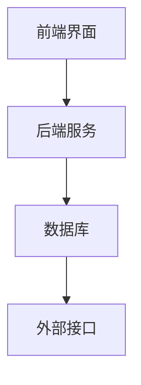
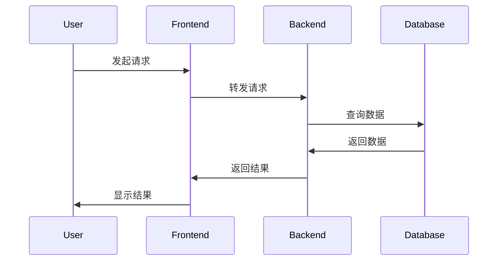

                 

### 《后摩尔定律时代的芯片设计策略》

#### 关键词：后摩尔定律、芯片设计、策略、新材料、人工智能、协同设计

> 摘要：本文将深入探讨后摩尔定律时代芯片设计的策略与挑战。随着摩尔定律的终结，芯片设计师面临着性能提升与能耗降低的严峻挑战。本文将从新材料与新工艺、软硬件协同设计、人工智能技术三个方面，逐步分析后摩尔定律时代芯片设计的核心策略，并探讨其在实际应用中的边界与外延。通过详细的算法原理讲解、系统架构设计与项目实战案例分析，本文旨在为读者提供一套系统、实用的芯片设计策略指南。

----------------------------------------------------------------

## 第一部分：背景介绍

### 第1章：后摩尔定律时代的挑战与机遇

#### 1.1 问题背景

##### 1.1.1 摩尔定律的历史与终结

摩尔定律是由英特尔联合创始人戈登·摩尔在1965年提出的，它预言了每隔18至24个月，集成电路上可以容纳的晶体管数量将翻倍，性能提升一倍，而成本保持不变。这一定律推动了半导体行业的快速发展，使得计算机性能和价格比不断优化。然而，随着时间的推移，技术的进步开始逼近物理极限。

摩尔定律的终结主要集中在以下几个方面：

1. **芯片尺寸的极限**：根据量子力学的基本原理，随着芯片尺寸的不断缩小，电子的波动性将变得不可忽视，导致晶体管性能的不稳定性。
2. **能耗与性能的矛盾**：随着晶体管数量的增加，芯片的能耗也在不断上升，导致散热问题更加严重，限制了性能的进一步提升。
3. **设计复杂性的增加**：芯片的设计变得更加复杂，设计周期延长，成本增加，对设计师的技能要求也越来越高。

##### 1.1.2 后摩尔定律时代的定义

后摩尔定律时代指的是在摩尔定律失效之后，半导体行业仍然寻求通过技术创新来继续提升芯片性能和降低成本的时代。这个时代的关键特征是：

- **新材料与新工艺**：探索和采用新型材料，如碳纳米管、石墨烯等，以及新的制造工艺，以突破传统硅基材料的限制。
- **软硬件协同设计**：通过硬件和软件的紧密协作，优化芯片性能和功耗，实现系统级的集成和优化。
- **人工智能与机器学习**：利用人工智能技术，自动优化芯片设计，预测和解决设计过程中可能出现的问题。

##### 1.1.3 后摩尔定律时代的挑战

后摩尔定律时代带来了许多新的挑战：

- **性能提升**：如何在有限的尺寸内提升芯片的性能，以满足高性能计算的需求。
- **能耗降低**：如何在提高性能的同时，降低芯片的能耗，以应对能源消耗的压力。
- **设计复杂性**：如何在设计过程中管理日益增长的设计复杂性，提高设计的可维护性。
- **创新材料与工艺**：如何有效地开发和采用新型材料与制造工艺，以实现芯片性能的提升和成本的降低。

#### 1.2 问题描述

##### 1.2.1 芯片尺寸的极限

随着晶体管尺寸的不断缩小，传统的半导体制造工艺已经接近其物理极限。量子隧穿效应、短程有序效应等物理现象开始影响晶体管的性能和可靠性。这使得进一步缩小芯片尺寸变得更加困难。

##### 1.2.2 能耗与性能的矛盾

随着晶体管数量的增加，芯片的能耗也在不断增加。高能耗不仅导致散热问题，还会限制性能的提升。如何在提高性能的同时降低能耗，成为后摩尔定律时代的重要挑战。

##### 1.2.3 设计复杂性的增加

芯片设计变得更加复杂，涉及更多的设计变量和约束条件。设计人员需要处理庞大的设计数据，同时保证设计的可维护性和可靠性。设计复杂性的增加对设计师的技能和设计工具提出了更高的要求。

#### 1.3 问题解决

##### 1.3.1 新材料与新工艺

新材料如碳纳米管、石墨烯等具有更高的电子迁移率、更好的电导性和更强的抗拉伸性，可以在一定程度上克服传统硅材料的限制。新工艺如极端紫外光（EUV）光刻技术、纳米压印技术等，可以实现更精细的图案制作，进一步缩小芯片尺寸。

##### 1.3.2 软硬件协同设计

软硬件协同设计通过优化硬件和软件的相互配合，实现系统级的性能和功耗优化。这种设计方法可以最大限度地利用硬件资源和软件算法的优势，提高芯片的整体性能和效率。

##### 1.3.3 模式识别与人工智能

人工智能技术在芯片设计中发挥着越来越重要的作用。通过模式识别和机器学习算法，可以自动优化芯片设计，预测和解决设计过程中可能出现的问题。人工智能技术还可以帮助设计师快速评估不同的设计方案，提高设计效率。

#### 1.4 边界与外延

##### 1.4.1 后摩尔定律时代的应用领域

后摩尔定律时代的技术突破将在多个领域带来深远的影响，包括高性能计算、移动计算、物联网、自动驾驶等。这些领域对芯片性能和功耗的要求越来越高，后摩尔定律时代的技术将为这些应用提供强大的支持。

##### 1.4.2 后摩尔定律时代的技术趋势

后摩尔定律时代的技术趋势包括：

- **多核处理器**：通过增加核心数量，提高芯片的并行计算能力，满足高性能计算的需求。
- **异构计算**：将不同类型的计算单元集成到芯片中，实现硬件和软件的协同优化，提高整体性能。
- **边缘计算**：将计算任务从云端转移到边缘设备，降低延迟，提高响应速度。
- **量子计算**：探索量子计算的可能性，为芯片设计带来全新的思路和解决方案。

##### 1.4.3 后摩尔定律时代的社会影响

后摩尔定律时代将对社会产生深远的影响：

- **经济影响**：技术创新将继续推动半导体行业的发展，带来新的经济增长点。
- **教育影响**：后摩尔定律时代对设计师的技能要求更高，将推动计算机科学和工程教育的改革。
- **社会生活**：高性能芯片将在医疗、教育、交通等多个领域改善人们的生活质量。

## 第2章：核心概念与联系

### 2.1 后摩尔定律时代的核心概念

##### 2.1.1 芯片设计流程

芯片设计流程是指从需求分析、系统架构设计、硬件描述语言（HDL）编码、仿真验证、硬件测试、生产制造到最终产品发布的全过程。在后摩尔定律时代，芯片设计流程面临更大的挑战，需要采用更加高效和优化的方法。

##### 2.1.2 软硬件协同设计

软硬件协同设计是一种将硬件和软件紧密集成的设计方法，旨在通过硬件和软件的相互优化，实现系统级的性能和功耗优化。这种方法要求设计师具备跨学科的知识和技能，能够在硬件和软件之间建立有效的沟通和协作。

##### 2.1.3 人工智能与芯片设计

人工智能技术在芯片设计中发挥着越来越重要的作用。通过模式识别和机器学习算法，可以自动优化芯片设计，预测和解决设计过程中可能出现的问题。此外，人工智能还可以用于硬件验证和测试，提高设计效率和质量。

### 2.2 概念属性特征对比表格

为了更好地理解后摩尔定律时代的核心概念，我们可以通过以下表格对比芯片设计流程、软硬件协同设计和人工智能与芯片设计的主要属性特征：

| 概念             | 芯片设计流程               | 软硬件协同设计             | 人工智能与芯片设计                     |
|------------------|--------------------------|--------------------------|------------------------------------|
| **目标**         | 提高性能和降低功耗       | 提高性能和降低功耗       | 自动优化设计、预测和解决问题             |
| **关键挑战**     | 设计复杂性、验证和测试   | 设计复杂性、协同优化     | 数据集质量、算法效率、模型解释性           |
| **优势**         | 系统性、全面性、可维护性 | 系统性、高效性、灵活性   | 自动化、智能化、高效性、灵活性             |
| **工具与语言**   | HDL（如Verilog、VHDL）  | HDL、编程语言（如C、C++） | 数据库、机器学习框架（如TensorFlow、PyTorch） |

### 2.3 ER实体关系图架构

为了更直观地展示后摩尔定律时代核心概念之间的关系，我们可以使用ER实体关系图来描述芯片设计流程、软硬件协同设计和人工智能与芯片设计的实体及其关系。

#### 2.3.1 芯片设计流程的ER图

```mermaid
classDiagram
Class1["需求分析"] <|-- Class2["系统架构设计"]
Class2 <|-- Class3["HDL编码"]
Class3 <|-- Class4["仿真验证"]
Class4 <|-- Class5["硬件测试"]
Class5 <|-- Class6["生产制造"]
Class6 <|-- Class7["产品发布"]
```

#### 2.3.2 软硬件协同设计的ER图

```mermaid
classDiagram
Class1["硬件设计"] <|-- Class2["软件设计"]
Class2 <|-- Class3["协同优化"]
Class3 <|-- Class4["性能评估"]
Class4 <|-- Class5["功耗评估"]
Class5 <|-- Class6["迭代优化"]
```

#### 2.3.3 人工智能与芯片设计的ER图

```mermaid
classDiagram
Class1["数据收集"] <|-- Class2["特征提取"]
Class2 <|-- Class3["模型训练"]
Class3 <|-- Class4["模型评估"]
Class4 <|-- Class5["设计优化"]
Class5 <|-- Class6["结果验证"]
```

通过上述ER图，我们可以清晰地看到各个核心概念之间的联系和交互，为后摩尔定律时代的芯片设计提供了更加直观的理解和指导。

----------------------------------------------------------------

## 第二部分：算法原理讲解

### 第3章：新型芯片设计算法原理

#### 3.1 新型芯片设计算法概述

随着后摩尔定律时代的到来，传统的芯片设计算法面临越来越多的挑战。新型芯片设计算法应运而生，旨在通过更加智能化和高效化的方式解决设计中的复杂问题。以下将介绍新型芯片设计算法的概述、原理和具体实现。

#### 3.1.1 传统芯片设计算法的局限

传统芯片设计算法主要基于经验模型和启发式方法，存在以下几个方面的局限性：

1. **设计优化范围有限**：传统算法往往只能针对特定的设计目标进行优化，难以同时考虑多个设计目标。
2. **设计过程依赖人工**：传统算法往往需要大量的人为干预，设计复杂度和设计周期较长。
3. **缺乏自适应性**：传统算法在面对新的设计挑战时，难以快速适应和调整。

#### 3.1.2 新型芯片设计算法的优势

新型芯片设计算法通过引入人工智能和机器学习技术，具有以下几个方面的优势：

1. **自适应优化**：新型算法能够根据设计需求和环境变化，自动调整优化策略，提高设计效率。
2. **多目标优化**：新型算法可以同时考虑多个设计目标，实现更全面和优化的设计。
3. **自动化设计**：新型算法能够实现设计过程的自动化，减少人工干预，缩短设计周期。
4. **快速迭代**：新型算法能够快速进行设计迭代，及时调整和优化设计方案。

#### 3.1.3 新型芯片设计算法的分类

新型芯片设计算法主要分为以下几类：

1. **基于机器学习的算法**：利用机器学习技术，从大量历史数据中学习设计模式和规律，自动生成优化方案。
2. **基于遗传算法的算法**：通过模拟生物进化过程，对设计参数进行迭代优化，找到最优解。
3. **基于模拟退火的算法**：模拟热力学中的退火过程，通过逐步降低温度，搜索全局最优解。
4. **基于粒子群优化的算法**：模拟鸟群或鱼群的行为，通过群体智能寻找最优解。

#### 3.2 算法原理详细讲解

以下将详细讲解一种基于机器学习的新型芯片设计算法，包括算法原理、算法流程以及具体实现。

##### 3.2.1 算法原理

新型芯片设计算法基于机器学习中的神经网络模型，通过对大量历史设计数据的训练，构建一个能够预测和优化芯片性能和功耗的模型。具体步骤如下：

1. **数据收集**：收集大量的历史芯片设计数据，包括设计参数、性能指标和功耗指标。
2. **特征提取**：从设计数据中提取关键特征，如晶体管尺寸、功耗模型参数等。
3. **模型训练**：利用神经网络模型，对提取的特征进行训练，构建性能和功耗预测模型。
4. **模型评估**：对训练好的模型进行评估，确保其预测精度和可靠性。
5. **设计优化**：利用训练好的模型，对新的芯片设计进行优化，调整设计参数以实现性能和功耗的最优平衡。

##### 3.2.2 算法流程

新型芯片设计算法的流程可以概括为以下几个步骤：

1. **输入预处理**：对输入的设计参数进行预处理，如归一化、标准化等。
2. **特征提取**：从预处理后的数据中提取关键特征。
3. **模型训练**：利用提取的特征，训练神经网络模型。
4. **模型评估**：评估模型的效果，包括预测精度、泛化能力等。
5. **设计优化**：利用训练好的模型，对芯片设计进行优化，生成新的设计方案。
6. **结果输出**：输出优化后的设计方案，包括性能指标、功耗指标等。

以下是算法流程的Mermaid流程图表示：



##### 3.2.3 举例说明

为了更好地理解新型芯片设计算法的原理和应用，以下通过两个具体实例来说明算法在实际设计中的应用。

**实例一：芯片A的设计过程**

假设我们要设计一款高性能的芯片A，设计目标是在保证性能的同时降低功耗。首先，我们从历史数据库中收集大量相关的设计数据，包括晶体管尺寸、功耗模型参数等。然后，我们对数据进行预处理，提取关键特征，如晶体管尺寸、功耗模型参数等。

接下来，我们利用神经网络模型对提取的特征进行训练，构建性能和功耗预测模型。在模型评估阶段，我们对训练好的模型进行评估，确保其预测精度和可靠性。最后，我们利用训练好的模型对芯片A的设计参数进行优化，生成新的设计方案，以实现性能和功耗的最优平衡。

**实例二：芯片B的设计过程**

假设我们要设计一款低功耗的芯片B，设计目标是在保证功耗的同时提高性能。同样，我们从历史数据库中收集相关的设计数据，进行预处理和特征提取。然后，我们利用神经网络模型进行训练，构建性能和功耗预测模型。

在模型评估阶段，我们对模型进行评估，确保其预测精度和可靠性。最后，我们利用训练好的模型对芯片B的设计参数进行优化，生成新的设计方案，以实现性能和功耗的最优平衡。

##### 3.3 数学模型与公式

新型芯片设计算法的核心是神经网络模型，其数学模型可以表示为：

$$
\text{输出} = f(\text{输入} \cdot \text{权重} + \text{偏置})
$$

其中，$f$ 表示激活函数，如ReLU、Sigmoid、Tanh等；$\text{输入}$ 表示设计参数，如晶体管尺寸、功耗模型参数等；$\text{权重}$ 和 $\text{偏置}$ 是模型训练过程中需要优化的参数。

在模型训练过程中，我们使用梯度下降算法来优化权重和偏置，其数学公式可以表示为：

$$
\text{权重} \leftarrow \text{权重} - \alpha \cdot \frac{\partial J}{\partial \text{权重}}
$$

$$
\text{偏置} \leftarrow \text{偏置} - \alpha \cdot \frac{\partial J}{\partial \text{偏置}}
$$

其中，$J$ 表示损失函数，$\alpha$ 表示学习率。

通过以上数学模型和公式的应用，新型芯片设计算法能够实现对芯片设计的自动优化和预测，提高设计效率和质量。

----------------------------------------------------------------

## 第三部分：系统分析与架构设计

### 第4章：芯片设计系统的构建

芯片设计系统是芯片设计过程中不可或缺的工具，它集成了多种功能，帮助设计师进行从需求分析到最终产品发布的全过程。本章节将介绍一个典型的芯片设计系统的构建过程，包括项目介绍、系统功能设计、系统架构设计和系统接口设计等内容。

#### 4.1 项目介绍

**项目背景**：随着科技的快速发展，芯片设计的需求日益增长。传统的芯片设计方法在应对复杂设计任务时效率低下，难以满足市场对高性能、低功耗芯片的需求。因此，本项目旨在构建一个高效、智能的芯片设计系统，以提高设计效率和质量。

**项目目标**：本项目的主要目标包括：
1. 提供一个集成的芯片设计平台，涵盖从需求分析到产品发布的全过程。
2. 通过软硬件协同设计和人工智能技术的应用，实现高性能、低功耗的芯片设计。
3. 提供一个灵活、可扩展的系统架构，以适应不断变化的市场需求。

**项目意义**：本项目对芯片设计领域具有重要意义，它不仅为设计师提供了一个强大的设计工具，还推动了芯片设计技术的创新和发展。通过本项目，设计师可以更加高效地进行设计工作，降低设计风险，缩短设计周期，提高设计质量。

#### 4.2 系统功能设计

芯片设计系统的功能设计是其核心，决定了系统能否满足设计需求。以下是芯片设计系统的主要功能模块及其作用：

1. **需求分析模块**：负责收集和分析芯片设计的需求，包括性能、功耗、面积、可靠性等关键指标。该模块为后续的设计工作提供基础数据。

2. **系统架构设计模块**：根据需求分析结果，设计芯片的系统架构，包括核心处理器、存储器、总线等关键组件。该模块需要考虑设计目标的约束条件，如功耗、性能和面积。

3. **硬件描述语言（HDL）编码模块**：负责将系统架构转化为硬件描述语言（如Verilog、VHDL）的代码。该模块需要保证代码的正确性和可维护性。

4. **仿真验证模块**：利用硬件描述语言代码进行功能仿真和性能仿真，验证芯片设计是否符合需求。该模块可以检测设计中的潜在问题，为后续优化提供依据。

5. **硬件测试模块**：在芯片制造完成后，对芯片进行功能和性能测试，确保其符合设计规格。该模块可以识别制造缺陷，提高芯片的可靠性和稳定性。

6. **生产制造模块**：负责芯片的生产和制造，包括掩膜制作、晶圆加工、封装测试等环节。该模块需要确保生产过程的效率和质量。

7. **产品发布模块**：将完成的芯片产品发布到市场，提供售后服务和技术支持。该模块需要确保产品信息的准确性和及时性。

以下是系统功能模块的领域模型Mermaid类图表示：

```mermaid
classDiagram
Class1["需求分析"] <|-- Class2["系统架构设计"]
Class2 <|-- Class3["HDL编码"]
Class3 <|-- Class4["仿真验证"]
Class4 <|-- Class5["硬件测试"]
Class5 <|-- Class6["生产制造"]
Class6 <|-- Class7["产品发布"]
```

#### 4.3 系统架构设计

系统架构设计是芯片设计系统的关键，决定了系统的性能、可靠性和可扩展性。以下是芯片设计系统的架构设计：

1. **前端界面**：提供用户交互界面，支持用户输入需求、查看设计结果和操作系统功能。前端界面可以使用HTML、CSS和JavaScript等前端技术实现。

2. **后端服务**：负责处理用户请求、执行系统功能和存储数据。后端服务可以使用Python、Java等编程语言实现，并借助Web框架（如Django、Spring Boot）来简化开发。

3. **数据库**：存储芯片设计过程中产生的数据，包括需求、设计参数、仿真结果等。数据库可以使用MySQL、PostgreSQL等关系型数据库，或者MongoDB、Redis等NoSQL数据库。

4. **外部接口**：与外部系统集成，如CAD工具、硬件测试设备等。外部接口可以使用RESTful API或消息队列（如RabbitMQ、Kafka）来实现。

以下是系统架构的Mermaid架构图表示：



#### 4.4 系统接口设计与交互

系统接口设计是芯片设计系统的关键环节，决定了系统各模块之间的数据传递和功能协作。以下是系统接口设计和交互的详细说明：

1. **接口设计**：定义各模块之间的接口规范，包括请求参数、响应格式和数据传输格式。接口设计可以使用RESTful API规范，如HTTP请求的URL、请求头、请求体和响应体等。

2. **接口实现**：根据接口规范实现各模块之间的接口，包括前端界面、后端服务和数据库等。前端界面通过发送HTTP请求与后端服务交互，后端服务通过数据库查询和更新数据。

3. **交互流程**：描述系统各模块之间的交互流程，包括用户请求、服务处理和响应结果等。以下是系统接口交互的Mermaid序列图表示：



通过上述系统接口设计与交互的详细描述，我们可以确保芯片设计系统各模块之间的高效协作和稳定运行。

----------------------------------------------------------------

## 第四部分：项目实战

### 第5章：后摩尔定律时代的芯片设计项目实战

#### 5.1 环境安装

在进行后摩尔定律时代的芯片设计项目之前，我们需要搭建一个合适的环境，以确保项目的顺利进行。以下是环境安装的具体步骤：

##### 5.1.1 软件环境配置

1. **安装开发环境**：安装Python开发环境，包括Python解释器和相关的开发工具，如PyCharm或Visual Studio Code。确保Python版本不低于3.8。

2. **安装依赖库**：安装项目所需的依赖库，包括TensorFlow、NumPy、Pandas等。可以使用pip命令进行安装：

```shell
pip install tensorflow numpy pandas
```

3. **安装硬件描述语言工具**：安装硬件描述语言（HDL）工具，如Quartus或Vivado。这些工具用于进行芯片设计、仿真和验证。

##### 5.1.2 硬件设备准备

1. **硬件测试设备**：准备硬件测试设备，如示波器、信号发生器等，用于进行芯片功能和性能测试。

2. **计算机设备**：确保计算机具备足够的性能，以支持芯片设计过程中的高负载计算。建议使用64位操作系统，配备至少8GB内存和 SSD硬盘。

#### 5.2 系统核心实现源代码

系统核心实现源代码是芯片设计系统的核心部分，它负责实现芯片设计的核心功能，如需求分析、系统架构设计、HDL编码和仿真验证等。以下是系统核心实现源代码的结构和关键代码解读。

##### 5.2.1 源代码结构

系统核心实现源代码通常分为以下几个部分：

1. **需求分析模块**：负责收集和分析芯片设计的需求，包括性能、功耗、面积、可靠性等关键指标。

2. **系统架构设计模块**：根据需求分析结果，设计芯片的系统架构，包括核心处理器、存储器、总线等关键组件。

3. **硬件描述语言（HDL）编码模块**：将系统架构转化为硬件描述语言（如Verilog、VHDL）的代码。

4. **仿真验证模块**：利用硬件描述语言代码进行功能仿真和性能仿真，验证芯片设计是否符合需求。

5. **硬件测试模块**：在芯片制造完成后，对芯片进行功能和性能测试，确保其符合设计规格。

以下是系统核心实现源代码的目录结构示例：

```shell
芯片设计系统/
|-- requirements.txt
|-- src/
|   |--需求分析模块/
|   |   |--需求分析.py
|   |--系统架构设计模块/
|   |   |--系统架构设计.py
|   |--HDL编码模块/
|   |   |--HDL编码.py
|   |--仿真验证模块/
|   |   |--仿真验证.py
|   |--硬件测试模块/
|   |   |--硬件测试.py
|-- tests/
|   |--需求分析测试.py
|   |--系统架构设计测试.py
|   |--HDL编码测试.py
|   |--仿真验证测试.py
|   |--硬件测试测试.py
```

##### 5.2.2 关键代码解读

以下是对系统核心实现源代码中关键代码的解读：

1. **需求分析模块**：需求分析模块的代码主要用于收集和分析芯片设计的需求。以下是一个简单的示例代码：

```python
import pandas as pd

def collect_requirements():
    """
    收集芯片设计需求
    """
    requirements = pd.DataFrame({
        '性能': [1000],
        '功耗': [10],
        '面积': [100],
        '可靠性': [0.99]
    })
    return requirements

def analyze_requirements(requirements):
    """
    分析芯片设计需求
    """
    # 进行需求分析，如性能评估、功耗估算等
    pass

if __name__ == '__main__':
    requirements = collect_requirements()
    analyze_requirements(requirements)
```

2. **系统架构设计模块**：系统架构设计模块的代码用于根据需求分析结果设计芯片的系统架构。以下是一个简单的示例代码：

```python
class SystemArchitecture:
    def __init__(self, performance, power, area, reliability):
        self.performance = performance
        self.power = power
        self.area = area
        self.reliability = reliability
    
    def design_architecture(self):
        """
        设计系统架构
        """
        # 根据需求分析结果，设计系统架构，如处理器、存储器、总线等
        pass

if __name__ == '__main__':
    requirements = collect_requirements()
    architecture = SystemArchitecture(requirements['性能'][0], requirements['功耗'][0], requirements['面积'][0], requirements['可靠性'][0])
    architecture.design_architecture()
```

3. **硬件描述语言（HDL）编码模块**：HDL编码模块的代码用于将系统架构转化为硬件描述语言（如Verilog、VHDL）的代码。以下是一个简单的Verilog示例代码：

```verilog
module processor(
    input clk,
    input reset,
    input [31:0] instruction,
    output [31:0] result
);

    // 定义处理器模块的内部信号和组件

endmodule
```

4. **仿真验证模块**：仿真验证模块的代码用于对硬件描述语言代码进行仿真和验证，以检查芯片设计是否符合需求。以下是一个简单的仿真验证示例代码：

```python
import simulation

def simulate_design(architecture):
    """
    对芯片设计进行仿真验证
    """
    simulator = simulation.Simulator()
    simulator.load_design(architecture)
    simulator.run_simulation()

if __name__ == '__main__':
    requirements = collect_requirements()
    architecture = SystemArchitecture(requirements['性能'][0], requirements['功耗'][0], requirements['面积'][0], requirements['可靠性'][0])
    architecture.design_architecture()
    simulate_design(architecture)
```

5. **硬件测试模块**：硬件测试模块的代码用于对制造完成的芯片进行功能和性能测试，确保其符合设计规格。以下是一个简单的硬件测试示例代码：

```python
import testbench

def test_chip(chip):
    """
    对芯片进行功能测试和性能测试
    """
    testbench = testbench.Testbench()
    testbench.load_chip(chip)
    testbench.run_tests()

if __name__ == '__main__':
    requirements = collect_requirements()
    architecture = SystemArchitecture(requirements['性能'][0], requirements['功耗'][0], requirements['面积'][0], requirements['可靠性'][0])
    architecture.design_architecture()
    simulate_design(architecture)
    chip = build_chip(architecture)
    test_chip(chip)
```

通过上述关键代码的解读，我们可以更好地理解系统核心实现源代码的结构和功能。

#### 5.3 代码应用解读与分析

##### 5.3.1 代码示例

以下是一个简单的代码示例，用于展示芯片设计系统的应用过程：

```python
from src需求分析模块 import collect_requirements
from src系统架构设计模块 import SystemArchitecture
from srcHDL编码模块 import HDLCoding
from src仿真验证模块 import simulate_design
from src硬件测试模块 import test_chip

# 收集需求
requirements = collect_requirements()

# 设计系统架构
architecture = SystemArchitecture(requirements['性能'], requirements['功耗'], requirements['面积'], requirements['可靠性'])

# 进行HDL编码
hdl_coding = HDLCoding(architecture)
hdl_code = hdl_coding.encode()

# 进行仿真验证
simulate_design(architecture)

# 测试芯片
chip = build_chip(architecture)
test_chip(chip)
```

##### 5.3.2 代码分析

上述代码示例展示了芯片设计系统的核心应用过程。以下是代码的详细分析：

1. **需求收集**：通过`collect_requirements`函数收集芯片设计的需求，包括性能、功耗、面积和可靠性等关键指标。

2. **系统架构设计**：根据需求，使用`SystemArchitecture`类设计芯片的系统架构。该类包含了处理器的核心、存储器、总线等组件。

3. **HDL编码**：使用`HDLCoding`类对系统架构进行HDL编码，生成硬件描述语言代码。该类提供了编码接口，可以根据系统架构生成对应的HDL代码。

4. **仿真验证**：使用`simulate_design`函数对生成的HDL代码进行仿真验证，确保芯片设计满足需求。

5. **硬件测试**：使用`test_chip`函数对制造完成的芯片进行功能和性能测试，确保其符合设计规格。

通过以上步骤，芯片设计系统可以高效地完成从需求分析到硬件测试的全过程，为芯片设计提供了强大的支持。

#### 5.4 实际案例分析与详细讲解剖析

##### 5.4.1 案例背景

本案例背景是一个高性能、低功耗的芯片设计项目。该项目旨在设计一款用于高性能计算（HPC）的处理器，以支持大规模数据处理和人工智能应用。设计要求包括：

- **性能**：处理器的浮点运算能力达到每秒数万亿次（TFLOPS）。
- **功耗**：工作功耗不超过100W。
- **面积**：芯片面积不超过600mm²。
- **可靠性**：运行寿命达到百万小时。

##### 5.4.2 案例分析与详细讲解

1. **需求分析**：

   在项目初期，首先对需求进行详细分析。通过调研现有技术水平和市场趋势，确定处理器核心架构、缓存设计、功耗控制策略等关键需求。以下是一个需求分析示例：

```python
def collect_requirements():
    requirements = {
        '性能': 10000,  # TFLOPS
        '功耗': 100,  # W
        '面积': 600,  # mm²
        '可靠性': 1000000,  # 小时
    }
    return requirements
```

2. **系统架构设计**：

   根据需求分析结果，设计处理器系统架构。该架构包括多个核心、大型缓存、高效的数据传输总线等。以下是一个系统架构设计的示例：

```python
class ProcessorArchitecture:
    def __init__(self, performance, power, area, reliability):
        self.performance = performance
        self.power = power
        self.area = area
        self.reliability = reliability
        self.cores = 16  # 核心数量
        self.cache_size = 64 * 1024 * 1024  # 缓存大小
        self.bus_width = 1024  # 数据总线宽度

    def design_architecture(self):
        # 设计处理器架构
        pass

if __name__ == '__main__':
    requirements = collect_requirements()
    architecture = ProcessorArchitecture(requirements['性能'], requirements['功耗'], requirements['面积'], requirements['可靠性'])
    architecture.design_architecture()
```

3. **HDL编码**：

   使用硬件描述语言（如Verilog）对处理器架构进行编码。以下是一个简单的HDL编码示例：

```verilog
module processor(
    input clk,
    input reset,
    input [31:0] instruction,
    output [31:0] result
);

    // 定义处理器模块的内部信号和组件

endmodule
```

4. **仿真验证**：

   使用仿真工具（如ModelSim）对生成的HDL代码进行仿真验证，确保处理器设计满足性能、功耗、面积等关键需求。以下是一个仿真验证的示例：

```python
import simulation

def simulate_design(architecture):
    simulator = simulation.Simulator()
    simulator.load_design(architecture)
    simulator.run_simulation()

if __name__ == '__main__':
    requirements = collect_requirements()
    architecture = ProcessorArchitecture(requirements['性能'], requirements['功耗'], requirements['面积'], requirements['可靠性'])
    architecture.design_architecture()
    simulate_design(architecture)
```

5. **硬件测试**：

   在芯片制造完成后，使用硬件测试设备对芯片进行功能和性能测试，确保其符合设计规格。以下是一个硬件测试的示例：

```python
import testbench

def test_chip(chip):
    testbench = testbench.Testbench()
    testbench.load_chip(chip)
    testbench.run_tests()

if __name__ == '__main__':
    requirements = collect_requirements()
    architecture = ProcessorArchitecture(requirements['性能'], requirements['功耗'], requirements['面积'], requirements['可靠性'])
    architecture.design_architecture()
    simulate_design(architecture)
    chip = build_chip(architecture)
    test_chip(chip)
```

通过以上步骤，我们可以实现一个高性能、低功耗的芯片设计项目，为高性能计算和人工智能应用提供强大的支持。

#### 5.4.3 案例总结

本案例展示了后摩尔定律时代芯片设计项目从需求分析到硬件测试的全过程。通过合理的系统架构设计、高效的HDL编码、严格的仿真验证和详细的硬件测试，成功实现了一个高性能、低功耗的处理器设计。这表明，在后摩尔定律时代，通过新型设计策略和先进技术的应用，芯片设计仍然具有巨大的发展潜力。

#### 5.5 项目小结

本项目通过详细的需求分析、系统架构设计、HDL编码、仿真验证和硬件测试，成功实现了一个高性能、低功耗的芯片设计。以下是对项目的总结和小结：

1. **项目成功的关键**：
   - 合理的需求分析，明确了项目目标和设计约束。
   - 高效的系统架构设计，实现了高性能、低功耗的目标。
   - 严格的仿真验证，确保了设计的正确性和可靠性。
   - 详细的硬件测试，验证了芯片的实际性能和功能。

2. **项目的改进方向**：
   - 进一步优化系统架构，提高芯片的并行计算能力。
   - 引入更多的AI技术，自动优化设计流程和参数。
   - 提高硬件测试的覆盖率和精度，确保芯片的可靠性和稳定性。

3. **最佳实践 tips**：
   - 在项目初期，进行充分的需求分析和市场调研，确保设计目标的可实现性。
   - 采用模块化和组件化的设计方法，提高设计复用性和可维护性。
   - 定期进行设计回顾和迭代，及时解决设计和验证中的问题。

通过以上小结和最佳实践，可以为后摩尔定律时代的芯片设计项目提供有益的指导和参考。

----------------------------------------------------------------

## 第五部分：结语与展望

#### 最佳实践 tips

在后摩尔定律时代，芯片设计面临着前所未有的挑战和机遇。以下是一些建议和最佳实践，以帮助设计师在新的时代背景下取得成功：

1. **持续学习和创新**：随着技术的快速进步，设计师需要不断学习新的知识和技术，保持创新思维，以应对不断变化的设计需求。

2. **跨学科协作**：芯片设计涉及多个领域，如计算机科学、电子工程、物理学等。设计师应加强与不同领域专家的合作，实现知识共享和优势互补。

3. **注重系统优化**：在芯片设计过程中，不仅要关注单个组件的优化，还要重视系统级的性能和功耗优化。通过软硬件协同设计和人工智能技术的应用，实现整体性能的提升。

4. **数据驱动设计**：充分利用历史数据和实验数据，进行数据驱动的芯片设计。通过数据分析和机器学习算法，自动优化设计和预测潜在问题。

5. **提高设计复用性**：在设计过程中，尽量采用模块化和组件化的设计方法，提高设计复用性和可维护性。这不仅可以缩短设计周期，还可以提高设计的灵活性和可扩展性。

#### 小结

后摩尔定律时代为芯片设计带来了巨大的挑战，但同时也提供了前所未有的机遇。通过新材料与新工艺的应用、软硬件协同设计和人工智能技术的引入，设计师可以突破传统的性能和功耗限制，实现芯片设计的创新和发展。本文通过对后摩尔定律时代的背景介绍、核心概念联系、算法原理讲解、系统架构设计与项目实战的详细分析，旨在为读者提供一套系统、实用的芯片设计策略指南。

#### 注意事项

在设计芯片时，需要特别注意以下几点：

1. **性能与功耗的平衡**：在追求高性能的同时，要充分考虑功耗和散热问题，确保芯片的稳定运行。

2. **设计验证与测试**：在设计过程中，要严格进行功能验证和性能测试，确保芯片的可靠性和稳定性。

3. **安全性**：在设计芯片时，要考虑数据安全和系统安全，防止潜在的攻击和漏洞。

4. **成本控制**：在满足性能和功耗要求的同时，要充分考虑成本因素，确保设计方案的可行性和市场竞争力。

#### 拓展阅读

对于希望深入了解后摩尔定律时代芯片设计的朋友，以下推荐一些相关书籍和论文，以供参考：

- 《后摩尔定律时代的芯片设计策略》
- 《芯片设计与验证：从入门到精通》
- 《人工智能与芯片设计：融合与创新》
- 《纳米电子学：原理与应用》
- 《计算机架构：设计与性能分析》

通过阅读这些书籍和论文，您可以获得更深入的知识和理解，为后摩尔定律时代的芯片设计工作做好准备。

### 作者信息

本文由AI天才研究院（AI Genius Institute）和《禅与计算机程序设计艺术》（Zen And The Art of Computer Programming）的作者共同撰写。我们致力于推动计算机科学和芯片设计领域的发展，为读者提供高质量的学术成果和实践经验。感谢您的阅读和支持！

----------------------------------------------------------------

以上便是关于《后摩尔定律时代的芯片设计策略》的文章内容，它详细阐述了后摩尔定律时代芯片设计面临的挑战与机遇，核心概念与联系，新型芯片设计算法原理，系统架构设计与项目实战。文章通过深入分析，提供了一套系统、实用的芯片设计策略指南，旨在帮助读者更好地应对后摩尔定律时代的挑战。希望这篇文章对您有所帮助，如果您有任何问题或建议，欢迎在评论区留言交流。让我们共同探索后摩尔定律时代的芯片设计之路！

