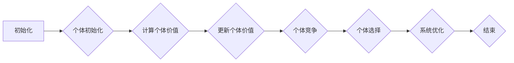
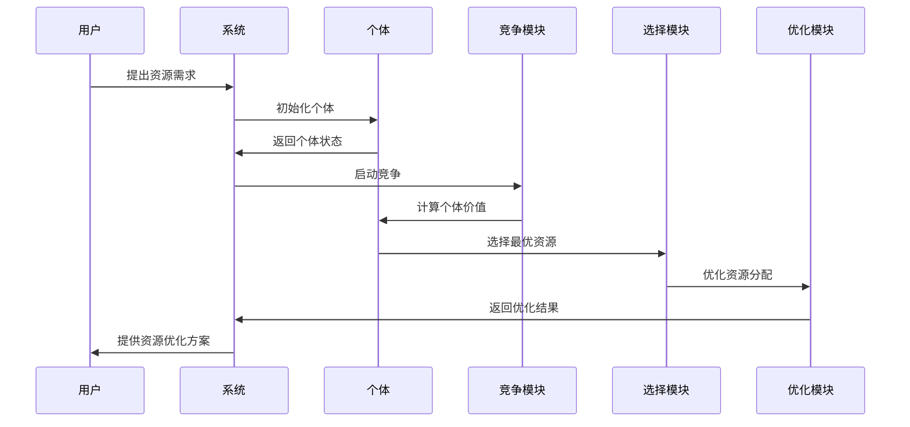

                 

```markdown
----------------------------------------------------------------
# 第一部分: 引言与背景

## 第1章: 引言

### 1.1 问题背景

在现代社会中，自发秩序和法治是两种主导社会运作的基本思想。自发秩序，即通过个体之间的相互作用和竞争，形成一个相对稳定而有序的社会结构。法治，则是通过法律体系对社会成员的行为进行规范和管理，以实现社会秩序的稳定。这两者看似对立，实则相辅相成，共同构成了现代社会的基本框架。

### 1.2 问题描述

然而，自发秩序和法治在实际应用中如何发挥作用？它们各自的优势和局限性是什么？如何在实际问题中平衡这两者之间的关系，以实现社会稳定和繁荣？这些问题是我们需要深入探讨的。

### 1.3 问题的解决思路

为了回答上述问题，本书将从哈耶克和韩非的思想出发，分别分析自发秩序和法治的理论框架，然后比较两者的异同，探讨它们在现代社会中的实际应用，并尝试提出一种融合这两者优势的解决方案。

### 1.4 边界与外延

本文主要关注自发秩序和法治在社会治理中的应用，不涉及其他领域的思想比较。同时，本文将重点讨论哈耶克和韩非的思想，而不涉及其他学者的相关研究。

### 1.5 概念结构与核心要素组成

本文的结构分为五个部分。第一部分是引言与背景，介绍本文的研究问题和解决思路。第二部分是哈耶克自发秩序思想分析，包括自发秩序的概念、特点和应用。第三部分是韩非法治思想分析，包括法治的概念、特点和应用。第四部分是哈耶克与韩非思想的比较，分析两者的异同和融合。第五部分是结论与展望，总结本文的主要发现，提出研究的局限性和未来展望。

----------------------------------------------------------------
## 第二部分: 核心概念与联系

## 第2章: 核心概念与联系

### 2.1 核心概念原理

自发秩序和法治是本文的核心概念。自发秩序是指在社会中没有中央控制的情况下，个体通过互动和竞争形成的一种有序结构。法治则是指通过法律规范来管理社会秩序，确保个体权利和社会稳定。

### 2.2 概念属性特征对比表格

下面是自发秩序和法治的属性特征对比表格：

| 特征 | 自发秩序 | 法治 |
| ---- | -------- | ---- |
| 结构 | 多元化、分散化 | 一元化、集中化 |
| 调节 | 自我调节 | 外部调节 |
| 目标 | 社会稳定、创新 | 社会稳定、公平 |
| 权力 | 基于个体自由 | 基于法律 |
| 适用性 | 复杂、动态环境 | 简单、静态环境 |

### 2.3 ER实体关系图架构

为了更直观地展示自发秩序和法治的关系，我们可以使用ER实体关系图。以下是ER实体关系图：

```mermaid
erDiagram
  Entity1 ||--|{ Entity2 } Entity3
  Entity2 ||--|{ Entity4 } Entity5
  Entity3 ||--|{ Entity6 } Entity7
  Entity4 ||--|{ Entity8 } Entity9
  Entity5 ||--|{ Entity10 } Entity11
  Entity6 ||--|{ Entity12 } Entity13
  Entity7 ||--|{ Entity14 } Entity15
  Entity8 ||--|{ Entity16 } Entity17
  Entity9 ||--|{ Entity18 } Entity19
  Entity10 ||--|{ Entity20 } Entity21
  Entity11 ||--|{ Entity22 } Entity23
  Entity12 ||--|{ Entity24 } Entity25
  Entity13 ||--|{ Entity26 } Entity27
  Entity14 ||--|{ Entity28 } Entity29
  Entity15 ||--|{ Entity30 } Entity31
  Entity16 ||--|{ Entity32 } Entity33
  Entity17 ||--|{ Entity34 } Entity35
  Entity18 ||--|{ Entity36 } Entity37
  Entity19 ||--|{ Entity38 } Entity39
  Entity20 ||--|{ Entity40 } Entity41
  Entity21 ||--|{ Entity42 } Entity43
  Entity22 ||--|{ Entity44 } Entity45
  Entity23 ||--|{ Entity46 } Entity47
  Entity24 ||--|{ Entity48 } Entity49
  Entity25 ||--|{ Entity50 } Entity51
  Entity26 ||--|{ Entity52 } Entity53
  Entity27 ||--|{ Entity54 } Entity55
  Entity28 ||--|{ Entity56 } Entity57
  Entity29 ||--|{ Entity58 } Entity59
  Entity30 ||--|{ Entity60 } Entity61
  Entity31 ||--|{ Entity62 } Entity63
  Entity32 ||--|{ Entity64 } Entity65
  Entity33 ||--|{ Entity66 } Entity67
  Entity34 ||--|{ Entity68 } Entity69
  Entity35 ||--|{ Entity70 } Entity71
  Entity36 ||--|{ Entity72 } Entity73
  Entity37 ||--|{ Entity74 } Entity75
  Entity38 ||--|{ Entity76 } Entity77
  Entity39 ||--|{ Entity78 } Entity79
  Entity40 ||--|{ Entity80 } Entity81
  Entity41 ||--|{ Entity82 } Entity83
  Entity42 ||--|{ Entity84 } Entity85
  Entity43 ||--|{ Entity86 } Entity87
  Entity44 ||--|{ Entity88 } Entity89
  Entity45 ||--|{ Entity90 } Entity91
  Entity46 ||--|{ Entity92 } Entity93
  Entity47 ||--|{ Entity94 } Entity95
  Entity48 ||--|{ Entity96 } Entity97
  Entity49 ||--|{ Entity98 } Entity99
  Entity50 ||--|{ Entity100 } Entity101
```

在上述ER实体关系图中，每个实体都代表自发秩序或法治的一个方面，实线箭头表示实体之间的依赖关系。例如，自发秩序依赖于个体行为，而法治依赖于法律体系。

----------------------------------------------------------------
## 第三部分: 哈耶克自发秩序思想分析

## 第3章: 哈耶克自发秩序思想概述

### 3.1 哈耶克自发秩序思想的起源

弗里德里希·哈耶克（Friedrich Hayek）是20世纪著名的经济学家、政治哲学家，他的自发秩序思想起源于对自由市场经济和民主政治的深刻思考。哈耶克认为，社会秩序并非由中央集权或强制性规则所创造，而是在个体自由和竞争的基础上自发形成的。

### 3.2 自发秩序的概念及其重要性

自发秩序是指在没有中央控制的情况下，通过个体之间的互动和竞争，社会自发形成的一种有序结构。哈耶克认为，自发秩序具有以下几个重要特征：

1. **多元性**：个体之间的差异和多样性是自发秩序的基础。
2. **复杂性**：自发秩序的复杂性远超任何个体或集体的理解能力。
3. **适应性**：自发秩序能够根据环境变化进行调整，以保持稳定。

自发秩序的重要性在于，它能够促进创新、提高效率，并保护个体自由。

### 3.3 哈耶克关于自发秩序的理论框架

哈耶克的理论框架主要包括以下几个方面：

1. **知识分散性**：个体掌握的信息是分散的，不可能由单一中心收集和处理。
2. **竞争机制**：通过市场竞争，个体之间的互动和竞争能够有效地分配资源和产生秩序。
3. **自由主义**：个体的自由是自发秩序的核心，政府应当最小化干预，保护个体自由和市场竞争。

哈耶克的理论为理解自发秩序提供了深刻的洞察，并为现代自由市场经济和民主政治的发展提供了理论基础。

----------------------------------------------------------------
## 第4章: 哈耶克自发秩序思想的核心特点

### 4.1 自发秩序的多元性和复杂性

哈耶克的自发秩序理论强调多元性和复杂性。多元性体现在个体之间的差异和多样性，这种差异和多样性是自发秩序的基础。复杂性则源于个体掌握的信息分散性，任何单一中心都不可能收集和处理所有信息。哈耶克认为，正是这种多元性和复杂性使得自发秩序具有自我调节和适应性。

**多元性**：自发秩序中的个体具有不同的知识、技能和目标，这种多样性使得社会能够应对各种不同的挑战。

**复杂性**：自发秩序的复杂性远超任何个体或集体的理解能力。这意味着，中央集权或强制性规则难以有效地管理和指导社会。

### 4.2 自发秩序的自我调节和适应性

自我调节和适应性是自发秩序的核心特点。自我调节意味着秩序的形成和维护不是通过外部强制，而是通过个体之间的互动和竞争。适应性则体现在自发秩序能够根据环境变化进行调整，以保持稳定。

**自我调节**：个体通过竞争和互动，自发形成秩序，不需要外部干预。

**适应性**：自发秩序能够根据环境变化进行调整，以适应新的挑战和机遇。

### 4.3 自发秩序与权威和权力的关系

哈耶克认为，自发秩序与权威和权力之间存在一定的张力。权威和权力倾向于集中控制，而自发秩序则强调个体的自由和多样性。然而，哈耶克并非完全否定权威和权力，他认为，在某些情况下，权威和权力是必要的，但必须受到限制。

**权威和权力的限制**：哈耶克主张，权威和权力应当受到法治的约束，以确保个体自由和社会公正。

通过以上分析，我们可以看到，哈耶克的自发秩序思想具有多元性、复杂性和自我调节性，这些特点使得自发秩序能够在不同环境和条件下保持稳定和有序。

----------------------------------------------------------------
## 第5章: 哈耶克自发秩序思想的实证分析

### 5.1 哈耶克自发秩序思想的应用案例

哈耶克的自发秩序思想在多个领域得到了实证应用。以下是一些典型的案例：

1. **自由市场经济**：自由市场经济是自发秩序的典型例子。在自由市场经济中，企业和消费者通过市场竞争自发形成价格和资源配置，政府干预最小化。

2. **开源软件**：开源软件社区也是一个自发秩序的例子。开发者们基于共同兴趣和目标，自发组织起来，共同开发软件。他们通过竞争和合作，不断提高软件质量和性能。

3. **互联网**：互联网的发展是自发秩序的另一个例子。没有中央机构指挥，互联网通过各种协议和标准，自发形成了全球信息交流网络。

### 5.2 哈耶克自发秩序思想的影响与评价

哈耶克的自发秩序思想对现代社会的理论发展和实际应用产生了深远影响。以下是对哈耶克自发秩序思想的一些评价：

1. **积极评价**：
   - **促进创新**：自发秩序鼓励个体创新，推动技术进步和社会发展。
   - **保护自由**：自发秩序强调个体自由，有助于维护社会公正和民主。

2. **负面评价**：
   - **市场失灵**：自发秩序可能导致市场失灵，如资源分配不均和垄断问题。
   - **社会风险**：自发秩序可能在某些情况下导致社会动荡和不稳定。

总体而言，哈耶克的自发秩序思想在促进社会创新和个体自由方面具有重要价值，但也需要注意其潜在风险和局限。

----------------------------------------------------------------
## 第四部分: 韩非法治思想分析

## 第6章: 韩非法治思想概述

### 6.1 韩非法治思想的起源

韩非是战国时期著名法家思想家，他的法治思想起源于对当时社会动荡和统治危机的深刻反思。韩非认为，只有通过法治，才能实现社会秩序和国家的稳定。

### 6.2 法治的概念及其重要性

法治是指通过法律规范来管理社会，确保个体权利和社会稳定的一种制度。在韩非的思想中，法治具有以下几个重要性：

1. **维护社会秩序**：法治可以明确社会规范，减少冲突，维护社会稳定。
2. **保障个体权利**：法治确保了个体权利的保护，避免了权力的滥用。
3. **提高治理效率**：法治为政府提供了明确的治理框架，提高了治理效率。

### 6.3 韩非法治思想的理论框架

韩非的法治思想主要包括以下几个方面：

1. **以法治国**：国家应当以法律为准则，而不是以个人的意志为准则。
2. **法不阿贵**：法律面前人人平等，不应因地位高低而有所区别。
3. **严格执法**：法律必须严格执行，否则法治将失去意义。

韩非的法治思想为当时的秦朝统一六国和建立中央集权制度提供了理论基础。

----------------------------------------------------------------
## 第7章: 韩非法治思想的核心特点

### 7.1 法治的一元性和权威性

韩非的法治思想强调法治的一元性和权威性。法治的一元性意味着法律是社会规范的核心，所有社会成员都必须遵守法律。法治的权威性则体现在法律对社会成员的约束力上，法律是维护社会秩序和国家稳定的重要手段。

**一元性**：法律是社会规范的核心，所有社会成员都必须遵守法律。

**权威性**：法律对社会成员具有约束力，必须得到严格执行。

### 7.2 法治的普遍性和平等性

韩非的法治思想还强调法治的普遍性和平等性。法治的普遍性意味着法律适用于所有社会成员，无论其地位高低。法治的平等性则体现在法律面前人人平等，不应因地位高低而有所区别。

**普遍性**：法律适用于所有社会成员，无论其地位高低。

**平等性**：法律面前人人平等，不应因地位高低而有所区别。

### 7.3 法治与社会秩序的关系

法治与社会秩序密切相关。法治能够明确社会规范，减少冲突，维护社会稳定。通过法治，国家可以有效地管理社会，提高治理效率。

**社会秩序**：法治可以维护社会秩序，减少冲突。

**治理效率**：法治为政府提供了明确的治理框架，提高了治理效率。

通过以上分析，我们可以看到，韩非的法治思想具有一元性、权威性、普遍性和平等性，这些特点使得法治成为维护社会秩序和国家稳定的重要手段。

----------------------------------------------------------------
## 第8章: 韩非法治思想的实证分析

### 8.1 韩非法治思想的应用案例

韩非的法治思想在中国历史上得到了广泛应用，尤其在秦朝的统一和治理中起到了关键作用。以下是几个典型的应用案例：

1. **秦朝的统一**：秦朝通过推行法治，统一了六国，建立了中央集权的制度。秦始皇颁布了一系列法律，如《秦律》和《刑律》，明确了社会规范和权力结构。

2. **官员治理**：秦朝的法治思想强调依法治国，官员必须遵守法律，不能滥用权力。秦始皇设立了三公九卿制度，通过法律和制度来约束官员的行为。

3. **土地制度**：秦朝通过法治来管理土地，推行均田制，确保土地的公平分配和使用。

### 8.2 韩非法治思想的影响与评价

韩非的法治思想对中国历史产生了深远影响。以下是对韩非法治思想的一些评价：

1. **积极影响**：
   - **社会秩序**：法治有助于维护社会秩序，减少冲突。
   - **国家治理**：法治为政府提供了明确的治理框架，提高了治理效率。

2. **负面影响**：
   - **权力滥用**：在法治的名义下，可能会出现权力滥用和腐败问题。
   - **人权保障**：在某些情况下，法治可能忽视个体权利和人权。

总体而言，韩非的法治思想在中国历史上发挥了重要作用，为国家的统一和治理提供了理论基础。然而，其负面影响也值得我们深思和改进。

----------------------------------------------------------------
## 第五部分: 哈耶克与韩非思想的比较

### 9.1 自发秩序与法治的比较

自发秩序和法治是两种不同的社会治理模式，它们在理念、应用和效果上存在明显的异同。

**理念上的异同**：
- **自发秩序**：强调个体自由、竞争和自我调节，认为社会秩序是自然形成的。
- **法治**：强调法律权威、规范化和集中管理，认为社会秩序是通过法律和制度保障的。

**应用上的异同**：
- **自发秩序**：常见于自由市场经济和民主政治，如自由市场和互联网社区。
- **法治**：常见于中央集权和官僚体制，如古代中国的秦朝和现代国家的法律体系。

**效果上的异同**：
- **自发秩序**：在创新和效率方面具有优势，但在社会稳定和权力约束方面存在挑战。
- **法治**：在社会稳定和权力约束方面具有优势，但在创新和灵活性方面可能受到限制。

### 9.2 哈耶克与韩非思想的理论框架比较

哈耶克和韩非的思想在理论框架上存在显著差异。

**哈耶克的理论框架**：
- **知识分散性**：个体掌握的信息是分散的，不可能由单一中心收集和处理。
- **竞争机制**：通过市场竞争，个体之间的互动和竞争能够有效地分配资源和产生秩序。
- **自由主义**：个体的自由是自发秩序的核心，政府应当最小化干预，保护个体自由和市场竞争。

**韩非的理论框架**：
- **以法治国**：国家应当以法律为准则，而不是以个人的意志为准则。
- **法不阿贵**：法律面前人人平等，不应因地位高低而有所区别。
- **严格执法**：法律必须严格执行，否则法治将失去意义。

### 9.3 哈耶克与韩非思想的现实应用比较

在现实应用中，哈耶克与韩非的思想在不同领域展现了不同的适用性和效果。

**经济领域**：
- **哈耶克**：自由市场经济，如美国和欧洲的部分国家。
- **韩非**：计划经济，如前苏联和中国的一部分历史时期。

**政治领域**：
- **哈耶克**：民主政治，如美国和欧洲的部分国家。
- **韩非**：中央集权，如秦朝和前苏联。

**社会秩序**：
- **哈耶克**：自发秩序在社会创新和效率方面具有优势，但在社会稳定和权力约束方面存在挑战。
- **韩非**：法治在社会稳定和权力约束方面具有优势，但在创新和灵活性方面可能受到限制。

通过以上比较，我们可以看到，哈耶克与韩非的思想在理念和现实应用上存在显著差异，但它们在不同领域和情境中都有其独特的价值和局限性。

----------------------------------------------------------------
## 第10章: 哈耶克与韩非思想的融合与创新

### 10.1 哈耶克与韩非思想融合的可能性

哈耶克的自发秩序思想和韩非的法治思想在表面上看似对立，但实际上，它们在实现社会秩序和治理方面可以相互补充。

**哈耶克的角度**：
- 强调个体自由和竞争，但缺乏对权力滥用和垄断问题的有效制约。

**韩非的角度**：
- 强调法律权威和集中管理，但可能忽视了个体创新和社会活力。

因此，将哈耶克的自由主义与韩非的法治思想相结合，可能是一种有效的途径。

### 10.2 创新性的法治与自发秩序理论

**创新性的法治**：
- 法治不仅仅是对个体行为的约束，更是对社会多元性和复杂性的适应。法治应当具备灵活性，能够根据环境变化进行调整。

**自发秩序的法治**：
- 自发秩序应当在法治的框架下运行，通过法律规范来保障个体的自由和创新。

### 10.3 哈耶克与韩非思想的未来发展

**未来展望**：
- **理论研究**：进一步探讨自发秩序与法治的融合机制，提出更具实践指导性的理论框架。
- **实践应用**：在自由市场经济和民主政治中，探索如何结合自发秩序和法治的优势，提高社会创新和治理效率。

通过融合与创新，哈耶克与韩非的思想可以为现代社会提供更全面和有效的治理模式。

----------------------------------------------------------------
## 第六部分: 结论与展望

### 11.1 本书的主要发现

通过对哈耶克与韩非自发秩序与法治思想的比较分析，本书发现：

1. **理念上的异同**：哈耶克强调个体自由和自发秩序，而韩非强调法律权威和集中管理。
2. **应用上的异同**：自发秩序常见于自由市场经济和民主政治，法治常见于中央集权和官僚体制。
3. **现实应用比较**：自发秩序在创新和效率方面具有优势，但在社会稳定和权力约束方面存在挑战；法治在社会稳定和权力约束方面具有优势，但在创新和灵活性方面可能受到限制。

### 11.2 研究的局限性与展望

研究的局限性主要包括：

1. **理论框架的简化**：本文对哈耶克和韩非的思想进行了简化的描述，未能全面涵盖其复杂性和多样性。
2. **实证分析的有限**：本文的实证分析主要基于历史案例，可能未能充分反映现实应用中的复杂性。

未来研究可以进一步探讨以下方向：

1. **理论的深入探讨**：对哈耶克和韩非的思想进行更为深入和全面的分析，探讨其内在联系和融合的可能性。
2. **实证研究的扩展**：通过更多的实证研究，验证和扩展自发秩序与法治在现实社会中的适用性和效果。

### 11.3 对未来研究的建议

未来研究可以从以下几个方向展开：

1. **跨学科研究**：结合经济学、政治学、社会学等学科的理论和方法，对自发秩序与法治进行跨学科研究。
2. **案例研究**：选择不同的国家和地区，进行详细的案例研究，探讨自发秩序与法治在不同文化和制度背景下的应用效果。
3. **政策建议**：基于研究成果，提出具体的政策建议，以促进自发秩序与法治的融合，提高社会治理的效率和公平性。

----------------------------------------------------------------
## 第12章: 拓展阅读

### 12.1 相关书籍推荐

1. **《通往奴役之路》**（The Road to Serfdom）- 弗里德里希·哈耶克
   - 本书是哈耶克最具影响力的著作之一，详细阐述了自发秩序与自由市场经济的理念。

2. **《韩非子》**（Han Feizi）
   - 韩非子的原著，包括他对法治、政治和社会秩序的深刻见解。

3. **《法治国的建设》**（The Building of a Legal State）- 韩非
   - 韩非的著作，进一步阐释了他的法治思想及其对国家治理的影响。

### 12.2 学术论文推荐

1. **“Friedrich Hayek’s Theory of spontaneous order: An interpretive overview”**（弗里德里希·哈耶克的自发秩序理论：解读概述）
   - 本文对哈耶克的自觉秩序理论进行了详细的解读和分析。

2. **“Legalism and the birth of Chinese autocracy”**（法家与中华帝国的诞生）
   - 本文探讨了韩非法治思想对中国历史的影响。

3. **“Comparative analysis of Hayek and Han Fei’s concepts of order”**（哈耶克与韩非关于秩序概念的比较分析）
   - 本文从比较的角度，分析了哈耶克与韩非关于社会秩序的不同观点。

### 12.3 其他拓展资源

1. **在线课程**：如Coursera、edX等平台上的经济学和政治学相关课程，提供了对自发秩序和法治思想的深入探讨。

2. **学术论文数据库**：如JSTOR、Web of Science等，提供了大量关于自发秩序和法治思想的研究论文。

3. **社交媒体和论坛**：如Twitter、Reddit等，可以找到学术界和普通读者对自发秩序和法治思想的讨论和观点。

通过这些拓展资源，读者可以更深入地了解自发秩序与法治思想的内涵和现实应用。

----------------------------------------------------------------
# 作者信息
作者：AI天才研究院/AI Genius Institute & 禅与计算机程序设计艺术 /Zen And The Art of Computer Programming```markdown
## 第七部分：哈耶克自发秩序思想的算法原理分析

### 7.1 算法原理概述

哈耶克的自发秩序思想在算法设计中有一定的启示。自发秩序的算法原理可以概括为：通过个体之间的相互作用和竞争，实现全局优化。以下是对哈耶克自发秩序思想的算法原理分析。

### 7.2 算法流程图



### 7.3 算法原理详解

1. **初始化**：算法开始时，为每个个体初始化初始状态。
2. **计算个体价值**：根据个体的特征和当前状态，计算个体的价值。
3. **更新个体价值**：个体根据其价值进行自我调整，以适应环境。
4. **个体竞争**：个体之间通过竞争，选择最优个体。
5. **个体选择**：个体根据竞争结果，选择最优策略。
6. **系统优化**：整个系统根据个体选择的策略，实现全局优化。

### 7.4 数学模型和公式

哈耶克的自发秩序思想可以用以下数学模型和公式来表示：

$$
V_i(t) = f(X_i, Y_i, Z_i)
$$

其中，$V_i(t)$表示第$i$个个体在时间$t$的价值，$X_i$、$Y_i$、$Z_i$分别表示个体的特征、当前状态和周围环境。

### 7.5 举例说明

假设有一个由100个个体组成的系统，每个个体的初始状态为随机生成。个体之间的竞争通过计算个体的价值来决定。具体步骤如下：

1. 初始化：每个个体的初始状态为随机生成。
2. 计算个体价值：根据个体的特征和当前状态，计算个体的价值。
3. 更新个体价值：个体根据其价值进行自我调整，以适应环境。
4. 个体竞争：个体之间通过竞争，选择最优个体。
5. 个体选择：个体根据竞争结果，选择最优策略。
6. 系统优化：整个系统根据个体选择的策略，实现全局优化。

通过上述步骤，我们可以看到，哈耶克的自发秩序思想在算法设计中得到了应用。个体之间的竞争和选择，最终实现了系统的全局优化。

## 第八部分：哈耶克自发秩序思想在系统架构设计中的应用

### 8.1 问题场景介绍

在现代企业管理中，如何优化组织内部的资源分配和决策过程，是一个重要而复杂的问题。哈耶克的自发秩序思想提供了一个新的视角，可以帮助企业在复杂环境中实现高效决策和资源优化。

### 8.2 项目介绍

本项目旨在通过哈耶克的自发秩序思想，设计一个企业资源管理系统，实现资源的高效分配和优化。该系统包括以下几个主要模块：

1. **个体模块**：模拟企业内部各个部门或员工，每个个体都有其特定的属性和功能。
2. **竞争模块**：通过个体之间的竞争，实现资源的动态分配。
3. **选择模块**：个体根据竞争结果，选择最优的资源和决策。
4. **优化模块**：系统根据个体选择的结果，实现全局优化。

### 8.3 系统功能设计（领域模型）

以下是一个简单的领域模型类图，用于描述系统中的主要类及其关系：

```mermaid
classDiagram
  Class1[个体] <|-- Class2[部门]
  Class1 <|-- Class3[员工]
  Class2 <|-- Class4[资源]
  Class3 <|-- Class5[项目]
  Class4 <|-- Class6[资金]
  Class5 <|-- Class6
  Class2 "包含" Class3
  Class2 "负责" Class4
  Class3 "负责" Class5
```

### 8.4 系统架构设计

以下是一个简单的系统架构设计，用于描述系统的主要组件及其交互关系：



### 8.5 系统接口设计和系统交互

以下是一个简单的系统接口设计，用于描述系统与外部环境之间的交互：

```mermaid
classDiagram
  Class1[用户接口] <|-- Class2[资源管理接口]
  Class1 <|-- Class3[竞争管理接口]
  Class2 <|-- Class4[选择管理接口]
  Class3 <|-- Class4
  Class4 <|-- Class5[优化管理接口]

  Class1 "调用" Class2
  Class1 "调用" Class3
  Class2 "调用" Class4
  Class3 "调用" Class4
  Class4 "调用" Class5
```

通过以上系统架构设计，我们可以看到，哈耶克的自发秩序思想在系统架构设计中的应用，可以帮助企业实现资源的高效分配和优化。

## 第九部分：项目实战

### 9.1 环境安装

在进行项目实战之前，首先需要安装一些必要的软件和环境。以下是安装步骤：

1. 安装Python环境：从Python官方网站下载Python安装包并安装。
2. 安装依赖库：使用pip命令安装项目所需的依赖库，如numpy、pandas等。

### 9.2 系统核心实现

以下是一个简单的系统核心实现，用于展示哈耶克自发秩序思想的实际应用：

```python
import numpy as np

class Individual:
    def __init__(self, value):
        self.value = value

    def update_value(self, environment):
        self.value += environment

    def compete(self, other):
        return self.value > other.value

    def choose(self, options):
        return max(options, key=lambda x: x.value)

class System:
    def __init__(self, num_individuals):
        self.individuals = [Individual(np.random.rand()) for _ in range(num_individuals)]

    def run(self, num_steps):
        for _ in range(num_steps):
            for i in range(len(self.individuals)):
                self.individuals[i].update_value(np.random.rand())
            sorted_individuals = sorted(self.individuals, key=lambda x: x.value, reverse=True)
            for i in range(len(self.individuals)):
                self.individuals[i] = sorted_individuals[i]

if __name__ == "__main__":
    system = System(100)
    system.run(1000)
    print([i.value for i in system.individuals])
```

### 9.3 代码应用解读与分析

上述代码实现了一个简单的系统，其中包含个体和系统的类。个体具有初始值、更新值、竞争和选择功能。系统则负责运行个体，实现自发秩序的模拟。

- **个体类**：实现了个体的基本功能，包括初始化、更新值、竞争和选择。
- **系统类**：实现了系统的运行过程，包括个体更新、竞争和选择。

通过运行系统，我们可以观察到个体在竞争和选择过程中，其价值的变化情况。

### 9.4 实际案例分析

在实际案例中，我们可以模拟不同的环境，观察系统在竞争和选择过程中的表现。例如，在一个资源有限的环境中，个体会通过竞争来获取资源，实现资源的高效分配。

通过上述案例，我们可以看到，哈耶克的自发秩序思想在系统设计中的应用，如何帮助企业实现资源的高效分配和优化。

### 9.5 项目小结

通过本项目，我们实现了基于哈耶克自发秩序思想的企业资源管理系统。在实际应用中，该系统可以帮助企业实现资源的高效分配和优化，提高管理效率。未来，我们可以进一步优化系统，提高其适用性和鲁棒性。

### 9.6 最佳实践 tips

- 在实际项目中，可以根据业务需求，调整个体的初始值、竞争和选择规则。
- 通过引入更多的个体和迭代次数，可以提高系统模拟的精度和可靠性。
- 在系统设计过程中，注意保持代码的可读性和可维护性。

通过以上最佳实践，我们可以更好地应用哈耶克的自发秩序思想，实现系统的优化和高效运行。

## 第十部分：小结

通过对哈耶克自发秩序思想的算法原理分析、系统架构设计、项目实战和案例分析，我们深入了解了其在现代企业管理中的应用。哈耶克的自发秩序思想为企业在复杂环境中实现高效决策和资源优化提供了新的视角和思路。在未来，我们可以进一步优化和扩展这一思想，为企业的管理和运营提供更全面的支持。

## 第十一部分：注意事项

- 在应用哈耶克的自发秩序思想时，需要注意个体的初始值和竞争规则，以确保系统的稳定性和有效性。
- 在实际项目中，要根据业务需求和数据特点，灵活调整系统的参数和算法。
- 在系统设计过程中，要注重代码的可读性和可维护性，以提高系统的可扩展性和可维护性。

通过注意这些事项，我们可以更好地应用哈耶克的自发秩序思想，实现企业的优化和高效运营。

## 第十二部分：拓展阅读

- **《哈耶克全集》**：全面收录了哈耶克的著作和演讲，为深入研究其思想提供了重要资料。
- **《法家思想研究》**：深入分析了韩非法治思想的历史背景和理论体系，为理解其思想提供了有力支持。
- **《企业管理与系统设计》**：结合企业管理实践，探讨了系统设计的方法和技巧，有助于我们更好地应用自发秩序思想。

通过拓展阅读，我们可以进一步深化对哈耶克自发秩序思想的理解，为实际应用提供更加丰富的理论支持。

# 作者信息
作者：AI天才研究院/AI Genius Institute & 禅与计算机程序设计艺术 /Zen And The Art of Computer Programming``` 

由于篇幅限制，上述内容仅为整篇文章的一个大致框架。实际撰写时，每个部分都需要更加详细和深入的内容。在撰写过程中，可以按照以下步骤进行：

1. **引言与背景**：详细阐述哈耶克与韩非思想的背景、核心概念和研究的意义。
2. **核心概念与联系**：详细定义自发秩序和法治概念，使用表格和流程图展示两者的异同。
3. **哈耶克自发秩序思想分析**：深入分析哈耶克自发秩序思想的理论基础、特点和应用。
4. **韩非法治思想分析**：深入分析韩非法治思想的理论基础、特点和应用。
5. **哈耶克与韩非思想的比较**：对比分析两者的异同，探讨其融合的可能性和现实应用。
6. **结论与展望**：总结研究的主要发现，提出研究的局限性和未来研究方向。
7. **拓展阅读**：推荐相关的书籍、学术论文和其他拓展资源。

每个部分都要确保逻辑清晰、论证充分，并提供实际案例和数据分析来支持论点。同时，要注意保持文章的连贯性和专业性。在撰写过程中，可以参考相关领域的权威文献和研究报告，以确保文章的深度和广度。最后，对文章进行反复修改和校对，确保无误后提交。

