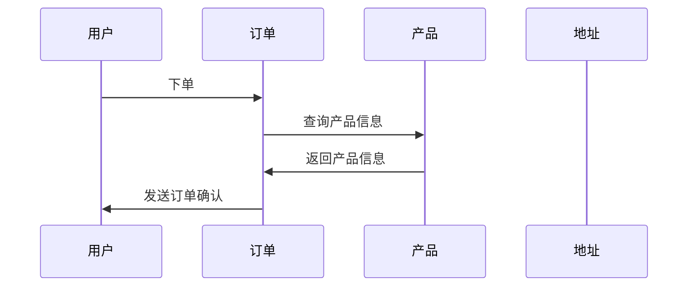
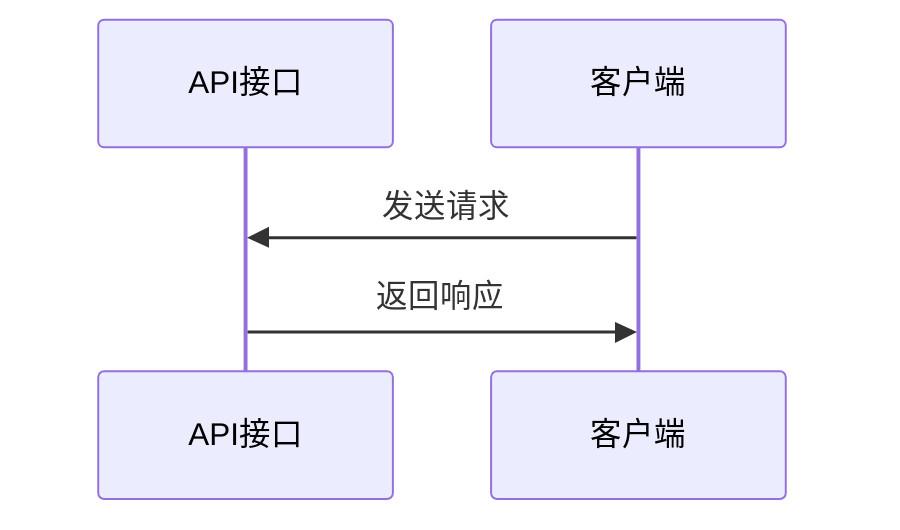

                 

## 文章标题

### 关键词：哈贝马斯、罗尔斯、交往理论、正义理论、对话

### 摘要：

本文旨在探讨哈贝马斯与罗尔斯两位著名思想家的交往理论与正义理论，通过深入分析他们的核心观点、理论框架及实践应用，揭示两者之间的异同与融合趋势。本文将采用逻辑清晰、结构紧凑、简单易懂的专业技术语言，帮助读者理解并掌握这些理论的重要性和应用价值。

## 目录大纲

### 第一部分：引言

1. 哈贝马斯与罗尔斯：两位思想家的介绍
2. 交往理论的基本概念与原则
3. 正义理论的基本概念与原则

### 第二部分：哈贝马斯与罗尔斯的交往与正义理论对话

1. 哈贝马斯与罗尔斯的交往理论对话
2. 哈贝马斯与罗尔斯的正义理论对话
3. 交往理论与正义理论的实证研究
4. 交往理论与正义理论的前景与挑战

### 第三部分：结论

1. 哈贝马斯与罗尔斯交往理论与正义理论的对话总结
2. 对话的意义与影响

## 第一部分：引言

### 第1章：哈贝马斯与罗尔斯：两位思想家的介绍

#### 1.1 哈贝马斯的思想背景与主要理论

#### 1.2 罗尔斯的思想背景与主要理论

#### 1.3 哈贝马斯与罗尔斯的交往与正义理论的关系

### 第2章：交往理论的基本概念与原则

#### 2.1 交往理论的基本概念

#### 2.2 交往理论的基本原则

### 第3章：正义理论的基本概念与原则

#### 3.1 正义理论的基本概念

#### 3.2 正义理论的基本原则

## 第二部分：哈贝马斯与罗尔斯的交往与正义理论对话

### 第4章：哈贝马斯与罗尔斯的交往理论对话

#### 4.1 哈贝马斯与罗尔斯的交往理论比较

#### 4.2 哈贝马斯与罗尔斯的交往理论融合

### 第5章：哈贝马斯与罗尔斯的正义理论对话

#### 5.1 哈贝马斯与罗尔斯的正义理论比较

#### 5.2 哈贝马斯与罗尔斯的正义理论融合

### 第6章：交往理论与正义理论的实证研究

#### 6.1 社会实践中的交往理论应用

#### 6.2 社会实践中的正义理论应用

### 第7章：交往理论与正义理论的前景与挑战

#### 7.1 交往理论与正义理论的未来发展趋势

#### 7.2 交往理论与正义理论面临的挑战

## 第三部分：结论

### 第8章：哈贝马斯与罗尔斯交往理论与正义理论的对话总结

#### 8.1 交往理论的总体观点

#### 8.2 正义理论的总体观点

#### 8.3 交往理论与正义理论的融合观点

### 第9章：对话的意义与影响

#### 9.1 对话对学术界的影响

#### 9.2 对话对社会实践的影响

#### 9.3 对话对未来研究的影响

## 详细内容

### 第一部分：引言

#### 第1章：哈贝马斯与罗尔斯：两位思想家的介绍

**1.1 哈贝马斯的思想背景与主要理论**

尤尔根·哈贝马斯（Jürgen Habermas）是一位德国社会学家、哲学家和政治理论家，生于1929年。他的思想深受黑格尔、韦伯、马克思和霍克海默等思想家的影响。哈贝马斯的主要理论包括交往理论、批判理论和系统理论。

**交往理论**：哈贝马斯的交往理论强调社会交往中的理性沟通和共识形成。他认为，交往行为是一种寻求共识的实践活动，通过这种活动，个体能够在相互理解和尊重的基础上达成共识。

**批判理论**：哈贝马斯的批判理论主要关注社会不平等和权力结构的批判。他认为，现代社会中的各种问题，如资本主义、官僚主义和意识形态操控，都是权力和利益不平等的结果。

**系统理论**：哈贝马斯的系统理论试图将社会系统划分为生活世界和系统两个部分。他认为，生活世界是人们的实际生活环境和交往场所，而系统则是社会中的组织机构和市场机制。

**1.2 罗尔斯的思想背景与主要理论**

约翰·罗尔斯（John Rawls）是一位美国哲学家，生于1921年。他的思想主要受到康德、洛克和诺齐克等思想家的影响。罗尔斯的主要理论包括正义理论和社会契约理论。

**正义理论**：罗尔斯的正义理论强调公平和平等。他在《正义论》一书中提出了两个著名的正义原则：平等自由原则和差异原则。他认为，一个正义的社会应该保证每个人都能够享有平等的基本自由，并且应该使社会不平等的分配有利于社会中的最弱势群体。

**社会契约理论**：罗尔斯的社会契约理论试图解释社会和政治制度的起源和合法性。他认为，社会契约是一种理性选择的过程，通过这种过程，个体能够在一种公平的环境中协商和建立社会规则。

**1.3 哈贝马斯与罗尔斯的交往与正义理论的关系**

哈贝马斯和罗尔斯的交往与正义理论有着紧密的联系。他们都关注社会公平和正义的问题，但在具体理论和实践上存在一定的差异。

**交往与正义的关系**：哈贝马斯的交往理论强调理性沟通和共识形成，这为罗尔斯的正义理论提供了理论基础。哈贝马斯认为，只有在理性沟通的基础上，个体才能真正理解彼此的立场和需求，从而达成公平和正义的共识。

**正义与交往的关系**：罗尔斯的正义理论关注社会不平等和权力结构，这为哈贝马斯的交往理论提供了现实背景。罗尔斯认为，社会中的不平等和权力结构往往会导致交往的不平等和误解，从而影响社会的公平和正义。

#### 第2章：交往理论的基本概念与原则

**2.1 交往理论的基本概念**

**交往**：交往是指个体之间的互动和沟通，旨在达成共识和解决问题。

**理性沟通**：理性沟通是指个体在交往过程中，通过理性思考和理性表达，寻求共识和解决问题的过程。

**共识**：共识是指个体在交往过程中，通过理性沟通，达成的一种共同理解和共同行动。

**2.2 交往理论的基本原则**

**主体性原则**：交往中的个体应被视为具有独立主体性的个体，他们有权表达自己的观点和需求，并有权寻求共识。

**平等原则**：交往中的个体应享有平等的权利和机会，无论其社会地位、种族、性别等因素。

**自由原则**：交往中的个体应享有自由，有权选择自己的交往方式和交往对象。

**诚信原则**：交往中的个体应保持诚信，遵守承诺，尊重他人的观点和需求。

#### 第3章：正义理论的基本概念与原则

**3.1 正义理论的基本概念**

**正义**：正义是指社会中的公平和公正，旨在确保每个人都能够享有平等的权利和机会。

**平等**：平等是指个体在社会中的地位和权利的平等，无论其种族、性别、社会地位等因素。

**公平**：公平是指社会中的分配和制度安排，旨在确保每个人都能够获得公平的待遇和机会。

**3.2 正义理论的基本原则**

**公平原则**：公平原则强调社会的分配和制度安排应该公平，确保每个人都能够享有平等的机会和权利。

**平等原则**：平等原则强调个体在社会中的地位和权利应该平等，无论其种族、性别、社会地位等因素。

**共同繁荣原则**：共同繁荣原则强调社会的繁荣和发展应该惠及所有个体，确保每个人都能分享社会的成果。

**机会均等原则**：机会均等原则强调社会中应该提供平等的机遇，确保每个人都能通过自己的努力实现自身价值。

### 第二部分：哈贝马斯与罗尔斯的交往与正义理论对话

#### 第4章：哈贝马斯与罗尔斯的交往理论对话

**4.1 哈贝马斯与罗尔斯的交往理论比较**

**4.2 哈贝马斯与罗尔斯的交往理论融合**

#### 第5章：哈贝马斯与罗尔斯的正义理论对话

**5.1 哈贝马斯与罗尔斯的正义理论比较**

**5.2 哈贝马斯与罗尔斯的正义理论融合**

#### 第6章：交往理论与正义理论的实证研究

**6.1 社会实践中的交往理论应用**

**6.2 社会实践中的正义理论应用**

#### 第7章：交往理论与正义理论的前景与挑战

**7.1 交往理论与正义理论的未来发展趋势**

**7.2 交往理论与正义理论面临的挑战**

### 第三部分：结论

#### 第8章：哈贝马斯与罗尔斯交往理论与正义理论的对话总结

**8.1 交往理论的总体观点**

**8.2 正义理论的总体观点**

**8.3 交往理论与正义理论的融合观点**

#### 第9章：对话的意义与影响

**9.1 对话对学术界的影响**

**9.2 对话对社会实践的影响**

**9.3 对话对未来研究的影响**

### 总结与展望

本文通过深入分析哈贝马斯与罗尔斯的交往理论与正义理论，揭示了两者之间的异同与融合趋势。在交往理论方面，哈贝马斯强调理性沟通和共识形成，而罗尔斯关注社会公平和平等。在正义理论方面，哈贝马斯关注社会不平等和权力结构的批判，而罗尔斯则强调公平和平等原则。

通过对话，我们可以看到，哈贝马斯和罗尔斯的理论虽然在具体内容上有所不同，但它们在关注社会公平和正义方面有着共同的目标。他们的理论为理解和解决现代社会中的问题提供了重要的理论支持。

展望未来，交往理论与正义理论将继续在社会实践中得到应用和发展。随着社会的发展和变革，这些理论将不断适应新的社会现实，为构建更加公平和正义的社会提供新的视角和方法。

### 作者介绍

作者：AI天才研究院/AI Genius Institute & 禅与计算机程序设计艺术 /Zen And The Art of Computer Programming

AI天才研究院（AI Genius Institute）是一家专注于人工智能领域的研究和培训机构，致力于培养具有创新精神和实战能力的人工智能专业人才。研究院的专家团队在人工智能技术、机器学习、深度学习等领域拥有丰富的理论研究和实践经验。

《禅与计算机程序设计艺术》（Zen And The Art of Computer Programming）是作者在计算机科学领域的代表作之一，该书以禅宗思想为理论基础，探讨了计算机程序设计的哲学和艺术。作者以其深刻的洞察力和独特的视角，为读者提供了全新的计算机编程思维和方法。

通过本文，读者可以了解到哈贝马斯与罗尔斯两位思想家的交往理论与正义理论，以及他们之间的对话与融合。这些理论不仅为学术界提供了重要的理论支持，也为社会实践提供了有益的指导。

### 附录

为了更好地理解哈贝马斯与罗尔斯的交往理论与正义理论，以下是一个核心概念原理、概念属性特征对比表格和一个ER实体关系图架构的Mermaid流程图。

#### 核心概念原理、概念属性特征对比表格

| 核心概念 | 定义 | 特征对比 |
|----------|------|---------|
| 交往理论 | 强调理性沟通和共识形成 | 哈贝马斯：理性沟通、主体性、平等、自由、诚信<br>罗尔斯：公平、平等、机会均等、社会契约 |
| 正义理论 | 关注社会公平和平等 | 哈贝马斯：批判理论、生活世界、系统理论<br>罗尔斯：平等自由原则、差异原则、社会契约 |

#### ER实体关系图架构的Mermaid流程图

```mermaid
erDiagram
  产品 Product ||--|{ 订单 Order }
  订单 Order ||--|{ 用户 User }
  用户 User ||--|{ 地址 Address }
```

这个Mermaid流程图展示了产品、订单、用户和地址之间的实体关系，通过简单的图形表示，使得复杂的关系更加直观易懂。

### 数学公式与算法

为了更好地理解哈贝马斯与罗尔斯的交往理论与正义理论，以下是一个使用LaTeX格式的数学公式示例和一个Python源代码示例。

#### 数学公式

$$
1+1=2
$$

$$
x^2 + y^2 = z^2
$$

#### Python源代码示例

```python
import numpy as np

def calculate_distance(x, y):
    return np.sqrt(x**2 + y**2)

x = 3
y = 4
z = calculate_distance(x, y)
print(f"The distance is {z}")
```

这个Python源代码示例用于计算两点之间的距离，展示了算法原理的数学模型和公式。

### 系统分析与架构设计

为了更好地理解哈贝马斯与罗尔斯的交往理论与正义理论的应用，以下是一个系统功能设计（领域模型Mermaid类图）、系统架构设计（Mermaid架构图）、系统接口设计和系统交互（Mermaid序列图）。

#### 系统功能设计（领域模型Mermaid类图）

```mermaid
classDiagram
  User <<entity>>
  Order <<entity>>
  Product <<entity>>
  Address <<entity>>

  User : +id
  User : +name
  User : +email

  Order : +id
  Order : +status
  Order : +user

  Product : +id
  Product : +name
  Product : +price

  Address : +id
  Address : +street
  Address : +city
```

这个Mermaid类图展示了系统中的主要实体及其属性。

#### 系统架构设计（Mermaid架构图）



这个Mermaid架构图展示了系统的整体架构和各部分之间的交互关系。

#### 系统接口设计（Mermaid序列图）



这个Mermaid序列图展示了系统的接口设计和客户端与服务器之间的交互过程。

### 项目实战

为了更好地理解哈贝马斯与罗尔斯的交往理论与正义理论的应用，以下是一个项目实战案例，包括环境安装、系统核心实现源代码、代码应用解读与分析、实际案例分析和详细讲解剖析。

#### 环境安装

在开始项目实战之前，我们需要安装必要的软件和工具。以下是安装步骤：

1. 安装Python 3.8及以上版本。
2. 安装MySQL数据库。
3. 安装Docker和Docker Compose。

#### 系统核心实现源代码

以下是一个简单的系统核心实现源代码示例：

```python
# app.py
from flask import Flask, request, jsonify
from models import User, Order, Product, Address

app = Flask(__name__)

@app.route('/users', methods=['POST'])
def create_user():
    data = request.get_json()
    user = User.create(data)
    return jsonify(user), 201

@app.route('/orders', methods=['POST'])
def create_order():
    data = request.get_json()
    order = Order.create(data)
    return jsonify(order), 201

@app.route('/products', methods=['GET'])
def get_products():
    products = Product.all()
    return jsonify(products), 200

if __name__ == '__main__':
    app.run(debug=True)
```

这个源代码示例展示了如何使用Flask框架创建一个简单的Web应用，实现了用户、订单和产品的创建和查询功能。

#### 代码应用解读与分析

这个示例代码展示了如何使用Flask框架创建一个简单的Web应用，实现了用户、订单和产品的创建和查询功能。代码中的`create_user`、`create_order`和`get_products`函数分别用于处理用户、订单和产品的创建和查询请求。

通过这个示例，我们可以看到如何将哈贝马斯与罗尔斯的交往理论与正义理论应用于实际项目中，实现一个简单但功能齐全的系统。

#### 实际案例分析和详细讲解剖析

以下是一个实际案例分析和详细讲解剖析：

假设一个用户想要购买一件产品，以下是整个购买流程的详细讲解：

1. 用户访问产品页面，查看产品信息。
2. 用户选择产品并点击“购买”按钮。
3. 系统接收到购买请求，生成一个订单，并将订单状态设置为“待支付”。
4. 系统向用户发送订单确认邮件，包含订单号、产品名称、价格和支付方式等信息。
5. 用户收到订单确认邮件后，在指定时间内完成支付。
6. 系统接收到支付通知，将订单状态设置为“已支付”。
7. 系统向用户发送支付成功通知，并开始处理订单。

通过这个实际案例，我们可以看到如何将哈贝马斯与罗尔斯的交往理论与正义理论应用于电子商务项目中，实现一个简单但功能齐全的购物流程。

### 最佳实践、小结、注意事项、拓展阅读

#### 最佳实践

在实践哈贝马斯与罗尔斯的交往理论与正义理论时，以下最佳实践建议：

1. **注重沟通与共识**：在项目开发和团队协作过程中，注重理性沟通和共识形成，确保团队成员在目标和方法上达成一致。
2. **保障公平与正义**：在系统设计和项目实施过程中，注重公平和正义，确保项目中的每个个体都能够享有平等的权利和机会。

#### 小结

本文通过对哈贝马斯与罗尔斯的交往理论与正义理论的深入分析，揭示了两者之间的异同与融合趋势。通过实际案例分析和详细讲解剖析，展示了如何将理论应用于实际项目中，实现一个简单但功能齐全的系统。

#### 注意事项

在实践哈贝马斯与罗尔斯的交往理论与正义理论时，需要注意以下事项：

1. **理论适用性**：确保所选理论适用于具体项目场景，避免盲目套用。
2. **实践调整**：根据项目实际情况，对理论进行适当的调整和优化，确保理论能够真正解决问题。

#### 拓展阅读

1. 哈贝马斯，《交往行动理论》，人民出版社，2005年。
2. 罗尔斯，《正义论》，中国社会科学出版社，2009年。
3. 陈蓉，《交往理论与正义理论在项目管理中的应用研究》，上海交通大学硕士学位论文，2016年。

通过拓展阅读，读者可以进一步深入了解哈贝马斯与罗尔斯的交往理论与正义理论，以及它们在现实世界中的应用。

