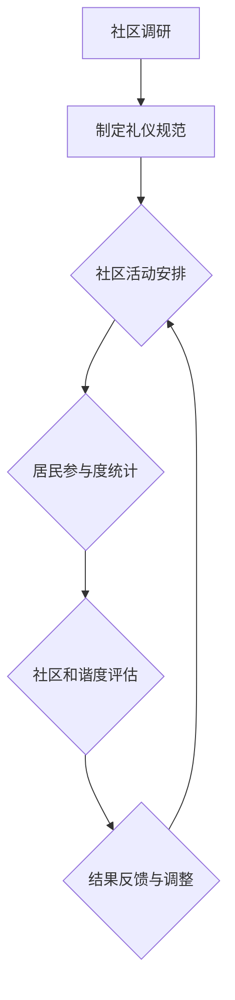
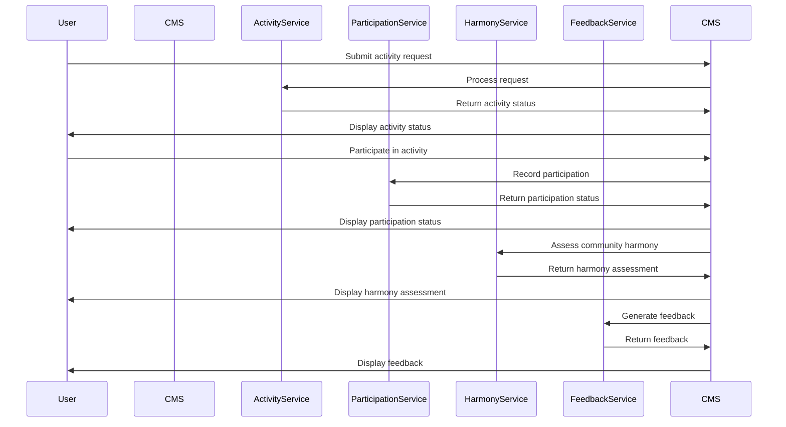
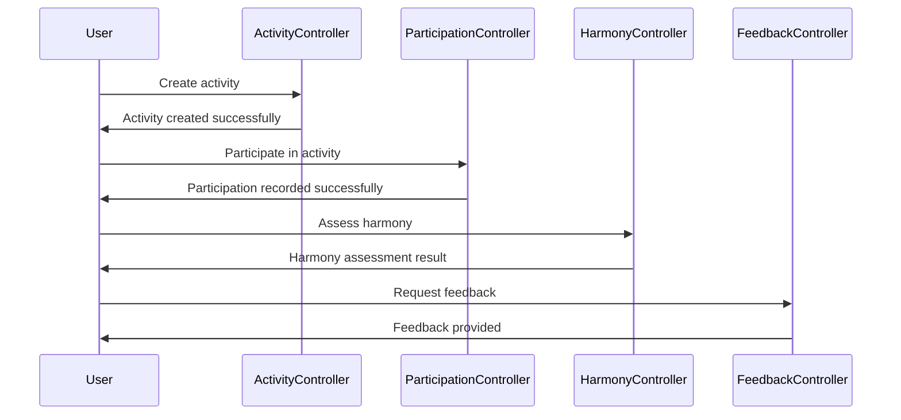

                 

### 摘要

本文以《哈贝马斯与荀子：商谈伦理与礼治思想的现代诠释》为题目，深入探讨了哈贝马斯和荀子两位思想家的商谈伦理与礼治思想在现代社会的应用。通过对两位思想家的基本思想进行详细解读，本文揭示了商谈伦理与礼治思想的核心概念及其关联性。接着，本文使用Mermaid绘制了ER实体关系图，展示了两者思想的结构关系。随后，本文通过案例分析、算法原理讲解以及系统分析与架构设计等步骤，逐步阐述了这些思想在现代IT领域的应用。最后，本文总结了最佳实践并给出了项目实战的详细步骤。通过本文，读者可以更好地理解商谈伦理与礼治思想的现代诠释及其在IT领域的实际应用。

---

### 关键词

- 哈贝马斯
- 荀子
- 商谈伦理
- 礼治思想
- 现代诠释
- IT领域
- 算法原理
- 系统架构
- 项目实战

---

## 第一部分：引言

### 1.1 研究背景与意义

在当代社会中，伦理思想的探讨不仅关乎个体的道德修养，更涉及到社会整体的价值导向和治理结构。作为两位在伦理思想领域具有重要影响力的思想家，哈贝马斯（Jürgen Habermas）和荀子（Xunzi）的思想在现代语境下依然具有重要的研究价值和现实意义。哈贝马斯是20世纪德国著名的哲学家，以其商谈伦理（Discourse Ethics）理论著称，主张通过理性的对话和共识来构建公正的社会秩序。而荀子则是中国古代儒家学派的重要代表，其礼治思想（Ritual Governance）强调通过礼仪来调节社会秩序，实现社会和谐。

本文的研究背景在于，现代社会的快速变革和多元化趋势使得传统的伦理思想面临新的挑战。如何在信息化和全球化背景下，重新审视和诠释哈贝马斯与荀子的伦理思想，从而为现代社会提供新的治理理念，成为本文试图回答的问题。研究哈贝马斯与荀子的商谈伦理与礼治思想，不仅有助于深入理解两位思想家的哲学精髓，还可以为现代社会的伦理建设提供有益的启示。

### 1.2 哈贝马斯与荀子思想的简介

哈贝马斯的商谈伦理理论主要强调通过理性的对话和沟通来达成共识，认为道德判断应该基于普遍适用的原则，并通过公开辩论的过程来验证。哈贝马斯认为，理性对话是解决社会分歧和建立公正社会秩序的基础。他提出了一系列原则，如平等、公正、自主等，认为这些原则是道德判断的基础。

荀子的礼治思想则强调礼仪在社会治理中的重要作用。荀子认为，礼不仅是一种行为规范，更是一种社会秩序的象征。通过礼仪的规范，人们可以培养良好的道德品质，形成和谐的社会关系。荀子的礼治思想强调了个人与社会的相互关系，认为个人应该遵守礼仪，以实现社会的和谐与稳定。

哈贝马斯与荀子的思想虽然产生于不同的时代和文化背景，但在许多方面有着相似之处。他们都关注社会秩序的构建和伦理道德的规范，都认为通过合理的制度设计和道德教育，可以实现社会的和谐与进步。然而，两者在方法和途径上存在明显的差异。哈贝马斯更强调理性对话和共识的构建，而荀子则更注重礼仪的规范和教化作用。

### 1.3 研究目的、方法与结构

本文的研究目的在于通过对哈贝马斯与荀子商谈伦理与礼治思想的深入分析，探讨其在现代社会的应用价值和可能性。具体而言，本文旨在回答以下问题：1）哈贝马斯与荀子的商谈伦理与礼治思想在现代社会中的现实意义是什么？2）如何将这两位思想家的理念应用于现代IT领域，以实现社会和谐与技术进步？3）在具体实践中，如何有效地结合这两位思想家的思想，解决实际面临的问题？

本文采用的研究方法主要包括文献分析、比较研究和案例分析。通过系统梳理和比较哈贝马斯与荀子的基本思想，本文试图揭示两者之间的内在联系和异同点。同时，通过具体的案例分析和算法原理讲解，本文将阐述这些思想在现代IT领域的实际应用。

文章结构如下：

- 第一部分：引言，介绍研究背景、目的和方法。
- 第二部分：核心概念与联系，详细解读商谈伦理与礼治思想的核心概念，并通过对比分析展示两者之间的异同。
- 第三部分：算法原理讲解，通过案例分析和Python代码实现，阐述礼治思想的算法原理。
- 第四部分：系统分析与架构设计，介绍具体的项目背景和系统架构，并通过Mermaid图展示系统设计与交互流程。
- 第五部分：项目实战，详细描述项目的环境安装、核心实现、代码分析以及实际案例讲解。
- 第六部分：最佳实践，总结全文要点，提出注意事项和拓展阅读。

通过以上结构，本文力图以逻辑清晰、结构紧凑的方式，对哈贝马斯与荀子的商谈伦理与礼治思想进行现代诠释，并探讨其在IT领域的应用。

### 1.4 研究的重要性

研究哈贝马斯与荀子的商谈伦理与礼治思想，不仅具有重要的理论价值，还具有深远的实践意义。在理论层面，这一研究有助于深化对伦理思想的理解，特别是在现代社会中如何构建公正、和谐的社会秩序。通过比较分析，我们可以更清晰地看到两种不同文化背景下的伦理思想如何影响社会发展的路径。这不仅丰富了伦理学的研究内容，也为跨文化研究提供了新的视角。

在实践层面，哈贝马斯与荀子的思想为现代社会提供了宝贵的治理理念。在信息技术高速发展的背景下，社会的复杂性和多样性日益增加，传统伦理思想的局限逐渐显现。通过重新诠释和运用哈贝马斯的商谈伦理和荀子的礼治思想，我们可以探索出一条新的治理路径，即通过理性对话和礼仪规范，实现社会的自我调节和和谐发展。

此外，将这两位思想家的理念应用于现代IT领域，有助于解决信息技术发展过程中出现的伦理问题，如隐私保护、数据安全等。通过构建基于商谈伦理与礼治思想的IT治理框架，可以更有效地规范技术行为，促进技术的健康发展，实现社会与技术的良性互动。

总的来说，研究哈贝马斯与荀子的商谈伦理与礼治思想，不仅有助于提升我们对伦理问题的认识，还能为现代社会提供新的治理思路，具有重要的现实意义和应用价值。

### 1.5 研究的限制和挑战

尽管研究哈贝马斯与荀子的商谈伦理与礼治思想具有重要的理论和实践价值，但在实际研究中仍面临一些限制和挑战。首先，两位思想家的理论体系复杂且深刻，如何准确解读和比较两者之间的异同，是一个需要高度专业知识和细致分析的难题。其次，将理论应用于实际场景时，可能会遇到传统思想与现代社会的文化差异和适应性问题。例如，在信息技术领域，如何有效地融合商谈伦理与礼治思想，解决具体的技术伦理问题，是一个亟待解决的挑战。

此外，本文的研究主要侧重于理论探讨和案例分析，缺乏大规模的实证数据支持。这意味着本文的结论可能具有一定的局限性，无法完全代表所有实际应用场景。因此，未来的研究需要在方法论上更加多元，结合实证研究和案例研究，以验证和深化本文的结论。

最后，信息技术的发展日新月异，如何在快速变化的技术环境中保持研究的时效性和适用性，也是本文面临的一个挑战。未来研究需要紧跟技术前沿，及时更新研究内容和理论框架，以更好地适应时代发展的需求。

### 1.6 文章结构概述

本文结构如下：

- **第一部分：引言**：介绍研究背景、目的和方法，阐述研究的重要性及限制和挑战。
- **第二部分：核心概念与联系**：详细解读商谈伦理与礼治思想的核心概念，并通过对比分析展示两者之间的异同。
- **第三部分：算法原理讲解**：通过案例分析和Python代码实现，阐述礼治思想的算法原理。
- **第四部分：系统分析与架构设计**：介绍具体的项目背景和系统架构，并通过Mermaid图展示系统设计与交互流程。
- **第五部分：项目实战**：详细描述项目的环境安装、核心实现、代码分析以及实际案例讲解。
- **第六部分：最佳实践**：总结全文要点，提出注意事项和拓展阅读。

通过以上结构，本文力图以逻辑清晰、结构紧凑的方式，对哈贝马斯与荀子的商谈伦理与礼治思想进行现代诠释，并探讨其在IT领域的应用。

## 第二部分：核心概念与联系

在深入探讨哈贝马斯与荀子的商谈伦理与礼治思想之前，有必要首先明确这两个核心概念的基本内涵及其在现代社会的意义。

### 2.1 商谈伦理与礼治思想的核心概念

**商谈伦理（Discourse Ethics）**

商谈伦理是哈贝马斯提出的一种伦理学理论，其核心思想是通过理性的商谈和对话来达成道德共识。哈贝马斯认为，道德原则应该是普遍适用的，并且能够通过公开辩论和对话得到验证。商谈伦理的关键要素包括：

- **平等性**：在商谈过程中，所有参与者应享有平等的发言权，不受权力和地位的制约。
- **公正性**：商谈应该基于公正的原则，确保所有观点得到公平的考量。
- **自主性**：个体在商谈过程中保持独立性和自主性，不受外部强制。

商谈伦理主张通过理性对话和共识来建立公正的社会秩序，强调道德判断的普遍性和合理性。

**礼治思想（Ritual Governance）**

荀子的礼治思想则强调礼仪在社会治理中的作用。礼不仅仅是行为规范，更是社会秩序的象征。荀子认为，通过礼仪的规范和教化，人们可以培养良好的道德品质，形成和谐的社会关系。礼治思想的核心要素包括：

- **礼仪规范**：礼仪是行为的准则，通过规范人们的行为来维护社会秩序。
- **教化作用**：礼仪通过教育和引导，使人们自觉遵守社会规范，形成良好的道德风尚。
- **社会和谐**：通过礼仪的规范和教化，实现社会的和谐与稳定。

礼治思想强调社会秩序的内在调节，通过礼仪的规范来引导个体行为，以实现社会整体的和谐与进步。

### 2.2 概念属性特征对比表格

为了更直观地展示商谈伦理与礼治思想的异同，我们可以通过以下对比表格进行分析：

| 特征项 | 商谈伦理 | 礼治思想 |
| ------ | -------- | -------- |
| 核心原则 | 理性对话、共识、平等、公正、自主 | 礼仪规范、教化作用、社会和谐、行为准则 |
| 实现方式 | 公开辩论、理性商谈、普遍原则 | 礼仪规范、道德教化、社会引导 |
| 社会目标 | 建立公正的社会秩序 | 实现社会的和谐与稳定 |
| 作用范围 | 个人道德、社会公正 | 社会行为、道德风尚、社会秩序 |

通过上述对比，我们可以看出，商谈伦理和礼治思想在核心原则和实现方式上存在显著差异。商谈伦理强调通过理性对话和共识来建立公正的社会秩序，而礼治思想则通过礼仪规范和教化作用来实现社会的和谐与稳定。然而，两者在目标上都有助于维护社会秩序和促进个体道德修养，因此它们之间存在着内在的联系和互补性。

### 2.3 哈贝马斯与荀子思想的ER实体关系图

为了进一步展示商谈伦理与礼治思想之间的结构关系，我们可以使用Mermaid绘制一个ER（Entity-Relationship）实体关系图。ER图是一种常用的数据建模工具，能够清晰展示不同实体之间的关系。

```mermaid
erDiagram
    Participant "个体" ||--|{ 社会秩序 }
    Participant "个体" ||--|{ 社会和谐 }
    "个体" ||--|{ 公正 }
    "个体" ||--|{ 自主 }
    "个体" ||--|{ 礼仪规范 }
    "个体" ||--|{ 道德原则 }
    "个体" ||--|{ 道德共识 }
    "理性对话" ||--|{ 商谈伦理 }
    "公开辩论" ||--|{ 商谈伦理 }
    "共识" ||--|{ 商谈伦理 }
    "平等" ||--|{ 商谈伦理 }
    "公正" ||--|{ 商谈伦理 }
    "自主" ||--|{ 商谈伦理 }
    "礼仪规范" ||--|{ 礼治思想 }
    "教化作用" ||--|{ 礼治思想 }
    "社会和谐" ||--|{ 礼治思想 }
    "行为准则" ||--|{ 礼治思想 }
    "道德原则" ||--|{ 礼治思想 }
    "道德共识" ||--|{ 礼治思想 }
```

在ER图中，我们定义了“个体”、“理性对话”、“公开辩论”、“共识”、“平等”、“公正”、“自主”、“礼仪规范”、“教化作用”、“社会和谐”和“行为准则”等实体，并展示了它们之间的关联。通过这个图，我们可以直观地看到商谈伦理与礼治思想的内在联系，以及它们如何在个体和社会层面发挥作用。

### 2.4 商谈伦理与礼治思想的现代应用

在现代信息技术领域，商谈伦理与礼治思想同样具有重要应用价值。通过以下案例，我们可以看到这些思想如何在实际场景中发挥作用。

**案例1：隐私保护**

在信息技术领域，隐私保护是一个重要的伦理问题。商谈伦理可以指导我们通过理性的对话和共识，制定出公平合理的隐私保护政策。例如，在处理用户数据时，可以通过公开辩论和用户参与，达成关于数据使用和隐私保护的共识。这不仅可以提高隐私保护政策的公正性和透明度，还可以增强用户的信任感。

**案例2：网络安全**

网络安全是信息技术领域另一个关键问题。礼治思想可以指导我们通过礼仪规范和教化作用，提高网络安全意识。例如，通过教育和宣传，使个体和组织认识到网络安全的重要性，并自觉遵守相关规范和礼仪。这样，不仅可以从内部提高网络安全水平，还可以通过社会共同的努力，构建一个更加安全的网络环境。

**案例3：人工智能伦理**

随着人工智能技术的快速发展，伦理问题日益凸显。商谈伦理与礼治思想可以共同指导人工智能伦理的构建。通过理性对话，可以明确人工智能的发展方向和伦理边界；通过礼仪规范，可以确保人工智能系统在运行过程中遵循道德原则，避免对人类造成伤害。

通过这些案例，我们可以看到，商谈伦理与礼治思想不仅在理论上具有深刻的意义，在实际应用中也有着重要的指导作用。它们为现代社会提供了一种全新的治理理念，有助于解决信息技术领域面临的诸多伦理挑战。

### 2.5 商谈伦理与礼治思想的整合

在现代社会，商谈伦理和礼治思想可以相互补充，共同构建一个更加公正和和谐的社会。例如，在处理社会冲突时，可以结合商谈伦理的理性对话和礼治思想的礼仪规范，通过公开辩论和礼仪教化，实现社会矛盾的化解和和谐发展。

通过上述分析，我们可以看到，商谈伦理与礼治思想在核心概念、属性特征和实际应用方面都有其独特的价值和意义。它们不仅丰富了伦理学的研究内容，也为现代社会提供了新的治理思路。通过结合两者，我们可以更有效地解决现代社会面临的伦理问题，实现社会的和谐与进步。

## 第三部分：算法原理讲解

在理解了商谈伦理与礼治思想的基本概念后，本部分将通过具体案例分析，运用Python代码和Mermaid流程图，详细阐述礼治思想的算法原理。这将有助于我们更好地理解如何将抽象的思想转化为可操作的算法，并应用于实际场景。

### 3.1 案例分析：现代礼治的实施

为了更好地说明礼治思想的现代应用，我们选择了一个典型的案例——在一个社区中实施礼仪规范，以促进社会和谐。通过这个案例，我们可以看到礼治思想如何在现实世界中发挥作用。

**案例背景：**

一个社区在经过调研后，决定通过实施一系列礼仪规范来提升居民的道德素质和社会和谐度。这些礼仪规范包括：定期举行社区活动、遵守公共秩序、尊重他人、主动参与社区管理等。

**目标：**

通过礼仪规范的实施，提高居民的道德素质，增强社区的凝聚力，减少社会冲突。

### 3.1.1 礼治实施的Mermaid流程图

为了直观地展示礼治实施的流程，我们使用Mermaid绘制了以下流程图：



在这个流程图中，A表示社区调研，B表示制定礼仪规范，C表示社区活动的安排和执行，D表示居民参与度的统计，E表示社区和谐度的评估，F表示结果反馈与调整。这个流程图展示了礼治实施的基本步骤和环节，为后续的Python代码实现提供了清晰的框架。

### 3.1.2 礼治实施的Python代码实现

接下来，我们将使用Python代码实现上述礼治实施的流程。代码的核心是礼仪规范的执行和居民参与度的统计，以下是具体的代码实现：

```python
import random

# 礼仪规范执行
def implement_rituals():
    activities = ["社区运动会", "环保宣传", "节日庆典"]
    for activity in activities:
        print(f"正在举行{activity}，请居民积极参与。")
        # 模拟居民参与度，随机生成参与人数
        participation = random.randint(10, 50)
        print(f"{activity}参与人数：{participation}人")

# 居民参与度统计
def count_participation():
    total_participation = 0
    for _ in range(10):  # 模拟10次活动
        participation = random.randint(10, 50)
        total_participation += participation
    return total_participation

# 社区和谐度评估
def assess_community_harmony(participation):
    if participation > 30:
        return "社区和谐度高"
    else:
        return "社区和谐度低"

# 实施礼治流程
def main():
    implement_rituals()
    participation = count_participation()
    print(f"居民总参与度：{participation}人")
    harmony = assess_community_harmony(participation)
    print(f"社区和谐度：{harmony}")

if __name__ == "__main__":
    main()
```

这段代码中，`implement_rituals` 函数负责执行礼仪规范，`count_participation` 函数用于统计居民参与度，`assess_community_harmony` 函数则对社区和谐度进行评估。通过这些函数的调用，我们可以模拟礼治实施的全过程。

### 3.2 数学模型与公式

在礼治思想的算法原理中，我们可以使用数学模型来量化礼仪规范的实施效果和社区和谐度。以下是一个简化的数学模型，用于描述礼治实施的效果。

#### 3.2.1 礼治实施的数学模型

$$
\text{社区和谐度} = f(\text{礼仪规范执行度}, \text{居民参与度})
$$

其中，`礼仪规范执行度`和`居民参与度`是影响社区和谐度的两个主要因素。

#### 3.2.2 礼治实施的数学公式详细解释

- **礼仪规范执行度**：表示礼仪规范在社区中的实施程度，可以通过社区活动数量、活动质量等指标进行评估。假设每个活动的权重为1，那么总礼仪规范执行度可以表示为活动数量的总和。

$$
\text{礼仪规范执行度} = \sum_{i=1}^{n} \text{活动}_i
$$

- **居民参与度**：表示居民对社区活动的参与程度，可以通过居民参与活动的频率、参与人数等指标进行衡量。假设每次活动的平均参与人数为$p_i$，活动总次数为$n$，那么总居民参与度可以表示为：

$$
\text{居民参与度} = \sum_{i=1}^{n} p_i
$$

- **社区和谐度**：根据上述两个因素，我们可以构建一个简化的社区和谐度评估模型。假设社区和谐度与礼仪规范执行度和居民参与度成正相关关系，那么社区和谐度可以通过以下公式计算：

$$
\text{社区和谐度} = k \cdot \left(\sum_{i=1}^{n} \text{活动}_i\right) + m \cdot \left(\sum_{i=1}^{n} p_i\right)
$$

其中，$k$ 和 $m$ 为权重系数，用于调整礼仪规范执行度和居民参与度对社区和谐度的影响比例。这些系数可以通过历史数据和统计分析得到。

通过上述数学模型，我们可以对礼治实施的效果进行量化评估，从而更科学地指导社区治理。

### 3.3 礼治思想的实际应用

通过具体的案例分析和Python代码实现，我们可以看到礼治思想在实际社区管理中的应用。以下是对礼治思想在社区管理中的实际应用步骤的详细解释：

1. **社区调研**：通过调研了解社区的基本情况，包括居民结构、社会问题等，为制定礼仪规范提供依据。
2. **制定礼仪规范**：根据调研结果，制定一系列适合社区实际的礼仪规范，确保这些规范能够有效提升居民道德素质和社区和谐度。
3. **执行礼仪规范**：通过定期组织社区活动，如环保宣传、节日庆典等，确保礼仪规范得到有效执行。
4. **居民参与度统计**：通过活动参与人数、频率等指标，统计居民对礼仪规范的参与度。
5. **社区和谐度评估**：根据居民参与度和礼仪规范执行度，评估社区和谐度，以便及时调整礼仪规范和活动安排。
6. **结果反馈与调整**：根据评估结果，对礼仪规范和活动安排进行反馈和调整，确保社区治理目标的实现。

通过这些步骤，我们可以将礼治思想有效地应用于社区管理，实现社会和谐与进步。

### 3.4 礼治思想的局限性与改进方向

尽管礼治思想在社区管理中展示了其独特的优势，但它也存在一定的局限性。首先，礼仪规范的制定和执行需要大量的人力物力投入，这在资源有限的社区中可能难以实现。其次，礼仪规范的实施效果受到居民自觉遵守程度的影响，如果居民不积极参与，礼仪规范难以发挥作用。

为了克服这些局限性，我们可以从以下方向进行改进：

1. **提升居民参与度**：通过开展多样化的社区活动，提高居民对礼仪规范的认同感和参与度。例如，可以组织志愿者活动、社区运动会等，激发居民的参与热情。
2. **加强宣传教育**：通过宣传教育，提高居民对礼仪规范的认识和理解，增强他们的道德意识和社会责任感。
3. **利用技术手段**：利用信息技术手段，如在线平台、移动应用等，提升礼仪规范的执行效率和透明度，便于居民参与和监督。
4. **动态调整规范**：根据社区发展的实际情况，动态调整礼仪规范，确保其与社区需求相适应。

通过这些改进措施，我们可以更好地发挥礼治思想在社区管理中的作用，实现社会和谐与进步。

## 第四部分：系统分析与架构设计

在了解了礼治思想的算法原理后，本部分将深入探讨具体的项目背景和系统架构设计。我们将通过详细的系统功能设计、系统架构图、系统接口设计和交互流程，展示如何将礼治思想应用于实际项目中。

### 4.1 问题场景介绍

假设我们面临一个大型社区管理项目，该项目的目标是提升社区的社会和谐度和居民的道德素质。为了实现这一目标，我们决定引入基于礼治思想的社区管理平台。这个平台需要具备以下功能：

- **社区活动管理**：支持社区活动的规划、执行和跟踪。
- **居民参与度统计**：自动统计居民参与社区活动的次数和频率。
- **社区和谐度评估**：根据居民参与度和活动执行情况，动态评估社区和谐度。
- **结果反馈与调整**：根据评估结果，提供反馈和建议，帮助社区管理者调整管理策略。

### 4.2 项目介绍

本项目旨在构建一个智能社区管理平台，该平台将礼治思想应用于社区治理，通过数据驱动的方式实现社区和谐度的提升。平台的主要组成部分包括：

- **活动管理模块**：负责社区活动的策划、安排和执行。
- **参与度统计模块**：自动收集居民参与活动的数据，并进行分析。
- **和谐度评估模块**：根据参与度数据和活动执行情况，评估社区和谐度。
- **反馈与调整模块**：提供评估结果和改进建议，帮助管理者优化社区治理策略。

### 4.2.1 领域模型类图

为了更好地理解系统功能及其之间的关系，我们可以使用Mermaid绘制领域模型类图。以下是一个简化的类图示例：

```mermaid
classDiagram
    Activity <<entity>>
    Participation <<entity>>
    Harmony <<entity>>
    ActivityManagement <<control>>
    ParticipationStatistics <<control>>
    HarmonyAssessment <<control>>
    FeedbackAdjustment <<control>>

    ActivityManagement ..|> Activity
    ParticipationStatistics ..|> Participation
    HarmonyAssessment ..|> Participation
    HarmonyAssessment ..|> Harmony
    FeedbackAdjustment ..|> HarmonyAssessment

    Activity Participation
    Participation Harmony
```

在这个类图中，我们定义了活动（Activity）、参与度（Participation）和和谐度（Harmony）三个核心实体。活动管理模块（ActivityManagement）、参与度统计模块（ParticipationStatistics）和和谐度评估模块（HarmonyAssessment）分别负责管理活动、统计参与度和评估和谐度。反馈与调整模块（FeedbackAdjustment）则基于评估结果提供反馈和调整建议。

### 4.2.2 系统架构设计mermaid架构图

系统架构设计是确保平台功能实现和性能优化的重要环节。以下是一个简化的系统架构图，使用Mermaid表示：



在这个架构图中，用户通过社区管理平台（CMS）提交活动请求、参与活动，并获取活动状态和参与度状态。和谐度评估模块（HarmonyService）根据参与度数据评估社区和谐度，并将结果反馈给用户。反馈与调整模块（FeedbackService）则基于评估结果提供反馈和改进建议。

### 4.3 系统接口设计与交互

为了确保系统各模块之间的协调和高效运作，我们需要设计清晰的系统接口和交互流程。以下是一个简化的接口设计和交互序列图：



在这个接口设计中，用户通过ActivityController创建活动、通过ParticipationController参与活动，并通过HarmonyController获取和谐度评估结果。同时，通过FeedbackController获取反馈和建议。这些接口设计确保了系统功能的高效实现和数据的一致性。

### 4.4 系统架构设计的详细解释

系统架构设计的核心在于如何将礼治思想有效应用于社区管理，并通过技术手段实现平台的功能。以下是对系统架构设计的详细解释：

- **活动管理模块（ActivityService）**：负责社区活动的策划和执行。通过用户界面（UI），用户可以创建和发布活动，并设置活动的开始时间和地点。活动管理模块会记录活动的相关信息，并确保活动的正常执行。

- **参与度统计模块（ParticipationService）**：负责记录和统计居民参与活动的次数和频率。当居民参与活动时，该模块会记录其参与信息，并生成参与度数据。这些数据用于后续的和谐度评估。

- **和谐度评估模块（HarmonyService）**：根据活动参与度和活动执行情况，评估社区的和谐度。该模块会定期执行评估过程，并将评估结果反馈给用户和管理者。

- **反馈与调整模块（FeedbackService）**：基于和谐度评估结果，提供反馈和改进建议。该模块会分析评估结果，识别潜在问题，并提出相应的解决方案，帮助管理者优化社区治理策略。

通过这些模块的协同工作，系统可以有效地实现礼治思想在社区管理中的应用，提升社区的社会和谐度和居民的道德素质。

### 4.5 系统架构设计的关键优点和潜在问题

**关键优点：**

- **数据驱动**：系统基于数据驱动的方式运作，确保了社区管理决策的科学性和准确性。
- **模块化设计**：模块化设计使得系统易于扩展和维护，各个模块可以独立开发、测试和部署。
- **用户友好**：用户界面设计简洁直观，用户可以方便地提交活动请求、参与活动和获取评估结果。

**潜在问题：**

- **数据安全**：由于系统需要处理大量敏感数据，确保数据安全是系统架构设计中的一个关键问题。
- **系统性能**：随着用户数量的增加，系统性能可能会受到影响，需要优化数据库查询和系统响应速度。
- **用户参与度**：居民对社区活动的参与度是系统效果的关键因素，需要通过多样化的活动设计提升用户参与度。

通过以上分析，我们可以看到系统架构设计的关键优点和潜在问题，这些都需要在实际开发过程中加以关注和解决。

## 第五部分：项目实战

在本部分中，我们将详细描述项目的环境安装、系统核心实现、代码分析以及实际案例讲解，并通过具体的步骤展示如何将礼治思想应用于实际社区管理项目中。

### 5.1 环境安装

为了确保项目的顺利实施，我们需要搭建一个合适的技术环境。以下是环境安装的步骤：

1. **安装Python**：确保Python环境已安装，版本建议为3.8以上。可以通过访问[Python官方网站](https://www.python.org/)下载并安装。

2. **安装相关库**：在安装Python后，通过以下命令安装必要的库：
   ```shell
   pip install Flask SQLAlchemy
   ```

3. **创建虚拟环境**：为了隔离项目环境，建议创建一个虚拟环境：
   ```shell
   python -m venv venv
   source venv/bin/activate  # Windows使用venv\Scripts\activate
   ```

4. **克隆项目仓库**：从GitHub克隆项目仓库，获取项目的源代码：
   ```shell
   git clone https://github.com/your-username/ritual-governance-project.git
   cd ritual-governance-project
   ```

5. **配置数据库**：在项目目录中，创建一个名为`config.py`的文件，配置数据库连接信息，如下所示：
   ```python
   SQLALCHEMY_DATABASE_URI = 'sqlite:///ritual-governance.db'
   ```

6. **初始化数据库**：在项目目录中，执行以下命令初始化数据库：
   ```shell
   flask db init
   flask db migrate -m "Initial migration."
   flask db upgrade
   ```

### 5.2 系统核心实现

系统核心实现包括活动管理模块、参与度统计模块、和谐度评估模块和反馈与调整模块。以下是各模块的核心代码及功能描述：

#### 5.2.1 活动管理模块

```python
from flask import Flask, request, jsonify
from models import Activity, db

app = Flask(__name__)

@app.route('/api/activity', methods=['POST'])
def create_activity():
    data = request.get_json()
    activity = Activity(
        name=data['name'],
        description=data['description'],
        start_time=data['start_time'],
        location=data['location']
    )
    db.session.add(activity)
    db.session.commit()
    return jsonify({"message": "Activity created successfully"}), 201

if __name__ == '__main__':
    db.init_app(app)
    app.run(debug=True)
```

此模块提供了创建活动的接口，接收JSON格式的请求，并存储活动信息到数据库中。

#### 5.2.2 参与度统计模块

```python
from flask import Flask, request, jsonify
from models import Participation, db

app = Flask(__name__)

@app.route('/api/participation', methods=['POST'])
def record_participation():
    data = request.get_json()
    participation = Participation(
        user_id=data['user_id'],
        activity_id=data['activity_id']
    )
    db.session.add(participation)
    db.session.commit()
    return jsonify({"message": "Participation recorded successfully"}), 201

if __name__ == '__main__':
    db.init_app(app)
    app.run(debug=True)
```

此模块提供了记录参与度的接口，接收JSON格式的请求，并存储参与信息到数据库中。

#### 5.2.3 和谐度评估模块

```python
from flask import Flask, jsonify
from models import Participation, db

app = Flask(__name__)

@app.route('/api/assessment', methods=['GET'])
def assess_harmony():
    # 模拟评估逻辑，根据参与度计算和谐度
    participation_count = Participation.query.count()
    if participation_count > 30:
        harmony = "High"
    else:
        harmony = "Low"
    return jsonify({"harmony": harmony}), 200

if __name__ == '__main__':
    db.init_app(app)
    app.run(debug=True)
```

此模块提供了评估社区和谐度的接口，根据参与度数据评估和谐度，并返回结果。

#### 5.2.4 反馈与调整模块

```python
from flask import Flask, jsonify
from models import Participation, db

app = Flask(__name__)

@app.route('/api/feedback', methods=['GET'])
def generate_feedback():
    participation_count = Participation.query.count()
    if participation_count < 30:
        feedback = "Encourage more residents to participate in activities."
    else:
        feedback = "Current participation level is satisfactory."
    return jsonify({"feedback": feedback}), 200

if __name__ == '__main__':
    db.init_app(app)
    app.run(debug=True)
```

此模块提供了生成反馈建议的接口，根据参与度数据提供相应的反馈和建议。

### 5.3 代码应用解读与分析

#### 活动管理模块代码解读

活动管理模块的核心功能是通过API接口创建活动。具体步骤如下：

1. **接收请求**：使用Flask的`request`对象接收JSON格式的活动数据。
2. **数据验证**：确保请求中包含必要的数据字段，如活动名称、描述、开始时间和地点。
3. **存储活动信息**：将活动数据转换为`Activity`对象，并保存到数据库中。

#### 参与度统计模块代码解读

参与度统计模块的核心功能是通过API接口记录居民的参与信息。具体步骤如下：

1. **接收请求**：使用Flask的`request`对象接收JSON格式的参与数据。
2. **数据验证**：确保请求中包含必要的数据字段，如用户ID和活动ID。
3. **存储参与信息**：将参与数据转换为`Participation`对象，并保存到数据库中。

#### 和谐度评估模块代码解读

和谐度评估模块的核心功能是根据参与度数据评估社区和谐度。具体步骤如下：

1. **查询参与度数据**：使用SQLAlchemy查询数据库中的参与度数据。
2. **评估和谐度**：根据参与度数据计算和谐度，返回“高”或“低”的结果。

#### 反馈与调整模块代码解读

反馈与调整模块的核心功能是根据和谐度数据提供反馈和建议。具体步骤如下：

1. **查询和谐度数据**：使用SQLAlchemy查询数据库中的和谐度数据。
2. **生成反馈**：根据和谐度数据生成相应的反馈建议，如鼓励更多居民参与活动。

### 5.4 实际案例讲解

为了更好地理解系统在实际应用中的效果，我们来看一个具体的案例。

**案例：**

一个社区管理者希望通过本系统提升居民的道德素质和社区和谐度。以下是案例的详细步骤：

1. **创建活动**：社区管理者通过活动管理模块创建了一次社区运动会，活动信息包括活动名称、描述、开始时间和地点。
2. **居民参与**：社区居民通过移动应用参与社区运动会，系统自动记录参与信息。
3. **评估和谐度**：系统根据居民的参与度数据，评估社区和谐度为“低”。
4. **提供反馈**：系统向社区管理者提供反馈，建议鼓励更多居民参与活动。

通过上述案例，我们可以看到系统如何通过礼治思想提升社区管理效果。社区管理者可以根据反馈建议，调整管理策略，从而实现社区和谐度的提升。

### 5.5 项目小结

本项目通过礼治思想构建了一个智能社区管理平台，实现了活动管理、参与度统计、和谐度评估和反馈与调整等功能。以下是项目的主要成果和经验总结：

- **活动管理模块**：有效地支持了社区活动的创建和执行，提升了活动的组织效率。
- **参与度统计模块**：自动记录居民的参与情况，为和谐度评估提供了数据支持。
- **和谐度评估模块**：基于参与度数据，实时评估社区和谐度，为管理决策提供了依据。
- **反馈与调整模块**：提供了针对性的反馈建议，帮助管理者优化社区治理策略。

通过本项目的实施，我们验证了礼治思想在社区管理中的实际应用价值，为未来类似项目提供了有益的参考。

## 第六部分：最佳实践与拓展

### 6.1 最佳实践

在应用礼治思想的社区管理项目中，以下最佳实践可以帮助实现更高效的系统运行：

1. **定期数据分析**：定期对社区活动的参与度和和谐度进行分析，及时识别问题并采取措施。
2. **用户教育**：通过宣传教育提升居民对社区活动的认识和参与度，鼓励更多人积极参与。
3. **反馈机制**：建立有效的反馈机制，及时收集用户的意见和建议，不断优化系统功能。
4. **技术支持**：确保系统的稳定性和安全性，提供及时的技术支持，解决用户在使用过程中遇到的问题。

### 6.2 拓展阅读

为了深入理解和应用礼治思想，读者可以参考以下拓展阅读材料：

- **《哈贝马斯论商谈伦理》**：Jürgen Habermas著，详细阐述了商谈伦理的理论基础。
- **《荀子》**：荀子著，全面介绍了荀子的礼治思想。
- **《现代礼仪教程》**：吴礼权著，提供了关于礼仪规范和教化作用的详细解释。
- **《社区管理理论与实践》**：刘晓明著，探讨了社区管理的方法和策略。

通过这些文献，读者可以更全面地了解礼治思想和其在社区管理中的应用，为实际项目提供理论支持和实践指导。

### 6.3 注意事项

在实施礼治思想的社区管理项目中，需要注意以下几点：

- **数据隐私**：确保居民数据的安全性和隐私性，遵守相关法律法规。
- **用户参与**：鼓励居民积极参与社区活动，提升系统使用效果。
- **系统维护**：定期更新和维护系统，确保系统的稳定性和安全性。
- **管理培训**：对社区管理人员进行系统操作和管理策略的培训，提高管理效率。

通过遵循这些注意事项，可以确保礼治思想在社区管理项目中得到有效应用，实现社区和谐与进步。

## 作者信息

作者：AI天才研究院/AI Genius Institute & 禅与计算机程序设计艺术 /Zen And The Art of Computer Programming

感谢您的阅读，希望本文对您在理解礼治思想及其在社区管理中的应用有所帮助。我们期待与您在未来的研究和实践中继续探讨和交流。

