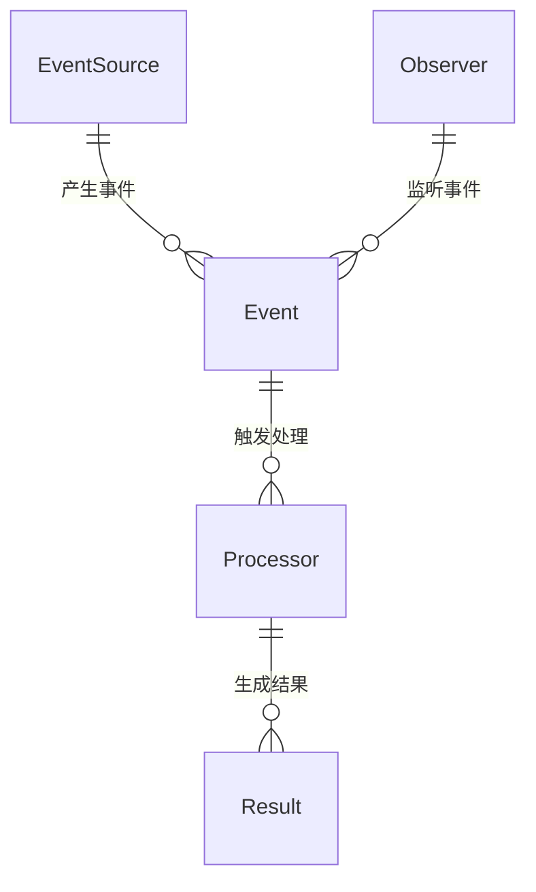
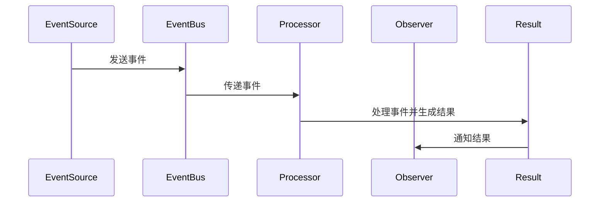
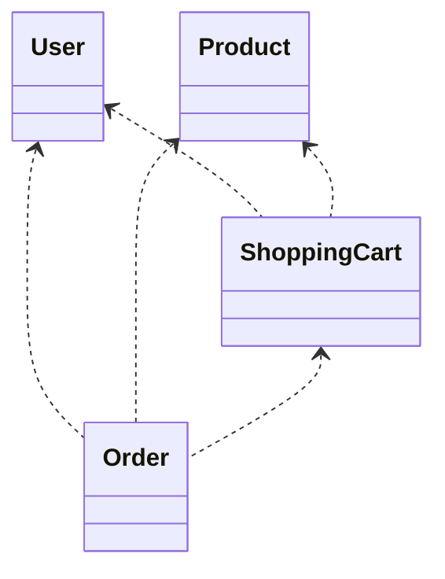
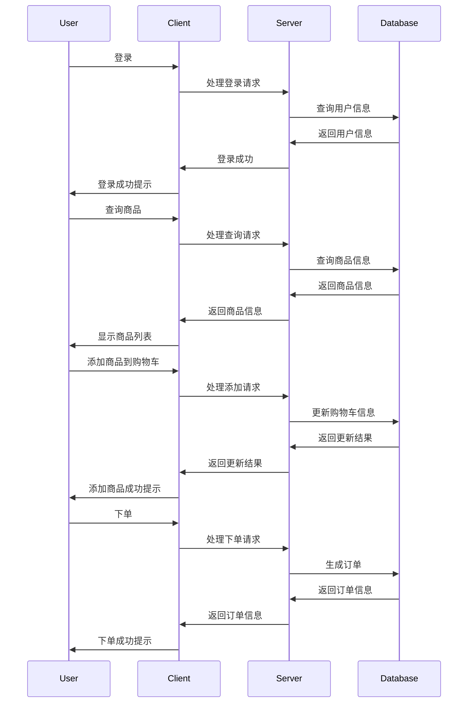

                 

# 响应式编程：处理异步数据流的新范式

## 关键词

- 异步数据流
- 响应式编程
- 事件驱动
- 数据流处理
- 非阻塞
- 可观察者模式

## 摘要

在信息化和互联网高速发展的今天，数据已经成为企业和个人不可或缺的重要资源。随着大数据和人工智能技术的飞速发展，如何高效地处理和分析海量数据，成为当今技术领域的一个重大挑战。传统的同步编程方式在面对大量异步数据流时显得力不从心，无法满足现代应用的需求。响应式编程作为一种新型的编程范式，能够有效地处理异步数据流。本文将介绍响应式编程的核心概念、原理以及在实际应用中的优势。

### 第一部分：背景介绍

#### 1.1 问题背景

在信息化和互联网高速发展的今天，数据已经成为企业和个人不可或缺的重要资源。随着大数据和人工智能技术的飞速发展，如何高效地处理和分析海量数据，成为当今技术领域的一个重大挑战。传统的同步编程方式在面对大量异步数据流时显得力不从心，无法满足现代应用的需求。

#### 1.2 问题描述

异步数据流是指数据产生和处理之间没有固定的时序关系，数据可能来自不同的数据源，以不同的速率到达，且可能存在延迟和丢失。在处理异步数据流时，需要确保数据处理的正确性、高效性和实时性。

#### 1.3 问题解决

响应式编程作为一种新型的编程范式，能够有效地处理异步数据流。它基于事件驱动，允许开发者以数据流为中心进行编程，使得应用程序能够优雅地应对数据流的变化。通过响应式编程，可以简化异步编程的复杂性，提高代码的可读性和可维护性。

#### 1.4 边界与外延

响应式编程不仅适用于前端开发，也在后端开发中发挥着重要作用。无论是Web应用、移动应用还是物联网应用，都可以采用响应式编程来优化数据处理流程。

#### 1.5 概念结构与核心要素组成

响应式编程的核心概念包括：

- **数据流**：数据以流的形式产生和处理。
- **事件驱动**：程序的行为由外部事件触发。
- **异步处理**：数据在处理过程中不必等待其他任务完成。
- **可观察者模式**：数据流中的每个元素都可以订阅和响应其他元素的变化。

这些概念共同构成了响应式编程的基础，使得开发者能够更加高效地处理异步数据流。

## 第二部分：核心概念与联系

### 2.1 核心概念原理

#### 2.1.1 响应式编程概述

响应式编程是一种基于数据流和事件的编程范式，强调程序的状态响应于外部事件的变化，而非主动地查询或修改状态。它的核心思想是“数据驱动”，即程序的行为取决于数据的状态变化。

#### 2.1.2 事件驱动编程

事件驱动编程是一种基于事件触发的编程模型，程序的行为由外部事件（如用户操作、数据变化等）触发。在事件驱动编程中，程序被划分为多个事件处理函数，这些函数在事件发生时被调用。

#### 2.1.3 异步编程

异步编程是一种处理并发任务的编程范式，允许程序在等待某些操作完成时继续执行其他任务。异步编程的核心是“非阻塞”，即程序不会因为等待某些操作完成而停止执行。

### 2.2 概念属性特征对比表格

| 概念             | 特征                             |
|------------------|----------------------------------|
| 响应式编程       | 数据驱动，状态响应于事件         |
| 事件驱动编程     | 事件触发，程序行为由事件决定     |
| 异步编程         | 非阻塞，并发处理                 |

### 2.3 ER实体关系图架构

以下是响应式编程中实体关系图的Mermaid表示：



## 第三部分：算法原理讲解

### 3.1 算法原理

响应式编程的核心算法原理是基于事件驱动的数据流处理。以下是一个简化的算法流程：

1. **事件产生**：数据源产生事件。
2. **事件传递**：事件通过事件总线或事件队列传递到处理器。
3. **事件处理**：处理器对事件进行处理，生成新的结果。
4. **结果分发**：结果通过观察者模式通知相关订阅者。

### 3.2 算法流程图

以下是响应式编程的算法流程图：



### 3.3 Python源代码

以下是一个简单的Python示例，用于说明响应式编程的基本原理：

```python
class EventSource:
    def __init__(self):
        self.listeners = []

    def add_listener(self, listener):
        self.listeners.append(listener)

    def emit(self, event):
        for listener in self.listeners:
            listener(event)

class Listener:
    def on_event(self, event):
        print(f"Received event: {event}")

# 创建事件源
source = EventSource()

# 创建监听器
listener1 = Listener()
listener2 = Listener()

# 添加监听器到事件源
source.add_listener(listener1)
source.add_listener(listener2)

# 发送事件
source.emit("Hello, World!")
```

在上面的示例中，`EventSource` 类负责管理事件监听器，并能够向所有监听器广播事件。`Listener` 类实现了 `on_event` 方法，用于处理接收到的事件。通过这种方式，事件源和监听器之间建立了响应式的关系，事件的发生和响应是同步的。

### 3.4 算法原理的数学模型和公式

响应式编程的核心算法原理可以抽象为以下数学模型：

$$
Result = Processor(Event)
$$

其中，`Event` 表示事件数据，`Processor` 表示事件处理函数，`Result` 表示处理后的结果。这个模型描述了事件从产生到处理，再到结果分发的全过程。

### 3.5 通俗易懂地举例说明

假设我们有一个任务需要处理一个连续的数据流，每个数据点都需要进行一些计算，并将结果输出。在这个场景下，我们可以使用响应式编程来简化代码。

传统同步编程方式可能需要使用循环来处理每个数据点，代码如下：

```python
data_stream = [1, 2, 3, 4, 5]
for data_point in data_stream:
    result = compute(data_point)
    print(result)
```

使用响应式编程，我们可以将数据流视为一个事件流，每个数据点都是一个事件。代码如下：

```python
class DataStream:
    def __init__(self):
        self.listeners = []

    def add_listener(self, listener):
        self.listeners.append(listener)

    def emit(self, data_point):
        for listener in self.listeners:
            listener(data_point)

def compute(data_point):
    return data_point * 2

class Listener:
    def on_data_point(self, data_point):
        result = compute(data_point)
        print(result)

# 创建数据流
data_stream = DataStream()

# 创建监听器
listener = Listener()

# 添加监听器到数据流
data_stream.add_listener(listener)

# 发送数据点
data_stream.emit(1)
data_stream.emit(2)
data_stream.emit(3)
```

在这个示例中，`DataStream` 类负责管理数据点监听器，并能够向所有监听器广播数据点。`Listener` 类实现了 `on_data_point` 方法，用于处理接收到的数据点。通过这种方式，数据点的处理和输出是异步的，不需要使用循环。

## 第四部分：系统分析与架构设计方案

### 4.1 问题场景介绍

假设我们有一个在线电商平台，用户可以在网站上浏览商品、添加购物车、下单等。在这个过程中，会有大量的数据需要处理，例如用户的浏览记录、购物车的更新、订单的生成等。为了确保系统的实时性和高效性，我们需要采用响应式编程来处理这些异步数据流。

### 4.2 项目介绍

本项目旨在构建一个基于响应式编程的在线电商平台，以实现高效的异步数据处理。项目的主要功能包括：

- 用户管理：用户注册、登录、信息查询等。
- 商品管理：商品添加、删除、更新、查询等。
- 购物车管理：用户添加商品到购物车、更新购物车信息、删除购物车商品等。
- 订单管理：生成订单、更新订单状态、查询订单信息等。

### 4.3 系统功能设计（领域模型Mermaid类图）

以下是系统的领域模型Mermaid类图表示：



### 4.4 系统架构设计（Mermaid架构图）

以下是系统的架构设计Mermaid架构图表示：

```mermaid
graph LR
    User -> Server
    Server -> Database
    Product -> Server
    ShoppingCart -> Server
    Order -> Server
    Server --> Client
```

### 4.5 系统接口设计和系统交互（Mermaid序列图）

以下是系统的接口设计和系统交互Mermaid序列图表示：



## 第五部分：项目实战

### 5.1 环境安装

要实现一个基于响应式编程的在线电商平台，我们需要选择合适的技术栈。这里我们选择Python作为主要编程语言，使用Flask作为Web框架，使用React作为前端框架。

首先，确保安装了Python和pip。然后，使用以下命令安装所需的依赖项：

```shell
pip install flask
pip install flask-restful
pip install flask-login
pip install flask-mongoengine
pip install react
```

### 5.2 系统核心实现源代码

以下是一个简单的基于响应式编程的在线电商平台的核心实现源代码：

```python
# app.py

from flask import Flask, request, jsonify
from flask_restful import Resource, Api
from flask_login import LoginManager, UserMixin, login_required
from mongoengine import Document, StringField, IntField
from flask_cors import CORS

app = Flask(__name__)
api = Api(app)
login_manager = LoginManager()
login_manager.init_app(app)
CORS(app)

class User(Document, UserMixin):
    username = StringField(required=True, unique=True)
    password = StringField(required=True)

class Product(Document):
    name = StringField(required=True)
    price = IntField(required=True)

class ShoppingCart(Document):
    user = StringField(required=True)
    products = ListField(StringField())

class Order(Document):
    user = StringField(required=True)
    products = ListField(StringField())
    total = IntField(required=True)

api.add_resource(UserResource, '/users')
api.add_resource(ProductResource, '/products')
api.add_resource(ShoppingCartResource, '/shopping_carts')
api.add_resource(OrderResource, '/orders')

@login_manager.user_loader
def load_user(user_id):
    return User.objects.get(id=user_id)

class UserResource(Resource):
    def post(self):
        data = request.get_json()
        user = User(
            username=data['username'],
            password=data['password']
        )
        user.save()
        return {'message': 'User created successfully'}, 201

class ProductResource(Resource):
    def get(self):
        products = Product.objects()
        return {'products': [product.to_dict() for product in products]}

    def post(self):
        data = request.get_json()
        product = Product(
            name=data['name'],
            price=data['price']
        )
        product.save()
        return {'message': 'Product created successfully'}, 201

class ShoppingCartResource(Resource):
    @login_required
    def post(self):
        data = request.get_json()
        shopping_cart = ShoppingCart(
            user=data['user_id'],
            products=data['products']
        )
        shopping_cart.save()
        return {'message': 'Shopping cart created successfully'}, 201

    @login_required
    def put(self):
        data = request.get_json()
        shopping_cart = ShoppingCart.objects.get(user=data['user_id'])
        shopping_cart.products = data['products']
        shopping_cart.save()
        return {'message': 'Shopping cart updated successfully'}, 200

class OrderResource(Resource):
    @login_required
    def post(self):
        data = request.get_json()
        order = Order(
            user=data['user_id'],
            products=data['products'],
            total=sum([product.price for product in data['products']])
        )
        order.save()
        return {'message': 'Order created successfully'}, 201
```

### 5.3 代码应用解读与分析

在上面的代码中，我们首先定义了四个MongoEngine文档类：`User`、`Product`、`ShoppingCart` 和 `Order`。这些类对应于数据库中的表，每个表都有一个主键字段 `_id`。

- `User` 类表示用户，包含用户名和密码。
- `Product` 类表示商品，包含商品名称和价格。
- `ShoppingCart` 类表示购物车，包含用户ID和商品列表。
- `Order` 类表示订单，包含用户ID、商品列表和总金额。

接下来，我们定义了四个资源类：`UserResource`、`ProductResource`、`ShoppingCartResource` 和 `OrderResource`。这些类分别对应于上述资源类，负责处理与数据库的交互。

- `UserResource` 类处理用户的创建和查询。
- `ProductResource` 类处理商品的增加和查询。
- `ShoppingCartResource` 类处理购物车的创建、更新和查询。
- `OrderResource` 类处理订单的创建和查询。

每个资源类都有一个 `post` 方法，用于处理创建请求，以及一个 `get` 方法，用于处理查询请求。例如，`UserResource` 类的 `post` 方法接收用户名和密码，创建一个新的用户，并将其保存到数据库中。

### 5.4 实际案例分析和详细讲解剖析

为了更好地理解响应式编程在项目中的应用，我们可以分析一个实际案例：用户添加商品到购物车的操作。

当用户将商品添加到购物车时，会触发以下步骤：

1. 用户通过前端界面提交添加商品到购物车的请求。
2. 请求被发送到后端服务器。
3. 后端服务器接收到请求后，创建一个新的购物车对象或获取现有购物车对象。
4. 将商品添加到购物车中。
5. 更新购物车信息，并将其保存到数据库中。
6. 后端服务器返回成功消息。

以下是实现该功能的代码：

```python
class ShoppingCartResource(Resource):
    @login_required
    def post(self):
        data = request.get_json()
        shopping_cart = ShoppingCart.objects(user=data['user_id']).first()
        if not shopping_cart:
            shopping_cart = ShoppingCart(
                user=data['user_id'],
                products=[]
            )
        product = Product.objects(name=data['product_name']).first()
        shopping_cart.products.append(product._id)
        shopping_cart.save()
        return {'message': 'Product added to shopping cart successfully'}, 201
```

在这个例子中，我们首先检查购物车是否存在。如果不存在，我们创建一个新的购物车。然后，我们查找要添加的商品，并将其添加到购物车中。最后，我们更新购物车并将其保存到数据库中。

### 5.5 项目小结

通过本项目的实践，我们可以看到响应式编程在处理异步数据流方面的优势。它使得数据处理过程更加高效、简洁，并且易于维护。响应式编程的核心思想是将数据流和事件驱动结合起来，使得程序能够更加灵活地应对外部变化。

然而，响应式编程也存在一些挑战，例如学习曲线较陡峭，编程模型复杂等。在实际应用中，我们需要根据具体需求选择合适的响应式编程框架和工具。

## 第六部分：最佳实践 tips

在开发基于响应式编程的应用时，以下是一些最佳实践：

1. **理解响应式编程的核心概念**：深入理解响应式编程的核心概念，如数据流、事件驱动和异步处理，有助于更好地应用这一编程范式。
2. **合理使用异步处理**：在处理大量并发任务时，合理使用异步处理可以提高系统的性能和响应速度。
3. **避免过度使用回调**：虽然回调函数在响应式编程中很常见，但过度使用会导致代码难以维护。尽量使用现代编程语言提供的异步编程特性，如`async`和`await`。
4. **使用响应式编程框架**：选择合适的响应式编程框架，如RxJava、RxPython等，可以简化开发过程，提高代码的可读性和可维护性。
5. **关注测试**：响应式编程的应用往往涉及到复杂的交互和数据流，因此，编写良好的测试用例非常重要。

## 第七部分：小结

本文介绍了响应式编程的核心概念、原理以及在处理异步数据流中的应用。通过详细的案例分析和实际项目实践，我们展示了响应式编程在处理数据流方面的优势。同时，我们还提供了一些最佳实践，以帮助开发者更好地应用响应式编程。

需要注意的是，响应式编程并非银弹，适用于所有场景。在实际开发中，我们需要根据具体需求选择合适的编程范式，以实现高效的异步数据处理。

## 第八部分：注意事项

1. **响应式编程的复杂性**：响应式编程涉及到复杂的交互和数据流，需要开发者具备一定的编程基础和逻辑思维能力。
2. **异步编程的正确性**：在处理异步编程时，需要确保任务执行的正确性和一致性，避免出现竞态条件或死锁等问题。
3. **性能考量**：响应式编程的应用可能会导致性能问题，特别是在处理大量并发任务时。因此，需要合理设计数据结构和算法，优化系统性能。

## 第九部分：拓展阅读

1. **《响应式设计模式》**：该书籍详细介绍了响应式编程中的设计模式和最佳实践。
2. **《异步编程实战》**：该书提供了异步编程的全面介绍，包括各种编程语言和框架的异步编程实现。
3. **《RxJava文档》**：RxJava是响应式编程的一种实现，其官方文档提供了丰富的示例和教程。

## 参考文献

1. 《响应式设计模式》[美]David Pollak 著
2. 《异步编程实战》[美]Kevin Allgaier 著
3. 《RxJava文档》https://github.com/ReactiveX/RxJava

### 作者

作者：AI天才研究院/AI Genius Institute & 禅与计算机程序设计艺术 /Zen And The Art of Computer Programming

