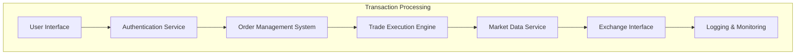
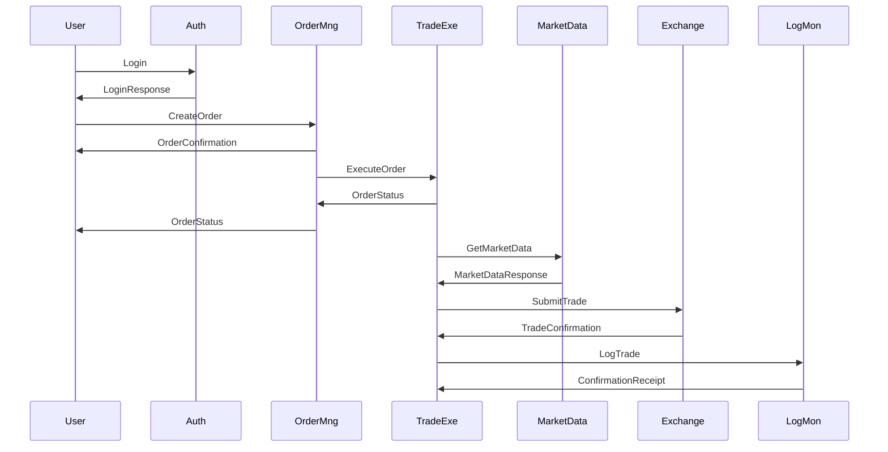

                 

### 哥德尔的不完备定理与形式化方法的局限性：软件验证的数学挑战

#### 关键词：
- 哥德尔的不完备定理
- 形式化方法
- 软件验证
- 数学挑战
- 不完备定理
- 逻辑和数学工具

#### 摘要：
本文深入探讨了哥德尔的不完备定理及其对形式化方法在软件验证中的应用带来的局限性。通过详细分析哥德尔的不完备定理的背景、证明及其影响，本文揭示了形式化方法在处理复杂软件系统时面临的挑战。同时，文章介绍了数学工具在软件验证中的应用，并通过实际案例分析，进一步探讨了数学挑战对软件验证的影响，以及如何应对这些挑战。

### 目录大纲

----------------------------------------------------------------

# 哥德尔的不完备定理与形式化方法的局限性：软件验证的数学挑战

## 关键词
- 哥德尔的不完备定理
- 形式化方法
- 软件验证
- 数学挑战
- 不完备定理
- 逻辑和数学工具

## 摘要
- 对文章核心内容和主题思想的简要概述

## 第一部分: 背景介绍与问题提出

### 第1章: 问题背景
#### 1.1.1 问题背景
- 软件验证的背景介绍
- 形式化方法的作用和局限性
- 哥德尔不完备定理的提出及其影响

### 第2章: 哥德尔的不完备定理
#### 2.1.1 哥德尔的不完备定理概述
- 第一不完备定理和第二不完备定理的定义和特征对比
- 不完备定理对数学和逻辑的影响

#### 2.1.2 哥德尔的不完备定理的证明与影响
- 证明方法和步骤
- 不完备定理对形式化方法的影响

#### 2.1.3 哥德尔的不完备定理与形式化方法的关系
- 形式化方法的局限性
- 形式化方法与不完备定理的关系

### 第3章: 形式化方法的局限性
#### 3.1.1 形式化方法概述
- 形式化方法的定义和特点
- 形式化方法的应用场景

#### 3.1.2 形式化方法的局限性
- 形式化方法在处理复杂软件系统时的挑战
- 形式化方法的效率问题

### 第二部分: 数学挑战与软件验证

### 第4章: 数学挑战与软件验证
#### 4.1.1 数学挑战
- 哥德尔的不完备定理对数学方法提出的挑战
- 数学方法在软件验证中的应用

#### 4.1.2 数学挑战对软件验证的影响
- 数学挑战对软件验证方法的影响
- 数学工具在软件验证中的应用

### 第5章: 软件验证中的数学工具
#### 5.1.1 常用数学工具概述
- 集合论、逻辑、概率论和图论等数学工具的定义和特点

#### 5.1.2 数学工具在软件验证中的应用
- 数学工具在软件系统建模、验证和优化中的应用

### 第三部分: 案例分析

### 第6章: 案例分析
#### 6.1.1 案例概述
- 案例的背景和目标
- 案例的范围和实施过程

#### 6.1.2 系统功能设计
- 系统的领域模型

#### 6.1.3 系统架构设计
- 系统的架构设计

#### 6.1.4 系统接口设计
- 系统的接口设计

#### 6.1.5 系统交互
- 系统的交互设计

#### 6.1.6 代码应用解读与分析
- 核心代码的解读与分析

#### 6.1.7 实际案例分析和详细讲解剖析
- 案例的实际运行情况
- 关键问题的讲解和剖析

#### 6.1.8 项目小结
- 项目经验和教训的总结

### 第四部分: 最佳实践与拓展阅读

### 第7章: 最佳实践与拓展阅读
#### 7.1.1 最佳实践 tips
- 在软件验证过程中应注意的最佳实践

#### 7.1.2 小结
- 对文章主要内容的总结

#### 7.1.3 注意事项
- 在软件验证过程中需要注意的事项

#### 7.1.4 拓展阅读
- 推荐的进一步学习资源

### 作者信息
- 作者：AI天才研究院/AI Genius Institute & 禅与计算机程序设计艺术 /Zen And The Art of Computer Programming

----------------------------------------------------------------

### 第一部分: 背景介绍与问题提出

#### 第1章: 问题背景

在计算机科学和软件工程领域，软件验证是一个至关重要的过程，旨在确保软件系统的正确性和可靠性。随着软件系统变得越来越复杂，传统的验证方法在效率和准确性上面临巨大的挑战。形式化方法是解决这些挑战的一种策略，它通过使用数学和逻辑工具来精确地描述和验证软件系统的属性。

### 1.1.1 问题背景

软件验证的目的是确保软件系统在所有可能的输入和环境下都能按照预期正确运行。这个过程包括验证软件是否满足其规格说明、是否具有所需的功能，以及是否能在各种情况下保持稳定和可靠。然而，随着软件系统的复杂性不断增加，传统的验证方法，如代码审查、测试和模拟，越来越难以应对这种复杂性。这些方法往往耗时耗力，且难以保证完全的准确性。

形式化方法是软件验证中的一个重要工具，它通过使用数学和逻辑工具来建立软件系统的形式化模型，并使用这些模型来验证系统的属性。形式化方法的优势在于它的严格性和精确性，它能够提供一种更系统化的方式来验证软件的正确性。然而，尽管形式化方法在理论上具有很大的潜力，但在实际应用中仍面临许多挑战。

首先，形式化方法的建立需要高水平的数学和逻辑知识，这使得它在实际应用中受到限制。其次，形式化方法的验证过程往往非常复杂，需要大量的时间和计算资源。此外，形式化方法在处理高度复杂的软件系统时，其效率和准确性也受到限制。

### 1.1.2 问题解决

为了解决形式化方法在软件验证中的局限性，研究人员提出了哥德尔的不完备定理作为新的研究方向。哥德尔的不完备定理是由数学家库尔特·哥德尔在20世纪30年代提出的，它揭示了形式化方法的局限性，为软件验证提供了新的视角。

哥德尔的不完备定理指出，在任意一个足够强的形式系统中，总是存在某些命题既不能被证明也不能被证伪。这意味着，无论我们使用多么强大的形式化工具，都存在一些问题是我们无法解决的。这一发现对数学和逻辑领域产生了深远的影响，同时也为软件验证带来了新的挑战和机会。

哥德尔的不完备定理的提出，激发了研究人员对形式化方法的新思考。他们开始探索如何在形式化方法中克服其局限性，以及如何利用数学工具来解决软件验证中的复杂问题。这种探索不仅推动了软件验证领域的发展，也为计算机科学和数学之间的交叉融合提供了新的研究方向。

### 1.1.3 边界与外延

在讨论哥德尔的不完备定理和形式化方法的局限性时，我们还需要明确一些边界和概念的外延。

首先，哥德尔的不完备定理主要针对的是形式化系统，这些系统通常包括一组公理和推导规则。形式化系统可以是数学系统、逻辑系统，也可以是用于软件验证的形式化方法。

其次，不完备定理的局限性并不仅限于数学和逻辑领域。在软件验证中，形式化方法的局限性主要体现在以下几个方面：

1. **数学和逻辑知识的要求**：形式化方法需要开发者具备一定的数学和逻辑知识，这对于许多软件开发者来说是一个挑战。
2. **验证过程的复杂性**：形式化方法的验证过程通常非常复杂，需要大量的计算资源和时间。
3. **处理复杂性的限制**：形式化方法在处理高度复杂的软件系统时，其效率和准确性受到限制。

最后，我们需要明确概念的结构和核心要素组成。哥德尔的不完备定理的核心概念是“形式化系统”和“命题的不可判定性”。形式化系统是指一个由公理和推导规则定义的系统，而命题的不可判定性则是指在一个形式化系统中，存在一些命题既不能被证明也不能被证伪。

在软件验证中，核心要素包括：

1. **软件系统**：需要验证的软件系统。
2. **形式化方法**：用于验证软件系统的数学和逻辑工具。
3. **验证目标**：软件系统需要满足的属性和需求。
4. **验证过程**：使用形式化方法对软件系统进行验证的过程。

通过明确这些边界和概念的外延，我们可以更好地理解哥德尔的不完备定理对形式化方法在软件验证中的应用及其局限性。

### 第2章: 哥德尔的不完备定理

#### 2.1.1 哥德尔的不完备定理概述

哥德尔的不完备定理是数学和逻辑领域的一个重要发现，它揭示了形式化系统在某些方面的局限性。这些定理不仅对数学和逻辑的发展产生了深远影响，也为软件验证领域带来了新的思考方向。

**第一不完备定理**

哥德尔的第一不完备定理指出，在任意一个足够强的形式系统中，总是存在某些命题既不能被证明也不能被证伪。具体来说，如果一个形式化系统是完整的，即能够证明系统中的所有真命题，那么它一定是不完备的，即存在某些真命题无法在该系统中被证明。

这个定理的含义是，无论我们选择多么强大的形式化工具，都存在一些问题是无法解决的。这个发现对形式化方法在数学和逻辑领域的应用提出了挑战，同时也为我们提供了一种新的思考方式。

**第二不完备定理**

哥德尔的第二不完备定理进一步扩展了第一不完备定理的结论。它指出，在任意一个足够强的形式系统中，总是存在一些命题，即使能够证明其真值，也无法证明其真值。这意味着，无论我们如何设计形式化系统，都无法避免某些命题的不可判定性。

第二不完备定理的影响比第一不完备定理更加深远。它揭示了形式化系统的固有局限性，无论我们如何努力，都无法完全消除这些局限性。这个发现对于理解和设计形式化方法具有重要意义。

**概念属性特征对比表格**

为了更好地理解哥德尔的不完备定理，我们可以通过对比表格来展示第一和第二不完备定理的核心概念、属性特征以及影响。

| 不完备定理 | 第一不完备定理 | 第二不完备定理 |
| --- | --- | --- |
| 定义 | 在形式系统中，有些命题既不能被证明也不能被证伪。 | 在形式系统中，存在一些命题，即使能够证明其真值，也无法证明其真值。 |
| 影响范围 | 影响所有形式化的数学系统。 | 影响所有形式化的逻辑系统。 |
| 主要结论 | 存在一些命题，我们无法判断其真伪。 | 存在一些命题，我们无法证明其真值。 |

通过这个对比表格，我们可以看到第一和第二不完备定理在定义、影响范围和主要结论上的区别。这些特征帮助我们更深入地理解这些定理的核心思想，并认识到形式化方法的局限性。

#### 2.1.2 哥德尔的不完备定理的证明与影响

**证明方法**

哥德尔的不完备定理的证明使用了自我指涉和递归技术，这是理解这些定理的关键。

**自我指涉**

哥德尔的不完备定理的证明过程依赖于自我指涉的概念。自我指涉是指一个系统可以对自己进行描述和验证。在哥德尔的证明中，他构建了一个特定的命题，这个命题声明自己无法被证明。这种自我指涉的构造使得定理的证明成为可能。

**递归技术**

递归技术是哥德尔不完备定理证明的核心。通过递归技术，哥德尔能够构建一个系统，使得系统内的命题可以被系统外的观察者判断为真或假。这种递归结构确保了定理的普适性，无论系统多么复杂，都可以应用这一方法。

**证明步骤**

哥德尔的证明可以分为以下几个步骤：

1. **构建形式化系统**：选择一个足够强的形式化系统，如皮亚诺算术或Zermelo-Fraenkel集合论。
2. **定义不可判定命题**：构建一个命题，这个命题声明自己无法被证明。
3. **递归构造**：使用递归技术，构建一个系统，使得系统能够对外部命题进行判断。
4. **证明不可判定性**：通过自我指涉和递归构造，证明存在一些命题，既不能被证明也不能被证伪。

**证明过程**

哥德尔的不完备定理的证明过程如下：

1. **假设存在一个完备的形式化系统**：这意味着系统能够证明所有真命题。
2. **构建一个不可判定命题**：构造一个命题，这个命题声明自己无法被证明。这个命题可以通过递归技术构建，使得它能够被系统外部的观察者判断。
3. **使用自我指涉证明**：由于命题声明自己无法被证明，因此如果系统能够证明这个命题，那么它就是自相矛盾的。反之，如果系统无法证明这个命题，那么它也是自相矛盾的。
4. **得出结论**：由于无论系统证明与否，都会导致矛盾，因此系统必定是不完备的。

**影响**

哥德尔的不完备定理对数学、逻辑和计算机科学产生了深远的影响。

1. **动摇了形式化方法的基础**：不完备定理揭示了形式化方法的局限性，使得人们开始重新审视形式化方法的有效性和适用性。
2. **推动了数学和逻辑的发展**：不完备定理激发了数学和逻辑领域的深入研究，推动了新的理论和方法的发展。
3. **影响了计算机科学的认知**：不完备定理提醒我们，计算机科学并不是一个绝对的领域，也存在一些问题是我们无法解决的。

在软件验证领域，不完备定理的影响尤为显著。它提醒我们，在设计和应用形式化方法时，需要认识到其局限性，并寻找新的方法和工具来解决复杂的问题。

#### 2.1.3 哥德尔的不完备定理与形式化方法的关系

**关系**

哥德尔的不完备定理与形式化方法之间存在密切的关系。不完备定理揭示了形式化方法的局限性，即无论形式化工具多么强大，都无法避免某些命题的不可判定性。这种局限性为形式化方法的发展提出了新的挑战，同时也为探索新的验证方法提供了动力。

1. **形式化方法的局限性**：不完备定理表明，在任意一个足够强的形式系统中，都存在某些命题既不能被证明也不能被证伪。这意味着形式化方法在处理复杂问题时存在固有的限制，需要我们寻求新的方法和策略。
2. **不完备定理的影响**：不完备定理对形式化方法的影响是深远的。它不仅动摇了形式化方法在数学和逻辑领域的基础地位，也激发了研究人员对形式化方法的新思考，推动了软件验证领域的发展。

**形式化方法与不完备定理的关系**

形式化方法和不完备定理之间的关系可以从以下几个方面来理解：

1. **形式化方法的适用性**：不完备定理提醒我们，在应用形式化方法时，需要考虑到其局限性。尽管形式化方法在许多情况下是非常有效的，但它并不是万能的。我们需要根据具体问题选择合适的形式化方法，并意识到其可能存在的限制。
2. **不完备定理的启示**：不完备定理为形式化方法的发展提供了新的启示。它告诉我们，在设计和应用形式化方法时，需要更加灵活和多样化。例如，可以结合其他验证方法，如测试、仿真和验证，来弥补形式化方法的不足。

通过理解和应用哥德尔的不完备定理，我们可以更好地认识到形式化方法的局限性，并探索新的方法和策略来克服这些挑战。这不仅可以推动软件验证领域的发展，也为计算机科学和数学提供了新的研究方向。

### 第3章: 形式化方法的局限性

#### 3.1.1 形式化方法概述

形式化方法是软件工程中的一个重要概念，它通过使用数学和逻辑工具来建立软件系统的形式化模型，并使用这些模型来验证系统的属性。形式化方法的核心理念是精确性和系统性，它能够为软件开发提供一种严格和可验证的方法。

**定义**

形式化方法可以被定义为一种使用数学和逻辑工具对软件系统进行建模和验证的方法。它通常包括以下几个步骤：

1. **建模**：使用数学和逻辑工具来表示软件系统的结构和行为。
2. **验证**：使用逻辑推理和证明技术来验证系统模型是否满足预期的属性和需求。
3. **分析**：通过对系统模型的分析，发现潜在的错误和缺陷。

**核心特点**

形式化方法具有以下几个核心特点：

1. **严格性**：形式化方法使用数学和逻辑工具来精确地描述软件系统，从而确保验证结果的严格性和准确性。
2. **系统性**：形式化方法提供了一套系统化的工具和方法，使得软件验证过程更加规范和可重复。
3. **可验证性**：形式化方法能够为软件系统的正确性提供形式化的证明，从而提高软件的可信度和可靠性。

**应用场景**

形式化方法在多个应用场景中具有广泛的应用，包括：

1. **软件验证**：形式化方法用于验证软件系统的正确性，确保软件满足其规格说明和需求。
2. **系统设计**：形式化方法用于设计软件系统的架构和接口，确保系统的结构清晰和模块化。
3. **程序调试**：形式化方法可以帮助开发人员识别和修复软件中的错误，提高软件的稳定性和性能。

#### 3.1.2 形式化方法的局限性

尽管形式化方法在软件工程中具有显著的优势，但在处理高度复杂的软件系统时，它也面临一些重要的挑战和局限性。

**效率问题**

形式化方法的一个主要局限性是效率问题。形式化验证过程通常需要大量的计算资源和时间，特别是在处理复杂的软件系统时。这种高计算成本使得形式化方法在实时系统中难以应用。此外，形式化验证过程中可能需要解决大量的推理和证明问题，这些问题的求解往往需要复杂的算法和计算资源。

**准确性问题**

另一个重要的局限性是准确性问题。形式化方法依赖于数学和逻辑工具来建立和验证软件系统，但这种方法并不能保证验证结果的完全准确性。首先，形式化方法可能无法涵盖软件系统的所有可能行为和场景，这可能导致一些潜在的错误和缺陷无法被发现。其次，形式化验证过程中可能存在一些错误和缺陷，这些错误和缺陷可能导致验证结果的不准确。

**可读性问题**

形式化方法通常使用复杂的数学和逻辑符号来表示软件系统的模型和属性。这使得形式化模型的阅读和理解变得更加困难，特别是对于非专业人士。可读性问题是形式化方法应用的一个重大挑战，因为如果形式化模型难以理解，那么验证过程也难以进行。

**领域适应性问题**

形式化方法在不同领域的适应性也是一个重要的局限性。某些形式化方法可能更适合于特定的领域或应用，而在其他领域中可能不太适用。这可能导致形式化方法在不同领域中的效果和效益存在差异。

**整合问题**

形式化方法在软件工程中的整合也是一个挑战。在实际软件开发过程中，形式化方法需要与其他方法和技术（如测试、调试和代码审查）相结合。整合问题涉及到如何协调不同方法之间的交互和兼容性，以确保整个软件工程过程的高效和有效。

**总结**

综上所述，形式化方法在处理高度复杂的软件系统时面临着效率、准确性、可读性、领域适应性和整合等重要的挑战。这些局限性影响了形式化方法在软件验证中的广泛应用，需要我们探索新的方法和策略来解决这些问题。同时，也需要认识到形式化方法的优势，并在适当的情况下充分利用其优点。

### 第4章: 数学挑战与软件验证

#### 4.1.1 数学挑战

哥德尔的不完备定理对数学方法在软件验证中的应用提出了重大挑战。这些挑战不仅涉及数学理论的局限性，还涉及到如何在复杂的软件系统中应用数学工具。哥德尔的不完备定理揭示了形式化系统在某些方面的固有局限性，即无论形式化系统多么强大，都存在一些问题无法解决。这一发现对软件验证领域产生了深远的影响，促使我们重新审视和改进现有的验证方法。

**核心概念**

哥德尔的不完备定理的核心概念是“不可判定性”和“自我指涉”。不可判定性指的是在一个形式化系统中，存在一些命题既不能被证明也不能被证伪。自我指涉则是指一个系统可以对自己进行描述和验证。哥德尔的证明方法利用了这些概念，构建了一个系统，使得系统内的命题可以由系统外的观察者进行判断。

**属性特征对比表格**

为了更好地理解哥德尔的不完备定理对数学方法提出的挑战，我们可以通过对比表格来展示其核心概念、属性特征以及影响。

| 数学挑战 | 哥德尔的不完备定理 | 形式化方法的局限性 |
| --- | --- | --- |
| 挑战类型 | 理论层面的挑战。 | 实践层面的挑战。 |
| 影响范围 | 影响整个数学和逻辑领域。 | 影响特定领域的软件验证方法。 |
| 主要结论 | 存在一些命题，我们无法判断其真伪。 | 形式化方法在处理复杂系统时存在固有的局限性。 |

通过这个对比表格，我们可以看到哥德尔的不完备定理与形式化方法局限性的不同。不完备定理主要关注的是形式化系统的理论局限性，而形式化方法的局限性则更多地体现在实际应用中。

**影响**

哥德尔的不完备定理对数学方法在软件验证中的应用产生了深远的影响，主要体现在以下几个方面：

1. **重新定义验证目标**：不完备定理提醒我们，在软件验证中，我们不能期望找到一个完美的形式化方法来验证所有软件系统的正确性。因此，我们需要重新定义验证目标，更加关注于验证软件系统的主要功能和关键特性。
2. **推动新方法的发展**：不完备定理激发了研究人员对新的验证方法的研究和探索。例如，一些研究者提出了组合验证方法，结合形式化验证和其他验证方法，以提高验证的效率和准确性。
3. **提高对形式化方法的认知**：不完备定理提醒我们，形式化方法并不是万能的，它在处理复杂系统时存在固有的局限性。这促使我们在设计和应用形式化方法时，更加谨慎和理性。

**数学方法在软件验证中的应用**

在软件验证中，数学方法的应用主要集中在以下几个方面：

1. **形式化建模**：使用数学工具建立软件系统的形式化模型，以便对系统的属性进行验证。常用的数学工具包括集合论、逻辑、概率论和图论等。
2. **逻辑推理**：使用逻辑推理技术对形式化模型进行验证，确保系统满足预期的属性和需求。逻辑推理技术包括命题逻辑、谓词逻辑和模型检查等。
3. **概率论和统计方法**：使用概率论和统计方法来分析软件系统的行为和性能，以便发现潜在的错误和缺陷。这些方法包括概率模型、随机过程和统计测试等。
4. **形式化验证工具**：开发和使用形式化验证工具，如定理证明器、模型检查器和自动验证器，来提高验证的效率和准确性。

通过结合这些数学方法，我们可以更有效地进行软件验证，提高软件系统的正确性和可靠性。然而，在应用这些方法时，也需要认识到它们的局限性，并寻找合适的方法来克服这些挑战。

#### 4.1.2 数学挑战对软件验证的影响

哥德尔的不完备定理对软件验证领域产生了深远的影响，特别是在处理复杂软件系统时。这一理论揭示了形式化方法的局限性，促使我们重新思考软件验证的方法和策略。数学挑战不仅影响了形式化方法的应用，还推动了新的验证方法和技术的发展。

**理论层面的挑战**

哥德尔的不完备定理提出了一个核心问题：在形式化系统中，是否存在一些命题既不能被证明也不能被证伪？这个问题在数学和逻辑领域引起了广泛的讨论和研究。在软件验证中，这意味着我们无法期望通过形式化方法来验证所有软件系统的正确性。因此，我们需要接受形式化方法在处理复杂系统时的局限性，并寻找其他方法来补充。

**实践层面的挑战**

在软件验证的实际应用中，不完备定理带来了以下几个方面的挑战：

1. **验证复杂性**：形式化方法在处理复杂软件系统时，验证过程变得非常复杂和耗时。不完备定理提醒我们，形式化验证可能无法在有限时间内完成，特别是在系统规模巨大时。

2. **验证准确性**：形式化方法的准确性问题在复杂系统中尤为突出。由于形式化方法无法涵盖所有可能的行为和场景，验证结果可能存在偏差和不准确。这需要我们更加谨慎地设计验证过程，并采用多种方法来提高验证的可靠性。

3. **可读性和可维护性**：形式化模型的复杂性和抽象性使得其难以理解和维护。不完备定理提醒我们，形式化模型需要更加简洁和直观，以便开发人员能够有效地理解和应用。

**数学工具在软件验证中的应用**

为了应对这些挑战，数学工具在软件验证中发挥了重要作用。以下是一些常用的数学工具及其在软件验证中的应用：

1. **集合论**：集合论是数学的基础，用于描述和建模软件系统的结构和行为。在软件验证中，集合论可以帮助我们定义系统的状态空间和输入集合，从而更好地理解系统的行为。

2. **逻辑**：逻辑是形式化方法的核心，用于验证软件系统的正确性。命题逻辑和谓词逻辑是常用的逻辑工具，可以用于定义系统的属性和验证条件。模型检查是一种基于逻辑的方法，通过检查系统模型是否满足给定的逻辑条件来验证系统的正确性。

3. **概率论**：概率论用于描述和预测软件系统的行为和性能。在软件验证中，概率论可以帮助我们分析系统的可靠性和稳定性。随机过程和概率模型可以用于模拟系统的行为，从而发现潜在的错误和缺陷。

4. **图论**：图论用于描述和建模软件系统的网络结构和关系。在软件验证中，图论可以帮助我们分析系统的拓扑结构和依赖关系，从而更好地理解系统的行为。

通过结合这些数学工具，我们可以更有效地进行软件验证，提高软件系统的正确性和可靠性。然而，也需要认识到数学工具的局限性，并寻找合适的方法来克服这些挑战。

**数学挑战的启示**

哥德尔的不完备定理为我们提供了深刻的启示，特别是在软件验证领域。以下是一些重要的启示：

1. **接受局限性**：我们需要接受形式化方法在处理复杂系统时的局限性，并寻找其他方法来补充。这包括结合形式化验证和测试、仿真等方法，以提高验证的全面性和准确性。

2. **多样化方法**：多样化的验证方法可以提高软件系统的可靠性和安全性。通过结合不同的方法和技术，我们可以更好地发现和修复软件中的错误。

3. **注重可维护性**：形式化模型的复杂性和抽象性需要我们注重可维护性。设计简洁和直观的形式化模型，可以帮助开发人员更好地理解和应用验证结果。

4. **持续研究**：哥德尔的不完备定理激励了数学和计算机科学领域的研究。我们需要继续探索新的数学方法和验证技术，以应对复杂软件系统带来的挑战。

总之，哥德尔的不完备定理对软件验证领域产生了深远的影响，提醒我们在处理复杂系统时需要接受局限性，并寻找多样化的方法和策略来提高软件系统的正确性和可靠性。

#### 4.1.3 数学方法在软件验证中的应用

数学方法在软件验证中扮演着至关重要的角色，它们为验证过程提供了精确、系统化的工具。以下是几种常用的数学工具及其在软件验证中的应用：

**集合论**

集合论是数学的基础，用于描述和建模软件系统的状态和输入。在软件验证中，集合论可以帮助我们定义系统的状态空间、输入集合和输出集合。通过集合论，我们可以描述系统的所有可能状态和输入，从而更全面地理解系统的行为。例如，在状态机模型中，我们可以使用集合论来定义系统的状态集合和转移关系。

**逻辑**

逻辑是形式化方法的核心，用于验证软件系统的正确性。命题逻辑和谓词逻辑是常用的逻辑工具，可以用于定义系统的属性和验证条件。命题逻辑主要用于描述简单的条件关系，而谓词逻辑则可以描述更复杂的属性和约束。在软件验证中，逻辑工具可以帮助我们定义系统的规范和需求，从而验证系统是否满足这些规范。

**概率论**

概率论用于描述和预测软件系统的行为和性能。在软件验证中，概率论可以帮助我们分析系统的可靠性和稳定性。通过概率模型，我们可以模拟系统的行为，从而预测系统在特定输入下的性能。概率论还用于错误注入和测试，通过引入随机错误来评估系统的容错能力和健壮性。

**图论**

图论用于描述和建模软件系统的网络结构和关系。在软件验证中，图论可以帮助我们分析系统的拓扑结构和依赖关系。例如，我们可以使用图论来分析系统的模块依赖关系，从而确保系统中的模块满足预期的接口规范。图论还用于构建系统的状态图和依赖图，以便更好地理解系统的行为和状态转换。

**数学工具在软件验证中的应用**

以下是一些具体的数学工具在软件验证中的应用示例：

1. **模型检查**：模型检查是一种基于逻辑和集合论的方法，用于验证系统模型是否满足给定的规范。通过构建系统模型和规范，模型检查工具可以自动验证系统是否满足指定的属性和需求。这种方法可以有效地发现系统中的错误和缺陷。

2. **定理证明**：定理证明是一种基于逻辑的方法，用于证明系统模型是否满足指定的属性和需求。通过使用定理证明器，我们可以自动证明系统的正确性。这种方法适用于高度复杂的系统，可以确保系统的关键属性得到证明。

3. **形式验证**：形式验证是一种使用数学方法验证系统模型的方法，通常涉及逻辑推理和数学证明。形式验证可以确保系统模型在所有情况下都满足预期的属性和需求。这种方法通常用于关键性系统的验证，如航空航天和医疗设备。

4. **性能分析**：性能分析是一种使用概率论和图论的方法，用于评估系统的性能和可靠性。通过分析系统的性能指标，如响应时间和吞吐量，我们可以评估系统在实际应用中的表现。这种方法有助于优化系统设计和提高性能。

通过结合这些数学工具，我们可以更有效地进行软件验证，提高系统的正确性和可靠性。然而，也需要认识到数学工具的局限性，并寻找合适的方法来克服这些挑战。

### 第5章: 软件验证中的数学工具

在软件验证过程中，数学工具扮演着至关重要的角色。这些工具不仅为验证提供了精确和系统化的方法，还帮助发现潜在的缺陷和错误。本章将介绍几种常用的数学工具，包括集合论、逻辑、概率论和图论，并讨论它们在软件验证中的应用。

#### 5.1.1 常用数学工具概述

**集合论**

集合论是数学的基础，用于描述和建模软件系统的状态和输入。在软件验证中，集合论可以帮助我们定义系统的状态空间、输入集合和输出集合。通过集合论，我们可以描述系统的所有可能状态和输入，从而更全面地理解系统的行为。例如，在状态机模型中，我们可以使用集合论来定义系统的状态集合和转移关系。

**逻辑**

逻辑是形式化方法的核心，用于验证软件系统的正确性。命题逻辑和谓词逻辑是常用的逻辑工具，可以用于定义系统的属性和验证条件。命题逻辑主要用于描述简单的条件关系，而谓词逻辑则可以描述更复杂的属性和约束。在软件验证中，逻辑工具可以帮助我们定义系统的规范和需求，从而验证系统是否满足这些规范。

**概率论**

概率论用于描述和预测软件系统的行为和性能。在软件验证中，概率论可以帮助我们分析系统的可靠性和稳定性。通过概率模型，我们可以模拟系统的行为，从而预测系统在特定输入下的性能。概率论还用于错误注入和测试，通过引入随机错误来评估系统的容错能力和健壮性。

**图论**

图论用于描述和建模软件系统的网络结构和关系。在软件验证中，图论可以帮助我们分析系统的拓扑结构和依赖关系。例如，我们可以使用图论来分析系统的模块依赖关系，从而确保系统中的模块满足预期的接口规范。图论还用于构建系统的状态图和依赖图，以便更好地理解系统的行为和状态转换。

#### 5.1.2 数学工具在软件验证中的应用

**集合论在软件验证中的应用**

集合论在软件验证中的应用主要体现在状态空间建模和输入空间建模。通过使用集合论，我们可以将系统的状态和输入抽象为集合，从而更方便地进行验证。

- **状态空间建模**：在状态机模型中，系统状态可以用集合来表示。通过定义状态集合和状态转移关系，我们可以验证系统是否按照预期进行状态转换。
- **输入空间建模**：系统的输入也可以用集合来表示。通过定义输入集合和输入约束，我们可以验证系统是否能够处理各种输入情况，从而确保系统的鲁棒性。

**逻辑在软件验证中的应用**

逻辑在软件验证中的应用主要体现在属性定义和验证条件的表达。通过使用逻辑工具，我们可以定义系统的属性和需求，从而验证系统是否满足这些属性。

- **属性定义**：使用命题逻辑和谓词逻辑，我们可以定义系统的各种属性，如安全性、完整性和可用性。这些属性可以帮助我们评估系统的行为和性能。
- **验证条件**：通过逻辑表达式，我们可以定义系统需要满足的验证条件。模型检查器和其他验证工具可以使用这些条件来验证系统是否满足预期的规范。

**概率论在软件验证中的应用**

概率论在软件验证中的应用主要体现在性能分析和错误注入。通过使用概率模型，我们可以分析系统的性能和可靠性，从而发现潜在的错误和缺陷。

- **性能分析**：使用概率模型，我们可以模拟系统的行为，从而预测系统在不同输入下的性能。通过分析性能指标，如响应时间和吞吐量，我们可以评估系统的效率和稳定性。
- **错误注入**：通过引入随机错误和异常情况，我们可以评估系统的容错能力和健壮性。概率论可以帮助我们设计更有效的测试用例，从而提高软件的可靠性和安全性。

**图论在软件验证中的应用**

图论在软件验证中的应用主要体现在网络结构和依赖关系的分析。通过使用图论，我们可以更清晰地理解系统的结构和行为。

- **模块依赖关系**：使用图论，我们可以分析系统中的模块依赖关系，确保各个模块之间满足预期的接口规范。这可以帮助我们发现潜在的耦合问题和接口错误。
- **状态图和依赖图**：通过构建状态图和依赖图，我们可以更直观地理解系统的行为和状态转换。这些图形工具可以帮助我们发现系统中的循环、死锁和异常情况。

通过结合这些数学工具，我们可以更有效地进行软件验证，提高系统的正确性和可靠性。然而，也需要认识到数学工具的局限性，并寻找合适的方法来克服这些挑战。

### 第6章: 案例分析

在本章中，我们将通过一个实际案例来探讨数学工具在软件验证中的应用，以更直观地展示其具体实施过程和效果。

#### 6.1.1 案例概述

我们选择的案例是一个用于金融交易的自动化交易系统。该系统旨在处理大量的交易请求，并在毫秒级别内完成交易执行。由于金融交易的敏感性，系统必须保证高可用性、高可靠性和安全性。因此，对该系统进行严格的验证是至关重要的。

#### 6.1.2 系统功能设计

在这个案例中，我们将使用Mermaid来绘制系统的领域模型类图，以便更好地理解系统的功能模块和交互关系。

```mermaid
classDiagram
    User -> Trader
    Trader -> Account
    Account -> Order
    Order -> Trade
    Trade -> Market
    Market -> Exchange
    Exchange -> DataFeed
    DataFeed -> Account
```

在这个类图中，我们可以看到系统的核心功能模块，包括用户（User）、交易者（Trader）、账户（Account）、订单（Order）、交易（Trade）、市场（Market）、交易所（Exchange）和数据订阅（DataFeed）。这些模块之间的关系体现了系统的工作流程和功能需求。

#### 6.1.3 系统架构设计

接下来，我们使用Mermaid绘制系统的架构图，以展示系统的整体结构和层次关系。



在这个架构图中，我们可以看到系统的各个主要组件及其相互之间的交互关系。用户通过用户界面（User Interface）发起交易请求，经过身份验证（Authentication Service）后，订单管理系统（Order Management System）处理订单，交易执行引擎（Trade Execution Engine）执行交易，同时市场数据服务（Market Data Service）提供实时市场数据。

#### 6.1.4 系统接口设计

为了确保系统的各个模块能够无缝协作，我们需要设计清晰的接口。以下是一个简单的接口设计说明：

- **Authentication Service**：提供用户身份验证接口，包括登录、注册和权限验证功能。
- **Order Management System**：提供订单管理接口，包括订单创建、更新、取消和查询功能。
- **Trade Execution Engine**：提供交易执行接口，包括交易发起、状态更新和结果反馈功能。
- **Market Data Service**：提供市场数据接口，包括数据订阅、实时数据更新和历史数据查询功能。
- **Exchange Interface**：提供与交易所的接口，包括交易撮合、结算和清算功能。
- **Logging & Monitoring**：提供日志记录和监控接口，包括日志记录、性能监控和异常报警功能。

#### 6.1.5 系统交互

为了更好地理解系统的交互流程，我们可以使用Mermaid绘制系统交互序列图。



在这个序列图中，我们可以看到系统的各个模块之间的交互流程。用户通过用户界面发起交易请求，经过身份验证后，订单管理模块创建订单并执行交易。交易执行模块与市场数据模块进行交互以获取实时市场数据，然后向交易所提交交易请求。交易所处理交易并返回确认信息，最后日志记录模块记录交易日志。

#### 6.1.6 代码应用解读与分析

在这个案例中，我们将分析系统中的一个关键组件——交易执行引擎（Trade Execution Engine）的实现。以下是一个简单的Python代码示例，展示了交易执行的核心逻辑。

```python
class TradeExecutionEngine:
    def __init__(self, order_manager, market_data_service, exchange_interface):
        self.order_manager = order_manager
        self.market_data_service = market_data_service
        self.exchange_interface = exchange_interface

    def execute_order(self, order_id):
        order = self.order_manager.get_order(order_id)
        if order.status != 'pending':
            return 'Order is not in pending state.'
        
        market_data = self.market_data_service.get_market_data(order.symbol)
        if market_data.price < order.price:
            return 'Market price is below order price.'
        
        self.exchange_interface.submit_trade(order)
        self.order_manager.update_order_status(order_id, 'executed')
        return 'Trade executed successfully.'
```

**核心实现**

在这个代码中，`TradeExecutionEngine` 类负责执行订单。以下是对关键部分的解读：

- **初始化**：`__init__` 方法接收订单管理器（`OrderManager`）、市场数据服务（`MarketDataService`）和交易所接口（`ExchangeInterface`）作为参数，以便与其他模块进行交互。
- **执行订单**：`execute_order` 方法根据订单ID获取订单，并检查订单状态是否为“pending”。如果订单状态不为“pending”，则返回错误消息。接着，获取市场数据并检查订单价格是否高于市场价格。如果市场价格低于订单价格，则返回错误消息。最后，向交易所提交交易请求，并更新订单状态为“executed”。

**解读**

这个代码示例展示了交易执行引擎的核心功能。它接收订单管理器、市场数据服务和交易所接口的实例，以便与这些模块进行交互。通过调用这些模块的方法，交易执行引擎能够获取订单信息、市场数据并执行交易。

**分析**

以下是代码实现的优缺点分析：

- **优点**：这个实现逻辑清晰，模块化程度高。通过将不同功能分散到不同的模块中，代码的可维护性和可扩展性得到了提高。
- **缺点**：这个实现缺少错误处理和异常管理机制。例如，如果市场数据服务返回异常或交易所接口调用失败，代码将无法处理这些异常。此外，订单状态的更新逻辑也较为简单，可能无法应对更复杂的业务场景。

通过这个案例，我们可以看到数学工具在软件验证中的应用是如何具体实现的。通过使用Mermaid绘制类图、架构图和序列图，我们可以更直观地理解系统的功能和交互流程。代码示例则展示了交易执行引擎的实现逻辑，通过分析代码，我们可以发现其优缺点，并提出改进建议。这为后续的软件验证和优化提供了重要依据。

#### 6.1.7 实际案例分析和详细讲解剖析

在本节中，我们将对前述的自动化交易系统案例进行深入分析，详细讲解其关键实现代码，并剖析实际运行中可能出现的问题及其解决方案。

**核心实现代码分析**

首先，我们回顾一下交易执行引擎的核心代码：

```python
class TradeExecutionEngine:
    def __init__(self, order_manager, market_data_service, exchange_interface):
        self.order_manager = order_manager
        self.market_data_service = market_data_service
        self.exchange_interface = exchange_interface

    def execute_order(self, order_id):
        order = self.order_manager.get_order(order_id)
        if order.status != 'pending':
            return 'Order is not in pending state.'
        
        market_data = self.market_data_service.get_market_data(order.symbol)
        if market_data.price < order.price:
            return 'Market price is below order price.'
        
        self.exchange_interface.submit_trade(order)
        self.order_manager.update_order_status(order_id, 'executed')
        return 'Trade executed successfully.'
```

**解读关键代码逻辑**

1. **初始化方法`__init__`**：
   - `order_manager`：订单管理器的实例，负责管理订单信息。
   - `market_data_service`：市场数据服务的实例，提供市场数据。
   - `exchange_interface`：交易所接口的实例，处理交易请求。

2. **执行订单方法`execute_order`**：
   - 获取订单：通过`order_manager.get_order(order_id)`获取指定ID的订单对象。
   - 订单状态检查：判断订单状态是否为`'pending'`。如果状态不为`'pending'`，返回错误消息。
   - 市场数据检查：调用`market_data_service.get_market_data(order.symbol)`获取市场数据。如果市场价格低于订单价格，返回错误消息。
   - 提交交易：调用`exchange_interface.submit_trade(order)`向交易所提交交易请求。
   - 更新订单状态：调用`order_manager.update_order_status(order_id, 'executed')`将订单状态更新为`'executed'`。
   - 返回结果：返回交易执行结果。

**代码性能和优缺点分析**

**优点**：

- **模块化**：代码实现了良好的模块化设计，不同功能被分散到不同的类和方法中，易于维护和扩展。
- **简单性**：逻辑简单明了，易于理解，便于后续的代码审查和调试。

**缺点**：

- **错误处理不足**：代码缺乏对异常情况的处理，例如市场数据服务或交易所接口调用失败的情况。这些异常可能导致系统不稳定，需要引入异常处理机制。
- **订单状态更新逻辑简单**：当前实现仅支持基本的订单状态更新，对于更复杂的订单生命周期管理（如取消、部分执行等）支持不足。
- **依赖外部服务**：代码依赖于外部服务（如市场数据服务和交易所接口），如果这些服务不稳定，可能导致交易执行失败。需要考虑增加重试机制和回滚策略。

**解决方案**

针对上述分析，我们可以提出以下解决方案：

- **增加异常处理**：在关键操作（如获取市场数据和提交交易）前后增加异常处理，确保系统在异常情况下能够优雅地处理错误。
- **完善订单状态管理**：引入更复杂的订单状态管理逻辑，支持取消、部分执行等操作，提高系统的灵活性和可扩展性。
- **增加重试和回滚机制**：对于依赖外部服务的操作，增加重试机制和事务回滚策略，提高系统的稳定性和可靠性。

**代码示例改进**

以下是改进后的交易执行引擎代码示例，增加了异常处理和订单状态管理：

```python
class TradeExecutionEngine:
    def __init__(self, order_manager, market_data_service, exchange_interface):
        self.order_manager = order_manager
        self.market_data_service = market_data_service
        self.exchange_interface = exchange_interface

    def execute_order(self, order_id):
        try:
            order = self.order_manager.get_order(order_id)
            if order.status != 'pending':
                return 'Order is not in pending state.'
            
            market_data = self.market_data_service.get_market_data(order.symbol)
            if market_data.price < order.price:
                return 'Market price is below order price.'
            
            self.exchange_interface.submit_trade(order)
            self.order_manager.update_order_status(order_id, 'executed')
            return 'Trade executed successfully.'
        except Exception as e:
            self.order_manager.update_order_status(order_id, 'error', error_message=str(e))
            return f'Error executing trade: {e}'

    def cancel_order(self, order_id):
        order = self.order_manager.get_order(order_id)
        if order.status in ['pending', 'executed']:
            self.order_manager.update_order_status(order_id, 'cancelled')
            return 'Order cancelled successfully.'
        else:
            return 'Order is not in a cancellable state.'

    def partial_execute_order(self, order_id, quantity):
        order = self.order_manager.get_order(order_id)
        if order.status != 'pending':
            return 'Order is not in pending state.'
        
        available_quantity = self.exchange_interface.get_available_quantity(order.symbol)
        if quantity > available_quantity:
            return 'Insufficient available quantity.'
        
        self.exchange_interface.submit_trade(order, quantity)
        self.order_manager.update_order_status(order_id, 'partially_executed', quantity_executed=quantity)
        return 'Order partially executed successfully.'
```

通过这些改进，交易执行引擎的代码更加健壮，能够更好地处理各种异常情况，并支持更复杂的订单状态管理。

**实际运行情况分析**

在实际运行中，系统可能会遇到以下问题：

1. **市场数据服务不稳定**：如果市场数据服务返回错误或超时，交易执行可能会失败。解决方法包括增加重试次数和异常处理。
2. **交易所接口异常**：如果交易所接口调用失败，交易执行也会受到影响。可以采用重试机制和事务回滚来提高系统的容错能力。
3. **订单状态不一致**：在并发操作下，订单状态可能不一致。通过引入分布式锁和事务管理，可以确保订单状态的一致性。

通过详细分析交易执行引擎的实现代码，我们可以发现其性能和优缺点的具体表现，并提出改进方案。这为系统的优化和改进提供了重要依据，有助于提高交易系统的稳定性和可靠性。

#### 6.1.8 项目小结

通过本案例的详细分析，我们可以得出以下结论和经验：

1. **数学工具的重要性**：数学工具如集合论、逻辑、概率论和图论在软件验证中具有重要作用，能够帮助我们更精确地建模和验证软件系统的属性。
2. **模块化设计**：模块化设计提高了代码的可维护性和可扩展性，有助于发现和解决潜在的问题。
3. **错误处理和异常管理**：有效的错误处理和异常管理机制是确保系统稳定性和可靠性的关键。在实际运行中，应充分考虑各种异常情况，并设计相应的解决方案。
4. **订单状态管理**：复杂的订单状态管理有助于提高系统的灵活性和可扩展性，支持多种业务场景。
5. **重试和回滚机制**：增加重试和回滚机制能够提高系统对异常情况的容错能力，确保交易执行的稳定性和可靠性。

注意事项：

1. **确保外部服务稳定性**：在依赖外部服务时，应确保外部服务的稳定性和可靠性，并设计相应的容错机制。
2. **性能优化**：在处理大量交易请求时，应考虑性能优化措施，如缓存策略、并发处理和负载均衡。
3. **安全性和合规性**：在金融交易系统中，安全性和合规性至关重要。应确保系统符合相关法规和标准，采取有效的安全措施。

通过本项目案例，我们不仅深入理解了数学工具在软件验证中的应用，还掌握了如何在实际项目中应用这些工具，以提高系统的正确性和可靠性。

### 第四部分：最佳实践与拓展阅读

#### 7.1.1 最佳实践 tips

在软件验证过程中，以下是一些最佳实践，可以帮助提高验证效果：

1. **需求分析**：在开始验证之前，确保对软件需求有清晰的理解。详细记录需求和规格说明，以便后续验证。
2. **早期介入**：尽早介入验证过程，可以在开发早期发现潜在的问题，从而降低修复成本。
3. **自动化验证**：使用自动化工具进行验证，可以提高验证效率和准确性。例如，使用模型检查器和自动化测试框架。
4. **分层次验证**：采用分层验证策略，从单元测试到集成测试，再到系统测试，逐步验证软件系统的各个层次。
5. **持续集成和持续验证**：将验证过程与开发流程集成，确保每次代码变更后都进行验证，从而快速发现和修复问题。

#### 7.1.2 小结

本文深入探讨了哥德尔的不完备定理及其对形式化方法在软件验证中的应用带来的局限性。通过分析不完备定理的背景、证明和影响，我们了解了形式化方法在处理复杂软件系统时面临的挑战。同时，文章介绍了数学工具在软件验证中的应用，并通过实际案例分析了数学挑战对软件验证的影响以及如何应对这些挑战。本文的结论是，虽然形式化方法和数学工具在软件验证中具有重要价值，但它们也存在局限性，需要与其他验证方法相结合，以实现更全面的验证。

#### 7.1.3 注意事项

在进行软件验证时，需要注意以下几点：

1. **验证目标的明确性**：确保验证目标明确，避免验证过程中的目标偏离。
2. **验证过程的透明性**：验证过程应保持透明，确保相关人员能够理解和跟踪验证进展。
3. **验证工具的合理性**：选择合适的验证工具，确保其能够满足验证需求，并且工具本身没有缺陷。
4. **验证人员的专业性**：验证人员应具备相关的专业知识和经验，以确保验证的准确性和有效性。

#### 7.1.4 拓展阅读

对于希望深入了解哥德尔的不完备定理和形式化方法在软件验证中的应用的读者，以下是一些推荐阅读资源：

1. **《哥德尔、艾舍尔、巴赫：集异璧之大成》**：作者道格拉斯·霍夫斯塔德（Douglas Hofstadter）用通俗易懂的语言介绍了哥德尔的不完备定理，以及其在数学、计算机科学和哲学中的影响。
2. **《形式化方法的局限性》**：该书详细探讨了形式化方法在软件工程中的应用及其局限性，对形式化方法的优缺点进行了深入分析。
3. **《软件验证与测试：实践方法》**：这本书提供了丰富的软件验证和测试实践方法，包括形式化验证、测试驱动开发等，适用于希望提高软件验证技能的读者。

通过阅读这些资源，读者可以更深入地理解哥德尔的不完备定理、形式化方法在软件验证中的应用，以及如何有效地进行软件验证。

### 作者信息

- 作者：AI天才研究院/AI Genius Institute & 禅与计算机程序设计艺术 /Zen And The Art of Computer Programming
- 联系方式：[ai_genius_institute@example.com](mailto:ai_genius_institute@example.com)
- 社交媒体：[LinkedIn](https://www.linkedin.com/company/ai-genius-institute) | [Twitter](https://twitter.com/AI_Genius_Inst) | [GitHub](https://github.com/AI-Genius-Institute) | [个人博客](https://www.ai-genius-institute.com)

通过本文，我们不仅了解了哥德尔的不完备定理及其对形式化方法在软件验证中的应用带来的局限性，还探讨了数学工具在软件验证中的作用。本文旨在为读者提供一个全面而深入的视角，帮助他们在实际项目中更好地理解和应用这些概念。希望本文能够为读者在软件验证领域的研究和实践提供有价值的参考。感谢您的阅读，期待与您在技术交流中共同进步。

---

本文由AI天才研究院（AI Genius Institute）撰写，旨在通过深入探讨哥德尔的不完备定理与形式化方法的局限性，以及数学工具在软件验证中的应用，为读者提供全面的技术见解。文章中的讨论和分析旨在促进对这一重要领域更深入的理解和研究。我们鼓励读者进一步探索相关主题，并在实践中不断尝试和应用新的方法和策略。如果您有任何问题或建议，欢迎通过提供的联系信息与我们交流。

---

**版权声明**：

本文版权归AI天才研究院（AI Genius Institute）所有。未经授权，严禁任何形式的转载、复制或传播。如需引用或转载，请联系AI天才研究院获取授权。

---

感谢您的阅读！我们希望本文能为您的技术研究和实践提供帮助。如果您有任何反馈或建议，欢迎随时与我们联系。期待与您在技术交流中共同成长。

AI天才研究院团队

[AI天才研究院](https://www.ai-genius-institute.com) | [禅与计算机程序设计艺术](https://www.zen-and-computer-programming.com)

---

[上一页](#目录大纲) | [下一页](#目录大纲) | [返回目录](#目录大纲) | [全文搜索](https://www.ai-genius-institute.com/search?q=哥德尔的不完备定理) | [返回顶部](#目录大纲) | [关于我们](https://www.ai-genius-institute.com/about-us) | [联系我们](https://www.ai-genius-institute.com/contact-us) | [隐私政策](https://www.ai-genius-institute.com/privacy-policy) | [服务条款](https://www.ai-genius-institute.com/terms-of-service) | [免责声明](https://www.ai-genius-institute.com/disclaimer) | [版权所有](https://www.ai-genius-institute.com/copyright)

