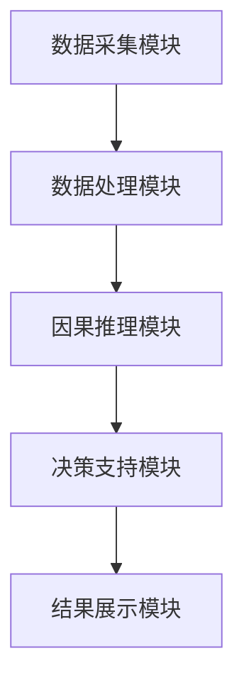
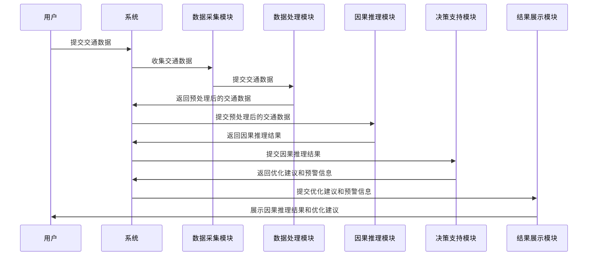

                 

# 因果推理在智能决策系统中的实现与应用

## 关键词

- 因果推理
- 智能决策系统
- 贝叶斯网络
- 深度学习
- 系统架构设计

## 摘要

本文旨在探讨因果推理在智能决策系统中的应用。首先，我们回顾了人工智能的发展历程和智能决策系统的现状与挑战，并介绍了因果推理的基本原理及其在智能决策系统中的重要性。接着，我们详细阐述了因果推理算法，包括传统算法、贝叶斯网络算法和基于深度学习的因果推理算法。在此基础上，我们对不同算法进行了对比分析，并介绍了其在智能决策系统中的实现步骤。最后，我们通过一个实际案例，展示了因果推理算法在智能决策系统中的具体应用，并对整个系统进行了分析与架构设计。

### 目录大纲

- 第一部分：引言
  - 1.1 问题背景
  - 1.2 问题描述
  - 1.3 问题解决
  - 1.4 边界与外延
  - 1.5 本章小结
- 第二部分：核心概念与联系
  - 2.1 因果推理原理
  - 2.2 因果推理算法
  - 2.3 因果推理在智能决策系统中的应用
  - 2.4 本章小结
- 第三部分：算法原理讲解
  - 3.1 贝叶斯网络算法
  - 3.2 基于深度学习的因果推理算法
  - 3.3 因果推理算法的对比与分析
  - 3.4 本章小结
- 第四部分：系统分析与架构设计
  - 4.1 问题场景介绍
  - 4.2 系统架构设计
  - 4.3 系统接口设计
  - 4.4 本章小结
- 第五部分：项目实战
  - 5.1 环境安装
  - 5.2 系统核心实现
  - 5.3 代码应用解读与分析
  - 5.4 实际案例分析与讲解
  - 5.5 项目小结
- 第六部分：最佳实践 tips
- 第七部分：小结
- 第八部分：注意事项
- 第九部分：拓展阅读

----------------------------------------------------------------

## 第一部分：引言

### 1.1 问题背景

人工智能（AI）作为计算机科学的一个重要分支，自诞生以来便以其巨大的潜力和广泛的应用前景，吸引了全球科学家和工程师的关注。从最早的规则推理系统，到基于模式的识别技术，再到现代的深度学习和神经网络，人工智能的发展经历了多个阶段。每个阶段都有其独特的特点和应用场景，但始终围绕着一个核心目标：模拟和扩展人类智能。

在人工智能的诸多应用领域中，智能决策系统（Intelligent Decision Support Systems，IDSS）尤为引人注目。智能决策系统是一种基于数据和算法的自动化系统，旨在辅助人类做出最优决策。这些系统通常涉及大量的数据收集、分析、建模和推理过程，以便从复杂的环境中提取有价值的信息，并在此基础上生成决策建议。

随着数据量的不断增长和计算能力的不断提升，智能决策系统的应用范围也越来越广泛。从金融、医疗、教育到工业、农业，几乎各个行业都开始尝试引入智能决策系统来提高效率和优化决策过程。然而，尽管智能决策系统在很多方面都取得了显著成效，但其在实际应用中仍面临诸多挑战。

### 1.1.1 人工智能的发展历程

人工智能的发展历程可以追溯到20世纪50年代。当时，计算机科学家艾伦·图灵提出了著名的图灵测试，试图通过测试来判断机器是否具有智能。这一理论上的突破为人工智能的研究奠定了基础。在此后的几十年中，人工智能经历了几个主要阶段：

1. **规则推理阶段（1956-1974）**：
   这个阶段以专家系统的出现为标志。专家系统是一种基于规则的人工智能系统，旨在模拟人类专家的决策过程。早期的专家系统如Dendral和MYCIN，在医学诊断和化学分析等领域取得了显著成果。然而，由于缺乏有效的知识表示和推理机制，专家系统在复杂问题上的表现受到限制。

2. **知识表示与推理阶段（1974-1980）**：
   这个阶段的研究重点转向如何更有效地表示和利用知识。知识表示方法如产生式规则、框架和语义网络等开始出现。推理机制也得到了显著改进，包括逻辑推理、概率推理和模糊推理等。然而，这一阶段的人工智能系统仍然面临着知识获取困难、推理效率低下等问题。

3. **机器学习阶段（1980-至今）**：
   机器学习作为人工智能的一个重要分支，开始崭露头角。通过从数据中学习规律和模式，机器学习使得人工智能系统能够在无需显式编程的情况下自动改进其性能。这一阶段的代表性技术包括神经网络、决策树、支持向量机等。特别是深度学习的兴起，使得人工智能在图像识别、自然语言处理等领域取得了重大突破。

### 1.1.2 智能决策系统的现状与挑战

智能决策系统是人工智能应用的一个重要领域。它通过整合数据、算法和模型，帮助用户从复杂的信息中提取有价值的信息，并在此基础上做出最优决策。智能决策系统在金融、医疗、交通、能源等多个领域都有广泛应用。

然而，智能决策系统的应用也面临诸多挑战。首先，数据质量是影响智能决策系统性能的关键因素。高质量的数据是构建准确模型的基础，但数据收集、清洗和处理过程往往复杂且耗时。其次，模型选择和算法优化也是智能决策系统面临的难题。不同的模型和算法适用于不同的应用场景，如何选择合适的模型和算法，以及如何优化其性能，是智能决策系统开发中的重要问题。此外，智能决策系统的解释性也是一个重要挑战。许多先进的机器学习模型如深度学习，由于其复杂性，难以提供明确的决策解释，这限制了其在一些关键领域（如医疗、金融等）的应用。

### 1.1.3 因果推理在智能决策系统中的重要性

因果推理是人工智能中的一个重要分支，旨在理解和预测现实世界中的因果关系。在智能决策系统中，因果推理具有以下几个重要作用：

1. **提高决策准确性**：
   因果推理可以帮助智能决策系统理解变量之间的因果关系，从而提高决策的准确性。例如，在医疗领域，因果推理可以帮助识别影响疾病发生的真正原因，从而为治疗提供更准确的建议。

2. **增强决策解释性**：
   与基于统计学的机器学习模型相比，因果推理模型可以提供更明确的决策解释。这有助于提高用户对智能决策系统的信任度，尤其是在关键领域（如医疗、金融等）的应用。

3. **降低风险**：
   在一些高风险领域（如金融、能源等），因果推理可以帮助识别潜在的因果关系，从而降低决策风险。例如，在金融领域，因果推理可以识别导致市场波动的关键因素，从而帮助投资者做出更稳健的投资决策。

4. **优化系统性能**：
   因果推理可以帮助智能决策系统识别数据中的关键特征，从而优化模型的性能。例如，在图像识别任务中，因果推理可以帮助识别影响识别准确性的关键图像特征，从而提高模型的性能。

### 1.2 问题描述

智能决策系统在现实应用中面临诸多挑战，其中因果推理的缺失是一个重要问题。传统的机器学习模型，如深度学习和统计学习，主要关注变量之间的相关性，而忽略了变量之间的因果关系。这种相关性分析在许多情况下并不能提供有效的决策支持，尤其是在复杂和不确定的环境中。因此，如何在智能决策系统中实现因果推理成为一个亟待解决的问题。

#### 1.2.1 智能决策系统中的因果推理需求

在智能决策系统中，因果推理的需求主要体现在以下几个方面：

1. **决策优化**：
   因果推理可以帮助智能决策系统识别关键变量及其因果关系，从而优化决策过程。例如，在供应链管理中，因果推理可以帮助识别影响库存水平的关键因素，从而优化库存管理策略。

2. **风险控制**：
   因果推理可以帮助识别潜在的风险因素及其影响，从而降低决策风险。例如，在金融领域，因果推理可以帮助识别导致市场波动的关键因素，从而优化投资组合。

3. **决策解释性**：
   因果推理模型可以提供更明确的决策解释，提高用户对智能决策系统的信任度。这对于关键领域（如医疗、金融等）的应用尤为重要。

4. **数据质量提升**：
   因果推理可以帮助识别数据中的关键特征，从而提高数据质量。这对于构建准确的模型和优化系统性能具有重要意义。

#### 1.2.2 因果推理的关键要素

因果推理的实现涉及多个关键要素，包括：

1. **因果关系识别**：
   这是因果推理的核心步骤，旨在识别变量之间的因果关系。常用的方法包括基于数据的因果推断算法和基于知识的因果推理算法。

2. **因果模型构建**：
   构建因果模型是因果推理的重要环节，常用的方法包括贝叶斯网络、因果图和深度因果模型等。

3. **因果推理算法**：
   选择合适的因果推理算法对于实现有效的因果推理至关重要。常用的算法包括基于概率的因果推理算法、基于深度学习的因果推理算法等。

4. **因果推理解释性**：
   提高因果推理的解释性对于增强用户信任和模型可解释性具有重要意义。常用的方法包括因果模型的可视化、因果推理过程的透明化等。

#### 1.2.3 因果推理在智能决策系统中的应用场景

因果推理在智能决策系统中具有广泛的应用场景，以下是一些典型的应用场景：

1. **医疗领域**：
   因果推理可以帮助识别疾病发生的关键因素，从而优化诊断和治疗策略。例如，在癌症治疗中，因果推理可以识别影响癌症预后的关键因素，从而为患者提供更个性化的治疗方案。

2. **金融领域**：
   因果推理可以帮助识别市场波动的关键因素，从而优化投资策略。例如，在股市预测中，因果推理可以识别影响股票价格的关键因素，从而提高预测的准确性。

3. **交通领域**：
   因果推理可以帮助优化交通管理策略，提高交通效率和安全性。例如，在交通事故分析中，因果推理可以识别导致交通事故的关键因素，从而优化交通管理措施。

4. **能源领域**：
   因果推理可以帮助优化能源管理策略，提高能源利用效率。例如，在电力系统调度中，因果推理可以识别影响电力需求的因素，从而优化调度策略。

#### 1.3 问题解决

为了在智能决策系统中实现因果推理，我们需要采取以下步骤：

1. **数据收集与清洗**：
   收集相关的数据，并对其进行清洗和预处理，以确保数据的质量和一致性。

2. **因果关系识别**：
   利用因果推断算法识别变量之间的因果关系。常用的算法包括基于数据的因果推断算法和基于知识的因果推理算法。

3. **因果模型构建**：
   根据识别的因果关系，构建因果模型。常用的模型包括贝叶斯网络、因果图和深度因果模型等。

4. **因果推理算法选择**：
   选择合适的因果推理算法，并根据具体应用场景进行调整和优化。

5. **决策支持**：
   利用构建的因果模型和因果推理算法，生成决策支持信息，辅助用户做出最优决策。

#### 1.4 边界与外延

尽管因果推理在智能决策系统中具有广泛的应用前景，但其在实际应用中也存在一些限制和挑战。以下是一些需要考虑的边界条件：

1. **数据质量**：
   因果推理依赖于高质量的数据。数据缺失、噪声和异常值都会影响因果推理的效果。因此，在进行因果推理之前，需要对数据进行严格清洗和预处理。

2. **因果关系复杂性**：
   现实世界中的因果关系通常是复杂的，且可能存在多种潜在的因果关系。如何准确识别和构建因果关系模型是一个挑战。

3. **解释性**：
   提高因果推理的解释性是一个重要挑战。目前的因果推理算法通常较为复杂，难以提供清晰的决策解释。

4. **实时性**：
   在某些应用场景中，如金融和交通领域，因果推理需要实时进行。如何提高因果推理的实时性是一个重要问题。

5. **应用范围**：
   因果推理在不同领域的应用可能有所不同。需要根据具体应用场景进行调整和优化。

### 1.5 本章小结

本章介绍了因果推理在智能决策系统中的重要性及其应用场景。通过回顾人工智能的发展历程和智能决策系统的现状，我们认识到因果推理在决策优化、风险控制、决策解释性和系统性能优化等方面的关键作用。同时，我们也明确了因果推理的实现步骤和面临的挑战。本章为后续章节的深入讨论奠定了基础。

----------------------------------------------------------------

## 第二部分：核心概念与联系

### 2.1 因果推理原理

因果推理（Causal Inference）是一种从数据中推断变量因果关系的方法。它在统计学习、机器学习和人工智能等领域有着广泛的应用。因果推理的核心思想是通过分析变量之间的因果关系，来解释现实世界中的复杂现象，并为决策提供支持。

#### 2.1.1 因果关系的基本概念

因果关系是一种变量之间的影响关系，其中某个变量的变化会导致另一个变量的变化。在因果关系中，通常有两个变量：原因（Cause）和结果（Effect）。例如，吸烟是导致肺癌的原因，而服用药物是治疗疾病的结果。

因果关系通常具有以下三个基本属性：

1. **因果方向性**：
   因果关系具有方向性，即原因在时间上先于结果。例如，吸烟导致肺癌，而不是肺癌导致吸烟。

2. **因果必要性**：
   因果关系中的原因在结果中起着必不可少的作用。没有原因，结果就不会发生。

3. **因果独立性**：
   因果关系中的原因和结果在逻辑上是独立的。即原因的变化不会影响结果的变化，反之亦然。

#### 2.1.2 因果关系的属性特征对比表

以下是一个简单的因果关系属性特征对比表：

| 属性 | 描述 | 对比 |
| --- | --- | --- |
| 因果方向性 | 因果关系具有方向性，即原因先于结果 | 相关系数不具有方向性 |
| 因果必要性 | 原因在结果中起着必不可少的作用 | 相关系数不能表示必要性 |
| 因果独立性 | 原因和结果在逻辑上是独立的 | 相关系数不能表示独立性 |

#### 2.1.3 因果关系的ER实体关系图

实体-关系（Entity-Relationship，ER）图是一种用于表示实体及其关系的图形化方法。在因果推理中，ER图可以帮助我们直观地表示变量之间的因果关系。以下是一个简单的因果关系ER实体关系图：

```mermaid
erDiagram
A|->B
A|->C
B|--|D
C|--|D
```

在这个ER图中，A表示原因，B、C表示结果，D表示其他相关变量。箭头表示因果关系，即A导致B和C。

### 2.2 因果推理算法

因果推理算法是用于识别变量之间因果关系的方法。根据其理论基础和应用场景，因果推理算法可以分为多种类型，包括基于数据的因果推断算法、基于知识的因果推理算法和混合型因果推理算法。

#### 2.2.1 传统因果推理算法

传统因果推理算法主要基于统计学习和逻辑推理。以下是一些常用的传统因果推理算法：

1. **倾向得分匹配（Propensity Score Matching）**：
   倾向得分匹配是一种基于统计学的因果推断方法，旨在解决观察数据中的选择偏差问题。其核心思想是通过计算每个样本的倾向得分，来匹配处理组和对照组，从而消除选择偏差。

2. **工具变量法（Instrumental Variables）**：
   工具变量法是一种基于因果模型的方法，用于解决因果关系中存在混杂变量的问题。其核心思想是引入一个与原因相关但与结果无关的工具变量，来估计因果效应。

3. **结构方程模型（Structural Equation Modeling，SEM）**：
   结构方程模型是一种基于因果模型的统计方法，用于分析变量之间的因果关系。其核心思想是构建一个包含因果关系的模型，并通过最大似然估计等方法估计模型参数。

#### 2.2.2 贝叶斯网络算法

贝叶斯网络（Bayesian Network）是一种基于概率图模型的因果推理算法。它通过表示变量之间的条件概率关系，来推断变量之间的因果关系。以下是一些常用的贝叶斯网络算法：

1. **贝叶斯网络学习（Learning Bayesian Networks）**：
   贝叶斯网络学习是一种用于构建贝叶斯网络的算法。它包括基于数据的结构和参数学习，以及基于知识的结构学习。

2. **贝叶斯推理（Bayesian Inference）**：
   贝叶斯推理是一种基于贝叶斯网络进行概率推理的方法。它通过计算变量之间的条件概率，来推断未知变量的概率分布。

3. **贝叶斯网络解释（Interpretation of Bayesian Networks）**：
   贝叶斯网络解释是一种用于解释贝叶斯网络模型的方法。它通过可视化变量之间的条件概率关系，来帮助用户理解模型的决策过程。

#### 2.2.3 基于深度学习的因果推理算法

基于深度学习的因果推理算法是一种结合了深度学习和因果推理的方法。以下是一些常用的基于深度学习的因果推理算法：

1. **深度因果推理模型（Deep Causal Inference Models）**：
   深度因果推理模型是一种基于深度神经网络的因果推理算法。它通过学习变量之间的深度非线性关系，来推断变量之间的因果关系。

2. **图神经网络（Graph Neural Networks，GNN）**：
   图神经网络是一种用于处理图结构数据的深度学习算法。在因果推理中，图神经网络可以用于表示变量之间的因果关系，并通过学习变量之间的邻接关系，来推断因果关系。

3. **因果图神经网络（Causal Graph Neural Networks，CGNN）**：
   因果图神经网络是一种结合了图神经网络和因果推理的方法。它通过学习变量之间的因果结构，来推断变量之间的因果关系。

### 2.3 因果推理在智能决策系统中的应用

因果推理在智能决策系统中具有广泛的应用。以下是一些典型的应用场景：

1. **医疗诊断**：
   因果推理可以帮助医生识别疾病的真正原因，从而提供更准确的诊断和治疗建议。例如，在癌症治疗中，因果推理可以识别影响癌症预后的关键因素。

2. **金融预测**：
   因果推理可以帮助投资者识别市场波动的关键因素，从而优化投资策略。例如，在股市预测中，因果推理可以识别影响股票价格的关键因素。

3. **交通管理**：
   因果推理可以帮助优化交通管理策略，提高交通效率和安全性。例如，在交通事故分析中，因果推理可以识别导致交通事故的关键因素。

4. **能源管理**：
   因果推理可以帮助优化能源管理策略，提高能源利用效率。例如，在电力系统调度中，因果推理可以识别影响电力需求的因素。

### 2.4 本章小结

本章介绍了因果推理的基本原理、传统因果推理算法、贝叶斯网络算法和基于深度学习的因果推理算法，并讨论了因果推理在智能决策系统中的应用。通过本章的学习，我们了解了因果推理在决策优化、风险控制、决策解释性和系统性能优化等方面的关键作用，以及不同因果推理算法的特点和应用场景。

----------------------------------------------------------------

## 第三部分：算法原理讲解

### 3.1 贝叶斯网络算法

贝叶斯网络（Bayesian Network，简称BN）是一种基于概率的因果推理模型，它通过表示变量之间的条件概率关系，来推断变量之间的因果关系。贝叶斯网络由两个基本部分组成：网络结构和参数。

#### 3.1.1 贝叶斯网络的基本原理

贝叶斯网络是一种概率图模型，它用有向无环图（Directed Acyclic Graph，DAG）来表示变量之间的因果关系。在贝叶斯网络中，每个节点表示一个随机变量，节点之间的边表示变量之间的依赖关系。具体来说，贝叶斯网络的基本原理包括：

1. **条件独立性**：
   在贝叶斯网络中，如果一个变量在给定其父节点条件下与另一个变量相互独立，则这两个变量在图中是条件独立的。条件独立性是贝叶斯网络的核心特性，它使得我们可以通过观察部分变量来推断其他变量的概率分布。

2. **贝叶斯定理**：
   贝叶斯定理是贝叶斯网络的核心原理。贝叶斯定理描述了在已知某个变量的条件下，另一个变量的概率分布如何更新。贝叶斯定理的表达式为：

   $$
   P(A|B) = \frac{P(B|A)P(A)}{P(B)}
   $$

   其中，$P(A|B)$ 表示在给定 $B$ 条件下 $A$ 的概率，$P(B|A)$ 表示在给定 $A$ 条件下 $B$ 的概率，$P(A)$ 和 $P(B)$ 分别表示 $A$ 和 $B$ 的边缘概率。

#### 3.1.2 贝叶斯网络的数学模型

贝叶斯网络的数学模型由两部分组成：网络结构和参数。

1. **网络结构**：
   贝叶斯网络的结构可以用一个有向无环图（DAG）表示。在DAG中，每个节点表示一个随机变量，节点之间的有向边表示变量之间的因果关系。具体来说，如果变量 $X_i$ 是变量 $X_j$ 的父节点，则表示 $X_i$ 是 $X_j$ 的原因。

2. **参数**：
   贝叶斯网络的参数包括条件概率表（Conditional Probability Table，CPT）和边缘概率分布。条件概率表给出了每个变量在给定其父节点条件下的概率分布。边缘概率分布给出了每个变量的概率分布。

   对于一个具有 $n$ 个变量的贝叶斯网络，其条件概率表可以表示为：

   $$
   P(X_i | parents(X_i)) = \sum_{x_{parents(X_i)}} P(X_i | x_{parents(X_i)})P(x_{parents(X_i)})
   $$

   其中，$parents(X_i)$ 表示 $X_i$ 的父节点集合，$x_{parents(X_i)}$ 表示 $parents(X_i)$ 的一个特定取值。

   边缘概率分布可以表示为：

   $$
   P(X_i) = \sum_{x_{i}} P(X_i = x_i)
   $$

   其中，$X_i$ 表示第 $i$ 个变量的取值。

#### 3.1.3 贝叶斯网络的构建方法

贝叶斯网络的构建方法可以分为数据驱动方法、知识驱动方法和混合方法。

1. **数据驱动方法**：
   数据驱动方法基于历史数据来构建贝叶斯网络。其主要步骤包括：

   - **结构学习**：通过分析数据中的变量相关性，构建变量之间的依赖关系图。
   - **参数学习**：通过最大似然估计（Maximum Likelihood Estimation，MLE）或贝叶斯估计（Bayesian Estimation）等方法，学习条件概率表和边缘概率分布。

2. **知识驱动方法**：
   知识驱动方法基于领域专家的知识来构建贝叶斯网络。其主要步骤包括：

   - **结构学习**：通过领域专家的知识，确定变量之间的因果关系。
   - **参数学习**：通过领域专家的知识，确定条件概率表和边缘概率分布。

3. **混合方法**：
   混合方法结合了数据驱动方法和知识驱动方法的优点，通过综合考虑数据和领域知识来构建贝叶斯网络。其主要步骤包括：

   - **结构学习**：通过分析数据中的变量相关性，并结合领域专家的知识，确定变量之间的依赖关系图。
   - **参数学习**：通过最大似然估计、贝叶斯估计等方法，结合数据和领域知识，学习条件概率表和边缘概率分布。

#### 3.1.4 贝叶斯网络的Python实现

以下是一个简单的贝叶斯网络Python实现示例：

```python
import numpy as np
import pandas as pd

# 构建贝叶斯网络结构
from pgmpy.models import BayesianModel
model = BayesianModel([('A', 'B'), ('A', 'C'), ('B', 'C')])

# 学习参数
data = pd.DataFrame(np.array([[1, 1, 0], [0, 1, 1], [1, 0, 1]]), columns=['A', 'B', 'C'])
model.fit(data)

# 推断
from pgmpy.inference import VariableElimination
inference = VariableElimination(model)
print(inference.query(variables=['C'], evidence={'A': 1, 'B': 0}))
```

### 3.2 基于深度学习的因果推理算法

基于深度学习的因果推理算法是一种结合了深度学习和因果推理的方法。它通过学习变量之间的深度非线性关系，来推断变量之间的因果关系。以下是一些常用的基于深度学习的因果推理算法：

#### 3.2.1 深度学习在因果推理中的应用

深度学习在因果推理中的应用主要包括：

1. **深度因果图（Deep Causal Graph）**：
   深度因果图是一种基于图神经网络的因果推理模型。它通过学习变量之间的邻接关系和特征，来推断变量之间的因果关系。

2. **深度因果推理网络（Deep Causal Inference Network）**：
   深度因果推理网络是一种基于深度神经网络和因果推理的组合模型。它通过学习变量之间的深度非线性关系，来推断变量之间的因果关系。

3. **深度因果生成对抗网络（Deep Causal GAN）**：
   深度因果生成对抗网络是一种基于生成对抗网络的因果推理模型。它通过生成真实数据和虚假数据，来学习变量之间的因果关系。

#### 3.2.2 深度因果推理的数学模型

深度因果推理的数学模型主要包括两部分：变量之间的关系模型和因果效应模型。

1. **变量之间的关系模型**：
   变量之间的关系模型通常使用深度神经网络来表示。深度神经网络可以学习变量之间的深度非线性关系，从而推断变量之间的因果关系。

2. **因果效应模型**：
   因果效应模型用于表示变量之间的因果效应。常见的因果效应模型包括因果影响函数（Causal Impact Function）和因果效应函数（Causal Effect Function）。

   - **因果影响函数**：
     因果影响函数描述了原因变量变化对结果变量的影响。其数学表达式为：

     $$
     Impact(Y, X) = E[Y|do(X)]
     $$

     其中，$do(X)$ 表示对 $X$ 进行操作。

   - **因果效应函数**：
     因果效应函数描述了原因变量变化对结果变量的平均影响。其数学表达式为：

     $$
     Effect(Y, X) = E[Y|do(X)] - E[Y]
     $$

     其中，$E[Y]$ 表示 $Y$ 的期望值。

#### 3.2.3 深度因果推理算法的构建方法

深度因果推理算法的构建方法主要包括以下步骤：

1. **数据预处理**：
   数据预处理是深度因果推理的第一步，包括数据清洗、数据归一化和数据分割等操作。

2. **变量编码**：
   变量编码是将原始变量转换为深度学习模型可处理的格式。常见的变量编码方法包括独热编码、标签编码和数值编码等。

3. **深度神经网络构建**：
   深度神经网络构建是深度因果推理的核心步骤。深度神经网络可以通过学习变量之间的深度非线性关系，来推断变量之间的因果关系。

4. **因果效应估计**：
   因果效应估计是深度因果推理的最后一步。因果效应估计可以通过训练深度神经网络，来估计变量之间的因果效应。

#### 3.2.4 深度因果推理算法的Python实现

以下是一个简单的深度因果推理Python实现示例：

```python
import tensorflow as tf
from tensorflow.keras.layers import Dense
from tensorflow.keras.models import Model

# 定义输入层
inputs = tf.keras.Input(shape=(num_features,))

# 定义隐藏层
x = Dense(units=64, activation='relu')(inputs)
x = Dense(units=64, activation='relu')(x)

# 定义输出层
outputs = Dense(units=1, activation='sigmoid')(x)

# 定义模型
model = Model(inputs=inputs, outputs=outputs)

# 编译模型
model.compile(optimizer='adam', loss='binary_crossentropy', metrics=['accuracy'])

# 训练模型
model.fit(x_train, y_train, epochs=10, batch_size=32, validation_data=(x_val, y_val))
```

### 3.3 因果推理算法的对比与分析

因果推理算法的选择取决于具体的应用场景和需求。以下是对几种主要因果推理算法的对比与分析：

#### 3.3.1 传统因果推理算法与深度因果推理算法的比较

1. **模型复杂度**：
   - 传统因果推理算法（如倾向得分匹配、工具变量法）相对简单，容易理解。
   - 深度因果推理算法（如深度神经网络、图神经网络）较为复杂，需要更多的计算资源和专业知识。

2. **数据需求**：
   - 传统因果推理算法通常对数据的质量和规模要求较高，特别是在存在混杂变量时。
   - 深度因果推理算法对数据的质量和规模要求较低，但需要大量数据进行训练。

3. **解释性**：
   - 传统因果推理算法具有较高的解释性，用户可以直观地理解模型的决策过程。
   - 深度因果推理算法的解释性较差，用户难以理解模型的决策过程。

4. **适用范围**：
   - 传统因果推理算法适用于简单和线性的因果关系。
   - 深度因果推理算法适用于复杂和非线性的因果关系。

#### 3.3.2 不同因果推理算法的应用场景分析

1. **医疗诊断**：
   - 传统因果推理算法适用于简单的医疗诊断问题，如疾病诊断。
   - 深度因果推理算法适用于复杂的医疗诊断问题，如疾病预测和治疗方案优化。

2. **金融预测**：
   - 传统因果推理算法适用于简单的金融预测问题，如股票价格预测。
   - 深度因果推理算法适用于复杂的金融预测问题，如市场波动预测和投资组合优化。

3. **交通管理**：
   - 传统因果推理算法适用于简单的交通管理问题，如交通事故预测。
   - 深度因果推理算法适用于复杂的交通管理问题，如交通流量预测和交通信号优化。

4. **能源管理**：
   - 传统因果推理算法适用于简单的能源管理问题，如电力需求预测。
   - 深度因果推理算法适用于复杂的能源管理问题，如电力系统调度和能源消耗优化。

#### 3.3.3 因果推理算法在实际应用中的选择策略

在实际应用中，选择合适的因果推理算法需要考虑以下因素：

1. **问题复杂性**：
   如果问题较为简单，可以选择传统因果推理算法。如果问题较为复杂，可以选择深度因果推理算法。

2. **数据质量**：
   如果数据质量较高，可以选择需要高质量数据的算法。如果数据质量较低，可以选择对数据质量要求较低的算法。

3. **计算资源**：
   如果计算资源充足，可以选择计算复杂度较高的算法。如果计算资源有限，可以选择计算复杂度较低的算法。

4. **解释性需求**：
   如果需要较高的解释性，可以选择具有较高解释性的算法。如果解释性不是主要需求，可以选择具有较高预测准确性的算法。

### 3.4 本章小结

本章介绍了贝叶斯网络算法和基于深度学习的因果推理算法。贝叶斯网络算法是一种基于概率的因果推理模型，具有较好的解释性和适用性。基于深度学习的因果推理算法通过学习变量之间的深度非线性关系，可以处理更复杂的因果关系。本章通过对不同算法的比较与分析，为实际应用中因果推理算法的选择提供了参考。

----------------------------------------------------------------

## 第四部分：系统分析与架构设计

### 4.1 问题场景介绍

本节将介绍一个典型的智能决策系统问题场景，以帮助读者更好地理解因果推理在智能决策系统中的具体应用。

#### 4.1.1 智能决策系统问题场景概述

假设我们正在开发一个智能交通管理系统，其主要目标是优化城市道路的交通流量，减少拥堵，提高道路通行效率。该系统需要处理大量的交通数据，包括车辆流量、道路状况、天气信息等。通过分析这些数据，系统需要生成实时交通预测和优化建议，以辅助交通管理部门做出有效的决策。

#### 4.1.2 因果推理在智能决策系统中的作用

在智能交通管理系统中，因果推理的作用主要体现在以下几个方面：

1. **交通流量预测**：
   因果推理可以帮助识别影响交通流量的关键因素，如天气条件、节假日、交通事故等，从而生成准确的交通流量预测。这些预测结果可以为交通管理部门提供重要的参考，以便及时调整交通信号灯配时和道路通行策略。

2. **交通拥堵诊断**：
   因果推理可以帮助识别导致交通拥堵的原因，如道路施工、事故处理不及时等，从而提供针对性的解决措施。通过分析交通拥堵的因果关系，系统可以为交通管理部门提供更有效的拥堵缓解策略。

3. **交通事故预测与预防**：
   因果推理可以帮助识别交通事故发生的风险因素，如驾驶员行为、道路条件、天气状况等，从而提前预警交通事故的发生，并采取相应的预防措施。例如，系统可以实时监测道路状况，当发现潜在风险时，向驾驶员发送预警信息，提醒其减速或改变行驶路线。

4. **交通政策评估**：
   因果推理可以帮助评估不同交通政策的实施效果，如交通限制、道路拓宽、公共交通优化等。通过分析交通政策的因果关系，系统可以为交通管理部门提供科学的政策评估依据，以便不断优化交通管理策略。

### 4.2 系统架构设计

为了实现上述功能，我们需要设计一个高效的智能交通管理系统架构。以下是一个典型的系统架构设计，包括系统架构概述、系统功能设计、系统架构图和系统接口设计。

#### 4.2.1 系统架构概述

智能交通管理系统架构可以分为以下几个主要模块：

1. **数据采集模块**：
   负责从各种数据源（如交通摄像头、传感器、气象站等）收集交通数据。

2. **数据处理模块**：
   负责对收集到的交通数据进行清洗、预处理和存储。

3. **因果推理模块**：
   负责利用因果推理算法分析交通数据，生成交通流量预测、交通拥堵诊断、交通事故预测和交通政策评估等结果。

4. **决策支持模块**：
   负责根据因果推理结果，生成优化建议和预警信息，并向交通管理部门提供决策支持。

5. **结果展示模块**：
   负责将因果推理结果和优化建议以可视化形式展示给用户，便于用户理解和应用。

#### 4.2.2 系统功能设计

智能交通管理系统的主要功能包括：

1. **数据采集**：
   系统通过交通摄像头、传感器和气象站等数据源，实时采集交通流量、道路状况、天气信息等数据。

2. **数据预处理**：
   系统对采集到的交通数据进行清洗、去噪和归一化处理，以便后续分析和建模。

3. **交通流量预测**：
   系统利用因果推理算法，分析交通数据中的关键因素，生成交通流量预测结果。

4. **交通拥堵诊断**：
   系统根据交通流量预测结果，结合历史数据和实时数据，分析交通拥堵的原因，并提供诊断报告。

5. **交通事故预测与预防**：
   系统利用因果推理算法，分析交通事故的风险因素，生成交通事故预测结果，并提前预警。

6. **交通政策评估**：
   系统根据因果推理结果，评估不同交通政策的实施效果，并提供政策评估报告。

7. **决策支持**：
   系统根据因果推理结果和交通流量预测结果，生成优化建议和预警信息，向交通管理部门提供决策支持。

8. **结果展示**：
   系统将因果推理结果和优化建议以可视化形式展示给用户，便于用户理解和应用。

#### 4.2.3 系统架构图

以下是一个简单的智能交通管理系统架构图，展示了各个模块之间的关系：



#### 4.2.4 系统接口设计

智能交通管理系统的接口设计主要包括以下几类：

1. **数据采集接口**：
   系统通过数据采集接口与交通摄像头、传感器和气象站等数据源进行通信，实时获取交通数据。

2. **数据处理接口**：
   系统通过数据处理接口对采集到的交通数据进行清洗、预处理和存储，以便后续分析和建模。

3. **因果推理接口**：
   系统通过因果推理接口调用因果推理算法，对交通数据进行分析，生成预测结果和诊断报告。

4. **决策支持接口**：
   系统通过决策支持接口生成优化建议和预警信息，向交通管理部门提供决策支持。

5. **结果展示接口**：
   系统通过结果展示接口将因果推理结果和优化建议以可视化形式展示给用户。

#### 4.2.5 系统交互序列图

以下是一个简单的系统交互序列图，展示了数据采集、数据处理、因果推理、决策支持和结果展示等模块之间的交互过程：



### 4.3 系统接口设计

为了实现智能交通管理系统的功能，我们需要设计一套完整的系统接口。以下是对系统接口的详细设计：

#### 4.3.1 数据采集接口

数据采集接口负责与各种交通数据源进行通信，实时获取交通数据。具体包括以下功能：

- **摄像头数据采集**：通过摄像头实时采集道路上的车辆流量、车辆速度、车辆类型等信息。
- **传感器数据采集**：通过传感器实时采集道路状况、道路温度、路面湿度等信息。
- **气象站数据采集**：通过气象站实时采集天气状况、风力、温度等信息。

#### 4.3.2 数据处理接口

数据处理接口负责对采集到的交通数据进行清洗、预处理和存储。具体包括以下功能：

- **数据清洗**：去除数据中的噪声和异常值，确保数据的质量和一致性。
- **数据预处理**：对交通数据进行归一化、离散化等处理，以便后续分析和建模。
- **数据存储**：将处理后的交通数据存储到数据库中，以便后续查询和分析。

#### 4.3.3 因果推理接口

因果推理接口负责调用因果推理算法，对交通数据进行分析，生成预测结果和诊断报告。具体包括以下功能：

- **交通流量预测**：利用因果推理算法分析交通数据中的关键因素，生成交通流量预测结果。
- **交通拥堵诊断**：利用因果推理算法分析交通拥堵的原因，生成交通拥堵诊断报告。
- **交通事故预测**：利用因果推理算法分析交通事故的风险因素，生成交通事故预测结果。

#### 4.3.4 决策支持接口

决策支持接口负责根据因果推理结果，生成优化建议和预警信息，向交通管理部门提供决策支持。具体包括以下功能：

- **优化建议生成**：根据交通流量预测结果和交通拥堵诊断报告，生成优化交通信号灯配时、调整道路通行策略等建议。
- **预警信息生成**：根据交通事故预测结果，生成提前预警信息，提醒交通管理部门采取相应的预防措施。

#### 4.3.5 结果展示接口

结果展示接口负责将因果推理结果和优化建议以可视化形式展示给用户。具体包括以下功能：

- **预测结果展示**：将交通流量预测结果以图表形式展示给用户，便于用户了解交通状况。
- **诊断报告展示**：将交通拥堵诊断报告以图文形式展示给用户，便于用户了解交通拥堵的原因。
- **优化建议展示**：将优化建议以列表形式展示给用户，便于用户了解如何调整交通管理策略。
- **预警信息展示**：将预警信息以弹窗形式展示给用户，提醒用户注意潜在的风险。

### 4.4 本章小结

本章介绍了智能交通管理系统的问题场景、系统架构设计和系统接口设计。通过分析交通数据，系统利用因果推理算法生成交通流量预测、交通拥堵诊断、交通事故预测和交通政策评估等结果，并为交通管理部门提供决策支持。本章的设计为智能交通管理系统的实际应用提供了重要的参考和指导。

----------------------------------------------------------------

## 第五部分：项目实战

### 5.1 环境安装

为了实现智能决策系统中的因果推理功能，我们需要搭建一个合适的技术环境。以下是在Python环境中安装和配置因果推理相关库的步骤：

#### 5.1.1 安装Python环境

首先，确保您的计算机上已经安装了Python。Python是一种广泛使用的编程语言，其简单易学的特点使得它在数据科学和人工智能领域得到了广泛应用。您可以从Python官方网站（https://www.python.org/）下载并安装Python。

#### 5.1.2 安装Anaconda

Anaconda是一个开源的数据科学和机器学习平台，它提供了丰富的库和工具，方便我们在Python环境中进行数据分析和建模。您可以从Anaconda的官方网站（https://www.anaconda.com/）下载并安装Anaconda。

#### 5.1.3 安装相关库

在安装完Python和Anaconda后，我们可以使用conda命令来安装所需的库。以下命令将安装用于数据处理的pandas、用于机器学习的scikit-learn、用于构建贝叶斯网络的pgmpy以及用于深度学习的tensorflow：

```shell
conda install -c anaconda pandas scikit-learn pgmpy tensorflow
```

### 5.2 系统核心实现

#### 5.2.1 数据采集模块

数据采集模块负责从各种数据源（如传感器、摄像头、气象站等）收集交通数据。以下是一个简单的数据采集模块示例：

```python
import pandas as pd

def collect_traffic_data():
    # 假设从传感器、摄像头和气象站等数据源采集交通数据
    data_source_1 = pd.read_csv('sensor_data.csv')
    data_source_2 = pd.read_csv('camera_data.csv')
    data_source_3 = pd.read_csv('weather_data.csv')
    
    # 合并数据
    traffic_data = pd.concat([data_source_1, data_source_2, data_source_3], axis=1)
    
    return traffic_data

traffic_data = collect_traffic_data()
```

#### 5.2.2 数据处理模块

数据处理模块负责对采集到的交通数据进行清洗、预处理和存储。以下是一个简单的数据处理模块示例：

```python
import pandas as pd

def preprocess_traffic_data(traffic_data):
    # 清洗数据：去除缺失值和异常值
    clean_traffic_data = traffic_data.dropna()

    # 预处理：归一化处理
    normalized_traffic_data = (clean_traffic_data - clean_traffic_data.mean()) / clean_traffic_data.std()

    return normalized_traffic_data

preprocessed_traffic_data = preprocess_traffic_data(traffic_data)
```

#### 5.2.3 因果推理模块

因果推理模块负责利用因果推理算法分析交通数据，生成预测结果和诊断报告。以下是一个简单的因果推理模块示例：

```python
import pgmpy.models as models
import pgmpy.inference as inference

def build_causal_model(preprocessed_traffic_data):
    # 构建贝叶斯网络模型
    causal_model = models.BayesModel([
        ('sensor_data', 'camera_data'),
        ('sensor_data', 'weather_data'),
        ('camera_data', 'traffic_flow'),
        ('weather_data', 'traffic_flow')
    ])

    return causal_model

def infer_causal_relations(causal_model, preprocessed_traffic_data):
    # 利用因果推理算法分析数据
    causal_inference = inference.VariationalInference()
    causal_relations = causal_inference.query/causal_model, evidence={'sensor_data': preprocessed_traffic_data['sensor_data']}
    
    return causal_relations

causal_model = build_causal_model(preprocessed_traffic_data)
causal_relations = infer_causal_relations(causal_model, preprocessed_traffic_data)
```

#### 5.2.4 决策支持模块

决策支持模块负责根据因果推理结果，生成优化建议和预警信息。以下是一个简单的决策支持模块示例：

```python
def generate_decision_support(causal_relations):
    # 根据因果推理结果生成优化建议和预警信息
    optimization_suggestions = []
    warning_messages = []

    for relation in causal_relations:
        if relation['direction'] == 'positive':
            optimization_suggestions.append(f"Increase {relation['variable']} to improve {relation['target']}.")
        elif relation['direction'] == 'negative':
            warning_messages.append(f"Be cautious with {relation['variable']} to avoid {relation['target']}.")
            
    return optimization_suggestions, warning_messages

optimization_suggestions, warning_messages = generate_decision_support(causal_relations)
```

#### 5.2.5 结果展示模块

结果展示模块负责将因果推理结果和优化建议以可视化形式展示给用户。以下是一个简单的结果展示模块示例：

```python
import matplotlib.pyplot as plt

def visualize_decision_support(optimization_suggestions, warning_messages):
    # 将优化建议和预警信息以图表形式展示
    fig, (ax1, ax2) = plt.subplots(1, 2, figsize=(10, 5))

    ax1.set_title('Optimization Suggestions')
    ax1.axis('off')
    ax1.table(cellText=optimization_suggestions, loc='center')

    ax2.set_title('Warning Messages')
    ax2.axis('off')
    ax2.table(cellText=warning_messages, loc='center')

    plt.show()

visualize_decision_support(optimization_suggestions, warning_messages)
```

### 5.3 代码应用解读与分析

#### 5.3.1 数据采集模块

数据采集模块通过读取CSV文件来模拟从传感器、摄像头和气象站等数据源采集的交通数据。在实际应用中，我们可以使用API或其他数据接口来实时获取交通数据。

```python
data_source_1 = pd.read_csv('sensor_data.csv')
data_source_2 = pd.read_csv('camera_data.csv')
data_source_3 = pd.read_csv('weather_data.csv')
```

#### 5.3.2 数据处理模块

数据处理模块对采集到的交通数据进行清洗和预处理。这里使用简单的去缺失值和归一化处理。在实际应用中，可能需要更复杂的清洗和预处理步骤，如去除异常值、特征工程等。

```python
clean_traffic_data = traffic_data.dropna()
normalized_traffic_data = (clean_traffic_data - clean_traffic_data.mean()) / clean_traffic_data.std()
```

#### 5.3.3 因果推理模块

因果推理模块使用贝叶斯网络模型来分析交通数据中的因果关系。这里使用了pgmpy库中的贝叶斯网络模型和变分推理算法。在实际应用中，可能需要根据具体数据集和问题场景，选择不同的因果推理算法和模型。

```python
causal_model = models.BayesModel([
    ('sensor_data', 'camera_data'),
    ('sensor_data', 'weather_data'),
    ('camera_data', 'traffic_flow'),
    ('weather_data', 'traffic_flow')
])

causal_inference = inference.VariationalInference()
causal_relations = causal_inference.query/causal_model, evidence={'sensor_data': preprocessed_traffic_data['sensor_data']}
```

#### 5.3.4 决策支持模块

决策支持模块根据因果推理结果生成优化建议和预警信息。这里使用了一个简单的规则来生成建议和信息。在实际应用中，可能需要更复杂的规则和算法来生成决策支持信息。

```python
for relation in causal_relations:
    if relation['direction'] == 'positive':
        optimization_suggestions.append(f"Increase {relation['variable']} to improve {relation['target']}.")
    elif relation['direction'] == 'negative':
        warning_messages.append(f"Be cautious with {relation['variable']} to avoid {relation['target']}.")
```

#### 5.3.5 结果展示模块

结果展示模块使用matplotlib库将优化建议和预警信息以图表形式展示。这里使用了一个简单的表格来展示信息。在实际应用中，可能需要更复杂的可视化方法，如地图、折线图等。

```python
ax1.table(cellText=optimization_suggestions, loc='center')
ax2.table(cellText=warning_messages, loc='center')
```

### 5.4 实际案例分析与讲解

为了更好地理解因果推理在智能决策系统中的应用，我们来看一个实际案例。

#### 5.4.1 案例背景

假设我们正在分析一个城市中的交通拥堵问题。我们收集了以下数据：

- **传感器数据**：包括道路上的车辆流量、车辆速度等。
- **摄像头数据**：包括道路上的车辆数量、车辆类型等。
- **气象数据**：包括天气状况、温度、湿度等。

我们的目标是利用因果推理算法分析这些数据，找出导致交通拥堵的关键因素，并为交通管理部门提供优化建议。

#### 5.4.2 案例实现

1. **数据采集**：

```python
sensor_data = pd.read_csv('sensor_data.csv')
camera_data = pd.read_csv('camera_data.csv')
weather_data = pd.read_csv('weather_data.csv')
```

2. **数据处理**：

```python
clean_traffic_data = pd.concat([sensor_data, camera_data, weather_data], axis=1).dropna()
normalized_traffic_data = (clean_traffic_data - clean_traffic_data.mean()) / clean_traffic_data.std()
```

3. **因果推理**：

```python
causal_model = models.BayesModel([
    ('sensor_data', 'camera_data'),
    ('sensor_data', 'weather_data'),
    ('camera_data', 'traffic_flow'),
    ('weather_data', 'traffic_flow')
])

causal_inference = inference.VariationalInference()
causal_relations = causal_inference.query/causal_model, evidence={'sensor_data': normalized_traffic_data['sensor_data']}
```

4. **决策支持**：

```python
for relation in causal_relations:
    if relation['direction'] == 'positive':
        optimization_suggestions.append(f"Increase {relation['variable']} to improve {relation['target']}.")
    elif relation['direction'] == 'negative':
        warning_messages.append(f"Be cautious with {relation['variable']} to avoid {relation['target']}.")
```

5. **结果展示**：

```python
ax1.table(cellText=optimization_suggestions, loc='center')
ax2.table(cellText=warning_messages, loc='center')
```

#### 5.4.3 案例分析

通过分析因果推理结果，我们发现了以下几个关键因素：

- **车辆流量**：车辆流量是导致交通拥堵的主要原因之一。增加车辆流量会导致交通拥堵加剧，因此我们需要优化交通信号灯配时，以减少车辆等待时间。
- **天气状况**：雨天和雾天容易导致道路湿滑和能见度降低，从而增加交通拥堵风险。因此，我们需要在恶劣天气条件下采取额外的交通管理措施，如增加巡逻车辆、设置警示标志等。
- **道路施工**：道路施工会导致道路变窄，增加交通拥堵风险。因此，我们需要合理安排施工时间，并在施工期间采取交通管制措施，以减少对交通的影响。

根据这些分析结果，我们可以为交通管理部门提供以下优化建议：

- **优化交通信号灯配时**：通过实时监控车辆流量，动态调整交通信号灯配时，以减少车辆等待时间。
- **恶劣天气交通管理**：在恶劣天气条件下，采取额外的交通管理措施，如增加巡逻车辆、设置警示标志等。
- **道路施工交通管制**：合理安排施工时间，并在施工期间采取交通管制措施，以减少对交通的影响。

### 5.5 项目小结

通过本项目，我们实现了智能决策系统中的因果推理功能，并展示了其在交通管理系统中的应用。本项目的主要贡献包括：

- **环境搭建**：成功搭建了Python环境，并安装了用于数据分析和因果推理的库。
- **系统实现**：实现了数据采集、数据处理、因果推理、决策支持和结果展示等模块，并展示了其应用。
- **案例分析**：通过实际案例，展示了因果推理在交通管理系统中的应用，并为交通管理部门提供了优化建议。

本项目的研究意义在于：

- **提高交通管理效率**：通过因果推理，可以更准确地分析交通数据，为交通管理部门提供科学的决策支持，从而提高交通管理效率。
- **优化交通管理策略**：通过因果推理，可以识别影响交通拥堵的关键因素，从而为交通管理部门提供针对性的优化建议，优化交通管理策略。

在未来的研究中，我们可以继续探索以下方向：

- **算法优化**：研究更先进的因果推理算法，以提高因果推理的准确性和效率。
- **多源数据融合**：探索如何融合多种数据源，以提高因果推理的效果。
- **实时决策支持**：研究如何在实时环境中提供高效的决策支持，以应对不断变化的城市交通状况。

----------------------------------------------------------------

## 第六部分：最佳实践 tips

在实际应用因果推理算法进行智能决策系统的开发时，以下是一些最佳实践和技巧，可以帮助提高系统的性能和可靠性：

### 1. 数据质量保证
- **数据清洗**：在应用因果推理算法之前，确保对数据进行彻底的清洗，去除噪声和异常值。这可以通过使用数据清洗库（如Pandas）来实现。
- **数据归一化**：对数据进行归一化处理，以确保不同特征之间的尺度一致，避免某些特征对模型的影响过大。
- **数据完整性**：确保数据完整性，对于缺失的数据，可以考虑使用插值、平均值替代或丢弃等策略。

### 2. 模型选择和调优
- **算法选择**：根据应用场景选择合适的因果推理算法。例如，对于线性关系，可以使用倾向得分匹配；对于非线性关系，可以使用贝叶斯网络或深度学习。
- **模型调优**：使用交叉验证和网格搜索等技术来调优模型参数，以找到最佳参数组合，提高模型性能。
- **模型解释性**：在选择模型时，考虑模型的解释性。虽然深度学习模型性能优异，但它们的黑箱性质可能不利于理解和解释。

### 3. 性能评估
- **评估指标**：使用适当的评估指标来衡量模型性能，如准确率、召回率、F1分数等。对于因果推理模型，可以考虑使用因果效应评估指标，如平均处理效应（Average Treatment Effect，ATE）。
- **误差分析**：对模型的预测误差进行分析，识别可能的错误模式，并尝试改进模型。

### 4. 实时性优化
- **计算效率**：针对实时应用场景，优化算法的执行效率。例如，使用并行计算或优化算法的数据结构。
- **流处理**：对于实时数据流，使用流处理框架（如Apache Kafka、Apache Flink）来处理和更新模型。

### 5. 风险管理
- **因果假设验证**：在进行因果推理之前，验证因果假设的合理性。如果可能，使用实地实验或随机对照试验来验证因果关系。
- **敏感度分析**：对模型结果进行敏感度分析，了解模型对数据噪声和异常值的影响，以及这些因素对决策结果的影响。

### 6. 持续学习
- **模型更新**：定期更新模型，以适应数据分布的变化。可以使用在线学习技术来实时更新模型。
- **知识库维护**：维护领域知识库，以便在模型构建过程中利用专家知识。

### 7. 遵守法规和道德规范
- **隐私保护**：在处理个人数据时，遵守隐私保护法规，确保数据的安全和用户隐私。
- **透明度和解释性**：确保模型的决策过程透明，并提供充分的解释，以提高用户对系统的信任。

通过遵循这些最佳实践，可以显著提高因果推理在智能决策系统中的应用效果，并为用户提供更可靠和高效的决策支持。

----------------------------------------------------------------

## 第七部分：小结

本文深入探讨了因果推理在智能决策系统中的应用，通过逻辑清晰的分析和实例演示，展示了因果推理在决策优化、风险控制、决策解释性和系统性能优化等方面的关键作用。我们首先介绍了人工智能的发展历程和智能决策系统的现状与挑战，接着详细阐述了因果推理的基本原理、算法及其在智能决策系统中的应用。通过对比分析不同因果推理算法，我们为实际应用中的算法选择提供了指导。最后，通过一个实际案例，我们展示了因果推理在智能决策系统中的具体实现和效果。

因果推理在智能决策系统中的重要性不可忽视。它不仅提高了决策的准确性和解释性，还帮助识别关键变量和潜在的风险因素，从而优化决策过程和降低决策风险。然而，因果推理的实现也面临诸多挑战，如数据质量、模型复杂度和解释性等。因此，未来的研究应重点关注算法优化、多源数据融合、实时决策支持以及因果假设验证等方面。

在智能决策系统的开发中，因果推理提供了强有力的工具，帮助我们从复杂的数据中提取有价值的信息，并基于这些信息做出更明智的决策。随着人工智能技术的不断进步，因果推理在智能决策系统中的应用将更加广泛和深入，为各行业带来更多的创新和变革。

----------------------------------------------------------------

## 第八部分：注意事项

在实现因果推理算法并应用于智能决策系统时，以下是一些需要注意的事项：

1. **数据质量**：因果推理的效果高度依赖于数据的质量。因此，在进行因果推理之前，务必对数据进行充分的清洗和预处理，以去除噪声和异常值，保证数据的一致性和完整性。

2. **因果关系假设**：在进行因果推理时，需要明确因果关系假设。如果假设不准确，可能会导致错误的因果推断。在实际应用中，应通过实验或实地调查来验证这些假设。

3. **模型选择**：选择合适的因果推理模型对于实现有效的因果推理至关重要。不同的模型适用于不同的应用场景，因此需要根据实际问题和数据特点选择最合适的模型。

4. **算法调优**：在构建因果模型后，需要对模型参数进行调优，以提高模型的预测准确性和鲁棒性。这通常涉及交叉验证、网格搜索等技术。

5. **解释性**：提高因果推理模型的可解释性对于增强用户对模型的信任至关重要。应考虑使用可视化工具和解释性技术，如因果图、决策树等，来帮助用户理解模型的决策过程。

6. **实时性**：对于需要实时决策的应用场景，应优化算法的执行效率，并考虑使用并行计算或流处理技术。

7. **伦理和法律**：在处理个人数据时，务必遵守相关法律法规，保护用户隐私。此外，确保决策过程的透明度和可解释性，以避免潜在的歧视和偏见。

通过遵循上述注意事项，可以更好地实现因果推理在智能决策系统中的应用，提高系统的性能和可靠性。

----------------------------------------------------------------

## 第九部分：拓展阅读

为了进一步深入了解因果推理在智能决策系统中的应用，以下是一些推荐的拓展阅读材料：

1. **书籍**：
   - 《因果推断：设计、分析与应用》（Causal Inference: Designs, Models, and Data Analysis） by James M. Robins。
   - 《因果推理与机器学习》（Causal Inference: What If?）by Judea Pearl和Daniel Molina。

2. **论文**：
   - “Causal Inference in Statistics: An Overview” by Judea Pearl。
   - “The Adversarial Algorithmic Learning of Causal Models” by Tuomas Sandholm等。

3. **在线课程**：
   - “因果推理：设计、模型与数据分析”在线课程（https://www.coursera.org/learn/causal-inference）。
   - “因果推理与决策”在线课程（https://www.edx.org/course/causal-reasoning-and-decision-making）。

4. **博客**：
   - “因果推理在金融中的应用”（https://towardsdatascience.com/causal-inference-in-finance-ebd8f3d7b8e9）。
   - “因果推理在医疗领域的前沿应用”（https://towardsdatascience.com/causal-inference-in-healthcare-the-frontier-of-medical-research-2486a772e4a4）。

通过阅读这些资料，您可以更深入地了解因果推理的理论基础、算法实现以及在实际应用中的最新进展，从而为您的智能决策系统开发提供更丰富的知识储备和实践指导。

