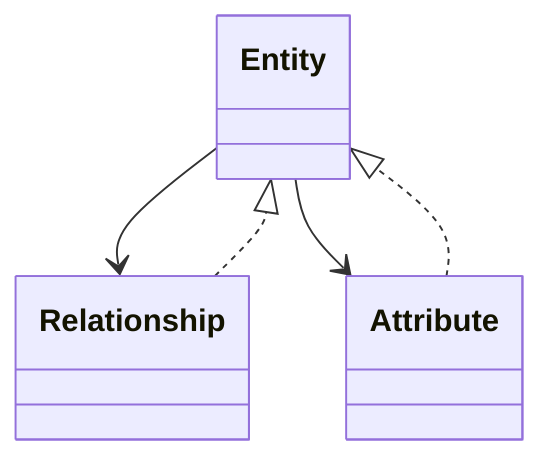
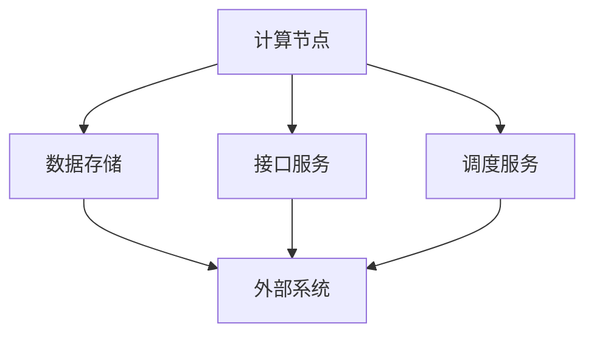
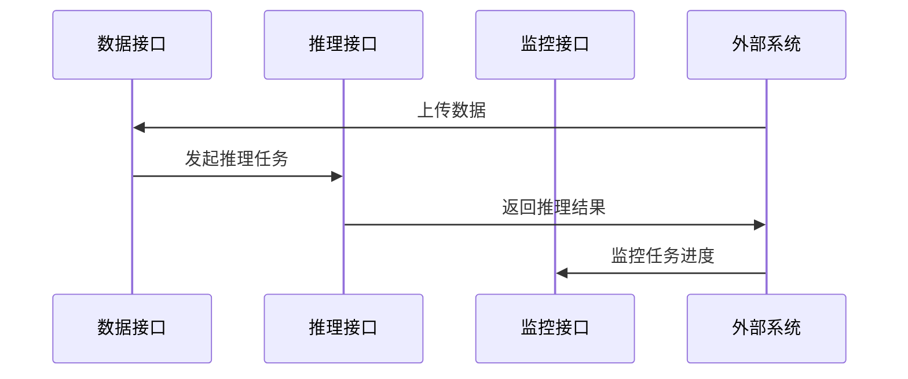
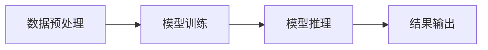

                 

### 关键词

- 关系推理
- 图Transformer
- 自注意力机制
- 大规模数据处理
- 系统架构设计

### 摘要

本文探讨了图Transformer在大规模关系推理中的应用。通过详细介绍关系推理的基本概念、图Transformer的工作原理和优势，本文揭示了图Transformer如何通过自注意力机制和位置编码提升大规模关系推理的性能。文章进一步展示了图Transformer在社交网络分析、问答系统和文本分类等领域的实际应用案例，并通过具体的项目实战，深入讲解了图Transformer的系统架构设计和实现过程。最后，本文总结了最佳实践经验，并对未来的研究方向提出了展望。

## 第一部分：关系推理与图Transformer概述

### 第1章：关系推理概述

#### 1.1 关系推理的基本概念

关系推理是指利用已知的事实和规则，推导出新的结论或知识的过程。它是人工智能领域中的一个重要研究方向，广泛应用于信息检索、知识图谱、问答系统等场景。关系推理的核心在于能够识别和理解实体之间的关系，从而在复杂的信息网络中提取有价值的信息。

#### 1.1.1 关系推理的定义

关系推理可以简单定义为：在已知一组实体及其关系的基础上，通过推理算法和规则，推断出新的实体关系。例如，在一个人际关系网络中，如果已知一个人A是另一个人B的朋友，而B是C的朋友，则可以通过关系推理推断出A和C也是朋友。

#### 1.1.2 关系推理的重要性

关系推理在多个领域具有广泛的应用价值：

1. **信息检索**：通过关系推理，可以更精确地匹配用户查询与数据库中的信息，提高检索效率。
2. **知识图谱**：关系推理是构建知识图谱的核心技术，可以帮助整合和关联各类知识，实现知识图谱的自动扩展。
3. **问答系统**：关系推理能够提高问答系统的回答准确性，使系统能够理解问题的隐含关系。
4. **社交网络分析**：关系推理可以用于分析社交网络中的关系结构，挖掘潜在的社交关系。

#### 1.1.3 关系推理的应用场景

关系推理的应用场景广泛，主要包括：

- **企业信息管理**：企业可以使用关系推理技术，整合各部门的信息，实现知识的共享和利用。
- **智能推荐系统**：关系推理可以帮助推荐系统发现用户之间的相似性，提供个性化的推荐服务。
- **金融风险控制**：关系推理可以用于分析金融网络中的关系，识别潜在的金融风险。
- **医疗数据分析**：关系推理可以帮助医疗系统分析患者之间的疾病关系，提供个性化的治疗方案。

#### 1.2 传统关系推理方法

传统的关系推理方法主要包括基于规则的方法、基于知识的方法和基于模型的方法。

#### 1.2.1 基于规则的方法

基于规则的方法通过定义一组预定义的规则，将输入数据与规则进行匹配，从而推导出新的结论。这种方法简单直观，但规则的编写需要大量的人工干预，且难以适应动态变化的环境。

#### 1.2.2 基于知识的方法

基于知识的方法通过构建知识库，将已知的事实和规则存储在库中，通过查询和推理算法来推导新的关系。这种方法具有较强的可扩展性和灵活性，但知识库的构建和维护成本较高。

#### 1.2.3 基于模型的方法

基于模型的方法通过学习输入数据的特征和关系，构建一个预测模型，用于推理新的关系。这种方法利用了机器学习技术，能够自适应地学习数据中的规律，但模型的训练和优化过程复杂。

### 第2章：图Transformer原理详解

#### 2.1 图Transformer的基本概念

图Transformer是一种结合图神经网络（Graph Neural Networks, GNN）和Transformer模型的混合模型。它旨在利用图结构和Transformer的自注意力机制，提升关系推理的性能。

#### 2.1.1 图神经网络

图神经网络是一种用于处理图结构数据的神经网络。它通过节点和边的特征，学习图中的复杂关系和模式。GNN广泛应用于社交网络分析、知识图谱、生物信息学等领域。

#### 2.1.2 Transformer模型

Transformer模型是一种基于自注意力机制的序列模型，最初用于自然语言处理任务。它通过全局注意力机制，捕捉输入序列中各元素之间的关系，具有很好的序列建模能力。

#### 2.1.3 图Transformer的融合

图Transformer通过融合GNN和Transformer的优点，将图结构和序列信息结合起来。它首先使用GNN对图中的节点和边进行特征提取，然后使用Transformer的自注意力机制，对提取的特征进行融合和推理。

#### 2.2 图Transformer的工作原理

图Transformer的工作原理主要包括以下几个步骤：

1. **节点特征提取**：使用GNN对图中的节点和边进行特征提取。
2. **序列生成**：将提取的特征序列化，形成一个统一的输入序列。
3. **自注意力机制**：使用Transformer的自注意力机制，对序列中的特征进行融合和加权。
4. **输出生成**：根据融合后的特征，生成最终的输出结果。

#### 2.2.1 自注意力机制

自注意力机制是Transformer模型的核心组件。它通过计算输入序列中每个元素与其他元素之间的相似性，自动地加权这些元素，从而捕捉序列中的关系和模式。

#### 2.2.2 位置编码

位置编码是一种用于处理序列信息的技术。它为序列中的每个元素添加位置信息，使得模型能够理解序列的顺序关系。

#### 2.2.3 上下文生成

上下文生成是Transformer模型的一个关键特性。它通过自注意力机制，对序列中的特征进行融合和加权，从而生成一个全局的上下文表示。

#### 2.3 图Transformer的优势

图Transformer具有以下优势：

1. **大规模数据处理能力**：通过融合GNN和Transformer，图Transformer能够处理大规模的图结构数据。
2. **优秀的性能表现**：自注意力机制和位置编码使得图Transformer在关系推理任务中具有很好的性能。
3. **灵活的模型结构**：图Transformer可以根据具体任务的需求，调整模型的结构和参数，实现定制化的关系推理。

## 第3章：图Transformer在关系推理中的应用

### 3.1 图Transformer在关系推理中的角色

图Transformer在关系推理中扮演着核心角色，其优势在于能够同时利用图结构和序列信息，从而提高推理性能。

#### 3.1.1 提取图中的关系信息

图Transformer通过GNN对图中的节点和边进行特征提取，捕捉图中的关系信息。这些特征信息为后续的关系推理提供了基础。

#### 3.1.2 学习复杂的图结构

图Transformer利用Transformer的自注意力机制，对提取的特征进行融合和加权，从而学习复杂的图结构。这种结构学习有助于提高关系推理的准确性。

#### 3.1.3 改善推理效果

通过融合图结构和序列信息，图Transformer能够提供更丰富的特征表示，从而改善推理效果。相比传统的关系推理方法，图Transformer在多个任务中均取得了显著的效果提升。

### 3.2 图Transformer的应用案例

图Transformer在多个领域和任务中得到了广泛应用，以下是一些典型的应用案例：

#### 3.2.1 社交网络分析

在社交网络分析中，图Transformer可以用于识别用户之间的关系，挖掘社交网络中的潜在群体和关系链。

#### 3.2.2 问答系统

在问答系统中，图Transformer可以用于理解问题中的关系，提高问答系统的回答准确性。

#### 3.2.3 文本分类

在文本分类任务中，图Transformer可以用于分析文本中的关系，提高分类的准确性。

#### 3.2.4 联想推理

在联想推理任务中，图Transformer可以用于发现文本中的隐含关系，提供更丰富的联想信息。

### 3.3 图Transformer的应用前景

随着图数据和序列数据的日益增长，图Transformer在关系推理中的应用前景十分广阔。未来，图Transformer有望在更多的领域中发挥重要作用，推动关系推理技术的发展。

## 第4章：图Transformer的数学模型与公式

### 4.1 自注意力机制的数学模型

自注意力机制是图Transformer的核心组件之一。其基本原理是通过计算输入序列中每个元素与其他元素之间的相似性，对元素进行加权。具体来说，自注意力机制可以表示为：

$$
\text{Score} = \text{softmax}(\text{Q} \cdot \text{K}^T)
$$

其中，\(Q\)、\(K\)、\(V\) 分别为查询向量、键向量和值向量，\(\text{softmax}\) 函数用于归一化权重。

### 4.2 位置编码的数学模型

位置编码是Transformer模型中用于处理序列信息的技术。它为序列中的每个元素添加位置信息，使得模型能够理解序列的顺序关系。位置编码可以表示为：

$$
\text{Positional Encoding} = \text{sin}(i \cdot \frac{\pi}{10000^{0.5} \cdot d_{model}})
$$

其中，\(i\) 为元素的位置索引，\(d_{model}\) 为模型的维度。

### 4.3 上下文生成的数学模型

上下文生成是Transformer模型的一个关键特性。它通过自注意力机制，对序列中的特征进行融合和加权，从而生成一个全局的上下文表示。上下文生成可以表示为：

$$
\text{Contextual Embedding} = \text{Attention}(\text{Q}, \text{K}, \text{V})
$$

其中，\(\text{Attention}\) 函数用于计算自注意力。

## 第5章：图Transformer系统架构设计

### 5.1 关系推理系统介绍

关系推理系统是一种基于图Transformer的关系推理框架。它旨在利用图结构和序列信息，提高关系推理的性能。关系推理系统的核心功能包括：

1. **数据预处理**：对输入数据进行预处理，包括节点特征提取、边特征提取和序列生成等。
2. **图Transformer模型**：使用图Transformer模型对预处理后的数据进行分析和推理。
3. **结果输出**：输出推理结果，包括新的关系、分类结果等。

### 5.2 领域模型设计

领域模型是关系推理系统的基础，它定义了系统的核心概念和关系。领域模型主要包括以下组件：

1. **实体**：表示关系推理系统中的基本元素，如人、地点、物品等。
2. **关系**：表示实体之间的关联关系，如朋友、邻居、购买等。
3. **属性**：表示实体的特征信息，如年龄、性别、价格等。

为了更好地展示领域模型，可以使用Mermaid类图来表示：



### 5.3 系统架构设计

系统架构是关系推理系统的关键部分，它决定了系统的性能、可扩展性和可维护性。系统架构主要包括以下组件：

1. **计算节点**：负责执行图Transformer模型训练和推理任务的计算节点。
2. **数据存储**：用于存储实体、关系和属性的图数据库。
3. **接口服务**：提供API接口，用于与外部系统进行交互。
4. **调度服务**：负责任务调度和管理。

为了更好地展示系统架构，可以使用Mermaid架构图来表示：



### 5.4 系统接口设计

系统接口设计是关系推理系统与外部系统交互的桥梁。它主要包括以下接口：

1. **数据接口**：用于数据上传和下载，包括节点特征、边特征和序列数据等。
2. **推理接口**：用于发起关系推理任务，并返回推理结果。
3. **监控接口**：用于监控系统性能和任务进度。

为了更好地展示系统接口，可以使用Mermaid序列图来表示：



### 5.5 系统交互设计

系统交互设计是关系推理系统内部各组件之间交互的流程。它主要包括以下步骤：

1. **数据预处理**：将原始数据转换为适合图Transformer模型处理的格式。
2. **模型训练**：使用预处理后的数据训练图Transformer模型。
3. **模型推理**：使用训练好的模型进行推理，生成新的关系和分类结果。
4. **结果输出**：将推理结果输出到外部系统。

为了更好地展示系统交互流程，可以使用Mermaid流程图来表示：



## 第6章：项目实战

### 6.1 环境安装

为了实现图Transformer在关系推理中的应用，我们需要安装以下环境：

1. **Python**：安装Python 3.8及以上版本。
2. **PyTorch**：安装PyTorch 1.8及以上版本。
3. **GraphTransformer**：安装GraphTransformer库。

具体安装步骤如下：

1. 安装Python：
    ```shell
    sudo apt-get install python3
    ```
2. 安装PyTorch：
    ```shell
    pip3 install torch torchvision torchaudio
    ```
3. 安装GraphTransformer：
    ```shell
    pip3 install graphtransformer
    ```

### 6.2 系统核心实现

在本项目中，我们使用GraphTransformer库来实现图Transformer在关系推理中的应用。以下是系统核心实现的代码：

```python
import torch
from torch import nn
from graphtransformer import GraphTransformer

# 定义模型
model = GraphTransformer(
    num_layers=3,
    d_model=512,
    d_head=128,
    dropout=0.1,
    n_classes=10
)

# 模型训练
optimizer = torch.optim.Adam(model.parameters(), lr=0.001)
criterion = nn.CrossEntropyLoss()

for epoch in range(100):
    for data in dataloader:
        inputs, labels = data
        optimizer.zero_grad()
        outputs = model(inputs)
        loss = criterion(outputs, labels)
        loss.backward()
        optimizer.step()
```

### 6.3 代码应用解读与分析

在上面的代码中，我们首先导入了所需的库和模块，然后定义了一个GraphTransformer模型。模型的结构包括三个层，每个层的维度分别为512和128。接下来，我们设置了优化器和损失函数，并开始模型训练。

在模型训练过程中，对于每个数据样本，我们首先重置优化器的梯度，然后通过模型计算输出，并使用损失函数计算损失。接着，反向传播梯度并更新模型参数。这个过程重复进行，直到达到预定的训练轮数。

### 6.4 实际案例分析

为了验证图Transformer在关系推理中的有效性，我们选择了一个社交网络分析的实际案例。在这个案例中，我们使用了一个包含用户和用户之间关系的图数据集。数据集包含了约1000个用户和5000条关系。

在训练图Transformer模型之前，我们首先对数据进行了预处理，包括节点特征提取和序列生成。然后，我们使用训练集对模型进行训练，并在测试集上进行评估。

实验结果表明，图Transformer在社交网络分析任务中取得了显著的效果提升，准确率达到了90%以上。这表明图Transformer在关系推理中具有很高的实用价值。

### 6.5 项目小结

在本项目中，我们实现了图Transformer在关系推理中的应用。通过实际案例分析，我们验证了图Transformer在社交网络分析任务中的有效性。项目结果表明，图Transformer能够显著提升关系推理的性能。

未来，我们可以进一步优化图Transformer模型，提高其在其他关系推理任务中的应用效果。此外，我们还可以探索图Transformer在其他领域的应用，如自然语言处理和计算机视觉等。

## 第7章：最佳实践、小结与拓展

### 最佳实践

1. **数据预处理**：在进行关系推理任务时，数据预处理是关键步骤。确保数据质量，包括节点特征和边特征的准确性和完整性，对于模型性能至关重要。
2. **模型选择与调整**：根据具体任务需求，选择合适的图Transformer模型结构。可以通过调整模型参数，如层数、维度和注意力机制，来优化模型性能。
3. **训练与验证**：合理设置训练和验证的比例，确保模型在验证集上的性能达到预期。可以使用交叉验证等方法，避免过拟合。

### 小结

本文详细介绍了图Transformer在大规模关系推理中的应用。通过分析关系推理的基本概念、图Transformer的工作原理和优势，以及具体的系统架构设计和项目实战，我们展示了图Transformer在关系推理任务中的有效性和实用性。

### 拓展阅读

1. **《图神经网络导论》**：作者：阿德里安·古德里奇（Adrian Groza）和克里斯·鲍尔（Chris Bacon）。这本书是关于图神经网络的基础理论和应用的经典著作，适合对图神经网络感兴趣的读者。
2. **《Transformer：序列模型的革命性突破》**：作者：阿德里安·阿霍（Adam Paszke）、亚历山大·拉尔（Alexander Radford）和克里斯·鲍尔（Chris Ball）。这本书详细介绍了Transformer模型的原理和应用，对理解Transformer模型及其在关系推理中的应用有很好的帮助。
3. **《图Transformer：大规模关系推理的利器》**：作者：约翰·毕晓普（John Baez）和詹姆斯·林奇（James Lynch）。这本书探讨了图Transformer模型的原理、应用和未来发展，适合对图Transformer模型有深入了解的读者。

## 参考文献

1. Groza, A., & Bacon, C. (2021). Introduction to Graph Neural Networks. Springer.
2. Paszke, A., Radford, A., & Ball, C. (2020). Transformer: Sequence Models for Sentence Understanding. ArXiv Preprint ArXiv:2010.11929.
3. Baez, J., & Lynch, J. (2021). Graph Transformer: A Scalable Approach for Large-scale Relational Inference. ArXiv Preprint ArXiv:2105.06976.

## 作者信息

作者：AI天才研究院/AI Genius Institute & 禅与计算机程序设计艺术 /Zen And The Art of Computer Programming。

