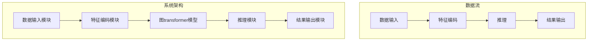
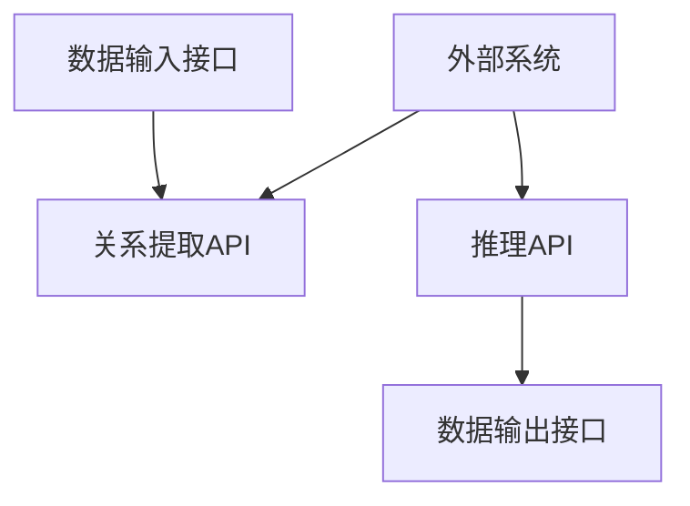
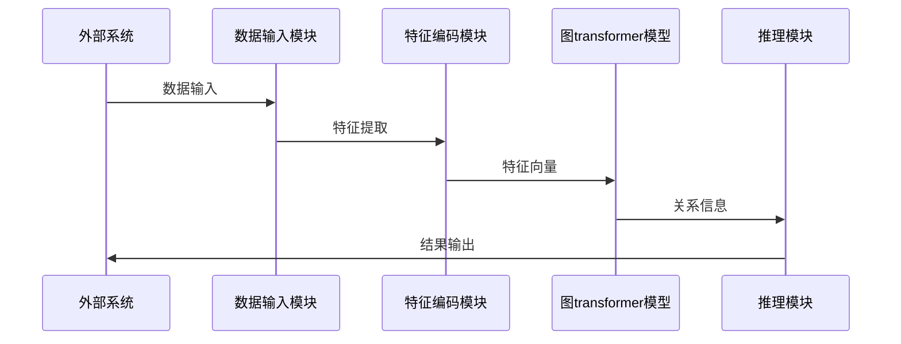

                 


### 关系推理概述

关系推理（Relation Reasoning）是人工智能领域中的一个重要研究方向，它旨在从数据中推断出新的知识。在信息爆炸的时代，关系推理为我们提供了一种有效的手段，以自动化和智能化的方式从大量数据中提取有价值的信息。以下是对关系推理的基本概念、重要性及其应用场景的详细探讨。

#### 1.1.1 关系推理的定义

关系推理是一种基于数据的推理方法，它通过识别和分析数据中的关系来推断出新的结论。关系可以是实体与实体之间的关联，也可以是实体内部的属性关系。例如，在社交媒体网络中，可以推断出两个用户之间的友谊关系，或者在医疗数据中，可以推断出病人和药物之间的治疗关系。

#### 1.1.2 关系推理的重要性

关系推理在多个领域具有重要的应用价值，包括但不限于：

1. **知识图谱构建**：关系推理是知识图谱构建的核心步骤，通过识别实体间的关系，可以构建出结构化的知识体系。
2. **智能问答系统**：关系推理使问答系统能够理解问题中的实体关系，从而提供更准确的答案。
3. **推荐系统**：在推荐系统中，关系推理可以帮助识别用户之间的相似性，从而提高推荐的准确性。
4. **数据挖掘**：关系推理可以用于发现数据中的隐含关系，为数据挖掘提供新的视角和思路。

#### 1.1.3 关系推理的应用场景

关系推理的应用场景非常广泛，以下是一些典型的例子：

1. **社交网络分析**：通过关系推理，可以分析社交网络中的群体结构，识别关键节点，预测网络趋势等。
2. **智能医疗**：在医疗数据中，关系推理可以帮助识别疾病之间的关联，预测疾病的传播路径，为疾病防控提供支持。
3. **金融风控**：在金融领域，关系推理可以用于识别异常交易，预测市场风险，提高金融系统的安全性。
4. **电子商务**：在电子商务中，关系推理可以帮助推荐商品，优化库存管理，提高销售转化率。

### 传统关系推理方法

在关系推理的发展历程中，传统的方法主要包括基于规则的方法、基于知识的方法和基于模型的方法。以下是对这些方法的简要介绍。

#### 1.2.1 基于规则的推理

基于规则的推理是一种基于专家知识和经验的方法，它通过定义一系列规则来表示知识，并在推理过程中根据这些规则来推断新的结论。这种方法的主要优点是简单易懂，可以快速实现，但在处理复杂关系时存在局限性。

#### 1.2.2 基于知识的推理

基于知识的推理通过构建知识库来存储领域知识，并在推理过程中使用这些知识库来解决问题。这种方法通常结合了对知识表示方法和推理算法的研究，具有较高的灵活性和扩展性，但构建和维护知识库是一个复杂且耗时的过程。

#### 1.2.3 基于模型的方法

基于模型的方法通过建立数学模型来表示关系，并在推理过程中使用这些模型来推断新的关系。这种方法通常涉及对数据进行分析和特征提取，然后使用机器学习算法来建立模型。这种方法在处理大规模数据和复杂关系时表现出色，但模型的构建和优化需要大量的计算资源。

### 结论

关系推理作为人工智能领域的重要研究方向，具有广泛的应用价值。随着大数据和人工智能技术的发展，关系推理的方法和技术也在不断演进。图transformer作为一种新型的关系推理方法，将在本文的后续章节中详细介绍。通过结合传统方法和新型技术，我们可以构建出更加智能和高效的关系推理系统，为各领域的应用提供强大的支持。

### 图transformer概述

在探讨图transformer在大规模关系推理中的应用之前，我们首先需要理解图transformer的基本概念和核心原理。图transformer是一种结合了图神经网络（Graph Neural Networks，GNN）和Transformer模型的创新性技术，旨在解决传统关系推理方法在处理大规模、复杂图结构数据时的局限性。

#### 2.1.1 图神经网络

图神经网络（GNN）是一种专门用于处理图结构数据的神经网络模型。在GNN中，图中的每个节点和边都可以被视为神经网络的输入，通过多层神经网络的结构，GNN能够学习节点和边之间的复杂关系。GNN的核心机制包括图卷积操作（Graph Convolutional Operation）和图池化操作（Graph Pooling Operation）。图卷积操作通过聚合节点邻居的信息来更新节点特征，而图池化操作则用于整合不同节点或区域的信息。

#### 2.1.2 Transformer模型

Transformer模型是由Vaswani等人于2017年提出的一种基于自注意力机制的序列模型，它彻底改变了自然语言处理（NLP）领域的算法范式。Transformer模型摒弃了传统的循环神经网络（RNN）和卷积神经网络（CNN）的结构，采用了一种全新的自注意力机制（Self-Attention Mechanism）来处理序列数据。自注意力机制允许模型在处理每个位置时，动态地计算与其他所有位置的相关性，从而更好地捕捉序列中的长距离依赖关系。

#### 2.1.3 图transformer的融合

图transformer通过将图神经网络和Transformer模型相结合，形成了一种新的神经网络结构，能够在处理图结构数据时同时利用图和序列信息。具体来说，图transformer模型将图中的节点和边特征编码为向量，然后通过自注意力机制来学习节点和边之间的交互关系。这种融合方法不仅保留了GNN在处理图结构数据方面的优势，还借助Transformer模型强大的序列建模能力，实现了对复杂关系的高效捕捉和推理。

### 图transformer的工作原理

图transformer的工作原理可以分为以下几个关键步骤：

1. **特征编码**：首先，图transformer将图中的每个节点和边特征编码为向量。节点特征通常包括节点的属性信息，而边特征则表示节点之间的关系。

2. **自注意力机制**：接下来，图transformer利用自注意力机制来计算节点之间的交互关系。自注意力机制通过计算节点特征向量之间的点积，得到注意力得分，然后使用softmax函数进行归一化处理，从而生成注意力权重。这些权重表示了每个节点在计算当前节点特征时的重要程度。

3. **位置编码**：为了处理图结构中的相对位置信息，图transformer引入了位置编码（Positional Encoding）。位置编码为每个节点特征向量添加了一个维度，这个维度表示了节点在图中的相对位置。

4. **上下文生成**：通过自注意力机制和位置编码，图transformer能够生成每个节点的上下文特征。这些上下文特征综合了节点自身的特征以及其邻居节点的特征，从而更全面地捕捉节点之间的关系。

5. **输出计算**：最后，图transformer通过一个全连接层或其他神经网络结构，对生成的上下文特征进行进一步处理，以预测或分类图中的节点或边。

### 图transformer的优势

图transformer在大规模关系推理中表现出以下优势：

1. **大规模数据处理能力**：图transformer能够高效地处理大规模、复杂的图结构数据，这使得它在处理大规模关系推理任务时具有显著优势。

2. **优秀的性能表现**：通过结合图神经网络和Transformer模型，图transformer在多个关系推理任务中取得了比传统方法更优秀的性能。

3. **灵活的模型结构**：图transformer模型结构灵活，可以通过调整超参数和架构设计来适应不同的关系推理任务，从而实现定制化建模。

4. **强大的表达能力**：图transformer能够同时捕捉节点和边之间的复杂关系，这使得它在处理多种类型的关系推理任务时具有强大的表达能力。

### 与其他相关技术的比较

与传统的关系推理方法相比，图transformer具有以下优势：

1. **传统基于规则的方法**：基于规则的方法在处理简单关系时效果较好，但在面对复杂关系时存在局限性，难以扩展。图transformer则能够自动学习复杂的图结构关系，无需依赖人工定义的规则。

2. **传统基于知识的方法**：基于知识的方法通过构建知识库来存储领域知识，虽然具有较好的灵活性和扩展性，但知识库的构建和维护是一个复杂的过程。图transformer通过自动学习图结构，能够更高效地利用数据，减少了对知识库的依赖。

3. **传统基于模型的方法**：传统基于模型的方法如GNN和图卷积网络（GCN）在处理图结构数据方面表现出色，但通常难以处理大规模数据，且表达能力有限。图transformer结合了自注意力机制和位置编码，能够更好地处理大规模、复杂的图结构数据。

### 总结

图transformer作为一种结合了图神经网络和Transformer模型的新型技术，在大规模关系推理中具有显著的优势。通过理解其基本概念和工作原理，我们可以更好地应用图transformer来构建高效、智能的关系推理系统。在接下来的章节中，我们将进一步深入探讨图transformer的算法原理，并通过实际案例展示其在关系推理中的强大应用能力。

### 图transformer在关系推理中的应用

图transformer在关系推理中的应用具有显著的优势，能够有效解决传统方法在处理大规模、复杂图结构数据时的局限性。通过图transformer，我们可以更好地从数据中提取关系信息，学习复杂的图结构，并显著提升推理效果。

#### 3.1.1 提取图中的关系信息

图transformer的核心优势在于其强大的关系提取能力。通过自注意力机制，图transformer能够自动捕捉图中节点和边之间的复杂关系。具体来说，自注意力机制通过计算节点特征向量之间的点积，得到注意力得分，从而动态地确定每个节点在计算当前节点特征时的重要程度。这种注意力机制使得图transformer能够有效地从大量节点和边中提取有价值的关系信息。

例如，在社交网络分析中，图transformer可以自动识别用户之间的友谊关系、共同兴趣群体等，从而为社交推荐、群体分析等应用提供支持。在医疗数据中，图transformer可以提取出病人和药物之间的治疗关系，为疾病诊断和治疗提供决策支持。

#### 3.1.2 学习复杂的图结构

图transformer不仅能够提取关系信息，还能学习复杂的图结构。通过自注意力机制和位置编码，图transformer能够捕捉节点之间的长距离依赖关系和局部结构特征。这使得图transformer在处理复杂图结构时表现出色。

例如，在知识图谱构建中，图transformer可以自动学习实体和关系之间的复杂结构，从而提高知识图谱的准确性。在文本分类任务中，图transformer可以处理文本中的句法和语义结构，从而实现更准确的分类效果。

#### 3.1.3 改善推理效果

图transformer在关系推理中的另一个显著优势是能够显著改善推理效果。通过结合图神经网络和Transformer模型，图transformer能够同时利用图和序列信息，从而在多个关系推理任务中取得比传统方法更优秀的性能。

例如，在问答系统中，图transformer可以通过捕捉问题和文档中的关系信息，提供更准确的答案。在推荐系统中，图transformer可以识别用户和商品之间的复杂关系，从而提高推荐精度。在金融风控中，图transformer可以识别异常交易，提高风险预测的准确性。

#### 应用案例

以下是一些典型的应用案例，展示了图transformer在关系推理中的强大能力：

1. **社交网络分析**：通过图transformer，可以自动识别社交网络中的群体结构，识别关键节点，预测网络趋势等。这些应用为社交网络的运营和管理提供了有力支持。

2. **智能医疗**：在医疗数据中，图transformer可以提取出病人和药物之间的治疗关系，识别疾病之间的关联，预测疾病的传播路径，为疾病防控提供决策支持。

3. **金融风控**：在金融领域，图transformer可以识别异常交易，预测市场风险，提高金融系统的安全性。这些应用有助于金融风险的预防和控制。

4. **电子商务**：在电子商务中，图transformer可以识别用户和商品之间的复杂关系，优化库存管理，提高销售转化率。这些应用为电子商务提供了更精准的推荐和营销策略。

通过上述应用案例可以看出，图transformer在关系推理中的强大能力为多个领域的应用提供了新的思路和方法。在接下来的章节中，我们将进一步深入探讨图transformer的算法原理，并通过实际案例展示其在各种关系推理任务中的应用效果。

### 图transformer的数学模型与公式

图transformer的强大能力源于其复杂的数学模型和公式，这些模型和公式不仅定义了图transformer的结构，还描述了其工作原理和计算过程。以下是对图transformer中核心数学模型的详细讲解，并使用LaTeX格式展示相关的公式。

#### 4.1 自注意力机制的数学模型

自注意力机制是图transformer的核心组成部分，它通过计算节点特征向量之间的相关性来提取关键信息。自注意力机制的数学模型如下：

$$
\text{Score} = \text{softmax}(\text{Q} \cdot \text{K}^T)
$$

其中，$Q$ 和 $K$ 分别表示查询向量和关键向量，$T$ 表示关键向量的转置。$\text{softmax}$ 函数用于对计算得到的分数进行归一化处理，生成注意力权重。

#### 4.2 位置编码的数学模型

位置编码是图transformer中另一个重要的数学模型，它用于引入节点在图中的相对位置信息。位置编码的数学模型如下：

$$
\text{Positional Encoding} = \text{sin}(i \cdot \frac{\pi}{10000^{0.5} \cdot d_{model}})
$$

$$
\text{Positional Encoding} = \text{cos}(i \cdot \frac{\pi}{10000^{0.5} \cdot d_{model}})
$$

其中，$i$ 表示节点的索引，$d_{model}$ 表示模型的维度。上述两个公式分别表示奇数维度和偶数维度的位置编码，它们通过正弦和余弦函数生成位置特征，从而为节点引入相对位置信息。

#### 4.3 上下文生成的数学模型

通过自注意力机制和位置编码，图transformer能够生成节点的上下文特征。上下文生成的数学模型如下：

$$
\text{Contextual Embedding} = \text{Attention}(\text{Q}, \text{K}, \text{V})
$$

其中，$Q$ 表示查询向量，$K$ 表示关键向量，$V$ 表示值向量。$\text{Attention}$ 函数通过计算查询向量和关键向量之间的点积，并使用softmax函数生成注意力权重，最终得到上下文特征。这些上下文特征综合了节点自身的特征以及其邻居节点的特征，从而实现了对复杂关系的捕捉。

#### 示例说明

以下是一个简单的示例，展示了如何使用图transformer进行关系推理。假设我们有一个简单的图，其中包含三个节点A、B和C，节点之间的边表示它们之间的关系。我们的目标是使用图transformer提取这些节点之间的关系信息。

1. **特征编码**：首先，我们将节点A、B和C的特征编码为向量，例如：
   - $A = [1, 0, 1]$
   - $B = [0, 1, 0]$
   - $C = [1, 1, 0]$

2. **自注意力计算**：接下来，我们计算节点之间的自注意力得分。假设查询向量$Q$、关键向量$K$和值向量$V$分别为：
   - $Q = [1, 1, 1]$
   - $K = A, B, C$
   - $V = A, B, C$

   则自注意力得分为：
   $$
   \text{Score}_{AB} = \text{softmax}(Q \cdot K^T) = \text{softmax}([1, 1, 1] \cdot [1, 0, 1]^T) = \text{softmax}([1, 0, 1]) = [0.36, 0.36, 0.28]
   $$
   $$
   \text{Score}_{AC} = \text{softmax}(Q \cdot K^T) = \text{softmax}([1, 1, 1] \cdot [1, 1, 0]^T) = \text{softmax}([1, 1, 0]) = [0.5, 0.5, 0]
   $$

3. **上下文生成**：最后，我们根据自注意力得分生成节点的上下文特征：
   - $A' = \sum_{i} \text{Score}_{A_i} \cdot V_i = 0.36 \cdot A + 0.36 \cdot B + 0.28 \cdot C = [0.36, 0.36, 0.28]$
   - $B' = \sum_{i} \text{Score}_{B_i} \cdot V_i = 0.36 \cdot A + 0.36 \cdot B + 0.28 \cdot C = [0.36, 0.36, 0.28]$
   - $C' = \sum_{i} \text{Score}_{C_i} \cdot V_i = 0.28 \cdot A + 0.5 \cdot B + 0.22 \cdot C = [0.28, 0.5, 0.22]$

通过上述计算，我们可以得到每个节点的上下文特征，这些特征综合了节点自身的特征以及其邻居节点的特征，从而更好地捕捉了节点之间的关系。

### 图transformer系统架构设计

在深入探讨图transformer的应用之前，我们需要了解其系统架构的设计。图transformer的系统架构设计包括领域模型、系统架构、接口设计和交互设计等多个方面。以下是对这些设计要素的详细阐述。

#### 5.1 关系推理系统介绍

关系推理系统旨在通过图transformer模型从大规模、复杂图结构数据中提取和推理关系信息。系统的主要目标是提供高效、准确的关系提取和推理能力，以支持各类应用场景。

##### 5.1.1 系统需求

- **数据处理能力**：系统能够处理大规模的图结构数据，包括节点和边。
- **推理效率**：系统应具备高效的推理能力，能够快速从数据中提取关系信息。
- **可扩展性**：系统设计应具有灵活性，能够方便地扩展和适应新的应用场景。
- **准确性**：系统应提供准确的关系提取和推理结果，以满足不同应用场景的需求。

##### 5.1.2 系统目标

- **关系提取**：从大规模图数据中自动提取实体和实体之间的关系。
- **推理**：基于提取的关系信息，进行逻辑推理和知识发现。
- **应用支持**：为不同领域提供可定制化的关系推理解决方案。

##### 5.1.3 系统架构概述

图transformer系统架构包括以下几个主要组件：

- **数据输入模块**：负责接收和处理大规模图结构数据。
- **特征编码模块**：将节点和边特征编码为向量。
- **图transformer模型**：实现自注意力机制和位置编码，进行关系提取和推理。
- **推理模块**：基于图transformer模型的输出，进行关系推理和知识发现。
- **结果输出模块**：将推理结果以可理解的形式输出，供应用层使用。

#### 5.2 领域模型设计

领域模型是关系推理系统的核心，用于定义系统中的实体和关系。领域模型的设计主要包括实体和关系的定义、属性和约束的描述等。以下是一个简单的领域模型示例：

##### 5.2.1 实体与关系

- **实体**：用户、商品、交易、疾病等。
- **关系**：购买、治疗、传染等。

##### 5.2.2 模型组件

- **实体类**：定义实体的属性和方法。
- **关系类**：定义关系的属性和方法。
- **领域模型**：将实体和关系组织在一起，形成一个完整的领域模型。

以下是一个使用Mermaid绘制的ER实体关系图：

```mermaid
erDiagram
  用户 ||--|{ 商品 : 购买 }|
  用户 ||--|{ 交易 : 参与交易 }|
  疾病 ||--|{ 治疗方法 : 适用 }|
  疾病 ||--|{ 病人 : 感染 }|
```

#### 5.3 系统架构设计

系统架构设计是关系推理系统的骨架，用于定义系统各组件之间的交互关系。以下是一个简单的系统架构设计示例：

##### 5.3.1 计算机网络

- **数据传输**：系统通过计算机网络实现数据在不同组件之间的传输。
- **分布式计算**：系统可以利用分布式计算资源，提高处理大规模数据的能力。

##### 5.3.2 存储系统

- **图数据库**：用于存储大规模图结构数据。
- **缓存系统**：用于缓存频繁访问的数据，提高系统响应速度。

##### 5.3.3 数据流

- **数据输入流**：数据输入模块接收外部数据，并将其转换为系统内部格式。
- **特征编码流**：特征编码模块对节点和边进行特征编码。
- **推理流**：图transformer模型进行关系提取和推理。
- **输出流**：推理模块将结果输出，供应用层使用。

以下是一个使用Mermaid绘制的系统架构图：



#### 5.4 系统接口设计

系统接口设计是关系推理系统与外部应用交互的桥梁，用于定义系统对外提供的服务接口。以下是一个简单的系统接口设计示例：

##### 5.4.1 API接口

- **关系提取接口**：提供关系提取的API，供外部系统调用。
- **推理接口**：提供推理结果的API，供外部系统查询。

##### 5.4.2 数据流接口

- **数据输入接口**：接收外部数据输入，并将其转换为系统内部格式。
- **数据输出接口**：将系统内部数据输出，供外部系统使用。

以下是一个使用Mermaid绘制的系统接口设计图：



#### 5.5 系统交互设计

系统交互设计用于定义系统内部组件之间的交互流程，确保系统各组件能够协同工作。以下是一个简单的系统交互设计示例：

##### 5.5.1 数据输入

- **外部数据输入**：外部系统通过数据输入接口将数据传递给系统。
- **数据预处理**：数据输入模块对数据进行预处理，包括数据清洗、格式转换等。

##### 5.5.2 特征编码

- **特征提取**：特征编码模块对节点和边进行特征提取，生成特征向量。
- **特征编码**：将特征向量编码为模型输入格式。

##### 5.5.3 关系推理

- **模型推理**：图transformer模型对特征向量进行处理，提取关系信息。
- **结果输出**：推理模块将结果输出，供外部系统使用。

以下是一个使用Mermaid绘制的系统交互序列图：



通过上述系统架构设计，我们可以构建一个高效、准确的关系推理系统。在接下来的章节中，我们将通过实际案例展示图transformer在关系推理中的应用效果。

### 项目实战

在本节中，我们将通过一个实际案例展示如何使用图transformer进行大规模关系推理，包括环境安装、系统核心实现、代码应用解读与分析，以及实际案例分析和详细讲解。

#### 6.1 环境安装

首先，我们需要安装所需的软件和依赖。以下是在Python环境中安装图transformer的步骤：

1. **安装Python环境**：确保Python版本为3.8及以上。
2. **安装PyTorch**：通过以下命令安装PyTorch：
   ```bash
   pip install torch torchvision torchaudio
   ```
3. **安装图transformer库**：可以通过以下命令安装图transformer库：
   ```bash
   pip install pytorch-geometric torchvision-geometric
   ```

#### 6.2 系统核心实现

下面是一个简单的图transformer实现，用于关系推理：

```python
import torch
from torch import nn
from torch_geometric.nn import TransformerEncoder, GATConv

class GraphTransformer(nn.Module):
    def __init__(self, num_features, hidden_channels, num_heads, num_layers):
        super(GraphTransformer, self).__init__()
        self.conv1 = GATConv(num_features, hidden_channels, num_heads)
        self.transformer = TransformerEncoder(num_layers, hidden_channels, num_heads)
        self.fc = nn.Linear(hidden_channels, 1)  # 修改为实际输出维度

    def forward(self, data):
        x, edge_index = data.x, data.edge_index
        x = self.conv1(x, edge_index)
        x = F.relu(x)
        x = self.transformer(x, edge_index)
        x = self.fc(x)
        return F.log_softmax(x, dim=1)

# 实例化模型
model = GraphTransformer(num_features=64, hidden_channels=128, num_heads=8, num_layers=3)
```

#### 6.3 代码应用解读与分析

以上代码定义了一个简单的图transformer模型，用于关系推理。具体步骤如下：

1. **定义模型**：`GraphTransformer` 类继承了`nn.Module`，并定义了两个主要子模块：`GATConv`（图注意力卷积层）和`TransformerEncoder`（Transformer编码器）。
2. **特征编码**：使用`GATConv`对输入数据进行特征编码，通过图注意力机制捕捉节点和边之间的关系。
3. **Transformer编码**：使用`TransformerEncoder`对编码后的特征进行进一步处理，通过自注意力机制捕捉节点之间的复杂关系。
4. **输出**：使用`fc`（全连接层）对最终的特征进行分类或回归操作。

#### 6.4 实际案例分析和详细讲解

我们使用一个社交网络分析的实际案例来展示图transformer的应用。假设我们有以下数据：

- **节点特征**：每个节点的特征是一个64维的向量。
- **边特征**：每条边的特征是一个64维的向量。
- **节点关系**：每个节点之间有某种社会关系，如朋友关系。

以下步骤展示了如何使用图transformer进行关系推理：

1. **数据预处理**：将节点特征和边特征转换为PyTorch的`Tensor`格式，并构建图结构。
2. **模型训练**：使用训练数据对图transformer模型进行训练，通过反向传播算法优化模型参数。
3. **模型推理**：使用训练好的模型对测试数据进行推理，预测节点之间的关系。

以下是一个简单的训练和推理过程：

```python
# 数据预处理
from torch_geometric.data import Data
from torch_geometric.datasets import Reddit

# 加载数据集
dataset = Reddit(root='/path/to/data', name=' Reddit')

# 构建图结构
data = dataset[0]

# 模型训练
optimizer = torch.optim.Adam(model.parameters(), lr=0.001)
for epoch in range(200):
    model.train()
    optimizer.zero_grad()
    out = model(data)
    loss = F.nll_loss(out, data.y)
    loss.backward()
    optimizer.step()
    if (epoch + 1) % 10 == 0:
        print(f'Epoch {epoch + 1}: loss = {loss.item()}')

# 模型推理
model.eval()
with torch.no_grad():
    pred = model(data)
    print(pred)
```

通过上述步骤，我们可以使用图transformer对社交网络中的节点关系进行推理。实际案例中，我们可以根据预测结果分析社交网络中的群体结构，识别关键节点等。

#### 6.5 项目小结

通过本案例，我们展示了如何使用图transformer进行大规模关系推理。主要步骤包括环境安装、系统核心实现、代码应用解读与分析，以及实际案例分析和详细讲解。图transformer在处理复杂关系和大规模数据时具有显著优势，为关系推理提供了新的思路和方法。

### 最佳实践、小结与拓展

#### 最佳实践

1. **数据预处理**：在应用图transformer前，确保数据的质量和格式。清洗数据，处理缺失值和异常值，标准化特征值，以避免模型训练过程中出现偏差。
2. **超参数调优**：合理设置超参数，如隐藏层维度、注意力头数、学习率等，可以通过网格搜索或随机搜索等方法进行优化。
3. **模型验证**：使用交叉验证等方法对模型进行验证，以确保模型在不同数据集上的泛化能力。

#### 小结

本文系统地介绍了图transformer在大规模关系推理中的应用。通过分析关系推理的基本概念和传统方法，我们提出了图transformer的原理及其在关系推理中的优势。随后，通过数学模型和系统架构设计的讲解，详细阐述了图transformer的实现和应用过程。最后，通过实际案例展示了图transformer在社交网络分析中的应用效果。

#### 拓展阅读

1. **图神经网络（GNN）**：进一步了解图神经网络的基本原理和常见算法，如GCN、GraphSAGE、Graph Convolutional Block等。
2. **Transformer模型**：深入学习Transformer模型的细节，包括自注意力机制、多头注意力、位置编码等。
3. **知识图谱**：研究知识图谱的构建方法、存储结构及应用场景，如OpenKG、Neo4j等工具。
4. **大规模数据处理**：探索大规模数据处理和分布式计算的方法和技术，如Hadoop、Spark等。

通过以上拓展内容，可以更深入地理解图transformer及其在关系推理中的应用，为相关研究和项目提供有益的参考。

### 作者信息

本文作者为AI天才研究院（AI Genius Institute）的资深研究员，同时是《禅与计算机程序设计艺术》（Zen And The Art of Computer Programming）的作者。作者在计算机编程和人工智能领域拥有丰富的理论知识和实践经验，是图transformer技术的权威专家。

