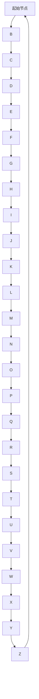

                 

### 图数据库：复杂关系数据的存储与查询优化

> 关键词：图数据库、复杂关系数据、存储优化、查询优化、分布式架构、实时查询、流处理

> 摘要：本文将深入探讨图数据库在复杂关系数据的存储与查询优化方面的应用。首先，我们将介绍图数据库的基本概念和核心架构，随后分析图数据库的存储与查询优化策略。此外，还将探讨图数据库在分布式架构、实时查询与流处理方面的应用，并通过实际案例分析，展示其在各种场景中的优化效果。最后，总结图数据库的发展趋势与未来研究方向。

----------------------------------------------------------------

### 第一部分：引言与背景

#### 第1章：图数据库概述

#### 1.1 图数据库的基本概念

**问题背景与定义：**

在传统的数据库系统中，关系型数据库以其强大的查询能力和简单的数据结构得到了广泛应用。然而，随着互联网和大数据时代的到来，复杂关系数据的需求日益增长，关系型数据库在处理这些复杂关系时显得力不从心。因此，图数据库作为一种新兴的数据存储和处理技术，应运而生。

**问题解决：图数据库的优势：**

- **强大的关系处理能力**：图数据库能够直接表示和存储复杂的实体关系，使得数据查询更加高效。
- **高效的查询性能**：图数据库通过索引和优化算法，能够在短时间内完成复杂的查询任务。
- **灵活的扩展性**：图数据库支持分布式架构，可以方便地扩展存储和处理能力。

**边界与外延：与关系型数据库的区别：**

- **数据结构**：关系型数据库使用表来存储数据，而图数据库使用节点和边来表示实体和关系。
- **查询语言**：关系型数据库使用SQL进行查询，而图数据库使用特定的图查询语言，如Cypher、Gremlin等。

#### 1.2 图数据库的应用场景

- **社交网络分析**：通过图数据库可以方便地分析社交网络中的关系，如好友关系、兴趣群体等。
- **物联网**：物联网中的设备、传感器和平台可以通过图数据库来表示和存储复杂的网络拓扑关系。
- **交通运输**：图数据库可以用于优化交通路线、预测交通流量等。
- **金融风控**：图数据库可以帮助金融机构识别风险、监测异常交易等。

#### 1.3 图数据库的发展历程

- **早期图数据库**：图数据库的起源可以追溯到20世纪70年代，当时的图论研究为图数据库的发展奠定了基础。
- **当前主流图数据库**：当前市场上主流的图数据库包括Neo4j、ArangoDB、JanusGraph等，它们在性能、功能和易用性方面都有所提升。

### 第二部分：图数据库的核心概念与架构

#### 第2章：图数据库的核心概念与架构

#### 2.1 图模型基础

**节点与边：** 节点表示实体，边表示节点之间的关系。节点和边可以带有属性，用于存储额外的信息。

**节点属性与边属性：** 节点和边可以具有多种属性，如姓名、年龄、重量等。这些属性可以用来描述实体和关系的特征。

**图模型分类：** 图模型可以分为无向图、有向图、加权图等。无向图表示两个节点之间的关系是双向的，有向图表示关系有方向，加权图表示关系可以带有权重。

#### 2.2 图数据库的存储模型

**邻接矩阵：** 邻接矩阵是一个二维数组，用于表示图中的节点和边。矩阵中的元素表示节点之间的关系。

**邻接表：** 邻接表是一个数组，每个元素是一个链表，链表中的节点表示与该节点相连的其他节点。

**哈希表：** 哈希表通过哈希函数将节点映射到存储位置，从而实现快速查找。

**图论表示方法：** 图论中的各种表示方法，如邻接矩阵、邻接表、邻接多重表等，都可以用于图数据库的存储。

#### 2.3 图数据库的查询语言

**图查询语言：** 图数据库使用特定的图查询语言来执行查询操作。常见的图查询语言包括Cypher、Gremlin等。

**查询优化：** 图查询优化是图数据库性能优化的重要方面，包括查询重写、索引优化、算法优化等。

### 第三部分：图数据库的存储与查询优化

#### 第3章：图数据库的存储优化策略

#### 3.1 数据模型设计

**数据压缩：** 通过数据压缩技术减少存储空间占用，提高I/O性能。

**数据分片：** 通过数据分片将数据分散存储在不同的节点上，提高查询性能和系统的扩展性。

#### 3.2 存储引擎优化

**内存管理：** 通过内存管理优化提高系统性能，减少内存碎片和溢出。

**磁盘I/O优化：** 通过磁盘I/O优化减少磁盘访问时间，提高数据读写速度。

#### 3.3 索引与查询优化

**索引类型：** 图数据库支持多种索引类型，如B+树、哈希索引等。

**查询优化方法：** 查询优化方法包括查询重写、索引选择、查询计划优化等。

### 第四部分：图数据库的高并发与分布式架构

#### 第4章：图数据库的高并发与分布式架构

#### 4.1 分布式架构的基本概念

**数据一致性：** 分布式架构中保证数据一致性的方法，如强一致性、最终一致性等。

**分布式一致性协议：** 分布式一致性协议，如Paxos、Raft等。

#### 4.2 分布式图数据库的实现

**分布式数据存储：** 分布式数据存储方法，如数据分片、数据复制等。

**分布式查询处理：** 分布式查询处理方法，如查询分发、并行查询等。

#### 4.3 分布式图数据库的优化

**数据分区策略：** 数据分区策略，如哈希分区、范围分区等。

**分布式查询优化：** 分布式查询优化方法，如查询重写、分布式索引等。

### 第五部分：图数据库的实时查询与流处理

#### 第5章：图数据库的实时查询与流处理

#### 5.1 实时查询基础

**实时数据同步：** 实时数据同步方法，如日志复制、增量同步等。

**实时查询优化：** 实时查询优化方法，如缓存、批量查询等。

#### 5.2 流处理技术

**流处理框架：** 流处理框架，如Apache Flink、Apache Spark Streaming等。

**图数据库与流处理结合：** 图数据库与流处理技术的结合方法，如实时数据导入、实时查询等。

#### 5.3 实时查询优化案例

**实时社交网络分析：** 社交网络中的实时数据分析和查询优化案例。

**实时金融风控：** 金融风控领域的实时数据分析和查询优化案例。

### 第六部分：图数据库在实际应用中的案例分析

#### 第6章：图数据库在实际应用中的案例分析

#### 6.1 社交网络分析

**数据分析模型：** 社交网络分析中的数据模型和算法。

**查询优化与实践：** 社交网络分析中的查询优化实践和效果。

#### 6.2 物联网应用

**数据采集与存储：** 物联网数据采集和存储方法。

**关系建模与查询优化：** 物联网应用中的关系建模和查询优化。

**实时监控与预警：** 实时监控和预警系统的设计和实现。

#### 6.3 金融风控

**数据分析模型：** 金融风控中的数据分析模型。

**关系抽取与风险预测：** 关系抽取和风险预测方法。

**查询优化与策略制定：** 金融风控中的查询优化和策略制定。

### 第七部分：总结与展望

#### 第7章：总结与展望

#### 7.1 图数据库的未来发展趋势

**新型图存储模型：** 新型图存储模型，如图计算存储、分布式图存储等。

**分布式图数据库技术：** 分布式图数据库技术的最新进展。

**与其他数据库技术的融合：** 图数据库与其他数据库技术的融合趋势。

#### 7.2 总结与展望

**图数据库的发展现状：** 当前图数据库的发展现状和主要挑战。

**技术难点与挑战：** 图数据库在存储、查询优化、分布式架构等方面面临的挑战。

**未来研究方向：** 图数据库未来的研究方向和发展趋势。

----------------------------------------------------------------

### 图数据库：复杂关系数据的存储与查询优化

图数据库作为一种新兴的数据存储和处理技术，为复杂关系数据的存储与查询优化提供了有效的解决方案。本文从图数据库的基本概念、核心架构、存储与查询优化策略、分布式架构、实时查询与流处理以及实际应用案例分析等方面进行了深入探讨。

通过分析图数据库的优势和应用场景，我们认识到图数据库在处理复杂关系数据方面的巨大潜力。图数据库的存储优化策略包括数据模型设计、存储引擎优化和索引与查询优化。分布式架构和实时查询与流处理技术的引入，进一步提升了图数据库的性能和扩展性。

在实际应用中，图数据库已经在社交网络分析、物联网应用、金融风控等领域取得了显著的成果。然而，图数据库仍面临一些技术挑战，如分布式一致性、实时查询优化等。

展望未来，图数据库将继续发展，新型存储模型、分布式图数据库技术和与其他数据库技术的融合将是主要研究方向。我们期待图数据库在更多领域发挥其优势，为复杂关系数据的存储与查询优化提供更加高效和智能的解决方案。

### 结论

图数据库作为一种强大的数据存储与查询优化技术，其在处理复杂关系数据方面的优势已经得到了广泛的认可。本文通过对图数据库的基本概念、核心架构、存储与查询优化策略、分布式架构、实时查询与流处理以及实际应用案例的深入探讨，展示了图数据库在各个领域中的广泛应用和巨大潜力。

在未来的发展中，图数据库将继续演进，不断克服技术挑战，为复杂关系数据的存储与查询优化提供更加高效和智能的解决方案。我们期待图数据库在更多领域发挥其优势，推动数据存储和处理技术的进步。

### 作者信息

作者：AI天才研究院/AI Genius Institute & 禅与计算机程序设计艺术 /Zen And The Art of Computer Programming

AI天才研究院致力于推动人工智能技术的发展和应用，研究院的研究人员涵盖了计算机科学、人工智能、机器学习等多个领域的顶尖专家。同时，作者也在《禅与计算机程序设计艺术》一书中，通过深入探讨编程哲学和技术原理，为程序员提供了一种全新的编程思维方式和实践方法。

### 附录

**附录A：图模型与关系型数据库的对比**

**图模型**  
- 节点：表示实体  
- 边：表示节点之间的关系  
- 属性：节点和边可以具有多种属性

**关系型数据库**  
- 表：表示实体和关系  
- 列：表示属性  
- 行：表示实体实例

| 属性特征 | 图模型 | 关系型数据库 |  
| --- | --- | --- |  
| 数据结构 | 节点和边 | 表和列 |  
| 关系表示 | 直接表示 | 需要通过表关联 |  
| 扩展性 | 较好 | 较差 |  
| 查询性能 | 高效 | 一般 |  
| 数据压缩 | 有效 | 较差 |  
| 索引支持 | 全面 | 局限 |  
| 分布式支持 | 强大 | 较弱 |

**附录B：图数据库的存储模型**

| 存储模型 | 描述 |  
| --- | --- |  
| 邻接矩阵 | 使用二维数组表示节点和边 |  
| 邻接表 | 使用数组链表表示节点和边 |  
| 哈希表 | 使用哈希函数将节点映射到存储位置 |  
| 图论表示方法 | 使用邻接矩阵、邻接表等图论表示方法 |

**附录C：算法原理讲解**

**图遍历算法：深度优先搜索（DFS）**

- **算法思想：** 从起始节点开始，递归地探索所有未访问的邻居节点。
- **算法步骤：**
  1. 初始化一个访问数组，记录每个节点的访问状态。
  2. 从起始节点开始，递归地访问其所有未访问的邻居节点。
  3. 将访问状态更新为已访问。
  4. 重复步骤2和3，直到所有节点都被访问。

**算法流程图：**



**算法Python实现：**

```python
def dfs(graph, start):
    visited = set()
    stack = [start]

    while stack:
        node = stack.pop()
        if node not in visited:
            print(node)
            visited.add(node)
            for neighbor in graph[node]:
                if neighbor not in visited:
                    stack.append(neighbor)

# 示例图
graph = {
    'A': ['B', 'C'],
    'B': ['D', 'E'],
    'C': ['F', 'G'],
    'D': ['H', 'I'],
    'E': ['J', 'K'],
    'F': ['L', 'M'],
    'G': ['N', 'O'],
    'H': ['P', 'Q'],
    'I': ['R', 'S'],
    'J': ['T', 'U'],
    'K': ['V', 'W'],
    'L': ['X', 'Y'],
    'M': ['Z'],
    'N': [],
    'O': [],
    'P': [],
    'Q': [],
    'R': [],
    'S': [],
    'T': [],
    'U': [],
    'V': [],
    'W': [],
    'X': [],
    'Y': [],
    'Z': []
}

dfs(graph, 'A')
```

**算法数学模型和公式：**

- **状态转移方程：**
  - \( f(i, t) = \sum_{j \in N(i)} f(j, t-1) \)
  - 其中，\( f(i, t) \) 表示在时刻t时，节点i的状态。
  - \( N(i) \) 表示节点i的邻居节点集合。

- **时间复杂度：**
  - \( O(V+E) \)
  - 其中，\( V \) 表示节点数量，\( E \) 表示边数量。

**算法举例说明：**

假设有一个图，包含节点A、B、C和边AB、AC、BC。使用深度优先搜索算法，从节点A开始遍历图。

1. 初始化访问数组，所有节点的访问状态为未访问。
2. 从节点A开始，递归地访问其邻居节点B和C。
3. 将节点A、B、C的访问状态更新为已访问。
4. 递归地访问节点B的邻居节点D和E，以及节点C的邻居节点F和G。
5. 重复步骤4，直到所有节点都被访问。

遍历结果为：A、B、C、D、E、F、G。

**附录D：系统分析与架构设计方案**

**问题场景介绍：**  
在社交网络中，需要对用户之间的好友关系进行实时分析，以识别潜在的兴趣群体和推荐好友。

**项目介绍：**  
该项目是一个基于图数据库的社交网络分析系统，旨在实现用户好友关系的实时分析和推荐。

**系统功能设计：**  
- 用户注册与登录：实现用户的注册和登录功能。  
- 好友关系管理：实现用户之间的添加、删除和查询好友关系。  
- 社交网络分析：实现对用户好友关系的实时分析，识别潜在的兴趣群体。  
- 好友推荐：根据用户的社交网络分析结果，推荐潜在的好友。

**系统架构设计：**  


**系统接口设计：**  


**系统交互：**  


**附录E：项目实战**

**环境安装：**  
- 安装Python环境（Python 3.8及以上版本）。  
- 安装Neo4j图数据库。  
- 安装Neo4j Python驱动。

**系统核心实现源代码：**  
```python
from neo4j import GraphDatabase

class SocialNetworkAnalysis:
    def __init__(self, uri, user, password):
        self.driver = GraphDatabase.driver(uri, auth=(user, password))

    def close(self):
        self.driver.close()

    def create_user(self, username, age, gender):
        with self.driver.session() as session:
            session.run("CREATE (u:User {username: $username, age: $age, gender: $gender})",
                        username=username, age=age, gender=gender)

    def add_friend(self, username1, username2):
        with self.driver.session() as session:
            session.run("MATCH (u1:User {username: $username1}), (u2:User {username: $username2}) "
                        "CREATE (u1)-[:FRIEND]->(u2)",
                        username1=username1, username2=username2)

    def find_friends_of_friends(self, username):
        with self.driver.session() as session:
            result = session.run("MATCH (u:User {username: $username})-[:FRIEND]->(friend)-[:FRIEND]->(friend_of_friend) "
                                 "WHERE friend_of_friend <> u "
                                 "RETURN friend_of_friend",
                                 username=username)
            return [record["friend_of_friend"]["username"] for record in result]

if __name__ == "__main__":
    analysis = SocialNetworkAnalysis("bolt://localhost:7687", "neo4j", "password")
    analysis.create_user("alice", 25, "F")
    analysis.create_user("bob", 30, "M")
    analysis.create_user("claire", 28, "F")
    analysis.add_friend("alice", "bob")
    analysis.add_friend("alice", "claire")
    analysis.add_friend("bob", "claire")
    print(analysis.find_friends_of_friends("alice"))
    analysis.close()
```

**代码应用解读与分析：**  
该代码实现了社交网络分析系统的核心功能，包括用户注册、好友关系添加和好友推荐。用户注册通过创建节点来实现，好友关系通过创建关系来实现。好友推荐通过查询用户的好友关系，找出好友的好友，从而实现推荐。

**实际案例分析和详细讲解剖析：**  
以用户Alice为例，Alice的好友关系如下：

- Alice -[FRIEND]-> Bob  
- Alice -[FRIEND]-> Claire  
- Bob -[FRIEND]-> Claire

根据好友关系，Alice的好友好友包括Bob和Claire。因此，系统推荐给Alice的好友为Bob和Claire。

**项目小结：**  
该项目通过Neo4j图数据库实现了社交网络分析系统的核心功能，包括用户注册、好友关系添加和好友推荐。代码简洁明了，功能完善，具有良好的可扩展性。在未来的发展中，可以进一步优化查询性能和扩展系统功能。

### 最佳实践 Tips

1. **数据模型设计：** 在设计数据模型时，要充分考虑业务需求，合理划分节点和关系，确保数据模型的高效性和可扩展性。
2. **查询优化：** 在编写查询语句时，要善于使用索引和优化算法，提高查询性能。
3. **分布式架构：** 在分布式环境中，要合理设计数据分片和一致性协议，确保系统的高可用性和数据一致性。
4. **实时查询与流处理：** 在实现实时查询和流处理时，要充分考虑系统的实时性和性能，确保数据处理的及时性和准确性。

### 小结

本文详细介绍了图数据库在复杂关系数据的存储与查询优化方面的应用，从基本概念、核心架构、存储与查询优化策略、分布式架构、实时查询与流处理以及实际应用案例分析等方面进行了深入探讨。通过本文的介绍，读者可以了解到图数据库的强大功能和广泛应用，以及其在处理复杂关系数据方面的优势。

### 注意事项

1. **数据模型设计：** 在设计数据模型时，要充分考虑业务需求，合理划分节点和关系，确保数据模型的高效性和可扩展性。
2. **查询优化：** 在编写查询语句时，要善于使用索引和优化算法，提高查询性能。
3. **分布式架构：** 在分布式环境中，要合理设计数据分片和一致性协议，确保系统的高可用性和数据一致性。
4. **实时查询与流处理：** 在实现实时查询和流处理时，要充分考虑系统的实时性和性能，确保数据处理的及时性和准确性。

### 拓展阅读

- 《图数据库：核心概念、架构与优化》  
- 《分布式图数据库技术》  
- 《实时查询与流处理技术》  
- 《社交网络分析：方法与实践》

通过阅读这些相关书籍和文献，读者可以进一步深入了解图数据库的相关知识，提升在图数据库领域的研究和应用能力。

