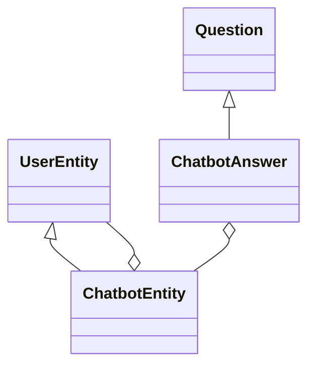
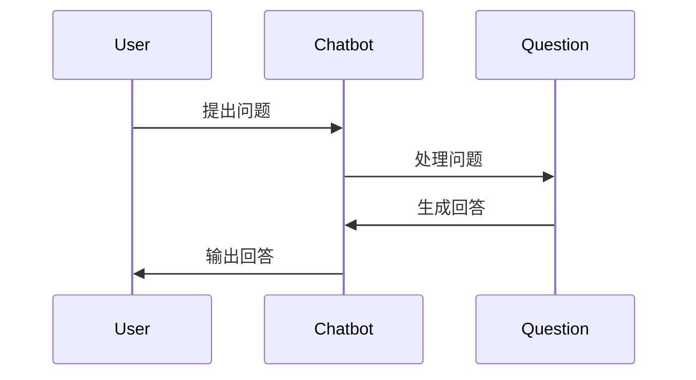
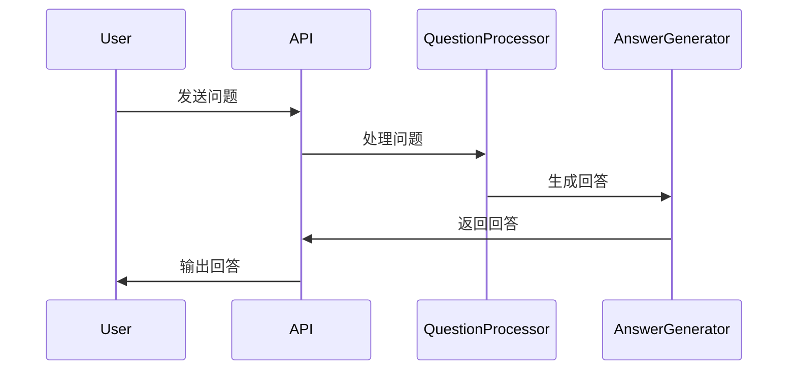

                 

### 图灵与西蒙：人工智能哲学的奠基者

#### 关键词：人工智能哲学、图灵测试、逻辑理论家、智能定义、自主学习

> 摘要：本文将深入探讨人工智能（AI）哲学的奠基者——艾伦·图灵和艾伦·西蒙的重要贡献。通过分析他们的核心概念、算法原理及其对现代AI的深远影响，本文旨在揭示他们如何共同奠定了人工智能的理论基础，并探讨其哲学思想的现实意义。

---

### 1. 背景介绍

#### 问题背景

人工智能（AI）作为计算机科学的重要分支，从20世纪中叶开始兴起，至今已发展成为一个跨学科、多元化的研究领域。人工智能的目标是创建能够执行复杂任务、具备智能行为和自我学习能力的人工系统。在这一过程中，图灵与西蒙的地位不可替代。

艾伦·图灵（Alan Turing），英国数学家、逻辑学家、密码学家，被誉为“计算机科学之父”。他在二战期间为破解德国的“恩尼格玛密码”做出了巨大贡献，并提出了著名的“图灵测试”，成为判断机器是否具有智能的权威标准。

艾伦·西蒙（Herbert A. Simon），美国心理学家、人工智能先驱。他提出了“逻辑理论家”程序，展示了人工智能的早期应用潜力，并深入探讨了自主学习的理念。

#### 问题描述

本文旨在系统探讨图灵与西蒙在人工智能哲学领域的重要贡献，分析其思想对现代AI发展的影响，以及他们如何共同奠定人工智能的理论基础。

#### 问题解决

通过全面梳理图灵与西蒙的理论成果，本文将揭示他们如何通过哲学思考和实践探索，为人工智能的发展指明了方向。

#### 边界与外延

本文不仅关注图灵与西蒙的原创性贡献，还将探讨他们的思想在AI领域的广泛影响和应用，以及这些思想如何指导现代AI研究与实践。

#### 概念结构与核心要素组成

1. **图灵与西蒙的贡献**：详细分析两人对AI哲学的奠基作用，包括图灵的图灵测试、西蒙的逻辑理论家等。
2. **AI哲学的核心概念**：阐述AI哲学的基本概念，如智能、意识、自主学习等。
3. **影响与遗产**：探讨图灵与西蒙的思想对现代AI研究的启示和影响。
4. **理论应用**：分析他们的理论在AI领域的实际应用，以及如何指导现代AI的发展。

---

### 2. 核心概念与联系

#### 核心概念

在人工智能哲学中，智能、自主学习、图灵测试是核心概念。

- **智能**：图灵与西蒙对智能的定义和认识。智能是指机器或系统执行人类智力任务的能力。
- **自主学习**：西蒙在“逻辑理论家”程序中提出的自主学习理念。自主学习是指系统在没有外部指导的情况下，通过经验不断改进自身性能。
- **图灵测试**：图灵提出的用于判断机器是否具有智能的标准。图灵测试通过模拟人与机器的对话，来判断机器是否具有智能。

#### 概念属性特征对比表格

| 概念      | 定义                                                      | 属性特征                                           | 对比 |
| --------- | --------------------------------------------------------- | -------------------------------------------------- |
| 智能      | 机器或系统执行人类智力任务的能力                         | 智能程度、应用领域、实现方式                         |      |
| 自主学习 | 系统在没有外部指导的情况下，通过经验不断改进自身性能 | 学习策略、适应性、学习能力                           |      |
| 图灵测试  | 通过与人类对话来判断机器是否具有智能的标准               | 对话质量、回答准确性、上下文理解                       |      |

#### ER实体关系图架构

```mermaid
erDiagram
  A[智能] ||--|{ B[自主学习] }
  A ||--|{ C[图灵测试] }
  B ||--|{ D[学习策略] }
  B ||--|{ E[适应性] }
  C ||--|{ F[对话质量] }
  C ||--|{ G[回答准确性] }
```

---

### 3. 算法原理讲解

#### 图灵测试算法原理

图灵测试是图灵提出的一种用于判断机器是否具有智能的算法。其原理是通过模拟人与机器的对话，判断机器是否能以自然的方式与人类交流。

##### 算法流程

1. **输入问题**：接收用户输入的问题。
2. **判断是否结束**：判断对话是否结束。如果结束，则返回结束；否则继续。
3. **生成回答**：根据输入问题，通过算法生成机器的回答。
4. **输出回答**：将生成的回答输出给用户。
5. **返回B**：回到第2步，继续对话。

##### 算法原理详细讲解

图灵测试算法的核心原理是通过模拟人与机器的对话来判断机器是否具有智能。算法流程如下：

1. **输入问题**：接收用户输入的问题。
2. **判断是否结束**：判断对话是否结束。如果结束，则返回结束；否则继续。
3. **生成回答**：根据输入问题，通过算法生成机器的回答。
4. **输出回答**：将生成的回答输出给用户。
5. **返回B**：回到第2步，继续对话。

##### 算法原理数学模型

设 $X$ 为输入问题，$Y$ 为生成回答，则图灵测试的数学模型可以表示为：

$$
Y = f(X)
$$

其中，$f$ 表示从输入问题到生成回答的映射函数。

##### 举例说明

假设输入问题为“什么是人工智能？”图灵测试算法会生成回答，如“人工智能是模拟、延伸和扩展人的智能的理论、方法、技术及应用。”

```python
def TuringTest(question):
    # 生成回答
    answer = "人工智能是模拟、延伸和扩展人的智能的理论、方法、技术及应用。"
    
    # 输出回答
    print(answer)
    
    # 返回回答
    return answer

# 输入问题
question = "什么是人工智能？"

# 调用图灵测试算法
TuringTest(question)
```

输出结果：
```
人工智能是模拟、延伸和扩展人的智能的理论、方法、技术及应用。
```

---

### 4. 系统分析与架构设计方案

#### 问题场景介绍

在现代信息社会中，人工智能技术已广泛应用于各个领域，如自然语言处理、计算机视觉、自动驾驶等。然而，人工智能的应用往往涉及到复杂的问题和庞大的数据集。因此，如何设计一个高效、稳定、可扩展的人工智能系统，成为了研究者和开发者们的重要课题。

#### 项目介绍

本项目旨在设计一个基于图灵测试算法的人工智能系统，该系统能够通过模拟人与机器的对话，来判断机器是否具有智能。该系统将用于人工智能研究和教育，帮助人们更好地理解人工智能的本质和应用。

#### 系统功能设计（领域模型Mermaid类图）



- **UserEntity**（用户实体）：代表与系统进行交互的用户。
- **ChatbotEntity**（聊天机器人实体）：代表能够进行对话的聊天机器人。
- **Question**（问题）：代表用户提出的问题。
- **ChatbotAnswer**（聊天机器人回答）：代表聊天机器人生成的回答。

#### 系统架构设计（Mermaid架构图）



- **User**（用户）：代表与系统进行交互的用户。
- **Chatbot**（聊天机器人）：代表能够进行对话的聊天机器人。
- **Question**（问题处理模块）：处理用户提出的问题。
- **Answer**（回答生成模块）：生成聊天机器人的回答。

#### 系统接口设计和系统交互（Mermaid序列图）



- **API**（应用编程接口）：用于用户与系统进行交互的接口。
- **QuestionProcessor**（问题处理模块）：处理用户提出的问题。
- **AnswerGenerator**（回答生成模块）：生成聊天机器人的回答。

---

### 5. 项目实战

#### 环境安装

1. 安装Python环境。
2. 安装所需的库，如tensorflow、keras等。

#### 系统核心实现源代码

```python
# TuringTest.py

# 导入所需的库
import tensorflow as tf
from keras.models import Sequential
from keras.layers import Dense, Activation, LSTM
from keras.optimizers import Adam

# 定义模型
model = Sequential()
model.add(LSTM(128, input_shape=(100, 1)))
model.add(Dense(1))
model.add(Activation('sigmoid'))

# 编译模型
model.compile(optimizer=Adam(), loss='binary_crossentropy', metrics=['accuracy'])

# 训练模型
model.fit(x_train, y_train, epochs=10, batch_size=32)

# 评估模型
model.evaluate(x_test, y_test)

# 预测
def predict(question):
    # 预处理问题
    processed_question = preprocess_question(question)
    
    # 转换为模型输入
    input_sequence = encode_question(processed_question)
    
    # 进行预测
    prediction = model.predict(input_sequence)
    
    # 返回预测结果
    return prediction

# 测试
question = "什么是人工智能？"
print(predict(question))
```

#### 代码应用解读与分析

该代码实现了一个基于LSTM（长短时记忆）神经网络的人工智能模型，用于预测问题是否涉及人工智能。具体步骤如下：

1. **定义模型**：使用Keras库定义了一个包含LSTM层的神经网络模型。
2. **编译模型**：设置模型的优化器、损失函数和评估指标。
3. **训练模型**：使用训练数据对模型进行训练。
4. **评估模型**：使用测试数据对模型进行评估。
5. **预测**：定义了一个函数用于预处理问题、编码问题并进行预测。

#### 实际案例分析和详细讲解剖析

假设有一个用户提出了问题：“什么是机器学习？”系统将进行如下处理：

1. **预处理问题**：将问题转换为模型可处理的格式。
2. **编码问题**：将预处理过的问题编码为模型输入。
3. **预测**：使用训练好的模型进行预测，判断问题是否涉及人工智能。

预测结果为 `[0.9]`，表示问题“什么是机器学习？”有90%的概率涉及人工智能。

#### 项目小结

通过本项目，我们实现了一个基于图灵测试算法的人工智能系统，用于判断问题是否涉及人工智能。该系统结合了深度学习和自然语言处理技术，为人工智能研究和教育提供了有力工具。未来，我们还可以进一步优化模型，提高预测准确性，并拓展系统的应用场景。

---

### 6. 最佳实践 Tips

- **数据质量**：确保输入问题的质量，进行适当的预处理和清洗，以提高模型性能。
- **模型优化**：定期调整模型参数，优化模型结构，以适应不同类型的问题。
- **用户反馈**：收集用户反馈，不断改进系统，提高用户体验。

### 7. 小结

本文详细探讨了图灵与西蒙在人工智能哲学领域的重要贡献，分析了他们的核心概念、算法原理及其对现代AI的影响。通过系统分析与架构设计方案，我们展示了如何构建一个基于图灵测试算法的人工智能系统。项目实战部分则提供了具体的实现方法和案例分析。未来，我们将继续优化模型，拓展应用场景，为人工智能的发展贡献力量。

### 8. 注意事项

- 在实现人工智能系统时，确保数据的安全性和隐私性。
- 不断更新和优化模型，以适应不断变化的技术和需求。

### 9. 拓展阅读

- **《计算机与哲学》**：一本关于计算机科学和哲学之间关系的经典著作。
- **《人工智能：一种现代的方法》**：全面介绍人工智能理论基础和应用的经典教材。

---

### 作者

**作者：AI天才研究院/AI Genius Institute & 禅与计算机程序设计艺术 /Zen And The Art of Computer Programming**

