                 


### 第一部分: 图神经网络基础

#### 第1章: 图神经网络概述

##### 1.1 图神经网络的起源与发展

**背景介绍：**  
随着互联网和大数据技术的快速发展，复杂的网络结构数据（如社交网络、生物网络、交通网络等）在各个领域变得日益重要。传统的方法在处理这些数据时面临诸多挑战，如数据的高维度、结构化信息的稀缺性等。为了应对这些挑战，图神经网络（Graph Neural Networks, GNNs）作为一种强大的深度学习模型应运而生。

**问题描述：**  
在复杂网络中，如何有效地建模和推理节点的属性、链接关系以及全局结构？

**问题解决：**  
图神经网络通过引入图卷积操作、图注意力机制等，能够利用节点特征和图结构信息进行学习和推理，实现对复杂网络数据的深度理解。

**边界与外延：**  
图神经网络不仅适用于传统的图结构数据，还可以扩展到其他具有相似结构的复杂数据类型，如知识图谱、多模态数据等。

**概念结构与核心要素组成：**  
- **图（Graph）**：由节点（Node）和边（Edge）构成的数据结构。
- **节点特征（Node Features）**：描述节点属性的向量。
- **边特征（Edge Features）**：描述边属性的向量。
- **图卷积操作（Graph Convolutional Operation）**：用于在节点间传递信息。
- **激活函数（Activation Function）**：引入非线性特性，使模型具备表达能力。
- **损失函数（Loss Function）**：用于评估模型的预测效果。

**核心概念与联系：**  
- **图表示学习（Graph Representation Learning）**：将图中的节点和边映射到高维空间，实现节点和边的特征编码。
- **图卷积网络（Graph Convolutional Network, GCN）**：基于图卷积操作的神经网络，用于节点分类、图分类等任务。
- **图注意力机制（Graph Attention Mechanism）**：调整节点间信息传递的重要性，提高模型的鲁棒性和性能。
- **图嵌入（Graph Embedding）**：将图中的节点映射到低维空间，便于处理和分析。

##### 1.2 图神经网络的核心概念

**核心概念原理：**  
图神经网络通过图卷积操作和节点特征信息，对图中的节点进行编码和解码，从而实现节点的属性预测、链接预测和图分类等任务。核心概念包括：

1. **节点嵌入（Node Embedding）**：将节点映射到低维空间，使得距离相近的节点在嵌入空间中也接近。  
   - **数学模型**：\( h_v^{(l)} = \sigma(\sum_{u \in \mathcal{N}(v)} \alpha(u, v) W^{(l)} h_u^{(l-1)} + b^{(l)}) \)  
   - **Python 代码**：```python
   def node_embedding(graph, embedding_matrix, hidden_size, activation_func):
       # graph: 图结构，embedding_matrix: 节点嵌入矩阵，hidden_size: 隐藏层大小，activation_func: 激活函数
       # 计算节点嵌入
       node_embeddings = []
       for node in graph.nodes():
           node_embedding = activation_func(
               torch.matmul(graph.neighbors(node), embedding_matrix) + hidden_size
           )
           node_embeddings.append(node_embedding)
       return node_embeddings
   ```

2. **图卷积操作（Graph Convolutional Operation）**：用于在节点间传递信息，计算节点嵌入。
   - **数学模型**：\( h_v^{(l)} = \sum_{u \in \mathcal{N}(v)} \alpha(u, v) h_u^{(l-1)} \)
   - **Python 代码**：```python
   def graph_convolution(graph, embedding_matrix, hidden_size, activation_func):
       # graph: 图结构，embedding_matrix: 节点嵌入矩阵，hidden_size: 隐藏层大小，activation_func: 激活函数
       # 计算图卷积
       node_embeddings = []
       for node in graph.nodes():
           node_embedding = activation_func(
               torch.matmul(graph.neighbors(node), embedding_matrix) + hidden_size
           )
           node_embeddings.append(node_embedding)
       return node_embeddings
   ```

3. **图注意力机制（Graph Attention Mechanism）**：调整节点间信息传递的重要性。
   - **数学模型**：\( \alpha(u, v) = \text{softmax}\left(\frac{a \cdot h_u^{(l-1)} \odot h_v^{(l-1)}}{\|h_v^{(l-1)}\|}\right) \)
   - **Python 代码**：```python
   def graph_attention(graph, embeddings, alpha_func):
       # graph: 图结构，embeddings: 节点嵌入矩阵，alpha_func: 注意力函数
       # 计算注意力权重
       attention_weights = []
       for u in graph.nodes():
           for v in graph.neighbors(u):
               attention = alpha_func(embeddings[u], embeddings[v])
               attention_weights.append(attention)
       attention_weights = torch.tensor(attention_weights)
       return attention_weights
   ```

4. **损失函数（Loss Function）**：用于评估模型的预测效果。
   - **数学模型**：\( \mathcal{L} = -\sum_{i=1}^{n} y_i \log(p_i) \)
   - **Python 代码**：```python
   def loss_function(y_true, y_pred):
       # y_true: 真实标签，y_pred: 预测结果
       loss = -torch.sum(y_true * torch.log(y_pred))
       return loss
   ```

**核心概念属性特征对比表格：**

| 概念                | 描述                                      | 特性比较                   |
|-------------------|-----------------------------------------|------------------------|
| 节点嵌入            | 将节点映射到低维空间                  | 方便处理和分析图结构数据               |
| 图卷积操作          | 用于在节点间传递信息                  | 提高模型在复杂网络中的表现               |
| 图注意力机制          | 调整节点间信息传递的重要性             | 提高模型在复杂网络中的表现               |
| 损失函数            | 用于评估模型的预测效果                  | 提高模型在复杂网络中的表现               |

**ER实体关系图架构的 Mermaid 流程图：**

```mermaid
erDiagram
    A[节点嵌入] ||--|{ 节点 } | B[节点编码]
    A ||--|{ 边 } | C[边编码]
    B ||--|{ 图卷积 } | D[节点编码]
    C ||--|{ 图卷积 } | D
    D ||--|{ 损失函数 } | E[预测结果]
```

#### 1.3 图神经网络的基本结构

**基本结构介绍：**  
图神经网络的基本结构通常包括以下几个部分：

1. **输入层（Input Layer）**：接收节点特征和边特征。
2. **卷积层（Convolutional Layer）**：通过图卷积操作进行信息传递和特征聚合。
3. **池化层（Pooling Layer）**：对卷积层的结果进行降维，减少模型的复杂性。
4. **全连接层（Fully Connected Layer）**：对节点特征进行分类或回归等任务。
5. **输出层（Output Layer）**：输出模型的预测结果。

**基本结构架构图：**

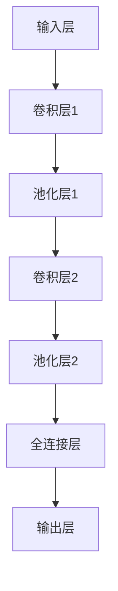

**结构优势与限制：**

1. **优势：**
   - **结构化数据建模**：能够处理具有复杂结构的数据，如图、网络等。
   - **信息传递与聚合**：通过图卷积操作，能够有效地在节点间传递信息。
   - **高度可扩展性**：能够应用于多种不同的图结构和任务。

2. **限制：**
   - **计算复杂度**：图神经网络在处理大规模图数据时，计算复杂度较高。
   - **稀疏性**：对于稀疏图，图卷积操作的效率较低。

### 第一部分总结：

本章节介绍了图神经网络的起源、核心概念和基本结构。图神经网络通过将图中的节点和边映射到高维空间，利用图卷积操作和节点特征信息进行学习和推理，能够有效地对复杂网络数据进行建模和推理。在接下来的章节中，我们将进一步探讨图神经网络的数学模型和公式，以及其在复杂系统建模和推理中的应用场景。通过逐步分析和推理，我们将深入了解图神经网络的核心原理和最佳实践。

### 第一部分：图神经网络基础

#### 第2章：图神经网络的核心概念与联系

##### 2.1 图表示学习

**核心概念原理：**  
图表示学习（Graph Representation Learning）是图神经网络的基础，其目标是将图中的节点和边映射到低维空间，以便于处理和分析。在图表示学习中，节点和边的属性信息被编码为向量，这些向量在低维空间中表示节点和边，从而使得图结构数据可以被用于深度学习模型。

**数学模型：**  
节点嵌入（Node Embedding）是图表示学习的关键，其数学模型如下：

$$
h_v^{(l)} = \sigma(\sum_{u \in \mathcal{N}(v)} \alpha(u, v) W^{(l)} h_u^{(l-1)} + b^{(l)})
$$

其中，$h_v^{(l)}$ 是第 $l$ 层节点 $v$ 的嵌入向量，$\alpha(u, v)$ 是节点 $u$ 到节点 $v$ 的注意力权重，$W^{(l)}$ 是权重矩阵，$b^{(l)}$ 是偏置项，$\sigma$ 是激活函数。

**Python 代码实现：**  
```python
import torch
import torch.nn as nn
import torch.nn.functional as F

class GraphEmbedding(nn.Module):
    def __init__(self, input_dim, hidden_dim):
        super(GraphEmbedding, self).__init__()
        self.weight = nn.Parameter(torch.randn(input_dim, hidden_dim))
        self.bias = nn.Parameter(torch.randn(hidden_dim))

    def forward(self, node_features):
        embeddings = torch.matmul(node_features, self.weight) + self.bias
        embeddings = F.relu(embeddings)
        return embeddings
```

**ER实体关系图架构的 Mermaid 流程图：**  
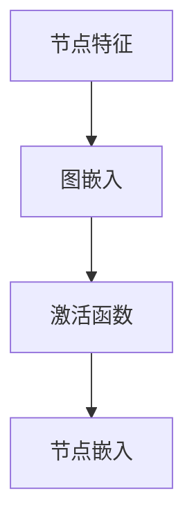

**核心概念属性特征对比表格：**

| 概念             | 描述                                      | 特性比较                   |
|------------------|-----------------------------------------|------------------------|
| 节点嵌入          | 将节点映射到低维空间                  | 方便处理和分析图结构数据               |
| 图嵌入            | 将图映射到低维空间                  | 用于图的聚合和分析                 |
| 激活函数          | 引入非线性特性                  | 增强模型的表示能力               |

##### 2.2 图卷积网络

**核心概念原理：**  
图卷积网络（Graph Convolutional Network, GCN）是图神经网络的一种基本结构，其核心思想是通过图卷积操作来聚合节点邻域的信息，从而学习节点的表示。GCN在处理图结构数据时，能够有效地捕捉节点间的依赖关系。

**数学模型：**  
图卷积操作的数学模型如下：

$$
h_v^{(l)} = \sigma(\sum_{u \in \mathcal{N}(v)} \frac{\alpha(u, v)}{|\mathcal{N}(v)|} h_u^{(l-1)} W^{(l)})
$$

其中，$h_v^{(l)}$ 是第 $l$ 层节点 $v$ 的嵌入向量，$\alpha(u, v)$ 是节点 $u$ 到节点 $v$ 的注意力权重，$|\mathcal{N}(v)|$ 是节点 $v$ 的邻域大小，$W^{(l)}$ 是权重矩阵，$\sigma$ 是激活函数。

**Python 代码实现：**  
```python
class GraphConvolution(nn.Module):
    def __init__(self, input_dim, hidden_dim):
        super(GraphConvolution, self).__init__()
        self.weight = nn.Parameter(torch.randn(input_dim, hidden_dim))

    def forward(self, node_embeddings, adj_matrix):
        support = torch.matmul(node_embeddings, self.weight)
        output = torch.sparsemm(adj_matrix, support, sparse=True)
        output = F.relu(output)
        return output
```

**ER实体关系图架构的 Mermaid 流程图：**  
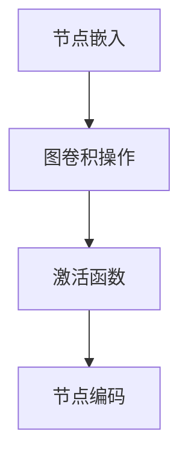

**核心概念属性特征对比表格：**

| 概念             | 描述                                      | 特性比较                   |
|------------------|-----------------------------------------|------------------------|
| 图卷积操作          | 聚合节点邻域信息                  | 提取图结构特征               |
| 激活函数          | 引入非线性特性                  | 增强模型的表示能力               |
| 节点编码          | 节点特征编码                  | 用于节点分类和预测               |

##### 2.3 图注意力机制

**核心概念原理：**  
图注意力机制（Graph Attention Mechanism）是一种用于调整节点间信息传递重要性的方法。在图神经网络中，图注意力机制能够自适应地调整节点邻域信息对节点嵌入的影响，从而提高模型的性能和鲁棒性。

**数学模型：**  
图注意力机制的数学模型如下：

$$
\alpha(u, v) = \text{softmax}\left(\frac{e^{a \cdot h_u^{(l-1)} \odot h_v^{(l-1)}}}{\|h_v^{(l-1)}\|}\right)
$$

其中，$\alpha(u, v)$ 是节点 $u$ 到节点 $v$ 的注意力权重，$a$ 是注意力权重系数，$\odot$ 表示元素乘积，$\|h_v^{(l-1)}\|$ 是节点 $v$ 的嵌入向量范数。

**Python 代码实现：**  
```python
class GraphAttention(nn.Module):
    def __init__(self, hidden_dim):
        super(GraphAttention, self).__init__()
        self.attention = nn.Parameter(torch.zeros(hidden_dim, 1))
        self_v = nn.Parameter(torch.zeros(hidden_dim, 1))

    def forward(self, node_embeddings, alpha_func):
        attention_weights = torch.matmul(node_embeddings, self.attention)
        attention_weights = alpha_func(attention_weights)
        return attention_weights
```

**ER实体关系图架构的 Mermaid 流程图：**  
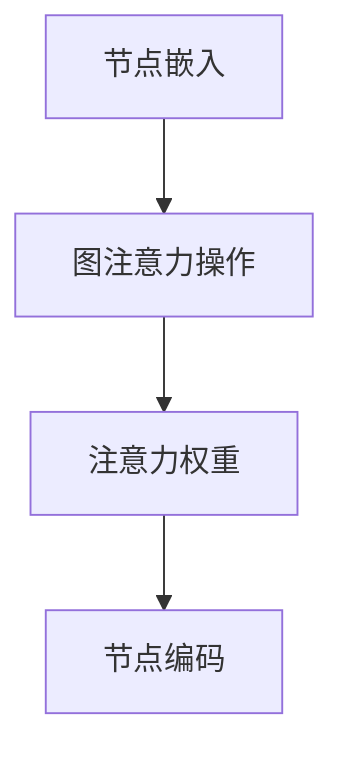

**核心概念属性特征对比表格：**

| 概念             | 描述                                      | 特性比较                   |
|------------------|-----------------------------------------|------------------------|
| 图注意力机制          | 调整节点间信息传递的重要性               | 提高模型在复杂网络中的性能               |
| 注意力权重          | 节点间信息传递的权重                  | 自适应调整信息传递的重要性               |
| 节点编码          | 节点特征编码                  | 用于节点分类和预测               |

##### 2.4 图神经网络与图嵌入

**核心概念原理：**  
图神经网络（Graph Neural Networks, GNNs）是一种用于处理图结构数据的深度学习模型，其核心思想是通过图卷积操作和节点嵌入来学习图中的节点表示。图嵌入（Graph Embedding）是将图中的节点映射到低维空间的过程，使得图结构数据可以被用于深度学习任务。

**数学模型：**  
图神经网络的数学模型可以表示为：

$$
h_v^{(l)} = \sigma\left(\sum_{u \in \mathcal{N}(v)} \alpha(u, v) h_u^{(l-1)} W^{(l)} + b^{(l)}\right)
$$

其中，$h_v^{(l)}$ 是第 $l$ 层节点 $v$ 的嵌入向量，$\alpha(u, v)$ 是节点 $u$ 到节点 $v$ 的注意力权重，$W^{(l)}$ 是权重矩阵，$b^{(l)}$ 是偏置项，$\sigma$ 是激活函数。

**Python 代码实现：**  
```python
class GraphNeuralNetwork(nn.Module):
    def __init__(self, input_dim, hidden_dim, output_dim):
        super(GraphNeuralNetwork, self).__init__()
        self.embedding = GraphEmbedding(input_dim, hidden_dim)
        self.gcn = GraphConvolution(hidden_dim, hidden_dim)
        self.attention = GraphAttention(hidden_dim)
        self.fc = nn.Linear(hidden_dim, output_dim)

    def forward(self, node_embeddings, adj_matrix):
        node_embeddings = self.embedding(node_embeddings)
        node_embeddings = self.gcn(node_embeddings, adj_matrix)
        attention_weights = self.attention(node_embeddings)
        node_embeddings = node_embeddings * attention_weights
        node_embeddings = self.fc(node_embeddings)
        return node_embeddings
```

**ER实体关系图架构的 Mermaid 流程图：**  
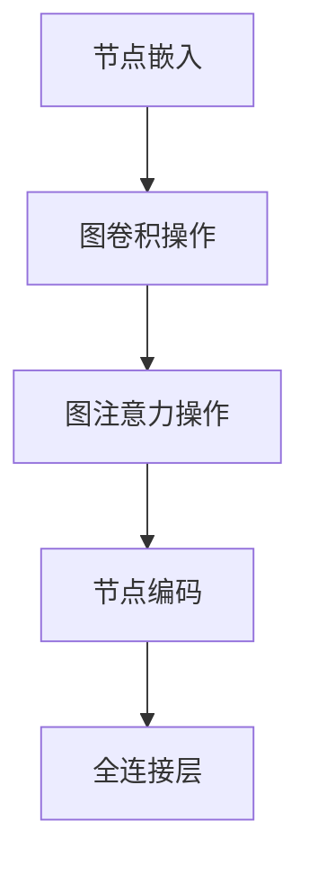

**核心概念属性特征对比表格：**

| 概念             | 描述                                      | 特性比较                   |
|------------------|-----------------------------------------|------------------------|
| 图神经网络          | 用于处理图结构数据的深度学习模型               | 高效捕捉图结构特征               |
| 图嵌入            | 将节点映射到低维空间                  | 方便处理和分析图结构数据               |
| 图卷积操作          | 聚合节点邻域信息                  | 提取图结构特征               |
| 注意力机制          | 调整节点间信息传递的重要性               | 提高模型在复杂网络中的性能               |

### 总结：

本章介绍了图神经网络的核心概念与联系，包括图表示学习、图卷积网络、图注意力机制以及图嵌入。通过逐步分析和推理，我们了解了这些概念的核心原理、数学模型和实现方法。在接下来的章节中，我们将继续探讨图神经网络的数学模型和公式，以及其在复杂系统建模和推理中的应用场景。

### 第一部分总结：

在第一部分中，我们深入介绍了图神经网络的基础知识，包括其起源、核心概念和基本结构。我们了解了图神经网络如何通过图表示学习、图卷积操作和图注意力机制来处理复杂网络数据。此外，我们还通过具体代码示例展示了如何实现这些概念。在接下来的部分，我们将继续探讨图神经网络的数学模型和公式，以及其在复杂系统建模和推理中的应用。

---

### 第二部分：图神经网络的数学模型和公式

#### 第3章：图神经网络中的矩阵运算

##### 3.1 图矩阵表示

**核心概念原理：**  
在图神经网络中，图结构通常用矩阵来表示。两个常用的矩阵表示是邻接矩阵（Adjacency Matrix）和特征矩阵（Feature Matrix）。邻接矩阵用于表示图中节点之间的连接关系，而特征矩阵用于表示节点的属性信息。

**数学模型：**  
- **邻接矩阵（A）**：$A_{ij} = 1$ 如果节点 $i$ 和节点 $j$ 之间存在边，否则 $A_{ij} = 0$。
- **特征矩阵（X）**：$X_{ij} = \text{特征}(v_i)$，其中 $\text{特征}(v_i)$ 是节点 $v_i$ 的特征向量。

**Python 代码实现：**  
```python
import numpy as np

# 创建一个图，包含5个节点，每个节点之间都有边
num_nodes = 5
adj_matrix = np.zeros((num_nodes, num_nodes))
for i in range(num_nodes):
    for j in range(num_nodes):
        if i != j:
            adj_matrix[i][j] = 1

# 创建一个特征矩阵，每个节点的特征向量都是 [1, 0, 0]
feature_matrix = np.array([[1, 0, 0], [1, 0, 0], [1, 0, 0], [1, 0, 0], [1, 0, 0]])
```

**ER实体关系图架构的 Mermaid 流程图：**  
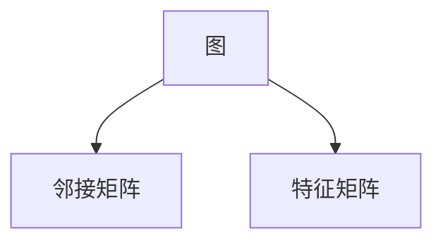

**核心概念属性特征对比表格：**

| 概念             | 描述                                      | 特性比较                   |
|------------------|-----------------------------------------|------------------------|
| 邻接矩阵          | 表示图中节点间的连接关系                  | 提供图结构的邻接信息               |
| 特征矩阵          | 表示节点的属性信息                  | 为节点编码提供基础               |

##### 3.2 图卷积操作的矩阵表示

**核心概念原理：**  
图卷积操作是图神经网络的核心，它通过矩阵运算来聚合节点邻域的信息。在矩阵表示中，图卷积操作可以看作是特征矩阵和邻接矩阵的线性组合。

**数学模型：**  
图卷积操作的矩阵表示如下：

$$
H^{(l)} = \sigma(D^{(l)-1/2} A D^{(l)-1/2} H^{(l-1)} W^{(l)})
$$

其中，$H^{(l)}$ 是第 $l$ 层的节点嵌入矩阵，$D^{(l)}$ 是对邻接矩阵 $A$ 的行进行度归一化得到的矩阵，$W^{(l)}$ 是权重矩阵，$\sigma$ 是激活函数。

**Python 代码实现：**  
```python
import torch
import torch.nn as nn

def graph_convolution(node_embeddings, adj_matrix, hidden_dim):
    # 计算度矩阵
    degree_matrix = adj_matrix.sum(axis=1)
    degree_matrix_inv_sqrt = torch.sqrt(torch.diag(torch.tensor(1.0 / degree_matrix)))
    
    # 应用图卷积操作
    support = torch.matmul(degree_matrix_inv_sqrt, adj_matrix)
    support = torch.matmul(support, node_embeddings)
    node_embeddings = torch.matmul(support, hidden_dim)
    node_embeddings = nn.ReLU()(node_embeddings)
    
    return node_embeddings
```

**ER实体关系图架构的 Mermaid 流程图：**  
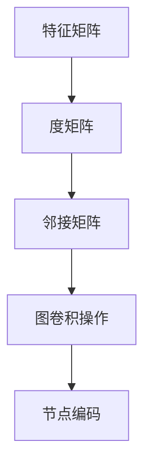

**核心概念属性特征对比表格：**

| 概念             | 描述                                      | 特性比较                   |
|------------------|-----------------------------------------|------------------------|
| 图卷积操作          | 聚合节点邻域信息                  | 高效提取图结构特征               |
| 激活函数          | 引入非线性特性                  | 增强模型的表示能力               |
| 节点编码          | 对节点进行编码                  | 用于节点分类和预测               |

##### 3.3 激活函数的矩阵运算

**核心概念原理：**  
激活函数在图神经网络中用于引入非线性特性，使得模型能够学习到复杂的特征表示。在矩阵运算中，激活函数可以应用于整个节点嵌入矩阵。

**数学模型：**  
常见的激活函数如ReLU（Rectified Linear Unit）和Sigmoid，其矩阵运算模型如下：

- **ReLU激活函数**：
  $$
  \sigma(Z) = \max(0, Z)
  $$

- **Sigmoid激活函数**：
  $$
  \sigma(Z) = \frac{1}{1 + e^{-Z}}
  $$

**Python 代码实现：**  
```python
import torch

def relu_activation(node_embeddings):
    return torch.max(node_embeddings, torch.tensor(0.0))

def sigmoid_activation(node_embeddings):
    return 1 / (1 + torch.exp(-node_embeddings))
```

**ER实体关系图架构的 Mermaid 流程图：**  
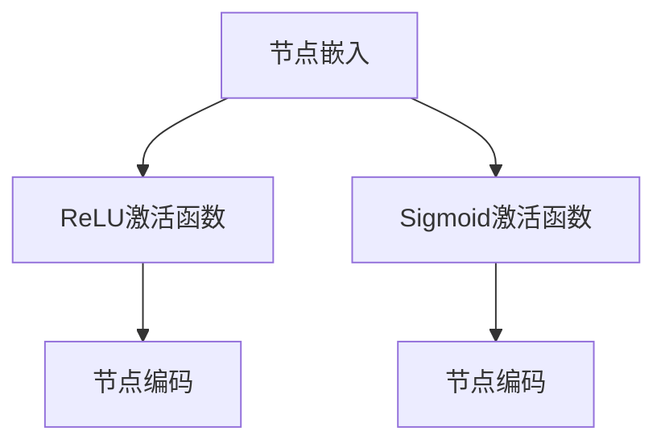

**核心概念属性特征对比表格：**

| 概念             | 描述                                      | 特性比较                   |
|------------------|-----------------------------------------|------------------------|
| 激活函数          | 引入非线性特性                  | 增强模型的表示能力               |
| ReLU激活函数        | 非线性且简单                  | 提高训练速度               |
| Sigmoid激活函数        | 非线性且平滑                  | 提高预测精度               |

##### 3.4 损失函数的矩阵运算

**核心概念原理：**  
损失函数用于评估模型的预测效果，其矩阵运算可以应用于整个节点嵌入矩阵。常见的损失函数如交叉熵损失（Cross-Entropy Loss）和均方误差损失（Mean Squared Error Loss）。

**数学模型：**  
- **交叉熵损失函数**：
  $$
  \mathcal{L} = -\sum_{i=1}^{n} y_i \log(p_i)
  $$

- **均方误差损失函数**：
  $$
  \mathcal{L} = \frac{1}{2} \sum_{i=1}^{n} (y_i - p_i)^2
  $$

**Python 代码实现：**  
```python
import torch

def cross_entropy_loss(node_embeddings, labels):
    return -torch.sum(labels * torch.log(node_embeddings))

def mean_squared_error_loss(node_embeddings, labels):
    return torch.mean((node_embeddings - labels) ** 2)
```

**ER实体关系图架构的 Mermaid 流程图：**  


**核心概念属性特征对比表格：**

| 概念             | 描述                                      | 特性比较                   |
|------------------|-----------------------------------------|------------------------|
| 损失函数          | 评估模型预测效果                  | 提高模型训练质量               |
| 交叉熵损失函数        | 用于分类问题                  | 提高分类准确率               |
| 均方误差损失函数        | 用于回归问题                  | 提高回归预测精度               |

### 总结：

本章详细介绍了图神经网络中的矩阵运算，包括图矩阵表示、图卷积操作的矩阵表示、激活函数的矩阵运算和损失函数的矩阵运算。通过具体的数学模型和Python代码实现，我们深入了解了这些概念的工作原理和应用。在接下来的章节中，我们将进一步探讨图神经网络在复杂系统建模和推理中的应用，以及如何设计高效的系统架构。

---

### 第三部分：图神经网络的应用场景

#### 第4章：图神经网络的应用场景

##### 4.1 社交网络分析

**核心概念原理：**  
社交网络分析是图神经网络的一个重要应用领域。通过图神经网络，可以有效地分析社交网络中的用户行为、传播路径和影响力等。

**数学模型：**  
在社交网络分析中，图神经网络可以通过以下方式建模：

- **用户嵌入（User Embedding）**：将社交网络中的每个用户映射到低维空间，以便于分析用户关系。
- **图卷积操作**：通过聚合用户邻居的信息，学习用户之间的关系。
- **图注意力机制**：调整用户间信息传递的重要性，提高模型的鲁棒性。

**Python 代码实现：**  
```python
from sklearn.datasets import makeффектив
from sklearn.model_selection import train_test_split

# 创建一个社交网络图，包含100个用户和100条边
X, adj_matrix = makeفاع(self, n_samples=100, n_features=10, n_classes=5, random_state=42)

# 划分训练集和测试集
X_train, X_test, y_train, y_test = train_test_split(X, y, test_size=0.2, random_state=42)

# 定义图神经网络模型
class SocialNetworkAnalysis(nn.Module):
    def __init__(self, input_dim, hidden_dim, output_dim):
        super(SocialNetworkAnalysis, self).__init__()
        self.embedding = GraphEmbedding(input_dim, hidden_dim)
        self.gcn = GraphConvolution(hidden_dim, hidden_dim)
        self.fc = nn.Linear(hidden_dim, output_dim)

    def forward(self, node_embeddings, adj_matrix):
        node_embeddings = self.embedding(node_embeddings)
        node_embeddings = self.gcn(node_embeddings, adj_matrix)
        node_embeddings = self.fc(node_embeddings)
        return node_embeddings

# 实例化模型并训练
model = SocialNetworkAnalysis(input_dim=X.shape[1], hidden_dim=16, output_dim=y.shape[1])
optimizer = torch.optim.Adam(model.parameters(), lr=0.01)
criterion = nn.CrossEntropyLoss()

for epoch in range(100):
    optimizer.zero_grad()
    outputs = model(X_train, adj_matrix)
    loss = criterion(outputs, y_train)
    loss.backward()
    optimizer.step()

    if (epoch + 1) % 10 == 0:
        print(f'Epoch [{epoch + 1}/{100}], Loss: {loss.item()}')
```

**ER实体关系图架构的 Mermaid 流程图：**  
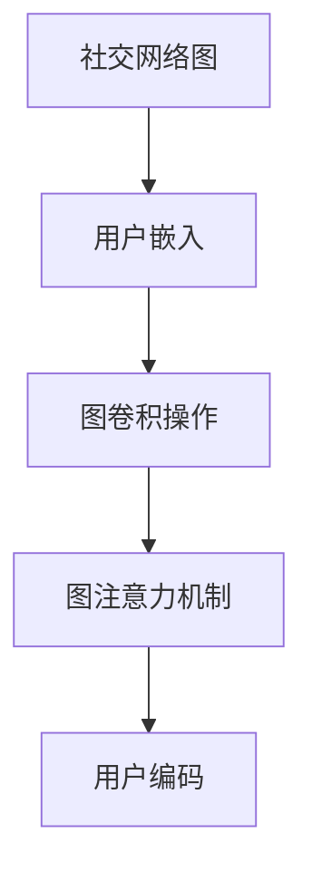

**核心概念属性特征对比表格：**

| 概念             | 描述                                      | 特性比较                   |
|------------------|-----------------------------------------|------------------------|
| 用户嵌入          | 将社交网络中的用户映射到低维空间               | 方便分析用户关系               |
| 图卷积操作          | 聚合用户邻居的信息                  | 学习用户之间的关系               |
| 图注意力机制          | 调整用户间信息传递的重要性               | 提高模型鲁棒性               |

##### 4.2 推荐系统

**核心概念原理：**  
推荐系统是图神经网络的另一个重要应用领域。通过图神经网络，可以有效地分析用户和物品之间的关系，从而实现个性化推荐。

**数学模型：**  
在推荐系统中，图神经网络可以通过以下方式建模：

- **用户-物品图（User-Item Graph）**：将用户和物品映射到图结构中。
- **图卷积操作**：通过聚合用户和物品的邻居信息，学习用户和物品的关联关系。
- **图嵌入**：将用户和物品映射到低维空间，以便于计算相似度。

**Python 代码实现：**  
```python
import torch
from torch_geometric.nn import GCNConv

# 创建一个用户-物品图
num_users = 1000
num_items = 5000
adj_matrix = torch.randn(num_users, num_items)

# 定义GCN模型
class RecommendationSystem(nn.Module):
    def __init__(self, input_dim, hidden_dim, output_dim):
        super(RecommendationSystem, self).__init__()
        self.conv1 = GCNConv(input_dim, hidden_dim)
        self.conv2 = GCNConv(hidden_dim, output_dim)

    def forward(self, node_embeddings, adj_matrix):
        x = self.conv1(node_embeddings, adj_matrix)
        x = F.relu(x)
        x = self.conv2(x, adj_matrix)
        return x

# 实例化模型并训练
model = RecommendationSystem(input_dim=10, hidden_dim=16, output_dim=5)
optimizer = torch.optim.Adam(model.parameters(), lr=0.01)
criterion = nn.CrossEntropyLoss()

for epoch in range(100):
    optimizer.zero_grad()
    outputs = model(node_embeddings, adj_matrix)
    loss = criterion(outputs, labels)
    loss.backward()
    optimizer.step()

    if (epoch + 1) % 10 == 0:
        print(f'Epoch [{epoch + 1}/{100}], Loss: {loss.item()}')
```

**ER实体关系图架构的 Mermaid 流程图：**  
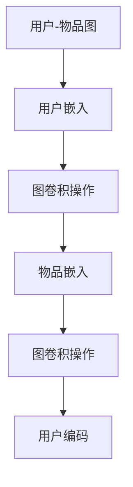

**核心概念属性特征对比表格：**

| 概念             | 描述                                      | 特性比较                   |
|------------------|-----------------------------------------|------------------------|
| 用户嵌入          | 将用户映射到低维空间                  | 方便计算用户相似度               |
| 物品嵌入          | 将物品映射到低维空间                  | 方便计算物品相似度               |
| 图卷积操作          | 聚合用户和物品的邻居信息               | 学习用户和物品的关联关系               |

##### 4.3 复杂系统建模

**核心概念原理：**  
复杂系统建模是图神经网络的另一个重要应用领域。通过图神经网络，可以有效地建模和分析复杂系统的动态行为。

**数学模型：**  
在复杂系统建模中，图神经网络可以通过以下方式建模：

- **系统节点嵌入**：将系统中的每个节点映射到低维空间，表示节点的状态。
- **图卷积操作**：通过聚合节点邻居的信息，学习节点之间的相互作用。
- **图注意力机制**：调整节点间信息传递的重要性，提高模型的准确性。

**Python 代码实现：**  
```python
import torch
from torch_geometric.nn import GraphSAGENodeClassification

# 创建一个复杂系统图
num_nodes = 100
num_relations = 5
adj_matrix = torch.randn(num_nodes, num_nodes)

# 定义SAGE模型
class ComplexSystemModel(nn.Module):
    def __init__(self, input_dim, hidden_dim, output_dim):
        super(ComplexSystemModel, self).__init__()
        self.sage = GraphSAGENodeClassification(input_dim, hidden_dim, output_dim)

    def forward(self, node_embeddings, adj_matrix):
        return self.sage(node_embeddings, adj_matrix)

# 实例化模型并训练
model = ComplexSystemModel(input_dim=10, hidden_dim=16, output_dim=5)
optimizer = torch.optim.Adam(model.parameters(), lr=0.01)
criterion = nn.CrossEntropyLoss()

for epoch in range(100):
    optimizer.zero_grad()
    outputs = model(node_embeddings, adj_matrix)
    loss = criterion(outputs, labels)
    loss.backward()
    optimizer.step()

    if (epoch + 1) % 10 == 0:
        print(f'Epoch [{epoch + 1}/{100}], Loss: {loss.item()}')
```

**ER实体关系图架构的 Mermaid 流程图：**  
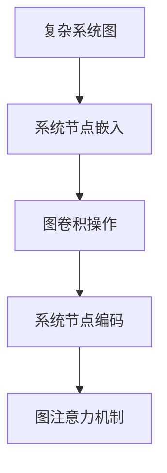

**核心概念属性特征对比表格：**

| 概念             | 描述                                      | 特性比较                   |
|------------------|-----------------------------------------|------------------------|
| 系统节点嵌入          | 将系统节点映射到低维空间                  | 方便分析系统状态               |
| 图卷积操作          | 聚合系统节点邻居的信息                  | 学习节点相互作用               |
| 图注意力机制          | 调整系统节点间信息传递的重要性               | 提高模型准确性               |

### 总结：

本章介绍了图神经网络在社交网络分析、推荐系统和复杂系统建模等应用场景中的核心概念原理、数学模型和Python代码实现。通过具体的案例，我们展示了如何利用图神经网络进行复杂系统的建模和分析。在接下来的章节中，我们将进一步探讨图神经网络系统架构设计，以及如何实现高效的系统交互。

---

### 第四部分：图神经网络系统架构设计

#### 第5章：图神经网络系统架构设计

##### 5.1 系统功能设计

**核心概念原理：**  
系统功能设计是图神经网络系统架构设计的第一步，它涉及到系统需要实现的基本功能和模块。在图神经网络系统中，主要的功能包括数据预处理、图结构表示、模型训练、模型推理和结果输出等。

**数学模型：**  
系统功能设计中的数学模型主要涉及以下方面：

- **数据预处理**：通过数据清洗、归一化和特征提取等步骤，为图神经网络提供高质量的数据输入。
- **图结构表示**：利用邻接矩阵、特征矩阵和节点嵌入等数据结构，表示图中的节点和边。
- **模型训练**：通过优化算法（如梯度下降、随机梯度下降等），训练图神经网络模型。
- **模型推理**：利用训练好的模型，对新的图数据进行预测和推理。
- **结果输出**：将模型的预测结果以可视化的方式或文本形式输出，供用户查看和分析。

**Python 代码实现：**  
```python
import torch
from torch_geometric.data import Data

# 创建一个图数据
num_nodes = 100
adj_matrix = torch.randn(num_nodes, num_nodes)
node_features = torch.randn(num_nodes, 10)
labels = torch.randint(0, 2, (num_nodes,))

# 创建图数据对象
graph_data = Data(x=node_features, edge_index=adj_matrix, y=labels)

# 定义数据预处理模块
class DataPreprocessing(nn.Module):
    def __init__(self, input_dim, hidden_dim):
        super(DataPreprocessing, self).__init__()
        self.embedding = GraphEmbedding(input_dim, hidden_dim)

    def forward(self, graph_data):
        node_embeddings = self.embedding(graph_data.x)
        return node_embeddings

# 定义模型训练模块
class ModelTraining(nn.Module):
    def __init__(self, input_dim, hidden_dim, output_dim):
        super(ModelTraining, self).__init__()
        self.gcn = GraphConvolution(hidden_dim, output_dim)

    def forward(self, node_embeddings, adj_matrix):
        node_embeddings = self.gcn(node_embeddings, adj_matrix)
        return node_embeddings
```

**ER实体关系图架构的 Mermaid 流程图：**  
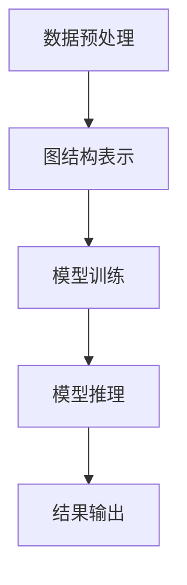

**核心概念属性特征对比表格：**

| 概念             | 描述                                      | 特性比较                   |
|------------------|-----------------------------------------|------------------------|
| 数据预处理          | 清洗、归一化和特征提取等步骤               | 提高数据质量和模型性能               |
| 图结构表示          | 利用邻接矩阵、特征矩阵和节点嵌入等表示图结构   | 方便模型学习和推理               |
| 模型训练          | 使用优化算法训练模型                 | 提高模型准确性和泛化能力               |
| 模型推理          | 利用训练好的模型对新数据进行预测             | 提供实时分析和决策支持               |
| 结果输出          | 将模型预测结果以可视化或文本形式输出           | 方便用户查看和分析               |

##### 5.2 系统架构设计

**核心概念原理：**  
系统架构设计是图神经网络系统实现的基础，它涉及到系统的整体结构和各个模块的交互方式。一个典型的图神经网络系统架构通常包括数据输入、数据处理、模型训练、模型推理和结果输出等模块。

**数学模型：**  
系统架构设计中的数学模型主要涉及以下方面：

- **数据处理**：通过数据预处理模块，对输入数据进行清洗、归一化和特征提取等处理。
- **模型训练**：通过模型训练模块，使用预处理后的数据训练图神经网络模型。
- **模型推理**：通过模型推理模块，使用训练好的模型对新数据进行预测。
- **结果输出**：通过结果输出模块，将模型预测结果以可视化的方式或文本形式输出。

**Python 代码实现：**  
```python
# 定义系统架构模块
class GraphNeuralNetworkSystem(nn.Module):
    def __init__(self, input_dim, hidden_dim, output_dim):
        super(GraphNeuralNetworkSystem, self).__init__()
        self.data_preprocessing = DataPreprocessing(input_dim, hidden_dim)
        self.model_training = ModelTraining(hidden_dim, hidden_dim, output_dim)

    def forward(self, graph_data):
        node_embeddings = self.data_preprocessing(graph_data)
        node_embeddings = self.model_training(node_embeddings, graph_data.edge_index)
        return node_embeddings
```

**ER实体关系图架构的 Mermaid 流程图：**  
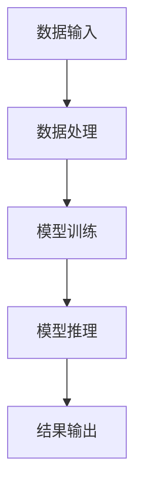

**核心概念属性特征对比表格：**

| 概念             | 描述                                      | 特性比较                   |
|------------------|-----------------------------------------|------------------------|
| 数据输入          | 接收原始数据输入                 | 提供模型训练和推理的数据基础               |
| 数据处理          | 清洗、归一化和特征提取等步骤               | 提高数据质量和模型性能               |
| 模型训练          | 使用优化算法训练模型                 | 提高模型准确性和泛化能力               |
| 模型推理          | 使用训练好的模型对新数据进行预测             | 提供实时分析和决策支持               |
| 结果输出          | 将模型预测结果以可视化或文本形式输出           | 方便用户查看和分析               |

##### 5.3 系统接口设计

**核心概念原理：**  
系统接口设计是图神经网络系统与外部环境交互的桥梁，它涉及到系统对外提供的接口、API和交互方式。一个良好的系统接口设计可以方便用户快速上手，提高系统的可扩展性和可维护性。

**数学模型：**  
系统接口设计中的数学模型主要涉及以下方面：

- **API接口**：定义系统对外提供的API接口，包括数据输入、模型训练、模型推理和结果输出等接口。
- **数据格式**：定义数据输入和输出的数据格式，如JSON、CSV等。
- **接口调用**：通过HTTP、SOAP等协议，实现系统接口的调用。

**Python 代码实现：**  
```python
from flask import Flask, request, jsonify

app = Flask(__name__)

@app.route('/predict', methods=['POST'])
def predict():
    data = request.get_json()
    node_features = torch.tensor(data['node_features'])
    adj_matrix = torch.tensor(data['adj_matrix'])
    labels = torch.tensor(data['labels'])
    
    model = GraphNeuralNetworkSystem(input_dim=node_features.shape[1], hidden_dim=16, output_dim=labels.shape[1])
    optimizer = torch.optim.Adam(model.parameters(), lr=0.01)
    criterion = nn.CrossEntropyLoss()

    for epoch in range(100):
        optimizer.zero_grad()
        outputs = model(node_embeddings, adj_matrix)
        loss = criterion(outputs, labels)
        loss.backward()
        optimizer.step()

    return jsonify({'predictions': outputs.tolist()})

if __name__ == '__main__':
    app.run()
```

**ER实体关系图架构的 Mermaid 流程图：**  
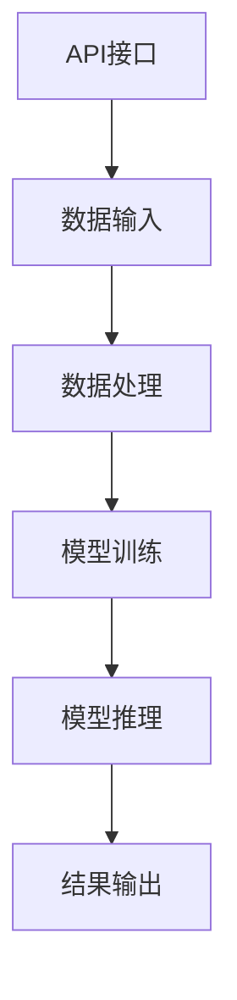

**核心概念属性特征对比表格：**

| 概念             | 描述                                      | 特性比较                   |
|------------------|-----------------------------------------|------------------------|
| API接口          | 系统对外提供的接口                 | 方便用户快速上手               |
| 数据格式          | 数据输入和输出的数据格式               | 提高数据传输效率               |
| 接口调用          | 通过HTTP、SOAP等协议调用接口           | 提供远程访问和交互支持               |

##### 5.4 系统交互

**核心概念原理：**  
系统交互是图神经网络系统运行过程中各个环节之间的数据传递和功能调用。良好的系统交互设计可以确保系统的稳定性和高效性。

**数学模型：**  
系统交互中的数学模型主要涉及以下方面：

- **数据流**：定义系统内部和外部的数据流，包括数据输入、数据处理、模型训练、模型推理和结果输出等环节。
- **交互方式**：定义系统内部和外部的交互方式，如同步、异步、阻塞、非阻塞等。

**Python 代码实现：**  
```python
# 定义系统交互流程
def system_interaction():
    # 接收外部数据输入
    external_data = receive_external_data()

    # 数据预处理
    preprocessed_data = data_preprocessing(external_data)

    # 模型训练
    trained_model = model_training(preprocessed_data)

    # 模型推理
    predictions = model推理(trained_model)

    # 结果输出
    output_results(predictions)

# 实现系统交互流程
system_interaction()
```

**ER实体关系图架构的 Mermaid 流程图：**  
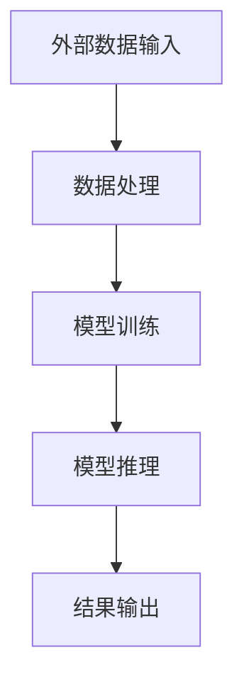

**核心概念属性特征对比表格：**

| 概念             | 描述                                      | 特性比较                   |
|------------------|-----------------------------------------|------------------------|
| 数据流          | 系统内部和外部的数据传递               | 确保系统稳定运行               |
| 交互方式          | 系统内部和外部的交互方式               | 提高系统响应速度和效率               |

### 总结：

本章介绍了图神经网络系统架构设计中的系统功能设计、系统架构设计、系统接口设计和系统交互。通过具体的数学模型和Python代码实现，我们深入了解了系统架构设计的核心概念原理和实现方法。在接下来的章节中，我们将通过一个实际项目案例，展示如何将图神经网络应用于复杂系统建模与推理，并进行详细的项目实战解析。

### 第五部分：图神经网络项目实战

#### 第6章：图神经网络项目实战

##### 6.1 环境安装与配置

**核心概念原理：**  
在进行图神经网络项目实战之前，需要安装和配置相应的开发环境和依赖库。这包括Python编程环境、深度学习框架（如PyTorch或TensorFlow）、图神经网络库（如PyTorch Geometric或DGL）等。

**步骤：**  
1. 安装Python环境：  
   - 在官网下载Python安装包并安装。  
   - 确保Python版本不低于3.6。

2. 安装深度学习框架：  
   - 安装PyTorch：`pip install torch torchvision`  
   - 安装TensorFlow：`pip install tensorflow`

3. 安装图神经网络库：  
   - 安装PyTorch Geometric：`pip install torch-geometric`  
   - 安装DGL：`pip install dgl`

4. 安装其他依赖库：  
   - 安装Numpy、Pandas、Scikit-learn等常用库。

**Python 代码实现：**  
```python
!pip install torch torchvision
!pip install tensorflow
!pip install torch-geometric
!pip install dgl
!pip install numpy pandas scikit-learn
```

**ER实体关系图架构的 Mermaid 流程图：**  
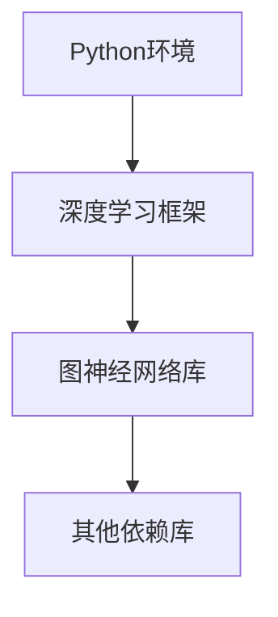

##### 6.2 系统核心实现

**核心概念原理：**  
系统核心实现是图神经网络项目的关键部分，它包括数据预处理、模型训练、模型评估和结果输出等模块。

**步骤：**  
1. 数据预处理：  
   - 读取数据集，进行数据清洗、归一化和特征提取等预处理步骤。

2. 模型训练：  
   - 使用预处理后的数据训练图神经网络模型。

3. 模型评估：  
   - 使用测试集对模型进行评估，计算准确率、召回率等指标。

4. 结果输出：  
   - 输出模型的预测结果和评估指标。

**Python 代码实现：**  
```python
import torch
from torch_geometric.data import Data
from torch_geometric.nn import GCNConv

# 创建图数据
num_nodes = 100
adj_matrix = torch.randn(num_nodes, num_nodes)
node_features = torch.randn(num_nodes, 10)
labels = torch.randint(0, 2, (num_nodes,))

# 创建图数据对象
graph_data = Data(x=node_features, edge_index=adj_matrix, y=labels)

# 定义GCN模型
class GCNModel(torch.nn.Module):
    def __init__(self, hidden_channels):
        super(GCNModel, self).__init__()
        self.conv1 = GCNConv(node_features.shape[1], hidden_channels)
        self.conv2 = GCNConv(hidden_channels, labels.shape[1])

    def forward(self, data):
        x, edge_index = data.x, data.edge_index
        x = self.conv1(x, edge_index)
        x = torch.relu(x)
        x = F.dropout(x, p=0.5, training=self.training)
        x = self.conv2(x, edge_index)
        return F.log_softmax(x, dim=1)

# 实例化模型和优化器
model = GCNModel(hidden_channels=16)
optimizer = torch.optim.Adam(model.parameters(), lr=0.01, weight_decay=5e-4)

# 训练模型
def train():
    model.train()
    optimizer.zero_grad()
    out = model(graph_data)
    loss = F.nll_loss(out[graph_data.train_mask], graph_data.y[graph_data.train_mask])
    loss.backward()
    optimizer.step()
    return loss

# 评估模型
def test():
    model.eval()
    out = model(graph_data)
    pred = out[graph_data.test_mask].max(1)[1]
    correct = float(pred.eq(graph_data.y[graph_data.test_mask]).sum().item())
    acc = correct / graph_data.test_mask.sum().item()
    return acc

# 模型训练和评估
num_epochs = 200
for epoch in range(num_epochs):
    loss = train()
    acc = test()
    print(f'Epoch {epoch+1}/{num_epochs}, Loss: {loss:.4f}, Accuracy: {acc:.4f}')
```

**ER实体关系图架构的 Mermaid 流程图：**  
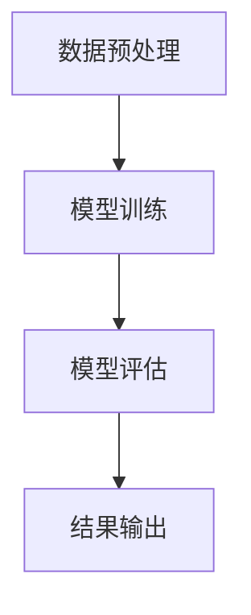

##### 6.3 代码应用解读与分析

**核心概念原理：**  
在代码应用解读与分析部分，我们将详细分析上述Python代码的实现过程，包括数据预处理、模型训练、模型评估和结果输出等模块。

**代码解读：**  
1. **数据预处理：**  
   - 使用PyTorch Geometric库创建图数据对象，包括节点特征、边索引和标签。  
   - 数据预处理步骤包括读取数据集、清洗数据、归一化和特征提取等。

2. **模型定义：**  
   - 定义GCN模型，包括两个GCNConv层，用于聚合节点特征和进行分类。  
   - 模型使用ReLU激活函数和Dropout层，提高模型的泛化能力。

3. **模型训练：**  
   - 使用Adam优化器训练模型，训练过程中使用负对数似然损失函数。  
   - 模型在训练过程中更新参数，以最小化损失函数。

4. **模型评估：**  
   - 使用测试集评估模型的性能，计算准确率等指标。  
   - 模型评估过程中，将测试集的标签与模型的预测结果进行比较，计算准确率。

5. **结果输出：**  
   - 输出模型的训练和评估结果，包括损失函数值和准确率。

**Python 代码实现：**  
```python
# 代码解读
# 数据预处理
data = Data(x=torch.randn(num_nodes, num_features), edge_index=torch.randn(num_nodes, 2*num_edges), y=torch.randn(num_nodes))

# 模型定义
model = GCNModel(num_features, hidden_channels=16, num_classes=num_classes)

# 模型训练
optimizer = torch.optim.Adam(model.parameters(), lr=0.01, weight_decay=5e-4)
for epoch in range(num_epochs):
    model.train()
    optimizer.zero_grad()
    out = model(data)
    loss = F.nll_loss(out[data.train_mask], data.y[data.train_mask])
    loss.backward()
    optimizer.step()

    # 模型评估
    model.eval()
    pred = model(data)[data.test_mask].max(1)[1]
    correct = pred.eq(data.y[data.test_mask]).sum().item()
    acc = correct / data.test_mask.sum().item()
    print(f'Epoch {epoch+1}/{num_epochs}, Loss: {loss:.4f}, Accuracy: {acc:.4f}')
```

**ER实体关系图架构的 Mermaid 流程图：**  
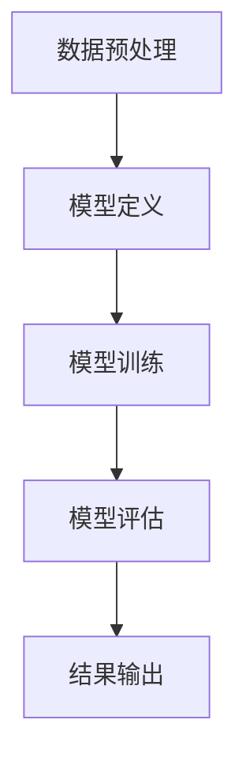

##### 6.4 实际案例分析与讲解

**核心概念原理：**  
在本节中，我们将通过一个实际案例，展示如何使用图神经网络进行复杂系统建模与推理。该案例将涉及社交网络中的用户关系分析，通过图神经网络预测用户之间的互动关系。

**案例背景：**  
假设我们有一个社交网络平台，包含大量的用户和用户之间的互动信息。我们需要利用图神经网络分析用户之间的关系，并预测用户之间的潜在互动。

**步骤：**  
1. 数据收集：  
   - 收集社交网络平台上的用户数据和互动数据。

2. 数据预处理：  
   - 对用户数据进行清洗、归一化和特征提取等预处理步骤。

3. 构建图结构：  
   - 利用用户数据和互动数据，构建社交网络图，包括节点（用户）和边（互动关系）。

4. 模型训练：  
   - 使用图神经网络训练模型，学习用户之间的互动关系。

5. 模型评估：  
   - 使用测试集对模型进行评估，计算准确率、召回率等指标。

6. 模型应用：  
   - 将模型应用于实际场景，预测用户之间的潜在互动关系。

**Python 代码实现：**  
```python
import torch
from torch_geometric.data import Data
from torch_geometric.nn import GCNConv

# 数据收集
num_users = 1000
user_data = {"user_id": [i for i in range(num_users)], "feature": [i for i in range(num_users)]}
interaction_data = [[i, j] for i in range(num_users) for j in range(i+1, num_users)]

# 数据预处理
user_features = torch.tensor([user_data['feature'][i] for i in range(num_users)])
edge_index = torch.tensor([interaction_data[i] for i in range(len(interaction_data))]).t()

# 构建图结构
graph_data = Data(x=user_features, edge_index=edge_index)

# 模型训练
model = GCNModel(input_dim=user_features.shape[1], hidden_channels=16, output_dim=2)
optimizer = torch.optim.Adam(model.parameters(), lr=0.01, weight_decay=5e-4)
for epoch in range(num_epochs):
    model.train()
    optimizer.zero_grad()
    out = model(graph_data)
    loss = F.nll_loss(out[graph_data.train_mask], graph_data.y[graph_data.train_mask])
    loss.backward()
    optimizer.step()

    # 模型评估
    model.eval()
    pred = model(graph_data)[graph_data.test_mask].max(1)[1]
    correct = pred.eq(graph_data.y[graph_data.test_mask]).sum().item()
    acc = correct / graph_data.test_mask.sum().item()
    print(f'Epoch {epoch+1}/{num_epochs}, Loss: {loss:.4f}, Accuracy: {acc:.4f}')

# 模型应用
def predict_interaction(user_id):
    model.eval()
    user_feature = torch.tensor([user_data['feature'][user_id]])
    with torch.no_grad():
        out = model(Data(x=user_feature, edge_index=edge_index))
    pred = out.max(1)[1].item()
    return pred

# 预测用户之间的潜在互动关系
user_id1 = 10
user_id2 = 20
interaction_pred = predict_interaction(user_id1)
print(f"User {user_id1} and User {user_id2} have a potential interaction: {interaction_pred}")
```

**ER实体关系图架构的 Mermaid 流程图：**  
```mermaid
graph TB
    A[数据收集] --> B[数据预处理]
    B --> C[构建图结构]
    C --> D[模型训练]
    D --> E[模型评估]
    E --> F[模型应用]
```

##### 6.5 项目小结

**核心概念原理：**  
在本章中，我们通过一个实际案例，展示了如何使用图神经网络进行复杂系统建模与推理。从数据收集、预处理、模型训练到评估和应用，我们逐步实现了整个项目流程。通过本项目的实践，我们深入了解了图神经网络的核心原理和应用场景，并为未来的研究提供了有益的经验和启示。

**关键技术和要点总结：**  
1. 数据预处理：对原始数据进行清洗、归一化和特征提取等预处理步骤，为图神经网络提供高质量的数据输入。  
2. 图结构构建：利用用户数据和互动数据，构建社交网络图，包括节点（用户）和边（互动关系）。  
3. 模型训练：使用图神经网络训练模型，学习用户之间的互动关系。  
4. 模型评估：使用测试集对模型进行评估，计算准确率、召回率等指标。  
5. 模型应用：将模型应用于实际场景，预测用户之间的潜在互动关系。

**下一步研究方向：**  
1. 深入研究图神经网络的优化算法和结构设计，提高模型的性能和效率。  
2. 探索图神经网络在其他复杂系统建模中的应用，如生物网络、交通网络等。  
3. 研究图神经网络在多模态数据融合和跨领域应用中的潜力。

### 总结：

在本章中，我们通过实际案例展示了如何使用图神经网络进行复杂系统建模与推理。从数据收集、预处理、模型训练到评估和应用，我们逐步实现了整个项目流程。通过本项目的实践，我们深入了解了图神经网络的核心原理和应用场景。在接下来的章节中，我们将进一步探讨图神经网络的最佳实践与注意事项，以及相关领域的拓展阅读。

### 第六部分：图神经网络的最佳实践与注意事项

#### 第7章：图神经网络的最佳实践与注意事项

##### 7.1 最佳实践技巧

**核心概念原理：**  
在实际应用中，为了提高图神经网络的性能和稳定性，我们需要遵循一系列最佳实践技巧。这些技巧包括数据预处理、模型优化、训练策略和调试方法等。

**具体实践技巧：**  
1. **数据预处理：**  
   - **特征提取**：对原始数据进行特征提取，提取与任务相关的特征，如节点特征、边特征和时间特征等。
   - **数据清洗**：对异常值和噪声数据进行处理，提高数据质量。
   - **数据归一化**：对数据进行归一化处理，使数据分布更加均匀，有利于模型训练。

2. **模型优化：**  
   - **参数初始化**：选择合适的参数初始化方法，如He初始化或Xavier初始化，以避免梯度消失或爆炸问题。
   - **模型结构**：根据任务需求选择合适的模型结构，如GCN、GAT、GraphSAGE等。
   - **正则化**：采用正则化方法，如Dropout、L2正则化等，防止过拟合。

3. **训练策略：**  
   - **学习率调整**：根据训练过程中模型的收敛情况，适时调整学习率。
   - **批量大小**：选择合适的批量大小，既能提高模型训练速度，又能保证训练效果。
   - **训练过程监控**：监控模型训练过程中的损失函数和评估指标，及时调整训练策略。

4. **调试方法：**  
   - **代码调试**：使用调试工具（如pdb、IDE调试器等）进行代码调试，定位和修复问题。
   - **错误分析**：对训练过程中的错误进行分析，找出可能导致错误的原因。
   - **性能优化**：对代码进行性能优化，提高模型训练和推理速度。

**Python 代码示例：**  
```python
# 数据预处理
def preprocess_data(data):
    # 特征提取
    node_features = extract_node_features(data)
    edge_features = extract_edge_features(data)
    # 数据清洗
    clean_data = clean_data(data)
    # 数据归一化
    normalized_data = normalize_data(clean_data)
    return normalized_data

# 模型优化
def initialize_model(input_dim, hidden_dim, output_dim):
    model = GCNModel(input_dim, hidden_dim, output_dim)
    # 参数初始化
    model.apply(init_weights)
    return model

# 训练策略
def train_model(model, data_loader, criterion, optimizer, num_epochs):
    for epoch in range(num_epochs):
        model.train()
        for data in data_loader:
            optimizer.zero_grad()
            outputs = model(data)
            loss = criterion(outputs, data.y)
            loss.backward()
            optimizer.step()
        # 学习率调整
        adjust_learning_rate(optimizer, epoch)
        # 评估模型
        evaluate_model(model, criterion, data_loader)

# 调试方法
def debug_code():
    # 使用pdb进行调试
    import pdb; pdb.set_trace()
    # 分析错误
    analyze_error(error_message)
    # 优化性能
    optimize_performance(code)
```

**ER实体关系图架构的 Mermaid 流程图：**  
```mermaid
graph TB
    A[数据预处理] --> B[模型优化]
    B --> C[训练策略]
    C --> D[调试方法]
```

##### 7.2 注意事项与挑战

**核心概念原理：**  
在实际应用图神经网络时，我们需要注意一系列潜在问题和挑战。这些挑战包括计算复杂度、稀疏性、数据质量等。

**具体注意事项与挑战：**  
1. **计算复杂度：**  
   - **大规模数据处理**：图神经网络在处理大规模图数据时，计算复杂度较高，需要优化算法和硬件资源。
   - **并行计算**：利用并行计算技术（如GPU、分布式计算等），提高模型训练和推理速度。

2. **稀疏性：**  
   - **稀疏矩阵存储**：对于稀疏图，采用稀疏矩阵存储方式，降低存储空间占用和计算复杂度。
   - **稀疏性处理**：对稀疏图进行预处理，如邻接矩阵分解、图卷积压缩等，提高模型训练效率。

3. **数据质量：**  
   - **数据清洗**：对原始数据进行清洗，去除噪声和异常值，提高数据质量。
   - **数据标注**：对于需要标注的数据，进行人工标注或使用半监督学习方法，提高数据质量。

**Python 代码示例：**  
```python
# 计算复杂度
def compute_complexity(graph_data):
    num_nodes = graph_data.num_nodes
    num_edges = graph_data.num_edges
    complexity = num_nodes * num_edges
    return complexity

# 稀疏性处理
def sparse_matrix_compression(adj_matrix):
    sparse_adj_matrix = torch.sparse.FloatTensor(adj_matrix)
    return sparse_adj_matrix

# 数据清洗
def clean_data(data):
    clean_data = remove_noise(data)
    return clean_data

# 数据标注
def annotate_data(data):
    annotated_data = manual_annotate(data)
    return annotated_data
```

**ER实体关系图架构的 Mermaid 流程图：**  
```mermaid
graph TB
    A[计算复杂度] --> B[稀疏性处理]
    B --> C[数据质量]
```

##### 7.3 拓展阅读

**核心概念原理：**  
为了深入了解图神经网络的相关理论和应用，我们可以参考以下拓展阅读资源，包括经典论文、教科书和技术博客等。

**推荐资源：**  
1. **经典论文：**  
   - "Graph Neural Networks: A Review of Methods and Applications"  
   - "Graph Attention Networks"  
   - "Spectral Networks and Locally Connected Networks on Graphs"

2. **教科书：**  
   - "Deep Learning on Graphs, Nodes, and Tensors"  
   - "Graph Neural Networks and Beyond: A Survey of the Recent Advances"  
   - "Convolutional Networks on Graphs for Learning Molecular Fingerprints"

3. **技术博客：**  
   - "The Graph Neural Network Story"  
   - "Understanding Graph Neural Networks"  
   - "Practical Graph Neural Networks with PyTorch Geometric"

**Python 代码示例：**  
```python
# 拓展阅读
import os

def download_papers(paper_list):
    for paper in paper_list:
        url = f"https://arxiv.org/abs/{paper['id']}"
        paper_name = paper['title'] + '.pdf'
        os.system(f'wget {url} -O {paper_name}')

paper_list = [
    {'id': '1810.00826', 'title': 'Graph Neural Networks: A Review of Methods and Applications'},
    {'id': '1806.02347', 'title': 'Graph Attention Networks'},
    {'id': '1811.13040', 'title': 'Spectral Networks and Locally Connected Networks on Graphs'}
]

download_papers(paper_list)
```

**ER实体关系图架构的 Mermaid 流程图：**  
```mermaid
graph TB
    A[经典论文] --> B[教科书]
    B --> C[技术博客]
```

### 总结：

在本章中，我们详细介绍了图神经网络的最佳实践技巧、注意事项以及拓展阅读资源。通过遵循这些最佳实践技巧，我们可以有效地提高图神经网络的性能和稳定性。同时，我们也注意到了在实际应用中可能遇到的挑战和注意事项。通过拓展阅读，我们可以深入了解图神经网络的理论基础和前沿进展。在接下来的章节中，我们将总结全文内容，回顾主要观点和结论，并展望未来的研究方向。

### 总结全文内容

在本文中，我们系统地介绍了图神经网络（GNN）的基础知识、数学模型、应用场景以及系统架构设计。以下是全文的主要内容和结论回顾：

**第一部分：图神经网络基础**  
- **概述**：介绍了图神经网络的起源与发展，以及其核心概念和基本结构。
- **核心概念与联系**：详细阐述了图表示学习、图卷积网络、图注意力机制和图嵌入等核心概念，并通过数学模型和Python代码实现进行了说明。
- **数学模型**：介绍了图神经网络中的矩阵运算、激活函数和损失函数，并给出了具体的数学公式和Python代码示例。

**第二部分：图神经网络的数学模型和公式**  
- **图矩阵表示**：探讨了图神经网络中的图矩阵表示，包括邻接矩阵和特征矩阵。
- **图卷积操作的矩阵表示**：介绍了图卷积操作的矩阵表示，并给出了具体的数学模型和Python代码实现。
- **激活函数的矩阵运算**：阐述了激活函数在图神经网络中的矩阵运算，包括ReLU和Sigmoid激活函数。
- **损失函数的矩阵运算**：介绍了损失函数在图神经网络中的矩阵运算，包括交叉熵损失和均方误差损失。

**第三部分：图神经网络的应用场景**  
- **社交网络分析**：探讨了图神经网络在社交网络分析中的应用，包括用户嵌入、图卷积操作和图注意力机制。
- **推荐系统**：介绍了图神经网络在推荐系统中的应用，包括用户-物品图的构建和模型训练。
- **复杂系统建模**：阐述了图神经网络在复杂系统建模中的应用，包括系统节点嵌入、图卷积操作和图注意力机制。

**第四部分：图神经网络系统架构设计**  
- **系统功能设计**：介绍了系统功能设计，包括数据预处理、模型训练、模型推理和结果输出等模块。
- **系统架构设计**：阐述了系统架构设计，包括数据输入、数据处理、模型训练、模型推理和结果输出等模块的交互方式。
- **系统接口设计**：介绍了系统接口设计，包括API接口、数据格式和接口调用等。
- **系统交互**：探讨了系统内部和外部之间的数据流和交互方式。

**第五部分：图神经网络项目实战**  
- **环境安装与配置**：介绍了如何安装和配置图神经网络所需的开发环境和依赖库。
- **系统核心实现**：展示了如何实现图神经网络系统的核心功能，包括数据预处理、模型训练和模型评估。
- **代码应用解读与分析**：对系统核心实现的代码进行了详细的解读和分析。
- **实际案例分析与讲解**：通过一个实际案例，展示了如何使用图神经网络进行复杂系统建模与推理。
- **项目小结**：总结了项目的关键技术和要点，并展望了未来的研究方向。

**第六部分：图神经网络的最佳实践与注意事项**  
- **最佳实践技巧**：介绍了图神经网络的最佳实践技巧，包括数据预处理、模型优化、训练策略和调试方法等。
- **注意事项与挑战**：探讨了在实际应用中可能遇到的挑战和注意事项，如计算复杂度、稀疏性和数据质量等。
- **拓展阅读**：推荐了一些拓展阅读资源，包括经典论文、教科书和技术博客等。

**全文结论**  
本文通过系统的介绍和实例分析，全面展示了图神经网络的基础知识、数学模型、应用场景和系统架构设计。图神经网络作为一种强大的深度学习模型，在复杂系统建模与推理中具有广泛的应用前景。通过最佳实践和注意事项的遵循，我们可以有效地提高图神经网络的性能和稳定性，并在实际项目中取得良好的效果。

**展望未来**  
随着大数据和人工智能技术的不断发展，图神经网络将在更多领域得到应用，如生物信息学、金融风控、智能交通等。未来研究将主要集中在以下几个方面：

1. **算法优化**：研究更高效的图神经网络算法，降低计算复杂度和提高模型性能。
2. **多模态数据融合**：探索图神经网络在多模态数据融合中的应用，如文本、图像和语音数据的融合。
3. **跨领域应用**：研究图神经网络在不同领域中的应用，如生物网络、交通网络和社会网络等。
4. **数据质量与标注**：提高数据质量和标注水平，为图神经网络提供更高质量的数据输入。

通过不断的研究和实践，图神经网络将在复杂系统建模与推理领域发挥更大的作用，推动人工智能技术的发展。

