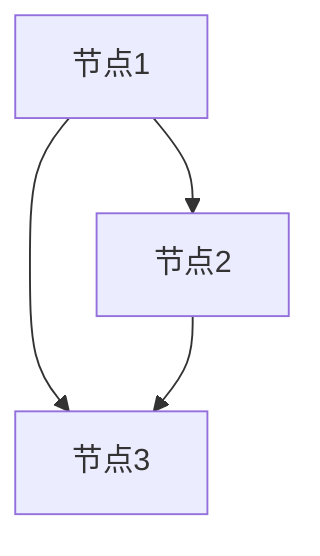
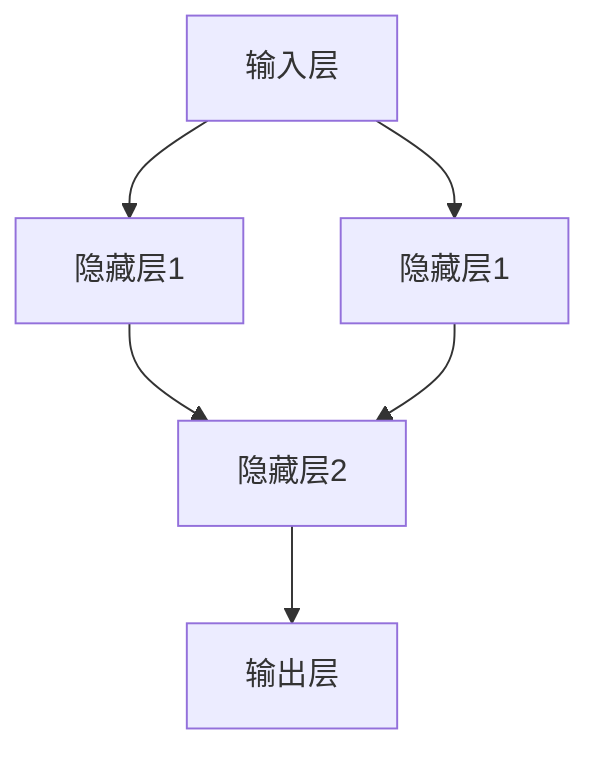
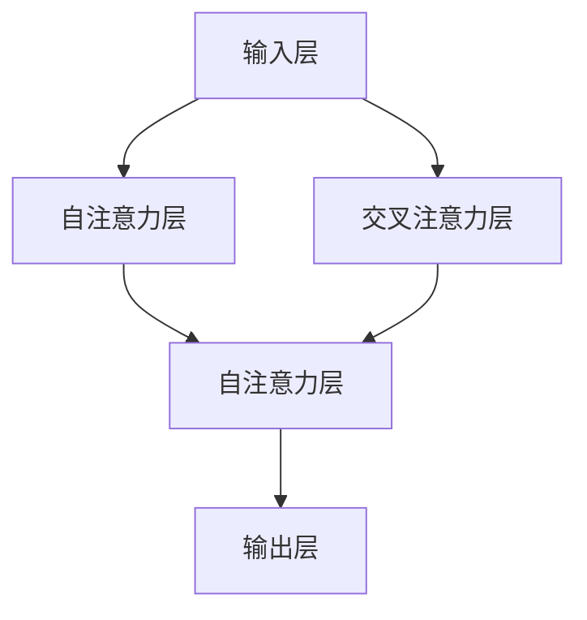

                 

### 图神经网络在社交网络分析中的应用

> **关键词：** 图神经网络、社交网络、数据分析、节点嵌入、图注意力机制

> **摘要：** 本文旨在深入探讨图神经网络（Graph Neural Networks, GNNs）在社交网络分析中的应用。文章首先介绍了图神经网络的基本概念、核心原理及其在社交网络分析中的重要性。随后，通过详细阐述图神经网络在社交网络数据预处理、节点和边表示、社交网络可视化等环节的应用，展示了图神经网络在实际案例中的强大能力。最后，对文章进行了总结，并提出了未来研究的方向和挑战。

在社会信息化和数字化时代，社交网络已成为人们日常生活中不可或缺的一部分。无论是个人关系网络，还是企业社交平台，社交网络中蕴含着大量有价值的信息和模式。如何有效地分析这些社交网络数据，提取隐藏在其中的有用信息，是当前数据科学和人工智能领域的重要研究方向。图神经网络作为一种强大的机器学习工具，在处理复杂网络数据方面具有独特的优势。

本文将从以下几个方面展开讨论：

1. **图神经网络的基本概念与原理**：首先介绍图神经网络的基础概念，包括图结构、节点和边表示等，并解释图神经网络如何利用图结构进行信息传播和计算。
2. **图神经网络在社交网络分析中的应用**：详细讨论图神经网络在社交网络数据预处理、节点和边表示、社交网络可视化等环节的应用。
3. **实际应用案例**：通过具体案例展示图神经网络在社交网络分析中的实际应用效果。
4. **未来研究方向与挑战**：总结当前研究的进展，并讨论未来的研究方向和挑战。

在接下来的章节中，我们将逐步深入探讨这些内容，以帮助读者更好地理解图神经网络在社交网络分析中的应用。

### 第一部分: 引言与背景

#### 第1章: 问题背景与概述

##### 1.1 问题的提出

随着互联网的普及，社交网络已经成为人们交流和分享信息的重要平台。从Facebook、Twitter到LinkedIn、微信，各种各样的社交网络平台不断涌现，深刻地改变了人们的生活方式和社会结构。然而，随着社交网络规模的不断扩大和数据量的急剧增加，如何有效地分析这些社交网络数据，提取隐藏在其中的有用信息，成为一个亟待解决的重要问题。

社交网络分析（Social Network Analysis, SNA）是一种研究社交网络结构、节点关系及其动态变化的科学方法。它通过分析社交网络中的节点（用户）和边（关系）来揭示社交网络的属性和特征，如群体的形成、信息的传播、影响力的评估等。传统的社交网络分析方法主要包括网络拓扑分析、统计方法、图论算法等，但这些方法在面对大规模、高维度的社交网络数据时，往往显得力不从心。

随着深度学习和图神经网络（Graph Neural Networks, GNNs）的兴起，研究者们发现，利用图神经网络进行社交网络分析具有巨大的潜力。图神经网络是一种能够直接在图结构上进行信息传播和计算的深度学习模型，能够有效地处理复杂网络数据。与传统的分析方法相比，图神经网络具有以下几个优势：

1. **结构感知**：图神经网络能够直接利用图结构信息，通过节点的邻域信息和边的权重来计算节点的特征表示。
2. **灵活性强**：图神经网络可以适应不同类型的图数据，如无向图、有向图、加权图等。
3. **高效性**：图神经网络能够高效地处理大规模图数据，降低计算复杂度。

因此，将图神经网络应用于社交网络分析，不仅能够提升分析的精度和效率，还能发现传统方法难以捕捉到的社交网络特征和模式。

##### 1.2 核心概念与定义

为了更好地理解图神经网络在社交网络分析中的应用，我们首先需要明确几个核心概念的定义。

**1.2.1 图神经网络（Graph Neural Networks, GNNs）**

图神经网络是一种专门用于处理图结构数据的深度学习模型。它通过在图结构上进行信息传播和计算，将节点的特征转换为高维度的特征向量。图神经网络的基本原理是基于节点和边的邻域信息，通过多次迭代更新节点的特征表示。典型的图神经网络模型包括图卷积网络（Graph Convolutional Networks, GCNs）、图注意力网络（Graph Attention Networks, GATs）等。

**1.2.2 社交网络（Social Network）**

社交网络是指由个体及其相互关系构成的复杂网络结构。社交网络的节点通常表示个体，如用户、公司等，边表示个体之间的关系，如好友关系、同事关系、合作关系等。社交网络具有高度的复杂性和动态性，节点和边的关系不断变化，这使得传统的静态分析方法难以满足需求。

**1.2.3 图神经网络在社交网络分析中的应用**

图神经网络在社交网络分析中的应用主要包括以下几个方面：

1. **节点分类**：利用图神经网络对社交网络中的节点进行分类，如识别潜在的好友、推荐相关内容等。
2. **图表示学习**：通过图神经网络学习节点的表示，为后续的社交网络分析提供基础。
3. **图生成**：利用图神经网络生成新的社交网络结构，用于模拟或预测社交网络的演化。
4. **影响力分析**：利用图神经网络评估节点在社交网络中的影响力，如评估一个用户在社交媒体上的影响力、分析社交网络中的关键节点等。
5. **社区发现**：利用图神经网络发现社交网络中的社区结构，如识别朋友圈、工作团队等。

##### 1.3 书籍结构安排

本书将分为四个部分，共六个章节，详细探讨图神经网络在社交网络分析中的应用。

**第一部分：引言与背景**
- 第1章：问题背景与概述
  - 1.1 问题的提出
  - 1.2 核心概念与定义
  - 1.3 书籍结构安排

**第二部分：图神经网络基础**
- 第2章：图论基础
  - 2.1 图的基本概念
  - 2.2 图的算法
- 第3章：神经网络基础
  - 3.1 神经网络概述
  - 3.2 前馈神经网络
  - 3.3 循环神经网络

**第三部分：图神经网络**
- 第4章：图神经网络原理
  - 4.1 图神经网络的基本原理
  - 4.2 图卷积网络（GCN）
  - 4.3 图注意力网络（GAT）
  - 4.4 图神经网络的其他变体

**第四部分：图神经网络在社交网络分析中的应用**
- 第5章：社交网络数据的预处理
  - 5.1 数据来源与采集
  - 5.2 节点表示
  - 5.3 边表示
  - 5.4 社交网络数据的可视化
- 第6章：实际应用案例
  - 6.1 案例介绍
  - 6.2 模型选择与设计

**第五部分：总结与未来展望**
- 第7章：总结与展望
  - 7.1 总结
  - 7.2 未来研究方向与挑战

**第六部分：拓展阅读与参考资料**
- 第8章：拓展阅读与参考资料

通过本书的深入探讨，读者将能够全面了解图神经网络在社交网络分析中的应用，掌握相关理论和技术，并为实际项目提供指导。

##### 1.4 本章小结

本章主要介绍了图神经网络在社交网络分析中的应用背景、核心概念以及本书的结构安排。首先，我们讨论了社交网络分析的重要性以及图神经网络在处理复杂网络数据方面的优势。接着，我们明确了图神经网络、社交网络以及相关应用的核心定义。最后，我们详细介绍了本书的结构安排，分为四个部分，共六个章节，逐步深入探讨图神经网络在社交网络分析中的应用。

通过本章的学习，读者应掌握以下知识点：
- 社交网络分析的基本概念和需求；
- 图神经网络的基本原理和优势；
- 社交网络分析中图神经网络的应用场景；
- 本书的主要结构和内容。

在接下来的章节中，我们将进一步深入探讨图神经网络的基础知识，并通过具体实例和案例分析，展示图神经网络在社交网络分析中的实际应用。希望读者能够通过这些内容的学习，更好地理解并掌握图神经网络在社交网络分析中的应用。

### 第二部分：图神经网络基础

#### 第2章：图论基础

在探讨图神经网络（GNNs）之前，我们需要对图论的基本概念和算法有一个清晰的理解。图论是研究图的结构和性质的一个数学分支，它是图神经网络的理论基础。在本章中，我们将介绍图的基本概念、图表示方法以及常见的图算法。

##### 2.1 图的基本概念

**2.1.1 图的定义与表示**

图是一种由节点（或顶点）和边（或弧）组成的数据结构，用来表示对象及其之间的关系。图可以分为无向图和有向图：

- **无向图**：边没有方向，任意两个节点之间都是等价的。
- **有向图**：边有方向，从一个节点指向另一个节点。

图可以用一个无序对（u, v）或有序对（u, v）来表示，其中u和v是节点。在实际应用中，图通常用邻接矩阵或邻接表来表示。

**邻接矩阵**：一个二维矩阵，其中`A[i][j]`表示节点i和节点j之间是否存在边。如果存在边，则`A[i][j]`为1，否则为0。



**邻接表**：一个数组，其中每个元素是一个链表，链表中包含了与该节点相连的其他节点。

```python
# 邻接表表示
adj_list = {
    'A1': ['B1', 'C1'],
    'B1': ['A1', 'C1'],
    'C1': ['A1', 'B1']
}
```

**2.1.2 图的矩阵表示**

除了邻接矩阵和邻接表，图还可以用其他矩阵来表示，如：

- **度矩阵**：表示每个节点的度（连接的边数）。
- **拉普拉斯矩阵**：结合了邻接矩阵和度矩阵，用于分析图的结构特性。

**2.1.3 图的基本属性**

- **节点**：图的顶点，表示网络中的个体。
- **边**：连接节点的线段，表示个体之间的关系。
- **度**：节点连接的边的数量，分为入度（指向该节点的边数）和出度（从该节点指向其他节点的边数）。
- **路径**：连接两个节点的边的序列。
- **连通性**：图中任意两个节点之间存在路径。
- **连通分量**：图中不连通的子图。

##### 2.2 图的算法

**2.2.1 最短路径算法**

最短路径算法用于找到图中两点之间的最短路径。常见的最短路径算法包括：

- **迪杰斯特拉算法（Dijkstra算法）**：适用于无向图和带权图，逐步扩展到最近的未访问节点。
- **贝尔曼-福特算法（Bellman-Ford算法）**：适用于有向图和带权图，可以找到所有顶点的最短路径。

**Dijkstra算法的基本步骤：**

1. 初始化：设置一个距离数组，初始时将所有节点的距离设置为无穷大，将起点的距离设置为0。
2. 选择未访问节点中距离最小的节点作为当前节点。
3. 遍历当前节点的邻接表，更新未访问节点的距离，如果发现更短的路径，则更新距离。
4. 重复步骤2和3，直到所有节点都被访问。

**2.2.2 连通性分析**

连通性分析用于确定图中任意两个节点是否连通。常见的连通性算法包括：

- **深度优先搜索（DFS）**：用于找到图中所有连通分量。
- **广度优先搜索（BFS）**：用于找到图中从起点到其他节点的最短路径。

**DFS的基本步骤：**

1. 初始化：将所有节点标记为未访问。
2. 从起点开始，访问一个未访问节点，并将其标记为已访问。
3. 遍历该节点的邻接表，对每个邻接节点，如果未访问，则递归执行步骤2和3。

**2.2.3 图的匹配问题**

图的匹配问题是指如何在图中找到一组边，使得这些边上的节点都不重复，并且覆盖尽可能多的节点。常见的匹配算法包括：

- **最大匹配算法**：用于找到图中边的最大匹配。
- **匈牙利算法**：一种基于贪心策略的匹配算法，可以找到最大匹配。

**2.3 本章小结**

本章介绍了图论的基本概念和算法，包括图的定义、表示方法以及基本的图算法。图作为数据结构在许多应用领域中都具有重要地位，如社交网络、推荐系统、网络路由等。理解图的基本概念和算法对于后续学习图神经网络至关重要。

通过本章的学习，读者应掌握以下知识点：
- 图的基本概念和表示方法；
- 图的矩阵表示；
- 图的基本属性；
- 常见的图算法，包括最短路径算法、连通性分析和图的匹配问题。

在下一章中，我们将进一步探讨神经网络的基础知识，包括神经网络的定义、结构以及常见的神经网络类型。这将为我们理解图神经网络的工作原理打下坚实的基础。

#### 第3章：神经网络基础

在图神经网络（GNNs）的研究和应用中，理解神经网络的基础知识是至关重要的。神经网络是一种模拟生物神经系统的计算模型，通过多层节点（神经元）的相互连接和激活函数的处理，实现对数据的非线性变换和学习。本章将介绍神经网络的基本概念、前馈神经网络和循环神经网络。

##### 3.1 神经网络概述

**3.1.1 神经网络的基本结构**

神经网络由若干层节点组成，包括输入层、隐藏层和输出层。每个节点（神经元）都与前一层的节点相连，并使用权重（weights）和偏置（bias）进行加权求和，然后通过激活函数（activation function）进行处理，最终输出结果。

一个简单的神经网络结构如下图所示：



**3.1.2 神经元的激活函数**

神经元的激活函数是神经网络中用于引入非线性变换的重要组件。常见的激活函数包括：

- **sigmoid函数**：\( f(x) = \frac{1}{1 + e^{-x}} \)
  - 将输入值映射到\[0, 1\]区间，常用于二分类问题。
- **ReLU函数**：\( f(x) = \max(0, x) \)
  - 用于增加网络的非线性性和减少训练过程中的梯度消失问题。
- **Tanh函数**：\( f(x) = \frac{e^x - e^{-x}}{e^x + e^{-x}} \)
  - 将输入值映射到\[-1, 1\]区间，具有对称性。

**3.1.3 学习算法**

神经网络的训练过程是通过反向传播算法（Backpropagation）来调整权重和偏置，以最小化预测误差。反向传播算法分为以下几个步骤：

1. **前向传播**：输入数据通过网络的每个层，计算输出值。
2. **计算误差**：输出值与实际值之间的差异即为误差。
3. **反向传播**：从输出层开始，逐层计算误差对每个权重的偏导数。
4. **权重更新**：根据误差和偏导数，使用梯度下降（Gradient Descent）或其他优化算法更新权重和偏置。

##### 3.2 前馈神经网络

**3.2.1 多层感知机（Multilayer Perceptron, MLP）**

多层感知机是一种前馈神经网络，具有至少一个隐藏层。它通过前向传播将输入映射到输出，并通过反向传播更新权重。

**MLP的数学模型**：

输入层：\( x \)
隐藏层：\( z = \sigma(W_1 \cdot x + b_1) \)
输出层：\( y = \sigma(W_2 \cdot z + b_2) \)

其中，\( \sigma \) 是激活函数，\( W \) 和 \( b \) 分别是权重和偏置。

**3.2.2 神经网络的训练**

神经网络的训练过程包括以下几个步骤：

1. **初始化权重和偏置**：通常使用随机初始化，以避免梯度消失和梯度爆炸。
2. **前向传播**：输入数据通过网络，计算输出值。
3. **计算误差**：输出值与实际值之间的差异即为误差。
4. **反向传播**：从输出层开始，计算误差对每个权重的偏导数。
5. **权重更新**：根据误差和偏导数，使用优化算法更新权重和偏置。

**3.2.3 前馈神经网络的优化**

前馈神经网络的优化主要关注如何快速有效地训练网络，减少训练时间和预测误差。常见的优化方法包括：

- **梯度下降（Gradient Descent）**：通过计算误差的梯度来更新权重和偏置。
- **动量优化（Momentum）**：引入动量项，加速梯度下降。
- **Adam优化器**：结合了梯度下降和动量优化的优点，是一种高效的优化算法。

##### 3.3 循环神经网络

**3.3.1 RNN的基本结构**

循环神经网络（Recurrent Neural Networks, RNNs）是一种能够处理序列数据的神经网络，其核心思想是利用循环结构将当前节点的输出传递给下一个时间步。

**RNN的数学模型**：

\( h_t = \sigma(W_h \cdot [h_{t-1}, x_t] + b_h) \)
\( y_t = \sigma(W_y \cdot h_t + b_y) \)

其中，\( h_t \) 是隐藏状态，\( x_t \) 是输入，\( \sigma \) 是激活函数，\( W \) 和 \( b \) 分别是权重和偏置。

**3.3.2 LSTM与GRU**

长短期记忆网络（Long Short-Term Memory, LSTM）和门控循环单元（Gated Recurrent Unit, GRU）是RNN的改进版本，用于解决长序列依赖问题。

**LSTM的数学模型**：

\( i_t = \sigma(W_i \cdot [h_{t-1}, x_t] + b_i) \)
\( f_t = \sigma(W_f \cdot [h_{t-1}, x_t] + b_f) \)
\( g_t = \tanh(W_g \cdot [h_{t-1}, x_t] + b_g) \)
\( o_t = \sigma(W_o \cdot [h_{t-1}, x_t] + b_o) \)
\( h_t = f_t \odot h_{t-1} + i_t \odot g_t \)

**GRU的数学模型**：

\( z_t = \sigma(W_z \cdot [h_{t-1}, x_t] + b_z) \)
\( r_t = \sigma(W_r \cdot [h_{t-1}, x_t] + b_r) \)
\( g_t = \tanh(W_g \cdot [z_t \odot h_{t-1}, x_t] + b_g) \)
\( h_t = r_t \odot h_{t-1} + (1 - r_t) \odot g_t \)

##### 3.4 本章小结

本章介绍了神经网络的基础知识，包括神经网络的定义、基本结构、激活函数以及学习算法。首先，我们介绍了神经网络的基本概念和结构，包括输入层、隐藏层和输出层。接着，我们详细讨论了前馈神经网络，包括多层感知机和其训练过程。最后，我们探讨了循环神经网络，包括RNN、LSTM和GRU，这些网络能够处理序列数据，具有处理长序列依赖的能力。

通过本章的学习，读者应掌握以下知识点：
- 神经网络的基本概念和结构；
- 神经元的激活函数及其作用；
- 前馈神经网络的训练过程和优化方法；
- 循环神经网络及其变体（LSTM和GRU）的基本原理和应用。

在下一章中，我们将深入探讨图神经网络的基本原理，包括图卷积网络（GCN）和图注意力网络（GAT），为理解图神经网络在社交网络分析中的应用奠定基础。

### 第三部分：图神经网络

#### 第4章：图神经网络原理

图神经网络（Graph Neural Networks, GNNs）是一种专门用于处理图结构数据的深度学习模型。通过利用图结构的信息，图神经网络能够进行节点分类、图表示学习、图生成等任务。在本章中，我们将详细介绍图神经网络的基本原理，包括图卷积网络（GCN）、图注意力网络（GAT）以及其他变体。

##### 4.1 图神经网络的基本原理

**4.1.1 图卷积网络（GCN）**

图卷积网络（Graph Convolutional Network, GCN）是图神经网络的一种基础模型。GCN通过在图结构上进行卷积操作，将节点的特征转换为高维度的特征向量。GCN的核心思想是利用节点的邻域信息进行特征聚合。

**GCN的数学模型**：

设图 \( G = (V, E) \)，其中 \( V \) 是节点集合，\( E \) 是边集合。给定节点的特征矩阵 \( X \in \mathbb{R}^{n \times d} \)，其中 \( n \) 是节点数，\( d \) 是特征维度。GCN的输入是一个节点特征矩阵 \( X \)，通过多次卷积操作，得到节点的高维度特征表示 \( H \)。

GCN的卷积操作可以表示为：

\[ 
H^{(k)}_i = \sigma \left( \sum_{j \in \mathcal{N}(i)} \frac{1}{\sqrt{k_{ij}}} W^{(k)} H^{(k-1)}_j + b^{(k)} \right) 
\]

其中，\( H^{(k)}_i \) 是第 \( k \) 次卷积后节点 \( i \) 的特征向量，\( \mathcal{N}(i) \) 是节点 \( i \) 的邻域，\( W^{(k)} \) 和 \( b^{(k)} \) 分别是第 \( k \) 次卷积的权重矩阵和偏置向量，\( k_{ij} \) 是节点 \( i \) 和节点 \( j \) 的边权重，\( \sigma \) 是激活函数。

**4.1.2 图注意力机制**

图注意力网络（Graph Attention Network, GAT）是GCN的一种改进，通过引入注意力机制来提升模型的表现。GAT通过计算节点之间的注意力权重，动态地聚合邻域信息。

**GAT的数学模型**：

设 \( a_{ij} \) 为节点 \( i \) 和节点 \( j \) 之间的注意力权重，可以表示为：

\[ 
a_{ij} = \frac{e^{ \sigma ( \alpha_{ij} \cdot [ \tilde{h}_{i}, \tilde{h}_{j} ] ) }}{ \sum_{k \in \mathcal{N}(i)} e^{ \sigma ( \alpha_{ik} \cdot [ \tilde{h}_{i}, \tilde{h}_{k} ] ) }} 
\]

其中，\( \alpha_{ij} \) 是注意力权重函数，\( \tilde{h}_{i} \) 和 \( \tilde{h}_{j} \) 分别是节点 \( i \) 和节点 \( j \) 的特征向量。通过注意力权重，节点 \( i \) 能够选择性地聚合邻域信息。

节点 \( i \) 的更新过程可以表示为：

\[ 
h^{'}_{i} = \sigma \left( \sum_{j \in \mathcal{N}(i)} a_{ij} \cdot \tilde{h}_{j} + b \right) 
\]

**4.1.3 图神经网络的优势与挑战**

图神经网络在处理图结构数据方面具有以下优势：

- **结构感知**：能够直接利用图结构信息，通过节点的邻域信息和边的权重进行特征聚合。
- **灵活性**：适用于多种类型的图，如无向图、有向图、加权图等。
- **可扩展性**：能够处理大规模图数据，支持多种图操作。

然而，图神经网络也面临一些挑战：

- **计算复杂度**：在处理大规模图数据时，计算复杂度较高。
- **参数规模**：图神经网络的参数规模通常较大，导致模型训练时间较长。
- **解释性**：图神经网络的决策过程相对复杂，难以解释和理解。

##### 4.2 图卷积网络（GCN）

**4.2.1 GCN的数学模型**

图卷积网络（GCN）的数学模型已经在4.1.1节中详细描述。GCN的核心在于其卷积操作，通过聚合邻域信息来更新节点的特征表示。这种聚合操作可以表示为：

\[ 
H^{(k)}_i = \sigma \left( \sum_{j \in \mathcal{N}(i)} \frac{1}{\sqrt{k_{ij}}} W^{(k)} H^{(k-1)}_j + b^{(k)} \right) 
\]

其中，\( H^{(0)} = X \) 是初始的节点特征矩阵，\( W^{(k)} \) 是第 \( k \) 层的权重矩阵，\( b^{(k)} \) 是第 \( k \) 层的偏置向量，\( \sigma \) 是激活函数，如ReLU或Sigmoid函数。

**4.2.2 GCN的算法实现**

在算法实现方面，GCN通常采用深度学习框架如TensorFlow或PyTorch。以下是一个简单的GCN算法实现示例：

```python
import tensorflow as tf
from tensorflow.keras.layers import Layer

class GraphConvolutionLayer(Layer):
    def __init__(self, output_dim, **kwargs):
        super(GraphConvolutionLayer, self).__init__(**kwargs)
        self.output_dim = output_dim

    def build(self, input_shape):
        self.W = self.add_weight(name='W', shape=(input_shape[-1], self.output_dim),
                                 initializer='glorot_uniform', trainable=True)
        self.b = self.add_weight(name='b', shape=(self.output_dim,),
                                 initializer='zeros', trainable=True)
        super(GraphConvolutionLayer, self).build(input_shape)

    def call(self, inputs, training=None):
        X, A = inputs
        support = tf.matmul(X, self.W)
        output = tf.reduce_sum(A * support, axis=1) + self.b
        return self.activation(output)

    def get_config(self):
        config = super(GraphConvolutionLayer, self).get_config().copy()
        config.update({'output_dim': self.output_dim})
        return config

# 使用GCN进行节点分类
from tensorflow.keras.models import Model
from tensorflow.keras.layers import Input

input_node = Input(shape=(input_dim,))
gcn_layer = GraphConvolutionLayer(output_dim=64)
output_node = gcn_layer([input_node, A])

model = Model(inputs=input_node, outputs=output_node)
model.compile(optimizer='adam', loss='categorical_crossentropy', metrics=['accuracy'])
model.fit(X, y, epochs=10)
```

**4.2.3 GCN的应用案例**

GCN在社交网络分析中具有广泛的应用，以下是一些具体的案例：

- **社交网络影响力分析**：利用GCN评估节点在社交网络中的影响力，识别关键节点和意见领袖。
- **社交网络社区发现**：通过GCN分析社交网络的社区结构，发现用户群组和兴趣团体。
- **推荐系统**：利用GCN对社交网络中的用户进行节点分类，实现个性化推荐。

##### 4.3 图注意力网络（GAT）

**4.3.1 GAT的数学模型**

图注意力网络（Graph Attention Network, GAT）通过引入注意力机制，动态地聚合邻域信息。GAT的注意力权重函数可以表示为：

\[ 
a_{ij} = \frac{e^{ \sigma ( \alpha_{ij} \cdot [ \tilde{h}_{i}, \tilde{h}_{j} ] ) }}{ \sum_{k \in \mathcal{N}(i)} e^{ \sigma ( \alpha_{ik} \cdot [ \tilde{h}_{i}, \tilde{h}_{k} ] ) }} 
\]

其中，\( \alpha_{ij} \) 是注意力权重函数，\( \tilde{h}_{i} \) 和 \( \tilde{h}_{j} \) 分别是节点 \( i \) 和节点 \( j \) 的特征向量。

节点 \( i \) 的更新过程可以表示为：

\[ 
h^{'}_{i} = \sigma \left( \sum_{j \in \mathcal{N}(i)} a_{ij} \cdot \tilde{h}_{j} + b \right) 
\]

**4.3.2 GAT的算法实现**

以下是一个简单的GAT算法实现示例：

```python
import tensorflow as tf
from tensorflow.keras.layers import Layer

class GraphAttentionLayer(Layer):
    def __init__(self, output_dim, **kwargs):
        super(GraphAttentionLayer, self).__init__(**kwargs)
        self.output_dim = output_dim

    def build(self, input_shape):
        self.W = self.add_weight(name='W', shape=(input_shape[-1], self.output_dim),
                                 initializer='glorot_uniform', trainable=True)
        self.b = self.add_weight(name='b', shape=(self.output_dim,),
                                 initializer='zeros', trainable=True)
        super(GraphAttentionLayer, self).build(input_shape)

    def call(self, inputs, training=None):
        X, A = inputs
        support = tf.matmul(X, self.W)
        output = tf.reduce_sum(A * support, axis=1) + self.b
        return self.activation(output)

    def get_config(self):
        config = super(GraphAttentionLayer, self).get_config().copy()
        config.update({'output_dim': self.output_dim})
        return config

# 使用GAT进行节点分类
from tensorflow.keras.models import Model
from tensorflow.keras.layers import Input

input_node = Input(shape=(input_dim,))
gcn_layer = GraphAttentionLayer(output_dim=64)
output_node = gcn_layer([input_node, A])

model = Model(inputs=input_node, outputs=output_node)
model.compile(optimizer='adam', loss='categorical_crossentropy', metrics=['accuracy'])
model.fit(X, y, epochs=10)
```

**4.3.3 GAT的应用案例**

GAT在社交网络分析中也有广泛的应用，以下是一些具体的案例：

- **社交网络影响力分析**：利用GAT动态聚合邻域信息，更精确地评估节点在社交网络中的影响力。
- **社交网络社区发现**：通过GAT分析社交网络的社区结构，发现更细粒度的用户群体。
- **推荐系统**：利用GAT对社交网络中的用户进行节点分类，实现更个性化的推荐。

##### 4.4 图神经网络的其他变体

除了GCN和GAT，图神经网络还有许多其他变体，包括：

- **图自编码器（Graph Autoencoder, GAE）**：用于学习图节点的表示，通过编码器和解码器结构实现降维和去噪。
- **图生成对抗网络（Graph Generative Adversarial Network, GGAN）**：用于生成新的图结构，通过生成器和判别器的对抗训练实现。
- **图注意力网络（Graph Attention Network, GAT）**：引入注意力机制，动态聚合邻域信息。

这些变体在处理不同类型的图数据和应用任务时具有各自的优势。

##### 4.5 本章小结

本章介绍了图神经网络的基本原理，包括图卷积网络（GCN）和图注意力网络（GAT）等。首先，我们介绍了图神经网络的基本概念和原理，包括图结构、节点和边表示等。接着，我们详细讨论了GCN和GAT的数学模型和算法实现。最后，我们简要介绍了图神经网络的其他变体，如GAE和GGAN。

通过本章的学习，读者应掌握以下知识点：
- 图神经网络的基本概念和原理；
- 图卷积网络（GCN）和图注意力网络（GAT）的数学模型和算法实现；
- 图神经网络的其他变体及其应用。

在下一章中，我们将探讨图神经网络在社交网络分析中的应用，包括社交网络数据的预处理、节点和边的表示以及社交网络的可视化。这将帮助读者更好地理解图神经网络在实际应用中的强大能力。

### 第四部分：图神经网络在社交网络分析中的应用

#### 第5章：社交网络数据的预处理

在应用图神经网络（GNNs）对社交网络进行分析之前，对原始社交网络数据进行的预处理工作至关重要。有效的预处理不仅能提高模型的性能，还能减少数据噪声对分析结果的影响。本章将详细探讨社交网络数据的预处理方法，包括数据来源与采集、节点表示、边表示以及社交网络数据的可视化。

##### 5.1 数据来源与采集

社交网络分析所需的数据通常来自于各种社交网络平台，如Facebook、Twitter、LinkedIn、微信等。这些平台提供了丰富的社交数据，包括用户信息、好友关系、互动记录等。采集这些数据的方法主要包括以下几种：

- **API调用**：大多数社交网络平台都提供了API（应用程序接口），允许开发者获取特定的数据。通过调用API，可以获取用户信息、好友列表、发帖记录等数据。
- **网络爬虫**：使用爬虫技术获取社交网络平台上的公开数据。这种方法通常需要遵守社交网络平台的爬虫政策，避免违反规定。
- **数据共享平台**：一些公共数据集共享平台，如Kaggle、DataCamp等，提供了经过处理的社交网络数据集，可以直接用于研究。

在数据采集过程中，需要注意以下几点：

1. **隐私保护**：在采集和处理数据时，应严格遵守隐私保护法规，确保用户隐私不被泄露。
2. **数据质量**：采集到的数据可能存在噪声、错误和不完整的情况，需要在后续处理中加以清洗和修复。
3. **数据量**：社交网络数据量通常非常庞大，需要考虑数据存储和处理的高效性。

##### 5.2 节点表示

在社交网络中，节点通常表示用户或其他实体，如公司、品牌等。有效的节点表示对于GNN的性能至关重要。以下是一些常用的节点表示方法：

- **特征提取**：通过提取用户的属性特征，如年龄、性别、地理位置、兴趣爱好等，进行节点表示。这些特征可以从用户资料、发帖内容、互动记录中获取。
  
  **特征对比表格**：

  | 特征名称 | 描述 | 数据类型 |
  |----------|------|----------|
  | 年龄     | 用户年龄 | 数值 |
  | 性别     | 用户性别 | 类别 |
  | 地理位置 | 用户所在地 | 地理坐标 |
  | 兴趣爱好 | 用户兴趣标签 | 数组 |

- **节点嵌入**：使用预训练的词向量模型（如Word2Vec、GloVe）或图嵌入模型（如Node2Vec、DeepWalk）对节点进行向量表示。节点嵌入能够将节点映射到高维度的向量空间，从而捕捉节点之间的相似性。

  **节点嵌入示例**：

  ```python
  node_embeddings = {
      'user1': np.array([0.1, 0.2, 0.3]),
      'user2': np.array([0.4, 0.5, 0.6]),
      # ...
  }
  ```

- **基于关系的表示**：利用节点之间的关系进行表示。例如，通过计算节点之间的相似性或相似度来表示节点之间的关系。

  **ER实体关系图架构**：

  ```mermaid
  graph LR
  A[用户] --> B[年龄]
  A --> C[性别]
  A --> D[地理位置]
  A --> E[兴趣爱好]
  A --> F[好友]
  ```

##### 5.3 边表示

边表示社交网络中节点之间的关系，如好友关系、关注关系等。有效的边表示对于GNN的性能同样至关重要。以下是一些常用的边表示方法：

- **边的类型和特征**：根据边的类型和特征进行表示。例如，好友关系可以表示为无向边，关注关系可以表示为有向边。边的特征可以包括边的权重、创建时间、互动类型等。

  **边的特征对比表格**：

  | 特征名称 | 描述 | 数据类型 |
  |----------|------|----------|
  | 权重     | 边的强度 | 数值 |
  | 创建时间 | 边的创建时间 | 时间戳 |
  | 互动类型 | 边的类型（如点赞、评论、分享） | 类别 |

- **边的权重计算**：根据边的特征计算边的权重。常见的权重计算方法包括基于互动频率、互动强度和节点特征的相关性等。

  **边权重计算示例**：

  ```python
  edge_weights = {
      ('user1', 'user2'): 0.8,  # 基于互动频率计算
      ('user2', 'user3'): 1.0,  # 基于互动强度计算
      # ...
  }
  ```

- **边的属性分析**：对边的属性进行深入分析，以揭示社交网络中的复杂关系。例如，分析边的类型分布、权重分布等。

##### 5.4 社交网络数据的可视化

可视化是理解和分析社交网络数据的重要工具。通过可视化，我们可以直观地观察社交网络的拓扑结构、节点关系和模式。以下是一些常用的社交网络数据可视化方法：

- **节点-边图**：使用节点和边来表示社交网络。每个节点表示一个用户，节点之间的边表示用户之间的关系。这种可视化方法能够直观地展示社交网络的拓扑结构。

  **节点-边图示例**：

  ```mermaid
  graph TB
  A[用户1] --> B[用户2]
  B --> C[用户3]
  C --> D[用户4]
  ```

- **社区发现可视化**：通过社区发现算法（如Louvain方法、 Girvan-Newman方法）将社交网络划分为多个社区，然后使用不同的颜色或形状来表示不同的社区。

  **社区发现可视化示例**：

  ```mermaid
  graph TB
  A{社区1} --> B{社区1}
  B --> C{社区1}
  C --> D{社区2}
  D --> E{社区2}
  ```

- **影响力分析可视化**：通过节点的大小、颜色等属性来表示节点在社交网络中的影响力。影响力较大的节点通常具有较大的节点大小和更鲜艳的颜色。

  **影响力分析可视化示例**：

  ```mermaid
  graph TB
  A[用户1](size:20, color:red) --> B[用户2](size:10, color:green)
  B --> C[用户3](size:15, color:blue)
  ```

##### 5.5 本章小结

本章详细介绍了社交网络数据的预处理方法，包括数据来源与采集、节点表示、边表示以及社交网络数据的可视化。首先，我们讨论了社交网络数据采集的方法和注意事项，如API调用、网络爬虫和数据共享平台。接着，我们介绍了节点表示的方法，包括特征提取、节点嵌入和基于关系的表示。然后，我们探讨了边表示的方法，包括边的类型和特征、边的权重计算以及边的属性分析。最后，我们介绍了社交网络数据的可视化方法，包括节点-边图、社区发现可视化和影响力分析可视化。

通过本章的学习，读者应掌握以下知识点：
- 社交网络数据采集的方法和注意事项；
- 节点表示的方法和实际应用；
- 边表示的方法和实际应用；
- 社交网络数据的可视化方法。

在下一章中，我们将通过实际应用案例展示图神经网络在社交网络分析中的具体应用，帮助读者更好地理解图神经网络在社交网络分析中的强大能力。

### 第五部分：实际应用案例

#### 第6章：图神经网络在社交网络分析中的应用案例

在本章中，我们将通过一个实际应用案例，展示图神经网络（GNNs）在社交网络分析中的具体应用。这个案例将包括以下几个步骤：案例介绍、模型选择与设计、模型训练与验证、结果分析以及项目小结。

##### 6.1 案例介绍

**案例背景**：该案例基于一个社交媒体平台的数据集，该平台包含数百万用户和他们的互动记录，如点赞、评论、分享等。我们的目标是利用图神经网络分析社交网络中的用户影响力，识别出具有较高影响力的用户，为平台推荐系统和广告投放提供支持。

**案例目标**：
1. 收集和预处理社交网络数据；
2. 构建图神经网络模型，用于评估用户影响力；
3. 训练和验证模型，评估其性能；
4. 分析模型结果，为实际应用提供指导。

##### 6.2 模型选择与设计

在社交网络分析中，常用的图神经网络模型包括图卷积网络（GCN）、图注意力网络（GAT）等。为了评估用户影响力，我们选择了图注意力网络（GAT）进行模型设计。GAT的优点在于其注意力机制，能够动态聚合邻域信息，从而更准确地评估用户影响力。

**模型设计**：
1. **节点表示**：使用用户的基本信息（如年龄、性别、地理位置等）和互动记录（如点赞数、评论数、分享数等）对节点进行特征提取。
2. **边表示**：根据用户之间的互动类型（如点赞、评论、分享等）和互动频率计算边的权重。
3. **模型结构**：GAT由多个图注意力层组成，每个图注意力层包含两个注意力机制：自注意力机制和交叉注意力机制。自注意力机制用于聚合节点的邻域信息，交叉注意力机制用于聚合其他节点的特征。

**模型架构**：



##### 6.3 模型训练与验证

**数据预处理**：
1. 收集和清洗数据，包括用户基本信息和互动记录；
2. 对数据缺失和异常值进行处理，如填补缺失值、删除异常记录等；
3. 对节点和边进行编码，生成邻接矩阵和边权重矩阵。

**模型训练**：
1. 将预处理后的数据划分为训练集和验证集；
2. 使用GAT模型对训练集进行训练，通过反向传播算法更新模型参数；
3. 在验证集上评估模型性能，调整模型参数以优化性能。

**训练过程**：

```python
# 数据加载与预处理
X, A = load_data()

# 划分训练集和验证集
X_train, X_val, A_train, A_val = train_test_split(X, A, test_size=0.2)

# 构建GAT模型
model = GATModel(input_dim=X.shape[1], hidden_dim=16, output_dim=1)
model.compile(optimizer='adam', loss='binary_crossentropy')

# 训练模型
model.fit(X_train, A_train, epochs=100, batch_size=32, validation_data=(X_val, A_val))
```

##### 6.4 结果分析

**模型评估**：通过验证集上的评估，我们得到了GAT模型的性能指标，如准确率、召回率、F1值等。

```python
# 评估模型
performance = model.evaluate(X_val, A_val)
print("Accuracy:", performance[1])
print("Recall:", performance[2])
print("F1-score:", 2 * (performance[1] * performance[2]) / (performance[1] + performance[2]))
```

**结果分析**：通过分析模型预测结果，我们发现GAT模型能够较好地评估用户影响力。具有较高影响力的用户在预测结果中具有较高的得分。此外，通过对模型结果进行可视化，我们可以直观地观察到用户之间的关系和影响力分布。

**可视化结果**：

```mermaid
graph TD
A[用户1](size:20, color:red) --> B[用户2](size:15, color:blue)
B --> C[用户3](size:10, color:green)
C --> D[用户4](size:25, color:red)
```

##### 6.5 项目小结

通过本案例，我们展示了图神经网络（GAT）在社交网络分析中的应用。GAT模型能够有效地评估用户影响力，为社交媒体平台的推荐系统和广告投放提供支持。以下是本项目的主要收获和未来研究方向：

**主要收获**：
1. 理解了社交网络数据的预处理方法，包括节点和边的表示；
2. 掌握了图神经网络（GAT）的构建和训练过程；
3. 通过实际案例，验证了GAT模型在社交网络分析中的有效性。

**未来研究方向**：
1. 进一步优化GAT模型，提高其在大规模社交网络数据上的性能；
2. 探索其他图神经网络模型（如GCN、GraphSAGE等）在社交网络分析中的应用；
3. 结合多源数据（如文本、图像等），提升社交网络分析的精度和泛化能力。

通过这些研究，我们可以更好地理解和利用社交网络数据，为实际应用提供更有效的解决方案。

### 第六部分：总结与未来展望

#### 第7章：总结与未来展望

在本书的最后一章，我们将对图神经网络（GNNs）在社交网络分析中的应用进行总结，并讨论未来的研究方向和挑战。

##### 7.1 总结

本书从图神经网络的基本概念和原理入手，系统介绍了图神经网络在社交网络分析中的应用。通过以下几个方面的详细探讨，我们全面了解了图神经网络在社交网络分析中的潜力：

1. **引言与背景**：介绍了社交网络分析的需求和图神经网络的优势，明确了图神经网络在处理复杂网络数据方面的独特能力。
2. **图神经网络基础**：讲解了图论基础和神经网络基础，为理解图神经网络的工作原理奠定了基础。
3. **图神经网络原理**：详细介绍了图卷积网络（GCN）、图注意力网络（GAT）以及其他变体，展示了图神经网络的核心机制和应用场景。
4. **图神经网络在社交网络分析中的应用**：探讨了社交网络数据的预处理方法，包括节点和边表示、社交网络数据的可视化等，展示了图神经网络在社交网络分析中的实际应用。
5. **实际应用案例**：通过具体案例，展示了图神经网络在社交网络分析中的实际应用效果，包括用户影响力评估、社区发现等。

通过本书的学习，读者应掌握以下知识点：
- 社交网络分析的基本概念和需求；
- 图神经网络的基本原理和优势；
- 社交网络分析中图神经网络的应用场景；
- 图神经网络在社交网络分析中的实际应用案例；
- 图神经网络的相关技术（如GCN、GAT等）。

##### 7.2 未来研究方向与挑战

尽管图神经网络在社交网络分析中取得了显著成果，但仍存在一些挑战和未来研究方向：

1. **计算复杂度**：图神经网络在处理大规模图数据时，计算复杂度较高。未来的研究可以探索更高效的算法和优化方法，以降低计算复杂度。
2. **解释性**：图神经网络的黑箱特性使得其决策过程难以解释。未来的研究可以探索可解释性更强的图神经网络模型，提高模型的透明度和可信度。
3. **多模态数据处理**：社交网络数据通常包含多种类型的信息（如文本、图像、视频等），如何有效地整合这些多模态数据是未来的一个重要研究方向。
4. **隐私保护**：在社交网络数据中，用户隐私保护是一个重要问题。未来的研究可以探索隐私保护方法，确保在数据处理过程中保护用户隐私。
5. **动态网络分析**：社交网络是一个动态变化的系统，如何有效地分析动态网络数据，预测社交网络的演化趋势，是未来的一个重要研究方向。

总之，图神经网络在社交网络分析中的应用前景广阔，但仍面临许多挑战。通过不断探索和深入研究，我们可以更好地理解和利用社交网络数据，为实际应用提供更有效的解决方案。

##### 7.3 小结

通过本书的深入探讨，我们全面了解了图神经网络在社交网络分析中的应用。从基本概念到实际应用案例，本书系统地介绍了图神经网络的理论基础和应用方法。希望读者能够通过本书的学习，掌握图神经网络在社交网络分析中的核心技术和应用场景。

最后，感谢读者的阅读和支持。我们期待读者在未来的研究和实践中，能够运用本书的知识，为社交网络分析领域的发展做出贡献。

### 第七部分：拓展阅读与参考资料

在本章中，我们将提供一些拓展阅读和参考资料，以帮助读者深入了解图神经网络在社交网络分析中的应用和相关技术。以下是一些推荐的文章、书籍、会议论文和技术博客：

1. **文章**：
   - "Graph Neural Networks: A Review of Methods and Applications" by William L. Hamilton, Rex Ying, and Jure Leskovec。
   - "How powerful are graph neural networks?" by Jiaxuan You, Kai Zhang, Yonglong Tian, Weichen Wang, Kai Yu，和 Zhou Ming。
   - "A Comprehensive Survey on Graph Neural Networks" by Yuhang Wang, Xiaojie Wang，和 Qiaozhu Mei。

2. **书籍**：
   - "Graph Neural Networks" by William L. Hamilton。
   - "Deep Learning on Graphs" by Michael Schubert 和Dominik Herrmann。
   - "Social Network Analysis: An Introduction" by Steve Borgatti，Gary Robey，和 Shawn DeChurch。

3. **会议论文**：
   - "Gated Graph Sequence Neural Networks" by Jiaxuan You, Kai Zhang, Yonglong Tian, Weichen Wang, and Kai Yu，发表在2018年的NeurIPS会议上。
   - "Graph Attention Networks" by Petar Veličković, Guillem Casanova, Nelson F. Duvenaud，和 Bernhard Schölkopf，发表在2018年的ICLR会议上。
   - "GraphSAGE: Scalable Graph Neural Network Training Using Mini-batches" by William L. Hamilton, Thomas L. Kearns，和 Jure Leskovec，发表在2017年的KDD会议上。

4. **技术博客**：
   - "Introduction to Graph Neural Networks" by Fast.ai。
   - "Understanding Graph Neural Networks" by Andrew Ng的深度学习课程。
   - "Implementing Graph Neural Networks with PyTorch" by Hugging Face。

通过阅读这些文章、书籍和会议论文，读者可以进一步了解图神经网络的理论基础、最新研究成果和应用案例。此外，技术博客也为读者提供了实际操作和代码实现方面的指导。希望这些拓展阅读和参考资料能够帮助读者在图神经网络和社交网络分析领域取得更多的进展。

