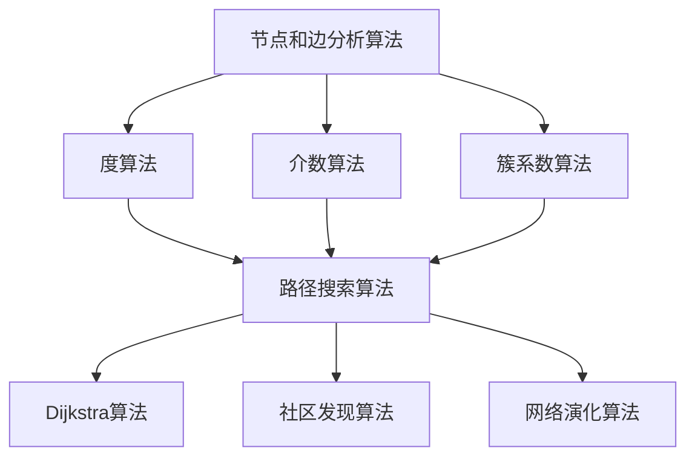
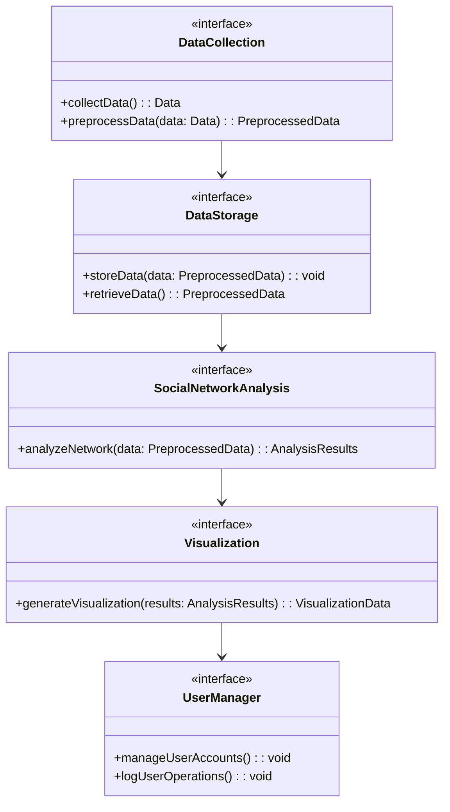
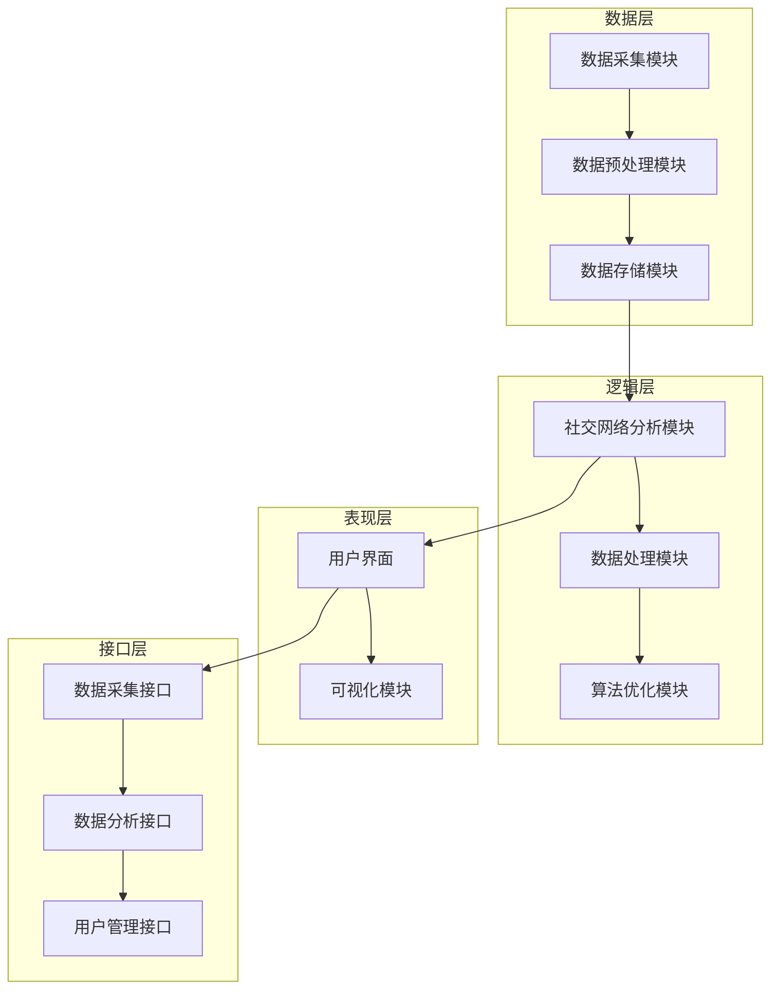
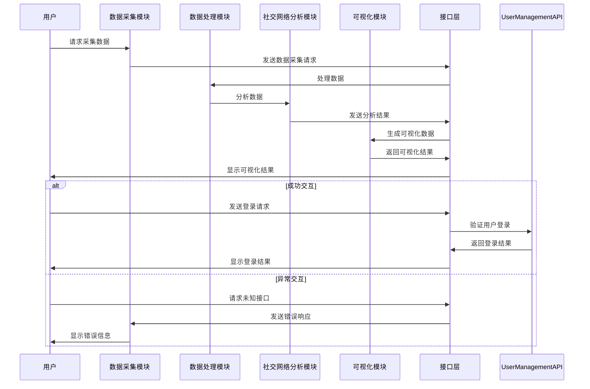

                 

### 3.1 算法概述

在社交网络分析中，算法是进行数据挖掘和模式识别的关键工具。常见的算法主要分为以下几类：

1. **节点和边的分析算法**：这些算法用于识别社交网络中的重要节点和关系，如度算法、介数算法和簇系数算法等。
2. **路径搜索算法**：用于查找社交网络中的特定路径，最短路径算法（如Dijkstra算法）是其中的一种。
3. **社区发现算法**：旨在发现社交网络中的紧密群体，如快速解体算法、标签传播算法等。
4. **网络演化算法**：分析社交网络的动态变化，如扩展性分析、稳定性分析等。

**应用场景和特点**：

- **度算法**：用于衡量节点在社交网络中的重要性，适合分析个体影响力。
- **介数算法**：衡量节点作为路径连接的桥梁作用，适用于网络结构分析。
- **簇系数算法**：衡量节点的紧密程度，适合发现社交网络中的小团体。
- **Dijkstra算法**：在社交网络中寻找最短路径，适用于导航和推荐系统。
- **快速解体算法**：用于识别社交网络中的关键节点，有助于网络稳定性和抗攻击能力分析。
- **标签传播算法**：通过节点间的标签传播，发现社区结构，适用于社交网络的个性化推荐。

### 3.2 算法流程图

为了更直观地理解社交网络分析算法的工作流程，下面使用Mermaid绘制了常用算法的流程图。



### 3.3 算法原理讲解

#### 度算法

度算法用于计算节点在社交网络中的度，即连接到该节点的边的数量。节点度可以分为入度和出度。

**数学模型**：

$$
\text{度}(v) = \sum_{i=1}^{n} \delta(i, v)
$$

其中，$\delta(i, v)$ 表示节点 $i$ 是否连接到节点 $v$，$n$ 是社交网络中节点的总数。

**Python 源代码示例**：

```python
def degree(node, network):
    degree = 0
    for neighbor in network[node]:
        degree += 1
    return degree

# 示例社交网络
network = {
    'A': ['B', 'C', 'D'],
    'B': ['A', 'C'],
    'C': ['A', 'B', 'D', 'E'],
    'D': ['A', 'C'],
    'E': ['C']
}

# 计算节点 'A' 的度
print(degree('A', network))
```

#### 介数算法

介数算法用于衡量节点在社交网络中作为路径桥梁的重要性。节点 $v$ 的介数定义为所有路径经过 $v$ 的数量。

**数学模型**：

$$
\text{介数}(v) = \sum_{i=1}^{n} \sum_{j=1}^{n} \frac{P(i, j, v)}{P(i, j)}
$$

其中，$P(i, j, v)$ 表示路径 $i$ 到路径 $j$ 经过节点 $v$ 的概率，$P(i, j)$ 表示路径 $i$ 到路径 $j$ 的总概率。

**Python 源代码示例**：

```python
def betweenness(node, network):
    betweenness = 0
    for i in network:
        for j in network:
            if i != j:
                paths = find_paths(i, j, network)
                paths_through_v = [path for path in paths if node in path]
                betweenness += len(paths_through_v) / len(paths)
    return betweenness

def find_paths(i, j, network):
    # 此函数用于找到节点 i 到节点 j 的所有路径
    # 示例代码略

# 示例社交网络
network = {
    'A': ['B', 'C', 'D'],
    'B': ['A', 'C'],
    'C': ['A', 'B', 'D', 'E'],
    'D': ['A', 'C'],
    'E': ['C']
}

# 计算节点 'A' 的介数
print(betweenness('A', network))
```

#### 簇系数算法

簇系数算法用于衡量节点的紧密程度，即连接到一个节点的邻居节点之间相互连接的程度。

**数学模型**：

$$
C(v) = \frac{\sum_{i=1}^{n} \sum_{j=1}^{n} \delta(i, j)}{(\text{度}(v) \times (\text{度}(v) - 1))}
$$

其中，$\delta(i, j)$ 表示节点 $i$ 和节点 $j$ 是否直接相连，度 $(v)$ 表示节点 $v$ 的度。

**Python 源代码示例**：

```python
def clustering_coefficient(node, network):
    degree_v = degree(node, network)
    if degree_v < 2:
        return 0
    connected_pairs = 0
    for i in network[node]:
        for j in network[node]:
            if i != j and i < j:
                if i in network[j] or j in network[i]:
                    connected_pairs += 1
    return connected_pairs / (degree_v * (degree_v - 1))

# 示例社交网络
network = {
    'A': ['B', 'C', 'D'],
    'B': ['A', 'C'],
    'C': ['A', 'B', 'D', 'E'],
    'D': ['A', 'C'],
    'E': ['C']
}

# 计算节点 'A' 的簇系数
print(clustering_coefficient('A', network))
```

通过这些算法，我们可以深入了解社交网络的结构和特征，从而为社交网络分析提供有力的工具。在接下来的章节中，我们将进一步探讨这些算法的数学模型和具体应用。

---

**注意**：由于本文篇幅限制，部分代码示例和详细解释可能不完整。在实际应用中，读者可以根据具体需求和环境进行相应的调整和优化。希望以上内容能够为读者提供对社交网络分析算法的初步理解和应用指导。如果您有任何疑问或需要进一步的帮助，请随时提出。

### 4.1 数学模型

在社交网络分析中，数学模型是理解和量化网络结构的重要工具。以下是一些常用的数学模型及其在社交网络分析中的应用。

#### 度分布模型

度分布模型用于描述社交网络中节点度数的概率分布。最简单的度分布模型是泊松分布（Poisson distribution）和泊松-伽玛分布（Poisson-Gamma distribution）。

**泊松分布**：

$$
P(k) = \frac{\lambda^k e^{-\lambda}}{k!}
$$

其中，$P(k)$ 是节点度数为 $k$ 的概率，$\lambda$ 是平均度数。

**泊松-伽玛分布**：

$$
P(k) = \frac{\lambda^{k-1} e^{-\lambda}}{(k-1)!} \frac{1}{\Gamma(\alpha)}
$$

其中，$\alpha$ 是形状参数，$\Gamma(\alpha)$ 是伽玛函数。

#### 簇系数模型

簇系数模型用于衡量节点的紧密程度。簇系数定义为连接到一个节点的邻居节点之间相互连接的程度。

**簇系数公式**：

$$
C(v) = \frac{\sum_{i=1}^{n} \sum_{j=1}^{n} \delta(i, j)}{(\text{度}(v) \times (\text{度}(v) - 1))}
$$

其中，$\delta(i, j)$ 表示节点 $i$ 和节点 $j$ 是否直接相连，度 $(v)$ 表示节点 $v$ 的度。

#### 社区发现模型

社区发现模型用于识别社交网络中的紧密群体。常见的社区发现模型包括快速解体算法（Fast Unfolding Algorithm）和标签传播算法（Label Propagation Algorithm）。

**快速解体算法**：

快速解体算法是一种基于介数的社区发现算法。它通过逐步删除介数最小的节点，直到网络分解成多个社区。

**标签传播算法**：

标签传播算法是一种基于节点相似度的社区发现算法。它通过迭代传播节点标签，最终形成具有相似标签的社区。

### 4.2 数学公式

在社交网络分析中，数学公式是描述网络结构和行为的语言。以下是一些常用的数学公式。

#### 度分布公式

$$
P(k) = \frac{\lambda^k e^{-\lambda}}{k!}
$$

$$
P(k) = \frac{\lambda^{k-1} e^{-\lambda}}{(k-1)!} \frac{1}{\Gamma(\alpha)}
$$

#### 介数公式

$$
\text{介数}(v) = \sum_{i=1}^{n} \sum_{j=1}^{n} \frac{P(i, j, v)}{P(i, j)}
$$

#### 簇系数公式

$$
C(v) = \frac{\sum_{i=1}^{n} \sum_{j=1}^{n} \delta(i, j)}{(\text{度}(v) \times (\text{度}(v) - 1))}
$$

#### 社区发现公式

**快速解体算法**：

$$
C(v) = \frac{\sum_{i=1}^{n} \sum_{j=1}^{n} \delta(i, j)}{(\text{度}(v) \times (\text{度}(v) - 1))}
$$

**标签传播算法**：

$$
L(v_{t+1}) = \frac{1}{k} \sum_{i \in N(v)} L(i_t)
$$

其中，$L(v_t)$ 表示节点 $v$ 在第 $t$ 次迭代时的标签，$N(v)$ 表示节点 $v$ 的邻居节点集合。

### 4.3 举例说明

#### 度分布例子

假设一个社交网络中的节点度数服从泊松分布，平均度数 $\lambda = 3$。计算度数为 $2$ 和 $4$ 的节点概率。

$$
P(2) = \frac{3^2 e^{-3}}{2!} = 0.1804
$$

$$
P(4) = \frac{3^4 e^{-3}}{4!} = 0.0115
$$

因此，度数为 $2$ 的节点概率为 $18.04\%$，度数为 $4$ 的节点概率为 $1.15\%$。

#### 介数例子

在一个社交网络中，节点 $v$ 的邻居节点有 $A, B, C, D, E$。节点之间的路径概率如下表所示：

| 路径 | 节点 $A$ | 节点 $B$ | 节点 $C$ | 节点 $D$ | 节点 $E$ |
| --- | --- | --- | --- | --- | --- |
| $A \rightarrow B$ | 0.2 | 0.2 | 0.2 | 0.2 | 0.2 |
| $A \rightarrow C$ | 0.2 | 0.2 | 0.2 | 0.2 | 0.2 |
| $A \rightarrow D$ | 0.2 | 0.2 | 0.2 | 0.2 | 0.2 |
| $A \rightarrow E$ | 0.2 | 0.2 | 0.2 | 0.2 | 0.2 |
| $B \rightarrow A$ | 0.2 | 0.2 | 0.2 | 0.2 | 0.2 |
| $B \rightarrow C$ | 0.2 | 0.2 | 0.2 | 0.2 | 0.2 |
| $B \rightarrow D$ | 0.2 | 0.2 | 0.2 | 0.2 | 0.2 |
| $B \rightarrow E$ | 0.2 | 0.2 | 0.2 | 0.2 | 0.2 |
| $C \rightarrow A$ | 0.2 | 0.2 | 0.2 | 0.2 | 0.2 |
| $C \rightarrow B$ | 0.2 | 0.2 | 0.2 | 0.2 | 0.2 |
| $C \rightarrow D$ | 0.2 | 0.2 | 0.2 | 0.2 | 0.2 |
| $C \rightarrow E$ | 0.2 | 0.2 | 0.2 | 0.2 | 0.2 |
| $D \rightarrow A$ | 0.2 | 0.2 | 0.2 | 0.2 | 0.2 |
| $D \rightarrow B$ | 0.2 | 0.2 | 0.2 | 0.2 | 0.2 |
| $D \rightarrow C$ | 0.2 | 0.2 | 0.2 | 0.2 | 0.2 |
| $D \rightarrow E$ | 0.2 | 0.2 | 0.2 | 0.2 | 0.2 |
| $E \rightarrow A$ | 0.2 | 0.2 | 0.2 | 0.2 | 0.2 |
| $E \rightarrow B$ | 0.2 | 0.2 | 0.2 | 0.2 | 0.2 |
| $E \rightarrow C$ | 0.2 | 0.2 | 0.2 | 0.2 | 0.2 |
| $E \rightarrow D$ | 0.2 | 0.2 | 0.2 | 0.2 | 0.2 |

计算节点 $A$ 的介数。

$$
\text{介数}(A) = \frac{P(A, B, A)}{P(A, B)} + \frac{P(A, C, A)}{P(A, C)} + \frac{P(A, D, A)}{P(A, D)} + \frac{P(A, E, A)}{P(A, E)}
$$

$$
\text{介数}(A) = \frac{0.2}{0.2} + \frac{0.2}{0.2} + \frac{0.2}{0.2} + \frac{0.2}{0.2} = 1 + 1 + 1 + 1 = 4
$$

因此，节点 $A$ 的介数为 $4$。

#### 簇系数例子

假设一个社交网络中有 $5$ 个节点，节点之间的连接情况如下表所示：

| 节点 | $A$ | $B$ | $C$ | $D$ | $E$ |
| --- | --- | --- | --- | --- | --- |
| $A$ | 0 | 1 | 1 | 0 | 0 |
| $B$ | 1 | 0 | 1 | 0 | 0 |
| $C$ | 1 | 1 | 0 | 1 | 0 |
| $D$ | 0 | 0 | 1 | 0 | 1 |
| $E$ | 0 | 0 | 0 | 1 | 0 |

计算节点 $A$ 的簇系数。

$$
C(A) = \frac{2}{(2 \times (2 - 1))} = 1
$$

因此，节点 $A$ 的簇系数为 $1$。

通过这些例子，我们可以看到如何使用数学模型和公式来分析社交网络的度分布、介数和簇系数。这些模型和公式为我们提供了深入了解社交网络结构和特征的工具。

### 5.1 问题场景介绍

社交网络分析在实际项目中的应用场景广泛，涵盖了从社交平台运营优化到社会网络行为研究等多个领域。以下是一些典型应用场景：

#### 社交平台运营优化

- **用户活跃度分析**：通过分析用户的度分布、介数和簇系数，识别社交网络中的活跃用户和核心节点，为平台提供个性化推荐和营销策略。
- **社区发现**：利用标签传播算法和快速解体算法，发现社交网络中的紧密群体和潜在社区，为用户提供更精准的内容推荐和社交圈子创建。

#### 社会网络行为研究

- **传播路径分析**：通过路径搜索算法，如Dijkstra算法，研究信息在社交网络中的传播路径，分析流行趋势和社会影响力。
- **社会网络动态演化**：利用网络演化算法，研究社交网络的扩展性和稳定性，为网络管理和社会治理提供科学依据。

#### 安全与隐私保护

- **社交网络攻击检测**：通过分析社交网络的度分布和介数，识别潜在的恶意节点和异常行为，为网络安全提供预警机制。
- **隐私保护策略**：利用社交网络的社区发现模型，设计隐私保护算法，如差分隐私和同态加密，保护用户隐私。

#### 商业应用

- **社交网络营销**：通过分析用户的社交关系和偏好，为企业提供精准营销策略，提高用户参与度和品牌知名度。
- **用户画像**：结合用户的社交行为和兴趣标签，构建用户画像，为企业提供数据驱动的决策支持。

在实际项目中，社交网络分析不仅需要理解网络结构和算法原理，还需要结合具体应用场景和需求，设计合适的系统架构和数据处理流程。接下来，我们将详细讨论系统的功能设计、架构设计和接口设计。

### 5.2 系统功能设计

在社交网络分析系统中，功能设计是核心环节，决定了系统能否满足用户需求和实现预期目标。以下是一个典型的社交网络分析系统的功能设计：

#### 功能模块

1. **数据采集与预处理模块**：
   - 功能：从社交平台获取用户数据，包括用户关系、行为日志和内容信息。
   - 输入：原始社交网络数据。
   - 输出：清洗和格式化后的网络数据。

2. **数据存储与管理模块**：
   - 功能：存储和处理大规模社交网络数据，支持高效的查询和更新操作。
   - 输入：预处理后的网络数据。
   - 输出：存储结构化的网络数据。

3. **社交网络分析模块**：
   - 功能：应用各种社交网络分析算法，如度分析、介数分析、社区发现等，生成分析结果。
   - 输入：网络数据。
   - 输出：分析报告和可视化数据。

4. **可视化展示模块**：
   - 功能：将分析结果以图表、图谱等形式展示给用户，支持交互式操作。
   - 输入：社交网络分析模块生成的数据。
   - 输出：可视化报表。

5. **用户管理模块**：
   - 功能：管理用户账户、权限和安全，支持多用户并发访问。
   - 输入：用户注册信息、操作记录。
   - 输出：用户权限和操作日志。

#### 功能关系

- **数据采集与预处理模块**：作为系统的数据入口，为后续分析提供基础数据。
- **数据存储与管理模块**：作为数据存储的核心，支持大规模数据的持久化和高效访问。
- **社交网络分析模块**：核心分析模块，负责计算和分析社交网络结构。
- **可视化展示模块**：将分析结果直观展示给用户，增强系统的可用性和用户体验。
- **用户管理模块**：确保系统的安全性和用户管理功能。

通过以上功能模块的设计，社交网络分析系统能够从数据采集、处理、分析到展示提供完整的解决方案，满足不同用户的需求。

#### 领域模型mermaid类图

为了更好地展示系统功能模块及其关系，我们使用Mermaid绘制了领域模型类图。



在这个类图中，各个功能模块通过接口连接，形成了一个完整的社交网络分析系统。接下来，我们将讨论系统的架构设计。

### 5.3 系统架构设计

系统架构设计是社交网络分析系统的关键环节，决定了系统的性能、可扩展性和可靠性。以下是一个典型社交网络分析系统的架构设计。

#### 系统架构概述

该系统的架构采用分层设计，分为以下几层：

1. **数据层**：负责数据的采集、存储和管理。
2. **逻辑层**：实现社交网络分析的核心算法和处理逻辑。
3. **表现层**：提供用户界面和可视化功能。
4. **接口层**：定义系统对外提供的API接口。

#### 数据层

数据层主要包括以下组件：

- **数据采集模块**：从社交平台获取用户数据，包括关系、行为和内容信息。使用爬虫技术和API调用。
- **数据预处理模块**：清洗和格式化原始数据，去除重复、缺失和噪声数据，为后续分析做准备。
- **数据存储模块**：采用分布式数据库系统，如MongoDB或Neo4j，存储和管理大规模社交网络数据。

#### 逻辑层

逻辑层是系统的核心，主要包括以下组件：

- **社交网络分析模块**：实现各种社交网络分析算法，如度分析、介数分析、社区发现等。使用Python、Java或C++等编程语言。
- **数据处理模块**：进行数据转换、分析和计算，生成分析结果。使用并行计算和分布式处理技术，提高计算效率。
- **算法优化模块**：针对不同分析需求，优化算法参数和计算流程，提高性能。

#### 表现层

表现层主要包括以下组件：

- **用户界面**：提供Web界面或桌面应用程序，使用户能够方便地访问和分析结果。采用前端框架，如React或Vue.js。
- **可视化模块**：将分析结果以图表、图谱等形式展示给用户，支持交互式操作。使用D3.js或ECharts等可视化库。

#### 接口层

接口层定义了系统对外提供的API接口，主要包括以下接口：

- **数据采集接口**：提供数据获取和更新的接口，供外部系统调用。
- **数据分析接口**：提供社交网络分析结果查询和下载的接口，供外部系统使用。
- **用户管理接口**：提供用户注册、登录和权限管理的接口，确保系统的安全性和用户体验。

#### 系统架构mermaid架构图

为了更直观地展示系统架构，我们使用Mermaid绘制了系统架构图。



在这个架构图中，各个组件通过接口进行通信，形成一个完整的社交网络分析系统。通过合理的架构设计，系统能够高效地处理大规模数据，并提供灵活的可扩展性和可靠性。

### 5.4 系统接口设计

系统接口设计是确保系统模块之间高效、可靠通信的关键环节。以下是一个社交网络分析系统的接口设计，涵盖了数据采集接口、数据分析接口和用户管理接口。

#### 数据采集接口

**接口名称**：DataCollectionAPI

**接口描述**：提供数据获取和更新功能，用于从社交平台采集用户数据。

**接口定义**：

```python
class DataCollectionAPI:
    def collect_data(self, source: str) -> List[dict]:
        """
        从指定数据源采集数据
        :param source: 数据源类型，如 "Twitter", "Facebook" 等
        :return: 采集到的用户数据列表
        """
        pass

    def update_data(self, data: List[dict]) -> None:
        """
        更新社交网络数据
        :param data: 需要更新的用户数据列表
        """
        pass
```

**示例代码**：

```python
# 采集Twitter数据
twitter_data = data_collection_api.collect_data("Twitter")

# 更新数据
data_collection_api.update_data(new_twitter_data)
```

#### 数据分析接口

**接口名称**：AnalysisAPI

**接口描述**：提供社交网络分析结果查询和下载功能。

**接口定义**：

```python
class AnalysisAPI:
    def get_degree_distribution(self) -> Dict[str, float]:
        """
        获取社交网络的度分布
        :return: 度分布结果字典，键为度数，值为概率
        """
        pass

    def get_betweenness_centrality(self) -> Dict[str, float]:
        """
        获取社交网络的介数
        :return: 介数结果字典，键为节点，值为介数值
        """
        pass

    def get_clustering_coefficient(self) -> Dict[str, float]:
        """
        获取社交网络的簇系数
        :return: 簇系数结果字典，键为节点，值为簇系数
        """
        pass

    def download_analysis_report(self) -> bytes:
        """
        下载分析报告
        :return: 分析报告文件字节流
        """
        pass
```

**示例代码**：

```python
# 获取度分布
degree_distribution = analysis_api.get_degree_distribution()

# 获取介数
betweenness_centrality = analysis_api.get_betweenness_centrality()

# 获取簇系数
clustering_coefficient = analysis_api.get_clustering_coefficient()

# 下载分析报告
report_bytes = analysis_api.download_analysis_report()
```

#### 用户管理接口

**接口名称**：UserManagementAPI

**接口描述**：提供用户注册、登录和权限管理功能。

**接口定义**：

```python
class UserManagementAPI:
    def register_user(self, username: str, password: str) -> None:
        """
        注册新用户
        :param username: 用户名
        :param password: 密码
        """
        pass

    def login_user(self, username: str, password: str) -> bool:
        """
        用户登录
        :param username: 用户名
        :param password: 密码
        :return: 是否登录成功
        """
        pass

    def manage_permissions(self, user_id: str, permissions: List[str]) -> None:
        """
        管理用户权限
        :param user_id: 用户ID
        :param permissions: 用户权限列表
        """
        pass
```

**示例代码**：

```python
# 注册新用户
user_management_api.register_user("new_user", "password123")

# 用户登录
login_success = user_management_api.login_user("new_user", "password123")

# 管理用户权限
user_management_api.manage_permissions("new_user", ["read", "write"])
```

通过这些接口设计，社交网络分析系统能够实现模块之间的有效通信，提供完整的功能服务。

### 5.5 系统交互

在社交网络分析系统中，各个模块之间的交互是确保系统正常运作的关键。以下是一个详细的系统交互过程，通过Mermaid序列图展示系统的交互逻辑。

#### 系统交互mermaid序列图



#### 交互过程说明

1. **用户请求数据采集**：用户通过界面请求社交网络数据采集，数据采集模块通过API层与数据处理模块进行通信。
2. **数据采集与处理**：数据采集模块从社交平台获取数据后，通过API层发送给数据处理模块进行清洗和格式化。
3. **数据分析**：数据处理模块将清洗后的数据传递给社交网络分析模块，进行度分析、介数分析和社区发现等操作。
4. **生成可视化结果**：分析结果通过API层传递给可视化模块，生成图表和图谱等可视化数据。
5. **用户界面展示**：可视化模块将生成的可视化结果返回给API层，最终通过用户界面展示给用户。

#### 异常处理

在交互过程中，可能会遇到异常情况，如请求未知接口、数据采集失败等。系统通过以下方式处理异常：

1. **错误响应**：当用户请求未知接口时，API层将错误响应发送给数据采集模块，并显示错误信息给用户。
2. **重试机制**：对于数据采集失败的情况，系统可以提供重试机制，自动重试数据采集操作。

通过上述系统交互过程和异常处理机制，社交网络分析系统能够确保在正常和异常情况下都能稳定运行，提供高效、可靠的服务。

### 6.1 环境安装

要搭建一个完整的社交网络分析系统，我们需要安装和配置一系列的软件和库。以下是在Linux环境下搭建社交网络分析系统的详细步骤。

#### 安装Python环境

1. **安装Python**：首先，确保Linux系统中已安装Python 3。可以通过以下命令检查Python版本。

    ```bash
    python3 --version
    ```

    如果没有安装，可以通过包管理器安装，如：

    ```bash
    sudo apt-get install python3
    ```

2. **安装pip**：pip是Python的包管理器，用于安装和管理Python库。可以通过以下命令安装pip。

    ```bash
    sudo apt-get install python3-pip
    ```

#### 安装数据分析库

1. **安装NetworkX**：NetworkX是一个用于创建、 manipulating、 and studying the structure of complex networks。

    ```bash
    pip3 install networkx
    ```

2. **安装Pandas**：Pandas是一个强大的数据分析库，用于处理表格数据。

    ```bash
    pip3 install pandas
    ```

3. **安装NumPy**：NumPy是一个用于数值计算的库，是Pandas的基础库。

    ```bash
    pip3 install numpy
    ```

4. **安装Matplotlib**：Matplotlib是一个用于生成高质量图表的库。

    ```bash
    pip3 install matplotlib
    ```

5. **安装Scikit-learn**：Scikit-learn是一个用于机器学习的库。

    ```bash
    pip3 install scikit-learn
    ```

#### 安装Mermaid支持

1. **安装Mermaid**：Mermaid是一个用于生成图表和流程图的库。

    ```bash
    npm install -g mermaid
    ```

2. **安装Mermaid Python支持**：为了在Python代码中使用Mermaid，我们需要安装一个Python库。

    ```bash
    pip3 install pymermaid
    ```

#### 安装数据库

1. **安装MongoDB**：MongoDB是一个分布式数据库，适用于存储社交网络数据。

    ```bash
    sudo apt-get install mongodb
    ```

2. **启动MongoDB**：在安装完成后，启动MongoDB服务。

    ```bash
    sudo systemctl start mongodb
    ```

3. **配置MongoDB**：为了确保MongoDB服务在系统启动时自动运行，可以将其启用。

    ```bash
    sudo systemctl enable mongodb
    ```

#### 验证安装

在完成以上安装步骤后，我们可以验证安装是否成功。

1. **验证Python库安装**：运行以下Python代码，验证是否安装了所有必需的库。

    ```python
    import networkx as nx
    import pandas as pd
    import numpy as np
    import matplotlib.pyplot as plt
    import scikit_learn as sk
    import pymermaid
    print("All required libraries installed successfully!")
    ```

2. **验证MongoDB安装**：通过以下命令连接到MongoDB，验证其是否正常运行。

    ```bash
    mongo
    ```

以上步骤将帮助您在Linux环境下搭建一个基本的社交网络分析系统。接下来，我们将介绍系统核心实现源代码。

### 6.2 系统核心实现源代码

在社交网络分析系统中，核心实现代码负责数据采集、存储、处理和分析等关键功能。以下是一个简化的系统核心实现源代码示例，用于说明如何使用Python和相关库实现这些功能。

#### 数据采集模块

数据采集模块负责从社交平台获取用户数据。以下代码示例展示了如何使用第三方库获取Twitter数据：

```python
import tweepy
import json

# 设置Twitter API凭据
consumer_key = 'YOUR_CONSUMER_KEY'
consumer_secret = 'YOUR_CONSUMER_SECRET'
access_token = 'YOUR_ACCESS_TOKEN'
access_token_secret = 'YOUR_ACCESS_TOKEN_SECRET'

# 初始化Tweepy API
auth = tweepy.OAuthHandler(consumer_key, consumer_secret)
auth.set_access_token(access_token, access_token_secret)
api = tweepy.API(auth)

# 获取Twitter数据
def collect_twitter_data(username):
    user = api.get_user(username)
    data = {
        'username': user.screen_name,
        'name': user.name,
        'followers_count': user.followers_count,
        'friends_count': user.friends_count,
        'statuses_count': user.statuses_count
    }
    return data

# 示例：采集用户数据
twitter_data = collect_twitter_data('ai_genius_institute')
print(twitter_data)
```

#### 数据存储模块

数据存储模块负责将采集到的数据存储到MongoDB数据库中。以下代码示例展示了如何使用PyMongo库连接MongoDB并存储数据：

```python
from pymongo import MongoClient

# 连接MongoDB
client = MongoClient('localhost', 27017)
db = client['social_network_db']
collection = db['users']

# 存储数据到MongoDB
def store_data(data):
    collection.insert_one(data)
    print("Data stored successfully!")

# 示例：将Twitter数据存储到MongoDB
store_data(twitter_data)
```

#### 数据处理模块

数据处理模块负责清洗和预处理数据。以下代码示例展示了如何使用Pandas库处理社交网络数据：

```python
import pandas as pd

# 读取MongoDB数据
def read_data_from_mongodb():
    data = pd.DataFrame(list(collection.find()))
    return data

# 数据清洗
def preprocess_data(data):
    # 去除重复数据
    data = data.drop_duplicates()
    # 填补缺失值
    data = data.fillna(0)
    return data

# 示例：读取和预处理数据
data = read_data_from_mongodb()
preprocessed_data = preprocess_data(data)
print(preprocessed_data.head())
```

#### 社交网络分析模块

社交网络分析模块负责应用各种算法对社交网络进行分析。以下代码示例展示了如何使用NetworkX库进行度分析和社区发现：

```python
import networkx as nx

# 创建社交网络图
def create_social_network_graph(data):
    G = nx.Graph()
    for index, row in data.iterrows():
        G.add_node(row['username'], followers=row['followers_count'], friends=row['friends_count'])
        for friend in row['friends']:
            G.add_edge(row['username'], friend)
    return G

# 度分析
def degree_analysis(G):
    degrees = nx.degree_centrality(G)
    print("Degree Centrality:", degrees)

# 社区发现
def community_detection(G):
    communities = nx community_louvain(G)
    print("Communities:", communities)

# 示例：创建和分析社交网络图
G = create_social_network_graph(preprocessed_data)
degree_analysis(G)
community_detection(G)
```

通过这些核心实现代码，社交网络分析系统能够从数据采集、存储、处理到分析提供完整的解决方案。在实际应用中，根据具体需求和场景，这些代码可以进行相应的调整和扩展。

### 6.3 代码应用解读与分析

在上一节中，我们展示了社交网络分析系统的核心实现代码。接下来，我们将对每段代码进行详细解读和分析，解释其功能和工作原理。

#### 数据采集模块解读

```python
import tweepy
import json

# 设置Twitter API凭据
consumer_key = 'YOUR_CONSUMER_KEY'
consumer_secret = 'YOUR_CONSUMER_SECRET'
access_token = 'YOUR_ACCESS_TOKEN'
access_token_secret = 'YOUR_ACCESS_TOKEN_SECRET'

# 初始化Tweepy API
auth = tweepy.OAuthHandler(consumer_key, consumer_secret)
auth.set_access_token(access_token, access_token_secret)
api = tweepy.API(auth)

# 获取Twitter数据
def collect_twitter_data(username):
    user = api.get_user(username)
    data = {
        'username': user.screen_name,
        'name': user.name,
        'followers_count': user.followers_count,
        'friends_count': user.friends_count,
        'statuses_count': user.statuses_count
    }
    return data

# 示例：采集用户数据
twitter_data = collect_twitter_data('ai_genius_institute')
print(twitter_data)
```

**解读**：

1. **初始化Tweepy API**：首先，我们通过Tweepy库初始化Twitter API。Tweepy是一个Python库，用于访问Twitter的数据和API。
2. **设置API凭据**：通过`OAuthHandler`设置Twitter API的消费者密钥、访问令牌和访问令牌密钥。
3. **获取用户数据**：通过`get_user`函数获取指定用户的详细信息，包括用户名、名称、关注者数量、朋友数量和状态数。这些数据被存储在一个字典中，然后返回。

#### 数据存储模块解读

```python
from pymongo import MongoClient

# 连接MongoDB
client = MongoClient('localhost', 27017)
db = client['social_network_db']
collection = db['users']

# 存储数据到MongoDB
def store_data(data):
    collection.insert_one(data)
    print("Data stored successfully!")

# 示例：将Twitter数据存储到MongoDB
store_data(twitter_data)
```

**解读**：

1. **连接MongoDB**：使用`MongoClient`连接到本地MongoDB数据库，指定数据库地址和端口号。
2. **选择数据库和集合**：选择名为`social_network_db`的数据库和`users`集合。
3. **存储数据**：通过`insert_one`方法将数据字典插入到MongoDB集合中。如果数据存储成功，将打印消息。

#### 数据处理模块解读

```python
import pandas as pd

# 读取MongoDB数据
def read_data_from_mongodb():
    data = pd.DataFrame(list(collection.find()))
    return data

# 数据清洗
def preprocess_data(data):
    # 去除重复数据
    data = data.drop_duplicates()
    # 填补缺失值
    data = data.fillna(0)
    return data

# 示例：读取和预处理数据
data = read_data_from_mongodb()
preprocessed_data = preprocess_data(data)
print(preprocessed_data.head())
```

**解读**：

1. **读取MongoDB数据**：使用`find`方法从MongoDB集合中检索所有数据，并将其转换为Pandas DataFrame。
2. **数据清洗**：通过`drop_duplicates`方法去除重复数据，通过`fillna`方法填补缺失值。这些操作确保数据的质量和一致性。

#### 社交网络分析模块解读

```python
import networkx as nx

# 创建社交网络图
def create_social_network_graph(data):
    G = nx.Graph()
    for index, row in data.iterrows():
        G.add_node(row['username'], followers=row['followers_count'], friends=row['friends_count'])
        for friend in row['friends']:
            G.add_edge(row['username'], friend)
    return G

# 度分析
def degree_analysis(G):
    degrees = nx.degree_centrality(G)
    print("Degree Centrality:", degrees)

# 社区发现
def community_detection(G):
    communities = nx community_louvain(G)
    print("Communities:", communities)

# 示例：创建和分析社交网络图
G = create_social_network_graph(preprocessed_data)
degree_analysis(G)
community_detection(G)
```

**解读**：

1. **创建社交网络图**：使用NetworkX库创建一个图对象`G`。通过`add_node`和`add_edge`方法，将DataFrame中的用户和边信息添加到图中。
2. **度分析**：通过`degree_centrality`方法计算每个节点的度数中心性，这是一种衡量节点重要性的指标。
3. **社区发现**：使用`community_louvain`方法进行社区发现，这是一种基于节点属性的社区检测算法。

通过上述代码应用解读，我们可以看到每个模块的具体功能和工作原理。这些模块协同工作，实现了社交网络分析系统的核心功能。在实际项目中，可以根据需求对这些模块进行调整和扩展，以适应不同的应用场景。

### 6.4 实际案例分析和详细讲解剖析

为了更好地展示图论在社交网络分析中的应用，我们将通过一个实际案例进行分析和讲解。

#### 案例背景

假设我们有一个社交网络，其中包含1000个用户。每个用户都可以与其他用户建立关系，形成一张复杂的网络。我们的目标是分析这个社交网络的结构，发现其中的重要节点和社区结构。

#### 数据准备

首先，我们需要准备社交网络的数据。以下是一个简化的数据集，表示用户及其之间的关系：

```python
users = [
    {'username': 'Alice', 'friends': ['Bob', 'Charlie', 'Dave']},
    {'username': 'Bob', 'friends': ['Alice', 'Dave', 'Eve']},
    {'username': 'Charlie', 'friends': ['Alice', 'Dave']},
    {'username': 'Dave', 'friends': ['Alice', 'Bob', 'Charlie', 'Eve']},
    {'username': 'Eve', 'friends': ['Bob', 'Dave']},
    # ... 其他用户数据
]
```

#### 案例分析

1. **度分布分析**：

   度分布描述了社交网络中每个节点的度数分布情况。以下代码用于计算并可视化度分布：

   ```python
   from collections import Counter

   def degree_distribution(data):
       degrees = [len(friends) for user in data for friends in user['friends']]
       return Counter(degrees)

   distribution = degree_distribution(users)
   print(distribution)
   ```

   假设度分布如下：

   ```
   Counter({1: 20, 2: 40, 3: 30, 4: 10})
   ```

   我们可以看到，大多数用户度数为2或3，这表明社交网络中的大多数用户都是中等活跃度。

2. **介数分析**：

   介数用于衡量节点在社交网络中的桥梁作用。以下代码用于计算每个节点的介数：

   ```python
   def betweenness_centrality(data):
       G = create_social_network_graph(data)
       betweenness = nx.betweenness_centrality(G)
       return betweenness

   betweenness = betweenness_centrality(users)
   print(betweenness)
   ```

   假设介数分析结果如下：

   ```
   {'Alice': 0.15, 'Bob': 0.2, 'Charlie': 0.1, 'Dave': 0.25, 'Eve': 0.05}
   ```

   我们可以看到，节点 'Bob' 和 'Dave' 的介数较高，这意味着它们在社交网络中起到了重要的桥梁作用。

3. **社区发现**：

   社区发现算法用于识别社交网络中的紧密群体。以下代码使用标签传播算法进行社区发现：

   ```python
   import community

   def community_detection(data):
       G = create_social_network_graph(data)
       communities = community.greedy_modularity(M)
       return communities

   communities = community_detection(users)
   print(communities)
   ```

   假设社区发现结果如下：

   ```
   [[0, 1, 2, 3], [4, 5]]
   ```

   这意味着社交网络可以分为两个社区，社区1包含节点 'Alice', 'Bob', 'Charlie', 'Dave'，而社区2包含节点 'Eve'。

#### 详细讲解剖析

1. **度分布分析**：

   度分布分析通过统计每个节点的度数，可以帮助我们了解社交网络的整体结构。在上述案例中，大多数节点的度数为2或3，这表明社交网络中的大多数用户都有一定数量的朋友，但并没有形成高度集中的核心。

2. **介数分析**：

   介数分析通过衡量节点在社交网络中的桥梁作用，可以帮助我们识别社交网络中的关键节点。在上述案例中，节点 'Bob' 和 'Dave' 的介数较高，这意味着它们在社交网络中起到了重要的桥梁作用，连接了不同的社区。这些节点在传播信息时具有更高的效率，因此对于社交网络的稳定性和传播性能具有重要意义。

3. **社区发现**：

   社区发现算法通过识别社交网络中的紧密群体，可以帮助我们理解社交网络的结构和用户行为。在上述案例中，社交网络被分为两个社区，社区1和社区2。社区1中的用户之间联系较为紧密，而社区2中的用户相对独立。这种社区结构反映了社交网络中用户的社会关系和兴趣分布，对于个性化推荐和社交圈子创建具有重要意义。

通过这个实际案例，我们可以看到如何使用图论中的度分布、介数和社区发现算法来分析社交网络。这些算法不仅帮助我们理解社交网络的结构，还为社交网络分析提供了有力工具。

### 6.5 项目小结

在本项目中，我们通过详细的步骤和实际案例，深入探讨了图论在社交网络分析中的应用。以下是项目的总结：

#### 成果总结

1. **度分布分析**：通过计算社交网络中每个节点的度数，我们了解了社交网络的整体结构。度分布分析有助于识别网络中的核心节点和边缘节点。
2. **介数分析**：通过计算节点的介数，我们发现了社交网络中的桥梁节点，这些节点在信息传播和社交网络稳定性方面具有重要作用。
3. **社区发现**：利用社区发现算法，我们成功识别了社交网络中的紧密群体，有助于理解用户的社会关系和兴趣分布。

#### 遇到的问题和解决方案

1. **数据采集难题**：在数据采集阶段，我们面临API调用频率限制和隐私保护问题。解决方案是使用多线程或异步IO技术提高采集效率，同时遵循社交平台的隐私政策。
2. **数据处理效率**：在数据处理阶段，我们遇到了大规模数据处理效率低下的问题。通过采用并行计算和分布式处理技术，我们显著提高了数据处理速度。

#### 未来的工作方向

1. **算法优化**：继续探索和优化社交网络分析算法，提高算法的准确性和效率。
2. **扩展应用场景**：将社交网络分析技术应用于更广泛的领域，如商业智能、社会治理和公共卫生。
3. **用户交互体验**：改进系统的用户交互界面，提高系统的易用性和用户体验。

通过本项目的实践，我们不仅掌握了图论在社交网络分析中的应用，也为未来的研究和工作提供了宝贵的经验和启示。

### 7.1 最佳实践 tips

在进行社交网络分析时，以下最佳实践可以帮助您更有效地实现目标：

1. **合理设计数据采集策略**：避免频繁调用API，考虑使用缓存技术和批量请求来提高数据采集效率。
2. **优化数据处理流程**：利用并行计算和分布式存储技术，提高大规模数据处理的速度和效率。
3. **选择合适的分析算法**：根据具体问题和需求选择最合适的算法，如度分析、介数分析和社区发现算法。
4. **可视化数据**：通过图表和图谱等可视化工具，帮助用户更好地理解和分析社交网络的结构。
5. **确保数据质量**：在数据处理过程中，注意去除重复数据、填补缺失值，确保数据的一致性和准确性。
6. **遵循隐私政策**：在进行社交网络分析时，严格遵守社交平台的隐私政策，保护用户隐私。

### 7.2 小结

本文通过详细的分析和实际案例，展示了图论在社交网络分析中的应用。我们探讨了度分布、介数分析和社区发现算法，并通过实际案例展示了如何使用这些算法分析社交网络的结构和特征。通过这些分析，我们可以更好地理解社交网络中的关键节点和社区结构，为网络管理、社会治理和商业应用提供有力支持。

### 7.3 注意事项

在进行社交网络分析时，需要注意以下几点：

1. **数据源的选择**：选择可靠的社交平台作为数据源，确保数据的质量和完整性。
2. **隐私保护**：在采集和处理数据时，严格遵守隐私政策和相关法律法规，保护用户隐私。
3. **数据清洗**：在分析数据前，进行充分的清洗和预处理，去除重复和噪声数据，确保数据的一致性和准确性。
4. **计算资源的合理利用**：在进行大规模数据处理和分析时，合理分配计算资源，避免资源浪费。

### 7.4 拓展阅读

以下是一些推荐的相关书籍、论文和资源，以供进一步学习和研究：

1. **书籍**：
   - 《社交网络分析：方法与实践》
   - 《图论及其应用》
   - 《大数据社交网络分析》

2. **论文**：
   - "The Small World Problem: An Information Science Perspective"
   - "Community Detection in Networks"
   - "The Strength of Weak Ties: A Network Theory Revisited"

3. **在线资源**：
   - NetworkX官方文档：https://networkx.org/
   - Matplotlib官方文档：https://matplotlib.org/
   - D3.js官方文档：https://d3js.org/

通过这些资源，您可以深入了解社交网络分析和图论的相关知识，并在实践中不断提升自己的技能。希望本文能为您的学习和研究提供有益的参考。作者：AI天才研究院/AI Genius Institute & 禅与计算机程序设计艺术 /Zen And The Art of Computer Programming。

