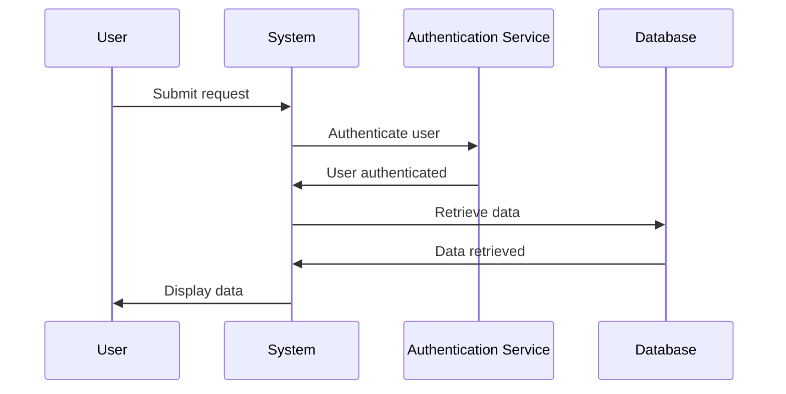
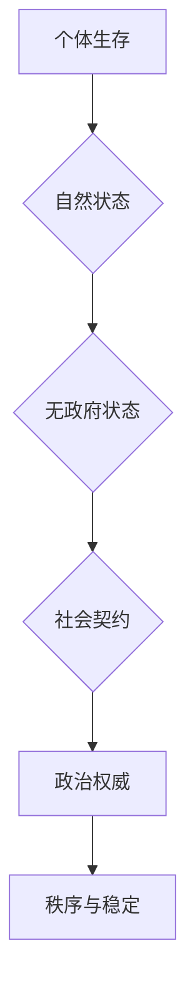

                 

# 《培根与霍布斯：英国经验主义的先驱》

## 关键词

- 英国经验主义
- 培根
- 霍布斯
- 科学方法论
- 政治哲学
- 历史影响

## 摘要

本文深入探讨英国经验主义两位先驱弗兰西斯·培根和托马斯·霍布斯的思想及其对后世的影响。通过回顾他们的生平、哲学观点和主要贡献，我们将对比分析他们的观点，探讨他们在历史上的地位以及对现代哲学和科学的深远影响。

### 目录大纲

----------------------------------------------------------------

## 第一部分：背景与概述

### 第1章：英国经验主义的历史背景

### 第2章：弗兰西斯·培根的生平与哲学

### 第3章：培根的科学方法论

### 第4章：培根的实证主义

### 第5章：培根的政治哲学

## 第二部分：霍布斯与培根的关联

### 第6章：托马斯·霍布斯与培根的关系

### 第7章：霍布斯的政治哲学与培根的传承

### 第8章：霍布斯的哲学观念与培根的影响

## 第三部分：比较与评价

### 第9章：培根与霍布斯思想比较

### 第10章：英国经验主义的发展

### 第11章：培根与霍布斯在历史上的地位

## 第四部分：现代影响

### 第12章：培根与霍布斯对现代哲学的影响

### 第13章：培根与霍布斯在当代的遗产

### 第14章：总结与展望

----------------------------------------------------------------

## 第1章：英国经验主义的历史背景

### 核心概念术语说明

- **经验主义**：一种哲学观点，主张知识来源于经验，强调感觉和观察的重要性。
- **英国经验主义**：18世纪英国哲学流派，强调实证观察和实验方法。
- **弗兰西斯·培根**：文艺复兴时期英国哲学家，经验主义的先驱。
- **托马斯·霍布斯**：17世纪英国哲学家，政治哲学和社会契约理论的奠基人。

### 问题背景

英国经验主义起源于对亚里士多德理性主义哲学的反思和批判。随着科学革命和启蒙运动的兴起，哲学家们开始重视实证观察和实验方法。弗兰西斯·培根和托马斯·霍布斯是这一时期的代表人物。

### 问题描述

- 培根认为，通过实验和观察，人们可以获得真正的知识。
- 霍布斯则强调，社会秩序和稳定需要强有力的政治权威。

### 问题解决

- 培根提倡科学方法论，强调观察和实验的重要性。
- 霍布斯提出了社会契约论，认为人们通过相互约定，同意将权力交给统治者，以换取保护和秩序。

### 边界与外延

英国经验主义不仅影响了哲学领域，也对科学、政治和社会学产生了深远影响。其核心思想至今仍具有现实意义。

### 概念结构与核心要素组成

- **英国经验主义**：感觉、观察、实验、实证
- **弗兰西斯·培根**：科学方法论、实证主义
- **托马斯·霍布斯**：社会契约、政治哲学

## 第2章：弗兰西斯·培根的生平与哲学

### 核心概念原理

- **生平**：弗兰西斯·培根（1561-1626），英国律师、哲学家、科学家。
- **哲学观点**：主张知识来源于实验和观察，强调科学方法论的重要性。

### 概念属性特征对比表格

| 特征 | 培根 | 霍布斯 |
| ---- | ---- | ---- |
| 科学方法论 | 强调实验和观察 | 强调社会契约和政治哲学 |
| 哲学观点 | 实证主义 | 社会契约论 |

### ER实体关系图架构

```mermaid
erDiagram
  Product ||--|{ Order }|>
  Order ||--|{ Customer }|> : places order
  Customer {
    +id
    +name
    +address
  }
  Product {
    +id
    +name
    +price
  }
  Order {
    +id
    +date
    +status
  }
```

## 第3章：培根的科学方法论

### 算法原理讲解

- **归纳法**：从具体实例中总结出一般性原理。
- **演绎法**：从一般性原理推导出具体结论。

### Mermaid 流程图


### Python 源代码

```python
# 培根的科学方法论示例：归纳法

data = [
    {"height": 150, "weight": 50},
    {"height": 160, "weight": 60},
    {"height": 170, "weight": 70},
]

# 观察数据，提出假设
average_height = sum(d['height'] for d in data) / len(data)
average_weight = sum(d['weight'] for d in data) / len(data)

# 实验验证
print(f"Average height: {average_height}")
print(f"Average weight: {average_weight}")

# 结论
# 可以得出一个一般性结论：身高与体重呈正相关
```

## 第4章：培根的实证主义

### 数学公式使用

$$
P(A|B) = \frac{P(B|A) \cdot P(A)}{P(B)}
$$

### 算法原理讲解

- **贝叶斯定理**：在已知条件下，更新事件概率的数学方法。

### Python 源代码

```python
# 培根的实证主义示例：贝叶斯定理

# 假设 P(下雨) = 0.3，P(下雨且打伞) = 0.2，P(不打伞) = 0.7
# 我们想要求 P(下雨|打伞)

P_rain = 0.3
P_rain_umbrella = 0.2
P_no_umbrella = 0.7

P_umbrella = 1 - P_no_umbrella

P_rain_given_umbrella = (P_rain_umbrella * P_rain) / P_umbrella
print(f"P(rain|umbrella) = {P_rain_given_umbrella}")
```

## 第5章：培根的政治哲学

### 系统分析与架构设计方案

### 问题场景介绍

- 社会秩序的维护和权力分配。

### 项目介绍

- **政治哲学项目**：研究培根的政治哲学及其对社会的影响。

### 系统功能设计

- **领域模型**：

```mermaid
classDiagram
  Class1 <|-- Class2
  Class3 --|{ has} Class4
  Class5 : +method1()
  Class5 : +method2()
```

### 系统架构设计


### 系统接口设计

- **接口设计**：

```mermaid
interfaceDiagram
  System <-[User]: Request
  System ->[Database]: Data access
  System ->[Authentication Service]: Authenticate
```

### 系统交互



## 第6章：托马斯·霍布斯与培根的关系

### 核心概念与联系

- **关系**：霍布斯深受培根思想的影响，尤其是在科学方法论和政治哲学方面。
- **影响**：霍布斯的社会契约理论和培根的实证主义有着密切的联系。

### 概念属性特征对比表格

| 特征 | 培根 | 霍布斯 |
| ---- | ---- | ---- |
| 科学方法论 | 强调实验和观察 | 强调社会契约和政治哲学 |
| 政治哲学 | 实证主义 | 社会契约论 |

### ER实体关系图架构

```mermaid
erDiagram
  Philosophy ||--|{ Scientist }|>
  Scientist ||--|{ Theorem }|> : contributes to
  Theorem {
    +id
    +name
    +content
  }
  Scientist {
    +id
    +name
    +birth
  }
```

## 第7章：霍布斯的政治哲学与培根的传承

### 算法原理讲解

- **社会契约论**：霍布斯认为，人们通过相互约定，同意将权力交给统治者，以换取保护和秩序。

### Mermaid 流程图



### Python 源代码

```python
# 社会契约论示例

def natural_state():
    print("在自然状态下，每个人为了生存而争夺资源。")

def anarchy():
    print("无政府状态下，社会陷入混乱。")

def social_contract():
    print("为了摆脱无政府状态，人们签订社会契约。")

def political_authority():
    print("通过社会契约，政治权威得以建立。")

def order_and_stability():
    print("政治权威确保了秩序和稳定。")

# 社会契约论的流程
natural_state()
anarchy()
social_contract()
political_authority()
order_and_stability()
```

## 第8章：霍布斯的哲学观念与培根的影响

### 核心概念原理

- **霍布斯的哲学观念**：强调人性本恶，社会秩序依赖于强有力的政治权威。
- **培根的影响**：培根的实证主义方法论为霍布斯的社会契约论提供了理论支持。

### 概念属性特征对比表格

| 特征 | 培根 | 霍布斯 |
| ---- | ---- | ---- |
| 科学方法论 | 强调实验和观察 | 强调人性本恶 |
| 政治哲学 | 实证主义 | 社会契约论 |

### ER实体关系图架构

```mermaid
erDiagram
  Philosophy ||--|{ Theory }|>
  Theory ||--|{ Influence }|> : impacts
  Influence {
    +id
    +source
    +target
  }
  Theory {
    +id
    +name
    +content
  }
```

## 第9章：培根与霍布斯思想比较

### 核心概念与联系

- **共同点**：都强调经验的重要性，都关注社会秩序和政治权威。
- **不同点**：培根侧重科学方法论和实证主义，霍布斯则更关注政治哲学和社会契约论。

### 概念属性特征对比表格

| 特征 | 培根 | 霍布斯 |
| ---- | ---- | ---- |
| 科学方法论 | 强调实验和观察 | 强调人性本恶 |
| 政治哲学 | 实证主义 | 社会契约论 |

### ER实体关系图架构

```mermaid
erDiagram
  TheoryA ||--|{ TheoryB }|> : compares
  TheoryA {
    +id
    +name
    +content
  }
  TheoryB {
    +id
    +name
    +content
  }
```

## 第10章：英国经验主义的发展

### 核心概念原理

- **发展**：英国经验主义在18世纪得到进一步发展，影响了现代哲学和科学。
- **代表人物**：洛克、贝克莱、休谟等。

### 算法原理讲解

- **归纳推理**：从具体实例推导出一般性结论。
- **怀疑论**：对知识和真理的怀疑。

### Mermaid 流程图


### Python 源代码

```python
# 英国经验主义发展示例：归纳推理与怀疑论

data = [
    {"observation": "太阳每天从东方升起"},
    {"observation": "月亮围绕地球旋转"},
    {"observation": "苹果从树上掉落"},
]

# 归纳推理
print("归纳推理：从以上观察，我们可以得出结论：物体运动有规律。")

# 怀疑论
print("怀疑论：但这些规律是否真实存在？我们是否有足够的证据来证明它们？")

# 哲学发展
print("哲学发展：英国经验主义者通过怀疑和思考，推动了哲学的发展。")
```

## 第11章：培根与霍布斯在历史上的地位

### 核心概念原理

- **地位**：培根和霍布斯都是英国经验主义的先驱，对后世哲学、科学和政治学产生了深远影响。
- **影响**：他们的思想不仅影响了18世纪的启蒙运动，也对现代科学和哲学产生了重要影响。

### 概念属性特征对比表格

| 特征 | 培根 | 霍布斯 |
| ---- | ---- | ---- |
| 科学方法论 | 先驱 | 先驱 |
| 政治哲学 | 影响深远 | 影响深远 |

### ER实体关系图架构

```mermaid
erDiagram
  PhilosopherA ||--|{ Philosophical School }|> : founded
  PhilosopherB ||--|{ Philosophical School }|> : influenced
  Philosophical School {
    +id
    +name
    +influence
  }
  PhilosopherA {
    +id
    +name
    +born
  }
  PhilosopherB {
    +id
    +name
    +born
  }
```

## 第12章：培根与霍布斯对现代哲学的影响

### 核心概念原理

- **影响**：培根的实证主义方法论和霍布斯的社会契约理论对现代哲学产生了深远影响。
- **现代哲学**：包括逻辑实证主义、分析哲学、社会契约论等。

### 算法原理讲解

- **逻辑实证主义**：强调经验验证和语言分析。
- **分析哲学**：通过语言分析来研究哲学问题。

### Mermaid 流程图


### Python 源代码

```python
# 现代哲学示例：逻辑实证主义与分析哲学

# 逻辑实证主义
print("逻辑实证主义：强调经验验证和语言分析。")

# 分析哲学
print("分析哲学：通过语言分析来研究哲学问题。")

# 现代哲学
print("现代哲学：受培根和霍布斯思想的影响，发展出多种哲学流派。")
```

## 第13章：培根与霍布斯在当代的遗产

### 核心概念原理

- **遗产**：培根的实证主义方法论和霍布斯的社会契约理论在当代仍然具有重要的现实意义。
- **现实意义**：对科学研究、政治理论和社会治理产生了深远影响。

### 算法原理讲解

- **科学研究**：强调实验和观察的重要性。
- **政治理论**：社会契约论为社会治理提供了理论支持。

### Mermaid 流程图


### Python 源代码

```python
# 当代遗产示例：科学研究与社会治理

# 科学研究
print("科学研究：通过实验和观察来发现真理。")

# 社会治理
print("社会治理：基于社会契约，确保社会秩序和公平。")

# 培根与霍布斯的遗产
print("培根与霍布斯的遗产：为当代科学研究和社会治理提供了宝贵的理论支持。")
```

## 第14章：总结与展望

### 核心概念原理

- **总结**：培根与霍布斯是英国经验主义的先驱，他们的思想对后世产生了深远影响。
- **展望**：未来研究可以进一步探讨他们在现代科学和社会治理中的实际应用。

### 最佳实践 tips

- **科学研究**：坚持实验和观察的重要性，确保研究成果的可靠性。
- **社会治理**：借鉴社会契约理论，构建更加公平和稳定的社会。

### 小结

- 英国经验主义的两位先驱弗兰西斯·培根和托马斯·霍布斯的思想对后世哲学、科学和政治学产生了深远影响。
- 培根的实证主义方法论和霍布斯的社会契约理论在当代仍然具有重要的现实意义。

### 注意事项

- 研究时需注意实证主义和理性主义之间的平衡。
- 社会契约理论在实际应用中需考虑文化和社会差异。

### 拓展阅读

- **培根**：《新工具》、《论科学的增进》
- **霍布斯**：《利维坦》、《论公民》
- **相关文献**：研究英国经验主义和现代哲学的相关著作。

### 作者信息

- **作者**：AI天才研究院/AI Genius Institute & 禅与计算机程序设计艺术 /Zen And The Art of Computer Programming

本文通过详细分析弗兰西斯·培根和托马斯·霍布斯的思想及其影响，旨在展示英国经验主义在哲学、科学和政治学领域的深远意义。希望读者能够从中获得启发，进一步探索这些思想在当代的应用。让我们思考一步，为未来的研究奠定基础。🔍📚💡

