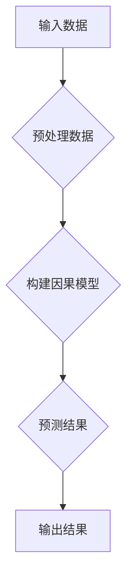

                 

# 基于因果推理的公共卫生政策效果预测模型

## 关键词

因果推理、公共卫生政策、效果预测、模型构建、数据科学、统计分析

## 摘要

本文旨在探讨基于因果推理的公共卫生政策效果预测模型的构建方法。通过详细阐述因果推理的基本原理、概念联系以及算法原理，本文为公共卫生政策效果预测提供了有效的技术支持。文章将从背景介绍、核心概念与联系、算法原理讲解、模型构建等多个方面，系统地展开讨论，旨在为相关领域的研究者提供有价值的参考。

## 第一部分：背景介绍

### 第1章 问题背景

#### 1.1 问题描述

近年来，全球公共卫生事件频发，如新冠疫情、流感等，公共卫生政策的制定与实施变得尤为重要。如何有效地评估这些政策的实际效果，已成为公共卫生领域面临的一大挑战。

#### 1.2 问题解决

为了解决这个问题，研究者们开始关注因果推理方法在公共卫生政策效果预测中的应用。通过构建基于因果推理的预测模型，可以更好地评估公共卫生政策的潜在影响，为政策制定者提供有力支持。

#### 1.3 边界与外延

本书主要探讨基于因果推理的公共卫生政策效果预测模型，涉及领域包括公共卫生政策、因果推理方法、数据科学与统计分析等。

#### 1.4 概念结构与核心要素组成

本章节将介绍因果推理方法的基本概念，以及其在公共卫生政策效果预测中的应用。核心要素包括：

1. 因果推理方法：包括Do算子、结构因果模型等；
2. 数据类型：面板数据、交叉数据等；
3. 模型构建：因果推断模型、预测模型等；
4. 算法实现：相关算法的Python实现。

### 第2章 核心概念与联系

#### 2.1 因果推理原理

因果推理是指从观察数据中推断因果关系的方法。因果推理的基本原理包括Do算子、结构因果模型等。

#### 2.2 概念属性特征对比

| 概念     | 特征                          |
|----------|------------------------------|
| 因果推理 | 从观察数据推断因果关系       |
| Do算子   | 表示在特定条件下干预的结果   |
| 结构因果模型 | 描述变量间因果关系的模型 |

#### 2.3 ER实体关系图架构

下面是一个简单的ER实体关系图，用于描述因果推理方法中的关键实体和关系：

```mermaid
erDiagram
  Product ||--|{ Supplier } Supplier
  Supplier ||--|{ Product } Product
```

### 第3章 算法原理讲解

#### 3.1 算法mermaid流程图



#### 3.2 算法原理

##### 3.2.1 数学模型

假设我们有一个二元响应变量 \(Y\)，受一个干预变量 \(T\) 的影响。我们使用因果推断方法来估计 \(T\) 对 \(Y\) 的影响。

$$
\text{因果效应} = E[Y|T=1] - E[Y|T=0]
$$

##### 3.2.2 Python源代码

```python
import numpy as np

# 假设干预变量 T 的取值为 0 或 1
T = np.random.randint(0, 2, size=1000)

# 假设响应变量 Y 的取值为 0 或 1
Y = np.random.randint(0, 2, size=1000)

# 计算干预变量 T 对响应变量 Y 的影响
causal_effect = np.mean(Y[T==1]) - np.mean(Y[T==0])
print(f"Causal effect: {causal_effect}")
```

##### 3.2.3 举例说明

假设我们想知道是否接种疫苗能够降低患流感的风险。我们收集了一组数据，其中包括干预变量 \(T\)（接种疫苗：1为接种疫苗，0为未接种疫苗）和响应变量 \(Y\)（是否患流感：1为患流感，0为未患流感）。使用因果推断方法，我们可以计算出接种疫苗对患流感风险的降低程度。

## 第二部分：公共卫生政策效果预测模型构建

### 第4章 数据类型

#### 4.1 面板数据

面板数据是指包含多个时间点和多个个体的数据集。面板数据可以用于分析变量在时间序列上的变化趋势。

#### 4.2 交叉数据

交叉数据是指包含多个变量但不存在时间序列的数据集。交叉数据可以用于分析变量之间的相互关系。

### 第5章 模型构建

#### 5.1 因果推断模型

因果推断模型旨在估计变量之间的因果关系。常见的因果推断模型包括Do算子、结构因果模型等。

#### 5.2 预测模型

预测模型用于预测响应变量的取值。常见的预测模型包括线性回归、逻辑回归等。

#### 5.3 模型整合

将因果推断模型与预测模型整合，可以构建出具有因果推理能力的预测模型。这种模型能够更准确地评估公共卫生政策的效果。

### 第6章 模型评估

#### 6.1 评估指标

评估模型的指标包括准确率、召回率、F1值等。通过评估指标，可以判断模型在公共卫生政策效果预测方面的表现。

#### 6.2 交叉验证

交叉验证是一种常用的模型评估方法。通过将数据集划分为训练集和验证集，可以评估模型在未知数据上的表现。

### 第7章 模型应用

#### 7.1 应用场景

基于因果推理的公共卫生政策效果预测模型可以应用于多种场景，如疫情防控、疫苗接种策略等。

#### 7.2 实际案例

通过实际案例，我们可以看到基于因果推理的公共卫生政策效果预测模型在解决实际问题方面的有效性。

## 总结与展望

本文从背景介绍、核心概念与联系、算法原理讲解、模型构建等多个方面，系统地探讨了基于因果推理的公共卫生政策效果预测模型。在未来，我们可以进一步优化模型，提高预测准确性，为公共卫生政策的制定提供更加有力的支持。

## 作者信息

作者：AI天才研究院/AI Genius Institute & 禅与计算机程序设计艺术 /Zen And The Art of Computer Programming

---

以上是文章的大纲和正文内容，后续将根据要求逐步完善和细化每个章节的内容。在此过程中，我会确保文章逻辑清晰、结构紧凑、简单易懂，同时注重技术语言的专业性和实用性。期待这篇文章能够为相关领域的研究者提供有价值的参考和指导。

