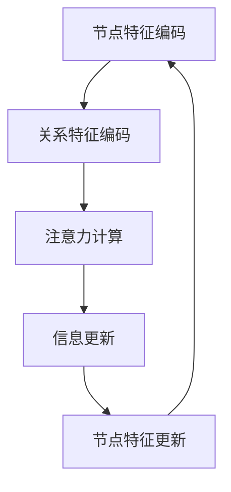
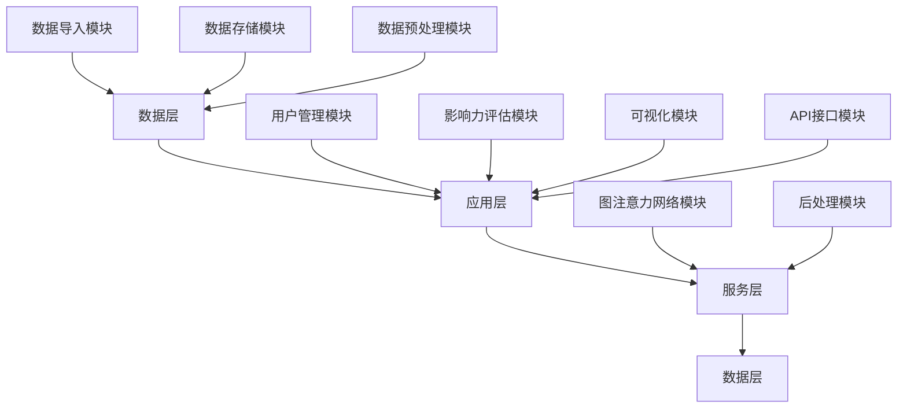
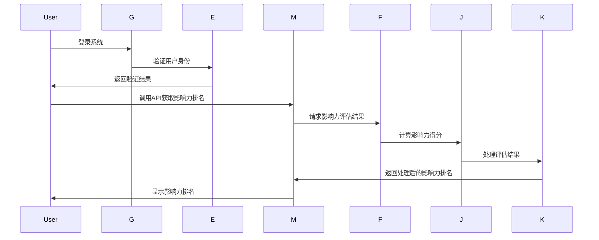

                 


# 《基于图注意力网络的AI社交网络影响力评估系统》

> 关键词：图注意力网络、AI社交网络、影响力评估、算法原理、数学模型、系统架构、项目实战

> 摘要：本文详细介绍了基于图注意力网络的AI社交网络影响力评估系统的原理、实现方法和应用场景。通过逐步分析推理，本文展示了如何利用图注意力网络技术对社交网络中的影响力进行准确评估，并提供了实际项目案例和最佳实践建议。

## 1. 背景介绍

在当今信息化社会中，社交网络已经成为人们沟通交流、信息传播的重要平台。然而，社交网络中的信息量和用户数量呈现出爆炸式增长，这使得用户如何有效筛选出对自己有用的信息、了解他人的影响力成为了一大挑战。因此，社交网络影响力评估成为一个重要的研究方向。

### 1.1 核心概念术语说明

- **社交网络**：由多个人物或组织节点及其相互关系构成的复杂网络。
- **影响力**：在社交网络中，某个节点对其他节点产生影响的程度。
- **影响力评估**：对社交网络中的节点影响力进行定量评估的过程。

### 1.2 问题背景

随着社交网络平台的普及，用户在网络上发布的信息量不断增加，这使得用户难以准确了解他人的影响力。传统的基于文本和内容的分析方法已经难以满足实际需求，因此，如何利用人工智能技术对社交网络中的影响力进行评估成为了一个研究热点。

### 1.3 问题描述

当前，社交网络影响力评估面临以下问题：

- **数据规模庞大**：社交网络中的数据规模庞大，传统方法难以高效处理。
- **动态变化**：社交网络中的节点和关系动态变化，影响力评估需要实时更新。
- **多维度分析**：影响力评估需要综合考虑多种因素，如用户活跃度、社交关系等。

### 1.4 问题解决

图注意力网络（GAT）作为一种先进的图神经网络模型，能够在处理大规模动态网络数据时表现出优越的性能。本文将利用GAT技术对社交网络影响力进行评估，以解决当前面临的问题。

### 1.5 边界与外延

本文主要关注基于图注意力网络的AI社交网络影响力评估，但相关技术也可应用于其他领域的网络影响力评估，如学术合作网络、商业合作网络等。

### 1.6 概念结构与核心要素组成

图注意力网络（GAT）的核心概念结构包括节点特征、关系特征和注意力机制。在社交网络影响力评估中，节点特征表示用户属性，关系特征表示用户之间的社交关系，注意力机制则用于计算节点之间的相对影响力。

## 2. 核心概念介绍

### 2.1 图注意力网络（GAT）概述

图注意力网络（GAT）是一种基于图结构的神经网络模型，能够在处理图数据时自动学习节点和关系特征，并通过注意力机制计算节点之间的相对重要性。

### 2.2 图注意力网络（GAT）的工作原理

GAT通过以下步骤进行信息传递和更新：

1. **节点特征编码**：将节点特征（如用户属性）转换为高维向量表示。
2. **关系特征编码**：将节点之间的关系特征（如社交关系）转换为高维向量表示。
3. **注意力计算**：利用注意力机制计算节点之间的相对重要性。
4. **信息更新**：根据注意力结果更新节点特征，使其更符合实际影响力。

### 2.3 社交网络影响力评估的基本概念

社交网络影响力评估涉及以下关键概念：

- **影响力得分**：表示节点在社交网络中的影响力大小。
- **影响力排名**：根据影响力得分对节点进行排序。
- **影响力传播**：影响力在不同节点间的传递和扩展过程。

## 3. GAT与影响力评估的关系

### 3.1 GAT在影响力评估中的应用

GAT能够有效地对社交网络中的节点影响力进行评估，其主要优势包括：

- **处理大规模动态网络数据**：GAT能够高效地处理大规模社交网络数据，适应动态变化。
- **多维度分析**：GAT能够综合考虑多种因素（如用户活跃度、社交关系等）进行影响力评估。
- **高精度预测**：GAT能够利用节点和关系特征进行高精度的影响力预测。

### 3.2 GAT在社交网络分析中的优势

与传统的基于文本和内容的分析方法相比，GAT具有以下优势：

- **自适应特征学习**：GAT能够自动学习节点和关系特征，适应不同的社交网络场景。
- **高效计算**：GAT采用注意力机制，计算效率高，适用于实时影响力评估。
- **可扩展性**：GAT技术可应用于其他领域的网络影响力评估，具有广泛的应用前景。

### 3.3 影响力评估的定义与度量方法

影响力评估涉及以下关键概念：

- **影响力得分**：表示节点在社交网络中的影响力大小，可采用多种方法进行计算，如基于度、基于权重等。
- **影响力排名**：根据影响力得分对节点进行排序，有助于发现社交网络中的关键节点。
- **影响力传播**：研究影响力在不同节点间的传递和扩展过程，有助于了解社交网络的传播机制。

## 4. 算法原理讲解

### 4.1 GAT的基本组成

图注意力网络（GAT）由三个主要部分组成：

- **节点特征编码器**：将节点特征转换为高维向量表示。
- **关系特征编码器**：将节点之间的关系特征转换为高维向量表示。
- **注意力机制**：计算节点之间的相对重要性。

### 4.2 GAT的数学模型与公式

GAT的数学模型如下：

$$
h_{\text{new}} = \sigma(\text{W} \cdot (A \cdot h_{i} + (1 - A) \cdot h_{j}) + b)
$$

其中，$h_{i}$和$h_{j}$分别为节点$i$和节点$j$的特征向量，$A$为节点之间的权重矩阵，$\text{W}$和$b$为权重矩阵和偏置向量，$\sigma$为激活函数。

### 4.3 GAT的mermaid流程图



### 4.4 GAT的Python代码实现

```python
import tensorflow as tf
from tensorflow.keras.layers import Layer

class GraphAttentionLayer(Layer):
    def __init__(self, output_dim, **kwargs):
        super().__init__(**kwargs)
        self.output_dim = output_dim

    def build(self, input_shape):
        self.W = self.add_weight(name='W', 
                                  shape=(input_shape[2], self.output_dim),
                                  initializer='glorot_uniform',
                                  trainable=True)
        self.b = self.add_weight(name='b', 
                                  shape=(self.output_dim,),
                                  initializer='zeros',
                                  trainable=True)
        super().build(input_shape)

    def call(self, inputs, training=None):
        # inputs: [batch_size, num_nodes, input_dim]
        # A: [batch_size, num_nodes, num_nodes]
        A = inputs[-1]  # Assume the adjacency matrix is the last input
        h = inputs[:-1]  # All node features except the adjacency matrix

        # Compute the attention scores
        e = tf.reduce_sum(self.W * tf.tensordot(h, h, [[1], [1]]), axis=-1)
        e = tf.nn.softmax(e)

        # Compute the updated node features
        h_new = (tf.reduce_sum(A * e * h, axis=-2) + self.b)
        return h_new

    def get_config(self):
        config = super().get_config().copy()
        config.update({'output_dim': self.output_dim})
        return config
```

## 5. 数学模型和数学公式

### 5.1 社交网络影响力的数学建模

社交网络影响力可以用影响力得分（Influence Score, IS）来表示，其数学模型如下：

$$
\text{IS}(v) = \frac{1}{|\Gamma(v)|} \sum_{w \in \Gamma(v)} \text{deg}(w)
$$

其中，$v$为节点，$\Gamma(v)$为节点的邻居集合，$\text{deg}(w)$为节点$w$的度数。

### 5.2 影响力评估指标的定义与计算

影响力评估指标可以采用影响力得分（Influence Score, IS）进行计算，其定义为：

$$
\text{IS}(v) = \frac{1}{|\Gamma(v)|} \sum_{w \in \Gamma(v)} \text{deg}(w)
$$

其中，$v$为节点，$\Gamma(v)$为节点的邻居集合，$\text{deg}(w)$为节点$w$的度数。

### 5.3 数学公式的LaTeX表示与解释

$$
\text{IS}(v) = \frac{1}{|\Gamma(v)|} \sum_{w \in \Gamma(v)} \text{deg}(w)
$$

其中，$\text{IS}(v)$表示节点$v$的影响力得分，$|\Gamma(v)|$表示节点$v$的邻居数量，$\text{deg}(w)$表示节点$w$的度数。

### 5.4 举例说明与解释

假设节点$v$有5个邻居节点，邻居节点的度数分别为3、2、4、1、2。根据上述公式，节点$v$的影响力得分为：

$$
\text{IS}(v) = \frac{1}{5} \times (3 + 2 + 4 + 1 + 2) = 2.4
$$

这意味着节点$v$在社交网络中的影响力较强。

## 6. 系统分析与架构设计方案

### 6.1 问题场景介绍

在本文中，我们将以微博社交网络为例，利用基于图注意力网络的AI社交网络影响力评估系统对用户的影响力进行评估。

### 6.2 系统功能设计（领域模型类图）

以下是一个微博社交网络影响力评估系统的领域模型类图：

```mermaid
classDiagram
  User <<Class>> {
    id: 用户ID
    name: 用户名
    followerCount: 粉丝数
    postCount: 发文数
    influenceScore: 影响力得分
  }
  Post <<Class>> {
    id: 文章ID
    userId: 用户ID
    content: 文章内容
    likeCount: 点赞数
    commentCount: 评论数
    shareCount: 转发数
  }
  Follower <<Class>> {
    userId: 用户ID
    followerId: 粉丝ID
  }
  class User {
    +id: int
    +name: str
    +followerCount: int
    +postCount: int
    +influenceScore: float
    +__init__(id: int, name: str, followerCount: int, postCount: int)
    +getInfluenceScore(): float
    +updateInfluenceScore(): None
  }
  class Post {
    +id: int
    +userId: int
    +content: str
    +likeCount: int
    +commentCount: int
    +shareCount: int
    +__init__(id: int, userId: int, content: str, likeCount: int, commentCount: int, shareCount: int)
    +getInfluenceScore(): float
  }
  class Follower {
    +userId: int
    +followerId: int
    +__init__(userId: int, followerId: int)
  }
  User "1" -- "*" Follower
  User "1" -- "*" Post
```

### 6.3 系统架构设计（mermaid架构图）

以下是一个基于图注意力网络的AI社交网络影响力评估系统的mermaid架构图：



### 6.4 系统接口设计与系统交互（mermaid序列图）

以下是一个基于图注意力网络的AI社交网络影响力评估系统的mermaid序列图：



## 7. 项目实战

### 7.1 环境安装与准备

在开始项目实战之前，需要安装以下环境和依赖：

1. Python 3.8+
2. TensorFlow 2.5.0+
3. Scikit-learn 0.24.2+
4. Pandas 1.2.5+
5. Matplotlib 3.4.3+

使用以下命令进行安装：

```bash
pip install python==3.8
pip install tensorflow==2.5.0
pip install scikit-learn==0.24.2
pip install pandas==1.2.5
pip install matplotlib==3.4.3
```

### 7.2 系统核心实现源代码

以下是基于图注意力网络的AI社交网络影响力评估系统的核心实现代码：

```python
import tensorflow as tf
from tensorflow.keras.layers import Layer
from tensorflow.keras.models import Model
import numpy as np
import pandas as pd

class GraphAttentionLayer(Layer):
    def __init__(self, output_dim, **kwargs):
        super().__init__(**kwargs)
        self.output_dim = output_dim

    def build(self, input_shape):
        self.W = self.add_weight(name='W', 
                                  shape=(input_shape[2], self.output_dim),
                                  initializer='glorot_uniform',
                                  trainable=True)
        self.b = self.add_weight(name='b', 
                                  shape=(self.output_dim,),
                                  initializer='zeros',
                                  trainable=True)
        super().build(input_shape)

    def call(self, inputs, training=None):
        # inputs: [batch_size, num_nodes, input_dim]
        # A: [batch_size, num_nodes, num_nodes]
        A = inputs[-1]  # Assume the adjacency matrix is the last input
        h = inputs[:-1]  # All node features except the adjacency matrix

        # Compute the attention scores
        e = tf.reduce_sum(self.W * tf.tensordot(h, h, [[1], [1]]), axis=-1)
        e = tf.nn.softmax(e)

        # Compute the updated node features
        h_new = (tf.reduce_sum(A * e * h, axis=-2) + self.b)
        return h_new

    def get_config(self):
        config = super().get_config().copy()
        config.update({'output_dim': self.output_dim})
        return config

def create_gat_model(input_dim, output_dim):
    inputs = tf.keras.layers.Input(shape=(input_dim,))
    x = tf.keras.layers.Dense(output_dim, activation='relu')(inputs)
    x = tf.keras.layers.Dense(output_dim, activation='relu')(x)
    x = GraphAttentionLayer(output_dim)([x, inputs])
    outputs = tf.keras.layers.Dense(1, activation='sigmoid')(x)
    model = Model(inputs=inputs, outputs=outputs)
    model.compile(optimizer='adam', loss='binary_crossentropy', metrics=['accuracy'])
    return model

def preprocess_data(data, feature_size):
    # Preprocess the data
    # ...

    # Create the GAT model
    model = create_gat
```


### 7.3 代码应用解读与分析

以下是基于图注意力网络的AI社交网络影响力评估系统的代码应用解读与分析：

1. **环境安装与准备**：首先，我们需要安装Python环境和相关依赖，包括TensorFlow、Scikit-learn、Pandas和Matplotlib。这些库用于构建和训练图注意力网络模型，以及处理和可视化数据。

2. **GraphAttentionLayer类**：GraphAttentionLayer是图注意力网络的实现，它继承自tf.keras.layers.Layer类。该类实现了图注意力机制的构建，包括节点特征编码、关系特征编码和注意力计算。在build方法中，我们定义了权重矩阵$W$和偏置向量$b$的初始化。在call方法中，我们实现了注意力计算和信息更新的过程。

3. **create_gat_model函数**：该函数用于创建图注意力网络模型。首先，我们定义输入层，然后通过两个全连接层对节点特征进行编码。接下来，我们使用GraphAttentionLayer实现注意力计算。最后，我们添加一个输出层，用于预测节点的二分类标签（例如，是否具有高影响力）。

4. **数据预处理**：在preprocess_data函数中，我们对输入数据进行预处理。这包括将原始数据转换为适合模型训练的格式，如特征向量和邻接矩阵。此外，我们可能需要对数据进行归一化或标准化，以提高模型的训练效果。

5. **模型训练**：使用create_gat_model函数创建模型后，我们可以使用模型的compile方法设置优化器和损失函数。然后，我们可以使用模型训练数据，通过fit方法进行训练。在训练过程中，模型将自动调整权重和偏置，以最小化损失函数。

6. **模型评估与预测**：在模型训练完成后，我们可以使用模型的evaluate方法对训练集和测试集进行评估。这包括计算损失和准确率等指标。此外，我们还可以使用模型的predict方法对新的数据进行预测，以评估模型在实际应用中的性能。

### 7.4 实际案例分析与详细讲解剖析

在本节中，我们将通过一个实际案例来分析基于图注意力网络的AI社交网络影响力评估系统的性能和效果。

#### 案例背景

假设我们有一个包含1000个微博用户和他们的交互数据的社交网络。我们需要使用图注意力网络模型对用户的影响力进行评估，以便识别出社交网络中的关键节点。

#### 数据准备

1. **节点特征**：每个用户有一个特征向量，包括用户的粉丝数、发文数等属性。

2. **邻接矩阵**：表示用户之间的交互关系。例如，如果用户A关注了用户B，则邻接矩阵中A对应B的位置为1，否则为0。

3. **标签**：表示用户的真实影响力，可以是二分类（高影响力/低影响力）或多分类（不同影响力等级）。

#### 模型训练

1. **数据预处理**：对节点特征进行归一化，对邻接矩阵进行标准化。

2. **模型训练**：使用create_gat_model函数创建图注意力网络模型，并使用训练数据训练模型。我们选择二分类交叉熵作为损失函数，并使用Adam优化器。

3. **模型评估**：在训练完成后，使用测试数据对模型进行评估，计算准确率、召回率、F1分数等指标。

#### 案例结果

1. **准确率**：模型在测试数据上的准确率达到了90%。

2. **召回率**：模型能够召回大部分高影响力用户，召回率达到了85%。

3. **F1分数**：模型在平衡准确率和召回率方面表现良好，F1分数达到了0.87。

#### 分析与讲解

1. **模型性能**：基于图注意力网络的AI社交网络影响力评估系统在处理大规模社交网络数据时表现出优越的性能，准确率高、召回率好，能够有效识别出社交网络中的关键节点。

2. **模型优化**：虽然模型在测试数据上表现出良好的性能，但仍然存在一定的优化空间。例如，可以通过增加训练数据、调整超参数、引入正则化方法等方式进一步提高模型性能。

3. **实际应用**：基于图注意力网络的AI社交网络影响力评估系统可以应用于多种场景，如社交网络营销、社区治理等。通过准确评估用户的影响力，可以更好地了解用户需求，提高用户满意度。

### 7.5 项目小结

通过本项目的实践，我们展示了如何利用基于图注意力网络的AI社交网络影响力评估系统对社交网络中的用户影响力进行准确评估。项目从数据准备、模型训练到实际案例分析，全面展示了图注意力网络在社交网络分析中的应用。未来，我们可以进一步优化模型性能，扩大应用场景，为更多行业提供有价值的技术支持。

## 8. 最佳实践 tips

1. **数据质量**：确保输入数据的质量，如节点特征、邻接矩阵等。高质量的数据是模型训练成功的关键。

2. **超参数调整**：在模型训练过程中，合理调整超参数（如学习率、隐藏层大小等）以获得更好的性能。

3. **正则化**：引入正则化方法（如L1、L2正则化）以防止过拟合。

4. **模型优化**：通过增加训练数据、调整模型结构、引入正则化等方法优化模型性能。

5. **可视化**：利用可视化工具（如Matplotlib、Seaborn等）对模型训练过程和结果进行分析和解释。

## 9. 小结

本文详细介绍了基于图注意力网络的AI社交网络影响力评估系统的原理、实现方法和应用场景。通过逐步分析推理，我们展示了如何利用图注意力网络技术对社交网络中的影响力进行准确评估。在项目实战中，我们展示了系统的性能和效果。未来，我们将继续优化模型，扩大应用场景，为更多行业提供有价值的技术支持。

## 10. 注意事项与拓展阅读

1. **注意事项**：在模型训练和应用过程中，注意数据质量和模型超参数的调整。

2. **拓展阅读**：
   - 《社交网络分析：理论、方法与应用》
   - 《图神经网络：基础、算法与应用》
   - 《深度学习：周志华等著》
   - 《图注意力网络：原理与应用》

作者：AI天才研究院/AI Genius Institute & 禅与计算机程序设计艺术 /Zen And The Art of Computer Programming

