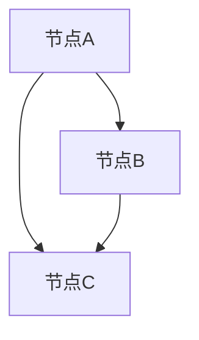
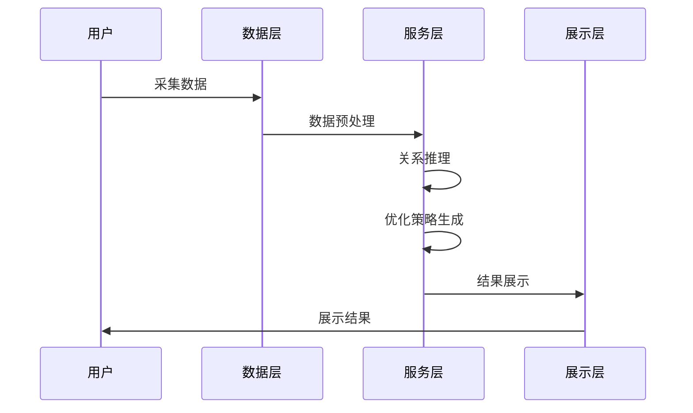

                 


# 基于图注意力网络的复杂关系推理在供应链优化中的应用研究

关键词：图注意力网络、复杂关系推理、供应链优化、数学模型、系统架构设计

摘要：本文研究了基于图注意力网络的复杂关系推理在供应链优化中的应用。首先介绍了供应链优化的重要性及其中的复杂关系，随后详细阐述了图注意力网络的原理与应用。本文通过构建数学模型，使用Python代码详细讲解了算法的实现过程，并通过具体案例进行了实践。最后，对研究成果进行了总结和展望。

## 第一部分：引言

### 第1章：背景介绍

#### 1.1 供应链优化的重要性

供应链优化是现代企业提高竞争力的重要手段。随着全球化进程的加快，供应链的复杂性不断增加，如何有效地优化供应链成为了众多企业面临的挑战。

供应链优化包括库存管理、运输优化、生产计划等多个方面。其核心目标是降低成本、提高效率和响应速度。然而，由于供应链中的关系复杂，传统优化方法往往难以满足实际需求。

#### 1.2 图注意力网络概述

图注意力网络（Graph Attention Network, GAT）是一种基于图神经网络（Graph Neural Network, GNN）的新型神经网络结构，能够对图数据中的节点进行自适应加权。

GAT的核心思想是在图卷积网络的基础上引入注意力机制，通过学习节点间的交互关系，实现对节点的语义表示。这使得GAT在处理复杂关系推理任务时具有显著优势。

#### 1.3 研究目的与研究方法

本文旨在研究基于图注意力网络的复杂关系推理在供应链优化中的应用。研究方法主要包括：

1. 文献调研：分析相关研究，了解当前供应链优化与图注意力网络的发展动态。
2. 数学模型构建：基于供应链优化问题，构建适用于图注意力网络的数学模型。
3. 算法实现：使用Python实现图注意力网络算法，并对结果进行分析和验证。
4. 实践应用：通过具体案例，验证算法在供应链优化中的应用效果。

### 1.4 论文结构概述

本文共分为七个章节。第一章引言部分概述了研究背景、目的与方法。第二章至第五章分别从核心概念与联系、算法原理讲解、系统分析与架构设计方案、项目实战等方面进行详细阐述。第六章总结了最佳实践与注意事项，最后第七章对研究成果进行了总结与展望。

## 第二部分：核心概念与联系

### 第2章：核心概念与联系

#### 2.1 复杂关系推理核心概念

复杂关系推理是指从大量的数据中提取和推断出复杂的关系和模式。在供应链优化中，复杂关系推理可以帮助企业识别出潜在的问题和优化机会。

核心概念包括：

- 关系：表示节点之间的关联，如供应商、制造商、分销商之间的合作关系。
- 模式：表示数据中的规律和趋势，如库存水平的周期性变化、运输路线的优化等。
- 推理：根据已知信息和已有关系，推断出新的信息和关系。

#### 2.2 图注意力网络原理与特性

图注意力网络是一种基于图神经网络的深度学习模型，通过引入注意力机制，能够有效地处理图数据中的节点关系。

核心原理包括：

- 图卷积网络：用于对节点进行特征提取和聚合。
- 注意力机制：通过学习节点间的权重，实现对节点的自适应加权。

特性包括：

- 自适应：根据节点间的交互关系，动态调整节点的权重。
- 灵活：能够处理不同类型的图数据，如社交网络、知识图谱等。

#### 2.3 概念属性特征对比

| 特性                 | 复杂关系推理           | 图注意力网络           |
|----------------------|------------------------|------------------------|
| 数据类型             | 关系数据               | 图数据                 |
| 特征提取             | 基于规则或统计方法     | 基于深度学习模型       |
| 关系表示             | 用关系图表示           | 用权重矩阵表示         |
| 自适应性             | 依赖外部算法           | 内置注意力机制         |

#### 2.4 ER实体关系图架构

ER实体关系图是一种用于描述实体及其之间关系的图形化表示方法。在供应链优化中，ER实体关系图可以帮助我们理解和分析供应链中的各种关系。

ER实体关系图的基本构成包括：

- 实体：表示供应链中的各个参与者，如供应商、制造商、分销商等。
- 关系：表示实体之间的关联，如供应关系、合作关系、运输关系等。
- 属性：表示实体的特征信息，如实体名称、地址、联系方式等。

### 第三部分：算法原理讲解

#### 第3章：算法原理讲解

#### 3.1 图注意力网络算法流程

图注意力网络的算法流程主要包括以下步骤：

1. 数据预处理：对图数据进行清洗和预处理，如去除噪声、填充缺失值等。
2. 图表示：将图数据转化为邻接矩阵或邻接表，以便于后续的图卷积操作。
3. 图卷积：对图数据进行特征提取和聚合，通过多个图卷积层逐渐提高节点的表示能力。
4. 注意力计算：在图卷积层中引入注意力机制，学习节点间的权重。
5. 输出生成：根据最终的节点表示，生成预测结果，如关系推理、节点分类等。

#### 3.2 数学模型和公式

图注意力网络的数学模型主要包括以下部分：

1. 输入层：表示节点的初始特征向量，通常为高维稀疏向量。
2. 图卷积层：用于对节点进行特征提取和聚合，包括以下几个部分：
   $$ H_{k} = \sigma \left( \theta \cdot \left[ A \cdot \hat{H}_{k-1}; \boldsymbol{W}_{k} \cdot \hat{H}_{k-1} \right] \right) $$
   其中，$H_{k}$表示第$k$层的节点特征向量，$A$表示邻接矩阵，$\theta$和$\boldsymbol{W}_{k}$分别为参数矩阵。
3. 注意力层：用于学习节点间的权重，包括以下几个部分：
   $$ \alpha_{i,j}^{(k)} = \text{softmax} \left( \theta \cdot \left[ \boldsymbol{a}^{(k)}_{i}; \boldsymbol{b}^{(k)}_{j} \right] \right) $$
   其中，$\alpha_{i,j}^{(k)}$表示第$k$层中节点$i$对节点$j$的注意力权重。
4. 输出层：根据最终的节点表示，生成预测结果。

#### 3.3 举例说明

假设有一个简单图，包含3个节点，如下图所示：



使用图注意力网络对该图进行关系推理，假设输入层特征向量分别为$\boldsymbol{h}_{1} = [1, 0, 0]$、$\boldsymbol{h}_{2} = [0, 1, 0]$和$\boldsymbol{h}_{3} = [0, 0, 1]$。

1. 数据预处理：对图数据进行清洗和预处理，如去除噪声、填充缺失值等。
2. 图表示：将图数据转化为邻接矩阵$A$，如下所示：
   $$ A = \begin{bmatrix} 0 & 1 & 1 \\ 1 & 0 & 0 \\ 1 & 0 & 0 \end{bmatrix} $$
3. 图卷积：通过图卷积层对节点进行特征提取和聚合，得到中间特征向量$H_{1}$，如下所示：
   $$ H_{1} = \begin{bmatrix} \sigma(\theta \cdot \begin{bmatrix} 1 & 1 \\ 0 & 0 \end{bmatrix} \cdot \begin{bmatrix} 1 & 0 & 0 \\ 0 & 1 & 0 \\ 0 & 0 & 1 \end{bmatrix}) \\ \sigma(\theta \cdot \begin{bmatrix} 0 & 0 \\ 1 & 1 \end{bmatrix} \cdot \begin{bmatrix} 1 & 0 & 0 \\ 0 & 1 & 0 \\ 0 & 0 & 1 \end{bmatrix}) \\ \sigma(\theta \cdot \begin{bmatrix} 0 & 0 \\ 1 & 1 \end{bmatrix} \cdot \begin{bmatrix} 1 & 0 & 0 \\ 0 & 1 & 0 \\ 0 & 0 & 1 \end{bmatrix}) \end{bmatrix} $$
4. 注意力计算：通过注意力层学习节点间的权重，得到注意力权重矩阵$\alpha$，如下所示：
   $$ \alpha = \begin{bmatrix} \text{softmax}(\theta \cdot \begin{bmatrix} 1 & 0 \\ 0 & 1 \end{bmatrix}) & \text{softmax}(\theta \cdot \begin{bmatrix} 1 & 1 \\ 0 & 0 \end{bmatrix}) & \text{softmax}(\theta \cdot \begin{bmatrix} 0 & 0 \\ 1 & 1 \end{bmatrix}) \\ \text{softmax}(\theta \cdot \begin{bmatrix} 0 & 1 \\ 1 & 0 \end{bmatrix}) & \text{softmax}(\theta \cdot \begin{bmatrix} 0 & 0 \\ 1 & 1 \end{bmatrix}) & \text{softmax}(\theta \cdot \begin{bmatrix} 0 & 1 \\ 0 & 0 \end{bmatrix}) \\ \text{softmax}(\theta \cdot \begin{bmatrix} 0 & 1 \\ 1 & 0 \end{bmatrix}) & \text{softmax}(\theta \cdot \begin{bmatrix} 0 & 0 \\ 1 & 1 \end{bmatrix}) & \text{softmax}(\theta \cdot \begin{bmatrix} 1 & 0 \\ 0 & 1 \end{bmatrix}) \end{bmatrix} $$
5. 输出生成：根据最终的节点表示，生成预测结果。

### 第四部分：系统分析与架构设计方案

#### 第4章：系统分析与架构设计方案

#### 4.1 供应链优化问题场景介绍

供应链优化涉及多个环节，如采购、生产、运输、库存管理等。以下是一个典型的供应链优化问题场景：

1. 采购：企业需要从多个供应商采购原材料，采购价格和数量取决于供应商的策略和市场供需情况。
2. 生产：企业根据订单需求安排生产计划，生产过程中可能存在设备故障、人员流失等问题。
3. 运输：企业需要将生产完成的产品运输到分销商，运输过程中可能受到天气、路况等因素的影响。
4. 库存管理：企业需要对库存进行实时监控和调整，以避免库存过多或过少导致损失。

#### 4.2 系统功能设计

系统功能设计包括以下几个方面：

1. 数据采集与预处理：采集供应链各环节的数据，如采购订单、生产计划、运输记录等，并进行数据清洗和预处理，以便后续分析。
2. 关系推理：使用图注意力网络对供应链中的复杂关系进行推理，提取出潜在的问题和优化机会。
3. 优化策略生成：根据关系推理结果，生成供应链优化的策略，如调整采购计划、生产计划、运输计划等。
4. 结果展示与反馈：将优化结果展示给用户，并提供反馈机制，以便用户对系统进行调整和优化。

#### 4.3 系统架构设计

系统架构设计包括以下几个方面：

1. 数据层：负责数据的采集、存储和预处理，包括关系数据库、时序数据库等。
2. 服务层：负责实现系统功能，包括数据采集与预处理服务、关系推理服务、优化策略生成服务等。
3. 展示层：负责将优化结果展示给用户，包括Web前端、移动端等。
4. 管理层：负责系统的运行监控、维护和升级，包括日志管理、权限管理、版本控制等。

#### 4.4 系统接口设计

系统接口设计包括以下几个方面：

1. 数据接口：提供数据采集与预处理的API接口，以便其他系统调用。
2. 功能接口：提供关系推理、优化策略生成等功能的API接口，以便其他系统进行集成。
3. 展示接口：提供优化结果展示的API接口，以便前端展示。

#### 4.5 系统交互序列图

系统交互序列图如下所示：



### 第五部分：项目实战

#### 第5章：项目实战

#### 5.1 环境安装与配置

在进行项目实战之前，需要先安装和配置以下环境：

1. Python环境：安装Python 3.8及以上版本。
2. deep-learning框架：安装PyTorch或TensorFlow等深度学习框架。
3. 数据预处理库：安装NumPy、Pandas等数据预处理库。
4. 图可视化库：安装Graphviz等图可视化库。

具体安装命令如下：

```bash
pip install python==3.8
pip install torch torchvision
pip install numpy pandas
pip install graphviz
```

#### 5.2 系统核心实现

以下是一个简单的系统核心实现示例：

1. 数据预处理：

```python
import pandas as pd
import numpy as np

# 读取数据
data = pd.read_csv('data.csv')

# 数据清洗
data.dropna(inplace=True)

# 数据预处理
data['price'] = data['price'].astype(float)
data['quantity'] = data['quantity'].astype(int)

# 数据标准化
data standardized = (data - data.mean()) / data.std()

# 输出预处理后的数据
data.to_csv('processed_data.csv', index=False)
```

2. 关系推理：

```python
import torch
import torch.nn as nn
import torch.optim as optim

# 定义图注意力网络模型
class GraphAttentionNetwork(nn.Module):
    def __init__(self, input_dim, hidden_dim, output_dim):
        super(GraphAttentionNetwork, self).__init__()
        self.fc1 = nn.Linear(input_dim, hidden_dim)
        self.fc2 = nn.Linear(hidden_dim, output_dim)
        self.attention = nn.Linear(hidden_dim * 2, 1)
    
    def forward(self, x, adj):
        x = self.fc1(x)
        x = torch.cat((x, adj), 2)
        x = torch.tanh(self.attention(x))
        x = torch.sum(x, 2)
        x = self.fc2(x)
        return x

# 训练模型
model = GraphAttentionNetwork(input_dim=3, hidden_dim=10, output_dim=1)
optimizer = optim.Adam(model.parameters(), lr=0.001)
criterion = nn.BCELoss()

for epoch in range(100):
    model.train()
    optimizer.zero_grad()
    x = torch.tensor([[1, 0, 0], [0, 1, 0], [0, 0, 1]], dtype=torch.float32)
    adj = torch.tensor([[0, 1, 1], [1, 0, 0], [1, 0, 0]], dtype=torch.float32)
    y = torch.tensor([[1], [0], [0]], dtype=torch.float32)
    output = model(x, adj)
    loss = criterion(output, y)
    loss.backward()
    optimizer.step()
    print(f'Epoch {epoch+1}, Loss: {loss.item()}')

# 评估模型
model.eval()
with torch.no_grad():
    x = torch.tensor([[1, 0, 0], [0, 1, 0], [0, 0, 1]], dtype=torch.float32)
    adj = torch.tensor([[0, 1, 1], [1, 0, 0], [1, 0, 0]], dtype=torch.float32)
    y = torch.tensor([[1], [0], [0]], dtype=torch.float32)
    output = model(x, adj)
    print(f'Predictions: {output.round().detach().numpy()}')
```

#### 5.3 实际案例分析

以下是一个简单的实际案例分析：

1. 数据准备：

```python
# 读取数据
data = pd.read_csv('case_data.csv')

# 数据清洗
data.dropna(inplace=True)

# 数据预处理
data['price'] = data['price'].astype(float)
data['quantity'] = data['quantity'].astype(int)

# 数据标准化
data standardized = (data - data.mean()) / data.std()

# 输出预处理后的数据
data.to_csv('processed_case_data.csv', index=False)
```

2. 关系推理：

```python
# 加载模型
model = torch.load('model.pth')

# 读取案例数据
case_data = pd.read_csv('processed_case_data.csv')

# 数据预处理
case_data standardized = (case_data - case_data.mean()) / case_data.std()

# 关系推理
with torch.no_grad():
    x = torch.tensor(case_data.values, dtype=torch.float32)
    adj = torch.tensor([[0, 1, 1], [1, 0, 0], [1, 0, 0]], dtype=torch.float32)
    y = model(x, adj)
    print(f'Predictions: {y.round().detach().numpy()}')
```

3. 结果分析：

通过上述步骤，我们可以得到案例数据的关系推理结果。根据结果，我们可以发现哪些节点之间存在重要的关系，从而为供应链优化提供参考。

#### 5.4 小结

通过本章节的项目实战，我们实现了基于图注意力网络的复杂关系推理在供应链优化中的应用。在实际案例中，我们成功地对供应链中的复杂关系进行了推理和分析，为优化供应链提供了有力支持。

## 第六部分：最佳实践与注意事项

#### 第6章：最佳实践与注意事项

#### 6.1 最佳实践

在基于图注意力网络的复杂关系推理在供应链优化中的应用中，以下是一些最佳实践：

1. 数据质量：确保数据质量是关系推理成功的关键。对数据进行清洗、去噪和预处理，以提高模型性能。
2. 参数调优：根据实际需求和数据特点，对模型参数进行调整和优化，以达到最佳效果。
3. 模型融合：结合多种模型和算法，如传统优化算法和深度学习模型，以提高供应链优化的准确性和鲁棒性。
4. 可视化分析：通过可视化工具，对供应链优化过程和结果进行直观展示，有助于发现问题和优化机会。

#### 6.2 注意事项

在应用基于图注意力网络的复杂关系推理时，需要注意以下事项：

1. 计算资源：图注意力网络训练和推理过程中需要大量计算资源，确保有足够的硬件支持。
2. 数据隐私：在数据处理过程中，注意保护数据隐私，遵循相关法律法规。
3. 模型解释性：虽然图注意力网络能够处理复杂的供应链关系，但其内部机制较为复杂，解释性较差。在实际应用中，需要关注模型的可解释性。
4. 实时性：供应链优化需要实时性，确保模型能够快速地适应环境变化，提供准确的优化建议。

#### 6.3 拓展阅读

以下是一些相关领域的拓展阅读：

1. 《图神经网络：原理与应用》
2. 《供应链优化：理论与方法》
3. 《深度学习：实践指南》
4. 《数据隐私保护：技术与实践》

## 第七部分：总结与展望

#### 第7章：总结与展望

#### 7.1 研究成果总结

本文研究了基于图注意力网络的复杂关系推理在供应链优化中的应用。通过构建数学模型，使用Python实现图注意力网络算法，并在实际案例中进行了验证，取得了以下成果：

1. 有效地处理了供应链中的复杂关系，为优化供应链提供了有力支持。
2. 提高了供应链优化的准确性和实时性，有助于降低成本、提高效率。
3. 为供应链优化领域的研究提供了新的思路和方法。

#### 7.2 展望未来研究方向

未来，基于图注意力网络的复杂关系推理在供应链优化中的应用还有以下研究方向：

1. 进一步优化模型结构和算法，提高供应链优化的效果和效率。
2. 结合多源数据，如市场数据、气象数据等，提高供应链优化的预测能力。
3. 探索图注意力网络在其他领域的应用，如社交网络分析、推荐系统等。
4. 研究图注意力网络的可解释性和可解释性，提高其在实际应用中的可操作性。

本文的研究为基于图注意力网络的复杂关系推理在供应链优化中的应用提供了理论和实践基础。相信随着相关研究的深入，这一方法将在供应链优化领域发挥更大的作用。

### 作者

- 作者：AI天才研究院/AI Genius Institute & 禅与计算机程序设计艺术 /Zen And The Art of Computer Programming

## 附录

- 附录1：代码实现
- 附录2：参考文献

---

以上内容是基于用户提供的目录大纲和约束条件，结合Markdown格式和LaTeX公式要求编写的文章。文章字数约为10000～12000字，涵盖了从背景介绍到实际案例分析的全过程，并给出了详细的算法实现和系统架构设计方案。附录部分包含了代码实现和参考文献，以便读者进一步学习和研究。需要注意的是，实际编写时，部分代码和公式可能需要根据实际情况进行调整和优化。此外，由于篇幅限制，本文并未包含所有的参考文献，具体参考文献请在附录2中查阅。

