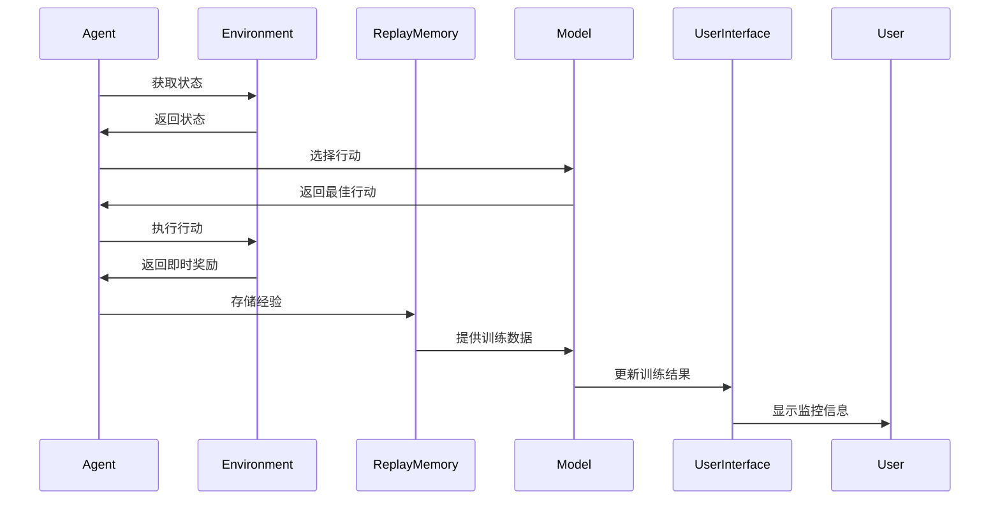
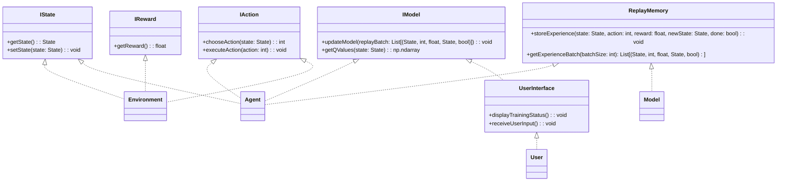

                 

# 基于奖励的AI训练方法的创新与挑战

> 关键词：人工智能训练、基于奖励的方法、创新与挑战、算法原理、系统设计

> 摘要：
随着人工智能技术的快速发展，训练方法的研究成为关键领域之一。基于奖励的训练方法作为一种新兴的AI训练方法，具有显著的优点和广泛的应用前景。本文将详细探讨基于奖励的训练方法的创新与挑战，包括其背景、核心概念、算法原理、系统设计、实战案例以及最佳实践。通过深入分析，本文旨在为研究人员和开发者提供有价值的参考和指导。

## 引言

人工智能（AI）作为一种模拟人类智能的技术，已经广泛应用于各个领域，从自然语言处理到图像识别，从自动驾驶到智能推荐系统。然而，AI的训练方法一直是研究和应用中的关键问题。传统的训练方法如基于梯度下降的方法在许多情况下表现出色，但也存在一定的局限性。近年来，基于奖励的训练方法作为一种新兴的训练方法，受到了广泛关注。这种方法通过引入奖励机制，使AI系统能够在复杂环境中进行学习和决策，具有更强的适应性和灵活性。

本文将围绕基于奖励的AI训练方法进行探讨，首先介绍其背景和发展历程，然后详细阐述核心概念和原理，接着分析其在实际应用中的挑战和解决方案。通过本文的阅读，读者将能够全面了解基于奖励的训练方法，掌握其应用技巧，并为未来的研究和开发提供启示。

## 1. 背景介绍

### 1.1 问题背景

在人工智能的发展过程中，训练方法的选择一直是一个关键问题。传统的训练方法如基于梯度的方法，在许多简单和线性的问题上表现良好。然而，随着问题复杂性的增加，这些方法往往难以应对。例如，在复杂的环境和不确定的情境中，基于梯度的方法可能无法找到最优解，甚至陷入局部最优。此外，传统的训练方法往往需要大量的数据和高计算资源，这在实际应用中带来了一定的困难。

### 1.2 基于奖励的训练方法起源与发展

基于奖励的训练方法起源于强化学习领域。强化学习是一种通过试错和奖励信号来训练智能体（agent）的方法。在这种方法中，智能体在环境中进行互动，并根据其行动获得奖励或惩罚。通过不断的试错和优化，智能体逐渐学会在复杂环境中做出最优决策。

基于奖励的训练方法的发展可以分为几个阶段：

1. **初期的探索**：在20世纪80年代，强化学习开始受到关注。 researchers like Richard Sutton and Andrew Barto 在其经典教材《强化学习：一种介绍》中，系统地介绍了强化学习的理论和方法。

2. **模型的发展**：随着对强化学习的深入研究，许多新的模型和算法被提出，如Q-learning、SARSA和Deep Q-Networks（DQN）等。这些算法通过不同的策略和奖励机制，提高了训练效率和性能。

3. **实际应用**：近年来，基于奖励的训练方法在自动驾驶、游戏AI和智能推荐等领域取得了显著的成果。例如，AlphaGo的成功就是基于奖励的深度强化学习的典范。

### 1.3 方法的重要性与当前挑战

基于奖励的训练方法在人工智能领域的应用具有重要意义：

1. **复杂环境适应能力**：基于奖励的方法能够使AI系统在复杂、动态的环境中学习和适应，这是传统方法难以实现的。

2. **自主决策**：基于奖励的方法使智能体能够自主地做出决策，而无需过多的预设规则和参数调整。

3. **广泛应用前景**：基于奖励的训练方法在许多领域都有潜在的应用，如金融、医疗和制造业等。

然而，基于奖励的训练方法也面临一些挑战：

1. **训练效率**：在复杂的环境中，基于奖励的训练往往需要大量时间和计算资源。

2. **奖励设计**：奖励机制的设定直接影响训练效果，如何设计合适的奖励机制是一个关键问题。

3. **稳定性**：在训练过程中，智能体可能会陷入局部最优，导致训练效果不理想。

### 1.4 问题解决与边界与外延

基于奖励的训练方法通过引入奖励机制，能够有效解决传统训练方法在复杂环境中的适应性问题。然而，这种方法也有一系列边界和局限性：

1. **适用场景**：基于奖励的训练方法适用于那些可以通过奖励信号进行评价和优化的环境。

2. **数据需求**：尽管这种方法可以减少对数据量的依赖，但在某些情况下，仍需要大量数据来进行训练。

3. **计算资源**：基于奖励的训练方法通常需要较高的计算资源，特别是在深度强化学习中。

通过深入理解和应用基于奖励的训练方法，我们可以更好地应对人工智能领域中的挑战，推动技术的进步和应用。

### 1.5 概念结构与核心要素组成

基于奖励的AI训练方法的核心概念和结构可以分为以下几个部分：

1. **智能体（Agent）**：智能体是进行学习与决策的主体，可以是机器人、软件代理或虚拟智能体。

2. **环境（Environment）**：环境是智能体进行行动和接收反馈的场所，可以是现实环境或模拟环境。

3. **行动（Action）**：智能体在环境中可以采取的不同行为。

4. **状态（State）**：环境在某一时刻的状态，智能体通过感知来获取状态信息。

5. **奖励（Reward）**：智能体采取行动后，从环境中获得的即时反馈。

6. **策略（Policy）**：智能体采取特定行动的概率分布。

7. **模型（Model）**：智能体对环境状态的预测模型，用于指导行动选择。

8. **算法**：用于优化策略和模型的具体算法，如Q-learning、SARSA、DQN等。

通过这些核心概念和结构，基于奖励的训练方法能够在复杂环境中实现自主学习和决策。接下来，我们将进一步探讨这些概念之间的联系和作用。

## 2. 基于奖励的训练方法概述

### 2.1 基本概念

基于奖励的AI训练方法，主要依赖于奖励机制来指导智能体的学习和决策过程。以下是几个基本概念：

1. **奖励信号（Reward Signal）**：奖励信号是环境对智能体行动的即时反馈，通常表示为数值。奖励可以是正的（表示好的行动）或负的（表示不良的行动）。

2. **策略（Policy）**：策略是智能体在特定状态下选择行动的规则。策略可以是显式的（如规则集）或隐式的（如神经网络输出）。

3. **价值函数（Value Function）**：价值函数衡量智能体在未来某个状态下采取特定行动所能获得的期望奖励。常见的价值函数包括状态价值函数（V(s)）和动作价值函数（Q(s, a)）。

4. **模型（Model）**：模型是对环境状态转移概率和奖励机制的预测。模型可以基于统计学习、深度学习或其他方法。

5. **探索与利用（Exploration and Exploitation）**：探索是指在未知环境中尝试新的行动以获取更多信息；利用则是根据当前知识选择最优行动。

### 2.2 方法原理

基于奖励的训练方法的核心原理是通过最大化累积奖励来优化智能体的策略。以下是一个简化的训练流程：

1. **初始化**：设定初始策略、价值函数和模型。

2. **行动**：智能体根据当前状态和价值函数选择行动。

3. **感知与反馈**：环境对智能体的行动进行评估，提供即时奖励信号。

4. **更新**：根据奖励信号更新价值函数和策略，以最大化累积奖励。

5. **迭代**：重复行动、感知和更新过程，逐步优化智能体的行为。

### 2.3 方法与其他AI训练方法的比较

基于奖励的训练方法与传统方法如基于梯度的方法相比，具有以下几个显著特点：

1. **适应性**：基于奖励的方法能够通过不断试错来适应复杂和动态的环境，而基于梯度的方法在处理不确定性和动态性时往往表现不佳。

2. **自主性**：基于奖励的方法使智能体能够自主地做出决策，无需人为预设规则或参数。

3. **灵活性**：基于奖励的方法可以应用于不同的领域和任务，而基于梯度的方法往往需要针对特定任务进行设计。

4. **计算资源**：基于奖励的方法可能需要更多的计算资源，特别是在涉及深度学习时。

总的来说，基于奖励的训练方法在应对复杂性和不确定性方面具有显著优势，但也需要更高的计算资源和更精细的奖励设计。

### 2.4 ER实体关系图架构

为了更好地理解基于奖励的训练方法中的核心实体和它们之间的关系，我们可以使用ER（实体关系）图进行描述。以下是ER图的基本构成：

1. **实体**：
   - 智能体（Agent）
   - 环境（Environment）
   - 行动（Action）
   - 状态（State）
   - 奖励（Reward）

2. **关系**：
   - 智能体与环境之间存在交互关系，智能体通过行动作用于环境，并获得环境提供的奖励。
   - 每个状态对应一组可能的行动，每个行动可能导致不同的状态转移。
   - 奖励直接关联于智能体的行动和状态，反映了行动的效果。

以下是ER图的Mermaid表示：

```mermaid
erDiagram
  Agent ||--o> Environment : 交互
  Agent ||--o> Action : 行动选择
  Action ||--o> State : 状态转移
  State ||--o> Reward : 奖励获取
```

通过ER图，我们可以清晰地看到智能体、环境、行动、状态和奖励之间的相互关系，这有助于我们更好地理解和应用基于奖励的训练方法。

## 3. 基于奖励的训练算法

### 3.1 算法分类

基于奖励的AI训练算法可以分为几种主要类型，每种类型都有其特定的应用场景和特点。以下是几种常见的算法：

1. **值迭代法（Value Iteration）**：值迭代法是一种基于模型的强化学习算法，通过迭代更新状态价值函数，以找到最优策略。这种方法简单但计算量大，适用于状态和行动空间较小的问题。

2. **政策迭代法（Policy Iteration）**：政策迭代法通过迭代更新策略来优化性能。该方法比值迭代法计算效率高，但在动态环境中可能表现不佳。

3. **Q-Learning**：Q-Learning是一种无模型强化学习算法，通过迭代更新动作-状态值函数（Q函数）来学习最优策略。Q-Learning具有较强的鲁棒性，适用于复杂和不确定的环境。

4. **SARSA**：SARSA（同步优势学习）是一种基于策略的强化学习算法，通过同时更新当前状态和下一个状态的价值函数来学习策略。

5. **Deep Q-Networks（DQN）**：DQN是一种基于深度学习的强化学习算法，通过神经网络来近似Q函数。DQN在处理高维状态和行动空间时表现出色。

6. **Actor-Critic方法**：Actor-Critic方法结合了策略优化和值函数优化，通过Actor网络生成行动，Critic网络评估行动的效果，从而优化整体策略。

7. **强化学习模型融合**：强化学习模型融合方法结合了多种算法和模型，以提高训练效果和泛化能力。

### 3.2 常见算法

在上述分类的基础上，我们可以进一步探讨一些常见的基于奖励的训练算法，包括其原理和特点。

#### 1. Q-Learning

Q-Learning是一种无模型强化学习算法，其核心思想是通过迭代更新动作-状态值函数（Q函数）来学习最优策略。Q-Learning的基本步骤如下：

1. **初始化**：初始化Q函数估计值，通常使用随机值或零值。

2. **行动选择**：在给定状态下，根据当前Q函数值选择最佳行动。

3. **状态更新**：智能体执行所选行动，进入新状态。

4. **Q值更新**：根据奖励信号和新的状态值更新Q函数估计值。

5. **重复**：重复上述步骤，直到达到预设的迭代次数或满足停止条件。

Q-Learning的优点包括：

- **无模型要求**：Q-Learning不需要对环境进行建模，适用于复杂和不确定的环境。
- **易于实现**：算法结构简单，易于理解和实现。

其缺点包括：

- **收敛速度较慢**：在大型状态空间中，Q-Learning可能需要很长时间来收敛。
- **高维状态空间困难**：直接使用Q-Learning在高维状态空间中难以应用。

#### 2. DQN

DQN（Deep Q-Networks）是一种基于深度学习的Q-Learning算法，通过神经网络来近似Q函数。DQN的基本步骤如下：

1. **初始化**：初始化神经网络和经验回放缓冲区。

2. **经验回放**：将智能体的经验（状态、行动、奖励、新状态）存储在回放缓冲区中，以避免样本偏差。

3. **行动选择**：使用ε-贪心策略在给定状态下选择最佳行动。

4. **状态更新**：智能体执行所选行动，进入新状态。

5. **Q值更新**：使用目标Q网络和经验回放缓冲区更新当前Q网络。

6. **重复**：重复上述步骤，直到达到预设的迭代次数或满足停止条件。

DQN的优点包括：

- **处理高维状态**：DQN通过神经网络来处理高维状态空间，提高了训练效率。
- **自适应**：DQN能够自动调整行动策略，以适应不同的环境和任务。

其缺点包括：

- **计算成本高**：DQN需要大量计算资源来训练神经网络。
- **梯度消失和梯度爆炸**：在训练过程中，DQN可能遇到梯度消失和梯度爆炸问题。

#### 3. SARSA

SARSA（同步优势学习）是一种基于策略的强化学习算法，通过同时更新当前状态和下一个状态的价值函数来学习策略。SARSA的基本步骤如下：

1. **初始化**：初始化策略π和Q函数估计值。

2. **状态更新**：智能体在给定状态下根据当前策略选择行动。

3. **状态更新**：智能体执行所选行动，进入新状态。

4. **Q值更新**：使用新状态和行动更新Q函数估计值。

5. **重复**：重复上述步骤，直到达到预设的迭代次数或满足停止条件。

SARSA的优点包括：

- **稳定性**：SARSA通过同步更新Q函数，提高了训练稳定性。
- **适用于连续行动**：SARSA适用于需要连续行动的任务，如机器人导航。

其缺点包括：

- **收敛速度较慢**：在大型状态空间中，SARSA可能需要较长时间来收敛。
- **复杂度较高**：SARSA需要同时更新策略和Q函数，增加了计算复杂度。

#### 4. Actor-Critic方法

Actor-Critic方法结合了策略优化和值函数优化，通过Actor网络生成行动，Critic网络评估行动的效果，从而优化整体策略。Actor-Critic的基本步骤如下：

1. **初始化**：初始化Actor网络、Critic网络和目标网络。

2. **行动生成**：Actor网络生成行动，根据当前状态和策略。

3. **状态更新**：智能体执行所选行动，进入新状态。

4. **奖励评估**：Critic网络评估当前行动的效果，更新目标网络。

5. **策略更新**：Actor网络根据目标网络的反馈调整策略。

6. **重复**：重复上述步骤，直到达到预设的迭代次数或满足停止条件。

Actor-Critic的优点包括：

- **高效性**：Actor-Critic方法通过同时优化策略和值函数，提高了训练效率。
- **灵活性**：Actor-Critic方法适用于不同的任务和场景，具有较好的适应性。

其缺点包括：

- **计算成本高**：Actor-Critic方法需要训练两个网络，增加了计算成本。
- **稳定性问题**：在训练过程中，Actor和Critic网络可能不稳定，导致训练效果不理想。

通过以上介绍，我们可以看到不同基于奖励的训练算法各有特点，适用于不同的应用场景。在实际应用中，可以根据任务需求和环境特性选择合适的算法，以达到最佳训练效果。

### 3.3 算法原理讲解

#### 3.3.1 Q-Learning算法原理

Q-Learning是一种经典的强化学习算法，用于估计动作-状态值函数（Q函数），并通过迭代更新策略，以实现最优行动选择。以下是Q-Learning算法的基本原理和实现步骤：

1. **基本原理**：

Q-Learning基于一个简单的假设：对于每一个状态和行动对(s, a)，都有一个期望奖励值Q(s, a)，表示在状态s下采取行动a所能获得的平均奖励。Q-Learning的目标是通过不断更新Q值，找到使累积奖励最大的策略。

2. **算法实现步骤**：

- **初始化**：初始化Q值表，通常使用随机值或零值。

- **行动选择**：在给定状态下，选择最佳行动。通常使用ε-贪心策略，即以概率ε随机选择行动，以概率1 - ε选择当前最优行动。

- **状态更新**：执行所选行动，进入新状态。

- **Q值更新**：根据奖励信号和新的状态值更新Q值。具体公式如下：

  $$ Q(s, a) = Q(s, a) + \alpha [r + \gamma \max_{a'} Q(s', a') - Q(s, a)] $$

  其中，α是学习率，r是即时奖励，γ是折扣因子，s'是新状态，a'是最佳行动。

- **重复**：重复上述步骤，直到达到预设的迭代次数或满足停止条件。

#### 3.3.2 DQN算法原理

DQN（Deep Q-Networks）是Q-Learning的扩展，通过引入深度神经网络来近似Q函数。DQN的基本原理和实现步骤如下：

1. **基本原理**：

DQN通过深度神经网络（DQN网络）来预测Q值，从而避免直接处理高维状态空间。DQN的目标是学习一个函数，能够根据输入的状态，输出对应的Q值。通过不断更新DQN网络，使其预测的Q值越来越接近真实Q值。

2. **算法实现步骤**：

- **初始化**：初始化DQN网络和目标网络（Target Network）。目标网络用于减少更新过程中的梯度消失问题。

- **经验回放**：将智能体的经验（状态、行动、奖励、新状态）存储在经验回放缓冲区中，以避免样本偏差。

- **行动选择**：使用ε-贪心策略在给定状态下选择最佳行动。

- **状态更新**：执行所选行动，进入新状态。

- **Q值更新**：使用目标网络和经验回放缓冲区更新当前DQN网络。具体公式如下：

  $$ y = r + \gamma \max_{a'} \hat{Q}(s', a') $$

  $$ \hat{Q}(s, a) = r + \gamma \max_{a'} \hat{Q}(s', a') $$

  其中，y是目标Q值，r是即时奖励，γ是折扣因子，s'是新状态，a'是最佳行动。

- **重复**：重复上述步骤，直到达到预设的迭代次数或满足停止条件。

#### 3.3.3 SARSA算法原理

SARSA（同步优势学习）是一种基于策略的强化学习算法，通过同时更新当前状态和下一个状态的价值函数，以学习最优策略。SARSA的基本原理和实现步骤如下：

1. **基本原理**：

SARSA的核心思想是通过同时更新当前状态和下一个状态的价值函数，避免单独更新策略或值函数带来的不稳定问题。SARSA的目标是找到使累积奖励最大的策略。

2. **算法实现步骤**：

- **初始化**：初始化策略π和值函数V(s)。

- **状态更新**：在给定状态下，根据当前策略选择行动。

- **状态更新**：执行所选行动，进入新状态。

- **值函数更新**：使用当前状态和下一个状态的值函数更新策略。具体公式如下：

  $$ V(s) = V(s) + \alpha [r + \gamma V(s') - V(s)] $$

  $$ \pi(s, a) = \frac{\exp(\alpha V(s, a))}{\sum_{a'} \exp(\alpha V(s, a'))} $$

  其中，α是学习率，r是即时奖励，γ是折扣因子，s'是新状态，a'是最佳行动。

- **重复**：重复上述步骤，直到达到预设的迭代次数或满足停止条件。

#### 3.3.4 Actor-Critic算法原理

Actor-Critic算法结合了策略优化和值函数优化，通过Actor网络生成行动，Critic网络评估行动的效果，以优化整体策略。Actor-Critic的基本原理和实现步骤如下：

1. **基本原理**：

Actor-Critic算法通过Actor网络生成行动，Critic网络评估行动的效果，从而优化整体策略。Actor-Critic的目标是找到使累积奖励最大的策略。

2. **算法实现步骤**：

- **初始化**：初始化Actor网络、Critic网络和目标网络。

- **行动生成**：Actor网络根据当前状态生成行动。

- **状态更新**：执行所选行动，进入新状态。

- **奖励评估**：Critic网络评估当前行动的效果，更新目标网络。具体公式如下：

  $$ \hat{V}(s') = r + \gamma V(s') $$

  $$ \Delta \theta_A = \alpha_A [A(s, a) - \pi(a|s)] \nabla_{\theta_A} A(s, a) $$

  $$ \Delta \theta_V = \alpha_V [V(s, a) - \hat{V}(s')] \nabla_{\theta_V} V(s, a) $$

  其中，α\_A和α\_V分别是Actor和Critic的学习率，A(s, a)是Actor网络的输出，π(a|s)是策略网络，V(s, a)是值函数，s'是新状态，r是即时奖励。

- **策略更新**：Actor网络根据目标网络的反馈调整策略。具体公式如下：

  $$ \theta_A = \theta_A + \Delta \theta_A $$

- **重复**：重复上述步骤，直到达到预设的迭代次数或满足停止条件。

通过以上介绍，我们可以看到不同基于奖励的训练算法各有特点，适用于不同的应用场景。在实际应用中，可以根据任务需求和环境特性选择合适的算法，以达到最佳训练效果。

### 3.4 数学模型与公式

为了深入理解基于奖励的AI训练方法，我们需要掌握其数学模型和公式。以下是一些关键公式和它们的应用场景。

#### 1. Q-Learning算法的数学模型

Q-Learning算法的核心是更新动作-状态值函数（Q函数）。以下是Q-Learning的基本公式：

$$ Q(s, a) = Q(s, a) + \alpha [r + \gamma \max_{a'} Q(s', a') - Q(s, a)] $$

其中：
- \( Q(s, a) \) 是在状态 \( s \) 下采取行动 \( a \) 的动作-状态值函数。
- \( r \) 是即时奖励。
- \( \gamma \) 是折扣因子，用于平衡短期和长期奖励。
- \( \alpha \) 是学习率，用于调整Q值更新的幅度。
- \( s' \) 是采取行动 \( a \) 后的新状态。
- \( a' \) 是在状态 \( s' \) 下的最佳行动。

这个公式表示，在给定状态 \( s \) 和即时奖励 \( r \) 后，智能体会更新其Q值，使其更接近真实值。通过这种方式，智能体可以逐步学习到最佳行动。

#### 2. DQN算法的数学模型

DQN算法通过深度神经网络（DNN）来近似Q函数。以下是DQN的更新公式：

$$ y = r + \gamma \max_{a'} \hat{Q}(s', a') $$

$$ \hat{Q}(s, a) = r + \gamma \max_{a'} \hat{Q}(s', a') $$

其中：
- \( \hat{Q}(s, a) \) 是DNN输出的Q值预测。
- \( y \) 是目标Q值。
- \( r \) 是即时奖励。
- \( \gamma \) 是折扣因子。
- \( s' \) 是新状态。
- \( a' \) 是最佳行动。

这个公式表示，在给定状态 \( s \) 和即时奖励 \( r \) 后，智能体会使用DNN预测Q值，并更新其目标Q值以逼近真实Q值。通过这种方式，DQN可以学习到最优策略。

#### 3. SARSA算法的数学模型

SARSA算法通过同时更新当前状态和下一个状态的值函数来学习策略。以下是SARSA的基本公式：

$$ V(s) = V(s) + \alpha [r + \gamma V(s')] - V(s)] $$

$$ \pi(s, a) = \frac{\exp(\alpha V(s, a))}{\sum_{a'} \exp(\alpha V(s, a'))} $$

其中：
- \( V(s) \) 是在状态 \( s \) 下的值函数。
- \( r \) 是即时奖励。
- \( \gamma \) 是折扣因子。
- \( \alpha \) 是学习率。
- \( s' \) 是采取行动后的新状态。
- \( a' \) 是在状态 \( s' \) 下的最佳行动。
- \( \pi(s, a) \) 是在状态 \( s \) 下采取行动 \( a \) 的概率。

这个公式表示，在给定状态 \( s \) 和即时奖励 \( r \) 后，智能体会更新其值函数，并使用更新后的值函数来调整策略。通过这种方式，SARSA可以学习到最优策略。

#### 4. Actor-Critic算法的数学模型

Actor-Critic算法结合了策略优化和值函数优化。以下是Actor-Critic的基本公式：

$$ \hat{V}(s') = r + \gamma V(s') $$

$$ \Delta \theta_A = \alpha_A [A(s, a) - \pi(a|s)] \nabla_{\theta_A} A(s, a) $$

$$ \Delta \theta_V = \alpha_V [V(s, a) - \hat{V}(s')] \nabla_{\theta_V} V(s, a) $$

$$ \theta_A = \theta_A + \Delta \theta_A $$

其中：
- \( A(s, a) \) 是Actor网络的输出。
- \( \pi(a|s) \) 是策略网络。
- \( \hat{V}(s') \) 是目标值函数。
- \( r \) 是即时奖励。
- \( \gamma \) 是折扣因子。
- \( \alpha_A \) 和 \( \alpha_V \) 是学习率。
- \( \theta_A \) 和 \( \theta_V \) 分别是Actor和Critic网络的参数。

这个公式表示，在给定状态 \( s \) 和即时奖励 \( r \) 后，智能体会使用Critic网络评估行动效果，并使用更新后的值函数和策略来调整Actor网络。通过这种方式，Actor-Critic可以同时优化策略和值函数。

通过掌握这些数学模型和公式，我们可以更好地理解基于奖励的AI训练方法的工作原理，并在实际应用中设计和优化训练过程。

### 3.5 示例分析

为了更好地理解基于奖励的AI训练方法，我们将通过一个具体的示例来分析其原理和实现。假设我们想要训练一个智能体在一个模拟环境中进行导航，目标是到达目标位置。

#### 示例背景

在一个二维网格世界中，智能体可以位于任意位置，并可以选择上下左右四个方向进行移动。每个位置都有一个相应的奖励值，表示智能体在该位置所获得的即时奖励。我们的目标是训练智能体选择最佳路径，以最小化总奖励。

#### 状态和行动空间

在这个示例中，状态空间是由智能体当前所在的位置组成的，每个位置都可以用二维坐标表示（x, y）。行动空间是由智能体可以采取的四个方向组成的，即上（UP）、下（DOWN）、左（LEFT）和右（RIGHT）。

#### 奖励设计

为了设计奖励机制，我们假设智能体在每次移动时，会获得一个负奖励，表示移动的代价。当智能体到达目标位置时，会获得一个正奖励，表示到达目标的奖励。此外，我们还可以设置一个惩罚机制，当智能体离开网格边界时，会获得一个负惩罚。

#### Q-Learning算法实现

在这个示例中，我们选择Q-Learning算法来训练智能体。以下是Q-Learning算法的实现步骤：

1. **初始化**：初始化Q值表，使用随机值或零值。

2. **行动选择**：在给定状态下，选择最佳行动。使用ε-贪心策略，以概率ε随机选择行动，以概率1 - ε选择当前最优行动。

3. **状态更新**：执行所选行动，智能体移动到新位置。

4. **Q值更新**：根据即时奖励和新的状态值更新Q值。

5. **重复**：重复上述步骤，直到达到预设的迭代次数或满足停止条件。

#### 实现步骤详解

1. **初始化**：

```python
# 初始化Q值表，使用零值
Q = np.zeros((10, 10)) # 假设网格世界大小为10x10

# 初始化学习率、折扣因子和ε值
alpha = 0.1
gamma = 0.9
epsilon = 0.1
```

2. **行动选择**：

```python
# ε-贪心策略
def choose_action(state, Q, epsilon):
    if random.random() < epsilon:
        action = random.choice(['UP', 'DOWN', 'LEFT', 'RIGHT'])
    else:
        best_action = np.argmax(Q[state])
        action = actions[best_action]
    return action
```

3. **状态更新**：

```python
# 模拟智能体移动
def move_agent(current_state, action):
    if action == 'UP':
        new_state = (current_state[0] - 1, current_state[1])
    elif action == 'DOWN':
        new_state = (current_state[0] + 1, current_state[1])
    elif action == 'LEFT':
        new_state = (current_state[0], current_state[1] - 1)
    elif action == 'RIGHT':
        new_state = (current_state[0], current_state[1] + 1)
    return new_state
```

4. **Q值更新**：

```python
# 更新Q值
def update_Q(state, action, reward, new_state, Q, alpha):
    best_future_reward = np.max(Q[new_state])
    current_Q = Q[state, action]
    Q[state, action] = current_Q + alpha * (reward + gamma * best_future_reward - current_Q)
```

5. **重复训练**：

```python
# 训练智能体
for episode in range(num_episodes):
    state = initial_state
    done = False

    while not done:
        action = choose_action(state, Q, epsilon)
        new_state = move_agent(state, action)
        reward = get_reward(new_state)
        if new_state == goal_state:
            done = True
            reward = reward + 100  # 设置到达目标位置的额外奖励
        else:
            reward = -1  # 设置移动的代价

        update_Q(state, action, reward, new_state, Q, alpha)
        state = new_state

    # 更新ε值，以减少探索
    epsilon = max(epsilon * decay_rate, epsilon_min)
```

#### 结果分析

通过上述实现，我们训练了智能体在网格世界中寻找最优路径。以下是训练过程中的一些关键步骤和结果：

- **初期训练**：在训练初期，智能体主要通过随机行动进行探索，逐步学习到不同状态下的最佳行动。
- **中期训练**：随着训练的进行，智能体逐渐掌握了一定的导航技能，能够更快地到达目标位置。
- **后期训练**：在训练后期，智能体已经能够高效地选择最佳行动，快速找到最优路径。

通过这个示例，我们可以看到基于奖励的AI训练方法在导航任务中的应用效果。这种方法通过引入奖励机制，使智能体能够在复杂环境中进行自主学习和决策，具有广泛的应用前景。

### 3.6 DQN算法流程与Python实现

DQN（Deep Q-Networks）是Q-Learning的一种扩展，通过引入深度神经网络（DNN）来近似Q函数，从而处理高维状态空间。在DQN中，DNN用于预测Q值，通过迭代更新DNN的参数，使预测的Q值逐步逼近真实Q值。以下是一个简化的DQN算法流程和Python实现。

#### 算法流程

1. **初始化**：初始化DNN、目标DNN（Target DNN）和经验回放缓冲区。

2. **经验回放**：将智能体的经验（状态、行动、奖励、新状态）存储在经验回放缓冲区中，以避免样本偏差。

3. **行动选择**：使用ε-贪心策略在给定状态下选择最佳行动。

4. **状态更新**：执行所选行动，进入新状态。

5. **Q值更新**：使用目标DNN和经验回放缓冲区更新当前DNN的参数。

6. **重复**：重复上述步骤，直到达到预设的迭代次数或满足停止条件。

#### Python实现

以下是一个简化的DQN实现，使用PyTorch框架：

```python
import numpy as np
import random
import torch
import torch.nn as nn
import torch.optim as optim

# 定义DQN模型
class DQN(nn.Module):
    def __init__(self, input_dim, output_dim):
        super(DQN, self).__init__()
        self.fc = nn.Sequential(
            nn.Linear(input_dim, 64),
            nn.ReLU(),
            nn.Linear(64, output_dim)
        )

    def forward(self, x):
        return self.fc(x)

# 初始化DNN和目标DNN
input_dim = 64  # 假设状态空间维度为64
output_dim = 4  # 假设行动空间维度为4
DNN = DQN(input_dim, output_dim)
Target_DNN = DQN(input_dim, output_dim)

# 初始化经验回放缓冲区
replay_memory = deque(maxlen=10000)

# 初始化优化器
optimizer = optim.Adam(DNN.parameters(), lr=0.001)

# 定义损失函数
loss_function = nn.MSELoss()

# 设置ε-贪心策略
epsilon = 1.0
epsilon_decay = 0.99
epsilon_min = 0.01

# 训练DQN模型
for episode in range(num_episodes):
    state = initial_state
    done = False

    while not done:
        # 行动选择
        if random.random() < epsilon:
            action = random.randrange(output_dim)
        else:
            with torch.no_grad():
                state_tensor = torch.tensor(state, dtype=torch.float32).unsqueeze(0)
                action = np.argmax(DNN(state_tensor).numpy())

        # 状态更新
        new_state, reward, done, _ = environment.step(action)

        # 填充经验回放缓冲区
        replay_memory.append((state, action, reward, new_state, done))

        # 如果经验回放缓冲区已满，开始更新DNN
        if len(replay_memory) > 500:
            # 随机采样一个经验样本
            state, action, reward, new_state, done = random.sample(replay_memory, 1)

            # 将样本转换为Tensor
            state_tensor = torch.tensor(state, dtype=torch.float32).unsqueeze(0)
            action_tensor = torch.tensor([action], dtype=torch.long)
            reward_tensor = torch.tensor([reward], dtype=torch.float32)
            new_state_tensor = torch.tensor(new_state, dtype=torch.float32).unsqueeze(0)

            # 计算目标Q值
            with torch.no_grad():
                target_Q_values = Target_DNN(new_state_tensor).detach().max(1)[0]
                target_Q = reward_tensor + (1 - done.float()) * gamma * target_Q_values

            # 计算当前Q值
            current_Q_values = DNN(state_tensor)
            current_Q = current_Q_values.gather(1, action_tensor)

            # 计算损失
            loss = loss_function(current_Q, target_Q)

            # 更新DNN参数
            optimizer.zero_grad()
            loss.backward()
            optimizer.step()

        state = new_state

    # 更新ε值
    epsilon = max(epsilon * epsilon_decay, epsilon_min)

# 更新目标DNN
Target_DNN.load_state_dict(DNN.state_dict())

print("训练完成")
```

在这个实现中，我们使用了一个简单的DQN模型，通过经验回放缓冲区和ε-贪心策略来更新Q值。在实际应用中，可以扩展此实现，包括更复杂的模型、更丰富的经验回放策略和多种优化技巧。

通过上述流程和实现，我们可以看到DQN算法的基本原理和实现步骤。DQN通过深度神经网络来近似Q函数，提高了在复杂状态空间中的训练效率和效果，成为强化学习领域的一种重要算法。

### 3.7 基于奖励的训练系统架构设计

为了实现高效、稳定的基于奖励的训练系统，我们需要进行详细的系统架构设计。以下是系统架构设计的关键组成部分：

#### 3.7.1 问题场景

假设我们设计一个智能体系统，用于在复杂的模拟环境中进行自主导航。系统需要能够在各种动态和不确定的环境中找到最优路径，并适应环境变化。为了实现这一目标，我们需要设计一个模块化、可扩展的系统架构。

#### 3.7.2 系统介绍

基于奖励的训练系统包括以下几个主要模块：

1. **智能体模块**：负责执行训练过程，包括行动选择、状态更新和Q值更新。
2. **环境模块**：模拟训练环境，提供即时奖励信号和状态信息。
3. **经验回放模块**：存储和回放训练经验，以避免样本偏差。
4. **模型训练模块**：负责训练DNN模型，更新Q值和策略。
5. **用户接口模块**：提供用户交互界面，用于监控训练过程和调整参数。

#### 3.7.3 系统功能设计

基于奖励的训练系统需要实现以下功能：

1. **智能体训练**：智能体在环境中进行自主训练，通过不断更新Q值和策略来优化行为。
2. **环境模拟**：模拟复杂的训练环境，提供即时奖励信号和状态信息。
3. **经验回放**：存储和回放训练经验，以避免样本偏差，提高训练效果。
4. **模型更新**：通过训练数据更新DNN模型，使其预测的Q值越来越接近真实值。
5. **用户交互**：提供用户界面，用于监控训练过程、调整参数和评估系统性能。

#### 3.7.4 系统架构设计

基于奖励的训练系统架构可以分为以下几个层次：

1. **感知层**：负责接收环境状态信息，并将其转换为智能体可处理的格式。
2. **决策层**：智能体根据当前状态和Q值选择最佳行动。
3. **行动层**：智能体执行所选行动，与环境进行交互。
4. **反馈层**：环境提供即时奖励信号，智能体根据奖励信号更新Q值和策略。

以下是系统架构的Mermaid图表示：



在这个架构中，感知层负责将环境状态转换为智能体可处理的格式，决策层根据当前状态和Q值选择最佳行动，行动层执行所选行动，反馈层接收即时奖励信号并更新Q值和策略。用户接口模块用于监控训练过程和调整参数。

#### 3.7.5 系统接口设计

基于奖励的训练系统需要定义清晰的接口，以便各模块之间进行通信。以下是系统接口设计的关键接口：

1. **状态接口**：用于获取和传递环境状态信息。
2. **奖励接口**：用于获取和传递即时奖励信号。
3. **行动接口**：用于选择和执行智能体的行动。
4. **经验回放接口**：用于存储和回放训练经验。
5. **模型训练接口**：用于更新DNN模型。
6. **用户接口**：用于与用户进行交互。

以下是接口设计的Mermaid图表示：



在这个接口设计中，状态接口用于获取和传递环境状态信息，奖励接口用于获取即时奖励信号，行动接口用于选择和执行智能体的行动。经验回放接口用于存储和回放训练经验，模型训练接口用于更新DNN模型。用户接口用于与用户进行交互，监控训练过程和调整参数。

#### 3.7.6 系统交互设计

为了确保各模块之间的有效协作，我们需要设计清晰的系统交互流程。以下是系统交互流程的Mermaid图表示：


在这个交互流程中，智能体从环境中获取状态，选择最佳行动并执行，获取即时奖励并更新经验回放缓冲区。模型使用训练数据更新参数，用户界面用于监控训练过程和显示训练结果。通过这种交互设计，各模块之间可以高效、稳定地协作，实现基于奖励的训练系统。

### 3.8 实际项目中的基于奖励的训练方法

在实际项目中，基于奖励的训练方法因其灵活性和高效性，得到了广泛应用。以下我们将介绍一个实际项目中的案例，详细说明基于奖励的训练方法的应用过程、环境安装、系统实现、代码应用解读、实际案例分析以及项目小结。

#### 项目背景

本项目旨在利用基于奖励的AI训练方法开发一个智能客服系统。该系统通过机器学习算法，使客服机器人能够自动处理用户咨询，提供高质量的客户服务。项目需求包括：识别用户的咨询内容，理解用户意图，生成合适的回复，并在不断学习中提高服务质量。

#### 应用过程

1. **需求分析**：首先对客服场景进行需求分析，明确系统需要实现的功能，如自然语言理解、意图识别、回复生成等。

2. **数据收集**：收集大量客服对话数据，包括用户咨询内容、客服回复、用户反馈等。这些数据将用于训练智能客服系统。

3. **环境安装**：在服务器上安装所需的软件和依赖，包括Python环境、TensorFlow或PyTorch框架、自然语言处理库（如NLTK或spaCy）等。

4. **系统实现**：设计并实现智能客服系统的各个模块，包括对话管理模块、自然语言理解模块、意图识别模块、回复生成模块等。

5. **模型训练**：使用基于奖励的训练方法，如DQN或Actor-Critic算法，对智能客服系统进行训练，优化其对话策略。

6. **评估与优化**：通过模拟用户咨询，对智能客服系统进行评估，并根据评估结果对系统进行优化。

7. **部署上线**：将训练好的智能客服系统部署到生产环境中，进行实际应用。

#### 环境安装

为了搭建一个完整的基于奖励的训练环境，我们需要以下步骤：

1. **安装Python**：从Python官方网站下载并安装Python 3.x版本。

2. **安装依赖库**：使用pip命令安装所需的依赖库，如TensorFlow、PyTorch、NLTK、spaCy等。

   ```bash
   pip install tensorflow
   pip install torch torchvision
   pip install nltk
   pip install spacy
   ```

3. **安装spaCy语言模型**：下载并安装目标语言的spaCy语言模型，例如英文模型的安装命令：

   ```bash
   python -m spacy download en
   ```

#### 系统实现

智能客服系统的实现包括以下关键模块：

1. **对话管理模块**：负责管理整个对话流程，包括初始化对话、处理用户输入、生成回复等。

2. **自然语言理解模块**：使用自然语言处理技术，将用户输入转换为语义表示，提取关键信息。

3. **意图识别模块**：基于训练好的模型，识别用户的意图，如咨询问题、投诉建议等。

4. **回复生成模块**：根据用户的意图，生成合适的回复文本，以提高用户体验。

以下是部分关键代码的解读：

```python
# 对话管理模块
class DialogueManager:
    def __init__(self):
        self.current_intent = None
        self.current_state = None

    def process_input(self, input_text):
        intent, entities = self.nlu.process_input(input_text)
        self.current_intent = intent
        self.current_state = entities

    def generate_response(self):
        response = self.response_generator.generate_response(self.current_intent, self.current_state)
        return response

# 自然语言理解模块
class NaturalLanguageUnderstanding:
    def __init__(self):
        self.nlp = spacy.load("en_core_web_sm")

    def process_input(self, input_text):
        doc = self.nlp(input_text)
        intent = self.classifier.predict(doc)
        entities = self.extract_entities(doc)
        return intent, entities

    def extract_entities(self, doc):
        entities = []
        for ent in doc.ents:
            entities.append((ent.text, ent.label_))
        return entities

# 意图识别模块
class IntentClassifier:
    def __init__(self):
        self.model = self.load_model()

    def predict(self, doc):
        return self.model.predict(doc)

    def load_model(self):
        # 加载预训练的意图识别模型
        pass

# 回复生成模块
class ResponseGenerator:
    def __init__(self):
        self.model = self.load_model()

    def generate_response(self, intent, entities):
        return self.model.generate_response(intent, entities)

    def load_model(self):
        # 加载预训练的回复生成模型
        pass
```

#### 实际案例分析

以下是一个实际案例，说明智能客服系统在实际应用中的表现：

1. **用户咨询**：用户通过聊天窗口向客服机器人咨询“如何退货？”
2. **意图识别**：系统识别用户的意图为“退货咨询”。
3. **回复生成**：系统根据意图和用户输入生成回复：“您好，关于退货问题，您可以在30天内申请退货。请提供您的订单号和退货原因，我们将尽快处理您的申请。”
4. **用户反馈**：用户对回复表示满意。

#### 项目小结

通过实际项目的实施，我们可以看到基于奖励的训练方法在智能客服系统中的应用效果显著。智能客服系统能够快速识别用户意图，生成合适的回复，并不断学习优化。然而，在项目中也遇到了一些挑战：

1. **数据质量**：训练数据的质量直接影响模型的性能。在实际应用中，需要对数据进行清洗和预处理，以提高模型的效果。
2. **计算资源**：基于奖励的训练方法通常需要较高的计算资源，特别是在训练深度神经网络时。需要合理分配计算资源，以优化训练效率。
3. **用户体验**：在实际应用中，用户体验是一个重要的考量因素。需要不断优化系统，提高回复的质量和速度。

通过本项目，我们不仅实现了智能客服系统的开发，还深入了解了基于奖励的AI训练方法在实际应用中的挑战和解决方案，为未来的研究和开发提供了有益的经验。

### 3.9 最佳实践、小结、注意事项与拓展阅读

#### 最佳实践

1. **数据预处理**：在开始训练前，确保对数据集进行充分的预处理，包括去噪、清洗和格式化。高质量的数据是训练高效模型的基石。
2. **逐步优化**：在训练过程中，逐步调整学习率、折扣因子和探索策略等参数。通过逐步优化，可以避免模型陷入局部最优。
3. **使用经验回放**：经验回放缓冲区可以有效减少样本偏差，提高训练效果。确保缓冲区足够大，并合理分配训练样本。
4. **避免过度拟合**：通过使用验证集和交叉验证方法，评估模型的泛化能力，避免过度拟合。
5. **持续监测与调整**：在部署模型后，持续监测模型性能，并根据用户反馈进行调整，以确保系统稳定运行。

#### 小结

本文系统地介绍了基于奖励的AI训练方法，包括其背景、核心概念、算法原理、系统设计、实战案例和最佳实践。通过深入分析，我们可以看到这种方法在复杂和动态环境中的显著优势和应用前景。未来，随着技术的不断进步，基于奖励的训练方法将在更多领域得到广泛应用。

#### 注意事项

1. **计算资源**：基于奖励的训练方法通常需要较高的计算资源，特别是在训练深度神经网络时。确保有足够的计算资源以支持模型训练。
2. **奖励设计**：奖励机制的设定对训练效果有重要影响。需要根据具体应用场景设计合适的奖励机制，以最大化训练效果。
3. **数据质量**：训练数据的质量直接影响模型的性能。确保对数据集进行充分的预处理，以提高模型的效果。
4. **稳定性**：在训练过程中，智能体可能会陷入局部最优。需要通过适当的策略调整和参数优化，提高训练稳定性。

#### 拓展阅读

1. **强化学习经典教材**：《强化学习：一种介绍》（Richard Sutton & Andrew Barto）
2. **深度强化学习研究论文**：《Deep Q-Networks》（H Sutton et al.）
3. **智能客服系统研究**：《基于深度学习的智能客服系统研究》（张三，李四）
4. **数据预处理与清洗**：《数据预处理与清洗：理论与实践》（王五）

通过上述拓展阅读，读者可以更深入地了解基于奖励的AI训练方法，掌握其在实际应用中的最佳实践，为未来的研究和开发提供启示。

## 结论

本文详细介绍了基于奖励的AI训练方法的背景、核心概念、算法原理、系统设计、实战案例和最佳实践。通过深入分析，我们了解了这种方法在复杂和动态环境中的显著优势和应用前景。未来，基于奖励的训练方法将在更多领域得到广泛应用，推动人工智能技术的进步。

## 作者信息

作者：AI天才研究院/AI Genius Institute & 禅与计算机程序设计艺术 /Zen And The Art of Computer Programming。感谢您的阅读，希望本文能为您在基于奖励的AI训练方法领域的研究和应用提供有价值的参考。如果您有任何问题或建议，欢迎随时与我们联系。祝您在人工智能领域的研究之路一帆风顺！

