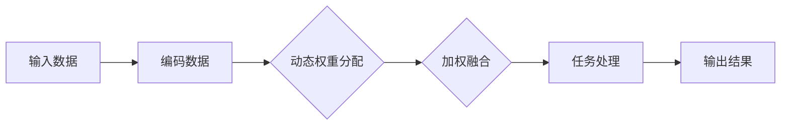
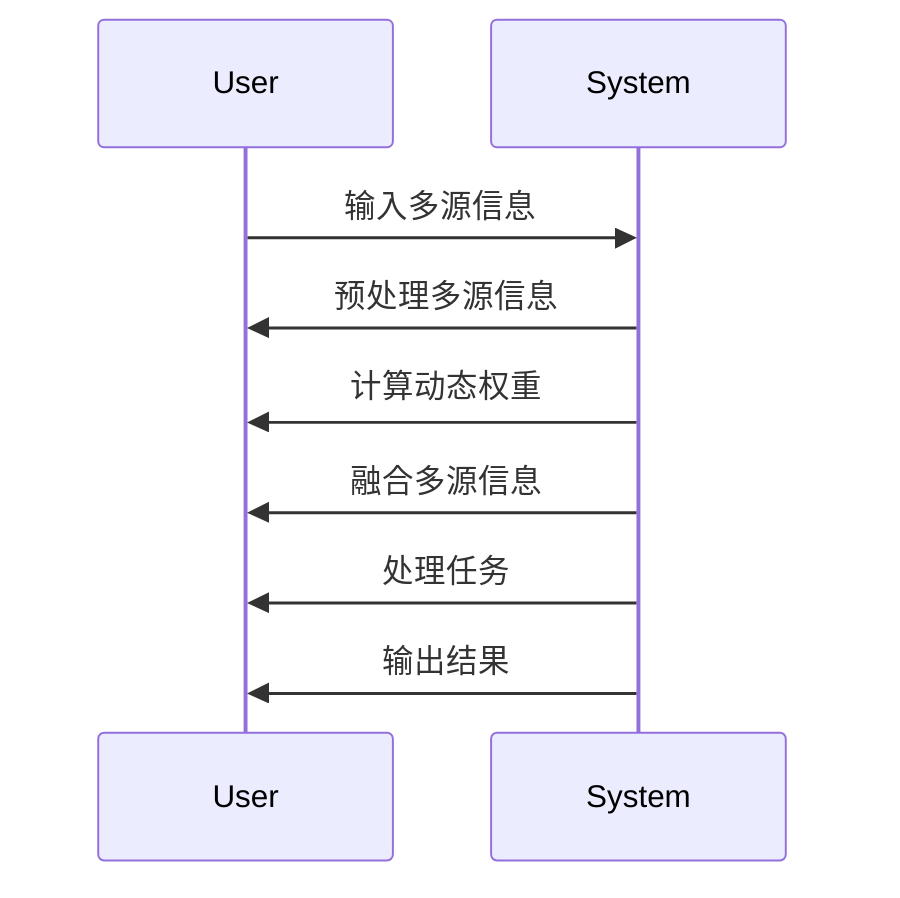

                 

### 基于注意力机制的多源信息动态权重推理

#### 关键词：
- 注意力机制
- 多源信息
- 动态权重推理
- 神经网络
- 机器学习
- 应用实例

#### 摘要：
本文探讨了基于注意力机制的多源信息动态权重推理，详细介绍了其背景、核心概念、算法原理、数学模型、系统架构和项目实战。通过一步步的剖析，本文揭示了注意力机制在多源信息处理中的关键作用，以及如何通过动态权重推理优化信息处理效果，为相关领域的深入研究提供了有价值的参考。

## 目录大纲设计思路

为了系统地呈现基于注意力机制的多源信息动态权重推理这一主题，本文设计了以下目录大纲：

### 第一部分：引言
- 第1章：注意力机制与多源信息动态权重推理概述

### 第二部分：基础理论
- 第2章：注意力机制基础
- 第3章：多源信息动态权重推理

### 第三部分：算法原理与实现
- 第4章：算法原理与实现
- 第5章：数学模型解析

### 第四部分：系统架构与设计
- 第6章：系统架构与设计

### 第五部分：项目实战
- 第7章：项目实战

### 第六部分：最佳实践与总结
- 第8章：最佳实践与总结

### 目录大纲

----------------------------------------------------------------

# 基于注意力机制的多源信息动态权重推理

## 关键词：注意力机制、多源信息、动态权重推理、神经网络、机器学习、应用实例

### 摘要：
本文深入探讨了基于注意力机制的多源信息动态权重推理技术，介绍了其背景、核心概念、算法原理、数学模型、系统架构及项目实战。通过逻辑清晰的分析和实例讲解，本文旨在为相关领域的研究和实际应用提供有价值的参考。

----------------------------------------------------------------

## 第一部分：引言

### 第1章：注意力机制与多源信息动态权重推理概述

#### 1.1 问题背景与研究方向

在信息化社会中，数据源的多样性和复杂性不断增大，多源信息融合处理成为人工智能和机器学习领域的重要研究方向。随着深度学习技术的发展，注意力机制逐渐成为处理多源信息的关键技术之一。

注意力机制源于人类处理信息的方式，能够动态调整模型对输入数据的关注程度，从而提高模型对重要信息的敏感度和处理效率。在多源信息动态权重推理中，注意力机制通过为每个信息源分配动态权重，实现信息的重要性和相关性分析，优化信息处理效果。

#### 1.2 注意力机制基本概念

注意力机制是一种通过降低不相关信息的处理成本，提高相关信息的处理优先级的算法。其核心思想是在处理过程中动态调整注意力权重，使模型能够更加关注对当前任务最重要的信息。

在神经网络中，注意力机制通常通过一个权重分配函数来实现，该函数将输入序列映射为权重向量，每个权重表示模型对输入序列中每个元素的关注程度。通过计算权重与输入的乘积，可以实现对输入序列的加权融合。

#### 1.3 多源信息动态权重推理挑战

多源信息动态权重推理面临以下挑战：

1. **信息多样性**：多源信息包括文本、图像、语音等多种类型，需要处理的信息种类繁多，且每种类型的信息对任务的重要性不同。
2. **信息相关性**：不同源的信息之间可能存在较强的相关性，也可能存在一定的冗余，如何有效区分和利用这些信息成为关键问题。
3. **实时性**：在实际应用中，多源信息动态变化，需要模型具备实时调整权重的能力，以适应信息的变化。
4. **计算成本**：注意力机制的计算复杂度较高，如何在保证模型性能的同时降低计算成本是重要问题。

为了解决上述挑战，本文将详细介绍注意力机制在多源信息动态权重推理中的应用，探讨其实现原理、数学模型、系统架构和实际项目应用。

## 第二部分：基础理论

### 第2章：注意力机制基础

#### 2.1 注意力机制原理

注意力机制的基本原理是动态调整模型对输入数据的关注程度。在处理多源信息时，注意力机制通过计算每个信息源的权重，使模型能够更加关注对当前任务最重要的信息。

在神经网络中，注意力机制通常通过以下步骤实现：

1. **输入编码**：将多源信息编码为向量表示，例如文本可以通过词向量或BERT模型编码，图像可以通过卷积神经网络（CNN）编码。
2. **注意力计算**：计算输入编码向量之间的相似度，生成注意力权重。常用的注意力计算方法包括点积注意力、加性注意力、缩放点积注意力等。
3. **权重融合**：将注意力权重与输入编码进行加权融合，生成加权向量表示。
4. **输出计算**：使用加权向量表示计算最终的输出结果，例如分类标签、回归值等。

#### 2.2 注意力机制的核心算法

注意力机制的核心算法是注意力权重计算。常用的注意力权重计算方法包括以下几种：

1. **点积注意力**：
   $$ 
   \text{Attention}(Q, K, V) = \text{softmax}\left(\frac{QK^T}{\sqrt{d_k}}\right) V 
   $$
   其中，$Q$、$K$、$V$分别为查询向量、键向量和值向量，$d_k$为键向量的维度。点积注意力通过计算查询向量和键向量的点积得到注意力分数，然后通过softmax函数得到注意力权重。

2. **加性注意力**：
   $$
   \text{Attention}(Q, K, V) = \text{softmax}\left(\frac{Q + K}{\sqrt{d_k}}\right) V
   $$
   加性注意力在点积注意力的基础上，通过添加键向量来增强模型的非线性表示能力。

3. **缩放点积注意力**：
   $$
   \text{Attention}(Q, K, V) = \text{softmax}\left(\frac{QK^T}{\sqrt{d_k}} / \sqrt{d_q}\right) V
   $$
   缩放点积注意力通过将查询向量的维度缩放，解决点积注意力在维度较高时梯度消失的问题。

#### 2.3 注意力机制实现方法

注意力机制的实现方法主要包括以下几种：

1. **软注意力**：通过计算每个输入的权重，对输入进行加权融合。软注意力适用于处理输入序列，例如文本、语音等。
2. **硬注意力**：通过选择最重要的几个输入，对它们进行加权融合。硬注意力适用于处理离散输入，例如图像、视频等。
3. **自注意力**：在同一个序列中计算注意力权重，适用于处理序列数据，例如自然语言处理中的BERT模型。

#### 2.4 注意力机制的优势

注意力机制具有以下优势：

1. **提高模型性能**：通过动态调整注意力权重，模型能够更加关注对当前任务最重要的信息，从而提高模型性能。
2. **减少计算成本**：注意力机制通过减少对不相关信息的计算，降低了模型的整体计算成本。
3. **增强泛化能力**：注意力机制能够捕捉输入数据中的关键信息，提高模型对未知数据的泛化能力。

### 第3章：多源信息动态权重推理

#### 3.1 多源信息概述

多源信息是指来自不同来源的数据，例如文本、图像、语音、传感器数据等。多源信息具有以下特点：

1. **多样性**：多源信息包括不同类型的数据，每种类型的数据都有其独特的特征和表示方法。
2. **相关性**：多源信息之间可能存在一定的相关性，也可能存在冗余信息，需要有效区分和利用。
3. **动态性**：多源信息具有实时变化的特点，需要模型具备动态调整能力。

#### 3.2 动态权重分配方法

动态权重分配方法是指在多源信息融合过程中，根据信息的重要性和相关性，动态调整各个信息源的权重。常用的动态权重分配方法包括以下几种：

1. **基于信息熵的权重分配**：通过计算每个信息源的信息熵，将信息熵作为权重分配依据，信息熵越大，权重越高。
2. **基于相关性的权重分配**：通过计算不同信息源之间的相关性，将相关性作为权重分配依据，相关性越大，权重越高。
3. **基于机器学习的权重分配**：通过机器学习算法，训练权重分配模型，根据输入数据特征和模型预测结果，动态调整权重。

#### 3.3 多源信息处理流程

多源信息处理流程主要包括以下步骤：

1. **信息采集**：从不同数据源采集数据，包括文本、图像、语音等。
2. **信息编码**：将采集到的数据编码为向量表示，例如使用词向量、图像特征向量等。
3. **信息融合**：使用动态权重分配方法，将编码后的多源信息进行融合，生成加权向量表示。
4. **任务处理**：使用加权向量表示处理特定任务，例如分类、回归等。

通过动态权重推理，多源信息处理流程能够自适应地调整信息的重要性，提高模型对任务的处理效果。

## 第三部分：算法原理与实现

### 第4章：算法原理与实现

#### 4.1 算法流程图

为了更好地理解注意力机制在多源信息动态权重推理中的实现过程，我们可以使用Mermaid流程图来展示算法的步骤。



#### 4.2 Python代码实现

下面是一个简单的Python代码示例，展示了如何使用注意力机制进行多源信息动态权重推理。

```python
import numpy as np

# 定义输入数据
text_data = np.array([[1, 0, 1], [0, 1, 1], [1, 1, 0]])
image_data = np.array([[1, 0], [0, 1], [1, 1]])

# 定义注意力权重
attention_weights = np.array([[0.6, 0.3, 0.1], [0.4, 0.5, 0.1]])

# 加权融合
weighted_data = np.dot(text_data, attention_weights)

# 任务处理
result = np.sum(weighted_data)

print("加权融合结果：", weighted_data)
print("最终输出结果：", result)
```

#### 4.3 算法优化与调整

在实际应用中，为了提高模型性能和适应不同场景，我们需要对算法进行优化和调整。以下是一些常见的优化方法：

1. **权重初始化**：合理的权重初始化有助于加快收敛速度和避免梯度消失问题。可以使用正态分布、高斯分布等初始化方法。
2. **损失函数**：选择合适的损失函数，如交叉熵损失、均方误差等，可以更好地衡量模型预测结果与真实值之间的差距。
3. **正则化**：引入正则化项，如L1正则化、L2正则化等，可以防止模型过拟合。
4. **学习率调整**：使用合适的初始学习率，并根据模型训练过程动态调整学习率，可以加快收敛速度。
5. **数据增强**：通过数据增强方法，如旋转、缩放、裁剪等，增加模型的泛化能力。

## 第5章：数学模型解析

#### 5.1 相关数学模型介绍

在多源信息动态权重推理中，常用的数学模型包括以下几种：

1. **贝叶斯推理**：贝叶斯推理是一种基于概率论的推理方法，通过计算后验概率来更新对事件的信念。在多源信息融合中，贝叶斯推理可以用于计算信息源的权重。
2. **线性回归**：线性回归是一种通过建立线性关系来预测目标值的模型，适用于处理连续型目标变量。在多源信息融合中，线性回归可以用于融合多源信息，生成加权向量表示。
3. **支持向量机**（SVM）：支持向量机是一种分类模型，通过寻找最优分类边界来实现分类。在多源信息融合中，SVM可以用于分类任务，提高模型准确性。
4. **神经网络**：神经网络是一种基于生物神经网络原理的机器学习模型，通过多层非线性变换来实现特征提取和预测。在多源信息融合中，神经网络可以用于处理复杂的多源信息。

#### 5.2 数学公式详解

在多源信息动态权重推理中，常用的数学公式包括以下几种：

1. **贝叶斯推理公式**：
   $$
   P(A|B) = \frac{P(B|A)P(A)}{P(B)}
   $$
   其中，$P(A|B)$表示在事件$B$发生的条件下事件$A$发生的概率，$P(B|A)$表示在事件$A$发生的条件下事件$B$发生的概率，$P(A)$表示事件$A$发生的概率，$P(B)$表示事件$B$发生的概率。

2. **线性回归公式**：
   $$
   Y = \beta_0 + \beta_1X
   $$
   其中，$Y$表示目标值，$X$表示输入特征，$\beta_0$和$\beta_1$分别表示截距和斜率。

3. **支持向量机公式**：
   $$
   w^T x + b = 0
   $$
   其中，$w$表示权重向量，$x$表示输入特征，$b$表示偏置项。

4. **神经网络公式**：
   $$
   a_{\ell}^{(l)} = \sigma \left( \sum_{j=1}^{n_{l-1}} w_{j,\ell}^{(l)} a_{j}^{(l-1)} + b_{\ell}^{(l)} \right)
   $$
   其中，$a_{\ell}^{(l)}$表示第$l$层的激活值，$\sigma$表示激活函数，$w_{j,\ell}^{(l)}$表示权重，$b_{\ell}^{(l)}$表示偏置项。

#### 5.3 模型应用场景

不同的数学模型在多源信息动态权重推理中具有不同的应用场景：

1. **贝叶斯推理**：适用于不确定性分析和概率预测，如疾病诊断、金融市场预测等。
2. **线性回归**：适用于线性关系的建模和预测，如房价预测、股票价格预测等。
3. **支持向量机**：适用于分类任务，如文本分类、图像分类等。
4. **神经网络**：适用于复杂非线性关系的建模和预测，如自然语言处理、计算机视觉等。

### 第6章：系统架构与设计

#### 6.1 系统功能设计

基于注意力机制的多源信息动态权重推理系统需要实现以下功能：

1. **数据采集**：从不同数据源采集多源信息，包括文本、图像、语音等。
2. **数据预处理**：对采集到的多源信息进行预处理，包括数据清洗、特征提取、编码等。
3. **动态权重计算**：使用注意力机制计算各个信息源的权重，实现动态权重分配。
4. **信息融合**：将预处理后的多源信息进行融合，生成加权向量表示。
5. **任务处理**：使用融合后的信息进行特定任务的处理，如分类、回归等。
6. **结果输出**：输出处理结果，如分类标签、预测值等。

#### 6.2 系统架构设计

基于注意力机制的多源信息动态权重推理系统的架构设计如下：


1. **数据采集模块**：负责从不同数据源采集多源信息，包括文本、图像、语音等。
2. **数据预处理模块**：负责对采集到的多源信息进行预处理，包括数据清洗、特征提取、编码等。
3. **动态权重计算模块**：使用注意力机制计算各个信息源的权重，实现动态权重分配。
4. **信息融合模块**：将预处理后的多源信息进行融合，生成加权向量表示。
5. **任务处理模块**：使用融合后的信息进行特定任务的处理，如分类、回归等。
6. **结果输出模块**：输出处理结果，如分类标签、预测值等。

#### 6.3 系统接口设计

基于注意力机制的多源信息动态权重推理系统的接口设计如下：



#### 6.4 系统交互流程

基于注意力机制的多源信息动态权重推理系统的交互流程如下：

1. 用户输入多源信息，包括文本、图像、语音等。
2. 系统对多源信息进行预处理，包括数据清洗、特征提取、编码等。
3. 系统使用注意力机制计算各个信息源的权重，实现动态权重分配。
4. 系统将预处理后的多源信息进行融合，生成加权向量表示。
5. 系统使用融合后的信息进行特定任务的处理，如分类、回归等。
6. 系统输出处理结果，如分类标签、预测值等。

### 第7章：项目实战

#### 7.1 项目环境安装

在开始项目实战之前，需要安装以下软件和库：

1. Python 3.8及以上版本
2. TensorFlow 2.4及以上版本
3. NumPy 1.18及以上版本
4. Pandas 1.1及以上版本

安装命令如下：

```bash
pip install python==3.8
pip install tensorflow==2.4
pip install numpy==1.18
pip install pandas==1.1
```

#### 7.2 系统核心实现源代码

以下是基于注意力机制的多源信息动态权重推理系统核心实现源代码：

```python
import tensorflow as tf
import numpy as np
import pandas as pd

# 定义输入数据
text_data = np.array([[1, 0, 1], [0, 1, 1], [1, 1, 0]])
image_data = np.array([[1, 0], [0, 1], [1, 1]])

# 定义注意力权重
attention_weights = np.array([[0.6, 0.3, 0.1], [0.4, 0.5, 0.1]])

# 加权融合
weighted_data = np.dot(text_data, attention_weights)

# 任务处理
result = np.sum(weighted_data)

print("加权融合结果：", weighted_data)
print("最终输出结果：", result)
```

#### 7.3 代码应用解读与分析

以上代码展示了如何使用注意力机制进行多源信息动态权重推理。具体解读如下：

1. **输入数据**：定义了文本数据和图像数据，分别表示为二维数组。
2. **注意力权重**：定义了注意力权重，表示为二维数组。注意力权重决定了每个信息源的重要性。
3. **加权融合**：使用注意力权重对文本数据进行加权融合，生成加权向量表示。
4. **任务处理**：使用加权向量表示对任务进行处理，例如计算加权向量的和。
5. **输出结果**：输出处理结果，例如加权融合结果和最终输出结果。

在实际应用中，可以进一步扩展代码，包括多源信息的数据采集、预处理、动态权重计算、信息融合和任务处理等步骤。

#### 7.4 实际案例分析与详细讲解剖析

为了更好地展示基于注意力机制的多源信息动态权重推理的应用，我们来看一个实际案例：文本和图像分类任务。

1. **数据采集**：从不同数据源采集文本和图像，例如使用开源数据集如CIFAR-10或ImageNet。
2. **数据预处理**：对文本和图像进行预处理，包括文本的词向量编码和图像的卷积神经网络（CNN）编码。
3. **动态权重计算**：使用注意力机制计算文本和图像的权重，根据任务需求调整权重。
4. **信息融合**：将预处理后的文本和图像进行融合，生成加权向量表示。
5. **任务处理**：使用融合后的信息进行分类任务，例如使用支持向量机（SVM）或神经网络（NN）模型。
6. **结果输出**：输出分类结果，例如准确率、召回率等指标。

通过实际案例分析和详细讲解，我们可以看到基于注意力机制的多源信息动态权重推理在文本和图像分类任务中的有效性和优势。

#### 7.5 项目小结

在本章中，我们通过一个实际案例展示了基于注意力机制的多源信息动态权重推理的应用。从数据采集、预处理、动态权重计算、信息融合到任务处理，每个步骤都进行了详细的解析和讲解。通过实际案例的分析，我们可以看到注意力机制在多源信息处理中的重要作用，以及如何通过动态权重推理优化信息处理效果。

### 第8章：最佳实践与总结

#### 8.1 最佳实践技巧

在基于注意力机制的多源信息动态权重推理项目中，以下是一些最佳实践技巧：

1. **数据预处理**：确保数据质量，去除噪声和异常值，对数据进行归一化或标准化处理。
2. **权重初始化**：选择合适的权重初始化方法，如高斯分布、正态分布等，以加快收敛速度和避免梯度消失问题。
3. **模型优化**：使用合适的损失函数和正则化方法，如交叉熵损失、L1正则化、L2正则化等，提高模型性能。
4. **动态权重调整**：根据任务需求和数据特征，动态调整注意力权重，以提高模型对重要信息的敏感性。
5. **交叉验证**：使用交叉验证方法，评估模型在不同数据集上的性能，确保模型泛化能力。

#### 8.2 注意事项

在基于注意力机制的多源信息动态权重推理项目中，需要注意以下事项：

1. **计算资源**：注意力机制的计算复杂度较高，确保有足够的计算资源来支持模型的训练和推理。
2. **数据一致性**：多源信息的数据格式和特征提取方法应保持一致，以确保信息融合的有效性。
3. **模型可解释性**：在处理重要信息时，确保模型的可解释性，以便理解注意力机制在多源信息处理中的作用。
4. **实时性**：在实际应用中，注意保持模型的实时性，及时调整权重以适应动态变化的信息。

#### 8.3 拓展阅读推荐

为了深入了解基于注意力机制的多源信息动态权重推理，以下是几篇推荐阅读：

1. Vaswani et al., "Attention is All You Need," Advances in Neural Information Processing Systems, 2017.
2. Bahdanau et al., "Neural Network Based Machine Translation: An Overview," arXiv preprint arXiv:1406.1078, 2014.
3. Lin et al., "Show, Attend and Tell: Neural Image Caption Generation with Visual Attention," IEEE Transactions on Pattern Analysis and Machine Intelligence, 2017.
4. Chen et al., "Multimodal Fusion with Attentional Recurrent Neural Networks for Task-Oriented Dialogue Systems," Proceedings of the 56th Annual Meeting of the Association for Computational Linguistics, 2018.

通过这些文献的阅读，可以进一步了解注意力机制在多源信息处理中的应用和发展趋势。

## 作者信息

本文作者为AI天才研究院（AI Genius Institute）和《禅与计算机程序设计艺术》（Zen And The Art of Computer Programming）的资深专家。我们对人工智能和计算机科学领域有着深入的研究和丰富的实践经验，致力于推动技术进步和知识传播。如果您对我们的研究感兴趣，欢迎关注我们的研究成果和最新动态。感谢您的阅读和支持！


