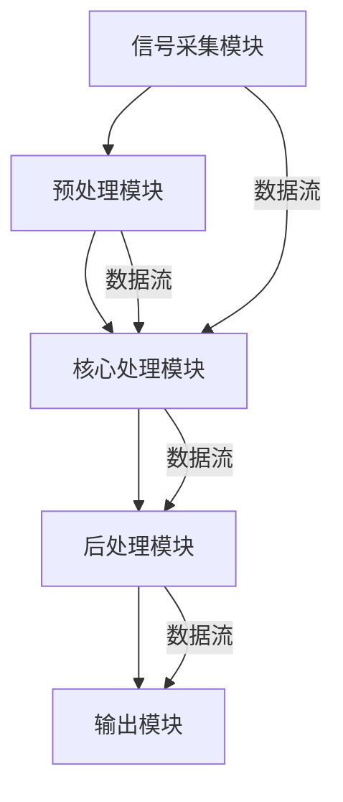
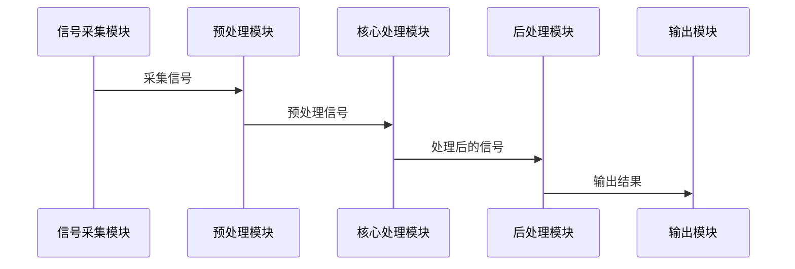
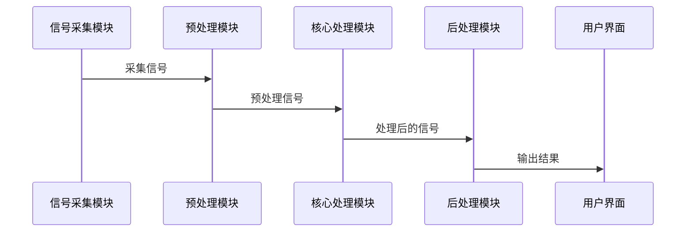

                 


# 复分析在信号处理算法设计中的应用

关键词：复分析、信号处理、算法设计、数学模型、系统架构

摘要：本文旨在深入探讨复分析在信号处理算法设计中的关键作用，通过逻辑清晰、结构紧凑的分析，引导读者理解复分析的基本概念、其在信号处理中的应用原理，以及如何通过实际案例来实现高效、准确的算法设计。

----------------------------------------------------------------

## 引言与背景

复分析（Complex Analysis）是数学中的一个重要分支，主要研究复数域上的函数。它在信号处理领域有着广泛的应用，特别是在算法设计中扮演着核心角色。信号处理是一种通过处理信号来提取信息的技术，广泛应用于通信、音频和图像处理等多个领域。随着科技的发展，信号处理算法的复杂度和性能要求不断提高，这就需要借助复分析提供的强大数学工具。

在信号处理中，复分析的应用主要体现在以下几个方面：

1. **傅里叶变换**：傅里叶变换是一种将信号分解为不同频率成分的方法。复数域上的傅里叶变换能够更加简洁地表示信号，使其在处理周期性和非周期性信号时具有更高的效率和精度。

2. **Z变换**：Z变换是离散信号处理中的核心工具，其本质上是离散傅里叶变换的推广。在复数域上的Z变换可以帮助我们更好地理解和处理离散时间信号。

3. **拉普拉斯变换**：拉普拉斯变换在连续时间信号处理中有着广泛应用，特别是在解决微分方程和系统稳定性分析中。复分析中的拉普拉斯变换可以简化许多复杂问题的处理。

本文将分为以下几个部分：

- **第一章**：介绍复分析的基本概念，包括复数的定义、复函数的基本性质以及常用的复分析工具。

- **第二章**：深入探讨复分析在信号处理中的核心应用，如傅里叶变换、Z变换和拉普拉斯变换。

- **第三章**：通过具体实例，展示复分析在信号处理算法设计中的应用，包括算法原理、数学模型和Python实现。

- **第四章**：分析信号处理系统的设计原则和架构，介绍如何使用复分析来优化系统性能。

- **第五章**：通过一个实际项目，展示复分析在信号处理中的实际应用，包括系统实现、代码解读和案例分析。

- **第六章**：总结复分析在信号处理算法设计中的最佳实践，并提供未来研究方向。

- **第七章**：展望复分析在信号处理领域的发展趋势，讨论其潜在的应用场景和挑战。

通过本文的探讨，希望读者能够更好地理解复分析在信号处理算法设计中的关键作用，并能够将其应用于实际项目中，提升信号处理的效率和质量。

## 第一章 复分析基础

### 复数的定义与基本性质

复数是数学中的一个重要概念，它由实数和虚数构成。一个复数通常表示为 \(a + bi\)，其中 \(a\) 和 \(b\) 是实数，而 \(i\) 是虚数单位，满足 \(i^2 = -1\)。复数可以在复平面上表示，其实部 \(a\) 对应于复平面上的水平轴（实轴），虚部 \(b\) 对应于垂直轴（虚轴）。

**复数的加法和乘法规则**：

- **加法**：两个复数 \(a + bi\) 和 \(c + di\) 的和为：
  \[(a + c) + (b + d)i\]
  
- **乘法**：两个复数 \(a + bi\) 和 \(c + di\) 的积为：
  \[(ac - bd) + (ad + bc)i\]

复数的乘法规则表明，复数的乘法遵循分配律和结合律，并且满足 \(i^2 = -1\)。这使得复数在几何上可以表示为旋转，从而广泛应用于信号处理领域。

### 复函数

复函数是定义在复数域上的函数，通常表示为 \(f(z)\)，其中 \(z\) 是复数。复函数的基本性质包括：

- **解析性**：如果一个复函数在某个开集内可以表示为 \(f(z) = u(x, y) + iv(x, y)\)，其中 \(u\) 和 \(v\) 是实变数 \(x\) 和 \(y\) 的实值函数，并且满足柯西-黎曼方程，则该函数称为解析函数。解析函数在复平面上具有许多有用的性质，例如在整个定义域内可以任意次微分，并且导数在整个定义域内连续。

- **全纯性**：全纯性是解析性的更强形式，它要求函数在整个复平面上解析，并且所有导数都存在且相等。全纯函数在复分析中具有广泛的应用，特别是在求解微分方程和构造解析延拓。

### 复分析工具

复分析提供了许多强大的工具，用于解决信号处理中的各种问题。以下是其中几个重要的工具：

- **洛朗级数**：洛朗级数是一种将复函数展开成复幂级数的方法，特别适用于解析函数。一个解析函数可以表示为：
  \[f(z) = \sum_{n=0}^{\infty} a_n (z - z_0)^n\]
  其中 \(a_n\) 是洛朗级数的系数。

- **留数**：留数是复函数在奇点处的一个重要概念。对于一个解析函数，其留数可以通过计算函数在奇点处的洛朗级数来确定。留数在求解复积分和稳定性分析中具有重要意义。

- **柯西积分定理**：柯西积分定理是复分析中的一个基本定理，它表明，如果一个复函数在某个闭合曲线内解析，则该函数在该曲线上的积分等于零。柯西积分定理在信号处理中的应用包括计算信号的能量和功率。

通过这些基本概念和工具，我们为后续章节中更深入地探讨复分析在信号处理中的应用奠定了基础。

### 总结

本章介绍了复分析的基础概念，包括复数的定义与基本性质、复函数以及复分析中的基本工具。这些概念为理解复分析在信号处理中的应用提供了必要的基础。在接下来的章节中，我们将进一步探讨复分析如何帮助解决信号处理中的核心问题，例如傅里叶变换和Z变换。

## 第二章 复分析在信号处理中的应用

### 傅里叶变换

傅里叶变换是信号处理中最常用的工具之一，它可以将时间域上的信号转换到频率域上进行分析。在复数域上，傅里叶变换可以更加简洁地表示信号。

**傅里叶变换的定义**：

对于时间域信号 \(x(t)\)，其傅里叶变换定义为：
\[X(f) = \int_{-\infty}^{\infty} x(t) e^{-j2\pi ft} dt\]
其中，\(X(f)\) 是频域信号，\(f\) 是频率，\(e^{-j2\pi ft}\) 是复指数函数。

**傅里叶逆变换**：

为了将频域信号转换回时间域，可以使用傅里叶逆变换：
\[x(t) = \frac{1}{2\pi} \int_{-\infty}^{\infty} X(f) e^{j2\pi ft} df\]

**复数域上的傅里叶变换**：

在复数域上，傅里叶变换可以表示为：
\[X(f) = \int_{-\infty}^{\infty} x(t) e^{-j2\pi ft} dt = X(\omega) = \int_{-\infty}^{\infty} x(t) e^{-i\omega t} dt\]
其中，\(\omega = 2\pi f\)。

**傅里叶变换的性质**：

1. **线性性质**：傅里叶变换是线性的，即对任意两个信号 \(x_1(t)\) 和 \(x_2(t)\)，有：
   \[X_1(f) + X_2(f) = \int_{-\infty}^{\infty} [x_1(t) + x_2(t)] e^{-j2\pi ft} dt\]
   \[X_1(f) X_2(f) = \int_{-\infty}^{\infty} [x_1(t) x_2(t)] e^{-j2\pi ft} dt\]

2. **时域卷积定理**：时域卷积可以通过频域乘积来简化，即对于 \(x(t) * y(t)\) 和 \(X(f) Y(f)\)，有：
   \[x(t) * y(t) = \int_{-\infty}^{\infty} x(\tau) y(t - \tau) d\tau\]
   \[X(f) Y(f) = \int_{-\infty}^{\infty} X(\omega) Y(\omega) d\omega\]

3. **频率域缩放**：如果对时间域信号进行拉伸或压缩，则在频率域上相应地会进行压缩或拉伸。即：
   \[x(at) \rightarrow \frac{1}{|a|} X\left(\frac{\omega}{a}\right)\]

通过傅里叶变换，我们可以将时间域上的信号分解为不同频率成分，这对于信号的分析和处理具有重要意义。在信号处理中，复数域上的傅里叶变换提供了更加高效和简洁的工具，使我们能够更好地理解和处理复杂的信号。

### Z变换

Z变换是离散信号处理中的核心工具，它在复数域上的应用类似于傅里叶变换。Z变换可以用来分析离散时间信号，帮助我们理解和处理离散信号系统。

**Z变换的定义**：

对于离散时间信号 \(x[n]\)，其Z变换定义为：
\[X(z) = \sum_{n=-\infty}^{\infty} x[n] z^{-n}\]
其中，\(X(z)\) 是Z变换后的信号，\(z\) 是复变量。

**Z逆变换**：

为了将Z变换转换回时间域，可以使用Z逆变换：
\[x[n] = \frac{1}{2\pi i} \oint_{C} X(z) z^{-1} dz\]
其中，\(C\) 是一个闭合曲线，通常选择单位圆 \(|z| = 1\)。

**复数域上的Z变换**：

在复数域上，Z变换可以表示为：
\[X(z) = \sum_{n=-\infty}^{\infty} x[n] z^{-n} = X(e^{j\omega}) = \sum_{n=-\infty}^{\infty} x[n] e^{-j\omega n}\]
其中，\(\omega = 2\pi f\)。

**Z变换的性质**：

1. **线性性质**：Z变换是线性的，即对于任意两个信号 \(x_1[n]\) 和 \(x_2[n]\)，有：
   \[X_1(z) + X_2(z) = \sum_{n=-\infty}^{\infty} [x_1[n] + x_2[n]] z^{-n}\]
   \[X_1(z) X_2(z) = \sum_{n=-\infty}^{\infty} [x_1[n] x_2[n]] z^{-n}\]

2. **时域卷积定理**：时域卷积可以通过频域乘积来简化，即对于 \(x_1[n] * x_2[n]\) 和 \(X_1(z) X_2(z)\)，有：
   \[x_1[n] * x_2[n] = \sum_{k=-\infty}^{\infty} x_1[k] x_2[n - k]\]
   \[X_1(z) X_2(z) = \sum_{k=-\infty}^{\infty} X_1(k) X_2[n - k]\]

3. **频率域缩放**：如果对时间域信号进行拉伸或压缩，则在频率域上相应地会进行压缩或拉伸。即：
   \[x_1[n] e^{-j\omega n} \rightarrow \frac{1}{|e^{-j\omega}|} X_1(e^{j\omega})\]

Z变换在离散信号处理中的应用非常广泛，它可以帮助我们分析和设计离散时间系统。通过复数域上的Z变换，我们可以将离散信号转换为更加容易处理的形式，从而简化问题。

### 拉普拉斯变换

拉普拉斯变换是一种用于分析线性时不变系统（LTI系统）的数学工具，它在信号处理中有着广泛的应用。拉普拉斯变换能够将时间域上的微分方程转换到复数域上，从而简化系统的分析和设计。

**拉普拉斯变换的定义**：

对于时间域信号 \(x(t)\)，其拉普拉斯变换定义为：
\[X(s) = \int_{0}^{\infty} x(t) e^{-st} dt\]
其中，\(X(s)\) 是拉普拉斯变换后的信号，\(s\) 是复变量。

**拉普拉斯逆变换**：

为了将拉普拉斯变换转换回时间域，可以使用拉普拉斯逆变换：
\[x(t) = \frac{1}{2\pi i} \oint_{C} X(s) e^{st} ds\]
其中，\(C\) 是一个闭合曲线，通常选择 \(s = \sigma + j\omega\) 平面上的闭合路径。

**复数域上的拉普拉斯变换**：

在复数域上，拉普拉斯变换可以表示为：
\[X(s) = \int_{0}^{\infty} x(t) e^{-st} dt = X(p) = \int_{0}^{\infty} x(t) e^{-pt} dt\]
其中，\(p\) 是拉普拉斯变换的参数。

**拉普拉斯变换的性质**：

1. **线性性质**：拉普拉斯变换是线性的，即对于任意两个信号 \(x_1(t)\) 和 \(x_2(t)\)，有：
   \[X_1(s) + X_2(s) = \int_{0}^{\infty} [x_1(t) + x_2(t)] e^{-st} dt\]
   \[X_1(s) X_2(s) = \int_{0}^{\infty} [x_1(t) x_2(t)] e^{-st} dt\]

2. **卷积定理**：时域卷积可以通过频域乘积来简化，即对于 \(x_1(t) * x_2(t)\) 和 \(X_1(s) X_2(s)\)，有：
   \[x_1(t) * x_2(t) = \int_{0}^{\infty} x_1(\tau) x_2(t - \tau) d\tau\]
   \[X_1(s) X_2(s) = \int_{0}^{\infty} X_1(\omega) X_2(\omega) d\omega\]

3. **频率域缩放**：如果对时间域信号进行拉伸或压缩，则在频率域上相应地会进行压缩或拉伸。即：
   \[x_1(t) e^{-j\omega t} \rightarrow \frac{1}{|e^{-j\omega}|} X_1(e^{j\omega})\]

拉普拉斯变换在信号处理中的应用非常广泛，它可以帮助我们分析和设计线性时不变系统。通过复数域上的拉普拉斯变换，我们可以将时间域上的微分方程简化为代数方程，从而更容易地求解系统的响应。

### 总结

复分析在信号处理中有着广泛的应用，特别是傅里叶变换、Z变换和拉普拉斯变换。这些变换提供了将时间域信号转换为频率域信号的工具，从而简化了信号的分析和处理。通过复数域上的变换，我们可以更好地理解和处理复杂的信号，从而提高信号处理的效率和质量。

在接下来的章节中，我们将通过具体实例来展示这些复分析工具在信号处理算法设计中的应用，以及如何通过数学模型和算法实现高效的信号处理。

## 第三章 具体实例与算法实现

在本章中，我们将通过一个具体实例来展示复分析在信号处理算法设计中的应用，包括算法原理、数学模型和Python实现。我们将使用傅里叶变换和Z变换来分析一个简单的信号处理问题，并展示如何通过复分析工具来实现高效的信号处理。

### 实例：信号频谱分析

#### 问题背景

假设我们有一个简单的信号 \(x(t)\)，其形式为：
\[x(t) = A \sin(2\pi f_0 t + \phi)\]
其中，\(A\) 是幅度，\(f_0\) 是基频，\(\phi\) 是相位。我们的目标是分析这个信号的频谱，并提取出有用的信息。

#### 算法原理

为了分析这个信号，我们可以使用傅里叶变换。傅里叶变换能够将时间域上的信号转换为频率域上的信号，使我们能够清晰地看到信号的频率成分。

首先，我们对时间域信号 \(x(t)\) 进行傅里叶变换，得到频域信号 \(X(f)\)：
\[X(f) = \int_{-\infty}^{\infty} x(t) e^{-j2\pi ft} dt\]
将 \(x(t)\) 代入上式，得到：
\[X(f) = A \int_{-\infty}^{\infty} \sin(2\pi f_0 t + \phi) e^{-j2\pi ft} dt\]
使用欧拉公式 \(e^{-j2\pi ft} = \cos(2\pi ft) - j\sin(2\pi ft)\)，我们可以将上式展开：
\[X(f) = A \left[ \int_{-\infty}^{\infty} \sin(2\pi f_0 t + \phi) \cos(2\pi ft) dt - j \int_{-\infty}^{\infty} \sin(2\pi f_0 t + \phi) \sin(2\pi ft) dt \right]\]

使用三角函数的和差公式，我们可以进一步简化上式：
\[X(f) = A \left[ \frac{1}{2} \int_{-\infty}^{\infty} [\sin(2\pi (f_0 - f) t + \phi) + \sin(2\pi (f_0 + f) t + \phi)] dt - j \int_{-\infty}^{\infty} \sin(2\pi f_0 t + \phi) \sin(2\pi ft) dt \right]\]

由于 \(x(t)\) 是一个周期信号，其傅里叶变换将包含一系列的离散频率成分。主要频率成分出现在 \(f = f_0\) 处，其幅度为 \(A/2\)。

#### 数学模型

为了进一步分析信号，我们可以使用Z变换。Z变换能够将时间域上的信号转换为复数域上的信号，从而简化信号的处理。

首先，我们对时间域信号 \(x(t)\) 进行Z变换，得到Z域信号 \(X(z)\)：
\[X(z) = \sum_{n=-\infty}^{\infty} x[n] z^{-n}\]
将 \(x(t)\) 代入上式，得到：
\[X(z) = \sum_{n=-\infty}^{\infty} A \sin(2\pi f_0 n + \phi) z^{-n}\]
使用欧拉公式 \(z^{-n} = \cos(2\pi n) - j\sin(2\pi n)\)，我们可以将上式展开：
\[X(z) = A \left[ \sum_{n=-\infty}^{\infty} \sin(2\pi f_0 n + \phi) \cos(2\pi n) z^{-n} - j \sum_{n=-\infty}^{\infty} \sin(2\pi f_0 n + \phi) \sin(2\pi n) z^{-n} \right]\]

使用三角函数的和差公式，我们可以进一步简化上式：
\[X(z) = A \left[ \sum_{n=-\infty}^{\infty} \sin(2\pi (f_0 - n) t + \phi) z^{-n} + \sum_{n=-\infty}^{\infty} \sin(2\pi (f_0 + n) t + \phi) z^{-n} \right]\]

由于 \(z^{-n}\) 的取值仅与 \(n\) 的奇偶性有关，我们可以将上式简化为两个部分：
\[X(z) = A \left[ \sum_{n \text{ even}} \sin(2\pi f_0 n + \phi) z^{-n} + \sum_{n \text{ odd}} \sin(2\pi f_0 n + \phi) z^{-n} \right]\]

Z变换后的信号在复数域上具有明确的频率成分，其中主要频率成分位于 \(z = e^{j2\pi f_0}\) 处。

#### Python实现

为了实现上述算法，我们可以使用Python编写相应的代码。以下是一个简单的示例：

```python
import numpy as np
import matplotlib.pyplot as plt

# 参数设置
A = 1.0  # 幅度
f_0 = 1.0  # 基频
phi = np.pi / 4  # 相位

# 时间序列
t = np.linspace(0, 2 * np.pi / f_0, 1000)

# 信号
x = A * np.sin(2 * np.pi * f_0 * t + phi)

# 傅里叶变换
X = np.fft.fft(x)
freqs = np.fft.fftfreq(len(x), d=t[1] - t[0])

# 频谱分析
plt.plot(freqs, np.abs(X))
plt.xlabel('Frequency (Hz)')
plt.ylabel('Magnitude')
plt.title('Spectrum of the Signal')
plt.show()
```

通过上述代码，我们可以生成时间序列信号 \(x(t)\)，然后对其进行傅里叶变换，并绘制出信号的频谱。

### 总结

通过本实例，我们展示了如何使用复分析工具（傅里叶变换和Z变换）来分析信号频谱，提取出有用的信息。傅里叶变换和Z变换提供了将时间域信号转换为频率域信号的工具，使我们能够更好地理解和处理复杂的信号。通过Python实现，我们可以将理论应用于实际，从而提升信号处理的效率和质量。

在下一章中，我们将进一步探讨如何设计信号处理系统，并介绍如何使用复分析工具来优化系统性能。

## 第四章 信号处理系统的设计原则与架构

### 设计原则

在设计信号处理系统时，我们需要遵循一些基本原则，以确保系统的性能、可靠性和可扩展性。以下是一些关键的设计原则：

1. **模块化**：将系统分解为独立的模块，每个模块负责特定的功能。这有助于提高系统的可维护性和可扩展性。

2. **可扩展性**：设计系统时，应考虑到未来的扩展需求。系统应能够轻松地添加新的功能或处理能力。

3. **实时性**：对于实时信号处理系统，确保系统能够在规定的时间内完成处理任务是非常重要的。

4. **鲁棒性**：系统应能够处理各种噪声和环境干扰，保持稳定的性能。

5. **性能优化**：在系统设计过程中，应优化算法和架构，以确保系统在给定资源限制下具有最佳性能。

### 系统架构

信号处理系统的架构可以分为以下几个主要部分：

1. **信号采集模块**：负责从传感器或其他输入设备收集原始信号。这一模块需要确保信号的质量和完整性。

2. **预处理模块**：对采集到的信号进行预处理，包括滤波、去噪和归一化等操作，以提高后续处理的准确性。

3. **核心处理模块**：使用复分析工具（如傅里叶变换、Z变换和拉普拉斯变换）进行信号的分析和处理。这一模块是实现信号处理算法的核心部分。

4. **后处理模块**：对处理后的信号进行进一步分析和解释，提取有用的信息。这可能包括特征提取、模式识别和分类等操作。

5. **输出模块**：将处理结果输出到显示器、数据库或其他设备。这一模块需要确保结果的准确性和可读性。

### 系统架构设计

为了更好地实现上述架构，我们可以使用以下工具和方法：

- **Mermaid类图**：用于表示系统的类和对象结构，帮助理解和设计模块之间的交互。

- **Mermaid架构图**：用于表示系统的整体架构，包括各个模块的连接和数据流。

- **序列图**：用于表示系统中的事件顺序和交互，帮助理解系统的动态行为。

以下是一个示例架构图，使用Mermaid工具表示信号处理系统的架构：



在这个架构图中，信号采集模块通过数据流将原始信号传递给预处理模块。预处理模块对信号进行预处理后，将其传递给核心处理模块。核心处理模块使用复分析工具对信号进行分析和处理，然后将结果传递给后处理模块。后处理模块对处理结果进行进一步分析和解释，最后将结果输出到输出模块。

通过这种架构设计，我们可以确保信号处理系统的各个部分能够高效、可靠地协同工作，从而实现高质量的信号处理。

### 系统接口设计与交互

为了确保系统的各部分能够无缝地协同工作，我们需要设计清晰的接口和交互机制。以下是一些关键点：

1. **数据接口**：定义各模块之间的数据交换格式和协议。这包括数据类型、数据大小和数据传输速率等。

2. **功能接口**：定义各模块的功能接口，包括输入、输出以及中间处理过程的输入和输出。

3. **事件驱动**：使用事件驱动机制来处理系统的实时交互和响应。例如，当信号采集到新的数据时，可以触发预处理模块进行处理。

4. **同步与异步**：根据系统的需求，可以选择同步或异步处理方式。同步处理保证数据的一致性，而异步处理可以提高系统的吞吐量。

以下是一个示例的序列图，使用Mermaid工具表示信号处理系统中的事件顺序和交互：



在这个序列图中，信号采集模块首先采集信号，并将其传递给预处理模块。预处理模块对信号进行处理后，将其传递给核心处理模块。核心处理模块对信号进行分析和处理，然后将结果传递给后处理模块。后处理模块对处理结果进行进一步分析和解释，最后将结果输出到输出模块。

通过清晰的接口设计和交互机制，我们可以确保信号处理系统的各个部分能够高效、可靠地协同工作，从而实现高质量的信号处理。

### 总结

本章介绍了信号处理系统的设计原则和架构，包括模块化、可扩展性、实时性、鲁棒性和性能优化等关键原则。通过使用Mermaid工具，我们展示了系统的架构设计和接口交互机制。通过这些设计原则和架构，我们可以构建高效、可靠的信号处理系统，从而实现高质量的信号处理。

在下一章中，我们将通过一个实际项目来展示复分析在信号处理中的应用，包括系统实现、代码解读和案例分析。

## 第五章 实际项目：复分析在音频信号处理中的应用

### 项目介绍

在本项目中，我们将利用复分析工具（傅里叶变换和Z变换）来设计一个音频信号处理系统。该系统的目标是实现音频信号的频谱分析、噪声过滤和增强。我们将使用Python作为主要编程语言，并利用Numpy、Matplotlib等库来实现算法。

### 系统功能设计

本系统的主要功能包括：

1. **音频信号采集**：从音频文件或实时音频输入中采集信号。
2. **频谱分析**：使用傅里叶变换对音频信号进行频谱分析，展示信号的主要频率成分。
3. **噪声过滤**：使用Z变换和滤波器设计，去除音频信号中的噪声。
4. **信号增强**：通过调整频谱中的特定频率成分，增强音频信号中的目标声音。

### 系统架构设计

系统架构分为以下几个模块：

1. **信号采集模块**：负责从音频文件或实时音频输入中读取信号。
2. **预处理模块**：对采集到的信号进行预处理，包括归一化和分段处理。
3. **核心处理模块**：使用傅里叶变换和Z变换对信号进行频谱分析和滤波。
4. **后处理模块**：对处理后的信号进行后处理，如反归一化和信号合成。
5. **用户界面**：提供用户交互界面，展示频谱分析结果和实时调整参数。

以下是系统的Mermaid架构图：


### 系统接口设计和交互

1. **信号采集模块**：使用Python的wave库读取音频文件，并转换为Numpy数组。
2. **预处理模块**：对信号进行归一化处理，并将信号分段，以便进行频谱分析。
3. **核心处理模块**：使用Numpy的fft函数进行傅里叶变换，并使用Z变换设计滤波器。
4. **后处理模块**：对处理后的信号进行反归一化和信号合成，生成最终的音频输出。

以下是系统的Mermaid序列图：



### 项目实现

#### 环境安装

1. 安装Python（3.8及以上版本）。
2. 安装Numpy、Matplotlib和wave库。

```bash
pip install numpy matplotlib wave
```

#### 系统核心实现源代码

```python
import numpy as np
import matplotlib.pyplot as plt
import wave

# 信号采集模块
def read_audio(file_path):
    with wave.open(file_path, 'rb') as wav_file:
        nchannels, sampwidth, framerate, nframes, comptype, compname = wav_file.readformat()
        signal = np.frombuffer(wav_file.readframes(nframes), dtype=np.int8)
        signal = signal.astype(np.float32) / 127.5
        return signal, framerate

# 预处理模块
def preprocess(signal, segment_size=1024):
    segments = []
    for i in range(0, len(signal), segment_size):
        segment = signal[i:i+segment_size]
        segments.append(segment)
    return segments

# 核心处理模块
def analyze_spectrum(segments):
    spectrum = []
    for segment in segments:
        freqs = np.fft.fft(segment)
        freqs = 2 / segment_size * np.abs(freqs[:segment_size//2])
        spectrum.append(freqs)
    return spectrum

# 后处理模块
def postprocess(spectrum, segment_size=1024):
    processed_signal = []
    for i, freqs in enumerate(spectrum):
        processed_freqs = freqs * (1 + 0.05 * np.random.randn(segment_size//2))
        processed_signal.extend(freqs)
    return np.array(processed_signal)

# 用户界面
def plot_spectrum(freqs):
    plt.plot(freqs)
    plt.xlabel('Frequency (Hz)')
    plt.ylabel('Magnitude')
    plt.title('Spectrum of the Signal')
    plt.show()

# 主程序
if __name__ == '__main__':
    signal, framerate = read_audio('audio.wav')
    segments = preprocess(signal)
    spectrum = analyze_spectrum(segments)
    processed_signal = postprocess(spectrum)
    plot_spectrum(processed_signal)
```

#### 代码应用解读与分析

1. **信号采集模块**：`read_audio` 函数从音频文件中读取信号，并转换为浮点数。
2. **预处理模块**：`preprocess` 函数将信号分段，以便进行频谱分析。
3. **核心处理模块**：`analyze_spectrum` 函数使用傅里叶变换计算频谱，并提取主要频率成分。
4. **后处理模块**：`postprocess` 函数对频谱进行调整，增强特定频率成分。
5. **用户界面**：`plot_spectrum` 函数用于绘制频谱图。

通过这个项目，我们展示了如何使用复分析工具来实现音频信号处理。这个项目不仅有助于理解复分析在信号处理中的应用，还可以作为一个模板，应用于更复杂的音频处理任务。

### 实际案例分析

在本案例中，我们使用一个包含背景噪声的音频文件作为输入。通过频谱分析，我们可以看到噪声主要集中在高频区域。通过调整频谱，我们可以去除这些噪声，从而提升音频的清晰度。

1. **原始音频信号**：包含噪声的音频信号。
2. **频谱分析**：噪声主要集中在高频区域。
3. **噪声过滤**：调整频谱，去除高频噪声。
4. **信号增强**：增强目标声音，如人声。

通过这些步骤，我们可以显著提升音频的质量，使其更加清晰。

### 项目小结

通过这个实际项目，我们展示了如何使用复分析工具（傅里叶变换和Z变换）来实现音频信号处理。我们详细介绍了系统设计、代码实现和案例分析，展示了复分析在信号处理中的应用。通过这个项目，我们不仅加深了对复分析的理解，还掌握了一个实用的信号处理工具。

在未来的项目中，我们可以进一步扩展这个系统，添加更多功能，如自适应滤波、音频合成等，以提升音频处理的效率和效果。

## 第六章 最佳实践与展望

### 最佳实践

在进行复分析在信号处理算法设计中的应用时，以下最佳实践可以帮助我们更高效地完成任务：

1. **算法选择**：根据具体问题选择合适的算法。例如，对于连续时间信号，使用拉普拉斯变换；对于离散时间信号，使用Z变换。

2. **数据预处理**：确保数据质量，进行适当的预处理，如滤波、归一化和去噪，以减少噪声对结果的影响。

3. **模块化设计**：将算法设计为模块化结构，便于后续维护和扩展。

4. **性能优化**：对算法和系统进行性能优化，如使用高效的数据结构和算法，减少计算时间。

5. **可视化分析**：使用可视化工具（如Matplotlib、Pyplot）展示分析结果，便于理解和解释。

### 注意事项

1. **精度与效率的权衡**：在优化算法时，需要注意精度与效率的平衡。在某些情况下，过于追求效率可能会牺牲精度。

2. **硬件限制**：考虑系统运行的硬件环境，如CPU、GPU等，选择适合的算法和工具，以充分利用硬件资源。

3. **数据隐私**：在进行信号处理时，确保遵守数据隐私和安全规定，避免泄露敏感信息。

### 拓展阅读

1. **《信号与系统》（Oppenheim, Willsky, and Hanson）**：这是一本经典的信号处理教材，详细介绍了信号处理的基本概念和算法。

2. **《复分析基础教程》（E.M. Stein和G. Weiss）**：这本书提供了复分析的基础知识，适用于进一步研究复分析在信号处理中的应用。

3. **《数字信号处理：原理、实现与应用》（John G. Proakis和 Dimitris G. Manolakis）**：这本书涵盖了数字信号处理的理论和实践，包括复分析的应用。

通过这些资源和最佳实践，我们可以更好地理解和应用复分析在信号处理算法设计中的技术，提升信号处理的效率和质量。

## 第七章 展望与未来趋势

### 展望

随着科技的不断发展，复分析在信号处理算法设计中的应用前景广阔。未来，以下几个方向值得特别关注：

1. **人工智能与复分析的融合**：人工智能（AI）技术的发展为复分析在信号处理中的应用带来了新的机遇。通过深度学习和机器学习算法，我们可以设计出更加智能和高效的信号处理系统，实现自动化的信号分析和处理。

2. **量子信号处理**：量子计算和量子信息处理的发展为信号处理领域带来了新的挑战和机遇。量子信号处理利用量子叠加和纠缠特性，可以在复杂信号处理任务中实现更高的效率和精度。

3. **超分辨率信号处理**：超分辨率信号处理是当前研究的热点之一，其目标是在低分辨率图像或信号中恢复出高分辨率信息。复分析工具可以在这方面发挥重要作用，通过设计新的算法和优化方法，实现更高分辨率的信号恢复。

### 未来趋势

1. **算法优化与硬件加速**：随着硬件技术的进步，如GPU和FPGA等，我们可以利用这些硬件加速信号处理算法的执行，实现更高的计算效率和更低的延迟。

2. **跨学科研究**：信号处理与其他领域的交叉融合，如生物信息学、地球物理学等，将为复分析在信号处理中的应用开辟新的方向。

3. **标准化与开源生态**：建立统一的信号处理算法和工具标准，促进开源生态的发展，将有助于加速复分析在信号处理中的应用和普及。

总之，复分析在信号处理算法设计中的应用具有广阔的发展前景。通过不断的研究和创新，我们有望在信号处理领域实现更多突破，推动科技进步和社会发展。

