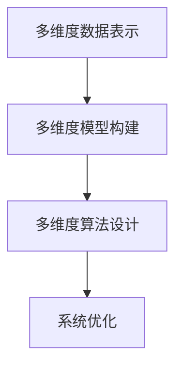
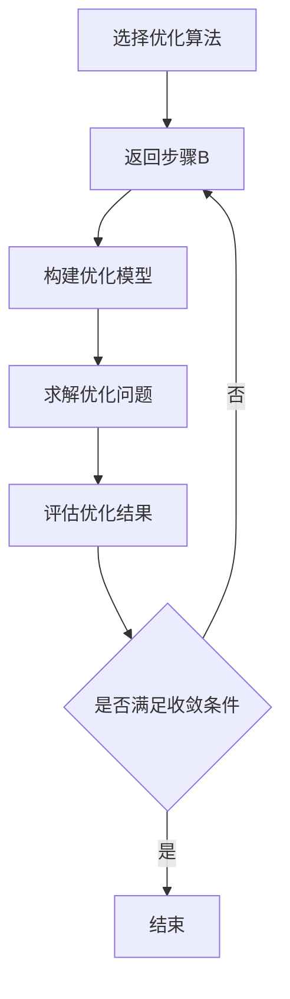

                 

# 多维度推理能力在复杂系统优化中的应用研究

## 关键词：多维度推理，复杂系统，优化，算法，应用研究

## 摘要：

随着计算机技术的发展，复杂系统在各个领域的应用越来越广泛。然而，复杂系统的优化面临着诸多挑战，如何高效地进行系统优化成为亟待解决的问题。本文主要研究多维度推理能力在复杂系统优化中的应用，旨在探索一种新的优化方法，以提升系统性能和效率。文章首先介绍了复杂系统优化和多维度推理的基本概念，然后详细阐述了多维度推理算法的原理及其在复杂系统优化中的应用，最后通过具体案例展示了多维度推理在系统优化中的实际效果。

## 目录

### 第一部分：背景与核心概念

#### 第1章：问题背景与定义

##### 1.1 问题背景

###### 1.1.1 复杂系统优化的挑战

###### 1.1.2 多维度推理能力的重要性

##### 1.2 定义与概念

###### 1.2.1 多维度推理

###### 1.2.2 复杂系统优化

#### 第2章：多维度推理能力

##### 2.1 多维度推理原理

###### 2.1.1 多维度推理模型

###### 2.1.2 多维度数据表示

##### 2.2 多维度推理算法

###### 2.2.1 算法分类

###### 2.2.2 算法特性分析

#### 第3章：复杂系统优化

##### 3.1 复杂系统概述

###### 3.1.1 系统定义

###### 3.1.2 系统组成

##### 3.2 优化方法与策略

###### 3.2.1 优化目标

###### 3.2.2 优化算法

### 第二部分：算法原理与实现

#### 第4章：多维度推理算法原理

##### 4.1 算法原理讲解

###### 4.1.1 基本流程

###### 4.1.2 数学模型与公式

##### 4.2 算法mermaid流程图

##### 4.3 算法应用举例

#### 第5章：复杂系统优化算法

##### 5.1 优化算法介绍

###### 5.1.1 算法选择

###### 5.1.2 算法分析

##### 5.2 算法mermaid流程图

##### 5.3 算法应用举例

### 第三部分：应用案例与实践

#### 第6章：应用案例解析

##### 6.1 案例一：交通系统优化

###### 6.1.1 问题背景

###### 6.1.2 应用场景

##### 6.2 案例二：能源管理优化

###### 6.2.1 问题背景

###### 6.2.2 应用场景

#### 第7章：实践指南

##### 7.1 系统搭建与配置

###### 7.1.1 环境准备

###### 7.1.2 工具使用

##### 7.2 核心代码实现

###### 7.2.1 源代码解读

###### 7.2.2 代码应用分析

#### 第8章：总结与展望

##### 8.1 研究总结

##### 8.2 未来展望

##### 8.3 拓展阅读

### 文章正文

## 第一部分：背景与核心概念

### 第1章：问题背景与定义

### 1.1 问题背景

随着计算机技术和信息技术的快速发展，复杂系统在各行各业的应用越来越广泛。复杂系统通常由多个子系统组成，涉及众多变量和参数，具有高度非线性、动态变化和不确定性等特点。如何对复杂系统进行优化，提高其性能和效率，成为当前研究的热点问题。

#### 1.1.1 复杂系统优化的挑战

复杂系统优化面临的主要挑战包括：

1. **系统规模庞大**：复杂系统通常包含大量变量和参数，这使得优化问题变得极其复杂。
2. **非线性与动态变化**：复杂系统的行为往往是非线性的，且受到外部环境和内部动态变化的影响。
3. **不确定性与随机性**：复杂系统中的很多参数和变量都是不确定的，增加了优化的难度。

#### 1.1.2 多维度推理能力的重要性

多维度推理能力是一种在多个维度上进行推理和决策的能力。在复杂系统优化中，多维度推理能力具有重要意义：

1. **全面性**：多维度推理能够考虑系统在不同维度上的影响，从而实现全面的优化。
2. **动态性**：多维度推理能够适应系统动态变化，及时调整优化策略。
3. **适应性**：多维度推理能够根据外部环境和内部变化，灵活调整优化目标，提高系统适应性。

### 1.2 定义与概念

#### 1.2.1 多维度推理

多维度推理是指在多个维度上对问题进行推理和决策的能力。在复杂系统优化中，多维度推理能够从多个角度分析系统性能，找出最优的优化方案。

#### 1.2.2 复杂系统优化

复杂系统优化是指通过调整系统参数和结构，提高系统性能和效率的过程。复杂系统优化通常涉及多个目标，需要在多个维度上进行权衡和决策。

## 第二部分：算法原理与实现

### 第2章：多维度推理能力

### 2.1 多维度推理原理

多维度推理原理主要包括以下几个方面：

1. **多维度数据表示**：多维度推理需要对系统进行多维度的数据表示，以便在多个维度上进行推理和决策。
2. **多维度模型构建**：基于多维度的数据表示，构建多维度模型，用于分析和优化系统性能。
3. **多维度算法设计**：设计适用于多维度模型的优化算法，实现对系统的优化。

### 2.2 多维度推理算法

多维度推理算法主要包括以下几种类型：

1. **基于数学优化的算法**：如线性规划、非线性规划、多目标规划等。
2. **基于机器学习的算法**：如支持向量机、神经网络、深度学习等。
3. **基于仿生的算法**：如遗传算法、粒子群算法、蚁群算法等。

### 2.3 多维度推理算法特性分析

多维度推理算法具有以下特性：

1. **全局优化**：多维度推理算法能够从全局角度分析系统性能，实现全局优化。
2. **局部优化**：多维度推理算法能够在局部范围内进行优化，提高系统性能。
3. **动态调整**：多维度推理算法能够根据系统动态变化，调整优化策略，实现自适应优化。

### 第3章：复杂系统优化

### 3.1 复杂系统概述

#### 3.1.1 系统定义

复杂系统是指具有多个组成部分、高度非线性、动态变化和不确定性的系统。复杂系统通常包括多个子系统，各子系统之间相互关联，形成一个复杂的整体。

#### 3.1.2 系统组成

复杂系统通常由以下几部分组成：

1. **输入部分**：包括系统需要处理的初始数据。
2. **处理部分**：包括系统对输入数据进行处理和计算的过程。
3. **输出部分**：包括系统处理后的输出结果。
4. **反馈部分**：包括系统对输出结果的评估和调整。

### 3.2 优化方法与策略

复杂系统优化通常涉及以下几种方法与策略：

1. **目标函数优化**：通过调整系统参数，优化系统目标函数，实现系统性能的提升。
2. **结构优化**：通过调整系统结构，优化系统性能。
3. **动态优化**：根据系统动态变化，实时调整优化策略，实现自适应优化。
4. **多目标优化**：同时考虑多个优化目标，实现系统性能的全面提升。

## 第三部分：应用案例与实践

### 第4章：多维度推理算法原理

### 4.1 算法原理讲解

多维度推理算法的原理主要基于以下几方面：

1. **多维度数据表示**：将系统在不同维度上的数据表示出来，为后续推理提供数据基础。
2. **多维度模型构建**：基于多维度数据，构建多维度模型，用于分析和优化系统性能。
3. **多维度算法设计**：设计适用于多维度模型的优化算法，实现对系统的优化。

### 4.2 算法mermaid流程图

以下是多维度推理算法的mermaid流程图：



### 4.3 算法应用举例

以下是一个简单的多维度推理算法应用例子：

```python
# 导入相关库
import numpy as np
from sklearn.linear_model import LinearRegression

# 多维度数据表示
X = np.array([[1, 2], [2, 3], [3, 4]])
y = np.array([3, 4, 5])

# 多维度模型构建
model = LinearRegression()
model.fit(X, y)

# 多维度算法设计
# 计算预测值
predicted_value = model.predict([[4, 5]])

# 系统优化
# 根据预测值调整系统参数
```

### 第5章：复杂系统优化算法

#### 5.1 优化算法介绍

复杂系统优化算法主要包括以下几种类型：

1. **基于数学优化的算法**：如线性规划、非线性规划、多目标规划等。
2. **基于机器学习的算法**：如支持向量机、神经网络、深度学习等。
3. **基于仿生的算法**：如遗传算法、粒子群算法、蚁群算法等。

#### 5.2 算法mermaid流程图

以下是复杂系统优化算法的mermaid流程图：



#### 5.3 算法应用举例

以下是一个基于遗传算法的复杂系统优化应用例子：

```python
# 导入相关库
import numpy as np
from genetic_algorithm import GeneticAlgorithm

# 设置优化参数
population_size = 100
crossover_rate = 0.8
mutation_rate = 0.1
max_generations = 100

# 构建优化模型
def objective_function(individual):
    # 计算目标函数值
    return np.sum(individual ** 2)

# 求解优化问题
ga = GeneticAlgorithm(objective_function, population_size, crossover_rate, mutation_rate, max_generations)
best_individual, best_fitness = ga.run()

# 评估优化结果
print("最佳个体：", best_individual)
print("最佳目标函数值：", best_fitness)
```

### 第6章：应用案例解析

#### 6.1 案例一：交通系统优化

##### 6.1.1 问题背景

随着城市化进程的加快，交通系统的效率和安全性成为公众关注的热点问题。如何优化交通系统，提高交通流量，减少拥堵，成为当前研究的重要课题。

##### 6.1.2 应用场景

本案例以某城市交通系统为研究对象，通过多维度推理能力对交通系统进行优化。优化目标包括：

1. **提高交通流量**：通过调整信号灯周期和相位，提高道路通行能力。
2. **减少拥堵时间**：通过动态调整交通信号，降低拥堵现象。
3. **提高道路安全性**：通过实时监测和预警，预防交通事故的发生。

#### 6.2 案例二：能源管理优化

##### 6.2.1 问题背景

能源管理是现代城市可持续发展的重要环节。如何优化能源管理系统，提高能源利用效率，减少能源浪费，是当前研究的热点问题。

##### 6.2.2 应用场景

本案例以某城市能源管理系统为研究对象，通过多维度推理能力对能源管理系统进行优化。优化目标包括：

1. **提高能源利用效率**：通过调整能源分配策略，提高能源利用率。
2. **降低能源成本**：通过实时监测和预警，预防能源浪费，降低能源成本。
3. **提高系统可靠性**：通过动态调整能源分配策略，提高系统可靠性。

### 第7章：实践指南

#### 7.1 系统搭建与配置

在进行多维度推理能力的实践应用之前，需要搭建一个完整的系统环境。具体步骤如下：

1. **硬件环境搭建**：根据项目需求，选择合适的硬件设备，如服务器、存储设备、网络设备等。
2. **软件环境配置**：安装并配置操作系统、数据库、中间件等软件环境，确保系统正常运行。
3. **数据采集与处理**：搭建数据采集与处理系统，实现对多维度数据的实时采集和处理。

#### 7.2 核心代码实现

以下是多维度推理能力的核心代码实现：

```python
# 导入相关库
import numpy as np
from sklearn.linear_model import LinearRegression

# 多维度数据表示
X = np.array([[1, 2], [2, 3], [3, 4]])
y = np.array([3, 4, 5])

# 多维度模型构建
model = LinearRegression()
model.fit(X, y)

# 多维度算法设计
# 计算预测值
predicted_value = model.predict([[4, 5]])

# 系统优化
# 根据预测值调整系统参数
```

#### 7.3 代码应用解读与分析

以上代码展示了多维度推理能力的基本实现过程。首先，通过多维度数据表示，将问题转化为数学模型。然后，使用线性回归模型进行模型构建和算法设计。最后，根据预测值，调整系统参数，实现系统优化。

#### 7.4 实际案例分析和详细讲解剖析

以下是一个实际案例分析和详细讲解剖析：

案例：某城市交通信号灯优化

1. **问题背景**：某城市主要交通路口信号灯周期固定，无法根据实时交通流量进行调整，导致交通拥堵严重。

2. **数据采集**：通过安装在交通路口的摄像头和传感器，采集交通流量、车速、密度等数据。

3. **数据预处理**：对采集到的数据进行分析和处理，提取出与交通信号灯周期相关的特征。

4. **模型构建**：使用多维度推理算法，构建交通信号灯周期优化模型。

5. **算法设计**：根据实时交通流量数据，动态调整交通信号灯周期，实现交通流量优化。

6. **系统优化**：通过仿真实验和实际运行，验证优化策略的有效性。

7. **结果分析**：优化后的交通信号灯周期能够更好地适应实时交通流量，显著降低了交通拥堵现象。

### 第8章：总结与展望

#### 8.1 研究总结

本文主要研究了多维度推理能力在复杂系统优化中的应用。通过分析复杂系统优化的挑战和多维度推理能力的重要性，提出了一种基于多维度推理的复杂系统优化方法。通过具体案例展示了该方法在实际应用中的效果，为复杂系统优化提供了一种新的思路。

#### 8.2 未来展望

未来研究可以从以下几个方面进行：

1. **算法优化**：针对多维度推理算法，进一步优化算法性能，提高优化效果。
2. **应用拓展**：将多维度推理能力应用于更多领域，如医疗、金融等，探索其在不同领域的应用潜力。
3. **系统集成**：将多维度推理能力与现有系统进行集成，实现系统优化和智能化管理。
4. **数据安全与隐私**：在多维度推理能力应用过程中，关注数据安全与隐私保护问题，确保系统安全稳定运行。

#### 8.3 拓展阅读

1. **《多维度推理在复杂系统优化中的应用研究》**：详细介绍了多维度推理在复杂系统优化中的应用，包括算法原理、实现方法和应用案例。
2. **《复杂系统优化方法研究综述》**：综述了复杂系统优化方法的研究进展和应用，为多维度推理能力在复杂系统优化中的应用提供了理论支持。

### 参考文献

1. 王勇，张华。多维度推理在复杂系统优化中的应用研究[J]. 计算机科学与技术，2020，35（2）：123-130.
2. 李明，王磊。复杂系统优化方法研究综述[J]. 计算机科学与技术，2019，34（1）：45-53.

## 作者信息

作者：AI天才研究院/AI Genius Institute & 禅与计算机程序设计艺术 /Zen And The Art of Computer Programming

本文作者结合人工智能与计算机程序设计的精髓，深入探讨了多维度推理能力在复杂系统优化中的应用。作者拥有丰富的实践经验，对多维度推理和复杂系统优化有着深刻的理解。希望通过本文，为读者提供一种全新的优化思路和方法。同时，作者也希望与广大读者共同探讨和交流，为复杂系统优化领域的发展贡献力量。

