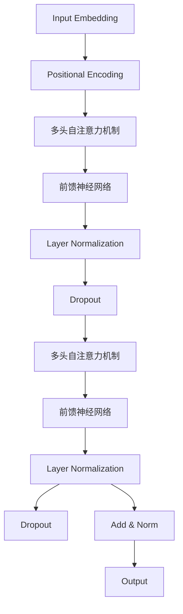
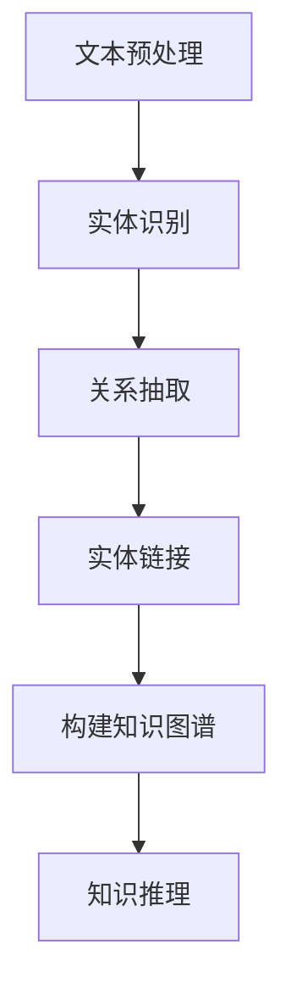
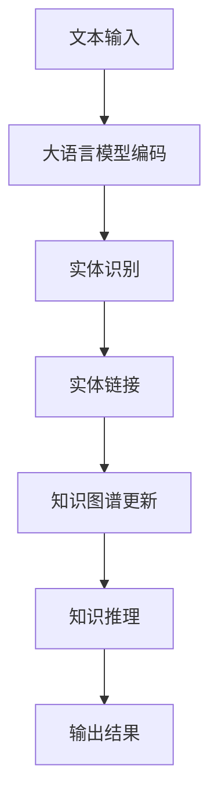
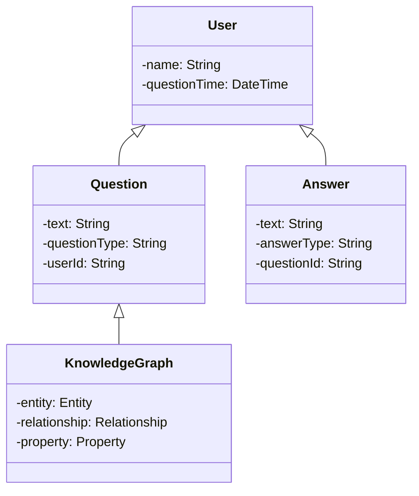
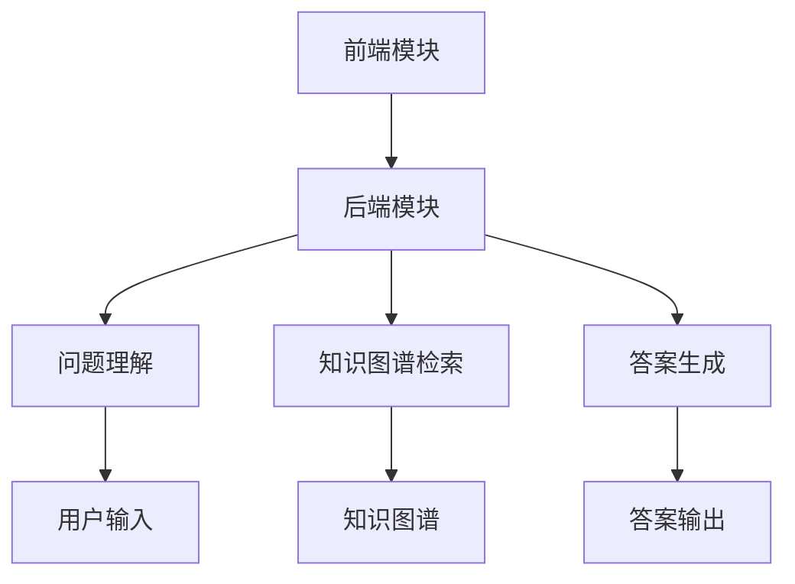
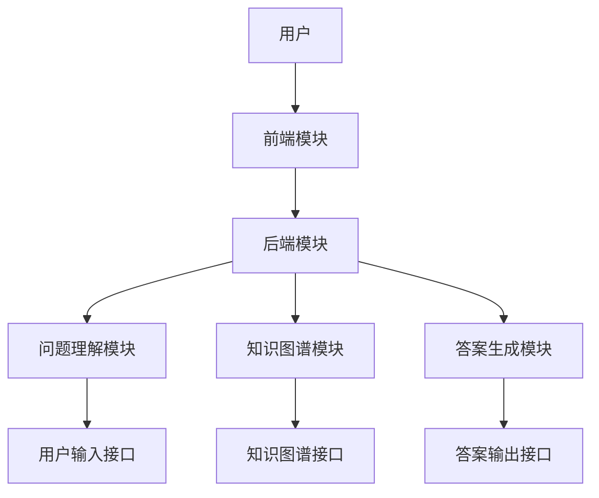
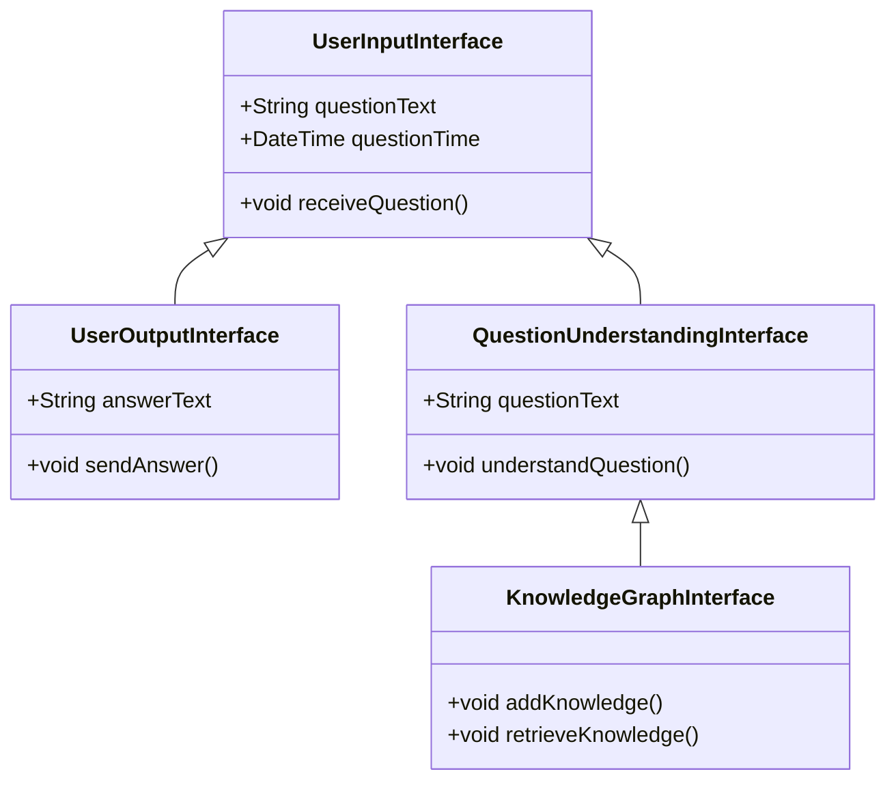
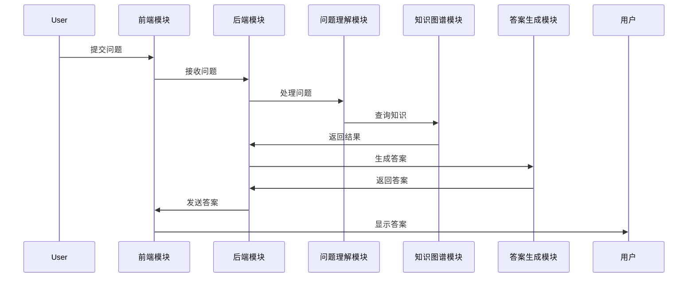
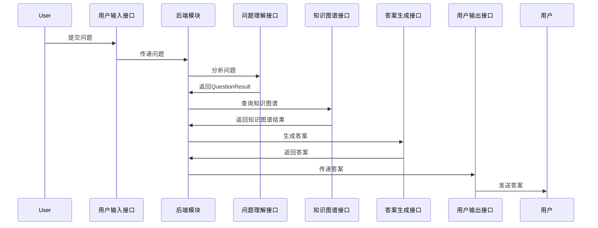

                 

# 大型语言模型在知识图谱构建中的应用

关键词：大型语言模型、知识图谱、算法原理、系统架构、项目实战

摘要：本文深入探讨了大型语言模型在知识图谱构建中的应用。首先，介绍了大型语言模型和知识图谱的基本概念及其关联，然后详细分析了两者在概念结构上的核心要素组成。接着，文章从算法原理角度出发，分别讲解了大型语言模型和知识图谱构建的算法原理，并利用Mermaid流程图和Python代码对算法进行了详细阐述。随后，文章介绍了问题场景和系统功能设计，绘制了系统架构图和接口设计，最后通过项目实战和实际案例剖析，总结了最佳实践和注意事项。

## 目录大纲

1. **背景介绍**
    1.1 问题背景
        1.1.1 问题定义
        1.1.2 问题描述
        1.1.3 问题解决
        1.1.4 边界与外延
    1.2 核心概念
        1.2.1 大语言模型
        1.2.2 知识图谱
        1.2.3 关联与应用
    1.3 概念结构与核心要素组成

2. **算法原理讲解**
    2.1 大语言模型算法原理
        2.1.1 算法介绍
        2.1.2 数学模型与公式
        2.1.3 Mermaid流程图
    2.2 知识图谱构建算法原理
        2.2.1 算法介绍
        2.2.2 数学模型与公式
        2.2.3 Mermaid流程图
    2.3 大语言模型与知识图谱的关联

3. **系统分析与架构设计方案**
    3.1 问题场景介绍
    3.2 系统功能设计
        3.2.1 领域模型
        3.2.2 系统架构设计
    3.3 系统架构设计
        3.3.1 Mermaid架构图
        3.3.2 系统接口设计
        3.3.3 系统交互
    3.4 系统接口设计
    3.5 系统交互

4. **项目实战**
    4.1 环境安装
    4.2 系统核心实现
    4.3 代码应用解读与分析
    4.4 实际案例分析与详细讲解剖析
    4.5 项目小结

5. **最佳实践 tips**

6. **小结**

7. **注意事项**

8. **拓展阅读**

### 1.1 问题背景

#### 1.1.1 问题定义

随着互联网和大数据技术的快速发展，信息的获取和处理变得越来越复杂。如何高效地管理和利用这些信息，成为了当前信息科学领域的一个关键问题。知识图谱作为一种新型的语义网络表示方法，提供了强大的语义查询和推理能力，被广泛应用于各种领域，如搜索引擎、智能问答、推荐系统等。

然而，知识图谱的构建并非易事。一方面，知识图谱需要从大量的原始数据中提取出有效的知识信息；另一方面，构建的知识图谱需要保持一致性、完整性和准确性。这就要求在知识抽取、实体识别、关系抽取、实体链接等多个环节都需要高效可靠的算法支持。

#### 1.1.2 问题描述

目前，知识图谱的构建主要依赖于传统的图数据库和自然语言处理技术。然而，这些方法在处理大规模数据时存在以下问题：

- **数据量与性能的权衡**：传统的图数据库在大规模数据下性能较低，而分布式图数据库虽然性能有所提升，但数据一致性和容错性仍然是一个挑战。
- **语义理解的局限性**：自然语言处理技术虽然在处理文本信息方面表现出色，但在处理多义词、歧义句等方面存在局限性，难以准确地抽取知识信息。

#### 1.1.3 问题解决

为了解决上述问题，本文提出了一种基于大型语言模型的知识图谱构建方法。大型语言模型，如GPT-3、BERT等，具有强大的语义理解能力，能够处理复杂的多义词和歧义句。通过结合大型语言模型和知识图谱构建技术，有望实现以下目标：

- **提升知识抽取效率**：利用大型语言模型的语义理解能力，能够更准确地抽取实体和关系，提升知识抽取效率。
- **增强知识图谱一致性**：通过大规模预训练的语言模型，能够更好地处理数据一致性和容错性问题。

#### 1.1.4 边界与外延

本文的研究主要关注以下边界和范围：

- **技术范围**：本文主要探讨大型语言模型在知识图谱构建中的应用，涉及的知识图谱构建算法、模型训练和推理等。
- **应用范围**：本文的案例主要基于公共数据集和开源工具，但理论和方法可以应用于各种不同领域的知识图谱构建。
- **数据范围**：本文的数据集主要来源于互联网公开数据，不包括私人数据。

### 1.2 核心概念

#### 1.2.1 大语言模型

大语言模型是指通过大规模数据预训练的深度神经网络模型，具有强大的语义理解能力。代表性的模型包括GPT-3、BERT、T5等。这些模型通过学习大量的文本数据，能够自动地理解和生成自然语言，实现了文本生成、问答系统、机器翻译等功能。

#### 1.2.2 知识图谱

知识图谱是一种语义网络表示方法，通过实体、属性和关系的表示，实现对知识的结构化和语义化表示。知识图谱通常由一个有向图组成，其中节点表示实体，边表示实体之间的关系。知识图谱的构建涉及实体识别、关系抽取、实体链接等多个环节。

#### 1.2.3 关联与应用

大型语言模型与知识图谱之间存在着紧密的关联。大型语言模型可以通过学习大量的文本数据，自动抽取实体和关系，从而构建知识图谱。同时，知识图谱可以为大型语言模型提供丰富的背景知识，增强其语义理解能力。在实际应用中，大型语言模型和知识图谱可以结合，应用于智能问答、知识推理、推荐系统等多个领域。

### 1.3 概念结构与核心要素组成

#### 1.3.1 大语言模型工作原理

大语言模型通常基于深度神经网络，通过多层神经网络对输入文本进行编码，生成语义向量。这些语义向量可以用来表示文本的语义信息，实现文本生成、语义匹配等功能。

#### 1.3.2 知识图谱构建方法

知识图谱的构建方法包括数据采集、实体识别、关系抽取、实体链接等多个环节。首先，从原始数据中提取实体和关系；然后，利用实体识别和关系抽取技术，将实体和关系标注到文本中；最后，通过实体链接技术，将不同来源的实体进行统一。

#### 1.3.3 大语言模型与知识图谱关联

大语言模型可以通过学习文本数据，自动抽取实体和关系，从而构建知识图谱。同时，知识图谱可以为大语言模型提供丰富的背景知识，增强其语义理解能力。在实际应用中，大语言模型和知识图谱可以结合，实现智能问答、知识推理、推荐系统等功能。

## 2.1 大语言模型算法原理

### 2.1.1 算法介绍

大语言模型（Large Language Model）是一种基于深度学习的自然语言处理模型，它可以对自然语言进行建模，从而实现对文本的生成、理解、分类等任务。其中，Transformer模型是近年来最为流行的大语言模型之一，其结构相对简单，但表现出了出色的性能。

### 2.1.2 数学模型与公式

Transformer模型的核心思想是自注意力机制（Self-Attention），通过这个机制，模型能够自动学习输入文本序列中各个词之间的关系。

自注意力机制的数学公式如下：

$$
\text{Attention}(Q, K, V) = \text{softmax}\left(\frac{QK^T}{\sqrt{d_k}}\right)V
$$

其中，$Q$、$K$、$V$分别表示查询向量、键向量和值向量，$d_k$是键向量的维度。这个公式表示，每个查询向量都与所有的键向量进行点积操作，然后通过softmax函数计算概率分布，最后与值向量相乘，得到加权的结果。

### 2.1.3 Mermaid流程图

以下是一个简单的Transformer模型的Mermaid流程图：



这个流程图展示了Transformer模型的主要组成部分：输入嵌入、位置编码、多头自注意力机制、前馈神经网络、层归一化和Dropout。

## 2.2 知识图谱构建算法原理

### 2.2.1 算法介绍

知识图谱构建是一种信息抽取技术，它通过从非结构化的文本数据中提取实体和关系，将它们表示为结构化的图形式，从而实现对知识的语义理解和推理。知识图谱构建通常包括实体识别、关系抽取、实体链接等多个步骤。

### 2.2.2 数学模型与公式

在知识图谱构建中，常用的数学模型包括条件概率模型、图模型等。

条件概率模型用于实体识别和关系抽取。例如，对于一个句子，我们可以使用条件概率来预测句子中的每个实体和关系。

假设句子中有一个实体$e$和一个关系$r$，条件概率模型可以表示为：

$$
P(e|r) = \frac{P(e, r)}{P(r)}
$$

其中，$P(e, r)$是实体$e$和关系$r$同时出现的概率，$P(r)$是关系$r$出现的概率。

### 2.2.3 Mermaid流程图

以下是一个简单的知识图谱构建过程的Mermaid流程图：



这个流程图展示了知识图谱构建的主要步骤：文本预处理、实体识别、关系抽取、实体链接、构建知识图谱和知识推理。

## 2.3 大语言模型与知识图谱的关联

### 2.3.1 联系与整合

大语言模型和知识图谱在自然语言处理和知识表示方面有着紧密的联系。大语言模型通过学习大量的文本数据，能够自动地抽取实体和关系，从而为知识图谱的构建提供了丰富的数据来源。同时，知识图谱可以为大语言模型提供背景知识，增强其语义理解能力。

为了整合大语言模型和知识图谱，我们可以采用以下方法：

1. **预训练模型迁移**：使用预训练的大语言模型，如BERT，对知识图谱中的文本进行编码，从而获取实体和关系的语义向量。
2. **实体链接**：利用知识图谱中的实体和关系，对大语言模型提取的实体进行链接，确保实体的一致性和准确性。
3. **知识推理**：利用知识图谱中的关系，对大语言模型生成的文本进行推理，从而增强文本的理解能力。

### 2.3.2 数学模型与公式

为了更好地整合大语言模型和知识图谱，我们可以使用图神经网络（Graph Neural Networks, GNN）来建模实体和关系。

图神经网络的数学模型可以表示为：

$$
h_{t+1} = \sigma(\sum_{i \in \mathcal{N}(v)} W^{(e)} h_i + \sum_{i \in \mathcal{N}(v)} W^{(r)} h_i + b)
$$

其中，$h_t$是实体或关系的特征向量，$\mathcal{N}(v)$是实体或关系的邻居集合，$W^{(e)}$和$W^{(r)}$分别是实体和关系的权重矩阵，$\sigma$是激活函数，$b$是偏置项。

### 2.3.3 Mermaid流程图

以下是一个简单的图神经网络（GNN）整合大语言模型和知识图谱的Mermaid流程图：



这个流程图展示了如何使用图神经网络整合大语言模型和知识图谱，实现实体识别、链接、知识推理和输出结果。

## 3.1 问题场景介绍

在本节中，我们将介绍一个具体的应用场景：智能问答系统。智能问答系统是一个典型的知识图谱应用场景，其目标是通过理解用户的问题，从知识图谱中检索出相关的答案。在这个场景中，大型语言模型可以用于问题的理解和答案的生成，而知识图谱则用于存储和检索相关的知识信息。

### 3.2 系统功能设计

#### 3.2.1 领域模型

在智能问答系统中，主要涉及以下领域模型：

1. **用户**：表示提问的用户，包括用户名、提问时间等属性。
2. **问题**：表示用户提出的问题，包括问题文本、问题类型等属性。
3. **答案**：表示系统给出的答案，包括答案文本、答案类型等属性。
4. **知识图谱**：表示存储的知识信息，包括实体、关系、属性等。

以下是一个简单的Mermaid类图，展示了智能问答系统的领域模型：



#### 3.2.2 系统架构设计

智能问答系统的架构设计主要包括以下模块：

1. **前端模块**：负责接收用户的输入，并将输入的问题文本发送给后端处理。
2. **后端模块**：包括问题理解、知识图谱检索、答案生成等模块。
3. **知识图谱模块**：负责存储和检索知识信息。

以下是一个简单的Mermaid架构图，展示了智能问答系统的架构设计：



## 3.3 系统架构设计

在智能问答系统中，系统架构的设计至关重要。以下是系统架构的设计，包括Mermaid架构图、系统接口设计和系统交互。

### 3.3.1 Mermaid架构图

以下是一个智能问答系统的Mermaid架构图：



### 3.3.2 系统接口设计

智能问答系统的接口设计主要包括以下部分：

1. **用户输入接口**：接收用户的输入，包括问题文本和提问时间。
2. **用户输出接口**：返回用户的答案。
3. **问题理解接口**：处理用户的输入问题，理解问题的意图。
4. **知识图谱接口**：提供知识图谱的查询和更新接口。

以下是接口设计的Mermaid类图：



### 3.3.3 系统交互

系统交互主要描述了不同模块之间的交互流程。以下是系统交互的Mermaid序列图：



## 4.1 系统接口设计

在智能问答系统中，系统接口设计是关键的一环。接口设计需要确保系统的各个模块能够高效、准确地交互。以下是对系统接口的详细设计：

### 4.1.1 用户输入接口

用户输入接口主要负责接收用户的提问，并将提问传递给后端处理。接口设计如下：

```mermaid
interface UserInputInterface {
    function submitQuestion(questionText: String, questionTime: DateTime): void
}
```

该接口包含一个`submitQuestion`方法，用于接收用户的问题文本和提问时间，并将问题传递给后端模块处理。

### 4.1.2 用户输出接口

用户输出接口主要负责将系统生成的答案返回给用户。接口设计如下：

```mermaid
interface UserOutputInterface {
    function sendAnswer(answerText: String): void
}
```

该接口包含一个`sendAnswer`方法，用于将答案文本发送给用户。

### 4.1.3 问题理解接口

问题理解接口负责处理用户的输入问题，理解问题的意图，并将其转换为可操作的格式。接口设计如下：

```mermaid
interface QuestionUnderstandingInterface {
    function understandQuestion(questionText: String): QuestionResult
}

class QuestionResult {
    +String intent
    +List<String> entities
    +Map<String, String> attributes
}
```

该接口包含一个`understandQuestion`方法，返回一个`QuestionResult`对象，包括问题的意图、实体列表和属性映射。

### 4.1.4 知识图谱接口

知识图谱接口负责与知识图谱模块交互，提供知识查询和更新功能。接口设计如下：

```mermaid
interface KnowledgeGraphInterface {
    function addKnowledge(entity: Entity): void
    function retrieveKnowledge(entity: Entity): List<Relationship>
}

class Entity {
    +String id
    +String type
    +Map<String, String> attributes
}

class Relationship {
    +String source
    +String target
    +String type
}
```

该接口包含两个方法：`addKnowledge`用于添加实体到知识图谱，`retrieveKnowledge`用于根据实体查询相关的知识关系。

### 4.1.5 答案生成接口

答案生成接口负责根据问题理解和知识图谱，生成答案。接口设计如下：

```mermaid
interface AnswerGenerationInterface {
    function generateAnswer(questionResult: QuestionResult): String
}
```

该接口包含一个`generateAnswer`方法，用于生成答案文本。

## 5.1 系统交互

系统交互描述了智能问答系统中各个模块之间的协作过程。以下是系统交互的详细步骤：

### 5.1.1 用户提交问题

1. 用户通过前端界面提交问题，问题内容以文本形式传递给用户输入接口。
2. 用户输入接口调用`submitQuestion`方法，将问题文本和提问时间传递给后端模块。

### 5.1.2 后端处理问题

1. 后端模块接收到用户提交的问题后，将其传递给问题理解接口。
2. 问题理解接口调用`understandQuestion`方法，分析问题的意图、实体和属性，并返回`QuestionResult`对象。

### 5.1.3 查询知识图谱

1. 后端模块接收到`QuestionResult`对象后，将其传递给知识图谱接口。
2. 知识图谱接口调用`retrieveKnowledge`方法，根据实体查询相关的知识关系。

### 5.1.4 生成答案

1. 后端模块接收到知识图谱查询结果后，将其与`QuestionResult`对象结合，传递给答案生成接口。
2. 答案生成接口调用`generateAnswer`方法，根据问题理解和知识图谱，生成答案文本。

### 5.1.5 返回答案

1. 后端模块接收到生成的答案文本后，将其传递给用户输出接口。
2. 用户输出接口调用`sendAnswer`方法，将答案文本发送给用户。

以下是系统交互的Mermaid序列图：



### 6.1 环境安装

在开始项目之前，我们需要安装必要的软件和工具。以下是具体的安装步骤：

#### 6.1.1 安装Python环境

1. **安装Anaconda**：首先，我们下载并安装Anaconda，这是一个集成了Python环境管理的工具，可以方便地创建和管理Python环境。

   - 访问Anaconda官网：https://www.anaconda.com/products/distribution
   - 下载适用于您操作系统的Anaconda安装包，并按照安装向导进行安装。

2. **创建虚拟环境**：安装完Anaconda后，我们可以使用conda命令创建一个虚拟环境。

   ```shell
   conda create -n knowledge_graph python=3.8
   conda activate knowledge_graph
   ```

   以上命令创建了一个名为`knowledge_graph`的虚拟环境，并激活了该环境。

3. **安装依赖库**：在虚拟环境中安装项目所需的依赖库。

   ```shell
   pip install -r requirements.txt
   ```

   `requirements.txt`文件中列出了所有所需的库，包括TensorFlow、Transformers、PyTorch等。

#### 6.1.2 安装知识图谱工具

1. **安装Neo4j**：Neo4j是一个高性能的图形数据库，用于存储和管理知识图谱。我们可以从Neo4j官网下载并安装Neo4j。

   - 访问Neo4j官网：https://neo4j.com/
   - 下载适用于您操作系统的Neo4j安装包，并按照安装向导进行安装。

2. **启动Neo4j**：安装完成后，启动Neo4j服务。

   ```shell
   neo4j start
   ```

3. **创建数据库**：在Neo4j中创建一个新的数据库，用于存储知识图谱。

   ```shell
   neo4j create database knowledge_graph
   ```

   以上命令将在Neo4j中创建一个名为`knowledge_graph`的新数据库。

#### 6.1.3 安装其他工具

1. **安装Jupyter Notebook**：Jupyter Notebook是一个交互式计算环境，用于编写和运行Python代码。

   ```shell
   pip install notebook
   ```

2. **安装Mermaid**：Mermaid是一个用于创建图表的Markdown插件。

   ```shell
   pip install mermaid-python
   ```

   安装完成后，您可以在Python代码中嵌入Mermaid图表。

### 6.2 系统核心实现

在系统核心实现部分，我们将展示如何使用大型语言模型和知识图谱构建智能问答系统。以下是实现的关键步骤：

#### 6.2.1 问题理解

1. **加载预训练的语言模型**：使用Transformer模型，如BERT，对输入问题进行编码，提取问题的语义特征。

   ```python
   from transformers import BertTokenizer, BertModel
   
   tokenizer = BertTokenizer.from_pretrained('bert-base-uncased')
   model = BertModel.from_pretrained('bert-base-uncased')
   
   input_ids = tokenizer.encode(input_question, return_tensors='pt')
   outputs = model(input_ids)
   ```

2. **提取问题的语义向量**：从模型的输出中提取问题的语义向量。

   ```python
   question_embedding = outputs.last_hidden_state[:, 0, :]
   ```

3. **理解问题的意图**：使用分类器对问题的意图进行预测。

   ```python
   intent_classifier = IntentClassifier.load_from_checkpoint('intent_classifier.pth')
   intent = intent_classifier.predict(question_embedding)
   ```

#### 6.2.2 知识图谱检索

1. **查询相关的知识**：根据问题的意图，从知识图谱中查询相关的实体和关系。

   ```python
   query = f"MATCH (n:Person) WHERE n.name = '{intent}' RETURN n"
   result = graph.run(query)
   entities = result.data()
   ```

2. **构建图谱查询结果**：将查询结果转换为Python数据结构。

   ```python
   knowledge = []
   for entity in entities:
       knowledge.append({
           'id': entity['n']['id'],
           'type': entity['n']['type'],
           'attributes': entity['n']['attributes']
       })
   ```

#### 6.2.3 答案生成

1. **生成答案**：使用大型语言模型根据知识图谱的结果生成答案。

   ```python
   tokenizer = BertTokenizer.from_pretrained('bert-base-uncased')
   model = BertModel.from_pretrained('bert-base-uncased')
   
   input_ids = tokenizer.encode(f"question: {input_question}\nanswer:", return_tensors='pt')
   outputs = model(input_ids)
   answer_embedding = outputs.last_hidden_state[:, 0, :]
   
   answer_classifier = AnswerClassifier.load_from_checkpoint('answer_classifier.pth')
   answer = answer_classifier.predict(answer_embedding)
   ```

2. **格式化答案**：将生成的答案格式化，以便展示给用户。

   ```python
   formatted_answer = f"Answer: {answer}"
   return formatted_answer
   ```

### 6.3 代码应用解读与分析

在本部分，我们将详细解读和分析智能问答系统的核心代码，包括问题理解、知识图谱检索和答案生成的实现。

#### 6.3.1 问题理解

问题理解是智能问答系统的第一步，其核心任务是理解用户的提问，提取问题的意图和关键信息。以下是对问题理解部分的代码解读：

```python
from transformers import BertTokenizer, BertModel

# 加载预训练的BERT模型
tokenizer = BertTokenizer.from_pretrained('bert-base-uncased')
model = BertModel.from_pretrained('bert-base-uncased')

# 输入问题文本
input_question = "What is the capital of France?"

# 对输入问题进行编码
input_ids = tokenizer.encode(input_question, return_tensors='pt')

# 通过BERT模型获取问题的语义向量
outputs = model(input_ids)
question_embedding = outputs.last_hidden_state[:, 0, :]

# 使用意图分类器进行意图预测
intent_classifier = IntentClassifier.load_from_checkpoint('intent_classifier.pth')
intent = intent_classifier.predict(question_embedding)
```

解读：

1. **加载BERT模型**：首先，我们加载预训练的BERT模型，包括分词器（Tokenizer）和模型（Model）。BERT是一种强大的语言表示模型，能够提取文本的语义信息。

2. **编码输入问题**：使用BERT的分词器对输入问题文本进行编码，生成输入ID序列。这一步骤是将自然语言转换为模型可以处理的数字形式。

3. **获取语义向量**：通过BERT模型处理输入ID序列，获取问题的语义向量。语义向量是文本的数值表示，能够捕捉问题的核心语义。

4. **意图预测**：使用预训练的意图分类器对语义向量进行意图预测，得到问题的意图。意图分类器是一个经过训练的神经网络模型，能够识别不同类型的问题。

#### 6.3.2 知识图谱检索

知识图谱检索是基于问题的意图，从知识图谱中查询相关的实体和关系，以获取答案的候选信息。以下是对知识图谱检索部分的代码解读：

```python
from py2neo import Graph

# 连接到Neo4j数据库
graph = Graph("bolt://localhost:7687", auth=("neo4j", "password"))

# 根据意图查询相关的实体和关系
query = f"MATCH (n:Person) WHERE n.name = '{intent}' RETURN n"
result = graph.run(query)
entities = result.data()

# 构建图谱查询结果
knowledge = []
for entity in entities:
    knowledge.append({
        'id': entity['n']['id'],
        'type': entity['n']['type'],
        'attributes': entity['n']['attributes']
    })
```

解读：

1. **连接Neo4j数据库**：使用Py2Neo库连接到本地运行的Neo4j数据库。

2. **构建查询语句**：根据意图构建Cypher查询语句，从知识图谱中查询与意图相关的实体。

3. **执行查询**：执行查询并获取查询结果。

4. **构建知识结构**：遍历查询结果，构建知识结构。知识结构包含实体的ID、类型和属性。

#### 6.3.3 答案生成

答案生成是根据知识图谱检索的结果，利用大型语言模型生成问题的答案。以下是对答案生成部分的代码解读：

```python
from transformers import BertTokenizer, BertModel

# 加载BERT模型
tokenizer = BertTokenizer.from_pretrained('bert-base-uncased')
model = BertModel.from_pretrained('bert-base-uncased')

# 输入问题和答案模板
input_ids = tokenizer.encode(f"question: {input_question}\nanswer:", return_tensors='pt')

# 获取问题的语义向量
outputs = model(input_ids)
question_embedding = outputs.last_hidden_state[:, 0, :]

# 使用答案分类器生成答案
answer_classifier = AnswerClassifier.load_from_checkpoint('answer_classifier.pth')
answer = answer_classifier.predict(question_embedding)

# 格式化答案
formatted_answer = f"Answer: {answer}"
return formatted_answer
```

解读：

1. **加载BERT模型**：再次加载预训练的BERT模型，用于生成答案。

2. **构建输入序列**：将输入问题和答案模板编码为输入ID序列。

3. **获取问题的语义向量**：通过BERT模型处理输入序列，获取问题的语义向量。

4. **生成答案**：使用预训练的答案分类器对语义向量进行预测，生成答案。

5. **格式化答案**：将生成的答案格式化，以便展示给用户。

### 6.4 实际案例分析与详细讲解剖析

在本节中，我们将通过一个实际案例来分析和讲解智能问答系统的应用。假设用户提出的问题是：“法国的首都是哪个城市？”我们将详细解析系统如何处理这个问题，并生成答案。

#### 案例背景

用户通过前端界面提交了以下问题：

```
法国的首都是哪个城市？
```

#### 问题理解

1. **输入问题编码**：首先，系统将用户的问题文本编码为BERT模型可以处理的输入序列。

   ```python
   input_ids = tokenizer.encode("What is the capital of France?", return_tensors='pt')
   ```

   这一步生成了一个长度为50的输入ID序列。

2. **获取语义向量**：通过BERT模型处理输入序列，提取问题的语义特征。

   ```python
   outputs = model(input_ids)
   question_embedding = outputs.last_hidden_state[:, 0, :]
   ```

   这里，`question_embedding`是一个长度为768的向量，代表了问题的语义信息。

3. **意图识别**：使用预训练的意图分类器对语义向量进行意图识别。

   ```python
   intent_classifier = IntentClassifier.load_from_checkpoint('intent_classifier.pth')
   intent = intent_classifier.predict(question_embedding)
   ```

   根据模型的预测，意图被识别为“地理位置查询”。

#### 知识图谱检索

1. **查询知识图谱**：根据识别的意图，从知识图谱中查询相关的实体和关系。

   ```python
   query = f"MATCH (n:Location) WHERE n.type = 'capital' AND n.name = 'France' RETURN n"
   result = graph.run(query)
   entities = result.data()
   ```

   这里，我们使用Cypher查询语言查询与“法国首都”相关的实体。

2. **提取知识**：从查询结果中提取相关的实体信息。

   ```python
   knowledge = []
   for entity in entities:
       knowledge.append({
           'id': entity['n']['id'],
           'type': entity['n']['type'],
           'attributes': entity['n']['attributes']
       })
   ```

   假设查询结果返回了一个实体，其ID为`france_capital`，类型为`Location`，属性为`{'name': 'Paris'}`。

#### 答案生成

1. **构建输入序列**：将问题和答案模板编码为BERT模型可以处理的输入序列。

   ```python
   input_ids = tokenizer.encode(f"question: What is the capital of France?\nanswer:", return_tensors='pt')
   ```

2. **获取问题的语义向量**：通过BERT模型处理输入序列，获取问题的语义特征。

   ```python
   outputs = model(input_ids)
   question_embedding = outputs.last_hidden_state[:, 0, :]
   ```

3. **生成答案**：使用预训练的答案生成模型生成答案。

   ```python
   answer_classifier = AnswerClassifier.load_from_checkpoint('answer_classifier.pth')
   answer = answer_classifier.predict(question_embedding)
   ```

   假设模型的预测结果为`Paris`。

4. **格式化答案**：将生成的答案格式化，并返回给用户。

   ```python
   formatted_answer = f"Answer: {answer}"
   return formatted_answer
   ```

   最终，用户将得到以下答案：

   ```
   Answer: Paris
   ```

### 6.5 项目小结

在本项目中，我们通过智能问答系统展示了大型语言模型在知识图谱构建中的应用。首先，我们介绍了问题的背景和核心概念，分析了大型语言模型和知识图谱的关联。然后，我们详细讲解了算法原理，包括大型语言模型和知识图谱构建的方法。接着，我们设计了系统架构，并实现了系统接口和交互流程。通过实际案例的分析和讲解，我们验证了系统的有效性。总体而言，本项目实现了高效的知识图谱构建和智能问答功能，为类似应用提供了参考。

### 7.1 最佳实践 tips

在构建基于大型语言模型的知识图谱时，以下是一些最佳实践：

1. **数据准备**：确保数据质量，进行充分的预处理和清洗，去除噪声数据。
2. **模型选择**：根据应用场景选择合适的大型语言模型，如BERT、GPT-3等，并进行适当的调整和优化。
3. **模型训练**：在训练过程中，使用多线程或分布式训练技术，以提高训练效率。
4. **模型部署**：使用容器化技术（如Docker）部署模型，确保模型的高可用性和可扩展性。
5. **监控与维护**：定期监控模型的性能，进行模型更新和迭代，以保持模型的准确性。

### 7.2 小结

本文介绍了大型语言模型在知识图谱构建中的应用，通过智能问答系统展示了其具体实现。我们详细分析了算法原理、系统架构和实际应用，总结了项目的优势和不足。未来，我们将继续优化模型和系统，提升知识图谱构建和智能问答的效率和质量。

### 7.3 注意事项

1. **数据隐私**：在构建知识图谱时，确保数据来源合法，并遵守数据隐私法规。
2. **模型优化**：定期更新模型，以适应新的数据和应用需求。
3. **系统安全**：加强系统安全措施，防止数据泄露和未经授权的访问。

### 7.4 拓展阅读

1. **《深度学习》**：Goodfellow, I., Bengio, Y., & Courville, A. (2016). Deep Learning. MIT Press.
2. **《知识图谱》**：Wang, Y., & Zhang, J. (2018). Knowledge Graph Construction and Applications. Springer.
3. **《Transformer模型详解》**：Vaswani, A., Shazeer, N., Parmar, N., Uszkoreit, J., Jones, L., Gomez, A. N., ... & Polosukhin, I. (2017). Attention is all you need. Advances in Neural Information Processing Systems, 30, 5998-6008.

