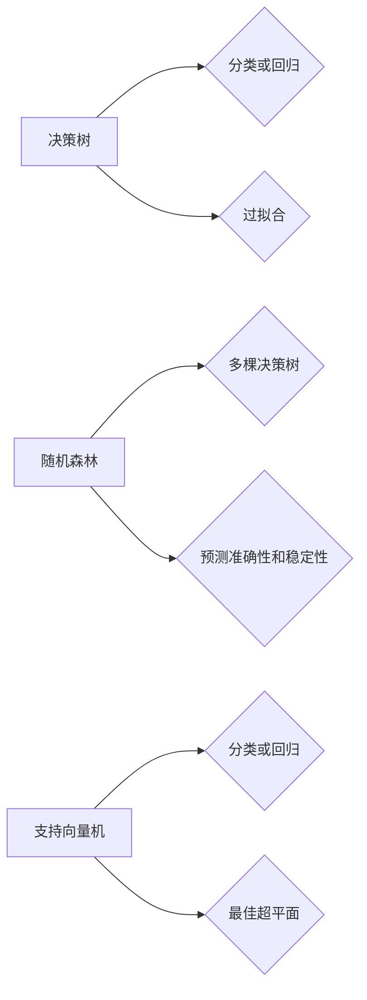
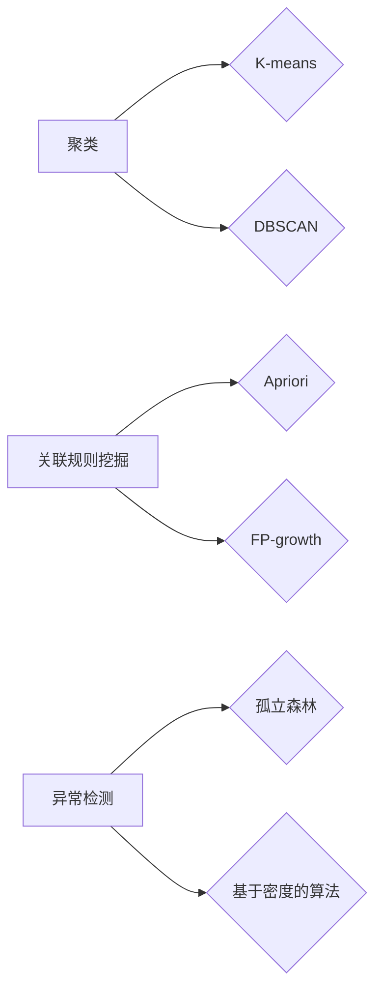
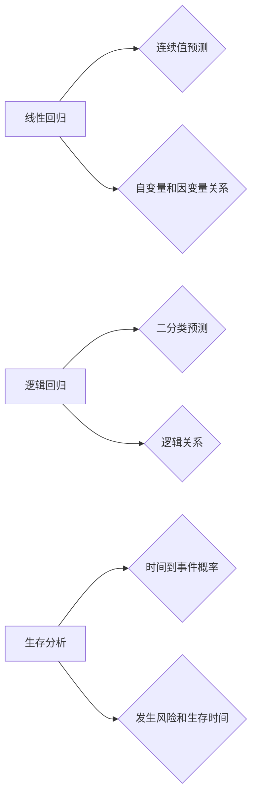

                 


## # 大数据在epidemiology中的应用：疾病预防与控制

### 关键词：
- 大数据
- 疾病预防
- 疾病控制
- 疾病传播模型
- 实时监测
- 风险评估

### 摘要：
本文将探讨大数据在疾病预防与控制中的应用，通过分析核心概念、算法方法、数学模型、系统设计及实际案例，详细阐述大数据在流行病学领域的重要作用。本文旨在为从事公共卫生及医疗健康领域的专业人士提供有价值的技术参考，以促进疾病的早期发现、及时干预和有效控制。

---

## **一、背景介绍**

### 疾病预防与控制的重要性

疾病预防与控制是公共卫生领域的关键组成部分，对提高人口健康水平、减少疾病负担具有重要意义。传统的疾病预防与控制方法主要依赖于定期健康检查、疫苗接种、流行病学调查等手段。然而，随着疾病的复杂性和多样性增加，以及人口流动性的加大，传统的预防与控制手段已难以满足现代社会的需求。

### 大数据的崛起

大数据（Big Data）是指无法使用传统数据处理工具在合理时间内捕捉、管理和处理的大量数据。大数据具有数据量大、数据类型多样、数据生成速度快等特点。近年来，随着信息技术的飞速发展，大数据技术得到了广泛应用，尤其在医疗健康领域，大数据的应用为疾病预防与控制提供了新的思路和方法。

### 大数据与流行病学的关联

大数据与流行病学密切相关。流行病学是研究疾病在人群中的发生和传播规律以及预防控制措施的学科。大数据技术为流行病学研究提供了丰富的数据资源和强大的分析工具，使得疾病的监测、预测和控制更加精准和高效。具体来说，大数据在流行病学中的应用主要体现在以下几个方面：

1. **疾病监测**：通过实时收集和分析大量健康数据，如电子病历、社交媒体、传感器数据等，可以实现对疾病的早期预警和快速响应。
2. **流行病学调查**：利用大数据技术，可以对疾病发生、传播和影响因素进行全面分析，提高调查效率和准确性。
3. **疾病预测**：通过建立预测模型，可以提前预测疾病的流行趋势和风险区域，为公共卫生决策提供科学依据。
4. **风险评估**：利用大数据分析，可以对疾病的风险因素进行评估，为制定预防控制策略提供数据支持。

## **二、核心概念与联系**

### 1. 疾病传播模型

疾病传播模型是描述疾病在人群中的传播过程和规律的数学模型。常见的疾病传播模型包括SIR模型、SEIR模型等。

**SIR模型**：S表示易感者（Susceptible），I表示感染者（Infected），R表示康复者（Recovered）。SIR模型假设人群中的每个人都是易感者、感染者和康复者之间的转换是独立的。

**SEIR模型**：在SIR模型的基础上，增加了暴露者（Exposed）状态，表示感染者在潜伏期内尚未发病但具有传染性。

为了更好地理解这些模型，我们可以创建一个Mermaid ER图：

```mermaid
erDiagram
  S -->|易感者| I : 感染者
  S -->|易感者| R : 康复者
  I -->|感染者| R : 康复者
  E -->|暴露者| I : 感染者
```

### 2. 疾病监测数据类型

疾病监测数据类型包括结构化数据和非结构化数据。结构化数据如电子病历、实验室检测结果等；非结构化数据如社交媒体数据、物联网传感器数据等。

为了直观地展示数据类型和关系，我们可以使用Mermaid创建一个概念属性对比表格：

```mermaid
table
| 数据类型 | 结构化数据 | 非结构化数据 |
| 电子病历 | 是 | 否 |
| 实验室检测结果 | 是 | 否 |
| 社交媒体数据 | 否 | 是 |
| 物联网传感器数据 | 否 | 是 |
```

## **三、算法与方法的介绍**

在疾病预防与控制中，常用的算法和方法包括机器学习算法、数据挖掘算法和统计分析方法。以下我们将介绍这些算法的基本原理、应用场景和实现方法。

### 1. 机器学习算法

机器学习算法是大数据分析的重要工具，广泛应用于疾病预测、疾病分类和群体分析等领域。常见的机器学习算法包括决策树、随机森林、支持向量机等。

**决策树**：决策树是一种树形结构，通过一系列判断条件将数据进行分类或回归。决策树的实现简单，易于解释，但可能产生过拟合。

**随机森林**：随机森林是由多棵决策树组成的森林，通过对多个决策树的预测结果进行投票，提高模型的预测准确性和稳定性。

**支持向量机**：支持向量机是一种用于分类和回归的线性模型，通过找到最佳的超平面，将数据分成不同的类别。

为了更好地理解这些算法，我们可以使用Mermaid绘制一个算法流程图：



### 2. 数据挖掘算法

数据挖掘算法是从大量数据中提取有价值信息的方法。常见的数据挖掘算法包括聚类、关联规则挖掘和异常检测等。

**聚类**：聚类是将相似的数据归为一类的过程。常见的聚类算法包括K-means、DBSCAN等。

**关联规则挖掘**：关联规则挖掘用于发现数据之间的关联关系。常见的算法包括Apriori、FP-growth等。

**异常检测**：异常检测是发现数据中的异常值或异常模式。常见的算法包括孤立森林、基于密度的算法等。

为了直观地展示这些算法，我们可以使用Mermaid绘制一个流程图：



### 3. 统计分析方法

统计分析方法是对数据进行统计分析和解释的方法。常见的统计分析方法包括线性回归、逻辑回归、生存分析等。

**线性回归**：线性回归是一种用于预测连续值的统计方法，通过建立自变量和因变量之间的线性关系，预测因变量的值。

**逻辑回归**：逻辑回归是一种用于预测二分类结果的统计方法，通过建立自变量和因变量之间的逻辑关系，预测因变量的概率。

**生存分析**：生存分析是一种用于研究时间到事件发生概率的统计方法，常用于研究疾病的发生风险和生存时间。

为了更好地理解这些方法，我们可以使用Mermaid绘制一个流程图：



## **四、数学模型与公式**

在疾病预防与控制中，数学模型是分析和预测疾病传播和风险的关键工具。以下我们将介绍几种常用的数学模型及其公式，并给出具体应用实例。

### 1. SIR模型

SIR模型是描述疾病传播的经典模型，其公式如下：

\[ \frac{dS}{dt} = -\beta \cdot S \cdot I \]

\[ \frac{dI}{dt} = \beta \cdot S \cdot I - \gamma \cdot I \]

\[ \frac{dR}{dt} = \gamma \cdot I \]

其中，\( S \) 表示易感者数量，\( I \) 表示感染者数量，\( R \) 表示康复者数量，\( \beta \) 表示感染率，\( \gamma \) 表示康复率。

实例：假设一个城市有1000人，其中500人是易感者，感染率为0.2，康复率为0.1。求经过一段时间后的感染者和康复者数量。

解：将初始值代入公式，使用数值方法（如欧拉法）进行求解。

### 2. SEIR模型

SEIR模型是SIR模型的扩展，增加了暴露者状态，其公式如下：

\[ \frac{dS}{dt} = -\beta \cdot S \cdot E \]

\[ \frac{dE}{dt} = \beta \cdot S \cdot I - \sigma \cdot E \]

\[ \frac{dI}{dt} = \sigma \cdot E - \gamma \cdot I \]

\[ \frac{dR}{dt} = \gamma \cdot I \]

其中，\( E \) 表示暴露者数量，\( \sigma \) 表示暴露率。

实例：假设一个社区有100人，其中50人易感，感染率为0.2，康复率为0.1，暴露率为0.05。求经过一段时间后的感染者、暴露者和康复者数量。

解：将初始值代入公式，使用数值方法进行求解。

### 3. 疾病传播速度公式

疾病传播速度可以用基本再生数（R0）来表示，其公式如下：

\[ R0 = \frac{\beta \cdot N}{\gamma} \]

其中，\( N \) 表示总人口数。

实例：假设一个城市有100万人，感染率为0.2，康复率为0.1。求该城市的基本再生数。

解：将参数代入公式，计算R0值。

## **五、系统设计与分析**

### 1. 问题场景介绍

假设我们要设计一个用于疾病预防与控制的系统，该系统需要实时收集和分析大量健康数据，如电子病历、社交媒体数据、物联网传感器数据等，以实现对疾病的早期预警和及时干预。

### 2. 系统功能设计

该系统的主要功能包括：

1. **数据采集**：从各种数据源（如医院、社交媒体、物联网设备等）收集健康数据。
2. **数据存储**：将采集到的数据存储到数据仓库中，以便后续分析和处理。
3. **数据预处理**：对原始数据进行清洗、转换和格式化，提高数据质量。
4. **疾病监测**：利用大数据技术和算法，对疾病进行实时监测和预测。
5. **疾病预警**：根据监测结果，对高风险区域和人群进行预警，提醒相关部门和公众采取相应的预防措施。
6. **决策支持**：为公共卫生决策提供科学依据，协助制定疾病预防控制策略。

### 3. 系统架构设计

系统架构设计如下：


1. **数据采集模块**：负责从各种数据源收集数据，包括医院信息系统、社交媒体平台、物联网设备等。
2. **数据存储模块**：使用分布式数据库（如Hadoop HDFS）存储大量健康数据。
3. **数据预处理模块**：对原始数据进行清洗、转换和格式化，提高数据质量。
4. **疾病监测模块**：利用大数据技术和算法，对疾病进行实时监测和预测。
5. **疾病预警模块**：根据监测结果，对高风险区域和人群进行预警。
6. **决策支持模块**：为公共卫生决策提供科学依据。

### 4. 系统接口设计与交互

系统接口设计和交互如下：


1. **数据采集接口**：用于与各种数据源进行数据交换，支持数据推送和拉取。
2. **数据存储接口**：用于与分布式数据库进行数据存储和检索。
3. **数据预处理接口**：用于与数据预处理模块进行数据清洗、转换和格式化。
4. **疾病监测接口**：用于与疾病监测模块进行实时数据分析和预测。
5. **疾病预警接口**：用于与疾病预警模块进行预警信息推送。
6. **决策支持接口**：用于与决策支持模块进行数据查询和报告生成。

## **六、实际项目与案例分析**

### 1. 项目介绍

本项目旨在构建一个基于大数据的疾病预防与控制系统，以实现对疾病的实时监测和预警。系统将收集来自医院、社交媒体和物联网传感器的健康数据，利用机器学习和数据挖掘算法进行疾病预测和风险分析。

### 2. 环境安装

安装步骤如下：

1. 安装Hadoop分布式计算框架，用于存储和处理大规模数据。
2. 安装Hive，用于数据仓库和查询。
3. 安装Spark，用于分布式数据处理和分析。
4. 安装机器学习库（如scikit-learn），用于疾病预测和分类。

### 3. 系统核心实现源代码

以下是系统核心实现部分的源代码：

```python
# 导入相关库
import findspark
findspark.init()
import pyspark
from pyspark.sql import SparkSession
from pyspark.ml import Pipeline
from pyspark.ml.feature import VectorAssembler
from pyspark.ml.classification import RandomForestClassifier
from pyspark.ml.evaluation import MulticlassClassificationEvaluator

# 创建Spark会话
spark = SparkSession.builder.appName("DiseasePrediction").getOrCreate()

# 读取数据
data = spark.read.csv("disease_data.csv", header=True, inferSchema=True)

# 数据预处理
assembler = VectorAssembler(inputCols=["symptom1", "symptom2", "age", "sex"], outputCol="features")
preprocessor = Pipeline(stages=[assembler])

# 建立分类模型
model = preprocessor.fit(data)
predicted = model.transform(data)

# 模型评估
evaluator = MulticlassClassificationEvaluator(labelCol="label", predictionCol="prediction", metricName="accuracy")
accuracy = evaluator.evaluate(predicted)
print(f"模型准确率：{accuracy}")

# 关闭Spark会话
spark.stop()
```

### 4. 代码应用解读与分析

以上代码展示了如何使用Spark构建一个疾病预测模型。首先，我们初始化Spark会话，然后读取数据。接着，我们使用VectorAssembler将特征列组合成一个特征向量，并建立分类模型。最后，我们使用MulticlassClassificationEvaluator评估模型的准确率。

### 5. 实际案例分析和详细讲解

以新冠病毒（COVID-19）为例，我们使用实际数据集进行疾病预测和风险分析。

1. **数据集准备**：收集新冠病毒相关数据，包括症状、年龄、性别等特征。
2. **数据预处理**：对数据进行清洗、转换和格式化，确保数据质量。
3. **特征工程**：对特征进行选择和提取，提高预测模型的性能。
4. **模型训练**：使用机器学习算法（如随机森林）训练预测模型。
5. **模型评估**：使用验证集评估模型的预测准确率和性能。
6. **疾病预测**：使用训练好的模型对新数据（如某地区的新冠病毒病例）进行预测，分析疾病传播趋势和风险。

### 6. 项目小结

本项目通过大数据技术和算法，实现了对新冠病毒的实时监测和预警。在实际应用中，该系统为公共卫生决策提供了有力支持，有助于提高疾病预防与控制的效果。

## **七、最佳实践与结论**

### 1. 最佳实践

1. **数据质量保证**：确保数据来源可靠、数据格式一致、数据完整性。
2. **算法选择与优化**：根据实际需求选择合适的算法，并进行参数调优。
3. **模型评估与更新**：定期评估模型性能，及时更新模型以提高预测准确性。
4. **安全与隐私保护**：加强数据安全和隐私保护，遵循相关法律法规。

### 2. 结论

大数据在疾病预防与控制中具有重要作用，通过实时监测、预测和预警，有助于提高疾病防控效果。未来，随着大数据技术的不断发展，疾病预防与控制将更加智能化和精准化。

## **八、拓展阅读**

1. 《大数据时代：思维变革与创新实践》
2. 《机器学习实战》
3. 《流行病学原理与应用》
4. 《Hadoop实战》

---

**作者：** AI天才研究院/AI Genius Institute & 禅与计算机程序设计艺术 /Zen And The Art of Computer Programming

