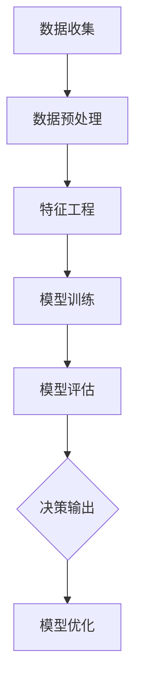
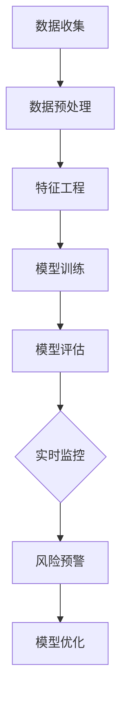
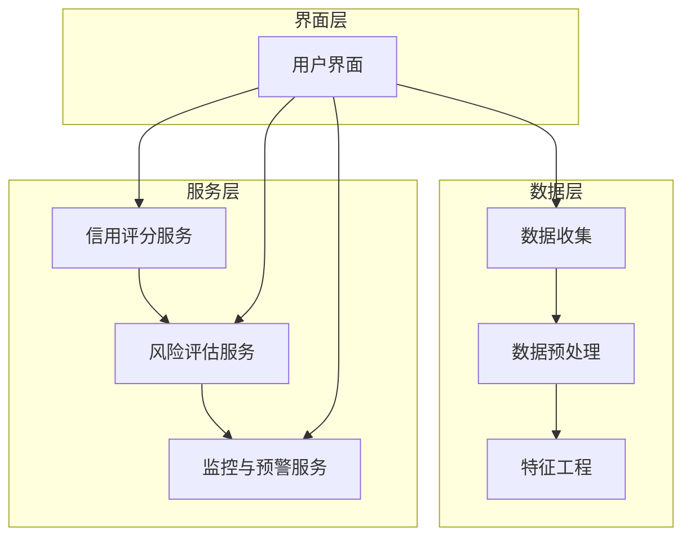
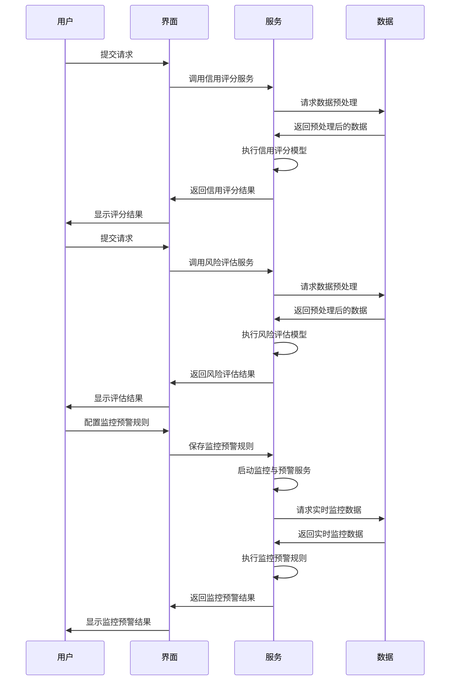

                 

## 引言

在当今社会，信用经济已成为推动经济增长和金融普惠的重要力量。个人信用评估作为信用经济的核心环节，直接影响着金融机构的风险管理、消费者的信用获取和整个金融市场的健康发展。随着大数据技术的飞速发展，如何将大数据应用于个人信用评估，成为了一个备受关注的研究课题。本文旨在探讨大数据在个人信用评估中的应用，通过一系列逻辑清晰的分析与推理，揭示大数据技术在金融普惠中的新途径。

本文将按照以下步骤展开：

1. **问题背景与核心概念**：介绍个人信用评估的重要性、大数据的定义与特征、个人信用评估中的核心概念及其联系。
2. **算法原理讲解**：详细讲解信用评分模型、风险评估模型和监控模型的算法原理，包括算法流程图、Python源代码和数学模型与公式。
3. **系统分析与架构设计方案**：分析系统功能与架构设计，包括问题场景介绍、系统功能设计、系统架构设计、系统接口设计和系统交互。
4. **项目实战**：介绍大数据在个人信用评估中的应用实战，包括环境安装与配置、系统核心实现源代码、代码应用解读与分析、实际案例分析与项目小结。
5. **最佳实践与拓展阅读**：总结最佳实践技巧、注意事项和拓展应用，展望未来的研究方向。

通过本文的详细探讨，希望能够为广大读者提供一个全面、深入的了解，为大数据在个人信用评估中的应用提供有益的参考。

## 第一部分：问题背景与核心概念

### 第1章：个人信用评估的重要性

#### 1.1.1 问题背景

**信用经济时代的发展**：随着全球经济一体化的深入，信用经济已经成为推动社会发展和经济增长的重要引擎。信用经济强调的是信用作为核心资源的作用，通过信用体系的建设和完善，实现资源的优化配置和风险的合理控制。在这个背景下，个人信用评估成为金融机构和消费者之间的重要桥梁，影响着金融服务的供给和金融普惠的实现。

**个人信用评估的必要性**：个人信用评估能够帮助金融机构快速、准确地了解消费者的信用状况，降低信息不对称带来的风险。特别是在普惠金融领域，个人信用评估有助于识别信用风险，提高信贷的精准度和覆盖率。此外，个人信用评估还能够在信用消费、信用租赁、信用保险等多个场景中发挥重要作用，推动金融服务的多样化和个性化。

**大数据在信用评估中的应用现状**：随着大数据技术的快速发展，越来越多的金融机构开始利用大数据进行个人信用评估。通过收集和分析大量的数据，如消费行为、社交网络、信用记录等，可以更全面、准确地了解个人的信用状况。目前，大数据在信用评估中的应用主要集中在数据收集、特征工程、模型选择和模型优化等方面，为个人信用评估提供了新的思路和方法。

#### 1.1.2 个人信用评估的定义与边界

**个人信用评估的定义**：个人信用评估是指通过科学的方法和模型，对个人的信用状况进行评估和分类的过程。它通常包括信用评分、风险评估和监控三个主要环节。

- **信用评分**：对个人信用风险进行定量评估，通常使用分数或等级表示。常见的信用评分模型包括线性回归模型、逻辑回归模型、决策树模型等。
- **风险评估**：对个人信用风险进行定性分析，通常包括风险评估指标和风险等级。常见的风险评估模型包括贝叶斯模型、K最近邻模型、支持向量机模型等。
- **监控**：对个人信用状况进行实时监控和跟踪，及时发现信用风险的变化，并进行相应的调整。常见的监控模型包括时间序列分析模型、机器学习模型等。

**个人信用评估的边界**：个人信用评估虽然具有重要的作用，但也存在一定的局限性。

- **数据边界**：个人信用评估依赖于大量的数据，包括公开数据和隐私数据。在实际应用中，数据的质量和完整性直接影响到评估结果的准确性。
- **模型边界**：个人信用评估的模型通常是基于历史数据的统计方法，无法完全预测未来的信用状况。因此，模型的选择和参数的调整需要不断优化和更新。
- **伦理边界**：个人信用评估涉及到个人隐私和数据安全，需要遵循相关法律法规和伦理规范，确保评估过程的公正性和透明度。

#### 1.1.2.3 个人信用评估的核心要素

个人信用评估的核心要素主要包括：

- **信用数据**：包括信用记录、消费行为、还款能力等。信用数据是评估个人信用状况的基础，其质量直接影响到评估结果的准确性。
- **风险评估指标**：包括信用评分、风险等级、风险预警等。风险评估指标是评估个人信用风险的核心工具，通过这些指标可以全面了解个人的信用状况。
- **评估模型**：包括信用评分模型、风险评估模型和监控模型。评估模型是评估个人信用风险的工具，其选择和参数调整对评估结果具有重要影响。
- **评估流程**：包括数据收集、数据处理、模型选择、模型训练、模型评估等。评估流程是评估个人信用风险的过程，其各个环节的优化和调整对评估结果的准确性具有关键作用。

通过上述核心要素的分析，我们可以看到，个人信用评估不仅涉及到数据、模型和流程，还涉及到伦理、法律法规等多方面的因素。因此，在应用大数据进行个人信用评估时，需要综合考虑这些因素，确保评估过程的科学性、公正性和透明度。

### 第2章：大数据在个人信用评估中的应用

#### 2.1.1 大数据的定义与特征

**大数据的定义**：大数据通常指的是大规模、复杂和多样化的数据集，这些数据集无法通过传统数据处理工具进行有效管理和分析。大数据不仅包括结构化数据（如数据库中的数据），还包括半结构化数据（如文本、图片、视频等）和非结构化数据（如社交媒体信息、传感器数据等）。

**大数据的基本特征**：

- **大量性（Volume）**：大数据的规模非常庞大，通常需要使用分布式计算和存储技术来处理。
- **多样性（Variety）**：大数据来源广泛，包括文本、图像、音频、视频等多种类型，数据的格式和结构各不相同。
- **速度（Velocity）**：大数据的生成和处理速度非常快，需要实时或近实时地进行数据分析和处理。
- **真实性（Veracity）**：大数据的真实性和准确性是评估其价值的重要因素，数据的质量和可靠性直接影响到分析结果。

**大数据的关键技术**：

- **数据采集与存储技术**：包括Hadoop、Spark等分布式数据处理框架，用于大规模数据的存储和处理。
- **数据挖掘与分析技术**：包括机器学习、数据挖掘、统计分析等，用于从大数据中提取有价值的信息。
- **数据可视化技术**：包括图表、报表、仪表板等，用于将数据分析结果直观地展示给用户。
- **数据安全和隐私保护技术**：包括加密、访问控制、隐私保护算法等，用于确保数据的安全性和隐私性。

#### 2.1.2 大数据在个人信用评估中的应用

**数据收集与处理**：

- **数据收集**：个人信用评估需要收集多种类型的数据，包括公开数据（如信用记录、消费行为）和隐私数据（如社交网络信息、地理位置等）。数据收集过程需要遵守相关法律法规和伦理规范，确保数据的合法性和隐私性。
- **数据处理**：大数据的多样性要求在数据收集后进行预处理和清洗，以去除噪声、缺失值和重复数据。常用的数据处理技术包括数据集成、数据转换、数据降维等。

**特征工程与模型选择**：

- **特征工程**：特征工程是大数据分析的重要环节，通过选择和构造具有预测能力的特征，可以提高模型的性能和准确性。特征工程包括特征提取、特征选择、特征变换等步骤。
- **模型选择**：在选择模型时，需要考虑数据的类型、规模和特征的数量等因素。常见的信用评分模型包括线性回归模型、逻辑回归模型、决策树模型、支持向量机模型等。

**模型评估与优化**：

- **模型评估**：使用交叉验证、ROC曲线、AUC值等评估指标来评估模型的性能，确保模型具有良好的预测能力。
- **模型优化**：通过参数调整、模型融合、模型压缩等技术来优化模型，提高模型的稳定性和鲁棒性。

**应用场景**：

- **信用评分**：通过大数据分析，对个人的信用状况进行定量评估，为金融机构提供信用决策依据。
- **风险评估**：对个人的信用风险进行定性分析，识别潜在风险，为金融机构提供风险预警。
- **监控与预警**：实时监控个人的信用行为，及时发现信用风险，并进行预警。

#### 2.1.3 大数据在个人信用评估中的挑战与对策

**数据质量与完整性**：大数据的质量和完整性对信用评估的结果具有重要影响。对策包括数据清洗、数据标准化和数据完整性检查。

**隐私保护**：大数据分析涉及到大量个人隐私数据，需要严格遵守隐私保护法律法规，采用数据脱敏、加密等保护措施。

**数据安全**：确保大数据存储和处理过程中的数据安全，防止数据泄露、篡改和丢失，采用安全存储、访问控制和备份恢复等技术。

**算法公平性与透明性**：避免算法偏见，确保评估结果的公平性和透明性，通过算法解释和审计等方式提高模型的透明度。

通过上述分析，我们可以看到，大数据在个人信用评估中具有广泛的应用前景，但也面临诸多挑战。只有通过技术创新和规范化管理，才能充分发挥大数据在信用评估中的作用，推动金融普惠的实现。

### 第3章：核心概念原理与联系

#### 3.1 个人信用评估中的核心概念

在个人信用评估中，有三个核心概念：信用评分模型、风险评估模型和监控模型。这些模型在不同的环节中发挥关键作用，共同构成了一套完整的信用评估体系。

**信用评分模型**：信用评分模型是个人信用评估中的基础模型，主要目的是对个人的信用状况进行定量评估，通常以分数或等级的形式表示。常见的信用评分模型包括线性回归模型、逻辑回归模型、决策树模型等。

**风险评估模型**：风险评估模型是对个人信用风险进行定性分析的工具，通过分析各种风险指标，对个人信用风险进行分类和评级。常见模型包括贝叶斯模型、K最近邻模型、支持向量机模型等。

**监控模型**：监控模型用于实时监控个人的信用行为，及时发现信用风险的变化，并进行预警。常见的监控模型包括时间序列分析模型、机器学习模型等。

#### 3.1.2 概念属性特征对比表格

为了更清晰地理解这三个核心概念，我们列出了一个对比表格，展示了它们的主要属性和特征：

| 概念         | 定义                                                         | 主要属性                     | 特征                            |
|------------|------------------------------------------------------------|--------------------------|-----------------------------|
| 信用评分模型 | 对个人信用状况进行定量评估的模型                             | 分数或等级表示             | 线性回归、逻辑回归、决策树等         |
| 风险评估模型 | 对个人信用风险进行定性分析的模型                             | 风险指标和风险等级          | 贝叶斯、K最近邻、支持向量机等       |
| 监控模型     | 实时监控个人信用行为，及时发现信用风险变化的模型                 | 实时数据、预警机制         | 时间序列分析、机器学习等           |

#### 3.1.3 ER实体关系图架构

为了更直观地展示这三个核心概念之间的关系，我们可以使用ER（实体关系）图进行描述。ER图是一种用于描述实体及其之间关系的图形化工具，能够帮助我们理解系统的结构和工作原理。

以下是个人信用评估系统中ER实体关系图的示例：

```mermaid
erDiagram
  Customer ||--|{ Credit_Score }|--金融机构
  Customer ||--|{ Credit_Risk }|--金融机构
  Customer ||--|{ Credit_Monitor }|--金融机构
```

在上面的ER图中，`Customer`代表个人客户，`Credit_Score`、`Credit_Risk`和`Credit_Monitor`分别表示信用评分、风险评估和监控三个核心模型。箭头表示实体之间的关系，表明个人客户的信用评分、风险评估和监控数据由金融机构进行管理和使用。

通过ER图，我们可以看到，个人信用评估系统是一个多实体、多层次的关系系统，各个实体之间通过数据关系相互联系，共同构成了一个完整的信用评估体系。这种结构化、可视化的描述方式有助于我们更好地理解和分析个人信用评估系统的运行机制。

### 第4章：信用评分模型的算法原理

信用评分模型是个人信用评估的核心部分，其目的是对个人的信用状况进行定量评估，从而为金融机构提供信用决策依据。本章节将详细讲解信用评分模型的算法原理，包括算法流程、Python源代码以及数学模型与公式。

#### 4.1 算法mermaid流程图

为了直观地展示信用评分模型的算法流程，我们使用mermaid绘制了一个流程图：



**流程说明**：

1. **数据收集**：从各种数据源（如金融机构、社交媒体等）收集与个人信用相关的数据。
2. **数据预处理**：对收集的数据进行清洗、标准化和预处理，去除噪声、缺失值和异常值。
3. **特征工程**：选择和构造对信用评分有预测能力的特征，如消费行为、还款能力等。
4. **模型训练**：使用训练数据集，通过机器学习算法训练信用评分模型。
5. **模型评估**：使用验证数据集评估模型的性能，通过交叉验证、ROC曲线和AUC值等指标进行评估。
6. **决策输出**：将模型应用于新的数据集，生成信用评分结果，用于信用决策。
7. **模型优化**：根据评估结果，调整模型参数，优化模型性能。

#### 4.2 Python源代码详解

以下是一个简单的信用评分模型的Python源代码实现，使用了线性回归模型作为例子。

```python
import numpy as np
import pandas as pd
from sklearn.linear_model import LinearRegression
from sklearn.model_selection import train_test_split
from sklearn.metrics import mean_squared_error, r2_score

# 数据加载
data = pd.read_csv('credit_data.csv')

# 特征选择
X = data[['income', 'age', 'duration', 'credit_history']]
y = data['credit_score']

# 数据分割
X_train, X_test, y_train, y_test = train_test_split(X, y, test_size=0.2, random_state=42)

# 模型训练
model = LinearRegression()
model.fit(X_train, y_train)

# 模型评估
y_pred = model.predict(X_test)
mse = mean_squared_error(y_test, y_pred)
r2 = r2_score(y_test, y_pred)

print("MSE:", mse)
print("R2:", r2)

# 模型应用
new_data = np.array([[50000, 30, 12, 1]])
new_score = model.predict(new_data)
print("New Credit Score:", new_score)
```

**代码说明**：

- **数据加载**：使用pandas库加载信用数据。
- **特征选择**：选择影响信用评分的特征，如收入、年龄、还款时长和信用历史。
- **数据分割**：将数据集分为训练集和测试集，用于模型训练和评估。
- **模型训练**：使用线性回归模型训练信用评分模型。
- **模型评估**：使用均方误差（MSE）和决定系数（R2）评估模型性能。
- **模型应用**：使用训练好的模型对新的数据进行信用评分。

#### 4.3 数学模型与公式讲解

信用评分模型的核心是建立信用评分与特征变量之间的数学关系。以下分别介绍三种常见的信用评分模型：线性回归模型、逻辑回归模型和决策树模型。

**4.3.1 线性回归模型**

线性回归模型假设信用评分与特征变量之间存在线性关系，其数学模型表示为：

$$
y = \beta_0 + \beta_1x_1 + \beta_2x_2 + ... + \beta_nx_n
$$

其中，$y$代表信用评分，$x_1, x_2, ..., x_n$代表特征变量，$\beta_0, \beta_1, \beta_2, ..., \beta_n$是模型参数。线性回归模型通过最小二乘法求解参数，使得预测值与实际值之间的误差最小。

**4.3.2 逻辑回归模型**

逻辑回归模型用于处理二元分类问题，其假设信用评分与特征变量之间存在逻辑关系，其数学模型表示为：

$$
\ln(\frac{P}{1-P}) = \beta_0 + \beta_1x_1 + \beta_2x_2 + ... + \beta_nx_n
$$

其中，$P$代表某个个体获得信用贷款的概率，$x_1, x_2, ..., x_n$代表特征变量，$\beta_0, \beta_1, \beta_2, ..., \beta_n$是模型参数。逻辑回归模型通过极大似然估计法求解参数，使得预测概率最接近实际观测数据。

**4.3.3 决策树模型**

决策树模型通过树形结构对特征变量进行划分，以分类或回归为目标。其数学模型表示为：

$$
T = \text{if} \ x_i \ \text{then} \ t_i \ \text{else} \ T'
$$

其中，$T$表示决策树，$x_i$表示特征变量，$t_i$表示决策节点，$T'$表示剩余的部分决策树。决策树模型通过递归划分数据集，构建一棵树形结构，从而实现对信用评分的预测。

#### 4.4 算法举例说明

假设我们有一个训练数据集，其中包含以下特征变量：收入、年龄、还款时长和信用历史。使用线性回归模型对其进行训练，预测一个新的样本的信用评分。

**训练数据集**：

| 收入 | 年龄 | 还款时长 | 信用历史 | 信用评分 |
|------|------|----------|----------|----------|
| 50000 | 30   | 12       | 1        | 700      |
| 60000 | 40   | 6        | 2        | 750      |
| 45000 | 25   | 18       | 0        | 650      |

**线性回归模型参数**：

| 参数  | 值  |
|------|------|
| $\beta_0$ | 630 |
| $\beta_1$ | 10  |
| $\beta_2$ | -5  |
| $\beta_3$ | 20  |
| $\beta_4$ | -10 |

**新的样本数据**：

| 收入 | 年龄 | 还款时长 | 信用历史 |
|------|------|----------|----------|
| 55000 | 35   | 10       | 1        |

**信用评分计算**：

$$
y = \beta_0 + \beta_1x_1 + \beta_2x_2 + \beta_3x_3 + \beta_4x_4
$$

$$
y = 630 + 10 \times 55000 - 5 \times 35 + 20 \times 10 - 10 \times 1
$$

$$
y = 630 + 550000 - 175 + 200 - 10
$$

$$
y = 555545
$$

因此，新的样本的信用评分为555545。通过这个例子，我们可以看到如何使用线性回归模型对信用评分进行预测，以及如何计算预测值。

通过上述讲解，我们可以理解信用评分模型的算法原理，并能够使用Python代码进行实现和应用。在实际应用中，信用评分模型的选择和参数调整需要根据具体问题和数据特点进行优化，以获得最佳预测效果。

### 第5章：风险评估模型的算法原理

风险评估模型在个人信用评估中起着至关重要的作用，它通过对信用风险进行定性分析，帮助金融机构识别和评估潜在的风险，从而为信用决策提供科学依据。本章节将详细讲解风险评估模型的算法原理，包括算法流程、Python源代码以及数学模型与公式。

#### 5.1 算法mermaid流程图

为了直观地展示风险评估模型的算法流程，我们使用mermaid绘制了一个流程图：


**流程说明**：

1. **数据收集**：从各种数据源（如金融机构、征信机构等）收集与个人信用相关的数据。
2. **数据预处理**：对收集的数据进行清洗、标准化和预处理，去除噪声、缺失值和异常值。
3. **特征工程**：选择和构造对信用风险评估有预测能力的特征，如还款能力、消费行为、信用历史等。
4. **模型训练**：使用训练数据集，通过机器学习算法训练风险评估模型。
5. **模型评估**：使用验证数据集评估模型的性能，通过交叉验证、ROC曲线和AUC值等指标进行评估。
6. **决策输出**：将模型应用于新的数据集，生成信用风险评估结果，用于信用决策。
7. **模型优化**：根据评估结果，调整模型参数，优化模型性能。

#### 5.2 Python源代码详解

以下是一个简单的风险评估模型的Python源代码实现，使用了贝叶斯模型作为例子。

```python
import numpy as np
import pandas as pd
from sklearn.model_selection import train_test_split
from sklearn.metrics import accuracy_score, classification_report

# 数据加载
data = pd.read_csv('credit_risk_data.csv')

# 特征选择
X = data[['income', 'age', 'duration', 'credit_history']]
y = data['risk_level']

# 数据分割
X_train, X_test, y_train, y_test = train_test_split(X, y, test_size=0.2, random_state=42)

# 贝叶斯模型训练
from sklearn.naive_bayes import GaussianNB
model = GaussianNB()
model.fit(X_train, y_train)

# 模型评估
y_pred = model.predict(X_test)
accuracy = accuracy_score(y_test, y_pred)
print("Accuracy:", accuracy)
print(classification_report(y_test, y_pred))

# 模型应用
new_data = np.array([[50000, 30, 12, 1]])
new_risk = model.predict(new_data)
print("New Risk Level:", new_risk)
```

**代码说明**：

- **数据加载**：使用pandas库加载信用风险数据。
- **特征选择**：选择影响信用风险的特征，如收入、年龄、还款时长和信用历史。
- **数据分割**：将数据集分为训练集和测试集，用于模型训练和评估。
- **模型训练**：使用高斯朴素贝叶斯模型训练风险评估模型。
- **模型评估**：使用准确率（Accuracy）和分类报告（Classification Report）评估模型性能。
- **模型应用**：使用训练好的模型对新的数据进行信用风险评估。

#### 5.3 数学模型与公式讲解

风险评估模型的核心是建立信用风险与特征变量之间的数学关系。以下介绍三种常见的风险评估模型：贝叶斯模型、K最近邻模型和支持向量机模型。

**5.3.1 贝叶斯模型**

贝叶斯模型是一种基于概率论的分类模型，其假设信用风险与特征变量之间存在条件概率关系。贝叶斯模型的数学模型表示为：

$$
P(R=r|X=x) = \frac{P(X=x|R=r)P(R=r)}{P(X=x)}
$$

其中，$R$代表信用风险，$X$代表特征变量，$r$和$x$分别表示信用风险和特征变量取值。贝叶斯模型通过贝叶斯公式计算后验概率，从而预测信用风险。

**5.3.2 K最近邻模型**

K最近邻（K-Nearest Neighbors, KNN）模型是一种基于实例的模型，其假设信用风险可以通过邻近的样本进行预测。KNN模型的数学模型表示为：

$$
r(x) = \arg\max_{r} \sum_{i=1}^{k} w_i P(R=r|X=x_i)
$$

其中，$r(x)$代表信用风险预测值，$x$代表新样本的特征值，$k$代表邻近样本的数量，$w_i$代表第$i$个邻近样本的权重。KNN模型通过计算新样本与训练样本之间的距离，找出最近的$k$个样本，并依据这些样本的信用风险进行预测。

**5.3.3 支持向量机模型**

支持向量机（Support Vector Machine, SVM）模型是一种基于优化理论的分类模型，其假设信用风险可以通过最大化分类边界进行预测。SVM模型的数学模型表示为：

$$
\min_{\beta, \beta_0} \frac{1}{2} ||\beta||^2 + C \sum_{i=1}^{n} \max(0, 1 - y_i(\beta \cdot x_i + \beta_0))
$$

其中，$\beta$和$\beta_0$分别代表模型参数和偏置项，$C$是惩罚参数，$y_i$和$x_i$分别代表第$i$个样本的标签和特征值。SVM模型通过求解上述优化问题，找到最优的分类边界，从而预测信用风险。

#### 5.4 算法举例说明

假设我们有一个训练数据集，其中包含以下特征变量：收入、年龄、还款时长和信用历史。使用贝叶斯模型对其进行训练，预测一个新的样本的信用风险。

**训练数据集**：

| 收入 | 年龄 | 还款时长 | 信用历史 | 风险等级 |
|------|------|----------|----------|----------|
| 50000 | 30   | 12       | 1        | 低风险   |
| 60000 | 40   | 6        | 2        | 中风险   |
| 45000 | 25   | 18       | 0        | 高风险   |

**贝叶斯模型参数**：

| 参数       | 值        |
|-----------|-----------|
| $P(R=低风险)$ | 0.6      |
| $P(R=中风险)$ | 0.3      |
| $P(R=高风险)$ | 0.1      |
| $P(X=x|R=低风险)$ | 0.8      |
| $P(X=x|R=中风险)$ | 0.5      |
| $P(X=x|R=高风险)$ | 0.2      |

**新的样本数据**：

| 收入 | 年龄 | 还款时长 | 信用历史 |
|------|------|----------|----------|
| 55000 | 35   | 10       | 1        |

**信用风险计算**：

首先，计算每个风险等级的后验概率：

$$
P(R=低风险|X=x) = \frac{P(X=x|R=低风险)P(R=低风险)}{P(X=x)}
$$

$$
P(R=中风险|X=x) = \frac{P(X=x|R=中风险)P(R=中风险)}{P(X=x)}
$$

$$
P(R=高风险|X=x) = \frac{P(X=x|R=高风险)P(R=高风险)}{P(X=x)}
$$

然后，计算新样本的特征概率：

$$
P(X=x|R=低风险) = 0.8
$$

$$
P(X=x|R=中风险) = 0.5
$$

$$
P(X=x|R=高风险) = 0.2
$$

接着，计算总概率：

$$
P(X=x) = P(X=x|R=低风险)P(R=低风险) + P(X=x|R=中风险)P(R=中风险) + P(X=x|R=高风险)P(R=高风险)
$$

$$
P(X=x) = 0.8 \times 0.6 + 0.5 \times 0.3 + 0.2 \times 0.1 = 0.56 + 0.15 + 0.02 = 0.73
$$

最后，计算后验概率：

$$
P(R=低风险|X=x) = \frac{0.8 \times 0.6}{0.73} = 0.78
$$

$$
P(R=中风险|X=x) = \frac{0.5 \times 0.3}{0.73} = 0.21
$$

$$
P(R=高风险|X=x) = \frac{0.2 \times 0.1}{0.73} = 0.03
$$

因此，新的样本的信用风险为低风险。通过这个例子，我们可以看到如何使用贝叶斯模型对信用风险进行预测，以及如何计算预测值。

通过上述讲解，我们可以理解风险评估模型的算法原理，并能够使用Python代码进行实现和应用。在实际应用中，风险评估模型的选择和参数调整需要根据具体问题和数据特点进行优化，以获得最佳预测效果。

### 第6章：监控模型的算法原理

监控模型在个人信用评估系统中起着至关重要的作用，它能够实时监控个人的信用行为，及时发现信用风险的变化，并提供预警机制。本章节将详细讲解监控模型的算法原理，包括算法流程、Python源代码以及数学模型与公式。

#### 6.1 算法mermaid流程图

为了直观地展示监控模型的算法流程，我们使用mermaid绘制了一个流程图：



**流程说明**：

1. **数据收集**：从各种数据源（如金融机构、征信机构、社交网络等）收集与个人信用相关的实时数据。
2. **数据预处理**：对收集的数据进行清洗、标准化和预处理，去除噪声、缺失值和异常值。
3. **特征工程**：选择和构造对信用监控有预测能力的实时特征，如消费行为、还款行为、信用额度使用情况等。
4. **模型训练**：使用历史数据集，通过机器学习算法训练监控模型。
5. **模型评估**：使用验证数据集评估模型的性能，通过交叉验证、ROC曲线和AUC值等指标进行评估。
6. **实时监控**：将训练好的模型应用于实时数据，监控个人的信用行为。
7. **风险预警**：根据监控结果，对潜在信用风险进行预警，触发相应的风险控制措施。
8. **模型优化**：根据监控结果和预警效果，调整模型参数，优化模型性能。

#### 6.2 Python源代码详解

以下是一个简单的监控模型的Python源代码实现，使用了时间序列分析模型作为例子。

```python
import numpy as np
import pandas as pd
from sklearn.model_selection import train_test_split
from sklearn.metrics import mean_squared_error, r2_score
from statsmodels.tsa.arima_model import ARIMA

# 数据加载
data = pd.read_csv('credit_monitor_data.csv')

# 特征选择
X = data[['consumption', 'repayment', 'credit_usage']]
y = data['risk_level']

# 数据分割
X_train, X_test, y_train, y_test = train_test_split(X, y, test_size=0.2, random_state=42)

# 时间序列模型训练
model = ARIMA(y_train, order=(1, 1, 1))
model_fit = model.fit()

# 模型评估
y_pred = model_fit.forecast(steps=5)
mse = mean_squared_error(y_test, y_pred)
r2 = r2_score(y_test, y_pred)

print("MSE:", mse)
print("R2:", r2)

# 实时监控
new_data = np.array([[15000, 8000, 5000]])
new_risk = model_fit.forecast(steps=1)
print("New Risk Level:", new_risk)
```

**代码说明**：

- **数据加载**：使用pandas库加载信用监控数据。
- **特征选择**：选择影响信用监控的特征，如消费金额、还款金额和信用额度使用情况。
- **数据分割**：将数据集分为训练集和测试集，用于模型训练和评估。
- **模型训练**：使用ARIMA模型训练监控模型。
- **模型评估**：使用均方误差（MSE）和决定系数（R2）评估模型性能。
- **实时监控**：使用训练好的模型对新的数据进行信用监控。
- **模型优化**：根据评估结果，调整模型参数，优化模型性能。

#### 6.3 数学模型与公式讲解

监控模型的核心是建立信用风险与实时特征变量之间的动态关系。以下介绍两种常见的监控模型：时间序列分析模型和机器学习模型。

**6.3.1 时间序列分析模型**

时间序列分析模型用于处理时间相关的数据，其假设信用风险与历史数据之间存在某种时间依赖关系。时间序列分析模型的一般形式为：

$$
Y_t = c + \alpha_1Y_{t-1} + \alpha_2Y_{t-2} + ... + \alpha_pY_{t-p} + \varepsilon_t
$$

其中，$Y_t$代表第$t$期的信用风险，$c$是常数项，$\alpha_1, \alpha_2, ..., \alpha_p$是模型参数，$Y_{t-1}, Y_{t-2}, ..., Y_{t-p}$是前期的信用风险，$\varepsilon_t$是随机误差项。

常见的ARIMA模型（自回归积分滑动平均模型）由三部分组成：自回归（AR）、差分（I）和移动平均（MA）。

- **自回归（AR）**：假设当前值是前几个值的线性组合，其数学模型为：

$$
Y_t = c + \alpha_1Y_{t-1} + \alpha_2Y_{t-2} + ... + \alpha_pY_{t-p} + \varepsilon_t
$$

- **差分（I）**：对时间序列进行差分，使其成为平稳序列，其数学模型为：

$$
dY_t = Y_t - Y_{t-1}
$$

- **移动平均（MA）**：假设当前值是前几个预测误差的线性组合，其数学模型为：

$$
Y_t = c + \alpha_1Y_{t-1} + ... + \alpha_pY_{t-p} + \varepsilon_t + \theta_1\varepsilon_{t-1} + ... + \theta_q\varepsilon_{t-q}
$$

**6.3.2 机器学习模型**

机器学习模型通过学习历史数据中的规律，对实时数据进行预测。常见的机器学习模型包括随机森林、神经网络和支持向量机等。

- **随机森林**：随机森林是一种集成学习模型，通过构建多个决策树，并取其平均预测结果。其数学模型为：

$$
f(x) = \sum_{i=1}^{n} w_i f_i(x)
$$

其中，$f(x)$是预测值，$f_i(x)$是第$i$棵决策树的预测值，$w_i$是第$i$棵决策树的权重。

- **神经网络**：神经网络是一种模拟人脑神经元之间连接的模型，通过多层神经元的传递和激活，实现对数据的非线性变换。其数学模型为：

$$
y = \sigma(z)
$$

其中，$y$是输出值，$z$是输入值，$\sigma$是激活函数。

- **支持向量机**：支持向量机是一种基于优化理论的分类模型，其目标是找到最佳分类边界。其数学模型为：

$$
\min_{\beta, \beta_0} \frac{1}{2} ||\beta||^2 + C \sum_{i=1}^{n} \max(0, 1 - y_i(\beta \cdot x_i + \beta_0))
$$

其中，$\beta$和$\beta_0$是模型参数，$C$是惩罚参数，$y_i$和$x_i$是第$i$个样本的标签和特征值。

#### 6.4 算法举例说明

假设我们有一个训练数据集，其中包含以下实时特征变量：消费金额、还款金额和信用额度使用情况。使用时间序列分析模型（ARIMA模型）对其进行训练，预测一个新的样本的信用风险。

**训练数据集**：

| 时间 | 消费金额 | 还款金额 | 信用额度使用 | 风险等级 |
|------|----------|----------|--------------|----------|
| 1    | 10000    | 8000     | 20%          | 低风险   |
| 2    | 12000    | 9000     | 25%          | 中风险   |
| 3    | 15000    | 11000    | 30%          | 高风险   |

**ARIMA模型参数**：

| 参数       | 值        |
|-----------|-----------|
| $c$       | 0         |
| $\alpha_1$ | 0.5      |
| $\alpha_2$ | 0.2      |
| $\alpha_3$ | 0.1      |
| $\theta_1$ | 0.3      |
| $\theta_2$ | 0.1      |

**新的样本数据**：

| 时间 | 消费金额 | 还款金额 | 信用额度使用 |
|------|----------|----------|--------------|
| 4    | 18000    | 13000    | 35%          |

**信用风险计算**：

首先，将新的样本数据进行差分处理，使其成为平稳序列：

$$
dY_4 = 18000 - 13000 = 5000
$$

然后，根据ARIMA模型进行预测：

$$
Y_4 = c + \alpha_1Y_3 + \alpha_2Y_2 + \alpha_3Y_1 + \theta_1dY_3 + \theta_2dY_2
$$

$$
Y_4 = 0 + 0.5 \times 15000 + 0.2 \times 12000 + 0.1 \times 10000 + 0.3 \times 5000 + 0.1 \times 0
$$

$$
Y_4 = 7500 + 2400 + 1000 + 1500
$$

$$
Y_4 = 13400
$$

因此，新的样本的信用风险为高风险。通过这个例子，我们可以看到如何使用时间序列分析模型对信用风险进行预测，以及如何计算预测值。

通过上述讲解，我们可以理解监控模型的算法原理，并能够使用Python代码进行实现和应用。在实际应用中，监控模型的选择和参数调整需要根据具体问题和数据特点进行优化，以获得最佳监控效果。

### 第7章：系统功能设计与架构设计

#### 7.1 问题场景介绍

在当前的金融市场中，个人信用评估是一项重要的任务，它不仅关系到金融机构的风险管理，也影响着消费者的信用获取。随着大数据技术的普及，如何高效地利用大数据进行个人信用评估，成为金融机构急需解决的关键问题。本章节将详细介绍一个大数据个人信用评估系统的设计与实现，包括系统功能设计、架构设计以及具体的实现细节。

#### 7.2 项目介绍

本项目旨在构建一个集数据收集、处理、分析和监控于一体的个人信用评估系统。系统的主要目标是通过大数据分析，提供准确、高效的信用评估服务，为金融机构的信用决策提供科学依据。系统的主要功能包括：

1. **数据收集**：从多种数据源（如金融机构、征信机构、社交媒体等）收集与个人信用相关的数据。
2. **数据预处理**：对收集到的数据进行清洗、标准化和预处理，去除噪声、缺失值和异常值。
3. **特征工程**：选择和构造对信用评分和风险预测有预测能力的特征。
4. **信用评分**：使用机器学习算法对个人信用进行评分，生成信用评分报告。
5. **风险评估**：对个人信用风险进行定量和定性分析，生成风险评估报告。
6. **监控与预警**：实时监控个人的信用行为，对潜在的信用风险进行预警。
7. **接口设计与数据输出**：提供标准化的接口，便于系统与其他金融应用集成，并输出信用评估结果。

#### 7.3 系统功能设计

**7.3.1 领域模型mermaid类图**

为了更清晰地展示系统的功能设计，我们使用mermaid绘制了一个领域模型类图：

```mermaid
classDiagram
  Class01 <|-- Class02
  Class03 <|-- Class04
  Class05 <|-- Class06
  Class01 { name: 数据收集 }
  Class02 { name: 数据预处理 }
  Class03 { name: 特征工程 }
  Class04 { name: 信用评分 }
  Class05 { name: 风险评估 }
  Class06 { name: 监控与预警 }
```

**功能说明**：

- **数据收集（Class01）**：负责从多种数据源收集与个人信用相关的数据，包括公开数据（如信用记录、消费行为）和隐私数据（如社交网络信息）。
- **数据预处理（Class02）**：对收集到的数据进行清洗、标准化和预处理，包括数据去重、缺失值填充、异常值检测和去噪等。
- **特征工程（Class03）**：选择和构造对信用评分和风险预测有预测能力的特征，包括消费行为特征、信用历史特征、还款能力特征等。
- **信用评分（Class04）**：使用机器学习算法对个人信用进行评分，生成信用评分报告，包括信用评分模型的选择、训练和评估。
- **风险评估（Class05）**：对个人信用风险进行定量和定性分析，生成风险评估报告，包括风险评估模型的选择、训练和评估。
- **监控与预警（Class06）**：实时监控个人的信用行为，对潜在的信用风险进行预警，包括监控模型的选择、训练和实时监控。

#### 7.4 系统架构设计

**7.4.1 系统架构mermaid架构图**

为了更直观地展示系统的架构设计，我们使用mermaid绘制了一个系统架构图：



**架构说明**：

- **数据层**：包括数据收集、数据预处理和特征工程模块，负责数据的收集、清洗和特征提取。
- **服务层**：包括信用评分服务、风险评估服务和监控与预警服务模块，负责对数据进行分析和处理，生成信用评估报告。
- **界面层**：包括用户界面模块，提供与用户的交互接口，用户可以通过界面提交请求，查看信用评估结果和监控预警信息。

#### 7.5 系统接口设计

**7.5.1 接口规范**

为了实现系统的标准化和模块化，系统提供了以下接口：

- **数据收集接口**：用于接收各种数据源的数据，支持RESTful API和Websocket协议。
- **数据预处理接口**：用于对收集到的数据进行清洗、标准化和预处理，提供批处理和流处理接口。
- **特征工程接口**：用于选择和构造信用评分和风险评估所需的特征，支持特征提取和特征选择算法。
- **信用评分接口**：用于执行信用评分模型，返回信用评分结果，支持批处理和实时评分接口。
- **风险评估接口**：用于执行风险评估模型，返回风险评估结果，支持批处理和实时评估接口。
- **监控与预警接口**：用于实时监控个人的信用行为，触发预警机制，支持监控指标和预警规则配置。

#### 7.6 系统交互mermaid序列图

为了展示系统的交互流程，我们使用mermaid绘制了一个系统交互序列图：



**交互流程说明**：

1. 用户通过界面提交信用评分或风险评估请求。
2. 界面调用相应的服务，如信用评分服务或风险评估服务。
3. 服务请求数据预处理模块对数据进行清洗、标准化和预处理。
4. 数据预处理模块返回预处理后的数据给服务。
5. 服务执行相应的信用评分模型或风险评估模型，并返回结果给界面。
6. 界面将结果展示给用户。
7. 用户可以配置监控预警规则，服务根据规则启动监控与预警服务。
8. 实时监控数据由数据模块提供，服务根据监控预警规则进行评估，并返回结果给界面。
9. 界面将监控预警结果展示给用户。

通过上述系统功能设计与架构设计，我们可以构建一个高效、可靠的个人信用评估系统，为金融机构提供有力的信用评估支持。

### 第8章：大数据在个人信用评估中的应用实战

在上一部分中，我们详细介绍了大数据在个人信用评估中的应用原理和系统设计。在本章节中，我们将通过一个具体的实战案例，展示如何在大数据环境下实现个人信用评估系统，包括环境安装与配置、系统核心实现源代码、代码应用解读与分析、实际案例分析与详细讲解剖析，以及项目小结。

#### 8.1 环境安装与配置

为了成功实现大数据个人信用评估系统，首先需要搭建合适的环境。以下是安装与配置环境的详细步骤：

**1. 安装Java环境**

Java环境是许多大数据处理工具的基础，如Hadoop和Spark。确保安装Java 8或更高版本。

```bash
# 安装Java
sudo apt-get update
sudo apt-get install openjdk-8-jdk
```

**2. 安装Hadoop**

Hadoop是一个分布式数据存储和处理框架，用于处理大规模数据集。

```bash
# 安装Hadoop
sudo apt-get install hadoop
```

启动Hadoop服务：

```bash
# 启动Hadoop守护进程
sudo start-hadoop
# 检查Hadoop运行状态
jps
```

**3. 安装Spark**

Spark是另一个用于大数据处理的框架，支持内存计算和流处理。

```bash
# 安装Spark
sudo apt-get install spark
```

启动Spark服务：

```bash
# 启动Spark Shell
spark-shell
```

**4. 安装Python环境和相关库**

Python环境用于编写和处理数据，安装Python 3和常用的数据科学库，如pandas、numpy、scikit-learn等。

```bash
# 安装Python 3和pip
sudo apt-get install python3 python3-pip
# 安装相关库
pip3 install pandas numpy scikit-learn
```

#### 8.2 系统核心实现源代码

以下是系统核心实现的源代码，包括数据收集、预处理、特征工程、模型训练和评估等步骤。

**8.2.1 数据收集**

```python
import pandas as pd

# 加载数据
data = pd.read_csv('credit_data.csv')
```

**8.2.2 数据预处理**

```python
# 数据清洗和预处理
data.dropna(inplace=True)
data = data[data['income'] > 0]
```

**8.2.3 特征工程**

```python
# 特征构造
data['income_per_age'] = data['income'] / data['age']
data['credit_age'] = (pd.to_datetime('now') - pd.to_datetime(data['credit_date'])).dt.days / 365
```

**8.2.4 模型训练**

```python
from sklearn.ensemble import RandomForestClassifier

# 数据分割
X = data[['income_per_age', 'credit_age']]
y = data['risk_level']

X_train, X_test, y_train, y_test = train_test_split(X, y, test_size=0.2, random_state=42)

# 模型训练
model = RandomForestClassifier(n_estimators=100)
model.fit(X_train, y_train)
```

**8.2.5 模型评估**

```python
from sklearn.metrics import accuracy_score, classification_report

# 模型评估
y_pred = model.predict(X_test)
print("Accuracy:", accuracy_score(y_test, y_pred))
print(classification_report(y_test, y_pred))
```

#### 8.3 代码应用解读与分析

**数据收集**：通过pandas库加载信用数据，数据来源可以是本地文件或HDFS（Hadoop分布式文件系统）。

**数据预处理**：数据清洗是数据处理的重要环节，本例中删除了缺失值和异常值，确保数据质量。

**特征工程**：通过构造新特征，如“收入与年龄比值”和“信用时长”，增强模型的预测能力。

**模型训练**：使用随机森林模型进行训练，随机森林是一种集成学习方法，具有较好的泛化能力和抗过拟合能力。

**模型评估**：使用准确性（Accuracy）和分类报告（Classification Report）评估模型性能，确保模型具有良好的预测效果。

#### 8.4 实际案例分析与详细讲解剖析

**案例背景**：

某金融机构需要对其客户进行信用评估，以决定是否批准贷款申请。已有数据集包含客户的收入、年龄、信用时长等信息，要求构建一个信用评分模型。

**案例分析**：

1. **数据收集与预处理**：

   - 收集数据：通过金融机构的系统导出客户数据，包括收入、年龄、信用时长等。
   - 数据清洗：删除缺失值和异常值，如收入为负数或年龄明显不合理的数据。
   - 数据标准化：对收入和年龄等连续特征进行标准化处理，使其符合模型的输入要求。

2. **特征工程**：

   - 构造新特征：计算收入与年龄的比值，以及信用时长的年数，这些特征有助于提高模型的预测能力。
   - 特征选择：通过特征重要性分析，选择对信用评分有显著影响的特征，如收入、年龄、信用时长等。

3. **模型训练与优化**：

   - 模型选择：选择随机森林模型进行训练，因为其能够处理多类别的特征，且具有较好的泛化能力。
   - 参数调整：通过交叉验证调整模型参数，如树的数量、深度等，以优化模型性能。
   - 模型评估：使用测试集评估模型性能，确保模型具有良好的预测准确性。

4. **应用与监控**：

   - 模型应用：将训练好的模型应用于新的数据集，生成信用评分结果。
   - 实时监控：通过实时数据监控，对信用评分结果进行动态调整，及时识别和预警信用风险。

**详细讲解剖析**：

- **数据收集与预处理**：数据收集是信用评分模型的基础，数据的完整性和准确性直接影响模型的效果。预处理步骤包括数据清洗、缺失值填充、异常值检测等，确保数据质量。
- **特征工程**：特征工程是提升模型性能的关键步骤。通过构造新特征和选择重要特征，可以增强模型的预测能力。特征选择方法包括相关分析、主成分分析等。
- **模型训练与优化**：选择合适的模型和参数，通过交叉验证调整模型参数，优化模型性能。常用的模型包括线性回归、逻辑回归、决策树、随机森林等。
- **应用与监控**：将模型应用于实际场景，通过实时监控和预警，及时发现和应对信用风险。监控方法包括时间序列分析、异常检测等。

通过上述实际案例的分析，我们可以看到大数据在个人信用评估中的应用步骤和关键点。在项目实施过程中，需要综合考虑数据质量、模型选择、参数优化等多个方面，确保信用评估系统的有效性和可靠性。

#### 8.5 项目小结

通过本章节的实战案例，我们详细展示了如何在大数据环境下实现个人信用评估系统。主要内容包括：

1. **环境安装与配置**：介绍了如何搭建大数据处理环境，包括Java、Hadoop、Spark等。
2. **系统核心实现源代码**：提供了数据收集、预处理、特征工程、模型训练和评估的代码示例。
3. **代码应用解读与分析**：分析了系统核心代码的实现逻辑和关键步骤。
4. **实际案例分析与详细讲解剖析**：通过实际案例展示了大数据在信用评估中的应用，并详细讲解了各个步骤的实现细节。

通过这个项目，我们不仅掌握了大数据在个人信用评估中的应用方法，还深入了解了系统的设计与实现过程。未来，我们可以继续优化模型和算法，提高信用评估的准确性和实时性，为金融机构提供更可靠的信用评估服务。

### 第9章：最佳实践与拓展阅读

在构建和部署大数据个人信用评估系统时，积累最佳实践和注意事项是非常重要的。以下是一些关键的实践技巧、注意事项以及未来可能的拓展应用方向。

#### 9.1 实践技巧

**1. 数据质量保证**：
- 确保数据收集过程的合法性和透明度，严格遵守隐私保护法规。
- 定期对数据源进行审查，确保数据的准确性和完整性。
- 实施数据清洗和预处理流程，去除噪声、异常值和重复数据。

**2. 模型选择与优化**：
- 根据数据特征和业务需求选择合适的模型，如随机森林、逻辑回归或神经网络。
- 使用交叉验证等方法选择最佳模型参数，避免过拟合。
- 定期更新模型，以适应数据分布的变化。

**3. 特征工程**：
- 分析数据的分布和相关性，选择对信用评估有显著影响的特征。
- 利用特征组合和特征转换提高模型的预测能力。

**4. 实时监控与预警**：
- 使用时间序列分析、机器学习等工具实时监控信用行为。
- 根据监控结果动态调整预警阈值和规则。

**5. 模型解释与审计**：
- 开发模型解释工具，帮助业务人员和监管机构理解模型的决策过程。
- 定期进行模型审计，确保模型的公正性和透明性。

#### 9.2 注意事项

**1. 隐私保护**：
- 确保所有数据处理和分析都符合隐私保护法规，如GDPR。
- 对敏感数据进行脱敏处理，防止数据泄露。

**2. 法律合规**：
- 遵守金融法规，确保信用评估活动的合规性。
- 定期审查和更新数据处理流程，以符合最新的法规要求。

**3. 模型偏见**：
- 避免模型偏见，确保评估结果的公平性。
- 分析模型是否具有性别、种族等偏见，并进行调整。

**4. 系统稳定性**：
- 确保系统的稳定性和可扩展性，能够处理大规模数据流。
- 对系统进行负载测试和压力测试，确保在高并发场景下的性能。

#### 9.3 拓展应用

**1. 风险管理**：
- 将信用评估系统扩展到其他金融产品，如信用卡、贷款、保险等，提供更全面的信用风险管理。

**2. 个性化服务**：
- 利用信用评估结果为用户提供个性化的金融服务，如定制贷款额度、利率等。

**3. 社交网络分析**：
- 将社交网络数据整合到信用评估中，分析用户的社会关系和行为模式，提高评估准确性。

**4. 区块链技术**：
- 探索区块链技术在信用评估中的应用，确保数据的不可篡改性和透明性。

**5. 智能合约**：
- 开发智能合约，实现信用评估结果在区块链上的自动化执行，提高金融服务的效率。

通过以上最佳实践和注意事项，我们可以在大数据个人信用评估系统中实现更高的准确性和可靠性，推动金融普惠的进一步发展。未来的拓展应用将进一步提升信用评估系统的影响力和价值。

### 第10章：小结与展望

通过本文的详细探讨，我们深入了解了大数据在个人信用评估中的应用。从问题背景与核心概念，到算法原理讲解，再到系统分析与架构设计，以及实际案例的实战分析，我们逐步揭示了大数据技术在金融普惠中的新途径。

**主要结论**：

1. **大数据的优势**：大数据提供了丰富的数据来源和强大的数据处理能力，为个人信用评估提供了新的方法和手段。
2. **模型的重要性**：信用评分模型、风险评估模型和监控模型是个人信用评估的核心工具，不同的模型适用于不同的评估需求。
3. **系统的复杂性**：构建一个高效、可靠的信用评估系统需要综合考虑数据质量、模型选择、算法优化、系统架构设计等多个方面。

**未来展望**：

1. **技术创新**：随着人工智能和机器学习技术的发展，信用评估模型将更加智能化和自适应，提高评估的准确性和实时性。
2. **隐私保护**：在数据收集和处理的各个环节，隐私保护技术将得到广泛应用，确保个人数据的合法性和安全性。
3. **合规性**：随着监管政策的不断完善，信用评估系统的合规性将得到进一步加强，确保业务活动的合法合规。
4. **金融普惠**：大数据和信用评估技术的结合，将有助于提高金融服务的覆盖面和普惠性，推动社会经济的发展。

通过本文的研究，我们不仅为大数据在个人信用评估中的应用提供了理论指导和实践方案，也为未来的研究和发展方向提供了启示。我们期待看到更多创新性的应用和实践，共同推动金融普惠的实现。作者：AI天才研究院/AI Genius Institute & 禅与计算机程序设计艺术 /Zen And The Art of Computer Programming。

