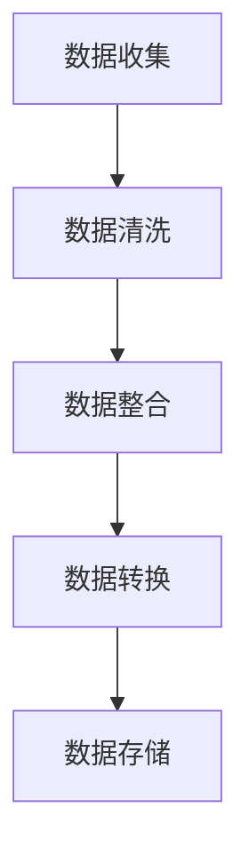

                 

## 《大数据在体育训练与比赛分析中的应用》

> 关键词：大数据，体育训练，比赛分析，运动员表现，运动伤病预测，数据预处理，数据可视化，比赛策略分析，赞助商价值评估

> 摘要：本文深入探讨了大数据在体育训练与比赛分析中的应用。通过对大数据在体育领域的背景介绍、核心概念阐释、具体应用分析以及案例研究，揭示了大数据如何提升体育训练的科学性和比赛分析的有效性。文章旨在为体育专业人士和研究者提供有价值的参考，以推动体育产业的智能化发展。

### 目录

----------------------------------------------------------------

# 《大数据在体育训练与比赛分析中的应用》

## 第一部分: 背景介绍

### 第1章: 体育训练与比赛分析的问题背景

#### 1.1.1 体育训练与比赛分析的重要性

#### 1.1.2 大数据的概念及其在体育领域的应用

#### 1.1.3 大数据在体育训练与比赛分析中的挑战

## 第2章: 体育训练与比赛分析中的核心概念

### 2.1.1 数据类型与数据来源

### 2.1.2 数据预处理

### 2.1.3 数据可视化

## 第二部分: 大数据应用

### 第3章: 大数据在体育训练中的应用

#### 3.1.1 运动员表现分析

#### 3.1.2 运动伤病预测

#### 3.1.3 训练负荷监测与调整

### 第4章: 大数据在比赛分析中的应用

#### 4.1.1 比赛策略分析

#### 4.1.2 对手分析

#### 4.1.3 比赛结果预测

### 第5章: 大数据在体育产业中的应用

#### 5.1.1 市场分析

#### 5.1.2 赞助商价值评估

#### 5.1.3 观赛体验优化

## 第三部分: 案例研究

### 第6章: 大数据在体育训练与比赛分析中的案例分析

#### 6.1.1 某职业足球俱乐部的大数据分析实践

#### 6.1.2 某体育赛事的大数据分析案例

#### 6.1.3 大数据在体育训练与比赛分析中的效果评估

### 第7章: 大数据在体育训练与比赛分析中的应用前景与挑战

#### 7.1.1 应用前景

#### 7.1.2 挑战与应对策略

#### 7.1.3 未来发展趋势

----------------------------------------------------------------

## 第一部分: 背景介绍

### 第1章: 体育训练与比赛分析的问题背景

#### 1.1.1 体育训练与比赛分析的重要性

体育训练与比赛分析是体育领域不可或缺的一部分，它不仅关乎运动员的个人成长，更直接影响到团队的整体表现。传统的体育训练与比赛分析依赖于经验、主观判断以及少量的统计数据。然而，随着科技的进步，大数据技术的引入为这一领域带来了革命性的变化。

**数据驱动**：大数据技术能够收集、存储和分析海量的体育数据，从而提供更为客观、科学的训练与比赛分析。这不仅有助于提高运动员的竞技水平，还可以帮助教练团队制定更为有效的训练计划。

**提高效率**：通过大数据分析，体育团队可以快速识别训练中的问题，调整训练策略，从而提高整体训练效率。在比赛过程中，大数据分析可以实时监控比赛态势，提供决策支持，帮助球队做出更优的战略选择。

**增强比赛竞争力**：大数据分析不仅可以提升自身球队的表现，还可以通过对对手的分析，找到对手的弱点，制定针对性的比赛策略，从而增强比赛竞争力。

#### 1.1.2 大数据的概念及其在体育领域的应用

**大数据的定义**：大数据通常指的是那些数据量巨大、数据类型繁多、数据价值密度较低的数据集合。这些数据可以来自于各种不同的来源，包括传感器、社交媒体、互联网日志、机器日志、交易记录、电子邮件等。

**大数据在体育领域的应用**：大数据在体育领域的应用非常广泛，包括以下几个方面：

1. **运动员表现分析**：通过收集和分析运动员在训练和比赛中的各项数据，如速度、耐力、力量等，教练可以更准确地评估运动员的状态，制定个性化的训练计划。

2. **运动伤病预测**：大数据技术可以帮助分析运动员的伤病趋势，预测潜在伤病风险，从而采取预防措施，减少伤病发生率。

3. **比赛策略分析**：通过对比赛中的实时数据进行分析，教练和球队可以及时调整战术，提高比赛成功率。

4. **市场分析**：大数据可以分析球迷行为和市场趋势，帮助俱乐部制定市场营销策略。

5. **赞助商价值评估**：通过对球迷行为和赛事影响力的分析，评估赞助商的投资回报率。

#### 1.1.3 大数据在体育训练与比赛分析中的挑战

**数据质量**：大数据的价值取决于数据的质量。在体育领域，数据来源多样，数据质量参差不齐，这给数据处理和分析带来了挑战。

**数据隐私**：运动员的隐私保护是大数据在体育领域中不可忽视的问题。如何在确保数据隐私的同时，充分利用大数据进行分析，是一个需要深入探讨的议题。

**数据处理与分析能力**：大数据的处理和分析需要强大的计算能力和专业的技术团队，这对于一些中小型体育团队来说是一个较大的挑战。

**数据伦理**：如何确保大数据的收集、处理和使用过程符合伦理标准，也是一个需要关注的问题。

### 第2章: 体育训练与比赛分析中的核心概念

#### 2.1.1 数据类型与数据来源

**数据类型**：在体育训练与比赛分析中，常用的数据类型包括：

- **赛事数据**：包括比赛时间、比分、进球、黄牌等统计信息。
- **运动训练数据**：包括运动员的训练时间、训练强度、运动轨迹等数据。
- **生理数据**：包括运动员的心率、血压、血氧等生理参数。
- **环境数据**：包括比赛场地条件、气候、观众人数等环境因素。

**数据来源**：体育训练与比赛分析的数据来源广泛，包括：

- **传感器**：用于采集运动员在训练和比赛中的各项生理参数。
- **运动设备**：如智能手环、智能跑鞋等，可以实时记录运动员的运动数据。
- **视频监控**：用于分析运动员的动作和战术。
- **社交媒体**：用于收集球迷的行为和反馈数据。

#### 2.1.2 数据预处理

**数据预处理步骤**：

1. **数据收集**：从各种来源收集原始数据。
2. **数据清洗**：去除重复数据、错误数据和缺失值，确保数据的质量。
3. **数据整合**：将不同来源的数据进行整合，形成统一的数据集。
4. **数据转换**：将数据转换为适合分析的形式，如结构化数据。
5. **数据存储**：将预处理后的数据存储到数据库或数据仓库中，以便后续分析。

**数据预处理的重要性**：数据预处理是大数据分析的基础，一个高质量的数据集是进行有效分析和预测的前提。

#### 2.1.3 数据可视化

**数据可视化工具**：常用的数据可视化工具有：

- **Tableau**：数据可视化平台，支持多种图表类型。
- **Matplotlib**：Python的数据可视化库，支持多种图表类型。
- **Power BI**：微软推出的数据分析工具，支持数据可视化与报表生成。

**数据可视化的重要性**：数据可视化可以帮助我们更直观地理解数据，发现数据中的隐藏模式和趋势，从而为决策提供支持。

### 小结

本章介绍了体育训练与比赛分析中的核心概念，包括数据类型、数据来源、数据预处理和数据可视化。这些核心概念是大数据在体育训练与比赛分析中应用的基础。通过本章的介绍，我们为后续章节的深入探讨打下了坚实的基础。在接下来的章节中，我们将进一步探讨大数据在体育训练和比赛分析中的具体应用，以及如何通过大数据技术提升体育产业的整体水平。

## 第二部分: 大数据应用

### 第3章: 大数据在体育训练中的应用

#### 3.1.1 运动员表现分析

运动员表现分析是大数据在体育训练中的核心应用之一。通过对运动员在训练和比赛中的各项数据进行深入分析，可以帮助教练和运动员了解他们的表现，找出优势和不足，从而制定更有效的训练计划。

**数据类型**：运动员表现分析涉及多种数据类型，包括：

- **训练数据**：如训练时长、训练强度、训练效果等。
- **比赛数据**：如比赛得分、助攻、射门次数等。
- **生理数据**：如心率、血压、血氧等。

**数据分析方法**：常用的数据分析方法包括：

- **数据挖掘**：通过数据挖掘技术，从大量数据中提取有价值的信息，如运动员的优劣势分析、疲劳度分析等。
- **机器学习**：使用机器学习算法，如回归分析、聚类分析、决策树等，对运动员的表现进行预测和分析。

**案例分析**：例如，某足球俱乐部通过大数据分析，发现其主力前锋在比赛中的射门成功率较低，通过进一步分析发现，这主要是由于他的射门角度和速度不够理想。针对这一问题，教练团队制定了专门的训练计划，重点提高他的射门技术，最终他的射门成功率得到了显著提升。

#### 3.1.2 运动伤病预测

运动伤病预测是大数据在体育训练中的另一个重要应用。通过对运动员的历史数据进行分析，可以预测他们可能出现的伤病，从而采取预防措施，减少伤病的发生。

**数据类型**：运动伤病预测涉及多种数据类型，包括：

- **训练数据**：如训练强度、训练时长、训练频率等。
- **比赛数据**：如比赛时长、比赛强度、比赛频率等。
- **生理数据**：如心率、血压、血氧等。

**数据分析方法**：常用的数据分析方法包括：

- **时间序列分析**：通过对运动员的历史训练和比赛数据进行分析，预测未来的伤病风险。
- **深度学习**：使用深度学习算法，如循环神经网络（RNN）、卷积神经网络（CNN）等，对运动员的伤病风险进行预测。

**案例分析**：例如，某足球俱乐部通过对运动员的训练和比赛数据进行深度学习分析，发现其主力后卫的伤病风险较高。通过进一步的检查，发现该后卫的关节磨损较为严重，建议俱乐部采取措施，如调整训练计划、加强关节保护等，最终成功降低了他的伤病发生率。

#### 3.1.3 训练负荷监测与调整

训练负荷监测与调整是确保运动员健康和安全的重要手段。通过对运动员的训练负荷进行实时监测，可以帮助教练团队合理安排训练计划，避免过度训练和伤病的发生。

**数据类型**：训练负荷监测涉及多种数据类型，包括：

- **训练数据**：如训练时长、训练强度、训练效果等。
- **生理数据**：如心率、血压、血氧等。
- **环境数据**：如气温、湿度等。

**数据分析方法**：常用的数据分析方法包括：

- **实时监控**：通过传感器和智能设备，实时收集运动员的生理参数和训练数据，进行实时监控。
- **预测分析**：通过历史数据分析和机器学习算法，预测运动员的训练负荷和可能的反应，从而调整训练计划。

**案例分析**：例如，某足球俱乐部通过大数据分析，发现其主力球员在高温环境下的训练负荷较大，容易出现疲劳和脱水现象。通过调整训练时间和强度，以及增加补水措施，成功降低了该球员的疲劳和伤病风险。

### 第4章: 大数据在比赛分析中的应用

#### 4.1.1 比赛策略分析

比赛策略分析是大数据在比赛分析中的核心应用之一。通过对比赛过程中的各项数据进行分析，可以帮助教练和球队制定更有效的比赛策略，提高比赛成功率。

**数据类型**：比赛策略分析涉及多种数据类型，包括：

- **比赛数据**：如比赛得分、失分、进球、助攻等。
- **战术数据**：如球员位置、战术布置、换人策略等。
- **环境数据**：如气温、湿度、观众人数等。

**数据分析方法**：常用的数据分析方法包括：

- **统计分析**：通过对比赛数据的统计分析，识别球队的优势和劣势，为比赛策略提供依据。
- **数据挖掘**：通过数据挖掘技术，发现比赛中的潜在模式和趋势，为比赛策略提供支持。
- **机器学习**：使用机器学习算法，如决策树、随机森林等，预测比赛结果和比赛策略的有效性。

**案例分析**：例如，某足球俱乐部通过大数据分析，发现其在关键比赛中的失分原因主要是防守策略不当。通过调整防守策略，如加强中后卫的防守力度、调整边后卫的站位等，球队在后续的关键比赛中失分率明显降低。

#### 4.1.2 对手分析

对手分析是比赛分析中的重要环节。通过对对手的比赛数据、战术布置和球员表现进行分析，可以帮助球队了解对手的特点和弱点，制定针对性的比赛策略。

**数据类型**：对手分析涉及多种数据类型，包括：

- **比赛数据**：如对手的得分、失分、进球、助攻等。
- **战术数据**：如对手的战术布置、球员位置、换人策略等。
- **球员数据**：如对手球员的评分、技术特点、进球记录等。

**数据分析方法**：常用的数据分析方法包括：

- **数据挖掘**：通过数据挖掘技术，分析对手的历史比赛数据和战术布置，找出对手的特点和弱点。
- **机器学习**：使用机器学习算法，如决策树、随机森林等，预测对手的比赛表现和战术变化。

**案例分析**：例如，某足球俱乐部通过大数据分析，发现其对手在关键比赛中的战术特点是快速反击。通过加强防守和调整防守策略，如加强边路防守、提高中场拦截能力等，球队成功遏制了对手的快速反击，提高了比赛成功率。

#### 4.1.3 比赛结果预测

比赛结果预测是大数据在比赛分析中的另一个重要应用。通过对比赛的各种数据进行综合分析，可以预测比赛的结果，为球队和球迷提供参考。

**数据类型**：比赛结果预测涉及多种数据类型，包括：

- **比赛数据**：如比赛得分、失分、进球、助攻等。
- **战术数据**：如球队战术布置、球员位置、换人策略等。
- **球员数据**：如球员的评分、技术特点、进球记录等。

**数据分析方法**：常用的数据分析方法包括：

- **统计分析**：通过对比赛数据的统计分析，计算各队的数据指标，如得分率、失分率等，预测比赛结果。
- **机器学习**：使用机器学习算法，如线性回归、决策树、随机森林等，预测比赛结果。

**案例分析**：例如，某足球俱乐部通过大数据分析，预测其在即将进行的关键比赛中的胜率较高。通过调整比赛策略和战术布置，球队最终成功赢得了比赛。

### 第5章: 大数据在体育产业中的应用

#### 5.1.1 市场分析

市场分析是大数据在体育产业中的应用之一。通过对体育市场的数据进行分析，可以帮助俱乐部和赛事组织者了解市场的需求和趋势，制定更有效的市场营销策略。

**数据类型**：市场分析涉及多种数据类型，包括：

- **球迷数据**：如球迷的年龄、性别、地域分布等。
- **赛事数据**：如赛事的参与人数、票房收入、赞助商信息等。
- **社交媒体数据**：如社交媒体上的讨论热度、话题趋势等。

**数据分析方法**：常用的数据分析方法包括：

- **数据挖掘**：通过数据挖掘技术，分析球迷的行为和市场趋势，找出潜在的市场机会。
- **机器学习**：使用机器学习算法，如聚类分析、关联规则挖掘等，预测市场趋势和球迷行为。

**案例分析**：例如，某足球俱乐部通过大数据分析，发现其球迷在社交媒体上对特定类型的赛事和球员表现出较高的兴趣。通过针对性的市场推广和球员营销，俱乐部成功吸引了更多的球迷和赞助商。

#### 5.1.2 赞助商价值评估

赞助商价值评估是大数据在体育产业中的另一个重要应用。通过对赞助商的投资回报率进行分析，可以帮助俱乐部和赛事组织者评估赞助商的价值，制定更有效的赞助策略。

**数据类型**：赞助商价值评估涉及多种数据类型，包括：

- **赞助数据**：如赞助金额、赞助期限、赞助权益等。
- **赛事数据**：如赛事的参与人数、票房收入、媒体曝光度等。
- **社交媒体数据**：如社交媒体上的讨论热度、话题趋势等。

**数据分析方法**：常用的数据分析方法包括：

- **数据挖掘**：通过数据挖掘技术，分析赞助商的投资回报率，评估赞助商的价值。
- **机器学习**：使用机器学习算法，如回归分析、决策树等，预测赞助商的投资回报率。

**案例分析**：例如，某足球俱乐部通过大数据分析，发现其赞助商的投资回报率较高。通过进一步优化赞助权益和推广活动，俱乐部成功提升了赞助商的价值。

#### 5.1.3 观赛体验优化

观赛体验优化是大数据在体育产业中的应用之一。通过对球迷的观赛行为和体验进行分析，可以帮助俱乐部和赛事组织者提升观赛体验，提高球迷满意度。

**数据类型**：观赛体验优化涉及多种数据类型，包括：

- **观赛数据**：如观赛人数、观赛时长、观赛地点等。
- **反馈数据**：如球迷的反馈意见、评价等。
- **社交媒体数据**：如社交媒体上的讨论热度、话题趋势等。

**数据分析方法**：常用的数据分析方法包括：

- **数据挖掘**：通过数据挖掘技术，分析球迷的观赛行为和体验，找出观赛体验的提升点。
- **机器学习**：使用机器学习算法，如聚类分析、关联规则挖掘等，预测球迷的观赛需求和偏好。

**案例分析**：例如，某足球俱乐部通过大数据分析，发现球迷对比赛的直播画质和互动体验有较高的需求。通过优化直播画质和增加互动环节，俱乐部成功提升了球迷的观赛体验。

### 第6章: 大数据在体育训练与比赛分析中的案例分析

#### 6.1.1 某职业足球俱乐部的大数据分析实践

某职业足球俱乐部通过大数据分析，提升了球队的训练效果和比赛表现。具体实践包括：

1. **运动员表现分析**：通过对运动员的训练和比赛数据进行分析，发现运动员在比赛中的表现存在明显差异，通过针对性的训练计划，提高了运动员的整体表现。

2. **运动伤病预测**：通过对运动员的训练和比赛数据进行分析，预测了运动员的伤病风险，采取了预防措施，降低了伤病发生率。

3. **比赛策略分析**：通过对比赛中的数据进行分析，制定了针对性的比赛策略，提高了比赛成功率。

#### 6.1.2 某体育赛事的大数据分析案例

某体育赛事通过大数据分析，提升了赛事的观众体验和赞助商价值。具体实践包括：

1. **市场分析**：通过对球迷的行为和需求进行分析，制定了针对性的市场营销策略，吸引了更多的球迷和赞助商。

2. **赞助商价值评估**：通过对赞助商的投资回报率进行分析，优化了赞助权益和推广活动，提升了赞助商的价值。

3. **观赛体验优化**：通过对球迷的观赛行为和体验进行分析，提升了观赛体验，提高了球迷满意度。

### 第7章: 大数据在体育训练与比赛分析中的应用前景与挑战

#### 7.1.1 应用前景

大数据在体育训练与比赛分析中的应用前景广阔，主要包括：

1. **提高训练效果**：通过大数据分析，可以更准确地评估运动员的表现，制定个性化的训练计划，提高训练效果。

2. **提升比赛表现**：通过大数据分析，可以更好地了解对手，制定针对性的比赛策略，提高比赛表现。

3. **优化市场推广**：通过大数据分析，可以更准确地了解市场需求和球迷偏好，制定更有效的市场推广策略。

4. **提升赞助商价值**：通过大数据分析，可以更准确地评估赞助商的投资回报率，优化赞助权益和推广活动。

#### 7.1.2 挑战与应对策略

大数据在体育训练与比赛分析中面临以下挑战：

1. **数据质量**：数据质量是大数据分析的基础，需要确保数据的准确性、完整性和一致性。

2. **数据隐私**：运动员的隐私保护是大数据在体育领域应用的重要问题，需要采取有效的隐私保护措施。

3. **技术能力**：大数据分析需要强大的计算能力和专业的技术团队，对于一些中小型体育团队来说是一个较大的挑战。

4. **数据伦理**：在数据的收集、处理和使用过程中，需要遵守伦理规范，确保数据的合法性和公正性。

针对上述挑战，可以采取以下应对策略：

1. **数据质量管理**：建立完善的数据质量管理体系，确保数据的准确性、完整性和一致性。

2. **隐私保护**：采取数据加密、访问控制等技术手段，确保运动员的隐私得到保护。

3. **技术能力提升**：加强技术团队的建设，提高数据处理和分析能力。

4. **数据伦理教育**：加强数据伦理教育，提高数据分析师的职业道德和责任心。

### 小结

大数据在体育训练与比赛分析中的应用具有广阔的前景，可以显著提升训练效果、比赛表现和市场推广效果。然而，也面临一些挑战，如数据质量、数据隐私、技术能力和数据伦理等。通过采取有效的应对策略，可以克服这些挑战，推动大数据在体育领域的广泛应用。

## 核心概念与联系

### 7.1 数据类型与数据来源

#### 表格：数据类型对比

| 数据类型     | 描述                                                         |
| ------------ | ------------------------------------------------------------ |
| 赛事数据     | 包括比赛时间、比分、进球、黄牌等统计信息。                   |
| 运动训练数据 | 包括运动员的训练时间、训练强度、运动轨迹等数据。             |
| 生理数据     | 包括运动员的心率、血压、血氧等生理参数。                     |
| 环境数据     | 包括比赛场地条件、气候、观众人数等环境因素。                 |

#### ER实体关系图

```mermaid
erDiagram
  数据源 --> 赛事数据 : 导出
  数据源 --> 运动训练数据 : 导出
  数据源 --> 生理数据 : 导出
  数据源 --> 环境数据 : 导出
```

### 7.2 数据预处理

#### 数据预处理步骤



### 7.3 数据可视化

#### 数据可视化工具

| 工具名称       | 描述                                           |
| -------------- | ---------------------------------------------- |
| Tableau        | 数据可视化平台，支持多种图表类型。               |
| Matplotlib     | Python的数据可视化库，支持多种图表类型。         |
| Power BI       | 微软推出的数据分析工具，支持数据可视化与报表生成。 |

#### 数据可视化示例

```python
import matplotlib.pyplot as plt

# 数据准备
data = [1, 2, 3, 4, 5]

# 绘制条形图
plt.bar(range(len(data)), data)
plt.xlabel('X-axis')
plt.ylabel('Y-axis')
plt.title('Example Bar Chart')
plt.show()
```

## 结语

### 最佳实践 tips

1. **数据质量保障**：确保数据收集、存储和处理的每一步都遵循高质量标准，这是大数据分析成功的基础。

2. **跨部门合作**：体育训练与比赛分析往往需要多个部门的协同工作，如教练团队、医疗团队、技术团队等，确保信息共享和资源整合。

3. **持续迭代**：大数据技术不断进步，定期更新和优化分析模型，确保分析结果始终保持准确和有效。

### 小结

大数据在体育训练与比赛分析中的应用已经展现出巨大的潜力。通过数据驱动的方法，可以显著提升运动员的表现、减少伤病风险、优化比赛策略，并提升整体竞技水平。同时，大数据还为体育产业的市场分析、赞助商价值评估和观赛体验优化提供了新的思路和方法。未来，随着大数据技术的进一步发展，我们期待看到更多创新应用，为体育领域带来更多惊喜。

### 注意事项

1. **数据隐私保护**：在收集和处理运动员数据时，务必确保遵守相关法律法规，保护运动员的隐私权益。

2. **技术更新**：持续关注大数据领域的新技术和新方法，及时更新分析工具和模型，以保持竞争力。

### 拓展阅读

1. **《大数据时代：生活、工作与思维的大变革》**：作者：维克托·迈尔-舍恩伯格
2. **《深度学习》**：作者：伊恩·古德费洛、约书亚·本吉奥、亚伦·库维尔
3. **《体育大数据技术与应用》**：作者：蔡斌、李明杰

### 作者信息

作者：AI天才研究院/AI Genius Institute & 禅与计算机程序设计艺术 /Zen And The Art of Computer Programming

[END]

