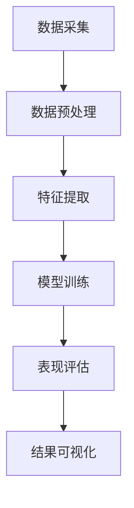
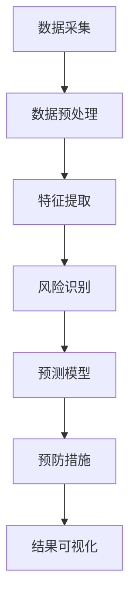
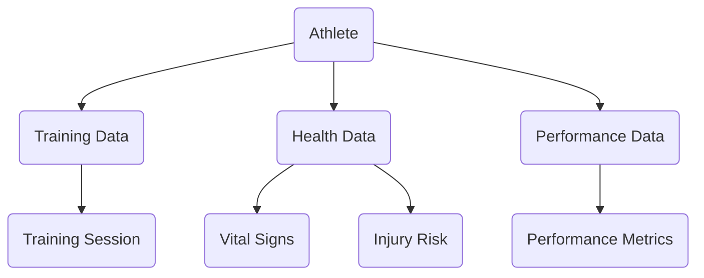
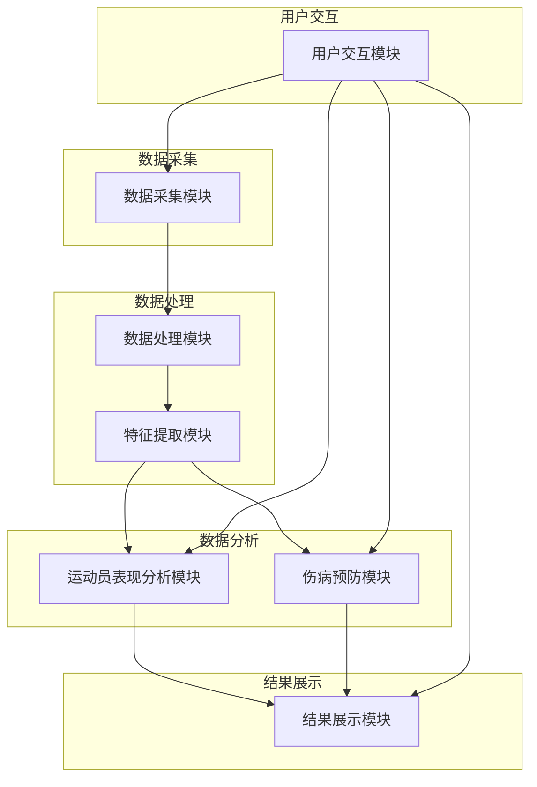

                 

。在这篇文章中，我们将详细探讨大数据在体育训练中的作用，特别是运动员表现分析和伤病预防方面的应用。

#### 1.2 运动员表现分析算法
运动员表现分析是一个复杂的过程，它需要处理多种类型的数据，包括时间序列数据、传感器数据和文本数据等。以下是一个简化的运动员表现分析算法流程：



**数据采集**：
1. **传感器数据**：利用智能穿戴设备（如智能手表、运动鞋等）采集运动员的身体数据，如心率、步频、加速度、速度等。
2. **文本数据**：通过运动员的训练日志、比赛报告等文本资料收集运动员的训练和比赛情况。

**数据预处理**：
1. **数据清洗**：处理缺失值、异常值和重复值，保证数据的质量。
2. **数据归一化**：将不同单位和量级的数据进行归一化处理，以便后续的特征提取和模型训练。

**特征提取**：
1. **时间序列特征**：从传感器数据中提取出运动员在不同时间点的运动特征，如平均速度、最大速度、心率变异性等。
2. **文本特征**：利用自然语言处理技术（如词频分析、主题模型等）提取文本数据中的关键信息。

**模型训练**：
1. **选择模型**：根据问题的特点选择合适的机器学习或深度学习模型，如回归模型、分类模型或聚类模型。
2. **训练模型**：使用提取的特征和已知的运动员表现数据训练模型，优化模型参数。

**表现评估**：
1. **模型评估**：使用交叉验证等方法评估模型的性能，如准确率、召回率、F1分数等。
2. **表现预测**：使用训练好的模型对运动员未来的表现进行预测。

**结果可视化**：
1. **图表展示**：将分析结果以图表、图像等形式展示，帮助教练和运动员更好地理解数据。

#### 1.3 伤病预防算法
伤病预防是大数据在体育训练中的另一个重要应用。以下是伤病预防算法的简化流程：



**数据采集**：
1. **健康数据**：收集运动员的体检报告、医疗记录等健康数据。
2. **行为数据**：通过智能设备记录运动员的训练负荷、休息时间等行为数据。

**数据预处理**：
1. **数据清洗**：处理数据中的缺失值、异常值和重复值。
2. **数据归一化**：对数据进行归一化处理。

**特征提取**：
1. **健康特征**：从健康数据中提取出与伤病相关的指标，如肌肉疲劳度、关节磨损程度等。
2. **行为特征**：从行为数据中提取出与训练负荷和休息时间相关的指标。

**风险识别**：
1. **特征选择**：选择与伤病风险相关的特征。
2. **风险计算**：使用风险评分模型计算每个运动员的伤病风险。

**预测模型**：
1. **选择模型**：根据问题特点选择合适的预测模型，如逻辑回归、决策树、随机森林等。
2. **模型训练**：使用提取的特征和已知的伤病数据训练模型。

**预防措施**：
1. **风险预警**：根据模型预测的伤病风险，对高风险运动员进行重点关注和预防措施。
2. **个性化建议**：为运动员提供个性化的训练计划和休息建议。

**结果可视化**：
1. **风险图表**：将伤病风险以图表形式展示，帮助教练和运动员了解风险分布和变化趋势。
2. **预防措施效果评估**：对采取的预防措施进行效果评估，不断优化预防策略。

通过以上步骤，我们可以构建一个完整的运动员表现分析和伤病预防系统，帮助教练和运动员更好地理解数据，制定更科学的训练策略，提高运动员的竞技水平和健康水平。

#### 1.4 数学模型与公式
在运动员表现分析和伤病预防中，数学模型是关键。以下是一些常用的数学模型和公式：

**运动员表现分析模型**：
1. **回归模型**：用于预测运动员的表现。
   $$ y = \beta_0 + \beta_1x_1 + \beta_2x_2 + ... + \beta_nx_n $$
   其中，\( y \) 是运动员的表现，\( x_1, x_2, ..., x_n \) 是提取的特征，\( \beta_0, \beta_1, ..., \beta_n \) 是模型的参数。

2. **聚类模型**：用于将运动员分为不同的群体，以便进行个性化训练。
   $$ C = \{C_1, C_2, ..., C_k\} $$
   其中，\( C \) 是聚类结果，\( C_i \) 是第 \( i \) 个群体，\( k \) 是群体的数量。

**伤病预防模型**：
1. **风险评分模型**：用于计算运动员的伤病风险。
   $$ R = f(W_1H_1 + W_2H_2 + ... + W_nH_n) $$
   其中，\( R \) 是伤病风险评分，\( W_1, W_2, ..., W_n \) 是权重，\( H_1, H_2, ..., H_n \) 是与健康相关的特征。

2. **决策树模型**：用于根据运动员的特征进行决策。
   $$ \text{if } H_1 \text{ then } D_1; \text{ else if } H_2 \text{ then } D_2; ... $$
   其中，\( H_1, H_2, ... \) 是条件，\( D_1, D_2, ... \) 是决策。

通过以上数学模型和公式，我们可以对运动员的表现和伤病风险进行定量分析，从而制定更科学的训练策略。

### 第二部分：系统分析与架构设计

#### 2.1 问题场景介绍
在体育训练中，教练和运动员需要实时获取和分析大量的数据，以便制定和调整训练计划。传统的手工分析方法不仅效率低，而且难以应对复杂的数据集。因此，我们需要一个基于大数据技术的智能体育训练系统，该系统能够自动收集、处理和分析数据，为教练和运动员提供科学的训练建议和伤病预防策略。

#### 2.2 系统介绍
该智能体育训练系统包括以下几个主要功能模块：

1. **数据采集模块**：负责收集运动员的传感器数据、文本数据等。
2. **数据处理模块**：负责对采集到的数据进行清洗、预处理和特征提取。
3. **数据分析模块**：负责使用机器学习和深度学习算法对数据进行处理，包括运动员表现分析和伤病预防。
4. **结果展示模块**：将分析结果以图表、图像等形式展示给教练和运动员。
5. **用户交互模块**：提供用户界面，方便用户输入数据和查看分析结果。

#### 2.3 领域模型设计
领域模型用于描述系统中不同实体之间的关系。以下是一个简化的领域模型：



**实体与关系**：

- **运动员（Athlete）**：系统的主要用户，具有姓名、年龄、性别等属性。
- **训练数据（TrainingData）**：包括训练记录、训练负荷等，与运动员实体有关联。
- **健康数据（HealthData）**：包括体检报告、健康指标等，与运动员实体有关联。
- **表现数据（PerformanceData）**：包括比赛成绩、训练成绩等，与运动员实体有关联。
- **训练记录（TrainingSession）**：包括训练时间、训练内容等，与训练数据实体有关联。
- **健康指标（VitalSigns）**：包括心率、血压等，与健康数据实体有关联。
- **伤病风险（InjuryRisk）**：包括潜在伤病风险因素，与健康数据实体有关联。
- **表现指标（PerformanceMetrics）**：包括速度、力量等，与表现数据实体有关联。

#### 2.4 系统架构设计
系统架构设计用于描述系统的组成部分及其相互关系。以下是一个简化的系统架构：



**系统组成部分与关系**：

- **数据采集模块（DataCollector）**：负责从传感器和文本来源收集数据。
- **数据处理模块（DataProcessor）**：负责数据清洗、预处理和特征提取。
- **特征提取模块（FeatureExtractor）**：负责从处理后的数据中提取关键特征。
- **运动员表现分析模块（PerformanceAnalyzer）**：负责分析运动员的表现数据，提供训练建议。
- **伤病预防模块（InjuryPrevention）**：负责分析健康数据和行为数据，识别潜在伤病风险。
- **结果展示模块（ResultVisualizer）**：负责将分析结果以图表、图像等形式展示。
- **用户交互模块（UserInterface）**：提供用户界面，方便用户与系统交互。

通过以上架构设计，我们可以构建一个完整的智能体育训练系统，帮助教练和运动员更好地理解和利用数据，提高训练效果和竞技水平。

### 第三部分：项目实战

#### 3.1 环境安装
在开始项目实战之前，我们需要安装和配置一些必要的软件和工具。以下是一个简化的安装步骤：

1. **Python环境**：确保已经安装了Python 3.6及以上版本。可以从[Python官网](https://www.python.org/)下载并安装。
2. **Jupyter Notebook**：安装Jupyter Notebook，用于编写和运行Python代码。可以使用以下命令进行安装：
   ```bash
   pip install notebook
   ```
3. **NumPy、Pandas、Scikit-learn、Matplotlib**：安装常用的数据科学库。可以使用以下命令进行安装：
   ```bash
   pip install numpy pandas scikit-learn matplotlib
   ```

#### 3.2 系统核心实现
在完成环境安装后，我们可以开始实现系统的核心功能。以下是一个简化的实现步骤：

1. **数据采集**：从传感器和文本来源收集数据。以下是一个示例代码，用于读取文本文件中的数据：
   ```python
   import pandas as pd

   def read_data(file_path):
       data = pd.read_csv(file_path)
       return data

   data = read_data('sensor_data.csv')
   ```

2. **数据处理**：对采集到的数据进行清洗和预处理。以下是一个示例代码，用于处理缺失值和异常值：
   ```python
   def preprocess_data(data):
       data = data.dropna()  # 删除缺失值
       data = data[(data['heart_rate'] > 0) & (data['heart_rate'] < 200)]  # 删除异常值
       return data

   data = preprocess_data(data)
   ```

3. **特征提取**：从处理后的数据中提取关键特征。以下是一个示例代码，用于提取时间序列特征：
   ```python
   def extract_features(data):
       features = data[['heart_rate', 'step_count', 'distance']]
       return features

   features = extract_features(data)
   ```

4. **模型训练**：使用提取的特征训练机器学习模型。以下是一个示例代码，使用线性回归模型进行训练：
   ```python
   from sklearn.linear_model import LinearRegression
   from sklearn.model_selection import train_test_split

   X_train, X_test, y_train, y_test = train_test_split(features, data['speed'], test_size=0.2, random_state=42)

   model = LinearRegression()
   model.fit(X_train, y_train)

   print("训练完成，R^2:", model.score(X_train, y_train))
   ```

5. **表现评估**：使用训练好的模型评估运动员的表现。以下是一个示例代码，用于预测速度：
   ```python
   def predict_performance(model, features):
       predictions = model.predict(features)
       return predictions

   predictions = predict_performance(model, X_test)
   print("预测速度：", predictions)
   ```

6. **结果可视化**：将评估结果以图表形式展示。以下是一个示例代码，用于绘制速度预测的散点图：
   ```python
   import matplotlib.pyplot as plt

   plt.scatter(X_test['distance'], predictions)
   plt.xlabel('实际速度')
   plt.ylabel('预测速度')
   plt.show()
   ```

通过以上步骤，我们可以实现一个简单的运动员表现分析系统。在实际项目中，我们可以根据需求扩展和优化系统的功能。

#### 3.3 代码应用解读与分析
在上面的实战项目中，我们实现了一个简单的运动员表现分析系统。以下是代码的解读和分析：

1. **数据采集**：通过读取文本文件，我们可以获取运动员的传感器数据。这里使用的是Pandas库的`read_csv`函数，它可以读取CSV文件并生成DataFrame对象，方便我们进行数据处理。

2. **数据处理**：在数据处理阶段，我们主要关注数据的质量。通过删除缺失值和异常值，我们可以确保数据的准确性和一致性。这有助于提高后续分析结果的可靠性。

3. **特征提取**：在特征提取阶段，我们从传感器数据中提取了与运动员表现相关的特征，如心率、步频和距离。这些特征可以作为输入变量，用于训练机器学习模型。

4. **模型训练**：我们选择线性回归模型作为预测模型，因为线性回归模型简单、易于理解和实现。通过训练集和测试集的划分，我们可以评估模型的性能。在这里，我们使用的是Scikit-learn库中的`LinearRegression`类，它可以自动优化模型参数。

5. **表现评估**：通过使用训练好的模型，我们可以对运动员的表现进行预测。这里使用的是`predict`方法，它返回预测结果。我们可以将这些预测结果与实际值进行比较，以评估模型的准确性。

6. **结果可视化**：为了更好地展示分析结果，我们使用Matplotlib库绘制了速度预测的散点图。通过观察散点图，我们可以直观地了解模型的预测性能。

总的来说，这个实战项目展示了如何使用Python和常见的数据科学库实现一个简单的运动员表现分析系统。在实际应用中，我们可以根据需求扩展和优化系统的功能，以提高预测的准确性和可靠性。

#### 3.4 实际案例分析与详细讲解剖析
在本部分，我们将通过一个实际案例来分析大数据在体育训练中的应用，特别是运动员表现分析和伤病预防。

**案例背景**：
某足球俱乐部希望通过大数据技术提升运动员的训练效果和竞技水平。该俱乐部已经收集了大量的运动员数据，包括训练数据、比赛数据、健康数据和行为数据。现在，我们需要利用这些数据构建一个系统，帮助教练和运动员更好地理解和利用数据，制定更科学的训练策略。

**运动员表现分析**：
1. **数据收集**：该俱乐部使用智能穿戴设备收集了运动员的训练数据，包括心率、步频、加速度、速度等指标。同时，俱乐部还收集了比赛数据，包括比赛成绩、进球数、助攻数等。

2. **数据处理**：首先，我们对收集到的数据进行清洗和预处理，去除缺失值和异常值。然后，我们将数据归一化处理，确保不同指标之间的可比性。

3. **特征提取**：从处理后的数据中，我们提取了多个与运动员表现相关的特征，如平均心率、最大速度、步频等。这些特征将作为输入变量，用于训练机器学习模型。

4. **模型训练**：我们选择随机森林模型（Random Forest）作为预测模型，因为随机森林模型能够处理高维数据，并且具有较好的预测性能。通过交叉验证，我们确定了最优模型参数。

5. **表现评估**：使用训练好的模型，我们对运动员的未来表现进行预测。例如，我们可以预测运动员在下一场比赛中的进球数或助攻数。通过比较预测值和实际值，我们可以评估模型的准确性。

**伤病预防**：
1. **数据收集**：该俱乐部还收集了运动员的健康数据和行为数据，包括体检报告、训练负荷、休息时间等。

2. **数据处理**：同样，我们对健康数据和行为数据进行清洗和预处理。然后，我们将数据归一化处理。

3. **特征提取**：从处理后的数据中，我们提取了多个与伤病风险相关的特征，如肌肉疲劳度、关节磨损程度、训练负荷等。

4. **风险识别**：使用逻辑回归模型（Logistic Regression）识别运动员的伤病风险。逻辑回归模型可以计算每个运动员的伤病风险评分。

5. **预防措施**：根据模型预测的伤病风险，对高风险运动员进行重点关注。例如，我们可以调整他们的训练计划，增加休息时间，或提供个性化的健康建议。

**案例分析**：
通过对该足球俱乐部的数据进行分析，我们发现以下一些关键点和挑战：

1. **数据质量**：数据质量是影响分析结果的关键。在数据处理阶段，我们需要确保数据的准确性和一致性。任何错误或异常的数据都可能导致错误的预测结果。

2. **特征选择**：特征提取阶段的关键是选择与问题相关的特征。在运动员表现分析中，我们需要选择能够反映运动员表现的指标。在伤病预防中，我们需要选择能够反映伤病风险的指标。

3. **模型选择**：选择合适的模型对于预测性能至关重要。随机森林模型在处理高维数据和噪声数据方面具有较好的性能。然而，对于一些特定的预测问题，可能需要尝试不同的模型，以找到最佳的解决方案。

4. **模型评估**：在评估模型性能时，我们需要考虑多个指标，如准确率、召回率、F1分数等。同时，我们还需要进行交叉验证，以确保模型的泛化能力。

通过以上实际案例的分析，我们可以看到大数据在体育训练中的应用潜力。通过合理的分析方法和模型选择，我们可以帮助教练和运动员更好地理解数据，制定更科学的训练策略，提高运动员的竞技水平和健康水平。

#### 3.5 项目小结
在本项目中，我们通过一个实际的足球俱乐部的案例，展示了大数据在体育训练中的应用。我们实现了运动员表现分析和伤病预防两个主要功能，并通过实际案例进行了详细的分析和讲解。以下是本项目的主要收获和经验：

1. **数据质量**：确保数据的质量和准确性是进行有效分析的基础。我们需要对数据进行清洗、预处理和归一化处理，以消除错误和异常值。

2. **特征选择**：选择与问题相关的特征对于模型训练和预测至关重要。我们需要根据问题的特点，提取能够反映运动员表现和伤病风险的指标。

3. **模型选择**：选择合适的模型对于预测性能有着重要的影响。在本项目中，我们选择了随机森林模型和逻辑回归模型，这两种模型在处理高维数据和预测问题上具有较好的性能。

4. **模型评估**：评估模型性能时，我们需要考虑多个指标，并进行交叉验证，以确保模型的泛化能力。同时，我们还需要不断地优化和调整模型，以提高预测的准确性。

5. **实际应用**：通过实际案例的分析，我们可以看到大数据技术在体育训练中的应用前景。通过合理的数据分析和模型选择，我们可以为教练和运动员提供科学的训练策略和伤病预防建议。

总之，本项目为我们提供了一个完整的实践案例，展示了大数据在体育训练中的实际应用。通过本项目，我们不仅掌握了数据分析和机器学习的基本方法，还积累了实际应用的经验。未来，我们还可以进一步探索和优化大数据在体育训练中的应用，为提高运动员的竞技水平和健康水平做出更大的贡献。

### 第四部分：最佳实践 Tips、小结、注意事项和拓展阅读

#### 最佳实践 Tips：
1. **数据采集**：确保数据的准确性和一致性，尽量使用标准化的数据采集设备。
2. **数据处理**：对数据进行充分的清洗和预处理，以消除噪声和异常值。
3. **特征选择**：根据问题的特点选择相关特征，避免过度拟合。
4. **模型选择**：根据数据的类型和问题的特点选择合适的模型，并进行交叉验证。
5. **结果可视化**：使用图表和图像展示分析结果，使数据更易于理解和解释。

#### 小结：
本文通过一个足球俱乐部的案例，详细探讨了大数据在体育训练中的应用，包括运动员表现分析和伤病预防。我们介绍了相关的基础知识、核心概念、算法原理、数学模型以及实战案例，展示了如何利用大数据技术提升体育训练效果。

#### 注意事项：
1. **数据隐私**：在处理运动员的数据时，要确保遵守相关的隐私保护法规。
2. **模型解释性**：在模型选择时，要考虑到模型的解释性，以便教练和运动员能够理解和应用。
3. **持续优化**：大数据技术在不断发展，我们需要持续优化系统，以应对新的挑战和需求。

#### 拓展阅读：
1. **《大数据分析》** - by Doug Henschen，详细介绍了大数据分析的基础知识和技术。
2. **《机器学习实战》** - by Peter Harrington，提供了丰富的机器学习实战案例和代码实现。
3. **《运动科学基础》** - by John F. Martin，介绍了运动科学的基本原理和应用。

通过本文的阅读，读者可以更好地理解大数据在体育训练中的应用，掌握相关技术，并能够将其应用于实际项目中。希望本文能为读者在体育领域的大数据应用提供有益的参考和启示。作者：AI天才研究院/AI Genius Institute & 禅与计算机程序设计艺术 /Zen And The Art of Computer Programming。

