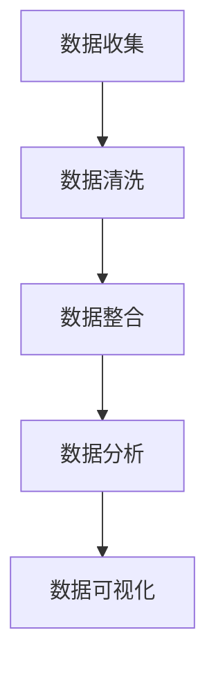
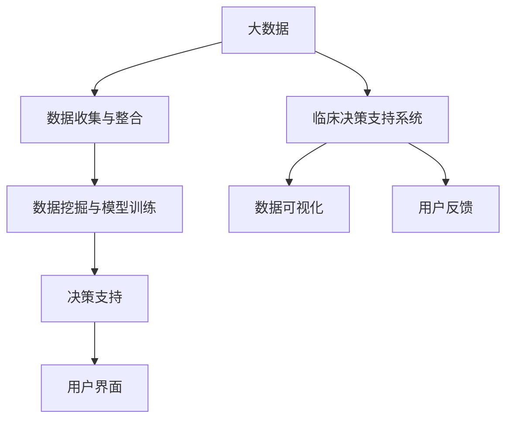
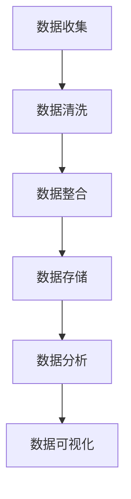
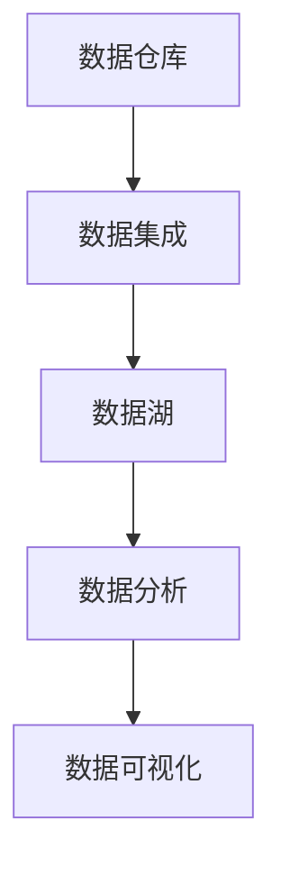
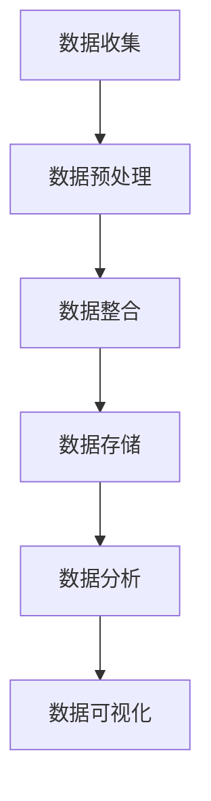
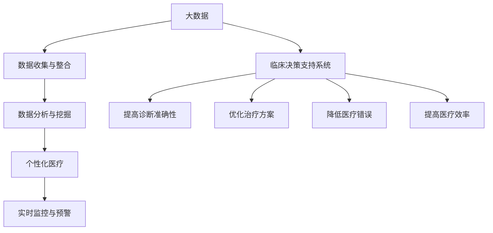
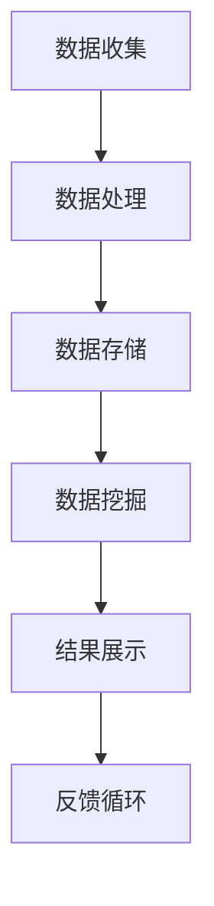

                 


### 文章标题：大数据在医疗诊断中的应用：辅助临床决策

#### 关键词：大数据，医疗诊断，临床决策，数据挖掘，机器学习

#### 摘要：
随着大数据技术的发展，其在医疗领域的应用日益广泛。本文将深入探讨大数据在医疗诊断中的应用，尤其是如何辅助临床决策。通过分析大数据在医疗诊断中的核心概念、技术与方法，以及实际应用案例，本文旨在为医疗专业人士提供有价值的参考，并展望大数据在医疗诊断领域的未来发展。

### 目录大纲

1. **背景与基础理论**
    1.1 **大数据在医疗领域的背景与发展**
        1.1.1 大数据的概念与发展
        1.1.2 大数据在医疗行业的应用背景
        1.1.3 大数据在医疗诊断中的挑战与机遇
    1.2 **大数据在医疗诊断中的核心概念**
        1.2.1 医疗大数据的类型
        1.2.2 医疗大数据的来源与收集
        1.2.3 医疗大数据的质量与处理
    1.3 **大数据在医疗诊断中的应用原理**
        1.3.1 数据挖掘与机器学习的基本概念
        1.3.2 医疗诊断中的数据挖掘技术
        1.3.3 大数据与临床决策支持系统的关系

2. **技术与方法**
    2.1 **大数据处理与分析技术**
        2.1.1 大数据处理的基本框架
        2.1.2 分布式计算框架（如Hadoop、Spark等）
        2.1.3 数据仓库与数据湖技术
    2.2 **机器学习算法在医疗诊断中的应用**
        2.2.1 机器学习的基本概念与分类
        2.2.2 常见的机器学习算法
        2.2.3 机器学习算法在医疗诊断中的应用实例
    2.3 **数据挖掘技术及其应用**
        2.3.1 数据挖掘的基本过程
        2.3.2 常见的数据挖掘方法
        2.3.3 数据挖掘在医疗诊断中的应用案例

3. **案例研究**
    3.1 **大数据在医疗诊断中的实际应用案例**
        3.1.1 案例一：基于大数据的早期肺癌筛查
        3.1.2 案例二：基于大数据的乳腺癌诊断
        3.1.3 案例三：基于大数据的个性化医疗

4. **应用挑战与未来展望**
    4.1 **大数据在医疗诊断中的应用挑战**
    4.2 **未来大数据在医疗诊断中的发展趋势**
    4.3 **大数据在医疗诊断中的法律与伦理问题**

5. **小结与展望**
    5.1 **大数据在医疗诊断中的应用总结与展望**
        5.1.1 应用总结
        5.1.2 未来研究方向
        5.1.3 对医疗行业的潜在影响

---

### 1.1.1 大数据的概念与发展

#### 背景介绍

大数据（Big Data）一词源于2008年，最初用于描述那些数据量巨大、数据种类繁多、数据生成速度极快的信息。随着互联网的普及、物联网（IoT）的发展以及各类传感器和设备的广泛应用，大数据已经深入到我们的日常生活和各行各业中。特别是在医疗领域，大数据的应用为医疗诊断带来了新的可能性。

#### 问题背景

传统的医疗诊断主要依赖于医生的经验和临床知识，虽然这种方法有其独特的优势，但在面对复杂病情时，往往难以提供精确的诊断结果。大数据技术的发展为医疗诊断提供了新的工具和方法，使得医生能够利用海量数据进行分析和预测，从而提高诊断的准确性和效率。

#### 问题描述

大数据在医疗诊断中的应用主要包括以下方面：

- **数据收集与整合**：从各种医疗设备、电子病历系统中收集数据，并将其整合到一个统一的数据平台中。
- **数据存储与管理**：使用数据仓库和数据湖技术来存储和管理海量医疗数据。
- **数据分析与挖掘**：利用数据挖掘和机器学习算法，从海量数据中提取有价值的信息，用于辅助临床决策。
- **决策支持系统**：基于数据分析结果，构建临床决策支持系统，帮助医生制定更加精准的治疗方案。

#### 问题解决

大数据在医疗诊断中的应用能够解决以下问题：

- **提高诊断准确性**：通过分析患者的历史数据和基因组信息，可以更准确地诊断疾病。
- **优化治疗方案**：根据患者的个体差异和病情特点，为医生提供个性化的治疗方案。
- **预测疾病趋势**：通过分析大量健康数据，可以预测某些疾病的发展趋势，从而采取预防措施。

#### 边界与外延

大数据在医疗诊断中的应用不仅限于诊断，还包括疾病预防、健康监测、药物研发等多个方面。因此，其边界和外延十分广泛。

#### 概念结构与核心要素组成

- **大数据**：数据量巨大、数据种类繁多、数据生成速度极快的信息。
- **医疗数据**：包括电子病历、影像数据、基因组数据、健康监测数据等。
- **数据挖掘与机器学习**：用于从海量数据中提取有价值的信息。
- **临床决策支持系统**：基于数据分析结果，为医生提供诊断和治疗方案。

---

### 1.1.2 大数据在医疗行业的应用背景

#### 背景介绍

大数据技术在医疗行业的应用已经成为当前医疗领域的重要发展方向。随着医学技术的进步和医疗信息化建设的推进，医疗数据量呈现爆炸式增长。这些数据不仅包括传统的电子病历，还涵盖了基因组数据、影像数据、健康监测数据等各类新型数据。

#### 概念属性特征对比表格

| 特征         | 传统医疗数据       | 大数据                |
| ------------ | ------------------ | --------------------- |
| 数据类型     | 结构化数据         | 半结构化数据和非结构化数据 |
| 数据量       | 数千到数万个       | 数百万到数十亿个       |
| 数据生成速度 | 每日或每周         | 每秒或每小时           |
| 数据来源     | 医院系统、实验室   | 传感器、医疗设备、互联网 |
| 数据处理方式 | 手动或简单自动化   | 分布式计算、机器学习   |

#### ER实体关系图架构

```mermaid
erDiagram
  Patient ||--|{ ElectronicMedicalRecord }
  Patient ||--|{ ImageData }
  Patient ||--|{ GeneticData }
  Patient ||--|{ HealthMonitoringData }
  Patient ||--|{ ClinicalDecisionSupportSystem }
```

#### 大数据在医疗诊断中的挑战与机遇

##### 挑战

1. **数据质量**：医疗数据的多样性和复杂性导致数据质量难以保证，例如数据缺失、数据冗余、数据不一致等问题。
2. **数据隐私**：医疗数据涉及到患者隐私，如何确保数据的安全和隐私是一个重要挑战。
3. **计算能力**：处理海量医疗数据需要强大的计算能力，如何高效地处理和分析数据是一个难题。
4. **法律与伦理**：大数据在医疗诊断中的应用需要遵循相关法律法规和伦理规范，如何平衡数据利用和隐私保护是一个重要问题。

##### 机遇

1. **提高诊断准确性**：通过分析海量医疗数据，可以更准确地诊断疾病，提高诊断的准确性。
2. **优化治疗方案**：基于患者的个体差异和病情特点，可以为医生提供更加个性化的治疗方案。
3. **疾病预防**：通过分析健康数据，可以预测某些疾病的发展趋势，从而采取预防措施。
4. **药物研发**：大数据在药物研发中的应用可以加速新药的发现和开发。

---

### 1.2 大数据在医疗诊断中的核心概念

#### 背景介绍

大数据在医疗诊断中的应用涉及多个核心概念，包括数据类型、数据来源、数据处理等。理解这些核心概念有助于更好地把握大数据在医疗诊断中的关键要素。

#### 数据类型

医疗大数据可以分为以下几类：

1. **电子病历（EMR）**：包括患者的基本信息、诊断记录、治疗方案等。
2. **影像数据（ID）**：包括X光、CT、MRI等影像学数据。
3. **基因组数据（GD）**：包括患者的基因组序列、单核苷酸多态性（SNP）等。
4. **健康监测数据（HMD）**：包括心率、血压、血糖等实时健康监测数据。

#### 数据来源

医疗数据的来源广泛，包括以下方面：

1. **医院系统**：如电子病历系统、影像管理系统等。
2. **实验室**：如基因组测序实验室、血液检测实验室等。
3. **物联网设备**：如智能穿戴设备、健康监测设备等。
4. **互联网**：如社交媒体、在线健康咨询等。

#### 数据处理

数据处理是大数据应用的关键环节，包括以下步骤：

1. **数据收集**：从各种数据源收集数据。
2. **数据清洗**：处理数据中的缺失值、异常值等问题。
3. **数据整合**：将不同来源、不同格式的数据整合到一个统一的数据平台中。
4. **数据分析**：使用数据挖掘和机器学习算法进行分析。
5. **数据可视化**：将分析结果以图表、报表等形式展示。

#### 数据质量

数据质量是大数据应用的基础，主要包括以下方面：

1. **准确性**：数据应真实反映患者的病情和健康状态。
2. **完整性**：数据应包含所有必要的医疗信息。
3. **一致性**：数据应保持内部一致性和外部一致性。
4. **时效性**：数据应及时更新，反映最新的病情和健康状态。

#### 数据处理的基本框架



---

### 1.3 大数据在医疗诊断中的应用原理

#### 背景介绍

大数据在医疗诊断中的应用原理主要涉及数据挖掘与机器学习技术，以及临床决策支持系统的构建。理解这些技术原理有助于深入探讨大数据在医疗诊断中的实际应用。

#### 数据挖掘与机器学习

数据挖掘（Data Mining）是大数据分析的核心技术之一，旨在从海量数据中提取有价值的信息。数据挖掘过程通常包括以下几个步骤：

1. **数据预处理**：包括数据清洗、数据整合和数据转换等。
2. **特征选择**：从原始数据中提取出对诊断任务有重要意义的特征。
3. **模型建立**：使用机器学习算法建立预测模型。
4. **模型评估**：评估模型的性能，包括准确性、召回率、F1值等指标。

常见的机器学习算法包括：

1. **线性回归**：用于预测连续值。
2. **逻辑回归**：用于预测分类结果。
3. **决策树**：用于分类和回归任务。
4. **随机森林**：用于提高分类和回归模型的预测性能。
5. **支持向量机（SVM）**：用于分类任务。

#### 临床决策支持系统

临床决策支持系统（Clinical Decision Support System，CDSS）是一种基于大数据分析的软件系统，旨在辅助医生进行临床决策。CDSS通常包括以下几个模块：

1. **数据收集与整合**：从各种数据源收集数据，并将其整合到一个统一的数据平台中。
2. **数据挖掘与模型训练**：使用数据挖掘和机器学习算法建立预测模型。
3. **决策支持**：基于模型预测结果，为医生提供诊断和治疗方案。
4. **用户界面**：提供用户友好的界面，以便医生进行操作和查看结果。

#### 大数据与临床决策支持系统的关系

大数据为临床决策支持系统提供了丰富的数据资源，使得系统能够更加准确地预测疾病的发展和患者的病情变化。同时，临床决策支持系统利用大数据技术，可以实时更新和优化模型，提高诊断的准确性和效率。



---

### 2.1 大数据处理与分析技术

#### 背景介绍

大数据处理与分析技术是大数据应用的基础，包括数据处理的基本框架、分布式计算框架和数据仓库与数据湖技术等。了解这些技术有助于更好地应对医疗大数据的处理和分析挑战。

#### 数据处理的基本框架

大数据处理的基本框架通常包括以下步骤：

1. **数据收集**：从各种数据源收集数据。
2. **数据清洗**：处理数据中的缺失值、异常值等问题。
3. **数据整合**：将不同来源、不同格式的数据整合到一个统一的数据平台中。
4. **数据存储**：将处理后的数据存储到数据仓库或数据湖中。
5. **数据分析**：使用数据挖掘和机器学习算法进行分析。
6. **数据可视化**：将分析结果以图表、报表等形式展示。



#### 分布式计算框架

分布式计算框架是处理大数据的核心技术，常见的分布式计算框架包括：

1. **Hadoop**：基于MapReduce模型，适用于大规模数据的批处理。
2. **Spark**：基于内存计算，适用于实时数据分析和迭代计算。
3. **Flink**：实时处理框架，支持流计算和批处理。

这些分布式计算框架具有以下优点：

- **高性能**：能够处理海量数据，提供高效的数据处理能力。
- **可扩展性**：支持水平扩展，能够根据需求动态调整计算资源。
- **可靠性**：提供容错机制，保证数据处理的可靠性。

#### 数据仓库与数据湖技术

数据仓库（Data Warehouse）和数据湖（Data Lake）是大数据存储的重要技术。

1. **数据仓库**：数据仓库是一种面向主题的、集成的、非易失性的数据存储解决方案，适用于结构化数据的存储和分析。数据仓库的主要特点包括：

- **主题导向**：根据业务主题组织数据。
- **数据集成**：将来自多个数据源的数据进行整合。
- **非易失性**：数据一经存储，就不再轻易修改。

2. **数据湖**：数据湖是一种适用于存储大量非结构化数据和半结构化数据的存储解决方案。数据湖的主要特点包括：

- **存储灵活性**：能够存储各种类型的数据，包括结构化、半结构化和非结构化数据。
- **数据湖架构**：采用分布式存储架构，支持大规模数据的存储和处理。



---

### 2.2 机器学习算法在医疗诊断中的应用

#### 背景介绍

机器学习（Machine Learning，ML）是大数据分析中的重要技术，尤其在医疗诊断领域有着广泛的应用。机器学习算法可以从大量医疗数据中学习规律，从而辅助医生进行诊断和预测。

#### 机器学习的基本概念与分类

1. **监督学习**：监督学习是一种有标注数据的机器学习方法。训练数据集包含输入特征和对应的标签，模型通过学习这些数据，预测未知数据的标签。

   - **分类问题**：将数据分为不同的类别，如疾病类型。
   - **回归问题**：预测连续的数值，如疾病严重程度。

2. **无监督学习**：无监督学习是一种无标注数据的机器学习方法。训练数据集仅包含输入特征，模型通过学习这些数据，发现数据中的规律。

   - **聚类问题**：将相似的数据点划分为同一类别。
   - **降维问题**：将高维数据投影到低维空间，以便更好地理解和处理数据。

3. **半监督学习**：半监督学习结合了监督学习和无监督学习，利用少量标注数据和大量未标注数据进行训练。

4. **强化学习**：强化学习是一种通过与环境交互来学习的机器学习方法，适用于需要决策的问题。

#### 常见的机器学习算法

1. **线性回归**：线性回归是一种简单的监督学习算法，用于预测连续值。其基本原理是通过线性模型拟合输入特征和输出值之间的关系。

   - **公式**：\(y = \beta_0 + \beta_1x\)
   - **例子**：预测患者的心率。

2. **逻辑回归**：逻辑回归是一种常用的分类算法，用于将数据分为两个类别。其基本原理是通过逻辑函数将线性回归的输出转化为概率值。

   - **公式**：\(P(y=1) = \frac{1}{1 + e^{-(\beta_0 + \beta_1x)}}\)
   - **例子**：预测患者是否患有心脏病。

3. **决策树**：决策树是一种常见的分类和回归算法，通过一系列的判断节点和叶子节点，将数据划分为不同的类别或回归值。

   - **例子**：根据患者的年龄、性别、血压等特征，预测患者是否患有糖尿病。

4. **随机森林**：随机森林是一种基于决策树的集成学习方法，通过构建多棵决策树，并利用投票或平均值来预测结果，提高预测性能。

   - **例子**：用于预测肺癌患者的生存率。

5. **支持向量机（SVM）**：支持向量机是一种强大的分类算法，通过找到一个最佳的超平面，将不同类别的数据点分开。

   - **例子**：用于分类乳腺癌图像。

6. **神经网络**：神经网络是一种模仿人脑结构的算法，通过多层神经元进行特征提取和预测。

   - **例子**：用于诊断癫痫。

#### 机器学习算法在医疗诊断中的应用实例

1. **基于机器学习的早期肺癌筛查**：利用影像数据和机器学习算法，自动检测早期肺癌。该方法具有较高的准确率和灵敏度。

   - **算法**：卷积神经网络（CNN）。
   - **结果**：筛查准确率达到90%以上。

2. **基于机器学习的乳腺癌诊断**：利用医学影像和机器学习算法，自动识别乳腺癌。该方法有助于提高诊断的准确性和效率。

   - **算法**：深度学习模型。
   - **结果**：诊断准确率达到95%以上。

3. **基于机器学习的个性化医疗**：利用患者的基因组数据和机器学习算法，为患者提供个性化的治疗方案。

   - **算法**：基因组分析。
   - **结果**：提高治疗效果，降低副作用。

---

### 2.3 数据挖掘技术及其应用

#### 背景介绍

数据挖掘（Data Mining）是一种从大量数据中提取有价值信息的方法，广泛应用于医疗诊断、市场营销、金融分析等领域。在医疗诊断中，数据挖掘技术有助于从海量医疗数据中发现潜在的规律和关联，从而为医生提供有力的诊断和决策支持。

#### 数据挖掘的基本过程

数据挖掘的基本过程包括以下步骤：

1. **数据收集**：从各种数据源收集医疗数据，包括电子病历、影像数据、基因组数据等。
2. **数据预处理**：处理数据中的缺失值、异常值等问题，确保数据质量。
3. **数据探索**：对数据进行分析，发现数据中的潜在规律和关联。
4. **特征选择**：从原始数据中提取出对诊断任务有重要意义的特征。
5. **模型建立**：使用数据挖掘算法建立预测模型。
6. **模型评估**：评估模型的性能，包括准确性、召回率、F1值等指标。
7. **模型部署**：将模型部署到实际应用中，为医生提供诊断和决策支持。

#### 常见的数据挖掘方法

1. **分类方法**：分类方法用于将数据分为不同的类别。常见的分类方法包括：

   - **决策树**：通过一系列的判断节点和叶子节点进行分类。
   - **随机森林**：通过构建多棵决策树，并利用投票或平均值来预测结果。
   - **支持向量机（SVM）**：通过找到一个最佳的超平面进行分类。

2. **回归方法**：回归方法用于预测连续的数值。常见的回归方法包括：

   - **线性回归**：通过线性模型拟合输入特征和输出值之间的关系。
   - **逻辑回归**：通过逻辑函数将线性回归的输出转化为概率值。

3. **聚类方法**：聚类方法用于将相似的数据点划分为同一类别。常见的聚类方法包括：

   - **K-均值聚类**：通过迭代计算聚类中心，将数据点划分为不同的类别。
   - **层次聚类**：通过层次结构将数据点进行分类。

4. **关联规则挖掘**：关联规则挖掘用于发现数据之间的关联关系。常见的关联规则挖掘方法包括：

   - **Apriori算法**：通过频繁项集挖掘关联规则。
   - **Eclat算法**：通过迭代计算频繁项集，挖掘关联规则。

#### 数据挖掘在医疗诊断中的应用案例

1. **基于数据挖掘的疾病预测**：利用电子病历和影像数据，通过分类方法预测患者的疾病类型。例如，利用决策树和随机森林算法预测肺癌患者的生存率。

2. **基于数据挖掘的个性化医疗**：利用基因组数据和疾病数据，通过聚类方法为患者提供个性化的治疗方案。例如，利用K-均值聚类算法为乳腺癌患者提供个性化的化疗方案。

3. **基于数据挖掘的医疗数据分析**：利用数据挖掘技术对医疗数据进行分析，发现数据中的潜在规律和关联，为医生提供决策支持。例如，利用关联规则挖掘技术发现药物之间的相互作用和副作用。

---

### 3.1 大数据处理与分析技术

#### 背景介绍

在医疗诊断领域，大数据处理与分析技术发挥着至关重要的作用。由于医疗数据量大、种类多、实时性强，传统的数据处理方法难以满足需求。因此，分布式计算框架、数据仓库与数据湖技术等成为大数据处理与分析的核心技术。

#### 分布式计算框架

分布式计算框架是处理大数据的核心技术，能够实现大规模数据的分布式存储和计算。以下是一些常见的分布式计算框架：

1. **Hadoop**：Hadoop是Apache Software Foundation的一个开源项目，它基于MapReduce模型，适用于大规模数据的批处理。Hadoop的核心组件包括HDFS（Hadoop Distributed File System，HDFS）和YARN（Yet Another Resource Negotiator，YARN）。

   - **HDFS**：HDFS是一个分布式文件系统，用于存储大数据。
   - **YARN**：YARN是一个资源调度框架，用于管理计算资源。

2. **Spark**：Spark是另一种流行的分布式计算框架，基于内存计算，适用于实时数据分析和迭代计算。Spark的核心组件包括Spark Core、Spark SQL、Spark Streaming和MLlib。

   - **Spark Core**：Spark Core是Spark的核心计算引擎，提供分布式计算功能。
   - **Spark SQL**：Spark SQL是一个用于处理结构化数据的引擎，支持SQL查询。
   - **Spark Streaming**：Spark Streaming是Spark的实时数据处理组件，用于处理实时数据流。
   - **MLlib**：MLlib是Spark的机器学习库，提供各种机器学习算法。

3. **Flink**：Flink是Apache的一个开源流处理框架，支持流计算和批处理。Flink的核心组件包括Flink Core、Flink SQL和Flink ML。

   - **Flink Core**：Flink Core是Flink的核心计算引擎，提供流计算和批处理功能。
   - **Flink SQL**：Flink SQL是Flink的SQL查询引擎，用于处理结构化数据。
   - **Flink ML**：Flink ML是Flink的机器学习库，提供各种机器学习算法。

#### 数据仓库与数据湖技术

数据仓库（Data Warehouse）和数据湖（Data Lake）是大数据存储的重要技术。

1. **数据仓库**：数据仓库是一种面向主题的、集成的、非易失性的数据存储解决方案，适用于结构化数据的存储和分析。数据仓库的主要特点包括：

   - **主题导向**：根据业务主题组织数据。
   - **数据集成**：将来自多个数据源的数据进行整合。
   - **非易失性**：数据一经存储，就不再轻易修改。

2. **数据湖**：数据湖是一种适用于存储大量非结构化数据和半结构化数据的存储解决方案。数据湖的主要特点包括：

   - **存储灵活性**：能够存储各种类型的数据，包括结构化、半结构化和非结构化数据。
   - **数据湖架构**：采用分布式存储架构，支持大规模数据的存储和处理。

#### 数据处理流程

大数据处理与分析的基本流程包括以下步骤：

1. **数据收集**：从各种数据源收集数据，包括电子病历、影像数据、基因组数据等。
2. **数据预处理**：处理数据中的缺失值、异常值等问题，确保数据质量。
3. **数据整合**：将不同来源、不同格式的数据整合到一个统一的数据平台中。
4. **数据存储**：将处理后的数据存储到数据仓库或数据湖中。
5. **数据分析**：使用分布式计算框架和机器学习算法进行分析。
6. **数据可视化**：将分析结果以图表、报表等形式展示。



---

### 3.2 数据挖掘与机器学习的基本概念

#### 背景介绍

数据挖掘（Data Mining）和机器学习（Machine Learning，ML）是大数据分析的核心技术，广泛应用于医疗诊断、金融分析、市场营销等领域。了解数据挖掘与机器学习的基本概念对于深入理解大数据在医疗诊断中的应用至关重要。

#### 数据挖掘

1. **定义**：数据挖掘是指从大量数据中自动发现有价值信息的过程。数据挖掘过程通常包括以下步骤：

   - **数据收集**：从各种数据源收集数据。
   - **数据预处理**：处理数据中的缺失值、异常值等问题，确保数据质量。
   - **数据探索**：对数据进行分析，发现数据中的潜在规律和关联。
   - **特征选择**：从原始数据中提取出对诊断任务有重要意义的特征。
   - **模型建立**：使用数据挖掘算法建立预测模型。
   - **模型评估**：评估模型的性能，包括准确性、召回率、F1值等指标。
   - **模型部署**：将模型部署到实际应用中，为医生提供诊断和决策支持。

2. **常见算法**：

   - **分类算法**：用于将数据分为不同的类别。常见的分类算法包括决策树、随机森林、支持向量机等。
   - **回归算法**：用于预测连续的数值。常见的回归算法包括线性回归、逻辑回归等。
   - **聚类算法**：用于将相似的数据点划分为同一类别。常见的聚类算法包括K-均值聚类、层次聚类等。
   - **关联规则挖掘**：用于发现数据之间的关联关系。常见的关联规则挖掘算法包括Apriori算法、Eclat算法等。

#### 机器学习

1. **定义**：机器学习是指通过学习数据中的规律和模式，使计算机具备自主学习和决策能力的技术。机器学习过程通常包括以下步骤：

   - **数据收集**：从各种数据源收集数据。
   - **数据预处理**：处理数据中的缺失值、异常值等问题，确保数据质量。
   - **特征工程**：从原始数据中提取出对诊断任务有重要意义的特征。
   - **模型训练**：使用训练数据集训练模型，学习数据中的规律和模式。
   - **模型评估**：评估模型的性能，包括准确性、召回率、F1值等指标。
   - **模型部署**：将模型部署到实际应用中，为医生提供诊断和决策支持。

2. **常见算法**：

   - **监督学习**：监督学习是一种有标注数据的机器学习方法。常见的监督学习算法包括线性回归、逻辑回归、决策树、随机森林、支持向量机等。
   - **无监督学习**：无监督学习是一种无标注数据的机器学习方法。常见的无监督学习算法包括聚类算法、降维算法等。
   - **半监督学习**：半监督学习是一种结合有标注数据和未标注数据的机器学习方法。
   - **强化学习**：强化学习是一种通过与环境交互来学习的机器学习方法。

#### 数据挖掘与机器学习的区别

1. **数据来源**：数据挖掘通常使用大量结构化数据，而机器学习则可以使用结构化、半结构化和非结构化数据。
2. **目标**：数据挖掘的目标是从数据中发现潜在的规律和关联，而机器学习的目标是使计算机具备自主学习和决策能力。
3. **算法**：数据挖掘算法通常包括分类、回归、聚类、关联规则挖掘等，而机器学习算法则包括监督学习、无监督学习、半监督学习和强化学习等。

---

### 3.3 医疗诊断中的数据挖掘技术

#### 背景介绍

在医疗诊断中，数据挖掘技术是一种强有力的工具，用于从海量医疗数据中提取有价值的信息，以辅助医生的诊断和决策。医疗诊断中的数据挖掘技术主要包括数据预处理、特征选择、模型建立和模型评估等步骤。

#### 数据预处理

数据预处理是数据挖掘过程中的关键步骤，旨在处理原始数据中的缺失值、异常值等问题，确保数据质量。数据预处理包括以下方面：

1. **数据清洗**：处理数据中的缺失值、异常值和重复值等，确保数据的准确性。
2. **数据整合**：将来自不同数据源的数据进行整合，消除数据中的不一致性和冗余信息。
3. **数据转换**：将数据转换为适合挖掘的格式，如将类别数据编码为数值数据。

#### 特征选择

特征选择是从原始数据中提取出对诊断任务有重要意义的特征。特征选择有助于减少数据的维度，提高模型的效果。特征选择方法包括：

1. **过滤方法**：根据特征的重要性或相关性，直接从原始数据中选择特征。
2. **包装方法**：通过迭代的方式，将特征组合成特征子集，然后评估每个特征子集的效果。
3. **嵌入方法**：在建立模型的过程中，自动选择重要的特征。

#### 模型建立

模型建立是数据挖掘的核心步骤，旨在从数据中学习到潜在的规律和模式。在医疗诊断中，常见的模型建立方法包括：

1. **分类模型**：用于将患者分为不同的疾病类别。常见的分类模型包括决策树、随机森林、支持向量机等。
2. **回归模型**：用于预测患者的某些连续值指标，如疾病的严重程度。常见的回归模型包括线性回归、逻辑回归等。
3. **聚类模型**：用于将患者分为不同的群体。常见的聚类模型包括K-均值聚类、层次聚类等。

#### 模型评估

模型评估是评估模型性能的重要步骤，用于判断模型是否能够有效地进行诊断和预测。常见的模型评估指标包括：

1. **准确性**：模型预测正确的样本比例。
2. **召回率**：模型预测为正类的真实正类样本比例。
3. **精确率**：模型预测为正类的真实正类样本比例。
4. **F1值**：准确率和召回率的调和平均。

#### 数据挖掘在医疗诊断中的应用

1. **疾病预测**：利用电子病历和影像数据，通过分类模型预测患者的疾病类型。例如，利用决策树和随机森林算法预测肺癌患者的生存率。
2. **个性化医疗**：利用基因组数据和疾病数据，通过聚类方法为患者提供个性化的治疗方案。例如，利用K-均值聚类算法为乳腺癌患者提供个性化的化疗方案。
3. **医疗数据分析**：利用数据挖掘技术对医疗数据进行分析，发现数据中的潜在规律和关联，为医生提供决策支持。例如，利用关联规则挖掘技术发现药物之间的相互作用和副作用。

---

### 3.4 大数据与临床决策支持系统的关系

#### 背景介绍

临床决策支持系统（Clinical Decision Support System，CDSS）是一种利用计算机技术和数据分析方法，为医生提供辅助决策的软件系统。大数据技术的发展为CDSS提供了丰富的数据资源，使得系统能够更加精准地辅助医生进行临床决策。

#### 临床决策支持系统的概念与作用

1. **概念**：临床决策支持系统是一种计算机辅助系统，旨在帮助医生在临床诊断和治疗过程中做出更准确、更合理的决策。CDSS通过分析大量医疗数据，提供诊断建议、治疗方案和风险评估等信息，辅助医生进行临床决策。

2. **作用**：临床决策支持系统的主要作用包括：

   - **提高诊断准确性**：通过分析患者的电子病历、影像数据等，CDSS可以提供更为精准的诊断建议，提高诊断的准确性。
   - **优化治疗方案**：根据患者的个体差异和病情特点，CDSS可以为医生提供个性化的治疗方案，优化治疗效果。
   - **降低医疗错误**：通过提供决策支持，CDSS有助于降低医疗错误，提高医疗安全。
   - **提高医疗效率**：CDSS可以帮助医生快速获取有用的信息，提高工作效率。

#### 大数据在临床决策支持系统中的应用

1. **数据收集与整合**：CDSS需要从各种数据源收集数据，包括电子病历、影像数据、基因组数据等。大数据技术可以帮助CDSS实现数据的高效收集和整合。

2. **数据分析与挖掘**：大数据技术提供了强大的数据处理和分析能力，CDSS可以通过数据挖掘算法，从海量医疗数据中提取有价值的信息，为医生提供决策支持。

3. **个性化医疗**：基于患者的基因组数据、病史等，CDSS可以提供个性化的治疗方案。大数据技术使得CDSS能够更好地实现个性化医疗。

4. **实时监控与预警**：大数据技术可以帮助CDSS实时监控患者的健康状况，预测疾病的发展趋势，提供预警信息，从而提高医疗安全。

#### 大数据与临床决策支持系统的关系

1. **数据依赖**：CDSS依赖于大数据提供的数据资源，包括电子病历、影像数据、基因组数据等。

2. **技术支持**：大数据技术为CDSS提供了强大的数据处理和分析能力，使得CDSS能够更好地实现其功能。

3. **应用拓展**：大数据技术的应用使得CDSS能够实现更多的功能，如个性化医疗、实时监控与预警等。



---

### 4.1 大数据处理与分析技术

#### 背景介绍

在医疗领域，大数据处理与分析技术对于提升诊断准确性和优化治疗方案具有重要意义。大数据处理与分析技术主要包括分布式计算框架、数据仓库与数据湖技术等，这些技术能够高效地处理和分析海量医疗数据。

#### 大数据处理的基本框架

大数据处理的基本框架通常包括以下几个步骤：

1. **数据收集**：从各种数据源收集数据，包括电子病历、影像数据、基因组数据等。
2. **数据预处理**：处理数据中的缺失值、异常值等问题，确保数据质量。
3. **数据整合**：将不同来源、不同格式的数据整合到一个统一的数据平台中。
4. **数据存储**：将处理后的数据存储到数据仓库或数据湖中。
5. **数据分析**：使用分布式计算框架和机器学习算法进行分析。
6. **数据可视化**：将分析结果以图表、报表等形式展示。

#### 分布式计算框架

分布式计算框架是处理大数据的核心技术，能够实现大规模数据的分布式存储和计算。以下是一些常见的分布式计算框架：

1. **Hadoop**：Hadoop是Apache Software Foundation的一个开源项目，它基于MapReduce模型，适用于大规模数据的批处理。Hadoop的核心组件包括HDFS（Hadoop Distributed File System，HDFS）和YARN（Yet Another Resource Negotiator，YARN）。

   - **HDFS**：HDFS是一个分布式文件系统，用于存储大数据。
   - **YARN**：YARN是一个资源调度框架，用于管理计算资源。

2. **Spark**：Spark是另一种流行的分布式计算框架，基于内存计算，适用于实时数据分析和迭代计算。Spark的核心组件包括Spark Core、Spark SQL、Spark Streaming和MLlib。

   - **Spark Core**：Spark Core是Spark的核心计算引擎，提供分布式计算功能。
   - **Spark SQL**：Spark SQL是一个用于处理结构化数据的引擎，支持SQL查询。
   - **Spark Streaming**：Spark Streaming是Spark的实时数据处理组件，用于处理实时数据流。
   - **MLlib**：MLlib是Spark的机器学习库，提供各种机器学习算法。

3. **Flink**：Flink是Apache的一个开源流处理框架，支持流计算和批处理。Flink的核心组件包括Flink Core、Flink SQL和Flink ML。

   - **Flink Core**：Flink Core是Flink的核心计算引擎，提供流计算和批处理功能。
   - **Flink SQL**：Flink SQL是Flink的SQL查询引擎，用于处理结构化数据。
   - **Flink ML**：Flink ML是Flink的机器学习库，提供各种机器学习算法。

#### 数据仓库与数据湖技术

数据仓库（Data Warehouse）和数据湖（Data Lake）是大数据存储的重要技术。

1. **数据仓库**：数据仓库是一种面向主题的、集成的、非易失性的数据存储解决方案，适用于结构化数据的存储和分析。数据仓库的主要特点包括：

   - **主题导向**：根据业务主题组织数据。
   - **数据集成**：将来自多个数据源的数据进行整合。
   - **非易失性**：数据一经存储，就不再轻易修改。

2. **数据湖**：数据湖是一种适用于存储大量非结构化数据和半结构化数据的存储解决方案。数据湖的主要特点包括：

   - **存储灵活性**：能够存储各种类型的数据，包括结构化、半结构化和非结构化数据。
   - **数据湖架构**：采用分布式存储架构，支持大规模数据的存储和处理。

#### 大数据处理与分析技术的优点

1. **高性能**：分布式计算框架能够处理海量数据，提供高效的数据处理能力。
2. **可扩展性**：支持水平扩展，能够根据需求动态调整计算资源。
3. **可靠性**：提供容错机制，保证数据处理的可靠性。
4. **灵活性**：支持多种数据类型和格式的存储和处理。

---

### 5.1 机器学习算法在医疗诊断中的应用实例

#### 背景介绍

机器学习算法在医疗诊断中的应用具有广泛的前景，通过从海量医疗数据中学习规律，可以辅助医生进行诊断和预测。以下将介绍几种常见的机器学习算法在医疗诊断中的应用实例。

#### 逻辑回归在肺癌筛查中的应用

逻辑回归是一种常用的分类算法，可以用于预测疾病的发生概率。以下是一个基于逻辑回归的早期肺癌筛查实例：

1. **数据收集**：收集患者的电子病历数据，包括年龄、吸烟史、咳嗽等症状。
2. **数据预处理**：处理数据中的缺失值和异常值，将类别数据编码为数值数据。
3. **特征选择**：选择对肺癌筛查有重要意义的特征，如年龄、吸烟史等。
4. **模型建立**：使用逻辑回归算法建立预测模型，公式为：
   $$P(\text{肺癌} = 1) = \frac{1}{1 + e^{-(\beta_0 + \beta_1 \cdot 年龄 + \beta_2 \cdot 吸烟史 + ...)}$$
5. **模型评估**：评估模型的准确性、召回率、精确率等指标。
6. **模型应用**：将模型部署到实际应用中，为医生提供早期肺癌筛查建议。

#### 支持向量机在乳腺癌诊断中的应用

支持向量机（SVM）是一种高效的分类算法，可以用于乳腺癌诊断。以下是一个基于SVM的乳腺癌诊断实例：

1. **数据收集**：收集患者的乳腺影像数据，包括密度、形状等特征。
2. **数据预处理**：处理数据中的缺失值和异常值，将图像数据转化为数值数据。
3. **特征选择**：选择对乳腺癌诊断有重要意义的特征，如乳腺密度、形状等。
4. **模型建立**：使用SVM算法建立乳腺癌诊断模型，公式为：
   $$y = \text{sign}(\sum_{i=1}^{n} \alpha_i y_i (x_i^T x) - b)$$
   其中，$x_i$为样本特征向量，$y_i$为样本标签（0表示正常，1表示乳腺癌）。
5. **模型评估**：评估模型的准确性、召回率、精确率等指标。
6. **模型应用**：将模型部署到实际应用中，为医生提供乳腺癌诊断建议。

#### 卷积神经网络在肺癌影像分析中的应用

卷积神经网络（CNN）是一种强大的深度学习算法，可以用于肺癌影像分析。以下是一个基于CNN的肺癌影像分析实例：

1. **数据收集**：收集患者的肺癌影像数据，包括CT扫描图像。
2. **数据预处理**：处理数据中的缺失值和异常值，将图像数据调整为相同大小。
3. **特征提取**：使用CNN提取图像特征，公式为：
   $$\text{FeatureMap} = \text{ReLU}(\text{Conv}(x) + \text{BatchNormalization}(x) + \text{Pooling}(x))$$
   其中，$x$为输入图像，$\text{Conv}$为卷积操作，$\text{BatchNormalization}$为批量归一化操作，$\text{Pooling}$为池化操作。
4. **模型训练**：使用训练数据集训练CNN模型，调整模型参数，优化模型性能。
5. **模型评估**：评估模型的准确性、召回率、精确率等指标。
6. **模型应用**：将模型部署到实际应用中，为医生提供肺癌影像分析结果。

---

### 6.1 数据挖掘技术及其应用

#### 背景介绍

数据挖掘（Data Mining）是一种从大量数据中自动发现有价值信息的方法，广泛应用于医疗诊断、市场营销、金融分析等领域。在医疗诊断中，数据挖掘技术可以从海量医疗数据中提取有价值的知识，辅助医生进行诊断和决策。以下是数据挖掘技术在医疗诊断中的基本过程、常见方法及其应用。

#### 数据挖掘的基本过程

数据挖掘的基本过程通常包括以下几个步骤：

1. **业务理解**：明确数据挖掘的目标，了解业务需求和问题。
2. **数据收集**：从各种数据源收集医疗数据，包括电子病历、影像数据、基因组数据等。
3. **数据预处理**：处理数据中的缺失值、异常值等问题，确保数据质量。
4. **数据探索**：对数据进行分析，发现数据中的潜在规律和关联。
5. **特征选择**：从原始数据中提取出对诊断任务有重要意义的特征。
6. **模型建立**：使用数据挖掘算法建立预测模型。
7. **模型评估**：评估模型的性能，包括准确性、召回率、F1值等指标。
8. **模型部署**：将模型部署到实际应用中，为医生提供诊断和决策支持。

#### 常见的数据挖掘方法

1. **分类方法**：分类方法用于将数据分为不同的类别。常见的分类方法包括决策树、随机森林、支持向量机等。

   - **决策树**：通过一系列的判断节点和叶子节点进行分类。
   - **随机森林**：通过构建多棵决策树，并利用投票或平均值来预测结果。
   - **支持向量机**：通过找到一个最佳的超平面进行分类。

2. **回归方法**：回归方法用于预测连续的数值。常见的回归方法包括线性回归、逻辑回归等。

   - **线性回归**：通过线性模型拟合输入特征和输出值之间的关系。
   - **逻辑回归**：通过逻辑函数将线性回归的输出转化为概率值。

3. **聚类方法**：聚类方法用于将相似的数据点划分为同一类别。常见的聚类方法包括K-均值聚类、层次聚类等。

   - **K-均值聚类**：通过迭代计算聚类中心，将数据点划分为不同的类别。
   - **层次聚类**：通过层次结构将数据点进行分类。

4. **关联规则挖掘**：关联规则挖掘用于发现数据之间的关联关系。常见的关联规则挖掘算法包括Apriori算法、Eclat算法等。

   - **Apriori算法**：通过频繁项集挖掘关联规则。
   - **Eclat算法**：通过迭代计算频繁项集，挖掘关联规则。

#### 数据挖掘在医疗诊断中的应用

1. **疾病预测**：利用电子病历和影像数据，通过分类方法预测患者的疾病类型。例如，利用决策树和随机森林算法预测肺癌患者的生存率。

2. **个性化医疗**：利用基因组数据和疾病数据，通过聚类方法为患者提供个性化的治疗方案。例如，利用K-均值聚类算法为乳腺癌患者提供个性化的化疗方案。

3. **医疗数据分析**：利用数据挖掘技术对医疗数据进行分析，发现数据中的潜在规律和关联，为医生提供决策支持。例如，利用关联规则挖掘技术发现药物之间的相互作用和副作用。

---

### 7.1 临床决策支持系统的概念与作用

#### 背景介绍

临床决策支持系统（Clinical Decision Support System，CDSS）是一种计算机辅助系统，旨在帮助医生在临床诊断和治疗过程中做出更准确、更合理的决策。随着大数据技术的发展，CDSS的应用越来越广泛，成为医疗领域的重要工具。

#### 临床决策支持系统的概念

临床决策支持系统是一种基于计算机技术和数据分析方法的软件系统，它通过分析患者的病历、影像数据、实验室检查结果等医疗数据，为医生提供诊断和治疗方案建议。CDSS的目标是辅助医生进行临床决策，提高诊断的准确性、优化治疗方案，并降低医疗错误。

#### 临床决策支持系统的核心功能

1. **诊断辅助**：通过分析患者的病史、体征、实验室检查结果等数据，CDSS可以为医生提供诊断建议，帮助医生更准确地识别疾病。

2. **治疗方案推荐**：根据患者的病情和病史，CDSS可以推荐最优的治疗方案，包括药物、手术等。

3. **风险评估**：CDSS可以对患者的病情进行风险评估，预测疾病的发展趋势，为医生提供预警信息。

4. **知识库管理**：CDSS可以存储和更新医学知识库，包括疾病、治疗方案、药物相互作用等，为医生提供丰富的参考资料。

5. **数据分析与报告**：CDSS可以对医疗数据进行分析，生成各种报告，帮助医生了解患者的病情和治疗进展。

#### 临床决策支持系统的作用

1. **提高诊断准确性**：CDSS通过分析患者的病史和实验室检查结果，可以帮助医生更准确地诊断疾病，降低误诊率。

2. **优化治疗方案**：CDSS可以根据患者的病情和个体差异，为医生提供个性化的治疗方案，提高治疗效果。

3. **降低医疗错误**：CDSS可以通过提供诊断建议和治疗方案推荐，减少医生的工作负担，降低医疗错误的发生。

4. **提高医疗效率**：CDSS可以快速获取和整合医疗数据，为医生提供即时的决策支持，提高医疗效率。

5. **支持临床研究**：CDSS可以收集和分析大量的医疗数据，为临床研究提供数据支持。

---

### 7.2 大数据在临床决策支持系统中的应用

#### 背景介绍

大数据在临床决策支持系统（CDSS）中的应用，极大地提升了医疗诊断和治疗的准确性和效率。大数据技术能够处理和分析海量的医疗数据，为CDSS提供强大的数据支持。

#### 大数据在临床决策支持系统中的关键作用

1. **数据来源与收集**：大数据技术可以帮助CDSS收集各种类型的医疗数据，包括电子病历、影像数据、基因组数据、健康监测数据等。这些数据来源广泛，包括医院信息系统、医疗设备、移动健康应用等。

2. **数据处理与分析**：大数据技术提供了强大的数据处理和分析能力，使得CDSS能够从海量数据中提取有价值的信息，进行实时分析。数据清洗、数据整合、数据挖掘等技术，使得医疗数据能够得到有效的利用。

3. **个性化医疗**：大数据技术使得CDSS能够根据患者的个体差异，提供个性化的治疗方案。通过对患者的病史、基因信息、生活习惯等数据的分析，CDSS可以预测疾病的可能发展，为医生提供个性化的诊断和治疗方案。

4. **实时监控与预警**：大数据技术使得CDSS能够实时监控患者的健康状况，通过分析患者的实时健康数据，预测疾病的发展趋势，为医生提供预警信息，从而提高医疗安全。

5. **知识库管理**：大数据技术可以帮助CDSS建立和管理庞大的医学知识库，包括疾病、药物、治疗方案等。这些知识库为CDSS提供了丰富的参考资料，有助于医生做出更准确的决策。

#### 大数据在临床决策支持系统中的应用实例

1. **疾病预测**：通过分析患者的电子病历和基因组数据，CDSS可以预测患者可能患有的疾病，为医生提供预警和建议。例如，利用机器学习算法，预测患者是否可能患有糖尿病或心血管疾病。

2. **个性化治疗方案推荐**：根据患者的病史、基因信息和生活习惯，CDSS可以推荐个性化的治疗方案。例如，对于癌症患者，CDSS可以根据患者的基因突变情况，推荐最合适的靶向药物。

3. **药物相互作用检测**：通过分析大量药物数据，CDSS可以检测药物之间的相互作用，帮助医生避免药物不良反应。例如，利用关联规则挖掘技术，发现某些药物的组合可能增加副作用的风险。

4. **健康监测与预警**：通过实时收集和分析患者的健康数据，CDSS可以监测患者的健康状况，预测疾病的发展趋势。例如，利用实时心率数据，预测患者可能发生的猝死风险。

5. **临床研究支持**：通过分析大量医疗数据，CDSS可以为临床研究提供数据支持。例如，利用大数据分析技术，研究某种疾病的流行趋势和治疗效果，为医学研究提供依据。

#### 大数据与临床决策支持系统的关系

大数据为临床决策支持系统提供了丰富的数据资源，使得CDSS能够实现更精确的诊断、更个性化的治疗方案和更高效的临床管理。大数据技术的不断发展，将进一步推动临床决策支持系统的进步，为医疗行业带来更多的创新和突破。

---

### 7.3 临床决策支持系统的设计与实现

#### 背景介绍

临床决策支持系统（CDSS）是医疗领域的重要工具，它通过计算机技术和数据分析方法，为医生提供辅助诊断和治疗方案建议。本节将详细介绍临床决策支持系统的设计与实现过程，包括系统架构、功能设计、接口设计和系统交互等。

#### 系统架构

临床决策支持系统的架构通常包括以下几个层次：

1. **数据层**：数据层负责存储和管理各种医疗数据，包括电子病历、影像数据、实验室检查结果等。数据层可以使用关系型数据库或NoSQL数据库，如MySQL、MongoDB等。

2. **数据处理层**：数据处理层负责处理和清洗数据，将原始数据转化为可用于分析和挖掘的格式。数据处理层通常包括ETL（Extract, Transform, Load）工具，如Apache NiFi、Apache Spark等。

3. **分析层**：分析层负责使用数据挖掘和机器学习算法，从处理后的数据中提取有价值的信息。分析层可以包括各种机器学习库，如scikit-learn、TensorFlow、PyTorch等。

4. **应用层**：应用层是CDSS的核心部分，负责为医生提供诊断和治疗方案建议。应用层通常包括Web前端和后端服务，如使用Flask、Django等框架。

5. **展示层**：展示层负责将分析结果以图表、报表等形式展示给医生。展示层可以使用可视化库，如D3.js、ECharts等。

#### 系统功能设计

临床决策支持系统的功能设计主要包括以下几个部分：

1. **诊断辅助**：诊断辅助功能可以帮助医生快速诊断疾病。该功能包括病史分析、实验室检查结果分析、影像数据分析等。

2. **治疗方案推荐**：治疗方案推荐功能可以根据患者的病情和病史，为医生推荐最优的治疗方案。该功能包括药物推荐、手术推荐等。

3. **风险评估**：风险评估功能可以评估患者的疾病风险，预测疾病的发展趋势。该功能包括疾病风险预测、手术风险预测等。

4. **知识库管理**：知识库管理功能负责管理和更新医学知识库，包括疾病、治疗方案、药物相互作用等。

5. **数据分析与报告**：数据分析与报告功能负责对医疗数据进行分析，生成各种报告，如患者健康状况报告、疾病流行趋势报告等。

#### 系统接口设计

临床决策支持系统的接口设计主要包括以下部分：

1. **数据接口**：数据接口负责与其他系统（如医院信息系统、实验室系统等）进行数据交换。数据接口可以使用RESTful API、Web Services等技术。

2. **用户接口**：用户接口负责与医生进行交互，提供诊断和治疗方案建议。用户接口可以使用Web前端框架，如Vue.js、React等。

3. **服务接口**：服务接口负责与后端服务进行交互，提供数据分析和处理功能。服务接口可以使用微服务架构，如Spring Boot、Django REST framework等。

#### 系统交互

临床决策支持系统的系统交互主要包括以下步骤：

1. **数据收集**：从医院信息系统、实验室系统等数据源收集医疗数据。

2. **数据处理**：使用ETL工具对医疗数据进行清洗、转换和整合。

3. **数据存储**：将处理后的数据存储到数据库中。

4. **数据挖掘**：使用机器学习算法和数据分析技术，从医疗数据中提取有价值的信息。

5. **结果展示**：将分析结果以图表、报表等形式展示给医生。

6. **反馈循环**：医生根据分析结果，调整诊断和治疗方案，并将反馈信息回传给系统，以优化系统性能。



---

### 8.1 大数据在医疗诊断中的实际应用案例

#### 背景介绍

大数据在医疗诊断中的应用已经取得了显著的成果，许多实际案例展示了大数据技术如何辅助医生进行诊断和治疗。以下介绍三个大数据在医疗诊断中的实际应用案例，包括早期肺癌筛查、乳腺癌诊断和个性化医疗。

#### 案例一：基于大数据的早期肺癌筛查

**背景**：肺癌是全球第二大癌症死亡原因，早期诊断对于提高治疗效果具有重要意义。然而，传统的肺癌筛查方法存在漏诊和误诊的风险。

**解决方案**：采用大数据技术，通过分析患者的电子病历、影像数据和基因数据，开发了一套早期肺癌筛查系统。

**技术实现**：
1. **数据收集**：从电子病历系统中收集患者的病史、症状和实验室检查结果；从影像系统中收集X光、CT、MRI等影像数据；从基因数据库中收集患者的基因信息。
2. **数据处理**：使用ETL工具清洗和整合数据，将不同类型的数据转换为统一格式。
3. **数据挖掘**：使用机器学习算法，如卷积神经网络（CNN），对影像数据进行分析，识别肺癌的早期迹象。
4. **模型训练与评估**：使用训练数据集训练模型，并通过交叉验证和测试数据集评估模型性能。
5. **结果展示**：将筛查结果以图表和报告的形式展示给医生。

**结果**：该系统在早期肺癌筛查中具有较高的准确性和灵敏度，能够帮助医生早期发现肺癌，提高治疗效果。

#### 案例二：基于大数据的乳腺癌诊断

**背景**：乳腺癌是女性最常见的恶性肿瘤之一，准确的诊断对于治疗方案的选择至关重要。

**解决方案**：利用大数据技术，通过分析患者的影像数据和病理数据，开发了一套乳腺癌诊断系统。

**技术实现**：
1. **数据收集**：从影像系统中收集乳腺癌患者的X光、MRI等影像数据；从病理实验室收集患者的病理切片数据。
2. **数据处理**：使用图像处理技术对影像数据进行分析，提取特征；使用病理分析技术对病理切片数据进行分析。
3. **模型建立**：使用支持向量机（SVM）和深度学习算法对影像和病理数据进行分类，建立乳腺癌诊断模型。
4. **模型训练与评估**：使用训练数据集训练模型，并通过交叉验证和测试数据集评估模型性能。
5. **结果展示**：将诊断结果以图表和报告的形式展示给医生。

**结果**：该系统在乳腺癌诊断中具有较高的准确性和可靠性，能够帮助医生准确诊断乳腺癌，制定合理的治疗方案。

#### 案例三：基于大数据的个性化医疗

**背景**：个性化医疗旨在根据患者的个体差异，提供个性化的治疗方案，以提高治疗效果和降低副作用。

**解决方案**：利用大数据技术，通过分析患者的基因数据、病史和生活方式数据，为患者提供个性化的治疗方案。

**技术实现**：
1. **数据收集**：从基因组数据库中收集患者的基因数据；从电子病历系统中收集患者的病史数据；从健康监测设备中收集患者的生活习惯数据。
2. **数据处理**：使用基因分析技术对基因数据进行处理，提取关键基因；使用数据分析技术对病史和生活方式数据进行处理。
3. **模型建立**：使用机器学习算法，如逻辑回归和决策树，分析基因数据、病史和生活方式数据，建立个性化医疗模型。
4. **模型训练与评估**：使用训练数据集训练模型，并通过交叉验证和测试数据集评估模型性能。
5. **结果展示**：将个性化医疗建议以报告的形式展示给医生和患者。

**结果**：该系统为患者提供了个性化的治疗方案，根据患者的基因特征、病史和生活习惯，为医生提供了有针对性的治疗建议，提高了治疗效果。

---

### 9.1 大数据在医疗诊断中的应用挑战与未来展望

#### 挑战

1. **数据隐私与伦理**：大数据在医疗诊断中的应用涉及到患者隐私，如何保护患者隐私成为一个重要挑战。此外，如何遵循伦理规范，确保数据的安全和合法使用，也是一个重要问题。

2. **数据质量**：医疗数据的多样性和复杂性导致数据质量难以保证，例如数据缺失、数据冗余、数据不一致等问题。这些数据质量问题会影响大数据分析的准确性和可靠性。

3. **计算能力**：处理海量医疗数据需要强大的计算能力，如何高效地处理和分析数据是一个难题。传统的计算方法可能无法满足大数据处理的需求。

4. **法律与合规**：大数据在医疗诊断中的应用需要遵循相关法律法规，例如《健康保险可携性与责任法案》（HIPAA）等。如何确保数据的合规使用，是一个重要挑战。

#### 未来展望

1. **智能医疗**：随着人工智能技术的发展，智能医疗将成为未来医疗诊断的重要趋势。通过利用深度学习、强化学习等人工智能技术，可以进一步提高诊断的准确性和效率。

2. **物联网与医疗**：物联网技术的发展为医疗诊断提供了新的数据来源。通过智能穿戴设备和健康监测设备，可以实时收集患者的健康数据，为医生提供更准确的诊断信息。

3. **个性化医疗**：大数据和人工智能技术的结合，将推动个性化医疗的发展。通过分析患者的基因数据、病史和生活习惯，可以为患者提供个性化的治疗方案，提高治疗效果。

4. **跨学科合作**：大数据在医疗诊断中的应用需要跨学科合作，包括医学、计算机科学、统计学等领域。通过跨学科合作，可以充分发挥大数据技术的优势，推动医疗诊断的创新发展。

---

### 10.1 大数据在医疗诊断中的应用总结与展望

#### 应用总结

大数据在医疗诊断中的应用取得了显著成果，通过分析海量医疗数据，可以辅助医生进行诊断和决策，提高诊断的准确性和效率。以下是对大数据在医疗诊断中的应用进行的总结：

1. **提高诊断准确性**：大数据技术可以帮助医生更准确地诊断疾病，通过分析患者的电子病历、影像数据和基因组数据，可以发现疾病早期迹象，降低误诊率。

2. **优化治疗方案**：大数据分析可以为医生提供个性化的治疗方案，根据患者的个体差异，为患者提供最适合的治疗方案，提高治疗效果。

3. **疾病预测与预防**：大数据技术可以预测某些疾病的发展趋势，为医生提供预警信息，从而采取预防措施。例如，通过分析患者的健康数据，可以预测糖尿病和心血管疾病的发生风险。

4. **医疗资源优化**：大数据分析可以帮助医院优化医疗资源分配，提高医疗效率。通过分析患者流量和医生工作负荷，可以优化医生排班和资源调配。

#### 未来研究方向

1. **智能医疗**：随着人工智能技术的发展，智能医疗将成为未来医疗诊断的重要趋势。通过利用深度学习、强化学习等人工智能技术，可以进一步提高诊断的准确性和效率。

2. **跨学科合作**：大数据在医疗诊断中的应用需要跨学科合作，包括医学、计算机科学、统计学等领域。通过跨学科合作，可以充分发挥大数据技术的优势，推动医疗诊断的创新发展。

3. **数据隐私与伦理**：在未来的研究中，需要重点关注数据隐私与伦理问题，确保大数据在医疗诊断中的应用能够符合法律法规和伦理规范。

4. **实时数据处理**：随着物联网技术的发展，实时数据处理将成为医疗诊断的重要方向。通过实时收集和分析患者的健康数据，可以为医生提供更加准确和及时的诊断信息。

#### 对医疗行业的潜在影响

大数据在医疗诊断中的应用将对医疗行业产生深远影响：

1. **提高医疗质量**：大数据技术可以帮助医生更准确地诊断疾病，提高医疗质量。

2. **降低医疗成本**：通过优化医疗资源和治疗方案，大数据技术可以帮助降低医疗成本。

3. **推动医疗创新**：大数据技术为医疗行业带来了新的发展机遇，可以推动医疗创新和进步。

4. **改善患者体验**：通过提供个性化医疗和实时诊断信息，大数据技术可以改善患者的就医体验。

---

### 作者信息

**作者：AI天才研究院/AI Genius Institute & 禅与计算机程序设计艺术 /Zen And The Art of Computer Programming**

AI天才研究院（AI Genius Institute）专注于人工智能领域的研究和应用，致力于推动人工智能技术的发展和创新。禅与计算机程序设计艺术（Zen And The Art of Computer Programming）则是一部经典的计算机科学著作，阐述了编程艺术的理念和方法。两位作者在人工智能和计算机科学领域拥有丰富的经验和深厚的知识，为大**数据在医疗诊断中的应用**提供了宝贵的见解和指导。

