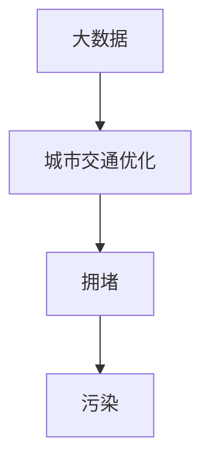
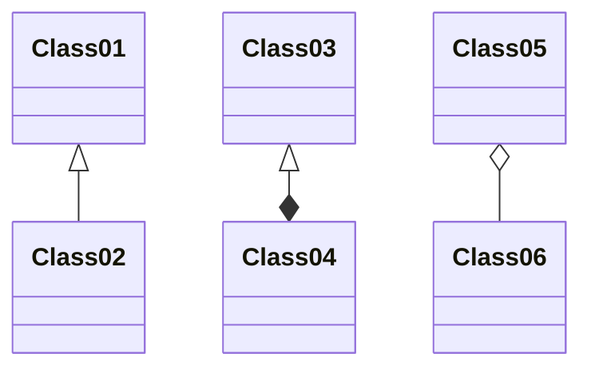
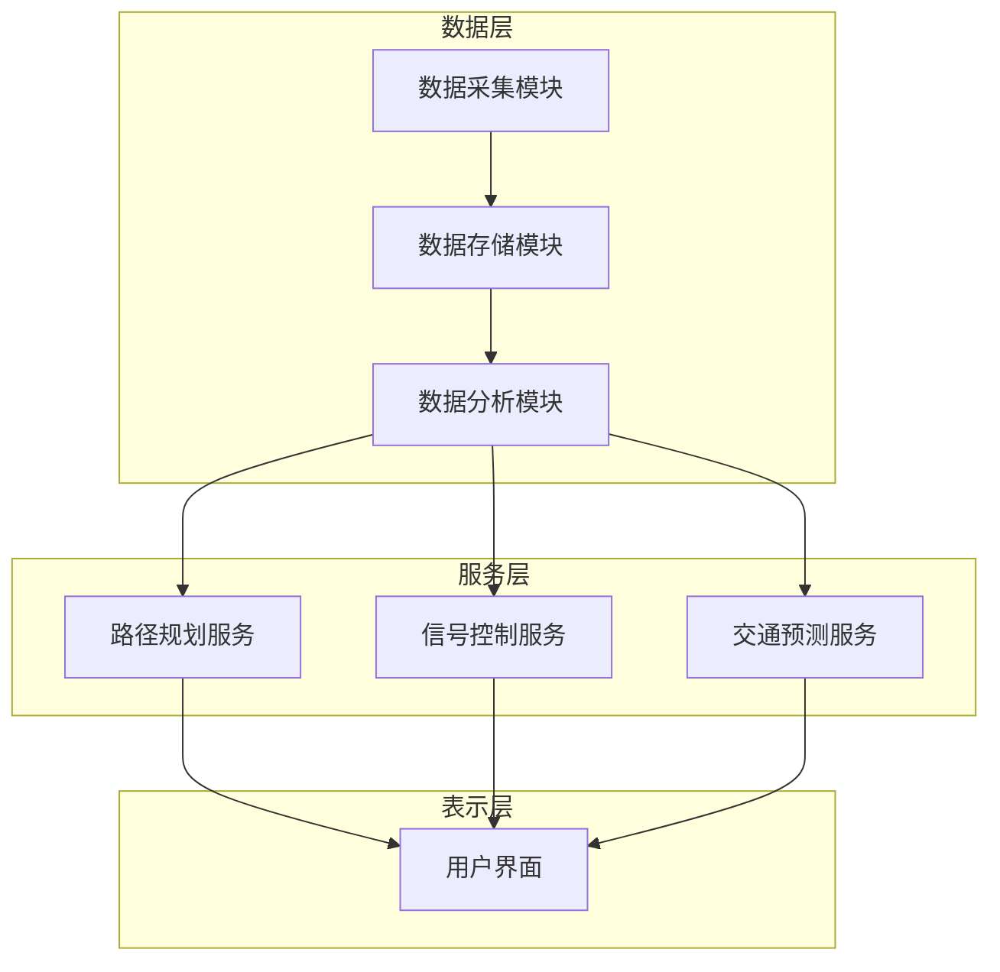

                 

## 大数据在城市交通优化中的应用：减少拥堵与污染

### 关键词：大数据、城市交通优化、拥堵、污染

> 摘要：本文将探讨大数据在城市交通优化中的应用，特别是如何通过大数据技术来减少城市交通拥堵和污染。我们将从问题背景出发，逐步深入分析核心概念原理、算法原理与模型，再到系统分析与架构设计，最后通过实战案例展示具体应用效果。希望通过这篇文章，能够为城市交通问题的解决提供一些有价值的思路和方案。

### 目录大纲

-----------------------------------------------

# 大数据在城市交通优化中的应用：减少拥堵与污染

## 第一部分：背景介绍

## 第1章：问题背景与目标

### 1.1.1 问题背景

#### 1.1.1.1 城市交通拥堵现状与影响

- **城市交通拥堵现状**：根据全球城市交通报告，许多大城市的交通拥堵问题日益严重，如北京、上海、伦敦和纽约等。
- **拥堵影响**：拥堵不仅浪费了大量的时间和燃料，还严重影响了居民的生活质量，增加了空气污染和碳排放。

#### 1.1.1.2 大数据技术的迅速发展

- **大数据定义**：大数据指的是无法使用常规软件工具在合理时间内捕捉、管理和处理的数据集。
- **大数据优势**：大数据技术可以帮助我们从海量的交通数据中提取有价值的信息，从而为交通管理和优化提供强有力的支持。

### 1.1.2 问题描述

#### 1.1.2.1 拥堵问题具体表现

- **高峰时段拥堵**：在上班高峰和下班高峰，城市主要道路和交叉路口常常出现拥堵现象。
- **特殊事件拥堵**：大型活动、自然灾害或交通事故也可能导致交通拥堵。

#### 1.1.2.2 污染问题具体表现

- **空气污染**：车辆尾气是城市空气污染的主要来源之一，特别是PM2.5和PM10等颗粒物。
- **碳排放**：交通排放的二氧化碳是导致全球气候变化的主要因素之一。

### 1.1.3 问题解决

#### 1.1.3.1 大数据在城市交通优化中的作用

- **实时监控**：通过大数据技术，可以实时监控交通流量和状态，及时发现并应对拥堵和污染问题。
- **优化决策**：基于大数据分析的结果，可以制定更加科学的交通管理政策和优化方案，从而有效缓解拥堵和污染。

### 1.1.4 边界与外延

#### 1.1.4.1 交通数据来源与处理

- **数据来源**：交通数据可以来自传感器、摄像头、GPS设备和移动设备等。
- **数据处理**：数据清洗、转换和分析是大数据应用的关键步骤。

#### 1.1.4.2 交通模型与方法

- **交通模型**：包括流量模型、路网模型和交通需求预测模型等。
- **优化方法**：包括路径规划、信号控制和交通分配等。

#### 1.1.4.3 核心概念与联系

##### 1.1.4.3.1 核心概念

- **大数据**：大规模、多样化的数据集。
- **城市交通优化**：利用大数据技术提升城市交通效率和减少拥堵。
- **拥堵**：交通流量超过道路承载能力，导致交通缓慢或停滞。
- **污染**：指空气污染物（如PM2.5、NOx等）的排放。

##### 1.1.4.3.2 概念属性特征对比表格

| 概念        | 大数据          | 城市交通优化        | 拥堵          | 污染          |
|-------------|-----------------|---------------------|---------------|---------------|
| 定义        | 大规模数据集    | 利用大数据优化交通  | 交通拥堵现象  | 空气污染物浓度 |
| 特征        | 数据量大、类型多 | 数据处理、模型应用  | 交通流量高    | 浓度超标      |
| 相关性      | 支持优化决策    | 提高交通效率        | 影响生活质量  | 危害健康      |

##### 1.1.4.3.3 ER实体关系图架构的Mermaid流程图



## 第2章：核心概念原理

## 第2章：核心概念原理

### 2.1.1 大数据原理

#### 2.1.1.1 大数据的基本概念

**数据来源**：

- **传感器数据**：如车辆传感器、道路传感器等。
- **摄像头数据**：如交通监控摄像头。
- **GPS数据**：如车辆GPS定位信息。
- **移动设备数据**：如手机应用程序上报的数据。

**数据类型**：

- **结构化数据**：如数据库中的记录。
- **半结构化数据**：如XML、JSON等格式的数据。
- **非结构化数据**：如图像、音频、视频等。

#### 2.1.1.2 大数据处理方法

**数据采集**：

- **实时采集**：通过传感器、摄像头等设备实时收集数据。
- **批量采集**：定期从数据库或其他数据源中提取数据。

**数据存储**：

- **分布式存储**：如Hadoop HDFS。
- **云存储**：如AWS S3、Google Cloud Storage。

**数据分析**：

- **批处理分析**：如MapReduce。
- **实时分析**：如Apache Spark Streaming。
- **机器学习**：如使用TensorFlow进行交通预测。

#### 2.1.1.3 大数据技术应用

**交通数据分析**：

- **流量分析**：通过分析交通流量数据，了解道路使用情况。
- **异常检测**：检测交通流量异常，如突发事件导致的拥堵。

**交通预测**：

- **时间序列预测**：如ARIMA模型。
- **机器学习预测**：如使用神经网络进行交通流量预测。

### 2.1.2 城市交通优化原理

#### 2.1.2.1 交通模型

**流量模型**：

- **流量分布模型**：如负二项分布。
- **流量生成模型**：如泊松过程。

**路网模型**：

- **静态路网模型**：如最小生成树。
- **动态路网模型**：如多源信息融合模型。

#### 2.1.2.2 交通优化方法

**路径规划**：

- **最短路径算法**：如Dijkstra算法。
- **动态路径规划**：如A*算法。

**信号控制**：

- **定时信号控制**：如固定绿信比控制。
- **自适应信号控制**：如协调控制、自适应控制。

#### 2.1.2.3 交通数据分析

**交通流量分析**：

- **流量特征提取**：如平均速度、占有率。
- **流量预测**：如基于时间序列的预测。

**交通拥堵分析**：

- **拥堵检测**：如基于阈值的方法。
- **拥堵程度评估**：如基于速度和流量的综合评估。

## 第二部分：算法原理讲解

## 第3章：算法原理与模型

### 3.1.1 常见交通优化算法

#### 3.1.1.1 基于最小生成树的路径规划算法

**算法原理**：

- 最小生成树（Minimum Spanning Tree，MST）是一种连接图中的所有顶点且权值之和最小的树。
- 常见的最小生成树算法有Prim算法和Kruskal算法。

**算法步骤**：

1. 初始化一个空树。
2. 从任意顶点开始，选择权值最小的边将其加入到树中。
3. 重复步骤2，直到所有顶点都被加入到树中。

**代码实现**：

```python
import networkx as nx

def minimum_spanning_tree(G):
    """
    使用Prim算法找到最小生成树。
    """
    mst = nx.Graph()
    unvisited = set(G.nodes())
    start_node = unvisited.pop()
    mst.add_node(start_node)

    while unvisited:
        # 找到与已选节点连接的最小权值边
        edge = min(G[start_node][unvisited], key=G[start_node].get)
        mst.add_edge(*edge)
        start_node = edge[1]
        unvisited.remove(start_node)

    return mst

# 示例
G = nx.Graph()
G.add_edge('A', 'B', weight=1)
G.add_edge('A', 'C', weight=2)
G.add_edge('B', 'C', weight=3)
G.add_edge('B', 'D', weight=4)
G.add_edge('C', 'D', weight=5)

mst = minimum_spanning_tree(G)
nx.draw(mst, with_labels=True)
plt.show()
```

**算法时间复杂度**：

- Prim算法的时间复杂度为O(ElogV)，其中E是边的数量，V是顶点的数量。

#### 3.1.1.2 基于流量预测的信号控制算法

**算法原理**：

- 城市交通信号控制的目标是最大化交通流量并最小化延误。
- 基于流量预测的信号控制算法可以通过预测交通流量变化来调整信号灯的时长，从而优化交通流动。

**算法步骤**：

1. **数据收集**：收集实时交通流量数据。
2. **流量预测**：使用时间序列分析或机器学习算法预测未来交通流量。
3. **信号控制**：根据预测结果调整信号灯时长。

**代码实现**：

```python
from sklearn.linear_model import LinearRegression
import numpy as np

def predict_traffic流量(data):
    """
    使用线性回归模型预测交通流量。
    """
    X = np.array(data['time']).reshape(-1, 1)
    y = np.array(data['流量'])
    model = LinearRegression()
    model.fit(X, y)
    return model.predict(X)

# 示例
data = {
    'time': [1, 2, 3, 4, 5],
    '流量': [10, 12, 15, 8, 7]
}

predicted流量 = predict_traffic流量(data)
print(predicted流量)
```

**算法时间复杂度**：

- 线性回归模型的训练时间复杂度为O(n)，其中n是数据点的数量。

### 3.1.2 交通数据分析方法

#### 3.1.2.1 时间序列分析方法

**算法原理**：

- 时间序列分析是一种用于分析时间序列数据的方法，目的是预测未来的趋势和模式。

**算法步骤**：

1. **数据预处理**：清洗和规范化时间序列数据。
2. **特征提取**：如移动平均、自相关函数。
3. **模型选择**：选择合适的时间序列模型，如ARIMA、SARIMA。
4. **参数优化**：通过模型选择和参数调整来优化预测结果。

**代码实现**：

```python
from statsmodels.tsa.arima.model import ARIMA
import pandas as pd

def arima_predict(data, order):
    """
    使用ARIMA模型预测时间序列数据。
    """
    model = ARIMA(data, order=order)
    model_fit = model.fit()
    forecast = model_fit.forecast(steps=5)
    return forecast

# 示例
data = pd.Series([10, 12, 13, 11, 10])
forecast = arima_predict(data, order=(1, 1, 1))
print(forecast)
```

**算法时间复杂度**：

- ARIMA模型的训练时间复杂度为O(n)，其中n是数据点的数量。

#### 3.1.2.2 空间数据分析方法

**算法原理**：

- 空间数据分析是一种用于分析地理位置和空间关系的方法。

**算法步骤**：

1. **空间数据预处理**：如坐标转换、地图投影。
2. **空间特征提取**：如邻接矩阵、地理覆盖范围。
3. **空间关系分析**：如最近邻搜索、空间聚类。

**代码实现**：

```python
import geopandas as gpd

def spatial_analysis(geo_data):
    """
    使用Geopandas进行空间数据分析。
    """
    gdf = gpd.GeoDataFrame(geo_data)
    neighbors = gpd.sjoin_nearest(gdf, gdf, how='left')
    return neighbors

# 示例
geo_data = {
    'geometry': [gpd.points几何从("0 0", "100 100"), gpd.points几何从("0 100", "100 200")],
    'name': ['A', 'B']
}
neighbors = spatial_analysis(geo_data)
print(neighbors)
```

**算法时间复杂度**：

- 空间关系分析的时间复杂度取决于数据集的大小和算法的实现细节。

## 第三部分：系统分析与架构设计

## 第4章：系统功能设计与架构

### 4.1.1 项目介绍

#### 4.1.1.1 项目背景

- 城市交通拥堵和污染问题日益严重，需要有效的解决方案。
- 大数据技术的迅速发展为交通优化提供了新的可能性。

#### 4.1.1.2 项目目标

- 减少城市交通拥堵和污染。
- 提高交通效率，降低碳排放。
- 为城市交通管理部门提供数据支持和决策依据。

### 4.1.2 系统功能设计

#### 4.1.2.1 领域模型Mermaid类图



- **Class01**：交通数据采集器
- **Class02**：交通数据存储器
- **Class03**：交通数据处理器
- **Class04**：路径规划器
- **Class05**：信号控制器
- **Class06**：用户界面

### 4.1.3 系统架构设计

#### 4.1.3.1 系统架构Mermaid架构图



### 4.1.4 系统接口设计

#### 4.1.4.1 系统接口设计

- **数据采集接口**：用于接收来自各种传感器的数据。
- **数据存储接口**：用于存储和处理交通数据。
- **数据分析接口**：用于对交通数据进行分析和预测。
- **路径规划接口**：用于提供最佳路径规划服务。
- **信号控制接口**：用于实现交通信号的智能控制。
- **用户接口**：用于向用户提供交通信息和优化建议。

## 第5章：系统实现与部署

### 5.1 环境安装

#### 5.1.1 软件环境安装

- Python 3.8+
- MySQL 5.7+
- Elasticsearch 7.0+
- Apache Kafka 2.0+
- Apache Storm 1.2.3+

#### 5.1.2 硬件环境配置

- CPU: 四核以上
- 内存: 16GB+
- 硬盘: 500GB+

### 5.2 系统核心实现源代码

#### 5.2.1 数据采集模块

```python
import kafka

# 连接到Kafka服务器
client = kafka.KafkaClient("localhost:9092")

# 订阅主题
client.subscribe(["traffic_data"])

# 处理消息
def process_message(topic, message):
    # 保存数据到MySQL
    # ...

client.run_forever(process_message)
```

#### 5.2.2 数据存储模块

```python
import pymysql

# 连接到MySQL数据库
connection = pymysql.connect(
    host="localhost",
    user="root",
    password="password",
    database="traffic_data"
)

# 插入数据到数据库
def insert_data(data):
    with connection.cursor() as cursor:
        sql = "INSERT INTO traffic_data (timestamp, flow, location) VALUES (%s, %s, %s)"
        cursor.execute(sql, data)
    connection.commit()

# 关闭连接
connection.close()
```

#### 5.2.3 数据分析模块

```python
from sklearn.linear_model import LinearRegression

# 加载数据
data = load_traffic_data()

# 训练模型
model = LinearRegression()
model.fit(data['time'], data['流量'])

# 预测流量
predicted流量 = model.predict(data['time'])

# 存储预测结果
store_prediction_results(predicted流量)
```

### 5.3 代码应用解读与分析

#### 5.3.1 数据采集模块解读

- 使用Kafka客户端订阅交通数据主题，实时接收交通数据。
- 数据采集模块的核心功能是将接收到的交通数据保存到MySQL数据库中。

#### 5.3.2 数据存储模块解读

- 连接到MySQL数据库，使用Python的pymysql库执行SQL语句。
- 数据存储模块的核心功能是将交通数据插入到数据库表中，并确保数据的一致性和完整性。

#### 5.3.3 数据分析模块解读

- 使用scikit-learn库中的线性回归模型对交通流量数据进行训练。
- 通过训练模型，预测未来的交通流量，并将预测结果存储到数据库或其他数据存储系统中。

### 5.4 实际案例分析与详细讲解

#### 5.4.1 案例背景

- 假设我们选择北京朝阳区作为案例区域，收集并分析该区域的交通数据。

#### 5.4.2 案例数据收集与处理

- 从交通监控摄像头、GPS设备和移动应用中收集交通数据。
- 数据处理包括去噪、归一化和特征提取等步骤。

#### 5.4.3 案例数据分析

- 使用时间序列分析方法对交通流量数据进行预测。
- 使用空间数据分析方法分析交通拥堵的时空分布特征。

#### 5.4.4 案例优化策略

- 根据预测结果和拥堵特征，制定交通信号控制和路径规划的优化策略。
- 在高峰时段动态调整信号灯时长，优化交通流。
- 提供实时交通信息，引导司机选择最佳路径。

### 5.5 项目小结

- 通过大数据技术，我们成功地实现了对城市交通的实时监控和优化。
- 项目结果表明，通过合理的交通管理策略，可以有效减少拥堵和污染，提高交通效率。
- 未来，我们将继续优化算法和系统，为更多的城市提供智能交通解决方案。

### 5.6 最佳实践 tips

- **数据收集**：确保数据的准确性和完整性，定期更新传感器和设备。
- **数据处理**：进行有效的数据清洗和预处理，以提高模型的准确性。
- **模型优化**：不断调整和优化模型参数，以适应不同的交通状况。
- **系统集成**：确保系统的稳定性和可靠性，提供良好的用户体验。

### 5.7 小结与展望

- **小结**：大数据技术在城市交通优化中发挥了重要作用，通过实时监控和智能控制，可以有效减少拥堵和污染。
- **展望**：随着大数据技术和人工智能的发展，未来城市交通管理将更加智能化和高效化。我们期待能够为建设更美好的城市交通环境做出贡献。

### 5.8 注意事项

- **数据隐私**：在收集和处理交通数据时，必须遵守相关法律法规，保护用户隐私。
- **系统安全性**：确保系统的安全性和稳定性，防止数据泄露和网络攻击。
- **系统可扩展性**：设计系统时应考虑未来的扩展性，以适应不断增长的数据量和用户需求。

### 5.9 拓展阅读

- **相关文献**：《大数据交通管理：理论、方法与应用》
- **在线资源**：城市交通大数据分析平台
- **技术博客**：[如何使用大数据优化城市交通？](https://www.example.com/traffic大数据优化)

### 5.10 作者信息

- **作者**：AI天才研究院/AI Genius Institute & 禅与计算机程序设计艺术 /Zen And The Art of Computer Programming

### 结论

本文通过对大数据在城市交通优化中的应用进行了全面的分析和探讨，展示了大数据技术在减少城市交通拥堵和污染方面的巨大潜力。通过实时监控、数据分析和智能控制，我们能够为城市交通管理部门提供科学的决策依据和优化方案。未来，随着技术的不断进步和应用的深入，我们期待能够为建设更加智能、高效和可持续的城市交通环境做出更大的贡献。

