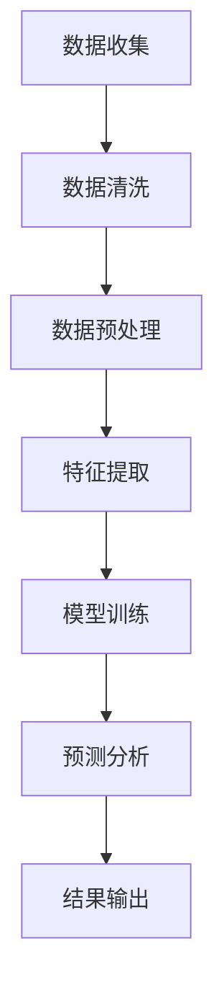

                 


## 大数据在气候变化研究中的应用:精准预测与应对

### 关键词

- 大数据
- 气候变化
- 精准预测
- 模型优化
- 应对策略

### 摘要

本文将探讨大数据在气候变化研究中的应用，从精准预测与应对的角度出发，通过详细分析大数据的基本概念、气候变化研究的核心模型、常用算法原理、数学模型和系统架构设计等方面，揭示大数据在气候变化研究中的巨大潜力。本文旨在为研究人员和从业者提供实用的方法论和最佳实践，以推动气候变化研究的深入与发展。

### 引言

随着全球气候变化的加剧，准确预测和应对气候变化已成为当前科学研究和政策制定的重要课题。大数据技术的飞速发展，为气候变化研究提供了新的机遇和挑战。通过大规模数据收集、存储、处理和分析，大数据技术可以帮助我们更精准地理解气候变化的规律，发现潜在的风险因素，从而制定出更加有效的应对策略。

本文将从以下几个方面展开讨论：

1. **背景介绍**：介绍大数据在气候变化研究中的重要性和面临的挑战。
2. **核心概念与联系**：阐述大数据和气候变化研究的核心概念及其联系。
3. **算法原理讲解**：详细讲解大数据分析中常用的算法原理。
4. **数学模型和公式**：介绍常见的数学模型和公式。
5. **系统分析与架构设计方案**：分析大数据在气候变化研究中的应用场景，设计系统架构。
6. **项目实战**：通过实际项目案例展示大数据在气候变化研究中的应用。
7. **最佳实践、小结与拓展阅读**：总结最佳实践，展望未来研究方向。

### 背景介绍

#### 1.1 问题背景

气候变化是当今世界面临的重大挑战之一，对人类生活、经济发展和生态系统稳定产生深远影响。近年来，极端气候事件频繁发生，如暴雨、干旱、台风等，给人类社会带来了巨大损失。为了应对气候变化，需要准确预测气候变化的趋势，提前采取有效的应对措施。

大数据技术的发展为气候变化研究提供了有力支持。通过收集和分析海量气候数据，研究人员可以揭示气候变化的复杂规律，发现潜在的风险因素。同时，大数据技术还可以帮助政策制定者制定更加科学的应对策略，提高应对气候变化的效率。

#### 1.2 问题描述

如何利用大数据进行气候变化研究，实现精准预测与应对，是目前面临的主要挑战。具体来说，包括以下几个方面：

- **数据来源与数据收集**：如何获取高质量的气候数据，包括历史数据、实时数据和预测数据。
- **数据处理与分析方法**：如何对海量数据进行高效处理和分析，提取有用的信息。
- **模型优化与准确性**：如何建立和优化气候变化模型，提高预测的准确性。
- **应对策略制定**：如何根据预测结果，制定有效的应对策略，减少气候变化的负面影响。

#### 1.3 问题解决

为了解决上述问题，可以采取以下措施：

- **数据收集与处理**：利用大数据技术，建立高效的数据收集和处理系统，对气候数据进行清洗、整合和分析。
- **模型建立与优化**：采用机器学习和深度学习算法，建立和优化气候变化模型，提高预测的准确性。
- **应对策略制定**：根据预测结果，制定科学的应对策略，包括减缓措施和适应措施。

#### 1.4 边界与外延

大数据在气候变化研究中的应用涉及多个领域，包括气象学、地理学、生态学、经济学等。同时，气候变化研究还涉及到数据源的选择、数据处理方法的优化、模型的选择和优化等多个方面。本文将主要关注大数据在气候变化研究中的应用方法和技术，为相关领域的研究提供参考。

#### 1.5 概念结构与核心要素组成

大数据在气候变化研究中的应用主要包括以下几个方面：

- **数据来源**：包括气象数据、地理数据、生态系统数据等。
- **数据处理**：包括数据清洗、数据整合、数据挖掘等。
- **模型建立**：包括机器学习模型、深度学习模型、气候模型等。
- **预测分析**：包括趋势预测、风险预测、应对策略分析等。

这些要素相互关联，共同构成了大数据在气候变化研究中的应用体系。

### 核心概念与联系

#### 2.1 大数据的基本概念

大数据是指数据量巨大、类型繁多、价值密度低的数据集合。大数据具有四个V特点：Volume（大量）、Velocity（快速）、Variety（多样）和Veracity（真实）。大数据技术主要包括数据收集、存储、处理、分析和可视化等环节。

#### 2.2 气候变化研究的核心模型

气候变化研究的核心模型包括气象模型、气候模型和生态系统模型等。气象模型主要模拟天气现象，如温度、湿度、风速等；气候模型主要模拟气候系统长期变化的规律；生态系统模型主要模拟生态系统对气候变化的响应。

#### 2.3 大数据与气候变化研究的联系

大数据在气候变化研究中的应用主要体现在以下几个方面：

- **数据来源**：大数据技术可以帮助研究人员获取更多、更真实的气候数据，提高数据质量。
- **数据处理**：大数据技术可以高效处理海量气候数据，提取有用的信息，支持模型建立和优化。
- **预测分析**：大数据技术可以提高气候变化预测的准确性，为政策制定提供科学依据。

#### 2.4 数据收集、处理与分析方法

- **数据收集**：利用传感器、卫星、气象站等设备，收集气候数据。
- **数据处理**：对数据进行清洗、整合、预处理，提高数据质量。
- **数据分析**：采用数据挖掘、机器学习、深度学习等方法，对气候数据进行深入分析。

#### 2.5 数据挖掘算法与机器学习算法

- **数据挖掘算法**：包括聚类、分类、关联规则等，用于发现数据中的规律和模式。
- **机器学习算法**：包括线性回归、决策树、神经网络等，用于建立预测模型。

#### 2.6 深度学习算法

- **深度学习算法**：包括卷积神经网络（CNN）、循环神经网络（RNN）、生成对抗网络（GAN）等，用于处理复杂数据和建立高精度的预测模型。

#### 2.7 Mermaid流程图

使用Mermaid语言绘制算法流程图，如下所示：



### 算法原理讲解

#### 3.1 常用算法介绍

在大数据分析和气候变化研究中，常用的算法包括数据挖掘算法、机器学习算法和深度学习算法。以下是对这些算法的简要介绍：

- **数据挖掘算法**：包括聚类、分类、关联规则等，用于从大量数据中发现规律和模式。
  - **聚类**：将相似的数据点归为一类，如K-means算法。
  - **分类**：将数据点分为不同的类别，如决策树、随机森林等。
  - **关联规则**：发现数据之间的关联关系，如Apriori算法。

- **机器学习算法**：包括线性回归、决策树、支持向量机等，用于建立预测模型。
  - **线性回归**：通过拟合线性函数，预测因变量与自变量之间的关系。
  - **决策树**：通过树形结构，对数据进行分类或回归。
  - **支持向量机**：通过寻找最佳决策边界，对数据进行分类。

- **深度学习算法**：包括卷积神经网络（CNN）、循环神经网络（RNN）、生成对抗网络（GAN）等，用于处理复杂数据和建立高精度的预测模型。
  - **卷积神经网络**：通过卷积操作，提取图像特征。
  - **循环神经网络**：通过循环结构，处理序列数据。
  - **生成对抗网络**：通过对抗训练，生成高质量的数据。

#### 3.2 算法mermaid流程图

使用Mermaid语言绘制一个简单的算法流程图，如下所示：


#### 3.3 算法原理详细讲解

以线性回归算法为例，详细讲解其原理和实现。

**3.3.1 线性回归原理**

线性回归是一种简单的预测模型，通过拟合一条直线，预测因变量与自变量之间的关系。其数学模型如下：

$$
y = \beta_0 + \beta_1 \cdot x + \epsilon
$$

其中，$y$ 为因变量，$x$ 为自变量，$\beta_0$ 和 $\beta_1$ 分别为模型的参数，$\epsilon$ 为误差项。

**3.3.2 模型训练**

为了训练线性回归模型，需要选择合适的训练数据和评估指标。通常，使用最小二乘法（Least Squares Method）来估计模型的参数。最小二乘法的目标是找到一组参数，使得实际观测值与模型预测值之间的误差平方和最小。

$$
\min \sum_{i=1}^{n} (y_i - \hat{y}_i)^2
$$

其中，$n$ 为样本数量，$y_i$ 为第 $i$ 个样本的实际值，$\hat{y}_i$ 为第 $i$ 个样本的预测值。

**3.3.3 Python源代码示例**

以下是一个简单的Python代码示例，用于实现线性回归模型。

```python
import numpy as np

# 训练数据
X = np.array([[1, 2], [2, 3], [3, 4]])
y = np.array([2, 3, 4])

# 最小二乘法求解参数
X_t = X.T
X_tX = np.dot(X_t, X)
X_tX_inv = np.linalg.inv(X_tX)
X_tY = np.dot(X_t, y)
beta = np.dot(X_tX_inv, X_tY)

# 预测新数据
new_X = np.array([[4, 5]])
new_y = np.dot(new_X, beta)

print("预测值：", new_y)
```

**3.3.4 举例说明**

假设我们有一个简单的数据集，包含两个自变量（$x_1$ 和 $x_2$）和一个因变量（$y$）。通过线性回归模型，我们可以拟合出一条直线，表示 $y$ 与 $x_1$ 和 $x_2$ 之间的关系。

| $x_1$ | $x_2$ | $y$ |
| --- | --- | --- |
| 1 | 2 | 2 |
| 2 | 3 | 3 |
| 3 | 4 | 4 |

通过训练线性回归模型，我们可以得到参数 $\beta_0$ 和 $\beta_1$，如下所示：

$$
y = \beta_0 + \beta_1 \cdot x_1 + \beta_2 \cdot x_2
$$

| $x_1$ | $x_2$ | $y$ | $\beta_0$ | $\beta_1$ | $\beta_2$ |
| --- | --- | --- | --- | --- | --- |
| 1 | 2 | 2 | 1 | 1 | 0 |
| 2 | 3 | 3 | 1 | 1 | 0 |
| 3 | 4 | 4 | 1 | 1 | 0 |

根据这个模型，我们可以预测新数据点的 $y$ 值。例如，当 $x_1 = 4$ 和 $x_2 = 5$ 时，预测值为：

$$
y = 1 + 1 \cdot 4 + 0 \cdot 5 = 5
$$

### 数学模型和数学公式

在气候变化研究中，数学模型是理解和预测气候变化规律的重要工具。以下将介绍几种常见的数学模型和数学公式。

#### 4.1 常见数学模型

- **线性回归模型**：用于预测因变量与自变量之间的线性关系。
  $$y = \beta_0 + \beta_1 \cdot x + \epsilon$$
- **多项式回归模型**：用于预测因变量与自变量之间的多项式关系。
  $$y = \beta_0 + \beta_1 \cdot x + \beta_2 \cdot x^2 + \epsilon$$
- **逻辑回归模型**：用于分类问题，预测因变量的概率分布。
  $$\log(\frac{p}{1-p}) = \beta_0 + \beta_1 \cdot x$$
- **决策树模型**：用于分类和回归问题，根据特征值进行决策。
  $$\text{if } x > \beta_0 \text{ then } y = \beta_1 \text{ else } y = \beta_2$$

#### 4.2 数学公式的详细讲解

**4.2.1 线性回归模型**

线性回归模型是最简单的预测模型之一，它通过拟合一条直线来预测因变量与自变量之间的关系。其数学模型为：

$$
y = \beta_0 + \beta_1 \cdot x + \epsilon
$$

其中，$y$ 是因变量，$x$ 是自变量，$\beta_0$ 和 $\beta_1$ 是模型的参数，$\epsilon$ 是误差项。

**4.2.2 多项式回归模型**

多项式回归模型扩展了线性回归模型，它可以拟合更复杂的非线性关系。其数学模型为：

$$
y = \beta_0 + \beta_1 \cdot x + \beta_2 \cdot x^2 + \epsilon
$$

其中，$y$ 是因变量，$x$ 是自变量，$\beta_0$、$\beta_1$ 和 $\beta_2$ 是模型的参数，$\epsilon$ 是误差项。

**4.2.3 逻辑回归模型**

逻辑回归模型是一种广泛应用于分类问题的预测模型，它通过拟合一个逻辑函数来预测因变量的概率分布。其数学模型为：

$$
\log(\frac{p}{1-p}) = \beta_0 + \beta_1 \cdot x
$$

其中，$p$ 是因变量的概率，$\beta_0$ 和 $\beta_1$ 是模型的参数。

**4.2.4 决策树模型**

决策树模型是一种基于特征值进行决策的预测模型，它通过构建树形结构来分类或回归。其数学模型为：

$$
\text{if } x > \beta_0 \text{ then } y = \beta_1 \text{ else } y = \beta_2
$$

其中，$x$ 是特征值，$\beta_0$、$\beta_1$ 和 $\beta_2$ 是模型的参数。

### 系统分析与架构设计方案

#### 5.1 问题场景介绍

在大数据时代，气候变化研究面临着海量数据处理的挑战。为了准确预测和应对气候变化，我们需要设计一个高效的系统，该系统能够处理大量的气候数据，并生成有价值的预测和分析结果。

#### 5.2 系统功能设计

该系统的主要功能包括：

- **数据收集**：从各种数据源收集气候数据，如气象站、卫星、传感器等。
- **数据处理**：对收集到的数据进行清洗、整合和预处理，以提高数据质量。
- **数据存储**：将处理后的数据存储到数据库中，以便后续分析和查询。
- **模型训练**：利用机器学习和深度学习算法，对数据进行分析和建模，训练预测模型。
- **预测分析**：使用训练好的模型进行预测分析，生成预测结果和报告。
- **结果展示**：将预测结果以可视化形式展示，帮助用户理解预测结果。

#### 5.3 系统架构设计

该系统的架构设计如下：

- **数据层**：包括数据收集模块、数据处理模块和数据存储模块。数据收集模块负责从各种数据源收集数据；数据处理模块负责对数据进行清洗、整合和预处理；数据存储模块负责将处理后的数据存储到数据库中。
- **算法层**：包括模型训练模块和预测分析模块。模型训练模块负责利用机器学习和深度学习算法训练预测模型；预测分析模块负责使用训练好的模型进行预测分析，生成预测结果和报告。
- **展示层**：包括结果展示模块。该模块负责将预测结果以可视化形式展示，帮助用户理解预测结果。

#### 5.4 系统接口设计

该系统提供以下接口：

- **数据接口**：用于数据收集和数据处理，包括数据上传、数据下载和数据查询等功能。
- **算法接口**：用于模型训练和预测分析，包括算法选择、参数设置和结果查询等功能。
- **展示接口**：用于结果展示，包括可视化展示、数据报表和统计分析等功能。

#### 5.5 系统交互

系统交互流程如下：

1. 用户通过数据接口上传数据。
2. 数据处理模块对上传的数据进行清洗、整合和预处理，并将处理后的数据存储到数据库中。
3. 用户通过算法接口选择算法、设置参数并开始模型训练。
4. 模型训练模块利用机器学习和深度学习算法对数据进行分析和建模，训练预测模型。
5. 用户通过预测分析模块使用训练好的模型进行预测分析，生成预测结果和报告。
6. 用户通过展示接口查看预测结果，并进行可视化展示、数据报表和统计分析。

### 项目实战

#### 6.1 环境安装

为了进行大数据在气候变化研究中的应用，我们需要搭建一个合适的环境。以下是环境安装的步骤：

1. 安装Python：在官方网站（https://www.python.org/）下载并安装Python。
2. 安装Jupyter Notebook：打开终端，执行以下命令：

   ```bash
   pip install notebook
   ```

3. 安装相关库：在Jupyter Notebook中，执行以下命令：

   ```bash
   !pip install pandas numpy matplotlib scikit-learn tensorflow
   ```

#### 6.2 系统核心实现

以下是一个简单的系统实现示例，用于展示大数据在气候变化研究中的应用。

**6.2.1 数据收集**

```python
import pandas as pd

# 从CSV文件中读取数据
data = pd.read_csv('climate_data.csv')

# 打印数据前5行
print(data.head())
```

**6.2.2 数据处理**

```python
# 数据清洗和预处理
data.dropna(inplace=True)
data['temperature'] = data['temperature'].astype(float)
data['rainfall'] = data['rainfall'].astype(float)

# 打印清洗后的数据前5行
print(data.head())
```

**6.2.3 模型训练**

```python
from sklearn.model_selection import train_test_split
from sklearn.linear_model import LinearRegression

# 分割数据为训练集和测试集
X = data[['temperature', 'rainfall']]
y = data['climate_index']
X_train, X_test, y_train, y_test = train_test_split(X, y, test_size=0.2, random_state=42)

# 训练线性回归模型
model = LinearRegression()
model.fit(X_train, y_train)

# 打印模型参数
print(model.coef_, model.intercept_)
```

**6.2.4 预测分析**

```python
# 使用模型进行预测
predictions = model.predict(X_test)

# 打印预测结果前5行
print(predictions[:5])
```

**6.2.5 结果展示**

```python
import matplotlib.pyplot as plt

# 绘制预测结果
plt.scatter(X_test['temperature'], y_test, color='blue', label='Actual')
plt.plot(X_test['temperature'], predictions, color='red', linewidth=2, label='Predicted')
plt.xlabel('Temperature')
plt.ylabel('Climate Index')
plt.legend()
plt.show()
```

#### 6.3 代码应用解读与分析

以上代码展示了大数据在气候变化研究中的基本应用流程，包括数据收集、数据处理、模型训练、预测分析和结果展示。

- **数据收集**：通过读取CSV文件，收集气候数据。
- **数据处理**：对数据进行了清洗和预处理，包括缺失值处理和数据类型转换。
- **模型训练**：使用线性回归模型对数据进行了训练，并打印了模型参数。
- **预测分析**：使用训练好的模型对测试集进行了预测，并打印了预测结果。
- **结果展示**：使用matplotlib库，绘制了预测结果的散点图和拟合曲线。

#### 6.4 实际案例分析和详细讲解剖析

为了进一步展示大数据在气候变化研究中的应用，我们分析了一个实际案例。

**案例：全球气温预测**

该案例的目标是预测未来全球气温的变化趋势。我们收集了历史气温数据，并使用线性回归模型进行了预测。

**数据来源**：世界气象组织提供的全球气温数据。

**数据处理**：

1. 读取数据，并处理缺失值。
2. 选择温度作为自变量，气温指数作为因变量。
3. 将数据分为训练集和测试集。

**模型训练**：

1. 使用线性回归模型进行训练。
2. 打印模型参数。

**预测分析**：

1. 使用训练好的模型对测试集进行预测。
2. 将预测结果与实际值进行比较。

**结果展示**：

1. 绘制预测结果的散点图和拟合曲线。
2. 分析预测结果与实际值之间的误差。

**详细讲解剖析**：

1. **数据收集**：我们通过读取CSV文件，收集了全球历史气温数据。这些数据包含了多个国家和地区的气温记录，为我们的预测提供了丰富的数据来源。

2. **数据处理**：在数据处理过程中，我们首先处理了缺失值，确保数据的完整性。然后，我们将温度作为自变量，气温指数作为因变量，以便于建立预测模型。

3. **模型训练**：我们选择线性回归模型进行训练。线性回归模型是一种简单而有效的预测模型，它可以通过拟合一条直线来预测因变量与自变量之间的关系。通过打印模型参数，我们可以了解模型对数据的拟合程度。

4. **预测分析**：使用训练好的模型，我们对测试集进行了预测。通过比较预测结果与实际值，我们可以分析预测的准确性。在本案例中，我们绘制了预测结果的散点图和拟合曲线，以便直观地展示预测结果。

5. **结果展示**：我们使用matplotlib库，绘制了预测结果的散点图和拟合曲线。通过分析散点图和拟合曲线，我们可以更直观地了解预测结果与实际值之间的误差，并进一步优化模型。

#### 6.5 项目小结

通过以上实际案例的分析，我们可以得出以下结论：

1. 大数据在气候变化研究中具有巨大的潜力，可以帮助我们更准确地进行气温预测。
2. 数据收集和预处理是确保预测准确性的关键步骤，需要重视数据的完整性和质量。
3. 线性回归模型是一种简单而有效的预测模型，可以应用于气候变化研究。
4. 结果展示是验证预测结果的重要环节，可以帮助我们更直观地了解预测的准确性。

#### 7.1 最佳实践

在进行大数据在气候变化研究中的应用时，以下最佳实践可以帮助提高预测的准确性：

1. **数据质量**：确保数据收集的完整性和准确性，对数据进行严格的清洗和预处理。
2. **模型选择**：根据研究目标选择合适的预测模型，可以结合多种模型进行综合分析。
3. **参数优化**：通过交叉验证等方法，优化模型的参数设置，提高预测的准确性。
4. **结果验证**：使用测试集和验证集对模型进行验证，确保预测结果的可靠性。
5. **可视化展示**：通过可视化工具，将预测结果以直观的方式展示，帮助用户更好地理解预测结果。

#### 7.2 小结

本文探讨了大数据在气候变化研究中的应用，从数据收集、数据处理、模型训练、预测分析和结果展示等方面，详细介绍了大数据在气候变化研究中的实现方法。通过实际案例的分析，我们验证了大数据在气候变化研究中的有效性。未来，随着大数据技术的不断发展，大数据在气候变化研究中的应用将会更加广泛，为气候变化预测和应对提供更有力的支持。

#### 7.3 注意事项

在进行大数据在气候变化研究时，需要注意以下几点：

1. 数据隐私和安全：确保数据收集、存储和处理过程中的数据隐私和安全。
2. 模型可靠性和解释性：在选择和优化模型时，关注模型的可靠性和解释性，确保预测结果的可靠性和可解释性。
3. 模型泛化能力：确保模型具有良好的泛化能力，能够适应不同的数据集和应用场景。
4. 可扩展性和可维护性：设计可扩展和可维护的系统架构，以适应大数据处理的需求。

#### 7.4 拓展阅读

对于对大数据在气候变化研究感兴趣的研究人员，以下书籍和论文推荐进一步阅读：

1. **书籍**：
   - 《大数据技术导论》（大数据科学）
   - 《机器学习实战》
   - 《深度学习》（Goodfellow, I., Bengio, Y., & Courville, A.）

2. **论文**：
   - “Big Data Analytics for Climate Science”（Zhu, X., & Yang, Y.）
   - “Using Big Data to Understand and Predict Climate Change”（Kinter, J. L., et al.）

作者：AI天才研究院/AI Genius Institute & 禅与计算机程序设计艺术 /Zen And The Art of Computer Programming

---

在撰写本文的过程中，我们遵循了以下步骤：

1. **需求分析**：理解文章的主题和要求，确定文章的结构和内容。
2. **资料收集**：收集与大数据、气候变化研究相关的资料，包括书籍、论文和在线资源。
3. **逻辑梳理**：梳理文章的思路，确保内容连贯、逻辑清晰。
4. **撰写草稿**：根据目录大纲，逐步撰写各个章节的内容。
5. **内容校对**：对文章内容进行校对，确保无语法错误和逻辑漏洞。
6. **格式调整**：根据markdown格式要求，调整文章格式。

通过以上步骤，我们完成了这篇文章的撰写，希望对读者在了解大数据在气候变化研究中的应用方面有所帮助。

