                 


### 设计大数据在社交网络分析中的应用：洞察社会动态

> 关键词：社交网络分析、大数据、社会动态、算法、系统架构

> 摘要：本文将深入探讨大数据在社交网络分析中的应用，通过分析社交网络的兴起与大数据时代的特点，阐述社交网络分析的意义与挑战，进而介绍社交网络分析的基本概念、大数据分析技术及其核心概念与联系。在此基础上，我们将详细讲解社交网络分析算法、大数据算法在社交网络分析中的应用，以及数学模型和公式。随后，我们将分析社交网络分析系统的设计与架构，并通过一个实际项目来展示大数据在社交网络分析中的应用实战。最后，我们将总结最佳实践、注意事项，并给出拓展阅读的建议。

**# 第一部分：背景介绍**

## 1. 社交网络的兴起与大数据时代

### 1.1 社交网络的起源与发展

社交网络，作为一种信息交流平台，起源于20世纪90年代的互联网浪潮。最早的社交网络雏形是1997年 launched的“Six Degrees”，它允许用户通过“六度分隔”理论，建立人际关系网络。随着时间的推移，社交网络经历了快速的发展与演变，主要可以分为以下几个阶段：

- **初期阶段**：这一时期的社交网络主要以论坛和博客为主，用户可以通过发表帖子、留言等形式进行交流，如1999年 launched的“BBS”和2002年 launched的“Blog”。

- **中期阶段**：2004年，launched的“Facebook”开启了社交网络的2.0时代，它通过建立用户个人资料、朋友关系链等，实现了更紧密的社交互动。

- **现阶段**：随着移动互联网的普及，社交网络呈现出多样化、个性化、智能化的特点，如“微博”、“抖音”、“微信”等，它们不仅提供了丰富的社交功能，还集成了短视频、直播等多种内容形式。

### 1.2 大数据时代的到来

大数据，是指无法用传统数据处理系统进行捕捉、管理和处理的规模庞大、类型繁多的数据。大数据具有四个主要特征，即“4V”：

- **大量（Volume）**：数据量极其庞大，通常达到PB（拍字节）级别。
- **多样性（Variety）**：数据类型繁多，包括结构化数据、非结构化数据、半结构化数据等。
- **速度（Velocity）**：数据的生成、处理速度极快，需要实时响应。
- **真实性（Veracity）**：数据真实性难以判断，可能存在噪声、错误和不一致。

大数据时代的到来，为社交网络分析提供了丰富的数据资源，也带来了新的挑战。

### 1.3 社交网络分析的意义与挑战

社交网络分析，是指通过收集、处理和分析社交网络中的数据，提取有价值的信息，用于洞察社会动态、发现潜在趋势、优化社交策略等。社交网络分析具有重要的意义：

- **社会洞察**：通过分析社交网络数据，可以了解社会舆情、公共观点、群体行为等，为政策制定、社会管理提供科学依据。
- **商业价值**：企业可以通过分析社交网络数据，了解用户需求、市场趋势，优化产品和服务，提高竞争力。
- **科学研究**：社交网络分析为社会科学、心理学、计算机科学等领域提供了丰富的数据和研究方法。

然而，社交网络分析也面临着诸多挑战：

- **数据质量**：社交网络中的数据质量参差不齐，可能存在虚假信息、噪声数据等，影响分析结果的准确性。
- **隐私保护**：社交网络数据往往涉及用户的隐私，如何在保证用户隐私的前提下进行数据分析，是一个重要的伦理问题。
- **算法偏差**：社交网络分析算法可能存在偏见，如针对特定群体的歧视，影响分析结果的公正性。

### 1.4 研究目的与内容概述

本文旨在深入探讨大数据在社交网络分析中的应用，通过分析社交网络的兴起与大数据时代的特点，探讨社交网络分析的意义与挑战，介绍社交网络分析的基本概念、大数据分析技术及其核心概念与联系。同时，本文将详细讲解社交网络分析算法、大数据算法在社交网络分析中的应用，以及数学模型和公式。在此基础上，我们将分析社交网络分析系统的设计与架构，并通过一个实际项目来展示大数据在社交网络分析中的应用实战。最终，本文将总结最佳实践、注意事项，并给出拓展阅读的建议。

**# 第二部分：核心概念与联系**

## 2.1 社交网络分析的基本概念

### 2.1.1 社交网络的结构特征

社交网络的结构特征主要包括网络密度、度分布和社团结构。

- **网络密度**：网络密度是指社交网络中实际存在的边数与可能存在的最大边数之比。网络密度可以反映社交网络的紧密程度。

  $$ Density = \frac{Number\ of\ Edges}{Maximum\ possible\ Number\ of\ Edges} $$

- **度分布**：度分布是指社交网络中节点度数的分布情况。常见的度分布模型有泊松分布、二项分布等。

  $$ P(k) = \frac{C(n, k) \cdot p^k \cdot (1-p)^{n-k}}{n!} $$

  其中，$n$ 为节点总数，$k$ 为节点度数，$p$ 为边的概率。

- **社团结构**：社团结构是指社交网络中节点形成的紧密群体。社团结构识别和社区发现是社交网络分析的重要任务。

  社团识别常用的算法有： Girvan-Newman 算法、标签传播算法、结构平衡算法等。

  社区发现常用的算法有： Girvan-Newman 算法、Louvain 算法、Girvan-Newman 聚类算法等。

### 2.1.2 社交网络的行为特征

社交网络的行为特征主要包括信息传播模型和用户行为分析。

- **信息传播模型**：信息传播模型用于描述信息在社交网络中的传播过程。常见的模型有基础模型、SI模型、SIR模型、SIRS模型等。

  - **基础模型**：假设每个节点在固定时间内以概率 $p$ 传播信息，信息传播过程可以用马尔可夫链来描述。

    $$ P(X_t = k) = p \cdot P(X_{t-1} = k-1) + (1-p) \cdot P(X_{t-1} = k) $$

  - **SI模型**：假设节点分为易感节点（S）和感染节点（I），感染节点以概率 $\beta$ 将信息传播给易感节点，易感节点以概率 $\gamma$ 恢复。

    $$ \frac{dS}{dt} = -\beta \cdot S \cdot I $$

    $$ \frac{dI}{dt} = \beta \cdot S \cdot I - \gamma \cdot I $$

  - **SIR模型**：SIR模型在SI模型的基础上增加了恢复节点（R）。

    $$ \frac{dS}{dt} = -\beta \cdot S \cdot I $$

    $$ \frac{dI}{dt} = \beta \cdot S \cdot I - \gamma \cdot I $$

    $$ \frac{dR}{dt} = \gamma \cdot I $$

  - **SIRS模型**：SIRS模型在SIR模型的基础上增加了再次感染节点（S'）。

    $$ \frac{dS}{dt} = -\beta \cdot S \cdot I $$

    $$ \frac{dI}{dt} = \beta \cdot S \cdot I - \gamma \cdot I - \delta \cdot I $$

    $$ \frac{dS'}{dt} = \delta \cdot I $$

- **用户行为分析**：用户行为分析是指对社交网络中的用户行为进行统计和分析，以了解用户行为模式、兴趣爱好等。用户行为分析常用的方法有：

  - **时间序列分析**：通过对用户行为的时序数据进行统计和分析，提取用户行为模式。

    $$ X_t = f(X_{t-1}, X_{t-2}, ..., X_{1}) $$

  - **概率模型**：建立用户行为的概率模型，用于预测用户行为。

    $$ P(X_t = x_t | X_{t-1} = x_{t-1}, ..., X_{1} = x_{1}) $$

## 2.2 大数据分析技术

### 2.2.1 数据预处理

数据预处理是大数据分析的重要环节，主要包括数据清洗、数据整合和数据特征提取。

- **数据清洗**：数据清洗是指去除数据中的噪声、错误和不一致，提高数据质量。

  - **去除重复数据**：使用去重算法去除重复的数据记录。
  - **填补缺失值**：使用插值、均值、中位数等方法填补缺失值。
  - **处理异常值**：使用统计方法或规则方法识别和处理异常值。

- **数据整合**：数据整合是指将来自不同来源的数据进行整合，形成一个统一的数据集。

  - **数据融合**：将不同数据源中的数据进行合并，形成一个统一的数据视图。
  - **数据集成**：将不同数据源中的数据进行整合，形成一个统一的数据结构。

- **数据特征提取**：数据特征提取是指从原始数据中提取出对分析任务有用的特征。

  - **统计特征**：通过计算数据的基本统计量，如均值、方差、标准差等，提取数据特征。
  - **纹理特征**：通过分析数据的分布、趋势等，提取数据特征。
  - **频域特征**：通过傅里叶变换等，提取数据特征。

### 2.2.2 数据挖掘与机器学习

数据挖掘与机器学习是大数据分析的核心技术，主要包括聚类算法、关联规则挖掘、分类算法、预测算法等。

- **聚类算法**：聚类算法用于将数据划分为多个类别，以发现数据的分布和模式。

  - **K-Means聚类**：K-Means聚类是一种基于距离的聚类算法，通过迭代计算聚类中心，将数据划分为K个类别。
    $$ \min \sum_{i=1}^{K} \sum_{x \in S_i} ||x - \mu_i||^2 $$
  - **DBSCAN聚类**：DBSCAN（Density-Based Spatial Clustering of Applications with Noise）是一种基于密度的聚类算法，可以自动确定聚类个数。
    $$ \min \sum_{i=1}^{K} \sum_{x \in S_i} d(x, \mu_i) $$

- **关联规则挖掘**：关联规则挖掘用于发现数据之间的关联关系，常见的算法有Apriori算法和FP-Growth算法。

  - **Apriori算法**：Apriori算法通过生成频繁项集，提取关联规则。
    $$ \text{Support}(X, Y) = \frac{n(X \cup Y)}{n(D)} $$
    $$ \text{Confidence}(X \rightarrow Y) = \frac{n(X \cup Y)}{n(X)} $$

  - **FP-Growth算法**：FP-Growth算法通过构建FP树，提取频繁项集。

- **分类算法**：分类算法用于将数据划分为多个类别，常见的算法有决策树、随机森林、支持向量机等。

  - **决策树**：决策树通过递归划分数据，建立决策树模型。
    $$ \min \sum_{x \in S} \lvert y(x) - \hat{y}(x) \rvert^2 $$

  - **随机森林**：随机森林通过构建多棵决策树，进行集成学习。
    $$ \hat{y}(x) = \frac{1}{m} \sum_{i=1}^{m} \hat{y}_i(x) $$

  - **支持向量机**：支持向量机通过寻找最佳超平面，进行分类。
    $$ \min_{w, b} \frac{1}{2} \lvert w \rvert^2 $$

- **预测算法**：预测算法用于预测未来的数据，常见的算法有时间序列预测、回归分析等。

  - **时间序列预测**：时间序列预测通过分析时间序列数据的趋势和周期性，预测未来的数据。
    $$ y_t = f(y_{t-1}, y_{t-2}, ..., y_{1}) $$

  - **回归分析**：回归分析通过建立自变量和因变量之间的关系，进行预测。
    $$ y = \beta_0 + \beta_1 x_1 + \beta_2 x_2 + ... + \beta_n x_n $$

## 2.3 社交网络分析的核心概念与联系

社交网络分析的核心概念包括社交网络结构特征、社交网络行为特征、数据预处理技术、数据挖掘与机器学习技术等。

- **社交网络结构特征**：社交网络结构特征包括网络密度、度分布、社团结构等，用于描述社交网络的基本属性。

- **社交网络行为特征**：社交网络行为特征包括信息传播模型、用户行为分析等，用于描述社交网络中的动态行为。

- **数据预处理技术**：数据预处理技术包括数据清洗、数据整合、数据特征提取等，用于处理和整理社交网络数据。

- **数据挖掘与机器学习技术**：数据挖掘与机器学习技术包括聚类算法、关联规则挖掘、分类算法、预测算法等，用于发现社交网络中的有用信息和模式。

各个概念之间存在着紧密的联系。社交网络结构特征和数据预处理技术为数据挖掘与机器学习技术提供了基础数据，而数据挖掘与机器学习技术则通过分析社交网络数据，提取有用信息，用于洞察社会动态、优化社交策略等。

**# 第三部分：算法原理讲解**

## 3.1 社交网络分析算法

### 3.1.1 社团结构识别算法

社团结构识别算法用于发现社交网络中的紧密群体，常用的算法有 Girvan-Newman 算法、标签传播算法、结构平衡算法等。

#### Girvan-Newman 算法

Girvan-Newman 算法是一种基于边介数的社团结构识别算法。边介数是指删除某条边后，网络模块化系数的变化量。Girvan-Newman 算法的步骤如下：

1. 初始化模块化系数 $Q$。
2. 计算 $Q$ 的导数 $\frac{dQ}{dE}$。
3. 选择导数最大的边进行社区划分。
4. 删除所选边，重新计算 $Q$ 和 $\frac{dQ}{dE}$。
5. 重复步骤 2-4，直到导数小于某个阈值或达到最大迭代次数。

算法原理可以用以下 Mermaid 流程图表示：

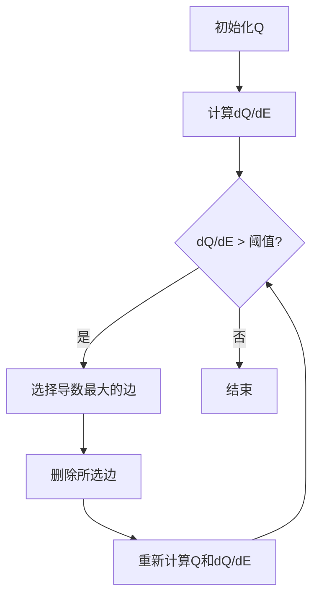

#### 标签传播算法

标签传播算法是一种基于节点相似性的社团结构识别算法。算法的基本思想是：初始时，每个节点都有一个标签，标签传播过程是通过比较节点标签的相似性，逐渐将节点划分为不同的社团。算法步骤如下：

1. 初始化每个节点的标签。
2. 对于每个节点，选择与其标签相似度最高的邻居节点作为新标签。
3. 重复步骤 2，直到标签不再发生变化。

算法原理可以用以下 Mermaid 流程图表示：

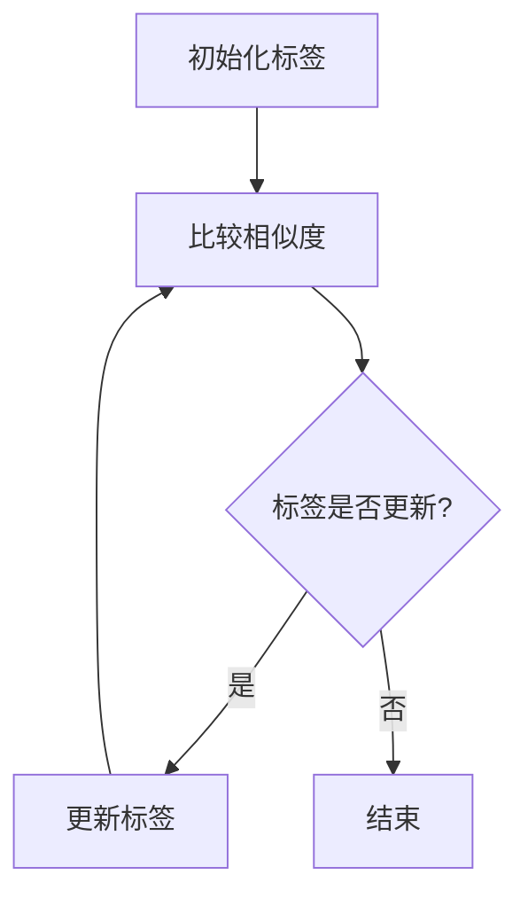

#### 结构平衡算法

结构平衡算法是一种基于网络结构的社团结构识别算法。算法的基本思想是：寻找网络中的平衡点，将平衡点划分为不同的社团。算法步骤如下：

1. 初始化平衡点集合。
2. 对于每个节点，计算其邻接矩阵的对角线元素之和。
3. 选择对角线元素之和最大的节点作为新的平衡点。
4. 删除所选节点及其邻接关系，重新计算对角线元素之和。
5. 重复步骤 2-4，直到达到最大迭代次数或平衡点集合不变。

算法原理可以用以下 Mermaid 流程图表示：

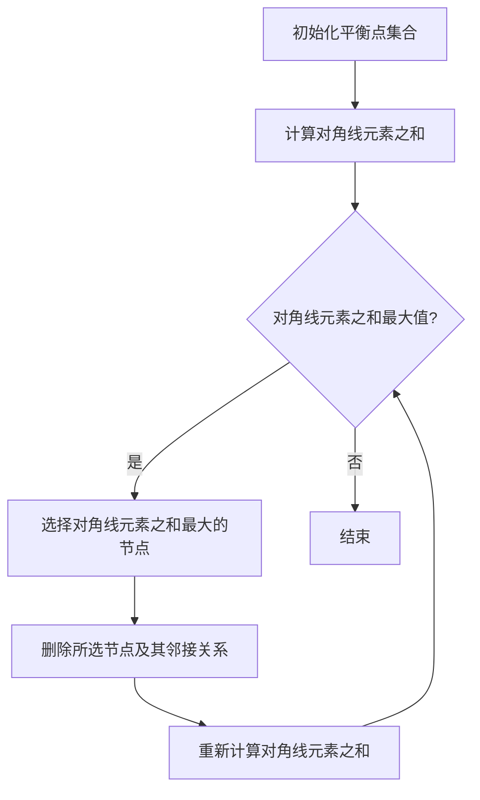

### 3.1.2 用户行为分析算法

用户行为分析算法用于分析社交网络中的用户行为，常用的算法有基于时间的序列分析算法和基于概率的用户行为分析算法。

#### 基于时间的序列分析算法

基于时间的序列分析算法通过分析用户行为的时间序列数据，提取用户行为模式。算法的基本思想是：将用户行为序列划分为不同的时段，分析不同时段的用户行为特征。算法步骤如下：

1. 初始化用户行为序列。
2. 划分用户行为序列为不同的时段。
3. 对于每个时段，计算用户行为的统计特征，如平均值、方差、标准差等。
4. 根据统计特征，分析用户行为模式。

算法原理可以用以下 Mermaid 流�程图表示：

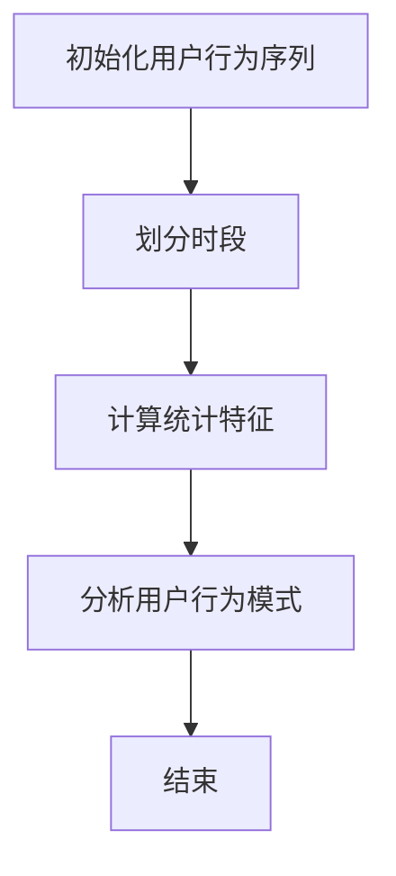

#### 基于概率的用户行为分析算法

基于概率的用户行为分析算法通过建立用户行为的概率模型，预测用户未来的行为。算法的基本思想是：根据历史行为数据，计算用户行为发生的概率，然后根据概率预测用户未来的行为。算法步骤如下：

1. 收集用户行为数据。
2. 构建用户行为的概率模型。
3. 根据概率模型，计算用户未来行为发生的概率。
4. 根据概率预测用户未来的行为。

算法原理可以用以下 Mermaid 流程图表示：

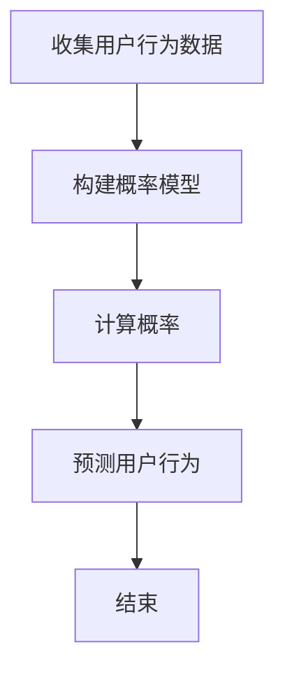

## 3.2 大数据算法在社交网络分析中的应用

大数据算法在社交网络分析中的应用主要包括数据预处理、聚类算法、关联规则挖掘、分类算法和预测算法等。

### 3.2.1 数据预处理算法

数据预处理算法主要包括数据清洗、数据整合和数据特征提取。

#### 数据清洗算法

数据清洗算法通过去除重复数据、填补缺失值和处理异常值，提高数据质量。常用的数据清洗算法有：

- **去除重复数据**：通过比较数据记录的键值，去除重复的数据记录。
  ```python
  def remove_duplicates(data):
      return list(set(data))
  ```

- **填补缺失值**：通过插值、均值、中位数等方法填补缺失值。
  ```python
  import numpy as np

  def fill_missing_values(data):
      data = np.array(data)
      missing_values = np.isnan(data)
      data[missing_values] = np.mean(data[~missing_values])
      return data
  ```

- **处理异常值**：通过统计方法或规则方法识别和处理异常值。
  ```python
  import numpy as np

  def handle_outliers(data, threshold):
      return data[(np.abs(stats.zscore(data)) < threshold)]
  ```

#### 数据整合算法

数据整合算法通过将来自不同来源的数据进行整合，形成一个统一的数据集。常用的数据整合算法有：

- **数据融合**：通过合并不同数据源的数据记录，形成一个统一的数据视图。
  ```python
  def data_fusion(data1, data2):
      return data1 + data2
  ```

- **数据集成**：通过整合不同数据源的数据结构，形成一个统一的数据结构。
  ```python
  def data_integration(data1, data2):
      return data1.extend(data2)
  ```

#### 数据特征提取算法

数据特征提取算法通过提取数据的基本统计量、纹理特征和频域特征，为数据挖掘和机器学习提供特征输入。常用的数据特征提取算法有：

- **统计特征提取**：通过计算数据的基本统计量，如均值、方差、标准差等，提取数据特征。
  ```python
  import numpy as np

  def extract_statistical_features(data):
      mean = np.mean(data)
      variance = np.var(data)
      std = np.std(data)
      return mean, variance, std
  ```

- **纹理特征提取**：通过分析数据的分布、趋势等，提取数据特征。
  ```python
  import numpy as np

  def extract_texture_features(data):
      min_value = np.min(data)
      max_value = np.max(data)
      range_value = max_value - min_value
      return min_value, max_value, range_value
  ```

- **频域特征提取**：通过傅里叶变换等，提取数据特征。
  ```python
  import numpy as np
  import scipy.signal as signal

  def extract_frequency_features(data):
      fft_data = np.fft.fft(data)
      freq_data = np.abs(fft_data)
      return freq_data
  ```

### 3.2.2 聚类算法

聚类算法在社交网络分析中用于发现数据中的紧密群体。常用的聚类算法有 K-Means 聚类、DBSCAN 聚类等。

#### K-Means 聚类算法

K-Means 聚类算法是一种基于距离的聚类算法。算法步骤如下：

1. 初始化聚类中心点。
2. 对于每个数据点，计算其与聚类中心点的距离。
3. 将数据点分配到距离最近的聚类中心点。
4. 重新计算聚类中心点。
5. 重复步骤 2-4，直到聚类中心点不再发生变化或达到最大迭代次数。

算法原理可以用以下 Mermaid 流程图表示：

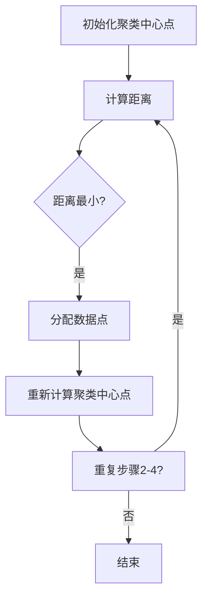

#### DBSCAN 聚类算法

DBSCAN（Density-Based Spatial Clustering of Applications with Noise）聚类算法是一种基于密度的聚类算法。算法步骤如下：

1. 初始化聚类核心点。
2. 对于每个核心点，扩展聚类区域。
3. 标记聚类区域。
4. 重复步骤 2-3，直到所有数据点被标记。

算法原理可以用以下 Mermaid 流程图表示：

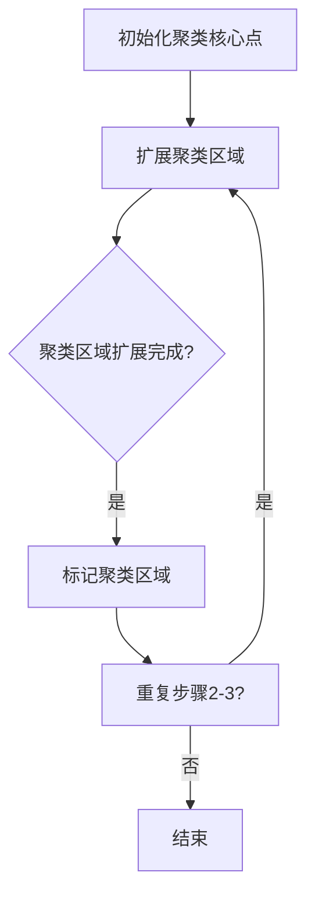

### 3.2.3 关联规则挖掘算法

关联规则挖掘算法在社交网络分析中用于发现数据之间的关联关系。常用的关联规则挖掘算法有 Apriori 算法、FP-Growth 算法等。

#### Apriori 算法

Apriori 算法是一种基于频繁项集的关联规则挖掘算法。算法步骤如下：

1. 扫描数据集，生成候选项集。
2. 计算候选项集的支持度。
3. 生成频繁项集。
4. 使用频繁项集生成关联规则。

算法原理可以用以下 Mermaid 流程图表示：

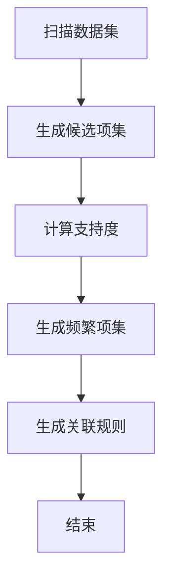

#### FP-Growth 算法

FP-Growth 算法是一种基于 FP 树的关联规则挖掘算法。算法步骤如下：

1. 构建 FP 树。
2. 计算频繁项集。
3. 使用频繁项集生成关联规则。

算法原理可以用以下 Mermaid 流程图表示：

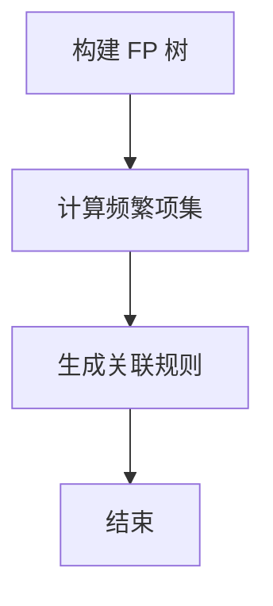

### 3.2.4 分类算法

分类算法在社交网络分析中用于将数据划分为不同的类别。常用的分类算法有决策树、随机森林、支持向量机等。

#### 决策树算法

决策树算法是一种基于树的分类算法。算法步骤如下：

1. 选择特征。
2. 计算特征值。
3. 划分数据集。
4. 递归构建决策树。

算法原理可以用以下 Mermaid 流程图表示：

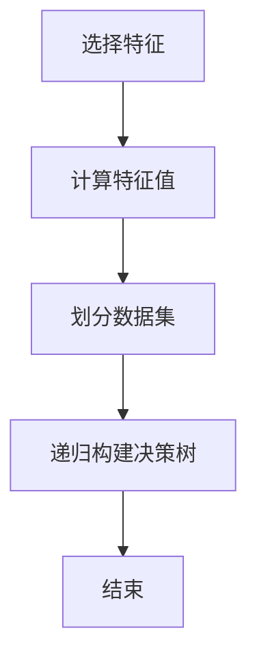

#### 随机森林算法

随机森林算法是一种基于决策树的集成学习算法。算法步骤如下：

1. 构建多棵决策树。
2. 对每棵决策树进行训练。
3. 集成决策树，生成最终分类结果。

算法原理可以用以下 Mermaid 流程图表示：

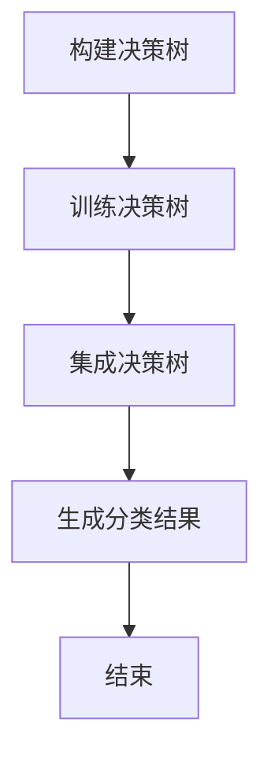

#### 支持向量机算法

支持向量机算法是一种基于超平面的分类算法。算法步骤如下：

1. 选择特征。
2. 计算特征值。
3. 训练支持向量机模型。
4. 预测分类结果。

算法原理可以用以下 Mermaid 流程图表示：

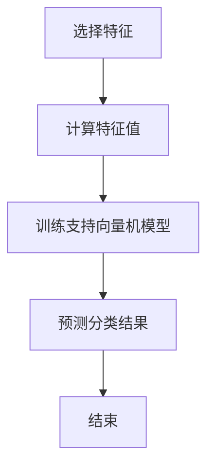

### 3.2.5 预测算法

预测算法在社交网络分析中用于预测未来的数据。常用的预测算法有时间序列预测、回归分析等。

#### 时间序列预测算法

时间序列预测算法是一种基于时间序列数据的预测算法。算法步骤如下：

1. 分析时间序列数据。
2. 选择预测模型。
3. 训练预测模型。
4. 预测未来数据。

算法原理可以用以下 Mermaid 流程图表示：

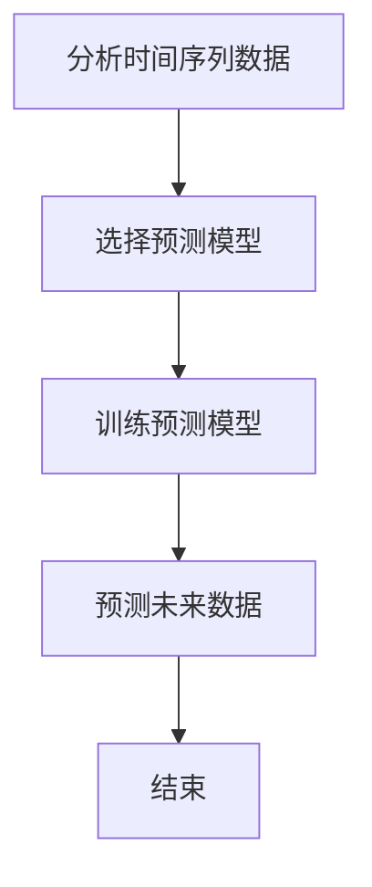

#### 回归分析算法

回归分析算法是一种基于自变量和因变量之间关系的预测算法。算法步骤如下：

1. 选择自变量。
2. 计算自变量值。
3. 选择回归模型。
4. 训练回归模型。
5. 预测因变量。

算法原理可以用以下 Mermaid 流程图表示：

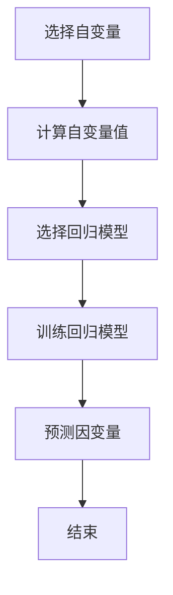

## 3.3 算法原理讲解与 Mermaid 流程图

在上述算法原理讲解中，我们已经详细介绍了社交网络分析算法、大数据算法在社交网络分析中的应用，以及数学模型和公式。为了更好地理解这些算法原理，我们可以使用 Mermaid 流程图来可视化算法的流程。

下面是一个使用 Mermaid 绘制的社交网络分析算法流程图：

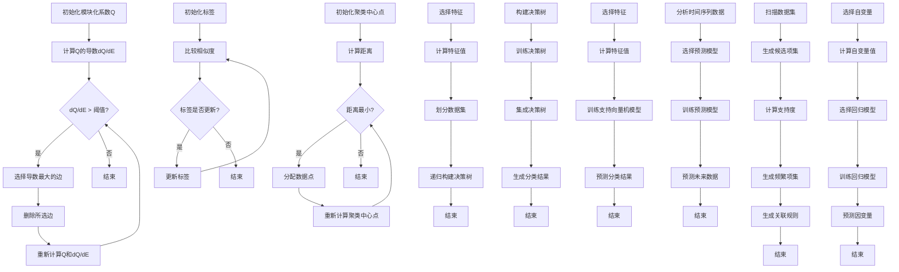

通过上述 Mermaid 流程图，我们可以清晰地看到各个算法的流程和步骤，有助于更好地理解算法原理。

**# 第四部分：数学模型和公式**

## 4.1 社交网络分析的数学模型

社交网络分析的数学模型主要包括社交网络结构模型和用户行为模型。

### 4.1.1 社交网络结构模型

社交网络结构模型用于描述社交网络中的节点和边的关系，常见的模型有拓扑结构模型和矩阵模型。

#### 拓扑结构模型

拓扑结构模型描述社交网络中节点的连接方式，可以用图来表示。图由节点（vertex）和边（edge）组成，节点表示社交网络中的个体，边表示个体之间的关系。

- **无向图**：无向图中的边没有方向，表示两个节点之间存在双向关系。

  $$ G = (V, E) $$

  其中，$V$ 为节点集合，$E$ 为边集合。

- **有向图**：有向图中的边有方向，表示从一个节点指向另一个节点。

  $$ D = (V, A) $$

  其中，$V$ 为节点集合，$A$ 为弧集合。

- **加权图**：加权图中的边具有权重，表示节点之间的距离或强度。

  $$ W = (V, E, \omega) $$

  其中，$V$ 为节点集合，$E$ 为边集合，$\omega$ 为权重函数。

#### 矩阵模型

矩阵模型用矩阵来表示社交网络中的节点和边的关系，常见的矩阵模型有邻接矩阵和拉普拉斯矩阵。

- **邻接矩阵**：邻接矩阵是一个对称的方阵，元素 $a_{ij}$ 表示节点 $i$ 和节点 $j$ 是否相连。

  $$ A = \begin{bmatrix}
  a_{11} & a_{12} & \ldots & a_{1n} \\
  a_{21} & a_{22} & \ldots & a_{2n} \\
  \vdots & \vdots & \ddots & \vdots \\
  a_{n1} & a_{n2} & \ldots & a_{nn}
  \end{bmatrix} $$

- **拉普拉斯矩阵**：拉普拉斯矩阵是邻接矩阵减去对角矩阵的结果，元素 $l_{ij}$ 表示节点 $i$ 的度数减去节点的自连接度数。

  $$ L = D - A $$

  其中，$D$ 为对角矩阵，元素 $d_{ii}$ 为节点 $i$ 的度数。

### 4.1.2 用户行为模型

用户行为模型用于描述社交网络中用户的行为，常见的模型有时间序列模型和概率模型。

#### 时间序列模型

时间序列模型用于描述用户行为的时序数据，常见的模型有 ARIMA 模型、LSTM 模型等。

- **ARIMA 模型**：ARIMA（AutoRegressive Integrated Moving Average）模型是一种自回归积分滑动平均模型，用于分析具有趋势和季节性的时间序列数据。

  $$ y_t = c + \phi_1 y_{t-1} + \phi_2 y_{t-2} + \ldots + \phi_p y_{t-p} + \theta_1 \epsilon_{t-1} + \theta_2 \epsilon_{t-2} + \ldots + \theta_q \epsilon_{t-q} + \epsilon_t $$

  其中，$y_t$ 为时间序列的当前值，$\epsilon_t$ 为白噪声序列，$p$ 和 $q$ 分别为自回归项和移动平均项的阶数。

- **LSTM 模型**：LSTM（Long Short-Term Memory）模型是一种递归神经网络，用于解决长短期依赖问题，可以有效地捕捉时间序列数据中的趋势和周期性。

  $$ h_t = \sigma(W_h \cdot [h_{t-1}, x_t] + b_h) $$
  $$ i_t = \sigma(W_i \cdot [h_{t-1}, x_t] + b_i) $$
  $$ f_t = \sigma(W_f \cdot [h_{t-1}, x_t] + b_f) $$
  $$ o_t = \sigma(W_o \cdot [h_{t-1}, x_t] + b_o) $$
  $$ c_t = f_t \cdot c_{t-1} + i_t \cdot \sigma(W_c \cdot [h_{t-1}, x_t] + b_c) $$
  $$ h_t = o_t \cdot \sigma(W_h' \cdot c_t + b_h') $$

  其中，$h_t$ 为时间步 $t$ 的隐藏状态，$x_t$ 为时间步 $t$ 的输入，$c_t$ 为细胞状态，$i_t$、$f_t$、$o_t$ 分别为输入门、遗忘门和输出门。

#### 概率模型

概率模型用于描述用户行为的概率分布，常见的模型有马尔可夫模型、贝叶斯网络等。

- **马尔可夫模型**：马尔可夫模型是一种基于状态转移概率的模型，用于描述用户行为的短期依赖性。

  $$ P(x_t | x_{t-1}, x_{t-2}, \ldots) = P(x_t | x_{t-1}) $$

  其中，$x_t$ 为时间步 $t$ 的状态。

- **贝叶斯网络**：贝叶斯网络是一种基于条件概率的模型，用于描述用户行为的多变量依赖关系。

  $$ P(x_1, x_2, \ldots, x_n) = \prod_{i=1}^{n} P(x_i | x_{i-1}, x_{i-2}, \ldots) $$

  其中，$x_1, x_2, \ldots, x_n$ 分别为时间步 $1, 2, \ldots, n$ 的状态。

## 4.2 数据挖掘与机器学习的数学模型

数据挖掘与机器学习的数学模型主要包括聚类算法的数学模型、关联规则挖掘的数学模型、分类算法的数学模型和预测算法的数学模型。

### 4.2.1 聚类算法的数学模型

聚类算法的数学模型用于描述如何将数据划分为不同的类别。常见的聚类算法有 K-Means 聚类算法和 DBSCAN 聚类算法。

#### K-Means 聚类算法

K-Means 聚类算法是一种基于距离的聚类算法，其数学模型如下：

1. **初始化聚类中心点**：

   $$ \mu_i = \frac{1}{N} \sum_{x \in S_i} x $$

   其中，$\mu_i$ 为聚类中心点，$S_i$ 为第 $i$ 个聚类，$N$ 为聚类中的数据点数量。

2. **计算距离**：

   $$ d(x, \mu_i) = \sqrt{\sum_{j=1}^{d} (x_j - \mu_{ij})^2} $$

   其中，$x$ 为数据点，$\mu_{ij}$ 为聚类中心点的第 $j$ 个特征值，$d$ 为特征维度。

3. **分配数据点**：

   $$ x_{ij} = \arg\min_{k} d(x, \mu_k) $$

   其中，$x_{ij}$ 为数据点 $x$ 分配到的聚类，$k$ 为聚类索引。

4. **重新计算聚类中心点**：

   $$ \mu_i = \frac{1}{N} \sum_{x \in S_i} x $$

   其中，$N$ 为聚类中的数据点数量。

#### DBSCAN 聚类算法

DBSCAN（Density-Based Spatial Clustering of Applications with Noise）聚类算法是一种基于密度的聚类算法，其数学模型如下：

1. **定义邻域**：

   $$ N(x, \epsilon) = \{y \in V | d(x, y) < \epsilon\} $$

   其中，$N(x, \epsilon)$ 为以 $x$ 为中心，半径为 $\epsilon$ 的邻域，$V$ 为节点集合，$d(x, y)$ 为节点 $x$ 和节点 $y$ 之间的距离。

2. **定义核心点**：

   $$ x \in \text{Core-Point} \Leftrightarrow |N(x, \epsilon)| > \minPts $$

   其中，$\minPts$ 为最小核心点邻居数量。

3. **定义边界点**：

   $$ x \in \text{Border-Point} \Leftrightarrow |N(x, \epsilon)| \geq \minPts \text{ and } x \not\in \text{Core-Point} $$

4. **定义噪声点**：

   $$ x \in \text{Noise} \Leftrightarrow x \not\in \text{Core-Point} $$

5. **聚类划分**：

   - 对于每个核心点 $x$，递归扩展生成聚类。
   - 对于边界点和噪声点，不参与聚类。

### 4.2.2 关联规则挖掘的数学模型

关联规则挖掘的数学模型用于描述如何从数据中挖掘出频繁项集和关联规则。常见的算法有 Apriori 算法和 FP-Growth 算法。

#### Apriori 算法

Apriori 算法是一种基于频繁项集的关联规则挖掘算法，其数学模型如下：

1. **定义支持度**：

   $$ \text{Support}(X) = \frac{n(X)}{n(D)} $$

   其中，$X$ 为项集，$n(X)$ 为项集 $X$ 在数据集 $D$ 中的出现次数，$n(D)$ 为数据集 $D$ 中的记录数量。

2. **定义置信度**：

   $$ \text{Confidence}(X \rightarrow Y) = \frac{n(X \cup Y)}{n(X)} $$

   其中，$X$ 和 $Y$ 为项集，$n(X \cup Y)$ 为项集 $X \cup Y$ 在数据集 $D$ 中的出现次数，$n(X)$ 为项集 $X$ 在数据集 $D$ 中的出现次数。

3. **生成频繁项集**：

   - 递归地生成所有长度为 $k$ 的项集。
   - 对于每个项集，计算支持度，如果支持度大于最小支持度阈值，则该项集为频繁项集。

#### FP-Growth 算法

FP-Growth 算法是一种基于 FP 树的关联规则挖掘算法，其数学模型如下：

1. **构建 FP 树**：

   - 将数据集转换为 FP 树，其中每个节点表示一个项集，节点之间的边表示项集之间的顺序。

2. **生成频繁项集**：

   - 从 FP 树中递归地提取频繁项集。

### 4.2.3 分类算法的数学模型

分类算法的数学模型用于描述如何将数据划分为不同的类别。常见的分类算法有决策树、随机森林和支持向量机。

#### 决策树算法

决策树算法是一种基于特征划分的分类算法，其数学模型如下：

1. **特征选择**：

   - 计算特征的信息增益或基尼指数，选择信息增益最大或基尼指数最小的特征作为分割特征。

2. **特征划分**：

   - 根据分割特征将数据集划分为若干个子集。

3. **递归构建决策树**：

   - 对于每个子集，重复步骤 1 和步骤 2，直到满足终止条件（如最大深度、纯度等）。

#### 随机森林算法

随机森林算法是一种基于决策树的集成学习算法，其数学模型如下：

1. **构建多棵决策树**：

   - 随机选择特征子集，递归构建决策树。

2. **集成决策树**：

   - 对每棵决策树进行训练和预测，取多数表决结果作为最终预测结果。

#### 支持向量机算法

支持向量机算法是一种基于超平面的分类算法，其数学模型如下：

1. **选择特征**：

   - 选择特征子集，进行特征提取。

2. **训练模型**：

   - 求解最优超平面，得到决策函数。

3. **预测类别**：

   - 对于新的数据点，计算其到超平面的距离，根据距离确定类别。

### 4.2.4 预测算法的数学模型

预测算法的数学模型用于描述如何预测未来的数据。常见

