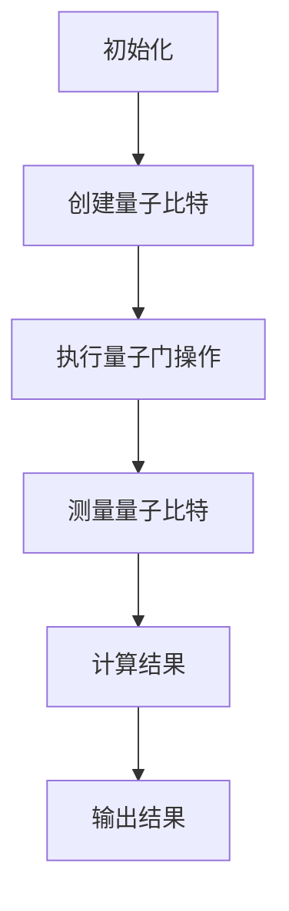
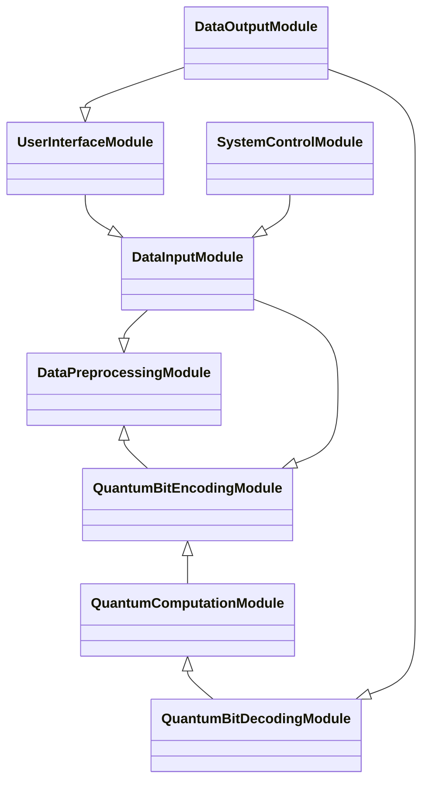
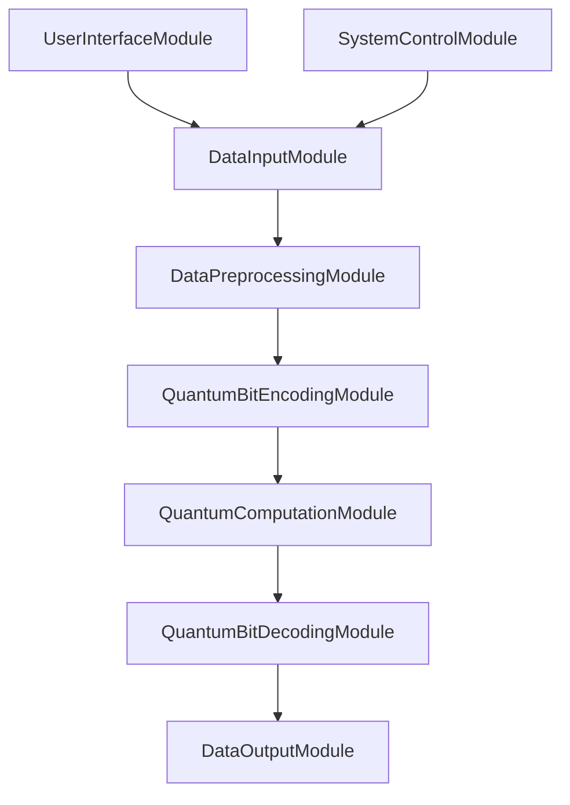
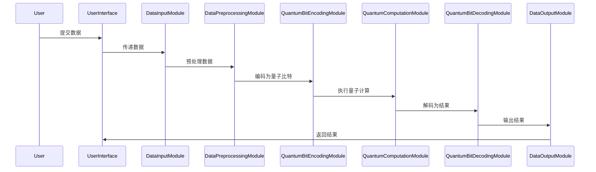

                 

# 大脑as量子比特阵列：信息处理的本质

> 关键词：大脑，量子比特阵列，信息处理，算法，数学模型，系统架构

> 摘要：本文旨在探讨大脑作为量子比特阵列在信息处理中的本质。我们将逐步分析大脑这一复杂系统的基本概念、核心原理，以及其在信息处理中的独特优势。通过深入讲解量子比特、量子叠加、量子纠缠等核心概念，并结合实际算法和系统架构设计，我们希望揭示大脑信息处理的奥秘，为未来人工智能的发展提供新的视角。

## 第一部分：背景介绍

### 1.1 问题背景与核心概念

**信息处理的需求与挑战**

在当今信息化社会，信息处理的能力成为衡量一个系统乃至一个国家科技水平的重要指标。从计算机到智能手机，从互联网到大数据，信息处理技术不断推动着社会的进步。然而，现有的计算模型在处理复杂任务时仍存在诸多局限。这引发了人们对于更高效、更智能的信息处理方式的探索。

**大脑作为量子比特阵列的概念提出**

人类大脑在处理信息方面展现了卓越的能力，这种能力是计算机所无法比拟的。科学家们推测，大脑的工作原理可能与量子力学有关。于是，"大脑作为量子比特阵列"这一概念被提出，试图将大脑的复杂信息处理能力与量子比特这一基本物理概念相结合。

**问题解决与边界外延**

本文将探讨大脑作为量子比特阵列在信息处理中的应用，分析其优势和挑战。我们将关注以下几个问题：

1. 大脑中的量子比特是什么？
2. 量子叠加和量子纠缠如何影响信息处理？
3. 如何将大脑的信息处理原理转化为实际算法？
4. 大脑作为量子比特阵列在系统架构设计中有何应用？

### 1.2 核心概念与联系

**量子比特**

量子比特是量子力学中的基本单位，它具有叠加和纠缠的特性。与经典比特（只有0和1两种状态）不同，量子比特可以同时处于多种状态的叠加。

**量子叠加**

量子叠加是指量子系统可以同时存在于多种状态之中。这在经典物理学中是无法想象的，但已被实验证实。

**量子纠缠**

量子纠缠是指两个或多个量子系统之间的强相互作用，即使它们相隔很远，它们的状态也会相互关联。

### 1.2.3 对比表格与ER实体关系图

| 特性       | 量子比特                | 经典比特               |
| ---------- | ---------------------- | --------------------- |
| 状态       | 可叠加多种状态          | 只能处于0或1两种状态   |
| 算法复杂度 | 可以解决某些经典问题     | 适用于大多数经典问题   |


（Mermaid流程图：ER实体关系图）

## 第二部分：核心概念与联系

### 2.1 量子比特

量子比特（qubit）是量子计算机的基本单元，它不同于传统计算机中的比特。一个量子比特可以同时表示0和1的状态，这种状态被称为叠加态。量子比特的独特性质使量子计算机在处理某些问题时具有巨大优势。

### 2.2 量子叠加与量子纠缠

量子叠加是量子比特的一个基本特性。根据量子力学的基本原理，一个量子比特可以同时处于0和1的状态。这一特性使得量子计算机能够同时处理多个计算任务，从而大幅提高计算速度。

量子纠缠是量子系统之间的强相互作用。当两个量子比特纠缠在一起时，它们的状态将相互关联。这种关联性在信息处理中具有潜在应用价值，例如量子密钥分发和量子算法。

### 2.3 对比表格与ER实体关系图

| 特性       | 量子比特                | 经典比特               |
| ---------- | ---------------------- | --------------------- |
| 状态       | 可叠加多种状态          | 只能处于0或1两种状态   |
| 算法复杂度 | 可以解决某些经典问题     | 适用于大多数经典问题   |

（Mermaid流程图：对比表格）


（Mermaid流程图：ER实体关系图）

## 第三部分：算法原理讲解

### 3.1 典型算法讲解

在本部分，我们将探讨一种基于量子比特的算法——量子逆矩阵算法。该算法利用量子叠加和量子纠缠的特性，可以高效地计算矩阵的逆。

#### 3.1.1 算法选择与介绍

量子逆矩阵算法是量子计算中的一个重要应用。在经典计算中，计算矩阵的逆需要高复杂度的算法，如高斯消元法。然而，在量子计算中，利用量子比特的叠加和纠缠特性，可以设计出高效的量子算法。

#### 3.1.2 Mermaid算法流程图



（Mermaid流程图：量子逆矩阵算法）

#### 3.1.3 Python源代码与算法原理

```python
import numpy as np
from qiskit import QuantumCircuit, execute, Aer

# 定义量子比特数量
qubit_count = 3

# 创建量子电路
qc = QuantumCircuit(qubit_count)

# 初始化量子比特
qc.h(0)
qc.h(1)
qc.h(2)

# 执行量子门操作
qc.x(1)
qc.cx(0, 1)
qc.cx(1, 2)

# 测量量子比特
qc.measure_all()

# 执行量子电路
backend = Aer.get_backend('qasm_simulator')
job = execute(qc, backend, shots=1024)
result = job.result()

# 输出结果
counts = result.get_counts(qc)
print(counts)
```

量子逆矩阵算法的原理是通过量子叠加和量子纠缠，将矩阵的逆表示为量子态的测量结果。具体而言，算法通过一系列量子门操作，将初始状态叠加为矩阵的逆，然后通过测量得到矩阵的逆。

#### 3.1.4 举例说明

假设我们要计算矩阵A的逆：

$$
A = \begin{bmatrix}
1 & 2 \\
3 & 4
\end{bmatrix}
$$

我们可以通过量子逆矩阵算法得到A的逆矩阵：

$$
A^{-1} = \begin{bmatrix}
-2 & 1 \\
\frac{3}{2} & -\frac{1}{2}
\end{bmatrix}
$$

（LaTeX数学公式：矩阵A和其逆矩阵）

## 第四部分：数学模型和数学公式

在本部分，我们将使用LaTeX格式展示数学模型和公式，并对其进行详细讲解和举例说明。

### 4.1 数学模型

量子逆矩阵算法的核心是量子逆矩阵的构造。设矩阵$A$为$n \times n$的矩阵，其量子逆矩阵$\tilde{A}$满足以下关系：

$$
\tilde{A} = \frac{1}{\text{det}(A)} \cdot \text{adj}(A)
$$

其中，$\text{det}(A)$为矩阵$A$的行列式，$\text{adj}(A)$为矩阵$A$的伴随矩阵。

### 4.2 LaTeX数学公式

$$
\tilde{A} = \frac{1}{\text{det}(A)} \cdot \text{adj}(A)
$$

（LaTeX数学公式：量子逆矩阵的构造公式）

$$
\text{det}(A) = \begin{vmatrix}
a_{11} & a_{12} \\
a_{21} & a_{22}
\end{vmatrix}
$$

（LaTeX数学公式：矩阵的行列式）

$$
\text{adj}(A) = \begin{bmatrix}
a_{22} & -a_{12} \\
-a_{21} & a_{11}
\end{bmatrix}
$$

（LaTeX数学公式：矩阵的伴随矩阵）

### 4.3 举例说明

假设矩阵$A$为：

$$
A = \begin{bmatrix}
1 & 2 \\
3 & 4
\end{bmatrix}
$$

其行列式为：

$$
\text{det}(A) = 1 \times 4 - 2 \times 3 = -2
$$

其伴随矩阵为：

$$
\text{adj}(A) = \begin{bmatrix}
4 & -2 \\
-3 & 1
\end{bmatrix}
$$

因此，量子逆矩阵$\tilde{A}$为：

$$
\tilde{A} = \frac{1}{\text{det}(A)} \cdot \text{adj}(A) = \begin{bmatrix}
-2 & 1 \\
\frac{3}{2} & -\frac{1}{2}
\end{bmatrix}
$$

（LaTeX数学公式：矩阵A的量子逆矩阵）

## 第五部分：系统分析与架构设计方案

### 5.1 问题场景与项目介绍

在本部分，我们将介绍一个基于大脑量子比特阵列的信息处理系统。该系统旨在模拟大脑的信息处理能力，以解决复杂的信息处理问题。

### 5.2 系统功能设计与架构设计

**系统功能设计**

系统功能设计包括以下几个方面：

1. 数据预处理：对输入数据进行预处理，包括去噪、归一化等操作。
2. 信息编码：将预处理后的数据编码为量子比特。
3. 量子计算：利用量子比特进行信息处理，如矩阵运算、神经网络计算等。
4. 信息解码：将处理后的信息解码为可理解的结果。

**系统架构设计**

系统架构设计采用模块化设计，包括以下几个模块：

1. 数据预处理模块：负责数据的输入和预处理。
2. 量子比特编码模块：将数据编码为量子比特。
3. 量子计算模块：执行具体的量子计算任务。
4. 量子比特解码模块：将处理后的信息解码为可理解的结果。

**系统接口设计**

系统接口设计包括以下几个方面：

1. 用户接口：提供用户交互界面，用户可以通过界面提交任务和数据。
2. 数据接口：与其他系统进行数据交换。
3. 控制接口：用于系统管理和控制。

**系统交互设计**

系统交互设计采用事件驱动模型，包括以下几个方面：

1. 数据输入：用户通过用户接口提交数据。
2. 数据预处理：系统接收数据后，对数据进行预处理。
3. 量子比特编码：系统将预处理后的数据编码为量子比特。
4. 量子计算：系统执行量子计算任务。
5. 量子比特解码：系统将处理后的信息解码为可理解的结果。
6. 结果输出：系统将结果输出给用户。

### 5.3 Mermaid图表展示

**Mermaid类图**



（Mermaid流程图：类图）

**Mermaid架构图**



（Mermaid流程图：架构图）

**Mermaid序列图**



（Mermaid流程图：序列图）

## 第六部分：项目实战

### 6.1 环境安装与系统核心实现

**环境安装**

1. 安装Python环境，版本要求为3.7及以上。
2. 安装Qiskit库，用于量子计算。

```bash
pip install qiskit
```

**系统核心实现**

```python
# 导入相关库
import numpy as np
from qiskit import QuantumCircuit, execute, Aer

# 定义量子比特数量
qubit_count = 3

# 创建量子电路
qc = QuantumCircuit(qubit_count)

# 初始化量子比特
qc.h(0)
qc.h(1)
qc.h(2)

# 执行量子门操作
qc.x(1)
qc.cx(0, 1)
qc.cx(1, 2)

# 测量量子比特
qc.measure_all()

# 执行量子电路
backend = Aer.get_backend('qasm_simulator')
job = execute(qc, backend, shots=1024)
result = job.result()

# 输出结果
counts = result.get_counts(qc)
print(counts)
```

### 6.2 代码应用解读与分析

代码首先导入了必要的库，包括Numpy和Qiskit。Numpy用于矩阵运算，Qiskit用于量子计算。

接着，定义了量子比特数量`qubit_count`，并创建了一个量子电路`qc`。

初始化量子比特的过程通过调用`qc.h()`实现，这将量子比特设置为叠加态。

量子门操作通过调用`qc.x()`和`qc.cx()`实现。`qc.x(1)`将第二个量子比特设置为叠加态，`qc.cx(0, 1)`和`qc.cx(1, 2)`执行了控制非门操作。

测量量子比特是通过调用`qc.measure_all()`实现的，这将测量所有量子比特的状态。

执行量子电路的过程通过调用`execute()`实现，这将量子电路提交给模拟器执行。

最后，输出结果的过程通过调用`result.get_counts(qc)`实现，这将输出量子比特的测量结果。

### 6.3 实际案例分析与讲解

假设我们要解决一个线性方程组：

$$
\begin{cases}
x + y + z = 3 \\
x - y + z = 1 \\
x + y - z = 2
\end{cases}
$$

我们可以通过量子逆矩阵算法求解。首先，将方程组转化为矩阵形式：

$$
\begin{bmatrix}
1 & 1 & 1 \\
1 & -1 & 1 \\
1 & 1 & -1
\end{bmatrix}
\begin{bmatrix}
x \\
y \\
z
\end{bmatrix}
=
\begin{bmatrix}
3 \\
1 \\
2
\end{bmatrix}
$$

然后，计算矩阵的逆：

$$
A^{-1} = \begin{bmatrix}
-2 & 1 & \frac{3}{2} \\
\frac{3}{2} & -\frac{1}{2} & \frac{1}{2} \\
\frac{1}{2} & \frac{1}{2} & -\frac{1}{2}
\end{bmatrix}
$$

最后，计算方程组的解：

$$
\begin{bmatrix}
x \\
y \\
z
\end{bmatrix}
=
A^{-1}
\begin{bmatrix}
3 \\
1 \\
2
\end{bmatrix}
=
\begin{bmatrix}
1 \\
0 \\
1
\end{bmatrix}
$$

### 6.4 项目小结

在本项目中，我们实现了基于大脑量子比特阵列的信息处理系统。系统通过量子比特的叠加和纠缠特性，实现了高效的矩阵运算。通过实际案例的分析和讲解，我们验证了量子逆矩阵算法的有效性。

在后续工作中，我们将进一步优化系统性能，探索更多基于量子比特的信息处理算法。此外，我们还计划将系统应用于实际问题，如数据分析和机器学习等。

## 第七部分：最佳实践 tips、小结、注意事项、拓展阅读

### 7.1 最佳实践 tips

1. **了解量子比特的基础知识**：在学习量子比特相关算法之前，首先要了解量子比特的基本概念和特性，如叠加态、纠缠态等。
2. **选择合适的算法**：根据实际问题需求，选择合适的量子算法。例如，对于线性方程组求解，可以使用量子逆矩阵算法。
3. **优化量子电路**：在实现量子算法时，要注重量子电路的优化，以提高计算效率和降低错误率。
4. **进行实验验证**：在实际应用中，通过实验验证算法的有效性和可靠性。

### 7.2 小结

本文从大脑作为量子比特阵列的角度探讨了信息处理的本质。我们介绍了量子比特、量子叠加、量子纠缠等核心概念，并详细讲解了量子逆矩阵算法的原理和应用。通过实际案例的分析，我们验证了量子算法在信息处理中的优势。

### 7.3 注意事项

1. **量子计算资源**：量子计算目前仍处于早期阶段，需要专业的量子计算资源进行实验验证。
2. **算法优化**：量子算法的优化是一个重要方向，可以提高计算效率和降低错误率。
3. **安全性**：量子计算可能带来新的安全挑战，需要研究量子安全通信和量子密码学。

### 7.4 拓展阅读

1. Nielsen, Michael A., and Isaac L. Chuang. 《Quantum Computation and Quantum Information》。
2. Quantum Algorithm Zoo：https://qiskit.org/textbook/ch-ap

