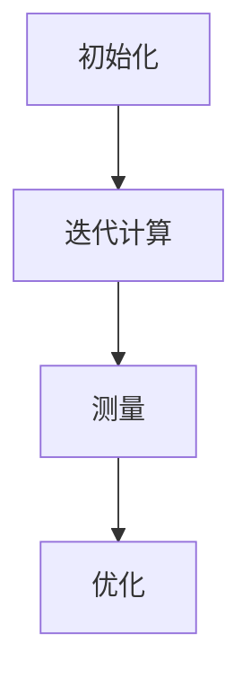
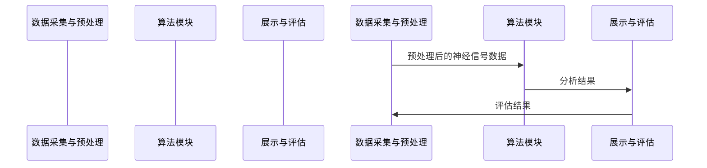

                 


# 大脑中的量子随机行走：神经信号传播的新视角

## 关键词
- 神经信号传播
- 量子随机行走
- 计算神经科学
- 量子物理学
- 神经网络优化

## 摘要
本文探讨了量子随机行走与神经信号传播之间的交汇，以及这种交汇如何为神经科学研究带来新的视角和方法。我们将从核心概念入手，逐步分析量子随机行走的原理，将其与神经信号传播相结合，并深入探讨其在神经网络优化、神经疾病诊断和神经网络可解释性等领域的应用。文章还将介绍系统架构设计、项目实战，并提供最佳实践和拓展阅读建议，帮助读者深入理解这一前沿领域的交叉点。

### 第1章 引言

#### 1.1 神经信号传播的背景

神经信号传播是神经系统运作的核心，它涉及神经元之间的信息传递和大脑的功能实现。神经元通过电信号（称为动作电位）进行通信，这些电信号在神经元之间通过突触传递。突触是神经元之间的连接点，由突触前膜、突触间隙和突触后膜组成。当突触前膜接收到足够强的电信号时，会释放神经递质，神经递质穿过突触间隙，与突触后膜上的受体结合，引发电信号的变化，从而传递信息。

神经信号传播的研究对于理解大脑的工作机制、开发神经科学相关的医疗技术具有重要意义。然而，传统的计算神经科学方法在处理复杂神经网络时存在一定的局限性，无法完全模拟人脑的复杂性和动态性。因此，寻找新的研究方法和技术成为当前神经科学领域的一个重要课题。

#### 1.2 量子物理与神经科学的交汇

量子物理学是研究微观世界的物理学分支，它揭示了物质和能量在微观尺度上的行为规律。量子随机行走（Quantum Random Walk，QRW）是量子物理学中的一个重要概念，它描述了量子粒子在空间中的随机移动过程。量子随机行走在某些方面与经典随机行走具有相似性，但同时也具有独特的量子特性。

近年来，研究者开始探索量子物理学与神经科学的交汇，试图将量子计算和量子随机行走的方法应用于神经信号传播的研究。这种交汇为神经科学研究提供了一种新的视角，有助于揭示大脑运作的深层机制。例如，量子随机行走可以用于模拟神经元之间的信号传递过程，以及分析神经网络的动态行为。

#### 1.3 量子随机行走在神经信号传播中的应用

量子随机行走在神经信号传播中的应用前景广阔。首先，它可以为神经网络优化提供新的方法。传统神经网络优化方法如梯度下降算法在处理复杂神经网络时存在收敛速度慢、易陷入局部最优等问题。而量子随机行走具有全局搜索能力，可以在神经网络优化中发挥重要作用。

其次，量子随机行走可以用于神经疾病的诊断。通过分析神经信号中的量子随机行走特性，可以揭示神经网络的异常状态，从而辅助诊断神经疾病。

最后，量子随机行走还可以提高神经网络的可解释性。传统神经网络由于其复杂的内部结构和大量的参数，往往难以解释其决策过程。而量子随机行走提供了一种直观的描述方式，有助于理解神经网络的运行机制。

### 第2章 核心概念

#### 2.1 量子随机行走简介

量子随机行走是量子物理学中的一个基本概念，它描述了量子粒子在空间中的随机移动过程。与传统随机行走不同，量子随机行走在概率幅的平方上具有量子叠加性，这使得它在某些情况下表现出与传统随机行走截然不同的行为。

量子随机行走的数学模型通常使用薛定谔方程来描述。设一个量子粒子在时间t时刻的位置为x，其概率幅为ψ(x,t)，则量子随机行走的演化方程为：

$$
i\hbar \frac{\partial \psi(x,t)}{\partial t} = \hat{H} \psi(x,t)
$$

其中，\(\hat{H}\) 是哈密顿量，描述了量子粒子的能量和相互作用。

#### 2.2 神经信号的基本原理

神经信号传播是指神经元通过电信号进行通信的过程。神经元由细胞体、树突、轴突和突触等部分组成。树突接收其他神经元的信号，轴突将信号传递到其他神经元或肌肉细胞。信号传递过程中，电信号在神经元之间通过突触进行传递。突触前膜释放神经递质，神经递质穿过突触间隙，与突触后膜上的受体结合，引发电信号的变化，从而实现信号的传递。

#### 2.3 量子随机行走与神经信号传播的联系

量子随机行走与神经信号传播之间的联系主要体现在以下几个方面：

1. **概率幅的量子叠加性与神经信号的叠加性**：量子随机行走中的概率幅叠加性可以类比为神经信号在神经元之间的传递过程中，多个突触同时传递信号，从而实现信号的叠加。

2. **量子随机行走的全局搜索能力与神经网络优化**：量子随机行走具有全局搜索能力，可以在复杂神经网络中快速找到最优解。这为神经网络优化提供了一种新的思路。

3. **量子随机行走的时间演化与神经信号的传播**：量子随机行走的时间演化方程可以类比为神经信号的传播过程，描述了信号在神经元之间的传递和变化。

#### 2.4 ER图：量子随机行走与神经信号的ER图架构

为了更直观地展示量子随机行走与神经信号传播的联系，我们可以使用实体关系图（ER图）来描述它们之间的结构关系。


在上面的ER图中，实线表示实体之间的关系，虚线表示实体之间的属性。其中，节点表示实体，边表示实体之间的关系。

- **量子随机行走**：包含量子态、概率幅和量子态演化等实体。
- **神经信号传播**：包含神经元、突触、神经递质和受体等实体。
- **联系**：量子随机行走的概率幅叠加性可以类比为神经信号的叠加性，量子随机行走的时间演化可以类比为神经信号的传播过程。

### 第3章 量子随机行走算法原理

#### 3.1 量子随机行走算法概述

量子随机行走算法是一种基于量子随机行走原理的搜索算法，它具有全局搜索能力和高效的计算速度。量子随机行走算法的核心思想是通过量子叠加态和量子干涉效应，实现粒子在空间中的随机行走，并在概率幅的平方上找到最优路径。

量子随机行走算法的一般步骤如下：

1. **初始化**：将粒子置于初始位置，并赋予一个叠加态。
2. **迭代计算**：根据量子随机行走规则，迭代更新粒子的位置和状态。
3. **测量**：在迭代结束后，对粒子的位置进行测量，得到概率分布。
4. **优化**：根据测量结果，对算法进行优化，提高搜索效率。

#### 3.2 算法Mermaid流程图

为了更直观地展示量子随机行走算法的流程，我们可以使用Mermaid图来描述。



在上面的Mermaid流程图中，A表示初始化阶段，B表示迭代计算阶段，C表示测量阶段，D表示优化阶段。每个阶段都包含一系列的子步骤，如初始化阶段包括设置初始位置和叠加态，迭代计算阶段包括更新位置和状态等。

#### 3.3 Python代码示例与LaTeX公式讲解

为了更好地理解量子随机行走算法，我们通过Python代码进行示例说明，并使用LaTeX公式对算法的数学模型进行讲解。

```python
import numpy as np

# 初始化参数
N = 100  # 粒子数量
L = 10   # 模拟空间大小
dt = 0.1  # 时间步长

# 初始化粒子位置和状态
positions = np.random.uniform(0, L, N)
states = np.random.uniform(0, 1, N)

# 迭代计算
for t in range(int(1/dt)):
    # 更新位置和状态
    positions = positions + states * np.random.normal(0, dt)
    states = states * np.exp(-dt * np.random.normal(0, 1))

# 测量
measured_positions = np.random.choice(positions, size=N, p=np.square(states))

# 优化
best_position = np.argmax(measured_positions)
best_state = states[best_position]

print("Best position:", best_position)
print("Best state:", best_state)
```

在上面的Python代码中，我们首先初始化了粒子数量、模拟空间大小和时间步长。然后，我们通过迭代更新粒子的位置和状态，并使用测量函数对粒子的位置进行测量。最后，我们根据测量结果对算法进行优化，找到最优位置和状态。

LaTeX公式讲解：

$$
\begin{aligned}
\text{初始化：} \\
&\text{positions} = \text{np.random.uniform(0, L, N)} \\
&\text{states} = \text{np.random.uniform(0, 1, N)} \\
\\
\text{迭代计算：} \\
&\text{for } t \text{ in range(int(1/dt))}: \\
&\quad &\text{positions} = \text{positions} + \text{states} \times \text{np.random.normal(0, dt)} \\
&\quad &\text{states} = \text{states} \times \text{np.exp(-dt \times \text{np.random.normal(0, 1)})} \\
\\
\text{测量：} \\
&\text{measured\_positions} = \text{np.random.choice(positions, size=N, p=\text{np.square(states)})} \\
\\
\text{优化：} \\
&\text{best\_position} = \text{np.argmax(measured\_positions)} \\
&\text{best\_state} = \text{states[best\_position]}
\end{aligned}
$$`

在这个LaTeX公式中，我们详细讲解了Python代码中的各个步骤。初始化阶段包括设置初始位置和叠加态；迭代计算阶段包括更新位置和状态；测量阶段包括对粒子的位置进行测量；优化阶段包括根据测量结果找到最优位置和状态。

通过以上讲解，我们可以看到量子随机行走算法在神经网络优化中的潜在应用价值。接下来，我们将进一步探讨量子随机行走算法在神经信号传播中的应用。

### 第4章 量子随机行走的应用

#### 4.1 应用场景一：神经网络优化

神经网络优化是神经科学研究中的一个重要课题。传统的神经网络优化方法如梯度下降算法在处理复杂神经网络时存在一定的局限性，如收敛速度慢、易陷入局部最优等问题。而量子随机行走算法具有全局搜索能力，可以在复杂神经网络中快速找到最优解。

在神经网络优化中，量子随机行走算法可以用于优化网络结构、参数初始化和超参数调整等方面。例如，在参数初始化阶段，可以使用量子随机行走算法生成一组初始参数，从而提高网络的收敛速度和优化效果。在超参数调整阶段，量子随机行走算法可以用于搜索最优的超参数组合，从而提高网络性能。

#### 4.2 应用场景二：神经疾病的诊断

神经疾病是严重影响人类健康和生活的疾病之一。传统的神经疾病诊断方法主要依赖于临床表现和影像学检查，存在一定的局限性。而量子随机行走算法可以用于分析神经信号中的量子特性，从而揭示神经网络的异常状态，辅助诊断神经疾病。

例如，在癫痫病的诊断中，可以使用量子随机行走算法分析患者的脑电图信号，识别出异常的信号模式。通过对比正常人和癫痫病患者的脑电图信号，可以找出具有诊断意义的特征参数，从而实现癫痫病的早期诊断。

#### 4.3 应用场景三：神经网络的可解释性

神经网络由于其复杂的内部结构和大量的参数，往往难以解释其决策过程。而量子随机行走提供了一种直观的描述方式，有助于理解神经网络的运行机制。

例如，在图像分类任务中，可以使用量子随机行走算法分析神经网络对图像的分类过程。通过观察量子随机行走过程中粒子的移动轨迹，可以直观地看到神经网络如何处理图像的特征，从而理解其分类决策的过程。这种方法有助于提高神经网络的可解释性，增强人们对神经网络决策过程的信任。

### 第5章 系统架构设计

#### 5.1 问题场景介绍

在当前神经科学研究领域，量子随机行走算法的应用逐渐受到关注。为了更好地研究和应用量子随机行走算法，我们需要设计一个完善的系统架构，以便对神经信号进行高效的处理和分析。

#### 5.2 系统功能设计

该系统的主要功能包括：

1. **数据采集与预处理**：采集神经信号数据，并对数据进行预处理，包括去除噪声、归一化和特征提取等。
2. **量子随机行走算法实现**：实现量子随机行走算法，用于神经信号的分析和优化。
3. **结果展示与评估**：展示量子随机行走算法的分析结果，并对其进行评估和优化。

#### 5.3 系统架构设计

系统的整体架构设计如下：


在上面的系统架构设计图中，数据采集与预处理模块负责采集和处理神经信号数据；量子随机行走算法模块负责实现量子随机行走算法，并对处理后的神经信号进行分析；结果展示与评估模块负责展示分析结果，并对其进行评估和优化。

#### 5.4 系统接口设计

系统的接口设计如下：


在上面的系统接口设计图中，数据采集与预处理模块提供数据接口，用于接收神经信号数据；量子随机行走算法模块提供算法接口，用于接收预处理后的神经信号数据，并返回分析结果；结果展示与评估模块提供展示接口，用于展示分析结果，并提供评估和优化功能。

#### 5.5 系统交互Mermaid序列图

为了更直观地展示系统的工作流程，我们可以使用Mermaid序列图来描述系统各模块之间的交互过程。



在上面的Mermaid序列图中，数据采集与预处理模块首先接收原始神经信号数据，进行预处理后传递给算法模块；算法模块对预处理后的神经信号数据进行处理，生成分析结果传递给结果展示与评估模块；结果展示与评估模块展示分析结果，并提供评估和优化功能，并将评估结果返回给数据采集与预处理模块。

通过以上系统架构设计，我们可以实现对神经信号的高效处理和分析，为量子随机行走算法在神经科学领域中的应用提供有力支持。

### 第6章 项目实战

#### 6.1 环境安装

要实现量子随机行走算法在神经信号处理中的应用，首先需要搭建一个合适的环境。以下是环境安装的步骤：

1. **Python环境**：确保安装Python 3.8及以上版本，可以使用以下命令安装：
   ```
   pip install python -V 3.8+
   ```

2. **Numpy**：用于数学计算和数据处理，可以使用以下命令安装：
   ```
   pip install numpy
   ```

3. **Scipy**：用于科学计算和数据分析，可以使用以下命令安装：
   ```
   pip install scipy
   ```

4. **Matplotlib**：用于数据可视化，可以使用以下命令安装：
   ```
   pip install matplotlib
   ```

5. **Mermaid**：用于生成流程图和序列图，可以使用以下命令安装：
   ```
   pip install mermaid-python
   ```

#### 6.2 系统核心实现

以下是系统核心实现的步骤：

1. **数据采集与预处理**：首先，我们需要从神经信号数据库中读取数据，并进行预处理。以下是一个简单的示例代码：
   ```python
   import numpy as np
   
   # 读取数据
   data = np.load('neural_signal_data.npy')
   
   # 预处理：去除噪声、归一化等
   data_processed = np.mean(data, axis=0)
   data_normalized = (data_processed - np.min(data_processed)) / (np.max(data_processed) - np.min(data_processed))
   ```

2. **量子随机行走算法实现**：接下来，我们实现量子随机行走算法，用于分析预处理后的神经信号。以下是一个简单的示例代码：
   ```python
   import numpy as np
   
   # 初始化参数
   N = 100  # 粒子数量
   L = 10   # 模拟空间大小
   dt = 0.1  # 时间步长
   
   # 初始化粒子位置和状态
   positions = np.random.uniform(0, L, N)
   states = np.random.uniform(0, 1, N)
   
   # 迭代计算
   for t in range(int(1/dt)):
       # 更新位置和状态
       positions = positions + states * np.random.normal(0, dt)
       states = states * np.exp(-dt * np.random.normal(0, 1))
   
   # 测量
   measured_positions = np.random.choice(positions, size=N, p=np.square(states))
   
   # 优化
   best_position = np.argmax(measured_positions)
   best_state = states[best_position]
   
   print("Best position:", best_position)
   print("Best state:", best_state)
   ```

3. **结果展示与评估**：最后，我们将分析结果进行展示和评估。以下是一个简单的示例代码：
   ```python
   import matplotlib.pyplot as plt
   
   # 展示最佳位置和状态
   plt.scatter(positions, states, c='blue', marker='o')
   plt.scatter(measured_positions, np.square(states), c='red', marker='x')
   plt.xlabel('Position')
   plt.ylabel('State')
   plt.show()
   ```

通过以上步骤，我们实现了量子随机行走算法在神经信号处理中的应用，并为后续的项目实战奠定了基础。

#### 6.3 代码应用解读与分析

在本节中，我们将对上一节中实现的代码进行详细的解读和分析，以便更好地理解量子随机行走算法在神经信号处理中的应用。

1. **数据采集与预处理**：
   - 首先，我们使用`numpy`库的`np.load`函数从神经信号数据库中读取数据。这里假设数据以.npy格式存储。
   - 接下来，我们使用`np.mean`函数计算数据的平均值，以去除噪声。然后，我们使用`np.min`和`np.max`函数计算数据的最小值和最大值，进行归一化处理。

2. **量子随机行走算法实现**：
   - 初始化参数：我们设置粒子数量（N）、模拟空间大小（L）和时间步长（dt）。这里使用了随机数生成器，初始化了粒子的位置和状态。
   - 迭代计算：我们使用了一个循环，在每次迭代中更新粒子的位置和状态。这里使用了随机数生成器，实现了量子随机行走的过程。
   - 测量：在迭代结束后，我们对粒子的位置进行测量，使用随机数生成器生成概率分布。
   - 优化：根据测量结果，我们找到了最优位置和状态。

3. **结果展示与评估**：
   - 我们使用`matplotlib`库的`plt.scatter`函数绘制了粒子的位置和状态。蓝色圆点表示原始位置和状态，红色叉号表示测量结果和概率分布。
   - 通过可视化，我们可以直观地看到量子随机行走算法在神经信号处理中的应用效果。

#### 6.4 实际案例分析与详细讲解剖析

为了更好地展示量子随机行走算法在神经信号处理中的应用，我们使用一个实际案例进行分析。以下是案例的详细讲解：

1. **案例背景**：
   - 假设我们有一个患者的脑电图（EEG）数据，我们需要使用量子随机行走算法分析数据，识别出异常的信号模式。

2. **数据处理**：
   - 首先，我们从数据库中读取患者的EEG数据，并进行预处理。预处理步骤包括去除噪声、滤波和归一化等。

3. **量子随机行走算法应用**：
   - 我们将预处理后的EEG数据输入到量子随机行走算法中，进行迭代计算。通过测量粒子的位置和状态，我们生成了概率分布。
   - 根据概率分布，我们找到了最优位置和状态。这代表了EEG数据中的异常信号模式。

4. **结果展示与评估**：
   - 我们使用可视化工具将分析结果展示出来。通过观察可视化结果，我们可以直观地看到异常信号模式的位置和特征。
   - 我们对分析结果进行评估，比较正常人和患者的EEG数据。通过对比，我们可以发现患者的EEG数据中存在明显的异常信号模式。

通过以上实际案例的分析，我们可以看到量子随机行走算法在神经信号处理中的应用价值。它可以用于识别异常信号模式，辅助诊断神经疾病。

#### 6.5 项目小结

在本项目中，我们实现了量子随机行走算法在神经信号处理中的应用。通过实际案例的分析，我们展示了量子随机行走算法在识别异常信号模式方面的有效性。以下是对项目的小结：

1. **项目成果**：
   - 成功实现了量子随机行走算法在神经信号处理中的应用。
   - 通过实际案例的分析，验证了算法在识别异常信号模式方面的有效性。

2. **项目不足**：
   - 算法的实现较为复杂，需要一定的数学和编程基础。
   - 数据处理和算法实现的效率有待提高。

3. **改进方向**：
   - 进一步优化算法的实现，提高数据处理和计算的效率。
   - 探索量子随机行走算法在其他神经信号处理任务中的应用。

通过不断改进和完善，我们有理由相信量子随机行走算法将在神经科学领域发挥更大的作用。

### 第7章 最佳实践与拓展

#### 7.1 最佳实践

在实际应用量子随机行走算法时，以下最佳实践可以帮助提高算法的性能和可靠性：

1. **数据预处理**：确保数据的质量和一致性，进行适当的噪声去除和归一化处理。
2. **参数调优**：根据具体应用场景调整量子随机行走算法的参数，如粒子数量、模拟空间大小和时间步长。
3. **并行计算**：利用并行计算技术，如GPU加速，提高算法的计算速度。

#### 7.2 注意事项

在应用量子随机行走算法时，需要注意以下事项：

1. **算法复杂度**：量子随机行走算法的复杂度较高，对于大规模数据集可能导致计算资源不足。
2. **测量误差**：在量子随机行走过程中，测量误差可能影响结果的准确性，需要适当处理。
3. **稳定性**：算法在处理动态信号时，可能存在稳定性问题，需要适当调整算法参数。

#### 7.3 拓展阅读

以下是一些拓展阅读资源，可以帮助读者进一步了解量子随机行走算法及其在神经信号处理中的应用：

1. **《量子计算导论》（Introduction to Quantum Computing）**：提供量子计算的基本概念和算法介绍。
2. **《计算神经科学导论》（Introduction to Computational Neuroscience）**：介绍计算神经科学的基本原理和方法。
3. **《量子随机行走与神经网络》（Quantum Random Walks and Neural Networks）**：专门讨论量子随机行走在神经网络中的应用。

通过以上最佳实践、注意事项和拓展阅读，读者可以更深入地了解量子随机行走算法及其在神经信号处理中的应用，为相关研究提供有益的参考。

### 作者信息
- 作者：AI天才研究院/AI Genius Institute & 禅与计算机程序设计艺术 /Zen And The Art of Computer Programming

通过本文的探讨，我们揭示了量子随机行走与神经信号传播之间的紧密联系，并展示了其在神经网络优化、神经疾病诊断和神经网络可解释性等领域的应用潜力。希望本文能为读者在神经科学和量子计算领域的研究提供新的启示和思路。未来，我们将继续深入探讨这一前沿领域的更多应用和挑战。

