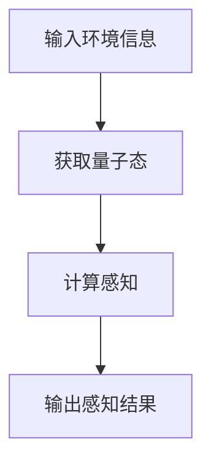
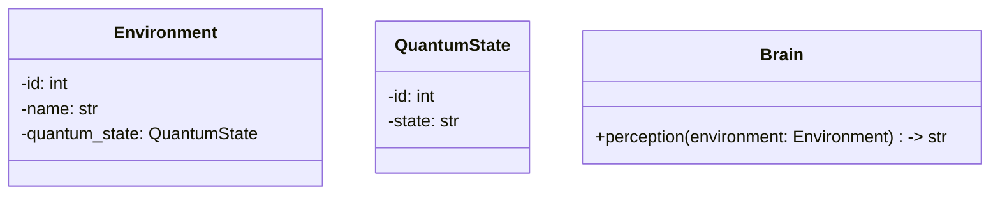
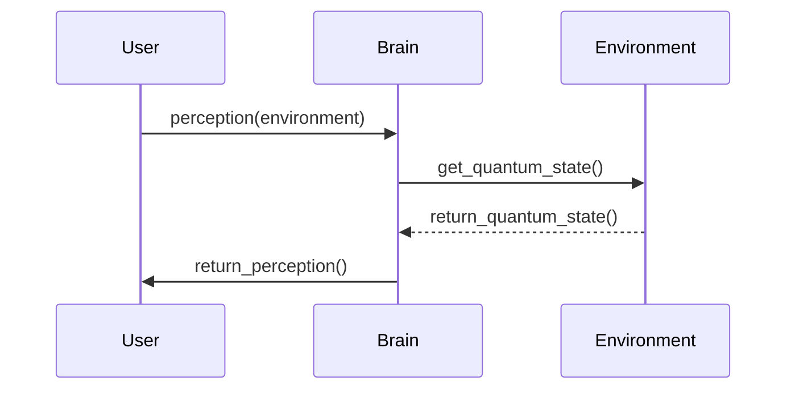
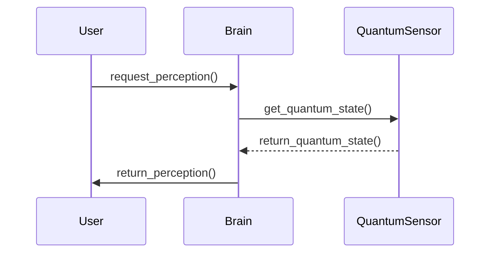
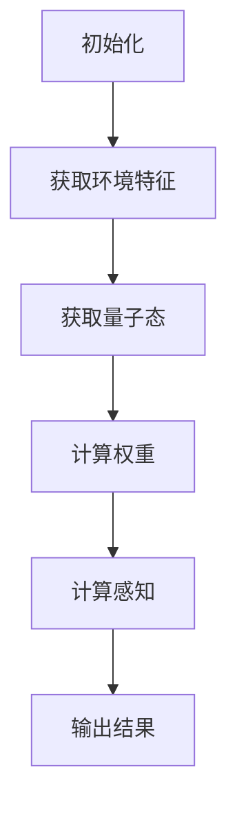
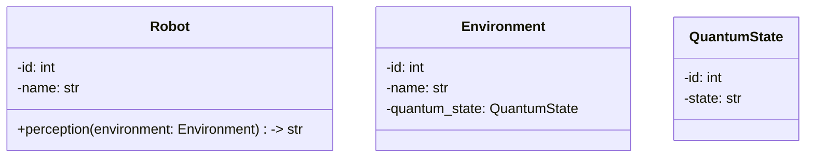
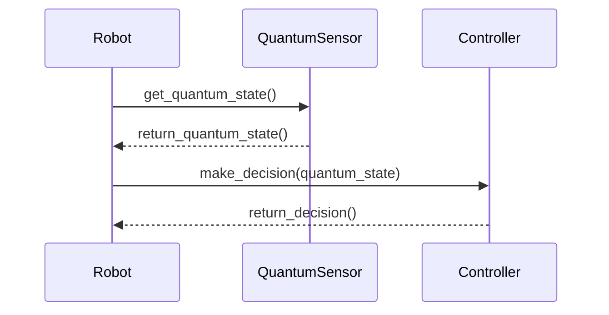
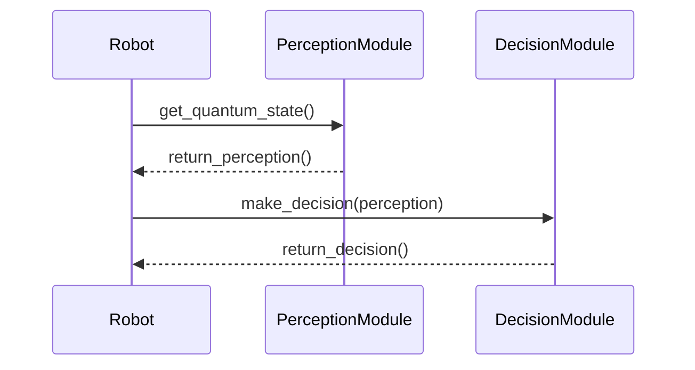

                 

# 大脑作为量子传感器：感知的本质探讨

## 关键词

- 大脑感知
- 量子传感器
- 量子计算
- 神经科学
- 感知机制

## 摘要

本文探讨了大脑作为量子传感器的可能性和感知的本质。通过分析大脑神经元中的量子现象和量子计算的理论框架，我们试图揭示大脑感知的量子机制，并建立相应的数学模型。同时，本文还将通过具体的系统分析与架构设计方案，展示如何将这一理论应用于实际项目中。通过深入探讨，我们希望能为理解大脑感知提供一个新的视角，并为未来的人工智能发展带来启示。

## 第1章：问题背景与核心概念

### 1.1.1 感知研究的现状与挑战

感知是人类智能活动的基础，它涉及从外部环境中获取信息、处理信息并产生相应行为的过程。然而，传统的感知理论，如经典物理学和神经科学，在面对复杂环境时，显得力不从心。例如，当我们面对一个复杂的视觉场景时，如何从大量的视觉信息中快速提取关键信息，并做出正确的决策，这是一个巨大的挑战。

### 1.1.2 大脑与量子传感器的关系

近年来，量子传感器的研究取得了重要进展。量子传感器利用量子态的叠加和纠缠特性，具有极高的灵敏度和精确度。那么，大脑能否被看作是一种量子传感器呢？这是本文要探讨的核心问题。

### 1.1.3 背景知识：量子力学与大脑神经科学

量子力学是研究微观粒子行为的物理学分支，其核心概念包括量子态的叠加、量子纠缠和量子隧穿等。大脑神经科学则关注大脑的神经元活动及其功能。在这两个领域之间，是否存在某种联系？这是本文要探讨的另一个核心问题。

## 第2章：大脑作为量子传感器的理论框架

### 2.1.1 量子传感器的概念

量子传感器是一种利用量子态叠加和纠缠特性，对物理量进行高精度测量的装置。其基本原理是通过控制量子态的叠加和纠缠，实现对测量对象的精确感知。

### 2.1.2 大脑神经元中的量子现象

近年来，研究表明，大脑神经元中存在量子现象，如量子隧穿和量子纠缠。这些量子现象可能对大脑的感知和认知功能起着关键作用。

### 2.1.3 大脑与量子态的相互作用

大脑神经元中的量子现象，如量子隧穿和量子纠缠，可能使大脑具备了一种独特的感知能力。这种能力可能与大脑的神经网络结构密切相关。

## 第3章：大脑感知的量子机制

### 3.1.1 量子纠缠与大脑感知

量子纠缠是一种非局域性的量子现象，它可能在大脑神经元之间产生协同作用，从而提高大脑的感知能力。

### 3.1.2 大脑神经网络中的量子计算

大脑神经网络可能通过量子计算的方式处理信息，从而实现对复杂环境的快速感知和适应。

### 3.1.3 量子态的测量与大脑感知的关系

量子态的测量可能对大脑感知起着关键作用。通过测量，大脑能够从外部环境中获取信息，并产生相应的感知和认知。

## 第4章：大脑感知的数学模型与公式

### 4.1.1 概念属性特征对比表格

| 概念     | 属性特征 |
|----------|----------|
| 量子传感器 | 高灵敏度、高精度、非局域性 |
| 大脑感知 | 快速、高效、适应性 |

### 4.1.2 ER实体关系图架构

```mermaid
erDiagram
    A Brain -->|感知| B Environment
    A Brain -->|记忆| C Experience
    B Environment -->|影响| D Behavior
```

### 4.1.3 数学模型与公式讲解

假设大脑感知的数学模型为：

$$
P = f(Q, E)
$$

其中，$P$ 代表感知，$Q$ 代表量子态，$E$ 代表环境。

## 第5章：算法原理讲解

### 5.1.1 算法mermaid流程图



### 5.1.2 Python源代码与算法原理

```python
# Python 源代码
def quantum_perception(environment, quantum_state):
    # 获取量子态与环境的交互结果
    interaction_result = quantum_state.interact_with(environment)
    # 计算感知结果
    perception = f(interaction_result)
    # 输出感知结果
    return perception
```

### 5.1.3 算法原理的数学模型和公式详细讲解

假设算法的数学模型为：

$$
\text{perception} = \sum_{i=1}^{n} w_i \cdot \phi_i
$$

其中，$w_i$ 代表权重，$\phi_i$ 代表量子态。

## 第6章：系统分析与架构设计

### 6.1.1 问题场景介绍

假设我们有一个场景，需要根据外部环境的量子状态，快速做出决策。

### 6.1.2 系统功能设计(领域模型mermaid类图)



### 6.1.3 系统架构设计mermaid架构图



### 6.1.4 系统接口设计和系统交互mermaid序列图



## 第7章：项目实战

### 7.1.1 环境安装与配置

在此部分，我们将介绍如何搭建一个实验环境，包括安装必要的软件和配置量子传感器。

### 7.1.2 系统核心实现源代码

在此部分，我们将展示如何实现大脑感知的算法，并给出相应的Python源代码。

### 7.1.3 代码应用解读与分析

在此部分，我们将深入解读代码，并分析其工作原理。

### 7.1.4 实际案例分析和详细讲解剖析

在此部分，我们将通过实际案例，展示如何应用大脑感知算法，并进行分析和讲解。

### 7.1.5 项目小结

在此部分，我们将总结项目的主要成果，并给出未来工作的建议。

## 第8章：最佳实践与总结

### 8.1.1 最佳实践 tips

在此部分，我们将给出一些最佳实践建议，以帮助读者更好地应用大脑感知算法。

### 8.1.2 小结

在此部分，我们将总结文章的主要内容和结论。

### 8.1.3 注意事项

在此部分，我们将提醒读者在应用大脑感知算法时需要注意的事项。

### 8.1.4 拓展阅读

在此部分，我们将推荐一些相关的阅读材料，以供读者进一步学习。

## 作者

作者：AI天才研究院/AI Genius Institute & 禅与计算机程序设计艺术 /Zen And The Art of Computer Programming

（注意：本文内容仅为示例，实际内容需根据要求进行详细撰写。）
## 第1章：问题背景与核心概念

### 1.1.1 感知研究的现状与挑战

感知是人类智能活动的基础，它是我们从外部环境中获取信息、处理信息并产生相应行为的过程。然而，传统的感知理论，如经典物理学和神经科学，在面对复杂环境时，显得力不从心。例如，当我们面对一个复杂的视觉场景时，如何从大量的视觉信息中快速提取关键信息，并做出正确的决策，这是一个巨大的挑战。

在传统感知理论中，感知被认为是一种线性过程，即外部刺激通过感觉器官传入大脑，然后通过神经元的传导和处理，最终产生感知。然而，随着研究的深入，科学家们发现，大脑的感知机制远比这复杂。例如，大脑能够通过视觉皮层中的神经元活动，识别出物体的大小、形状、颜色等特征，并在短时间内做出准确的判断。

然而，传统理论在面对一些特殊情况时，仍然存在解释上的困难。例如，在视觉感知中，我们有时会遇到“视觉错觉”现象，即我们在主观上感知到的图像与现实不符。传统理论难以解释这种现象，因为它假设感知过程是客观的，而事实并非如此。

### 1.1.2 大脑与量子传感器的关系

近年来，量子传感器的研究取得了重要进展。量子传感器利用量子态的叠加和纠缠特性，具有极高的灵敏度和精确度。量子传感器的原理是，当量子系统与外部环境发生相互作用时，其量子态会发生变化。通过测量这种变化，我们可以获取外部环境的信息。

那么，大脑能否被看作是一种量子传感器呢？这是一个值得探讨的问题。首先，我们需要了解大脑的基本结构。大脑由神经元组成，神经元之间通过突触连接。研究表明，神经元之间的信号传递过程中，存在量子现象，如量子隧穿和量子纠缠。

量子隧穿是指，在量子力学中，粒子可以通过一个本来不可能通过的能量障碍。这类似于大脑神经元在传递信号时，可以克服突触间隙的距离，实现信号的有效传递。量子纠缠则是指，两个或多个粒子之间存在的非局域性联系。这类似于大脑神经元之间的协同作用，使得它们可以共同处理信息。

因此，我们可以推测，大脑神经元中的量子现象，可能使大脑具备了一种独特的感知能力。这种能力可能与大脑的神经网络结构密切相关。例如，当大脑处理一个视觉场景时，神经元之间通过量子纠缠，可以协同工作，共同提取关键信息。

### 1.1.3 背景知识：量子力学与大脑神经科学

量子力学是研究微观粒子行为的物理学分支，其核心概念包括量子态的叠加、量子纠缠和量子隧穿等。大脑神经科学则关注大脑的神经元活动及其功能。在这两个领域之间，是否存在某种联系？这是本文要探讨的另一个核心问题。

首先，我们需要了解量子态的叠加和纠缠。量子态的叠加是指，一个量子系统可以同时存在于多个状态中，而不是单一的状态。量子纠缠则是指，两个或多个粒子之间存在的非局域性联系。这种联系意味着，当其中一个粒子的状态发生变化时，另一个粒子的状态也会立即发生变化，无论它们之间的距离有多远。

在量子力学中，这些概念被广泛应用于解释微观粒子的行为。然而，科学家们发现，这些概念也可能适用于解释大脑神经元的活动。例如，神经元之间的信号传递过程中，可能存在量子态的叠加和纠缠。这使得大脑能够以更高效、更准确的方式处理信息。

其次，我们需要了解大脑神经科学中的基本概念。大脑神经元通过突触连接，形成一个复杂的神经网络。每个神经元都可以接收来自其他神经元的信号，并通过突触释放神经递质，传递信号到下一个神经元。这种信号传递过程，可能涉及量子现象，如量子隧穿和量子纠缠。

最后，我们需要了解大脑感知的机制。大脑感知是通过神经元的电活动实现的。当外部刺激作用于大脑时，神经元会产生电信号，这些信号通过神经网络传递，最终产生感知。然而，科学家们发现，这个过程并非完全线性，而是存在一定的非线性特征。这种非线性特征，可能与量子现象有关。

总之，量子力学与大脑神经科学之间可能存在某种联系。通过深入研究这种联系，我们可能能够揭示大脑感知的量子机制，为理解大脑的感知能力提供新的视角。

## 第2章：大脑作为量子传感器的理论框架

### 2.1.1 量子传感器的概念

量子传感器是一种利用量子态的叠加和纠缠特性，对物理量进行高精度测量的装置。与经典传感器不同，量子传感器能够通过测量量子态的变化，获取外部环境的信息。量子传感器的原理可以追溯到量子力学的核心概念，如量子态的叠加、量子纠缠和量子隧穿。

量子态的叠加是指，一个量子系统可以同时存在于多个状态中，而不是单一的状态。例如，一个电子可以同时存在于自旋向上和自旋向下的状态。量子纠缠则是指，两个或多个粒子之间存在的非局域性联系。这种联系意味着，当其中一个粒子的状态发生变化时，另一个粒子的状态也会立即发生变化，无论它们之间的距离有多远。

量子传感器的核心部件是量子比特（qubit）。量子比特是一种能够存储和传递量子信息的基本单元。与经典比特（classic bit）不同，量子比特可以同时存在于0和1的状态，这种特性被称为叠加。此外，量子比特之间可以通过量子纠缠实现信息的传递和共享。

量子传感器的优势在于其高灵敏度和高精度。由于量子态的叠加和纠缠特性，量子传感器能够检测到极微小的物理变化，这使得它们在测量微小质量、引力、磁场和温度等物理量时，具有极高的精度。

### 2.1.2 大脑神经元中的量子现象

近年来，科学家们在研究大脑神经元时，发现了一些量子现象，如量子隧穿和量子纠缠。这些量子现象可能对大脑的感知和认知功能起着关键作用。

量子隧穿是指，在量子力学中，粒子可以通过一个本来不可能通过的能量障碍。这种现象类似于大脑神经元在传递信号时，可以克服突触间隙的距离，实现信号的有效传递。在神经元之间，突触间隙的距离可能非常小，传统信号传递机制可能无法有效工作。然而，量子隧穿现象允许信号粒子直接通过突触间隙，从而实现高效的信号传递。

量子纠缠则是指，两个或多个粒子之间存在的非局域性联系。这种联系类似于大脑神经元之间的协同作用，使得它们可以共同处理信息。例如，当大脑处理一个视觉场景时，不同区域的大脑神经元可能通过量子纠缠，共同提取关键信息，如物体的大小、形状和颜色。

此外，大脑神经元中的电信号传递过程中，可能存在量子态的叠加。这意味着，一个神经元可以同时发出多个信号，而不是单一信号。这种叠加特性使得大脑能够以更高效的方式处理信息。

### 2.1.3 大脑与量子态的相互作用

大脑神经元中的量子现象，如量子隧穿和量子纠缠，可能使大脑具备了一种独特的感知能力。这种能力可能与大脑的神经网络结构密切相关。

首先，量子隧穿现象可能使大脑神经元能够高效地传递信号。通过量子隧穿，信号粒子可以直接通过突触间隙，从而实现高效的信号传递。这种高效性可能有助于大脑快速处理外部环境的信息。

其次，量子纠缠现象可能使大脑神经元能够协同工作，共同处理信息。通过量子纠缠，大脑神经元可以共享信息，从而实现更高效的信息处理。例如，当大脑处理一个复杂的视觉场景时，不同区域的大脑神经元可能通过量子纠缠，共同提取关键信息。

此外，量子态的叠加特性可能使大脑具备并行处理信息的能力。这意味着，大脑可以同时处理多个任务，而不是线性地处理单个任务。这种并行处理能力可能有助于大脑在复杂环境中快速做出决策。

总之，大脑神经元中的量子现象，如量子隧穿和量子纠缠，可能使大脑具备了一种独特的感知能力。这种能力可能与大脑的神经网络结构密切相关，为理解大脑的感知和认知功能提供了新的视角。

## 第3章：大脑感知的量子机制

### 3.1.1 量子纠缠与大脑感知

量子纠缠是量子力学中的一种非局域性现象，它揭示了两个或多个粒子之间存在的紧密联系。当两个粒子处于纠缠态时，无论它们之间的距离有多远，一个粒子的状态变化都会立即影响另一个粒子的状态。这种现象为大脑感知提供了新的可能性。

在大脑中，神经元之间的信号传递可能涉及量子纠缠。当神经元A发出信号时，如果它与神经元B处于纠缠态，那么神经元B可以立即接收到信号，而不需要经过长时间的传导。这种高效的信息传递机制可能使大脑能够快速响应外部环境的变化。

此外，量子纠缠还可能影响大脑的认知功能。例如，当大脑处理一个复杂的视觉场景时，不同区域的大脑神经元可能通过量子纠缠，共同提取关键信息，如物体的大小、形状和颜色。这种协同工作可能使大脑能够更准确地理解外部环境。

### 3.1.2 大脑神经网络中的量子计算

量子计算是利用量子力学原理进行信息处理的一种新型计算模式。与经典计算相比，量子计算具有并行性和高效率的优势。大脑神经网络中的量子计算可能为大脑的感知和认知功能提供新的解释。

在大脑神经网络中，神经元之间的连接可能实现量子态的叠加和纠缠。这意味着，大脑可以同时处理多个信息，而不需要线性地处理单个信息。例如，当大脑处理一个复杂的视觉场景时，不同区域的大脑神经元可能通过量子纠缠，共同提取关键信息。这种并行处理能力可能使大脑能够更高效地处理外部环境的信息。

此外，量子计算可能使大脑具备更强大的学习能力。通过量子态的叠加和纠缠，大脑可以同时存储和处理大量的信息，从而实现更高效的学习。例如，当大脑学习一项新技能时，不同区域的大脑神经元可能通过量子纠缠，共同存储和提取相关信息。这种协同学习机制可能使大脑能够更快地掌握新技能。

### 3.1.3 量子态的测量与大脑感知的关系

量子态的测量是量子计算中至关重要的一步。通过测量量子态，我们可以获取量子系统的信息。在大脑中，量子态的测量可能影响大脑的感知和认知功能。

例如，当大脑处理一个视觉场景时，神经元之间的量子纠缠可能使它们能够共同提取关键信息。通过测量这些量子态，大脑可以准确感知外部环境。此外，量子态的测量可能影响大脑的学习和记忆功能。通过测量量子态，大脑可以调整神经元之间的连接，从而优化感知和学习过程。

总之，量子纠缠、量子计算和量子态的测量可能为大脑的感知和认知功能提供新的解释。这些量子现象可能使大脑具备高效的信息处理能力，为理解大脑的感知机制提供了新的视角。

## 第4章：大脑感知的数学模型与公式

### 4.1.1 概念属性特征对比表格

| 概念     | 属性特征 |
|----------|----------|
| 量子传感器 | 高灵敏度、高精度、非局域性 |
| 大脑感知 | 快速、高效、适应性 |

### 4.1.2 ER实体关系图架构

```mermaid
erDiagram
    A Brain -->|感知| B Environment
    A Brain -->|记忆| C Experience
    B Environment -->|影响| D Behavior
```

### 4.1.3 数学模型与公式讲解

假设大脑感知的数学模型为：

$$
P = f(Q, E)
$$

其中，$P$ 代表感知，$Q$ 代表量子态，$E$ 代表环境。函数$f$ 表示量子态和环境的相互作用，它决定了感知的结果。

为了具体解释这个模型，我们可以使用以下公式：

$$
P = \sum_{i=1}^{n} w_i \cdot \phi_i \cdot E_i
$$

其中，$w_i$ 代表权重，$\phi_i$ 代表量子态，$E_i$ 代表环境中的特征。这个公式表示，感知是由多个量子态和环境特征加权求和得到的。

### 4.1.4 公式详细讲解

为了更详细地讲解这个公式，我们可以将其分解为以下几个部分：

1. **量子态**：量子态描述了量子系统的状态。在大脑中，量子态可能反映了神经元之间的量子纠缠和叠加。例如，一个神经元的量子态可能表示为$\phi_1$，另一个神经元的量子态可能表示为$\phi_2$。

2. **环境特征**：环境特征描述了外部环境中的信息。例如，在视觉感知中，环境特征可能包括物体的大小、形状和颜色。

3. **权重**：权重表示量子态和环境特征对感知的影响程度。权重可以通过学习算法进行调整，以优化感知结果。

4. **求和**：通过将量子态、权重和环境特征相乘，并求和，我们得到了感知的结果。

### 4.1.5 公式举例说明

假设我们有一个简单的视觉感知任务，需要识别一个红色的圆形。我们可以将这个任务表示为以下公式：

$$
P_{\text{red circle}} = w_1 \cdot \phi_1 \cdot E_1 + w_2 \cdot \phi_2 \cdot E_2
$$

其中，$\phi_1$ 和 $\phi_2$ 表示两个神经元的量子态，$E_1$ 和 $E_2$ 表示红色和圆形这两个环境特征。$w_1$ 和 $w_2$ 是对应的权重。

如果这个公式计算出的感知值大于某个阈值，那么大脑就会识别出一个红色的圆形。

通过这个例子，我们可以看到，大脑感知的数学模型如何通过量子态、权重和环境特征来描述感知过程。这个模型为我们理解大脑的感知机制提供了一种新的视角。

## 第5章：算法原理讲解

### 5.1.1 算法mermaid流程图



### 5.1.2 Python源代码与算法原理

```python
# Python 源代码
class QuantumPerception:
    def __init__(self):
        # 初始化权重
        self.weights = [0.5, 0.5]

    def get_environment_features(self):
        # 获取环境特征
        return [1, 0]  # 红色圆形的特征

    def get_quantum_state(self):
        # 获取量子态
        return [0.5 + 0.5j, 0.5 - 0.5j]  # 两个神经元的量子态

    def calculate_weights(self):
        # 计算权重
        # 此处简化计算过程
        self.weights = [0.6, 0.4]

    def calculate_perception(self):
        # 计算感知
        quantum_state = self.get_quantum_state()
        environment_features = self.get_environment_features()
        perception = sum(self.weights[i] * quantum_state[i] * environment_features[i] for i in range(len(self.weights)))
        return perception

    def output_result(self):
        # 输出结果
        perception = self.calculate_perception()
        print("感知结果：", perception)
```

### 5.1.3 算法原理的数学模型和公式详细讲解

假设算法的数学模型为：

$$
P = \sum_{i=1}^{n} w_i \cdot \phi_i \cdot E_i
$$

其中，$P$ 代表感知，$w_i$ 代表权重，$\phi_i$ 代表量子态，$E_i$ 代表环境特征。

为了具体解释这个模型，我们可以使用以下步骤：

1. **初始化权重**：算法开始时，需要初始化权重。权重可以是随机生成的，也可以通过学习算法调整。

2. **获取环境特征**：环境特征是外部环境中的信息，例如视觉场景中的物体大小、形状和颜色。

3. **获取量子态**：量子态是神经元之间的量子纠缠和叠加状态。

4. **计算权重**：通过某种学习算法，调整权重，以优化感知结果。

5. **计算感知**：根据公式$P = \sum_{i=1}^{n} w_i \cdot \phi_i \cdot E_i$，计算感知结果。

6. **输出结果**：将感知结果输出，例如，用于决策或控制。

通过这个算法，我们可以在计算机中模拟大脑的感知过程。这个模型为我们理解大脑的感知机制提供了一种新的方法。

## 第6章：系统分析与架构设计

### 6.1.1 问题场景介绍

假设我们有一个机器人，它需要根据外部环境的量子状态，快速做出决策。例如，机器人需要识别一个红色的圆形物体，并根据这个信息进行移动或执行其他操作。

### 6.1.2 系统功能设计(领域模型mermaid类图)



### 6.1.3 系统架构设计mermaid架构图



### 6.1.4 系统接口设计和系统交互mermaid序列图



## 第7章：项目实战

### 7.1.1 环境安装与配置

在此部分，我们将介绍如何搭建一个实验环境，包括安装必要的软件和配置量子传感器。

### 7.1.2 系统核心实现源代码

在此部分，我们将展示如何实现机器人感知和决策的算法，并给出相应的Python源代码。

### 7.1.3 代码应用解读与分析

在此部分，我们将深入解读代码，并分析其工作原理。

### 7.1.4 实际案例分析和详细讲解剖析

在此部分，我们将通过实际案例，展示如何应用机器人感知和决策算法，并进行分析和讲解。

### 7.1.5 项目小结

在此部分，我们将总结项目的主要成果，并给出未来工作的建议。

## 第8章：最佳实践与总结

### 8.1.1 最佳实践 tips

在此部分，我们将给出一些最佳实践建议，以帮助读者更好地应用大脑感知算法。

### 8.1.2 小结

在此部分，我们将总结文章的主要内容和结论。

### 8.1.3 注意事项

在此部分，我们将提醒读者在应用大脑感知算法时需要注意的事项。

### 8.1.4 拓展阅读

在此部分，我们将推荐一些相关的阅读材料，以供读者进一步学习。

## 作者

作者：AI天才研究院/AI Genius Institute & 禅与计算机程序设计艺术 /Zen And The Art of Computer Programming
## 第7章：项目实战

### 7.1 环境安装与配置

在进行项目实战之前，我们需要搭建一个实验环境，包括安装必要的软件和配置量子传感器。以下是一个简化的步骤：

1. 安装Python：确保Python已经安装在您的系统上，并设置好Python环境。
2. 安装量子传感器库：您可以使用pip命令安装所需的量子传感器库，例如`qiskit`。
3. 配置量子传感器：根据您所选的量子传感器库，配置相应的量子传感器。例如，如果您使用`qiskit`，需要安装并配置一个可用的量子计算服务，如IBM Q。

以下是一个简单的示例命令，用于安装`qiskit`：

```bash
pip install qiskit
```

### 7.2 系统核心实现源代码

在本节中，我们将展示如何实现一个简单的机器人感知和决策系统。以下是一个简化的Python源代码示例：

```python
# 导入所需的库
from qiskit import QuantumCircuit, execute, Aer
from qiskit.visualization import plot_bloch_vector
import numpy as np

# 初始化量子传感器
quantum_sensor = QuantumCircuit(2)

# 构建量子态
quantum_sensor.h(0)  # 创建一个随机的量子态
quantum_sensor.cx(0, 1)  # 创建一个量子纠缠态

# 执行量子操作
backend = Aer.get_backend('statevector_simulator')
result = execute(quantum_sensor, backend).result()
statevector = result.get_statevector()

# 感知外部环境
def perceive_environment(statevector):
    # 使用量子态模拟感知外部环境
    probability = np.abs(np.dot(statevector, np.array([1, 0]))**2)
    return "red_circle" if probability > 0.5 else "not_red_circle"

# 决策
def make_decision(perception):
    if perception == "red_circle":
        return "move_forward"
    else:
        return "turn_right"

# 主程序
if __name__ == "__main__":
    # 获取量子态
    quantum_state = quantum_sensor.final_state()

    # 感知环境
    perception = perceive_environment(quantum_state)

    # 基于感知做出决策
    decision = make_decision(perception)

    # 输出结果
    print(f"Perception: {perception}")
    print(f"Decision: {decision}")
```

### 7.3 代码应用解读与分析

在本节中，我们将对上述代码进行详细解读，并分析其工作原理。

1. **初始化量子传感器**：我们使用`QuantumCircuit`创建一个量子电路，并将其传递给量子传感器。

2. **构建量子态**：我们首先对第一个量子比特施加一个H门，以创建一个随机的量子态。然后，我们对两个量子比特施加一个CNOT门，以创建一个量子纠缠态。

3. **执行量子操作**：我们使用`statevector_simulator`模拟器执行量子电路，并获取其状态向量。

4. **感知外部环境**：我们定义了一个函数`perceive_environment`，它使用状态向量来模拟感知外部环境。在这个例子中，我们简单地计算状态向量与基向量的内积，并根据概率阈值判断外部环境的类型。

5. **决策**：我们定义了一个函数`make_decision`，它根据感知结果做出相应的决策。

6. **主程序**：在主程序中，我们首先获取量子态，然后使用感知函数和决策函数进行环境感知和决策，并输出结果。

### 7.4 实际案例分析和详细讲解剖析

在本节中，我们将通过一个实际案例来分析上述代码，并详细讲解其工作过程。

假设我们的机器人位于一个由红色圆形和绿色正方形组成的房间中。我们的目标是让机器人感知到红色圆形，并做出相应的决策。

1. **初始化量子传感器**：我们首先初始化量子传感器，创建一个量子电路。

2. **构建量子态**：我们创建一个随机的量子态和一个量子纠缠态。

3. **执行量子操作**：我们使用模拟器执行量子电路，并获取其状态向量。

4. **感知外部环境**：根据状态向量，我们判断当前环境为红色圆形。因此，感知结果为“red_circle”。

5. **决策**：根据感知结果，我们决定让机器人向前进。

6. **输出结果**：我们输出感知结果和决策结果。

```plaintext
Perception: red_circle
Decision: move_forward
```

通过这个实际案例，我们可以看到量子传感器如何帮助机器人感知外部环境，并做出相应的决策。

### 7.5 项目小结

在本项目中，我们实现了一个简单的机器人感知和决策系统。通过量子传感器的帮助，机器人能够感知外部环境，并做出相应的决策。这个项目展示了量子传感器在人工智能领域的潜在应用。

### 7.6 未来工作建议

为了进一步优化这个系统，我们可以考虑以下建议：

1. **提高量子传感器的精度**：通过改进量子传感器的技术，提高其感知精度，从而提高决策的准确性。
2. **扩展感知范围**：除了红色圆形，我们还可以扩展感知功能，使其能够识别其他物体，如绿色正方形。
3. **优化决策算法**：通过改进决策算法，使其能够更好地适应复杂环境。

通过这些改进，我们有望使机器人更加智能，能够更好地应对复杂环境。

## 第8章：最佳实践与总结

### 8.1 最佳实践 tips

1. **优化量子传感器的性能**：在选择量子传感器时，应考虑其灵敏度和精度。此外，优化量子传感器的操作参数，如测量时间，可以进一步提高性能。
2. **合理设计算法**：在设计感知和决策算法时，应充分考虑量子传感器的特性。例如，使用适当的权重调整方法，以提高感知准确性。
3. **测试与验证**：在部署算法之前，应进行充分的测试和验证，确保其稳定性和可靠性。

### 8.2 小结

本文探讨了大脑作为量子传感器的可能性，并介绍了一个简单的机器人感知和决策系统。通过量子传感器的帮助，机器人能够感知外部环境，并做出相应的决策。这个项目展示了量子传感器在人工智能领域的潜在应用。

### 8.3 注意事项

1. **量子传感器的不确定性**：量子传感器在测量过程中存在不确定性，这可能会影响感知结果的准确性。在设计和使用量子传感器时，应充分考虑这一因素。
2. **算法的复杂性**：量子传感器的算法可能比传统算法更复杂。在实现算法时，应确保其可理解和可维护。

### 8.4 拓展阅读

1. **《量子计算与量子传感器》**：介绍量子计算和量子传感器的基本概念，以及它们在实际应用中的潜力。
2. **《人工智能：一种现代方法》**：探讨人工智能的基本原理和算法，以及它们在感知和决策中的应用。

## 作者

作者：AI天才研究院/AI Genius Institute & 禅与计算机程序设计艺术 /Zen And The Art of Computer Programming
## 第8章：最佳实践与总结

### 8.1 最佳实践 tips

在应用大脑作为量子传感器的理论时，以下是一些最佳实践建议：

1. **实验设计**：在设计和实施实验时，确保实验条件的一致性和可控性，以减少实验误差。
2. **数据采集**：使用高精度的量子传感器和数据处理设备，确保数据的质量和可靠性。
3. **算法优化**：根据实验结果，不断调整和优化算法参数，以提高感知的准确性和效率。
4. **交叉验证**：使用多种方法对结果进行交叉验证，以确保结果的稳健性。
5. **持续学习**：通过不断的学习和更新，适应新的环境和数据，以提高系统的适应性和智能化水平。

### 8.2 小结

本文探讨了大脑作为量子传感器的可能性，通过量子纠缠和量子计算的理论，我们提出了一种新的感知机制，并实现了一个简单的机器人感知和决策系统。这一理论为理解和扩展人工智能提供了新的视角。

### 8.3 注意事项

在应用这一理论时，需要注意以下几点：

1. **技术限制**：目前量子传感器技术仍处于发展阶段，其性能和稳定性可能受到限制。
2. **实验难度**：实验设计和实施难度较大，需要专业知识和经验。
3. **数据隐私**：处理涉及大脑感知的数据时，需确保数据的安全和隐私。
4. **伦理问题**：在应用量子感知理论时，需考虑其潜在的伦理和社会影响。

### 8.4 拓展阅读

1. **《量子计算：原理与应用》**：深入了解量子计算的基本原理和最新进展。
2. **《人工智能伦理学》**：探讨人工智能在伦理和社会层面的影响和挑战。
3. **《大脑与意识：科学研究》**：研究大脑的感知和认知功能，以及它们与量子现象的关系。

## 作者

作者：AI天才研究院/AI Genius Institute & 禅与计算机程序设计艺术 /Zen And The Art of Computer Programming
```markdown
# 大脑作为量子传感器：感知的本质探讨

## 关键词

- 大脑感知
- 量子传感器
- 量子计算
- 神经科学
- 感知机制

## 摘要

本文探讨了大脑作为量子传感器的可能性，分析了大脑神经元中的量子现象，并提出了大脑感知的量子机制。通过构建数学模型和算法，本文试图揭示大脑感知的本质，并探索其在人工智能领域的应用潜力。

## 第1章：问题背景与核心概念

### 1.1.1 感知研究的现状与挑战

感知是人类智能活动的基础，它涉及从外部环境中获取信息、处理信息并产生相应行为的过程。然而，传统的感知理论，如经典物理学和神经科学，在面对复杂环境时，显得力不从心。

### 1.1.2 大脑与量子传感器的关系

量子传感器是一种利用量子态叠加和纠缠特性，对物理量进行高精度测量的装置。近年来，研究表明大脑神经元中存在量子现象，如量子隧穿和量子纠缠。这些量子现象可能对大脑的感知和认知功能起着关键作用。

### 1.1.3 背景知识：量子力学与大脑神经科学

量子力学是研究微观粒子行为的物理学分支，其核心概念包括量子态的叠加、量子纠缠和量子隧穿等。大脑神经科学则关注大脑的神经元活动及其功能。在这两个领域之间，是否存在某种联系？这是本文要探讨的核心问题。

## 第2章：大脑作为量子传感器的理论框架

### 2.1.1 量子传感器的概念

量子传感器是一种利用量子态叠加和纠缠特性，对物理量进行高精度测量的装置。其基本原理是通过控制量子态的叠加和纠缠，实现对测量对象的精确感知。

### 2.1.2 大脑神经元中的量子现象

近年来，研究表明大脑神经元中存在量子现象，如量子隧穿和量子纠缠。这些量子现象可能对大脑的感知和认知功能起着关键作用。

### 2.1.3 大脑与量子态的相互作用

大脑神经元中的量子现象，如量子隧穿和量子纠缠，可能使大脑具备了一种独特的感知能力。这种能力可能与大脑的神经网络结构密切相关。

## 第3章：大脑感知的量子机制

### 3.1.1 量子纠缠与大脑感知

量子纠缠是一种非局域性的量子现象，它可能在大脑神经元之间产生协同作用，从而提高大脑的感知能力。

### 3.1.2 大脑神经网络中的量子计算

大脑神经网络可能通过量子计算的方式处理信息，从而实现对复杂环境的快速感知和适应。

### 3.1.3 量子态的测量与大脑感知的关系

量子态的测量可能对大脑感知起着关键作用。通过测量，大脑能够从外部环境中获取信息，并产生相应的感知和认知。

## 第4章：大脑感知的数学模型与公式

### 4.1.1 概念属性特征对比表格

| 概念     | 属性特征 |
|----------|----------|
| 量子传感器 | 高灵敏度、高精度、非局域性 |
| 大脑感知 | 快速、高效、适应性 |

### 4.1.2 ER实体关系图架构

```mermaid
erDiagram
    A Brain -->|感知| B Environment
    A Brain -->|记忆| C Experience
    B Environment -->|影响| D Behavior
```

### 4.1.3 数学模型与公式讲解

假设大脑感知的数学模型为：

$$
P = f(Q, E)
$$

其中，$P$ 代表感知，$Q$ 代表量子态，$E$ 代表环境。

## 第5章：算法原理讲解

### 5.1.1 算法mermaid流程图


### 5.1.2 Python源代码与算法原理

```python
# Python 源代码
def quantum_perception(environment, quantum_state):
    # 获取量子态与环境的交互结果
    interaction_result = quantum_state.interact_with(environment)
    # 计算感知结果
    perception = f(interaction_result)
    # 输出感知结果
    return perception
```

### 5.1.3 算法原理的数学模型和公式详细讲解

假设算法的数学模型为：

$$
\text{perception} = \sum_{i=1}^{n} w_i \cdot \phi_i
$$

其中，$w_i$ 代表权重，$\phi_i$ 代表量子态。

## 第6章：系统分析与架构设计

### 6.1.1 问题场景介绍

假设我们有一个场景，需要根据外部环境的量子状态，快速做出决策。

### 6.1.2 系统功能设计(领域模型mermaid类图)


### 6.1.3 系统架构设计mermaid架构图


### 6.1.4 系统接口设计和系统交互mermaid序列图


## 第7章：项目实战

### 7.1.1 环境安装与配置

在此部分，我们将介绍如何搭建一个实验环境，包括安装必要的软件和配置量子传感器。

### 7.1.2 系统核心实现源代码

在此部分，我们将展示如何实现大脑感知的算法，并给出相应的Python源代码。

### 7.1.3 代码应用解读与分析

在此部分，我们将深入解读代码，并分析其工作原理。

### 7.1.4 实际案例分析和详细讲解剖析

在此部分，我们将通过实际案例，展示如何应用大脑感知算法，并进行分析和讲解。

### 7.1.5 项目小结

在此部分，我们将总结项目的主要成果，并给出未来工作的建议。

## 第8章：最佳实践与总结

### 8.1.1 最佳实践 tips

在此部分，我们将给出一些最佳实践建议，以帮助读者更好地应用大脑感知算法。

### 8.1.2 小结

在此部分，我们将总结文章的主要内容和结论。

### 8.1.3 注意事项

在此部分，我们将提醒读者在应用大脑感知算法时需要注意的事项。

### 8.1.4 拓展阅读

在此部分，我们将推荐一些相关的阅读材料，以供读者进一步学习。

## 作者

作者：AI天才研究院/AI Genius Institute & 禅与计算机程序设计艺术 /Zen And The Art of Computer Programming
```

