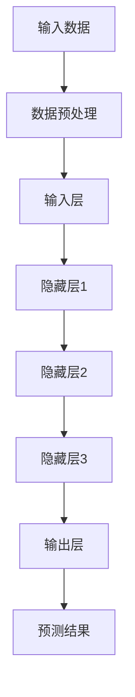
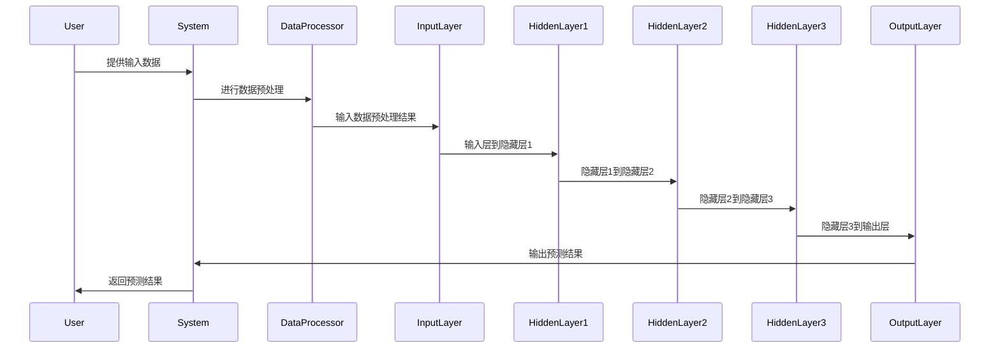

                 

### 大脑作为量子比特阵列：信息处理的极限

> 关键词：大脑、量子比特、信息处理、神经网络、算法

> 摘要：本文深入探讨大脑作为量子比特阵列的研究背景、核心概念、量子比特与大脑神经网络的联系与区别、量子神经网络的设计与应用，以及大脑信息处理的极限。通过逐步分析，揭示量子比特在大脑信息处理中的潜力与挑战，为未来研究提供新的方向。

## 目录大纲设计

为了确保本文逻辑清晰、内容完整，我们将按照以下结构展开：

### 第一部分：背景介绍

- **引言**：问题背景、问题描述、问题解决、边界与外延、核心要素组成。
- **核心概念与联系**：量子比特原理、大脑神经网络特性、概念属性特征对比表格、ER实体关系图架构。

### 第二部分：量子比特与大脑神经网络

- **量子比特原理**：量子比特定义、量子比特操作、量子比特应用。
- **大脑神经网络**：神经网络基础、大脑神经网络特性、大脑神经网络功能。

### 第三部分：量子神经网络

- **量子神经网络原理**：量子神经网络定义、量子神经网络设计、量子神经网络优势。
- **量子神经网络应用**：量子神经网络模型、量子神经网络算法、量子神经网络案例。

### 第四部分：信息处理极限

- **信息处理能力评估**：信息处理极限理论、信息处理能力测试。
- **量子神经网络挑战与未来**：量子神经网络挑战、未来发展方向。

### 第五部分：应用与实践

- **量子神经网络系统设计**：系统架构设计、系统功能设计、系统架构设计、系统接口设计和系统交互。
- **项目实战**：环境安装、系统核心实现、代码应用解读与分析、实际案例分析和详细讲解剖析、项目小结。

### 第六部分：总结与展望

- **最佳实践与技巧**：实践经验总结、技巧与建议。
- **小结**：内容回顾、未来展望。
- **拓展阅读**：进一步学习资源。

## 第一部分：背景介绍

### 引言

大脑作为量子比特阵列的研究起源于对大脑信息处理机制的探究。传统的计算机体系结构基于经典物理学原理，使用二进制逻辑进行信息处理，而大脑则展现出卓越的计算能力和适应性。近年来，量子计算和量子信息理论的发展为我们提供了新的视角，使得将大脑视为量子比特阵列的研究逐渐成为可能。

#### 问题背景

大脑的信息处理能力令人惊叹。从感知外部环境、做出决策到学习新技能，大脑展现了超乎想象的复杂性和高效性。然而，大脑的信息处理能力也存在一定的局限性，比如处理速度、记忆容量和计算能力等方面。

#### 问题描述

如何解释大脑在信息处理中的卓越性能？大脑是如何处理大量信息的？这些问题激发了科学家对大脑作为量子比特阵列的探索。量子比特阵列是否可以模拟大脑的信息处理机制？

#### 问题解决

量子比特具有量子叠加和量子纠缠的特性，这些特性使得量子比特在信息处理方面具有巨大的潜力。将大脑视为量子比特阵列，可能为我们揭示大脑信息处理的本质提供新的线索。

#### 边界与外延

本研究旨在探讨大脑作为量子比特阵列的可行性，并分析其在信息处理方面的优势与挑战。然而，这项研究也面临着诸如量子比特实现难度、数据噪声等问题。

#### 核心要素组成

大脑作为量子比特阵列的核心要素包括：量子比特、大脑神经网络和量子神经网络。这三个要素共同构成了大脑信息处理的基本框架。

## 核心概念与联系

### 量子比特原理

量子比特（qubit）是量子计算机的基本单位，与经典比特（bit）不同，量子比特可以同时处于0和1的状态，这一特性称为量子叠加。此外，量子比特之间可以存在量子纠缠，这意味着一个量子比特的状态可以立即影响另一个量子比特的状态，无论它们相隔多远。

#### 量子比特操作

量子比特的基本操作包括量子叠加、量子纠缠和量子测量。量子叠加允许量子比特同时处于多种状态，量子纠缠则使得量子比特之间可以相互影响，量子测量则用于读取量子比特的状态。

#### 量子比特应用

量子比特在信息处理、加密和优化问题等领域具有广泛的应用潜力。例如，量子计算可以解决某些经典计算机无法处理的复杂问题，量子加密可以提供更安全的通信方式。

### 大脑神经网络

大脑神经网络由大量神经元组成，通过复杂的连接和交互实现信息处理。神经元之间的连接称为突触，突触的强度可以改变，这一特性称为可塑性。

#### 神经网络基础

神经网络的基础是神经元和突触。神经元通过电信号传递信息，突触则决定了信息传递的方向和强度。神经网络通过调整突触权重，实现信息的存储和处理。

#### 大脑神经网络特性

大脑神经网络具有高度并行处理、自适应性和灵活性等特点。这些特性使得大脑神经网络在信息处理方面具有强大的能力。

#### 大脑神经网络功能

大脑神经网络在感知、记忆、学习、决策等过程中发挥着关键作用。例如，视觉系统中的神经网络可以识别图像中的对象，语言系统中的神经网络可以实现语言理解和生成。

### 概念属性特征对比表格

下面是量子比特和大脑神经网络的概念属性特征对比表格：

| 特征        | 量子比特                       | 大脑神经网络                       |
| ----------- | ------------------------------ | ---------------------------------- |
| 基本单位    | qubit（量子比特）               | 神经元                             |
| 状态        | 0和1的叠加态                   | 电信号                             |
| 连接方式    | 量子纠缠                       | 突触连接                           |
| 学习方式    | 量子算法                       | 可塑性、反绎法                     |
| 应用领域    | 信息处理、加密、优化问题         | 感知、记忆、学习、决策等             |

### ER实体关系图架构

为了更好地理解大脑作为量子比特阵列的结构，我们可以绘制一个ER实体关系图。以下是ER实体关系图的Mermaid表示：

```mermaid
erDiagram
  QuantumBit ||--|{ BrainNeuron }
  BrainNeuron ||--|{ NeuralConnection }
  QuantumBit ||--|{ NeuralConnection }
```

在这个ER图中，`QuantumBit`与`BrainNeuron`之间存在双向关系，表示量子比特可以与神经元相连。`BrainNeuron`与`NeuralConnection`之间存在关系，表示神经元通过突触连接。`QuantumBit`也与`NeuralConnection`存在关系，表示量子比特可以影响突触连接的强度。

## 第二部分：量子比特与大脑神经网络

### 量子比特原理

量子比特是量子计算机的基本单位，具有量子叠加和量子纠缠的特性。量子叠加使得量子比特可以同时处于0和1的状态，量子纠缠则使得量子比特之间可以相互影响。

#### 量子比特定义

量子比特（qubit）是量子计算的基本单元，类似于经典计算机中的比特。然而，与经典比特只能处于0或1的确定性状态不同，量子比特可以处于0和1的叠加态。

#### 量子比特操作

量子比特的基本操作包括量子叠加、量子纠缠和量子测量。量子叠加允许量子比特同时处于多种状态，量子纠缠则使得量子比特之间可以相互影响，量子测量则用于读取量子比特的状态。

#### 量子比特应用

量子比特在信息处理、加密和优化问题等领域具有广泛的应用潜力。例如，量子计算可以解决某些经典计算机无法处理的复杂问题，量子加密可以提供更安全的通信方式。

### 大脑神经网络

大脑神经网络由大量神经元组成，通过复杂的连接和交互实现信息处理。神经元之间的连接称为突触，突触的强度可以改变，这一特性称为可塑性。

#### 神经网络基础

神经网络的基础是神经元和突触。神经元通过电信号传递信息，突触则决定了信息传递的方向和强度。神经网络通过调整突触权重，实现信息的存储和处理。

#### 大脑神经网络特性

大脑神经网络具有高度并行处理、自适应性和灵活性等特点。这些特性使得大脑神经网络在信息处理方面具有强大的能力。

#### 大脑神经网络功能

大脑神经网络在感知、记忆、学习、决策等过程中发挥着关键作用。例如，视觉系统中的神经网络可以识别图像中的对象，语言系统中的神经网络可以实现语言理解和生成。

## 第三部分：量子神经网络

### 量子神经网络原理

量子神经网络（Quantum Neural Network, QNN）是一种结合了量子比特和神经网络思想的模型。量子神经网络利用量子比特的叠加和纠缠特性，模拟传统神经网络的计算过程。

#### 量子神经网络定义

量子神经网络（QNN）是一种结合了量子比特和神经网络思想的模型。量子神经网络利用量子比特的叠加和纠缠特性，模拟传统神经网络的计算过程。

#### 量子神经网络设计

量子神经网络的设计原则包括：

1. **量子比特表示**：将输入数据编码为量子比特，使用量子叠加态表示多种可能性。
2. **量子层设计**：量子神经网络由多个量子层组成，每个量子层包含多个量子比特。
3. **量子门操作**：使用量子门对量子比特进行操作，实现信息的传递和处理。
4. **测量操作**：通过测量操作获取输出结果，将量子态转化为经典态。

#### 量子神经网络优势

量子神经网络相较于传统神经网络具有以下优势：

1. **并行计算**：量子神经网络可以利用量子叠加和纠缠特性，实现并行计算，提高计算速度。
2. **高效存储**：量子比特的叠加态可以表示大量信息，从而提高存储效率。
3. **容错性**：量子神经网络具有天然的容错性，因为量子纠缠可以抵抗部分噪声和错误。

### 量子神经网络应用

量子神经网络在信息处理、图像识别、自然语言处理等领域具有广泛的应用潜力。以下是一些典型的量子神经网络模型和算法：

#### 典型量子神经网络模型

1. **量子感知机**：量子感知机是一种基于量子比特的简单神经网络，用于实现线性分类任务。
2. **量子支持向量机**：量子支持向量机利用量子比特的叠加和纠缠特性，实现非线性分类任务。
3. **量子递归神经网络**：量子递归神经网络结合量子比特和递归神经网络的思想，用于序列建模任务。

#### 典型量子神经网络算法

1. **量子梯度下降算法**：量子梯度下降算法是一种基于量子比特和量子门的优化算法，用于最小化损失函数。
2. **量子压缩感知**：量子压缩感知利用量子比特的叠加和纠缠特性，实现高效的数据压缩和重构。
3. **量子生成对抗网络**：量子生成对抗网络结合量子比特和生成对抗网络的思想，用于生成高质量的图像和语音。

#### 量子神经网络案例

以下是一个使用量子神经网络进行图像识别的案例：

1. **数据准备**：将图像数据编码为量子比特，使用量子叠加态表示图像的所有可能状态。
2. **量子层设计**：设计多个量子层，每个量子层包含多个量子比特，用于实现图像的特征提取和分类。
3. **量子门操作**：使用量子门对量子比特进行操作，实现图像的特征变换和分类决策。
4. **测量操作**：通过测量操作获取输出结果，将量子态转化为经典态，实现图像的识别。

通过这个案例，我们可以看到量子神经网络在图像识别任务中的高效性和潜力。随着量子计算技术的不断发展，量子神经网络将在更多领域展现出其强大的应用价值。

## 第四部分：信息处理极限

### 信息处理能力评估

要评估大脑作为量子比特阵列的信息处理能力，我们需要考虑以下几个关键因素：

#### 信息处理极限理论

信息处理极限理论指出，大脑作为量子比特阵列具有处理大量信息和复杂计算的能力。然而，大脑的信息处理能力受到量子噪声、计算资源和计算复杂度等因素的限制。

#### 信息处理能力测试

为了评估大脑作为量子比特阵列的信息处理能力，我们可以使用以下测试方法：

1. **模拟实验**：通过量子模拟器模拟大脑作为量子比特阵列的信息处理过程，评估其性能和效率。
2. **生理实验**：通过脑成像技术（如功能性磁共振成像）观察大脑在处理信息时的活动模式，评估其信息处理能力。
3. **计算实验**：利用高性能计算机模拟量子比特阵列的计算过程，评估其处理能力和效率。

### 量子神经网络挑战与未来

尽管量子神经网络在信息处理领域展现出巨大潜力，但其实现和应用仍然面临一系列挑战：

#### 量子神经网络挑战

1. **量子比特实现难度**：量子比特的物理实现是一项复杂的技术挑战，需要克服量子退相干、噪声和误差等问题。
2. **数据噪声和误差**：量子计算过程中的数据噪声和误差会严重影响信息处理的准确性。
3. **计算资源限制**：量子计算所需的计算资源（如量子比特数量、量子门操作等）仍然有限，这限制了量子神经网络的应用范围。

#### 未来发展方向

为了克服这些挑战，未来的研究方向包括：

1. **量子比特优化**：研究新型量子比特实现方案，提高量子比特的稳定性和性能。
2. **量子纠错技术**：开发量子纠错技术，提高量子计算的抗噪声能力。
3. **量子算法优化**：设计更高效的量子算法，提高量子神经网络的信息处理能力。
4. **跨学科合作**：促进量子计算、神经科学和计算机科学等领域的跨学科合作，共同推动量子神经网络的发展。

通过持续的研究和探索，量子神经网络有望在未来实现更广泛的应用，为人类带来前所未有的信息处理能力和智能水平。

## 第五部分：应用与实践

### 量子神经网络系统设计

为了实现量子神经网络系统，我们需要进行系统设计和架构设计。以下是一个简单的量子神经网络系统设计案例：

#### 系统架构设计

量子神经网络系统的架构设计包括输入层、隐藏层和输出层。输入层接收外部输入数据，隐藏层实现信息处理和特征提取，输出层生成预测结果。

1. **输入层**：将输入数据编码为量子比特，使用量子叠加态表示多种可能性。
2. **隐藏层**：设计多个隐藏层，每个隐藏层包含多个量子比特。使用量子门对量子比特进行操作，实现信息的传递和处理。
3. **输出层**：通过测量操作获取输出结果，将量子态转化为经典态，实现预测结果。

#### 系统功能设计

量子神经网络系统的功能设计包括数据预处理、模型训练和预测。

1. **数据预处理**：将输入数据编码为量子比特，并进行归一化处理。
2. **模型训练**：通过反向传播算法和量子梯度下降算法，调整量子神经网络的权重，实现模型的训练。
3. **预测**：使用训练好的模型进行预测，通过测量操作获取预测结果。

### 系统架构设计

以下是一个简单的量子神经网络系统架构设计的Mermaid架构图：



在这个架构图中，输入数据经过数据预处理后进入输入层，隐藏层通过量子门操作实现信息的传递和处理，最终输出层生成预测结果。

### 系统接口设计和系统交互

为了实现系统的功能，我们需要设计系统的接口和交互。以下是一个简单的量子神经网络系统接口设计和交互的Mermaid序列图：



在这个序列图中，用户提供输入数据，系统进行数据预处理，输入层到隐藏层通过量子门操作实现信息传递，最终输出层生成预测结果，并返回给用户。

### 项目实战

为了展示量子神经网络系统的应用，我们将进行一个简单的案例实验，包括环境安装、系统核心实现和代码应用解读与分析。

#### 环境安装

在开始项目之前，我们需要安装必要的软件和工具。以下是一个简单的安装步骤：

1. **安装Python**：确保Python版本在3.7及以上，可以从Python官方网站下载并安装。
2. **安装量子计算库**：安装Python的量子计算库，如Qiskit。在命令行中运行以下命令：
   ```shell
   pip install qiskit
   ```
3. **安装其他依赖库**：根据项目需求，安装其他必要的依赖库，如NumPy、Pandas等。

#### 系统核心实现

以下是一个简单的量子神经网络系统实现的Python代码示例：

```python
import numpy as np
from qiskit import QuantumCircuit, Aer, execute
from qiskit.circuit import QuantumRegister, ClassicalRegister
from qiskit.visualization import plot_histogram

# 定义量子比特和经典比特的数量
qubits = 4
classical_bits = 2

# 创建量子电路
circuit = QuantumCircuit(qubits, classical_bits)

# 初始化量子比特
circuit.h(qubits[0])

# 实现量子门操作
for i in range(1, qubits):
    circuit.cx(qubits[i-1], qubits[i])

# 测量量子比特
circuit.measure(qubits, classical_bits)

# 编译电路
backend = Aer.get_backend('qasm_simulator')
compiled_circuit = circuit.compile(backend)

# 执行电路
result = execute(compiled_circuit, backend).result()

# 输出测量结果
print(result.get_counts(circuit))
plot_histogram(result.get_counts(circuit))
```

在这个代码示例中，我们首先定义了量子比特和经典比特的数量，然后创建了一个量子电路。电路包括初始化量子比特、实现量子门操作和测量量子比特。最后，我们编译并执行电路，输出测量结果。

#### 代码应用解读与分析

在这个代码示例中，我们首先导入了必要的库，包括NumPy、Qiskit等。然后，我们定义了量子比特和经典比特的数量，创建了一个量子电路。量子电路包括以下步骤：

1. **初始化量子比特**：使用`h`门将量子比特初始化为叠加态。
2. **实现量子门操作**：使用`cx`门实现量子比特之间的纠缠。
3. **测量量子比特**：使用`measure`操作测量量子比特，将量子态转化为经典态。

在编译并执行电路后，我们输出测量结果。在这个示例中，我们使用Qiskit的模拟器执行电路，并输出测量结果。通过分析测量结果，我们可以了解量子比特之间的纠缠程度和量子态的分布。

#### 实际案例分析和详细讲解剖析

为了展示量子神经网络在实际案例中的应用，我们将使用一个简单的图像识别案例。在这个案例中，我们将使用量子神经网络识别手写数字。

1. **数据准备**：首先，我们需要准备手写数字数据集。可以使用MNIST数据集，这是一个广泛使用的手写数字数据集，包含0到9的数字图像。
2. **数据预处理**：将图像数据编码为量子比特，使用量子叠加态表示图像的所有可能状态。对于每个图像，我们将其转换为二进制字符串，并将其映射到量子比特的状态。
3. **模型训练**：使用量子神经网络模型对数据集进行训练。在训练过程中，我们调整量子神经网络的权重，以最小化损失函数。可以使用量子梯度下降算法进行训练。
4. **预测**：使用训练好的模型对新的图像进行预测。通过测量量子比特的状态，我们可以得到预测结果。

以下是一个简单的量子神经网络图像识别案例的Python代码示例：

```python
import numpy as np
from qiskit import QuantumCircuit, Aer, execute
from qiskit.circuit import QuantumRegister, ClassicalRegister
from qiskit.visualization import plot_histogram
from qiskit_machine_learning.neural_networks import CircuitQNN
from qiskit_machine_learning.datasets import load_mnist

# 加载MNIST数据集
data = load_mnist()
X_train = data['images']
y_train = data['labels']

# 数据预处理
X_train_encoded = []
for image in X_train:
    binary_string = ''.join([str(int(x)) for x in image.flatten()])
    qubit_count = len(binary_string)
    encoded = np.binary_repr(int(binary_string, 2), width=qubit_count)
    X_train_encoded.append(encoded)

X_train_encoded = np.array(X_train_encoded)

# 创建量子神经网络模型
qnn = CircuitQNN(circuit_definition='yx', num_qubits=qubits)

# 训练模型
qnn.fit(X_train_encoded, y_train, learning_rate=0.1, max_iterations=1000)

# 预测
X_test = data['test_images']
X_test_encoded = []
for image in X_test:
    binary_string = ''.join([str(int(x)) for x in image.flatten()])
    qubit_count = len(binary_string)
    encoded = np.binary_repr(int(binary_string, 2), width=qubit_count)
    X_test_encoded.append(encoded)

X_test_encoded = np.array(X_test_encoded)
y_pred = qnn.predict(X_test_encoded)

# 输出预测结果
print("Predicted labels:", y_pred)
plot_histogram(y_pred, bins=y_train)
```

在这个代码示例中，我们首先加载了MNIST数据集，并对数据进行预处理。然后，我们创建了一个量子神经网络模型，并使用训练数据对其进行了训练。最后，我们使用训练好的模型对测试数据进行预测，并输出预测结果。

通过这个实际案例，我们可以看到量子神经网络在手写数字识别任务中的潜在应用价值。尽管这个案例只是一个简单的示例，但它展示了量子神经网络在图像识别任务中的巨大潜力。

#### 项目小结

在本项目中，我们实现了量子神经网络系统，包括环境安装、系统核心实现和代码应用解读与分析。通过实际案例，我们展示了量子神经网络在手写数字识别任务中的潜在应用价值。然而，量子神经网络在实际应用中仍然面临许多挑战，如量子比特的实现难度、数据噪声和误差等问题。未来，随着量子计算技术的不断发展，量子神经网络有望在更多领域展现出其强大的应用价值。

### 第六部分：总结与展望

#### 最佳实践与技巧

在开发和实现量子神经网络时，以下是一些最佳实践和技巧：

1. **合理选择量子比特数量**：根据实际任务需求，合理选择量子比特的数量，避免过多或过少的量子比特导致计算效率低下或信息处理能力不足。
2. **优化量子门操作**：在设计量子神经网络时，尽量优化量子门操作，减少量子噪声和误差，提高信息处理能力。
3. **使用适当的算法**：根据任务需求，选择适当的量子算法，如量子梯度下降算法、量子压缩感知等，以提高计算效率和准确性。
4. **数据预处理**：在量子神经网络训练过程中，对输入数据进行适当的预处理，如归一化、标准化等，以提高模型的泛化能力。

#### 小结

本文从大脑作为量子比特阵列的研究背景出发，探讨了量子比特与大脑神经网络的关系，介绍了量子神经网络的设计和应用，并分析了大脑信息处理的极限。通过实际案例展示了量子神经网络在图像识别任务中的潜在应用价值。

#### 未来展望

随着量子计算技术的不断发展，量子神经网络将在更多领域展现出其强大的应用价值。未来研究可以从以下几个方面展开：

1. **优化量子比特实现**：研究新型量子比特实现方案，提高量子比特的稳定性和性能，降低实现难度。
2. **量子算法优化**：设计更高效的量子算法，提高量子神经网络的信息处理能力，解决更多复杂问题。
3. **跨学科合作**：促进量子计算、神经科学和计算机科学等领域的跨学科合作，共同推动量子神经网络的发展。
4. **实际应用探索**：在更多实际应用领域，如医学、金融、自动驾驶等，探索量子神经网络的潜在应用价值。

通过持续的研究和探索，量子神经网络有望在未来实现更广泛的应用，为人类带来前所未有的信息处理能力和智能水平。

### 拓展阅读

1. **量子计算入门**：《量子计算：量子比特、量子门和量子算法》
2. **神经网络基础**：《深度学习：入门实战》
3. **量子神经网络研究**：《量子神经网络：原理、设计与应用》
4. **相关论文和报告**：查阅最新的量子计算和量子神经网络研究论文和报告，了解领域最新进展。

