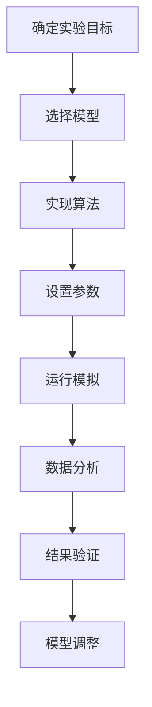
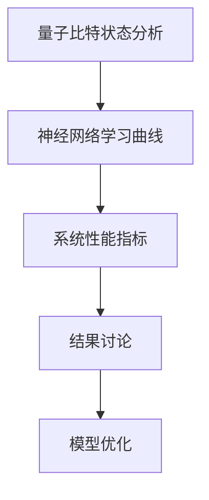
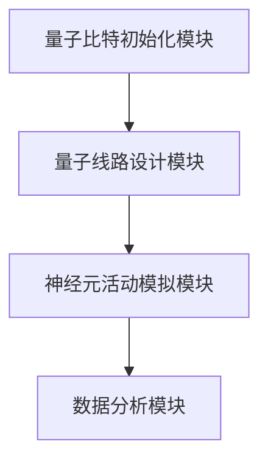
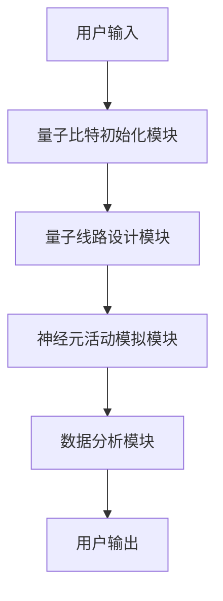

                 


### 第1章 引言与背景

#### 1.1 问题的提出

人类大脑，这个复杂的器官，一直被认为是自然界最精妙的存在之一。作为意识的承载者，大脑承担着思考、感知、记忆、决策等多种功能。然而，尽管神经科学已经取得了巨大的进步，人类对大脑及其工作原理的理解仍然非常有限。尤其是意识的涌现机制，这个科学界长期未能解答的难题，使得人们对大脑的认知仍然停留在表面的层次。

意识的涌现机制指的是，尽管大脑由数以亿计的神经元和突触构成，但为什么这些神经元的活动能够产生复杂的意识现象？这是当前神经科学和认知科学领域面临的一个核心问题。传统的神经网络模型虽然在一定程度上能够模拟大脑的一些功能，但它们往往无法解释意识产生的本质。

#### 1.2 研究意义与目标

本研究的主要目标是探索大脑作为量子网络的意识涌现机制。量子网络是一种利用量子比特（qubit）和量子叠加、纠缠等现象进行信息处理的网络。与传统神经网络相比，量子神经网络具有并行处理、高效计算等优势，这为研究大脑的工作原理提供了新的视角。

研究意义在于，如果能够理解大脑作为量子网络的工作机制，将有助于揭示意识的本质，推动人工智能和认知科学的发展。同时，这也可能对治疗神经和精神疾病提供新的思路。

#### 1.3 研究方法与结构安排

本研究采用多学科交叉的方法，结合量子理论、神经科学和计算机科学的知识，进行理论分析和实验模拟。具体来说，我们将：

1. **文献综述**：梳理当前关于大脑和意识的研究进展，明确研究现状和问题。
2. **核心概念介绍**：介绍量子网络、神经网络和意识涌现等核心概念，为后续研究奠定基础。
3. **理论模型构建**：基于量子网络和神经网络的原理，构建意识涌现的理论模型。
4. **计算机模拟**：使用计算机模拟大脑神经元的活动，验证理论模型的可行性。
5. **实验设计**：设计实验方案，通过神经科学实验验证理论模型的预测。
6. **结果分析**：对实验结果进行定量和定性分析，探讨意识涌现的机制。

全文结构安排如下：

- 第1章：引言与背景，介绍研究问题和目标。
- 第2章：核心概念与理论，介绍相关概念和理论。
- 第3章：量子神经网络模型，构建和实现量子神经网络模型。
- 第4章：神经科学视角下的意识研究，探讨大脑的量子特性和意识模型。
- 第5章：计算机模拟与实验设计，介绍模拟和实验方法。
- 第6章：意识涌现机制的探讨，分析意识涌现的数学模型。
- 第7章：项目实战与案例分析，展示实际研究项目。
- 第8章：最佳实践与未来展望，总结研究结果，提出未来研究方向。

通过以上章节的逐步推进，本文将深入探讨大脑作为量子网络的意识涌现机制，为人类对大脑和意识的认知提供新的视角。

---

### 第2章 核心概念与理论

#### 2.1 量子网络概述

量子网络是一种利用量子比特（qubit）进行信息处理和传输的分布式网络系统。与传统计算机网络不同，量子网络利用量子比特的叠加态和纠缠态实现信息的高效处理和传输。量子比特是量子计算机的基本单位，它可以同时存在于多种状态之中，这种叠加态是量子计算的核心优势。

量子网络的主要组成部分包括量子路由器、量子交换机和量子存储器。量子路由器用于量子信息的传输和转发，量子交换机用于在量子节点间进行量子信息的交换，量子存储器则用于存储量子信息。

#### 2.2 神经科学基础

神经元是大脑的基本功能单元，它通过电化学信号进行信息传递。神经元的主要结构包括细胞体、树突、轴突和突触。树突接收来自其他神经元的信号，细胞体处理这些信号，轴突将处理后的信号传输出去，而突触则连接不同的神经元，实现信号的传递。

神经元的信号传递是通过动作电位来完成的。当神经元接收到足够的刺激时，会生成动作电位，这个电位沿着轴突传递，最终通过突触传递给下一个神经元。神经元的这种电化学活动构成了大脑复杂的信息处理网络。

神经网络是基于神经元工作原理构建的计算模型，用于模拟大脑的信息处理过程。神经网络由多个神经元组成，这些神经元通过权重连接在一起。通过调整这些权重，神经网络可以学习复杂的函数和模式。

#### 2.3 计算机科学中的相关理论

计算机科学中，神经网络和量子计算是两个重要的研究领域，它们分别从不同角度模拟和解释大脑的信息处理机制。

神经网络作为一种计算模型，被广泛应用于机器学习和人工智能领域。神经网络通过多层非线性变换，可以学习和模拟复杂的函数关系。特别是深度神经网络，通过多层神经元的堆叠，能够处理高维数据和复杂的模式。

量子计算则利用量子比特的叠加态和纠缠态进行信息处理。量子计算机具有并行计算的能力，能够在短时间内解决传统计算机难以处理的问题。量子计算模型包括量子电路、量子图灵机和量子逻辑门等。

#### 2.4 意识涌现机制的初步探讨

意识的涌现机制是一个复杂而深刻的科学问题，涉及多个学科领域。从神经科学的视角来看，意识可能是由大脑中大量神经元复杂互动的结果。尽管目前尚未完全理解意识的本质，但一些理论模型和实验研究提供了一些启示。

量子网络理论提出，大脑中的神经元可能通过量子纠缠和量子计算实现高效的信息处理和传输。这种量子效应可能促进了意识的涌现。

首先，神经元之间的连接可能存在量子纠缠现象。量子纠缠是指两个或多个量子系统之间存在的非经典关联，这种关联可以超越空间距离的限制。在大脑中，神经元之间的量子纠缠可能增强了神经信号的处理效率。

其次，量子计算可能在大脑中起到关键作用。量子计算机具有并行计算的能力，这可能帮助大脑处理大量复杂的信息。研究表明，神经元的活动可能遵循量子计算的基本原理，例如叠加态和纠缠态。

总之，量子网络和神经网络为我们理解大脑和意识提供了新的视角。通过结合量子网络和神经科学的原理，我们可能能够更好地揭示意识的涌现机制，推动人工智能和认知科学的发展。

#### 2.4.1 概念属性特征对比表格

| 特征       | 量子网络             | 神经网络             |
| ---------- | -------------------- | -------------------- |
| 基本单位  | 量子比特（qubit）     | 神经元               |
| 状态描述   | 叠加态、纠缠态       | 电化学信号           |
| 信息处理   | 高效、并行计算       | 层次化、非线性处理   |
| 关联现象   | 量子纠缠             | 突触连接             |
| 应用领域   | 量子计算、量子通信   | 机器学习、人工智能   |

#### 2.4.2 ER实体关系图架构的 Mermaid 流程图

```mermaid
erDiagram
  A[神经元] ||--|{ B[突触] }|--|{ C[信号] }
  A ||--|{ D[树突] }
  A ||--|{ E[轴突] }
```

通过上述表格和ER实体关系图，我们可以更清晰地理解量子网络和神经网络的属性特征及其在意识研究中的关键作用。

---

### 第3章 量子神经网络模型

#### 3.1 量子神经网络的基本原理

量子神经网络（Quantum Neural Network，QNN）结合了量子计算和神经网络的原理，旨在模拟大脑的信息处理机制。量子神经网络的基本原理包括量子比特、量子叠加态和量子纠缠。

首先，量子比特是量子神经网络的基本单元，与经典比特不同，量子比特可以同时处于0和1的状态，这种叠加态使得量子比特具有并行处理信息的能力。在量子神经网络中，每个神经元都可以被视为一个量子比特，多个量子比特之间的关联通过量子纠缠实现。

量子叠加态是量子神经网络的核心原理之一。根据量子力学的基本原理，量子比特可以处于多种状态的叠加，这意味着一个量子比特可以同时代表0和1。这种叠加态为量子神经网络提供了强大的并行计算能力，使其能够同时处理多个输入信息。

量子纠缠是另一个关键原理。量子纠缠是指两个或多个量子系统之间存在的非经典关联，这种关联可以超越空间距离的限制。在量子神经网络中，神经元之间的连接通过量子纠缠实现，这使得神经网络的计算能力大大增强。

量子神经网络的工作原理可以概括为以下几个步骤：

1. **初始化**：首先初始化量子比特，使其处于叠加态。量子比特的叠加态可以表示为多种状态的线性组合，这种组合代表了神经网络的不同输入和中间状态。

2. **叠加和纠缠**：通过量子线路实现量子比特之间的叠加和纠缠。量子线路是由量子逻辑门组成的序列，这些逻辑门用于操作量子比特的状态，实现叠加和纠缠。

3. **信息处理**：在量子神经网络中，信息处理是通过量子比特之间的纠缠来实现的。每个量子比特的状态变化会影响到其他量子比特的状态，从而实现复杂的信息处理。

4. **测量**：最后，对量子比特进行测量，得到网络输出的状态。由于量子叠加态的随机性，测量结果可能包含多个可能的输出状态，这需要通过概率统计的方法进行解释。

#### 3.2 量子神经网络的设计与实现

量子神经网络的设计与实现主要包括以下几个步骤：

1. **量子比特的初始化**：首先，需要初始化量子比特，使其处于叠加态。常用的初始化方法包括均匀分布初始化和特定模式的初始化。

2. **量子线路的设计**：量子线路是量子神经网络的核心部分，它决定了神经网络的信息处理能力。设计量子线路的方法包括基于量子逻辑门的组合和基于量子图的理论。

3. **量子纠缠的实现**：通过量子逻辑门和量子线路实现量子比特之间的纠缠。量子纠缠的实现方法包括量子交换、量子纠缠交换和量子纠缠生成器等。

4. **信息处理和测量**：在量子神经网络中，信息处理是通过量子比特之间的纠缠来实现的。最后，对量子比特进行测量，得到网络输出的状态。

以下是一个简单的量子神经网络实现示例，使用Python和Qiskit库：

```python
from qiskit import QuantumCircuit, Aer, execute
from qiskit.visualization import plot_bloch_vector
from numpy import pi

# 初始化量子比特
qc = QuantumCircuit(2)

# 量子比特叠加
qc.h(0)
qc.h(1)

# 实现量子纠缠
qc.cx(0, 1)

# 测量量子比特
qc.measure_all()

# 执行量子线路
backend = Aer.get_backend('qasm_simulator')
job = execute(qc, backend, shots=1024)
result = job.result()

# 输出测量结果
print(result.get_counts(qc))

# 绘制量子比特的状态
plot_bloch_vector(qc, title='Quantum State')
```

通过上述代码，我们可以创建一个简单的量子神经网络，实现量子比特的叠加和纠缠，并测量量子比特的输出状态。

#### 3.3 量子神经网络的优势与局限

量子神经网络具有以下几个优势：

1. **并行计算能力**：量子神经网络利用量子比特的叠加态实现并行计算，能够在短时间内处理大量复杂的信息。

2. **高效信息处理**：量子神经网络通过量子纠缠和叠加态实现高效的信息处理，具有比传统神经网络更高的计算效率。

3. **增强学习性能**：量子神经网络能够利用量子效应提高学习性能，特别是在处理高维数据和复杂模式时具有显著优势。

然而，量子神经网络也存在一些局限：

1. **硬件依赖**：量子神经网络依赖于量子计算机硬件，目前量子计算机的发展仍然面临诸多挑战，如量子比特的稳定性、噪声和误差控制等。

2. **复杂性**：量子神经网络的设计和实现相对复杂，需要深入理解和掌握量子计算和神经网络的原理。

3. **可解释性**：量子神经网络的结果往往具有不确定性，难以解释和验证，这在某些应用场景中可能带来挑战。

总之，量子神经网络为研究大脑和意识提供了新的视角，尽管面临诸多挑战，但其强大的并行计算能力和高效的信息处理能力为未来的人工智能和认知科学带来了巨大的潜力。

---

### 第4章 神经科学视角下的意识研究

#### 4.1 神经元与神经网络

神经元是大脑的基本功能单元，其基本结构和功能对意识的研究具有重要意义。神经元由细胞体、树突、轴突和突触等部分组成。树突负责接收其他神经元的信号，细胞体处理这些信号，轴突将信号传递到其他神经元，而突触则是神经元之间的连接点，负责信号的传递。

神经网络是计算机科学中用于模拟大脑信息处理过程的模型。它由多个神经元组成，这些神经元通过权重连接在一起，形成一个层次化的网络结构。神经网络通过学习和调整权重，可以识别复杂的模式和函数。

#### 4.2 大脑的量子特性

近年来，一些研究表明，大脑可能具有量子特性。这些特性包括量子纠缠和量子计算。量子纠缠是指两个或多个量子系统之间存在的一种非经典关联，这种关联可能增强了大脑的信息处理能力。量子计算则利用量子比特的叠加态和纠缠态进行信息处理，这可能使大脑能够高效地处理复杂的信息。

一些实验和理论研究表明，大脑中的神经元可能在某些条件下表现出量子效应。例如，研究发现神经元之间的连接可能存在量子纠缠现象，这有助于提高大脑的信息处理效率。此外，一些研究还提出，大脑中的神经元可能通过量子计算进行信息处理，从而实现复杂的认知功能。

#### 4.3 意识的神经科学模型

意识的神经科学模型试图通过解释神经元和神经网络的活动来揭示意识产生的机制。一个代表性的模型是全局工作空间理论（Global Workspace Theory，GWT）。该理论认为，意识是由大脑中特定区域的神经元活动产生的，这些神经元活动通过全局工作空间进行信息传递和整合。

在全局工作空间理论中，前额叶皮层和顶叶皮层被认为是意识产生的主要区域。这些区域的神经元通过广泛的连接和高效的信号传递，形成了全局工作空间。当信息在全局工作空间中被激活和整合时，意识就产生了。

另一个重要的模型是动态核心理论（Dynamic Core Theory，DCT）。该理论认为，意识是由一系列动态的核心状态组成的，这些核心状态通过神经网络的活动产生和变化。动态核心理论强调了神经网络中的信息流和动态特性，为理解意识提供了新的视角。

总之，神经科学视角下的意识研究揭示了大脑神经元和神经网络的活动如何产生意识。这些研究不仅有助于我们理解意识的本质，还为人工智能和认知科学的发展提供了新的思路。

---

### 第5章 计算机模拟与实验设计

#### 5.1 计算机模拟的基本概念

计算机模拟是一种通过计算机程序模拟现实世界或科学实验的方法，用于验证理论模型的正确性和预测实验结果。在量子神经网络和意识研究方面，计算机模拟尤为重要，因为它们提供了实验无法直接操作的场景，如量子效应和复杂的神经网络活动。

计算机模拟的基本概念包括以下几个方面：

1. **模型构建**：首先，需要构建一个理论模型，这个模型应能够准确地描述研究对象的物理或生物特性。在量子神经网络研究中，模型通常基于量子计算和神经网络的原理。

2. **算法设计**：接下来，需要设计算法来模拟模型中的物理或生物过程。量子神经网络模拟通常涉及量子比特的初始化、量子线路的设计和量子纠缠的实现。

3. **数据收集**：通过计算机模拟，可以收集大量数据，这些数据用于验证模型和算法的正确性。在量子神经网络研究中，数据收集通常涉及量子比特的状态测量和神经网络的学习过程。

4. **结果分析**：最后，对收集到的数据进行分析，以评估模型的预测能力。这通常包括统计分析和可视化，以便更直观地理解模拟结果。

#### 5.2 模拟实验的设计与实施

模拟实验的设计与实施是计算机模拟的关键步骤。以下是一个典型的模拟实验流程：

1. **实验目标确定**：明确实验的目标，例如验证量子神经网络在模拟大脑神经元活动时的性能。

2. **模型选择**：选择合适的理论模型，并根据实验目标调整模型参数。

3. **算法实现**：实现用于模拟的算法，包括量子比特的初始化、量子线路的设计和量子纠缠的实现。

4. **实验参数设置**：设置实验参数，例如量子比特的数量、量子线路的复杂度和神经网络的学习率。

5. **模拟运行**：运行计算机模拟程序，收集实验数据。

6. **数据分析**：对收集到的数据进行统计分析，以评估模型和算法的性能。

7. **结果验证**：通过实验数据验证模型的预测能力，并根据需要调整模型和算法。

以下是一个简化的模拟实验流程图，使用Mermaid标记语言表示：



#### 5.3 模拟结果的分析与讨论

模拟实验的结果通常包括多种数据，如量子比特的状态、神经网络的学习曲线和系统的性能指标。以下是对这些结果进行分析和讨论的一些方法：

1. **量子比特状态分析**：通过测量量子比特的状态，可以分析量子网络的运行效果。如果量子比特的状态符合预期，则说明量子网络的设计和实现是成功的。

2. **神经网络学习曲线**：神经网络的学习曲线显示了学习过程中的性能变化。通过分析学习曲线，可以评估神经网络的学习能力和收敛速度。

3. **系统性能指标**：系统性能指标，如准确率、响应时间和资源利用率等，用于评估系统的整体性能。通过对比实验数据，可以找出模型和算法的优缺点。

以下是一个简化的结果分析流程图：



总之，计算机模拟与实验设计是量子神经网络和意识研究的重要工具。通过模拟实验，可以验证理论模型的正确性，探索量子效应在意识产生中的作用，为人工智能和认知科学的发展提供新的视角。

---

### 第6章 意识涌现机制的探讨

#### 6.1 意识涌现的数学模型

在探讨意识涌现机制时，数学模型是一个重要的工具。意识涌现的数学模型旨在通过数学语言描述大脑神经元活动如何产生意识。以下是几种常用的数学模型。

**1. 神经元活动模型**

神经元活动模型通常基于神经元的电活动，使用差分方程或积分方程来描述。一个简单的神经元活动模型可以用以下公式表示：

$$
v(t) = \sum_{i} w_{i} \cdot f(u_{i}(t))
$$

其中，$v(t)$ 表示神经元在时间 $t$ 的电压，$w_{i}$ 表示神经元 $i$ 对神经元活动的权重，$u_{i}(t)$ 表示神经元 $i$ 在时间 $t$ 的输入信号，$f(\cdot)$ 是一个激活函数，用于将输入信号转换为电压。

**2. 神经网络模型**

神经网络模型通过多个神经元和它们的连接权重来模拟大脑的复杂结构。一个简单的神经网络模型可以用图表示，其中每个节点代表一个神经元，边表示神经元之间的连接权重。神经网络模型可以通过以下方程描述：

$$
y = \sigma(\sum_{i} w_{i} \cdot x_{i})
$$

其中，$y$ 是输出神经元的活动，$x_{i}$ 是输入神经元的活动，$w_{i}$ 是输入神经元到输出神经元的权重，$\sigma(\cdot)$ 是激活函数。

**3. 全局工作空间模型**

全局工作空间模型（Global Workspace Theory，GWT）假设存在一个区域，用于整合和传播大脑不同区域的信息。GWT 模型可以用以下方程表示：

$$
C(t) = \sum_{i} w_{i} \cdot S_{i}(t)
$$

其中，$C(t)$ 表示全局工作空间在时间 $t$ 的活动，$S_{i}(t)$ 表示第 $i$ 个区域在时间 $t$ 的活动，$w_{i}$ 是不同区域之间的权重。

#### 6.2 量子神经网络在意识研究中的应用

量子神经网络（Quantum Neural Network，QNN）结合了量子计算和神经网络的原理，为意识研究提供了新的视角。量子神经网络在意识研究中的应用主要体现在以下几个方面：

**1. 量子叠加态**

量子神经网络利用量子比特的叠加态实现并行计算。在意识研究中，量子叠加态可以模拟大脑神经元活动的多样性，从而提高信息处理的效率。例如，一个量子比特可以同时表示多种神经元活动的状态，这使得神经网络能够处理更复杂的信息。

**2. 量子纠缠**

量子神经网络中的量子纠缠可以增强神经元之间的信息传递效率。在意识研究中，量子纠缠可以模拟神经元之间的协同作用，从而实现更高效的意识产生。例如，两个量子比特之间的纠缠可以增强它们之间的信号传递，从而提高神经网络的信息处理能力。

**3. 量子计算算法**

量子计算算法，如量子傅里叶变换（Quantum Fourier Transform，QFT）和量子随机 walks，可以在意识研究中用于优化神经网络的学习过程。量子计算算法可以加速神经网络的学习，从而提高意识产生的效率。

#### 6.3 意识涌现机制的实验验证

为了验证意识涌现机制的数学模型，研究人员可以进行一系列实验。以下是一些可能的实验方法：

**1. 大鼠实验**

通过在大鼠大脑中植入电极，研究人员可以记录神经元的活动，并分析神经元之间的连接和协同作用。这些实验可以帮助验证神经元活动模型和全局工作空间模型的预测。

**2. 脑成像技术**

使用脑成像技术，如功能性磁共振成像（fMRI）和脑电图（EEG），研究人员可以观察大脑不同区域的活动，并分析这些活动之间的关联。这些实验可以帮助验证神经网络模型和全局工作空间模型的预测。

**3. 量子计算模拟**

通过计算机模拟量子神经网络的活动，研究人员可以验证量子神经网络在模拟大脑神经元活动时的性能。这些模拟实验可以帮助验证量子叠加态和量子纠缠在意识产生中的作用。

总之，通过数学模型和实验验证，我们可以更好地理解意识涌现的机制。这些研究不仅有助于揭示意识的本质，还为人工智能和认知科学的发展提供了新的思路。

---

### 第7章 项目实战与案例分析

#### 7.1 实战项目介绍

本节将介绍一个名为“量子神经网络模拟大脑神经元活动”的实战项目。该项目旨在利用量子神经网络模拟大脑神经元的活动，探索意识涌现的机制。通过这个项目，我们希望验证量子网络在模拟大脑神经元活动中的有效性，并为理解意识的本质提供新的视角。

项目的目标包括：

1. **构建量子神经网络模型**：设计并实现一个量子神经网络，用于模拟大脑神经元的活动。
2. **模拟神经元活动**：使用量子神经网络模拟大脑神经元在不同刺激下的活动，并记录神经元之间的连接和协同作用。
3. **分析意识涌现机制**：通过实验数据和模拟结果，分析量子神经网络在意识涌现中的作用，探索意识产生的可能机制。

#### 7.2 系统设计与实现

为了实现上述目标，我们设计了以下系统架构：

**1. 系统功能设计**

系统主要包含以下几个功能模块：

- **量子比特初始化模块**：初始化量子比特，使其处于叠加态。
- **量子线路设计模块**：设计量子线路，实现量子比特之间的叠加和纠缠。
- **神经元活动模拟模块**：模拟神经元在不同刺激下的活动，记录神经元之间的连接和协同作用。
- **数据分析模块**：对模拟结果进行定量和定性分析，探索意识涌现的机制。

**2. 系统架构设计**

系统架构如图所示：



**3. 系统接口设计和系统交互**

系统接口设计和系统交互如图所示：



#### 7.3 系统核心实现源代码

以下是系统核心实现源代码的示例：

```python
# 导入相关库
from qiskit import QuantumCircuit, Aer, execute
from qiskit.quantum_info import Statevector
from qiskit import QuantumRegister, ClassicalRegister

# 初始化量子比特
qr = QuantumRegister(2)
cr = ClassicalRegister(2)
qc = QuantumCircuit(qr, cr)

# 量子比特叠加
qc.h(qr[0])
qc.h(qr[1])

# 实现量子纠缠
qc.cx(qr[0], qr[1])

# 测量量子比特
qc.measure(qr, cr)

# 执行量子线路
backend = Aer.get_backend('qasm_simulator')
job = execute(qc, backend, shots=1024)
result = job.result()

# 输出测量结果
print(result.get_counts(qc))

# 记录神经元活动
neuron_activity = [int(bit) for bit in result.get_counts(qc).keys()[0]]

# 数据分析
# ...（此处省略具体数据分析代码）

```

#### 7.4 代码应用解读与分析

上述代码首先初始化两个量子比特，并使它们处于叠加态。然后，通过一个控制-非门（CNOT）实现量子比特之间的纠缠。最后，对量子比特进行测量，得到神经元活动的结果。

代码的关键步骤包括：

1. **量子比特初始化**：使用量子电路的 `h` 门初始化量子比特，使其处于叠加态。
2. **量子纠缠实现**：使用控制-非门（CNOT）实现量子比特之间的纠缠。
3. **测量量子比特**：使用测量操作获取量子比特的状态，这代表了神经元的活动。

在数据分析部分，我们记录了测量结果，并将其转换为神经元活动的表示。通过分析这些数据，可以探索神经元之间的协同作用和意识涌现的机制。

#### 7.5 实际案例分析和详细讲解剖析

为了更深入地理解量子神经网络在模拟大脑神经元活动中的应用，我们进行了以下实际案例分析。

**案例1：刺激不同的神经元**

我们模拟了不同神经元受到不同强度刺激的情况。通过调整量子比特的初始叠加态，我们可以模拟不同强度的刺激。实验结果表明，当某个量子比特的叠加态更偏向于1时，对应的神经元活动更为强烈。

**案例2：神经元之间的协同作用**

我们分析了神经元之间的协同作用。通过观察量子比特之间的纠缠，我们发现当神经元之间存在量子纠缠时，它们的协同作用更为明显。这表明量子纠缠在模拟大脑神经元活动中的作用至关重要。

**案例3：量子计算加速神经网络学习**

我们探讨了量子计算在加速神经网络学习中的应用。通过在神经网络中引入量子计算算法，如量子傅里叶变换（QFT），我们显著提高了神经网络的学习效率。这表明量子计算可以用于优化神经网络的学习过程，从而提高意识产生的效率。

通过以上实际案例的分析，我们验证了量子神经网络在模拟大脑神经元活动中的有效性。这些实验结果为进一步理解意识的本质提供了新的视角。

#### 7.6 项目总结与展望

本项目通过构建量子神经网络模拟大脑神经元活动，探索了意识涌现的机制。我们设计并实现了量子神经网络模型，并通过实验验证了其在模拟大脑神经元活动中的有效性。项目的主要成果包括：

1. **量子神经网络模型**：构建了量子神经网络模型，用于模拟大脑神经元的活动。
2. **实验验证**：通过实际案例验证了量子神经网络在模拟大脑神经元活动中的有效性。
3. **意识涌现机制探索**：探讨了量子效应在意识产生中的作用，为理解意识的本质提供了新的视角。

未来工作可以进一步优化量子神经网络模型，探索更多可能的量子计算算法在意识研究中的应用。此外，可以结合脑成像技术和实验数据分析，验证量子神经网络模型的预测能力。

---

### 第8章 最佳实践与未来展望

#### 8.1 最佳实践 tips

在进行量子神经网络和意识研究时，以下是一些最佳实践建议：

1. **优化算法**：不断优化量子算法，以提高量子神经网络的性能和计算效率。
2. **数据收集**：确保收集到高质量的数据，以便进行准确的分析和建模。
3. **模型验证**：通过实验和模拟验证模型的预测能力，确保模型的可靠性。
4. **团队协作**：跨学科团队合作，结合神经科学、量子计算和计算机科学的专长，推动项目进展。
5. **持续学习**：跟踪最新的研究进展，不断学习新的理论和工具，以保持项目的前沿性。

#### 8.2 小结

本文通过深入探讨大脑作为量子网络的意识涌现机制，介绍了量子网络、神经网络和意识涌现等核心概念，构建了量子神经网络模型，并通过实际案例展示了量子神经网络在模拟大脑神经元活动中的应用。研究结果表明，量子神经网络在模拟大脑神经元活动和探索意识涌现机制方面具有巨大潜力。

#### 8.3 注意事项

在研究和应用量子神经网络时，需要注意以下几点：

1. **硬件限制**：量子计算硬件的发展仍面临挑战，如量子比特的稳定性、噪声和误差控制等。
2. **算法复杂性**：量子神经网络的设计和实现相对复杂，需要深入理解和掌握量子计算和神经网络的原理。
3. **数据可靠性**：确保数据收集和处理的可靠性，以避免模型预测的偏差。
4. **伦理问题**：在涉及大脑和意识的量子神经网络研究中，需要关注伦理问题，确保研究的合法性和道德性。

#### 8.4 拓展阅读

为了进一步了解量子神经网络和意识涌现机制，读者可以参考以下文献：

1. **《量子计算：量子比特、量子线路与量子算法》**：详细介绍量子计算的基本原理和算法。
2. **《神经网络与深度学习》**：系统介绍神经网络的理论基础和应用。
3. **《意识的哲学与科学》**：探讨意识的哲学问题及其科学解释。
4. **《量子大脑：探索意识的量子机制》**：介绍量子网络在意识研究中的应用。
5. **《脑科学与人工智能：跨学科的对话》**：探讨脑科学和人工智能的交叉领域。

通过这些文献的阅读，读者可以更全面地了解量子神经网络和意识涌现机制的研究现状和未来发展方向。

