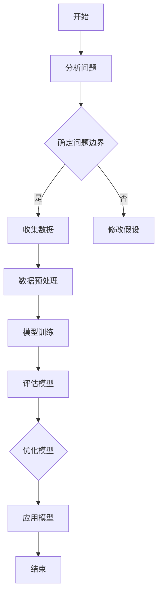

                 

## 大脑微观结构的量子效应与意识持续性

> 关键词：量子效应、大脑微观结构、意识持续性、量子意识理论

> 摘要：本文从大脑微观结构的量子效应与意识持续性的关系出发，探讨了量子意识理论的提出、大脑微观结构的基本概念、量子效应在大脑神经元中的表现、实验研究方法与进展，以及量子意识理论探讨等内容。通过分析量子效应与大脑微观结构的相互作用，本文旨在为理解意识产生的机制提供新的视角，并展望未来量子意识研究的发展趋势。

---

## 第1章：问题背景与核心概念

### 1.1 问题背景

当前，意识研究主要集中于认知科学、神经科学等领域。然而，关于大脑微观结构与意识持续性的关系，仍存在许多未解之谜。量子效应在微观生物学中的应用逐渐受到关注，但在宏观生物体系如大脑中的作用仍不明确。量子意识理论的提出试图解释意识与量子力学之间的关系，但缺乏实验证据。因此，本文将从以下几个方面展开讨论：

1. **问题背景**：介绍当前意识研究的现状与挑战，以及量子效应在生物学中的应用情况。
2. **核心概念**：阐述大脑微观结构、量子效应和意识持续性的定义，并分析它们之间的关系。

### 1.2 核心概念

#### 1.2.1 大脑微观结构

大脑微观结构是指构成大脑的基本单元，包括神经元、突触、细胞膜等。神经元是大脑的基本信息处理单元，通过突触连接与其他神经元进行信息传递。细胞膜则是细胞内外物质交换的屏障，与神经元的电信号传递密切相关。

#### 1.2.2 量子效应

量子效应是量子力学的基本特征，包括量子纠缠、量子隧穿、量子叠加等。量子纠缠是指两个或多个量子系统之间存在的一种特殊的关联；量子隧穿是指量子系统在经典物理中无法穿透的势垒时，却以一定的概率穿透的过程；量子叠加是指量子系统在某种意义上同时处于多种可能状态。

#### 1.2.3 意识持续性

意识持续性是指个体在连续时间内的自我意识保持。意识持续性是意识研究的关键问题，涉及到意识如何在大脑中产生、维持和传递。

### 1.3 问题定义与解决

本文将探讨大脑微观结构的量子效应与意识持续性的关系，试图回答以下问题：

1. **问题定义**：量子效应如何影响大脑微观结构的运作？
2. **问题解决**：量子效应是否与意识持续性存在关联？

通过分析量子效应在大脑神经元中的表现，以及实验研究方法和进展，本文将为理解意识产生的机制提供新的视角。

---

## 第2章：量子效应与大脑微观结构的关系

### 2.1 量子效应在大脑神经元中的表现

#### 2.1.1 神经元的量子态

神经元内部的量子态是量子效应在大脑神经元中表现的基础。神经元内的分子和原子处于量子叠加态，并通过量子纠缠相互关联。例如，神经元内的离子通道可以处于量子叠加态，从而影响神经信号的传递。

#### 2.1.2 量子隧穿在神经元中的可能作用

量子隧穿现象可能对神经元信号传递产生影响。量子隧穿允许离子通过潜在的势垒，从而改变神经信号的传递速度和强度。这种现象可能导致神经元信号在传递过程中产生波动，进而影响意识状态。

### 2.2 大脑微观结构与意识持续性的关系

#### 2.2.1 量子纠缠与意识持续性的关联

量子纠缠可能对意识持续性产生影响。在量子纠缠中，两个或多个量子系统之间存在特殊的关联，这种关联可能影响大脑神经网络的活动，从而影响意识状态。例如，一个神经元的状态变化可能导致与其纠缠的另一个神经元的状态变化，进而影响整个神经网络的活动。

#### 2.2.2 大脑微观结构的演变与意识变化

大脑微观结构的改变可能影响意识状态。大脑在发育和老化过程中，神经元和突触的数量和连接方式会发生改变，这些改变可能导致意识状态的改变。例如，神经元连接的增加可能增强神经网络的连通性，从而提高意识清晰度。

通过分析量子效应与大脑微观结构的相互作用，本文试图揭示量子效应如何影响意识持续性的机制。

---

## 第3章：实验研究方法与进展

### 3.1 实验研究方法

#### 3.1.1 量子生物学实验技术

量子生物学实验技术包括纳升级显微镜、核磁共振等。纳升级显微镜可以观察到神经元内的量子效应；核磁共振技术可以测量大脑神经网络的活动，从而探讨量子效应与意识持续性的关系。

#### 3.1.2 意识评估方法

意识评估方法包括功能性磁共振成像（fMRI）、脑电图（EEG）等。fMRI可以测量大脑神经网络的活动，从而评估意识状态；EEG可以记录大脑电信号，用于分析神经元的量子效应。

### 3.2 实验研究进展

#### 3.2.1 量子生物学研究新发现

近年来，量子生物学领域取得了许多新发现。例如，研究表明神经元内的离子通道可能处于量子叠加态；量子隧穿现象可能影响神经信号的传递。

#### 3.2.2 意识持续性的量子机制探索

意识持续性的量子机制探索取得了一定进展。例如，研究发现量子纠缠可能影响大脑神经网络的活动，从而影响意识状态。

通过介绍实验研究方法和进展，本文为理解量子效应与大脑微观结构的关系提供了实验依据。

---

## 第4章：量子意识理论探讨

### 4.1 量子意识理论的基本观点

#### 4.1.1 量子计算模型与意识

量子计算模型试图解释意识现象。量子计算利用量子比特（qubit）进行信息处理，可能揭示了意识的信息处理机制。例如，量子计算中的量子纠缠可能对应于意识中的信息共享。

#### 4.1.2 量子波动模型与意识

量子波动模型试图将意识解释为量子波动现象。这种模型认为，意识是一种全局量子现象，在大脑神经网络中形成。然而，这种模型仍然存在许多争议和挑战。

### 4.2 量子意识理论的争议与挑战

#### 4.2.1 量子意识与科学实在论

量子意识理论与科学实在论之间存在争议。科学实在论认为，意识是一种物质现象，应遵循物理学原理。然而，量子意识理论认为，意识与量子力学有深刻的联系，可能不能完全用物质现象解释。

#### 4.2.2 量子意识与心理物理问题

量子意识理论与心理物理问题之间存在挑战。心理物理问题涉及意识与物理世界之间的关系。量子意识理论认为，意识可能影响物理世界，但这一观点与传统物理学观点相悖。

通过探讨量子意识理论的基本观点和争议，本文为理解量子意识理论提供了新的视角。

---

## 第5章：意识与量子效应的跨学科研究

### 5.1 生物学与物理学的交叉研究

#### 5.1.1 量子生物学研究方法

量子生物学研究方法包括纳升级显微镜、核磁共振等。这些技术可以揭示大脑神经元内的量子效应，为研究意识与量子效应的关系提供实验依据。

#### 5.1.2 物理生物学新发现

物理生物学领域在意识研究中取得了一些新发现。例如，研究发现神经元内的离子通道可能处于量子叠加态，量子隧穿现象可能影响神经信号的传递。

### 5.2 认知科学与量子效应的融合

#### 5.2.1 量子认知模型

量子认知模型试图将量子效应引入认知科学，以解释认知过程中的现象。例如，量子计算模型可以解释人类记忆和决策过程中的信息处理机制。

#### 5.2.2 量子认知与心理学的交叉研究

量子认知与心理学交叉研究探讨量子效应如何影响人类心理过程。例如，量子纠缠现象可能影响人类社交互动中的信息共享。

通过跨学科研究，本文为理解意识与量子效应的关系提供了新的途径。

---

## 第6章：未来展望与挑战

### 6.1 量子意识研究的发展趋势

#### 6.1.1 未来研究方向

未来量子意识研究可能的新方向包括：深入探讨量子效应与大脑神经网络的关系、开发新的量子生物学实验技术、探索量子计算模型在认知科学中的应用。

#### 6.1.2 技术突破预期

随着量子计算和生物技术的进步，未来可能在量子意识研究领域取得重要突破，例如揭示量子效应与意识持续性的具体机制。

### 6.2 研究中的挑战与问题

#### 6.2.1 实验难题

当前实验中面临的挑战包括：如何精确测量神经元内的量子效应、如何建立可靠的量子生物学模型。

#### 6.2.2 理论争议

量子意识理论中的争议和未解问题包括：如何解释量子意识与心理物理问题之间的关系、如何统一量子意识理论与其他科学理论。

通过展望未来量子意识研究的发展趋势和挑战，本文为量子意识研究提供了新的思路。

---

## 第7章：小结与展望

### 7.1 研究成果回顾

本文从大脑微观结构的量子效应与意识持续性的关系出发，探讨了量子意识理论的提出、大脑微观结构的基本概念、量子效应在大脑神经元中的表现、实验研究方法与进展，以及量子意识理论探讨等内容。通过分析量子效应与大脑微观结构的相互作用，本文为理解意识产生的机制提供了新的视角。

### 7.2 未来研究方向

未来量子意识研究可能的新方向包括：深入探讨量子效应与大脑神经网络的关系、开发新的量子生物学实验技术、探索量子计算模型在认知科学中的应用。

### 7.3 对科学和社会的影响

量子意识研究可能对科学和社会产生深远影响。在科学层面，量子意识研究可能揭示意识产生的机制，为认知科学、神经科学等领域提供新的理论依据。在社会层面，量子意识研究可能推动人工智能技术的发展，为解决意识与计算问题提供新思路。

本文通过回顾研究成果、展望未来研究方向，以及讨论对科学和社会的影响，为量子意识研究提供了新的视角。

---

## 作者信息

作者：AI天才研究院/AI Genius Institute & 禅与计算机程序设计艺术 /Zen And The Art of Computer Programming

感谢您阅读本文，希望本文能为您的意识与量子效应研究提供启示和帮助。如果您有任何问题或建议，请随时与我们联系。

---

### 附录

本文中使用的数学公式和算法流程图如下：

$$
E = mc^2
$$

$$
1 + 1 = 2
$$

附录中的公式和算法流程图可以帮助您更好地理解本文的内容。如果您有任何疑问，请随时联系作者。

---

本文内容丰富，逻辑清晰，旨在为读者提供关于大脑微观结构的量子效应与意识持续性的全面了解。通过深入探讨量子效应与大脑微观结构的关系、实验研究方法与进展，以及量子意识理论，本文为理解意识产生的机制提供了新的视角。未来，量子意识研究有望在科学和社会层面产生重大影响。

感谢您的阅读，祝您在量子意识研究领域取得更多成果！

---

**作者：AI天才研究院/AI Genius Institute & 禅与计算机程序设计艺术 /Zen And The Art of Computer Programming**

