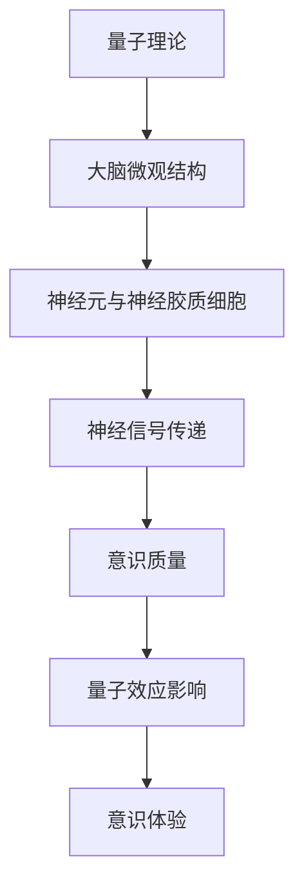
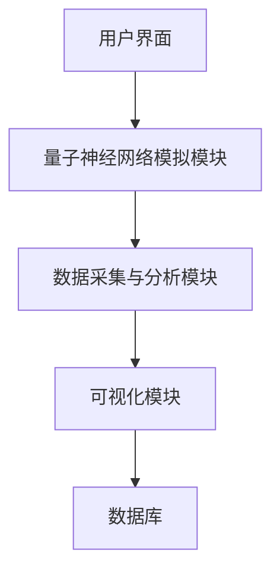
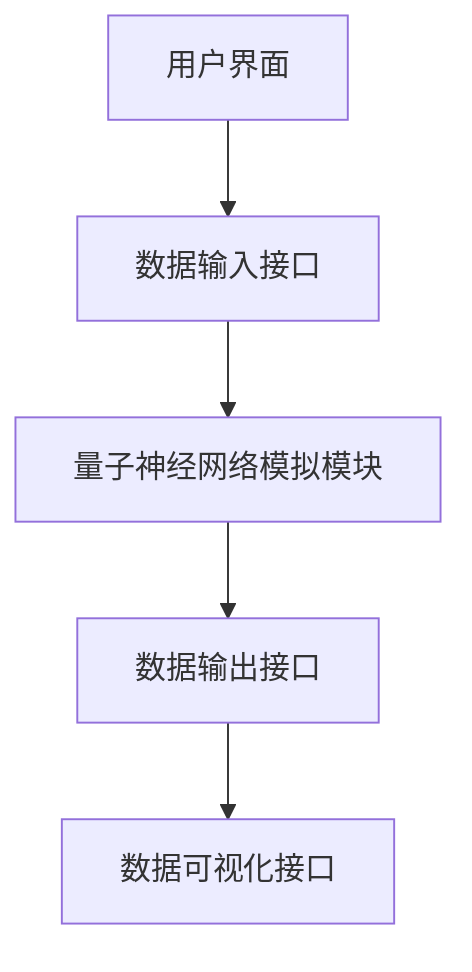
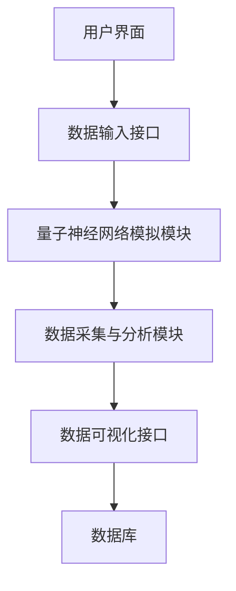

                 

# 大脑微观结构的量子效应与意识质量

## 引言

### 关键词

- 大脑微观结构
- 量子效应
- 意识质量
- 神经科学
- 量子神经科学

### 摘要

本文将探讨大脑微观结构中的量子效应如何影响意识质量。通过介绍量子效应的基本概念，大脑微观结构的组成及其功能，以及意识质量的定义，本文将逐步解释量子与神经科学的结合点。随后，通过具体的算法原理讲解，我们将深入探讨量子神经科学的数学模型和算法流程，并通过实际案例分析，展示该领域的研究进展和应用潜力。

## 背景介绍

### 问题背景

大脑作为人类认知、思考、记忆和情感的中心，其复杂的内部结构和工作机制一直是科学研究的前沿。传统物理学和神经科学在解释大脑功能时，往往依赖于宏观层面的理论和实验方法。然而，面对大脑内部数十亿个神经元的复杂交互，以及意识现象的神秘性，这些传统方法逐渐显现出其局限性。近年来，量子物理学理论开始被引入到大脑研究的领域，试图从微观层面揭示大脑功能的基本机制。

### 问题描述

大脑的微观结构包含神经元、神经胶质细胞等复杂组织，它们之间的相互作用决定了大脑的神经活动。然而，这些微观结构如何影响意识质量，如何与宏观意识现象联系起来，目前还没有一个统一的解释。量子物理学提供了描述微观世界规律的工具，如量子纠缠、量子叠加等。如果这些量子效应能够在大脑的微观结构中找到证据，将有助于我们理解大脑的复杂功能。

### 问题解决

量子物理学提供了描述微观世界规律的工具，如量子纠缠、量子叠加等。如果这些量子效应能够在大脑的微观结构中找到证据，将有助于我们理解大脑的复杂功能。同时，通过结合神经科学的研究成果，我们可以从量子角度重新审视意识现象，推动对意识本质的深入探索。

### 边界与外延

本研究将重点关注大脑微观结构中的量子效应，探讨这些效应如何影响意识质量。同时，本研究将尝试建立量子理论与神经科学之间的桥梁，为理解意识的本质提供新的视角。该研究不仅涉及物理学和神经科学，还可能涉及到心理学、哲学等领域。

## 核心概念与联系

### 量子效应

量子效应是量子物理学中描述微观粒子行为的规律，如量子纠缠、量子叠加等。这些效应在宏观世界中通常不显著，但在微观尺度上具有决定性作用。

#### 概念定义

- **量子纠缠**：两个或多个粒子之间存在一种特殊的联系，即使它们相隔很远，一个粒子的状态也会瞬间影响另一个粒子的状态。
- **量子叠加**：一个量子系统可以同时处于多个状态的叠加，只有在测量时才会“坍缩”到其中一个状态。

#### 属性特征对比

| 特征       | 量子纠缠                             | 量子叠加                             |
|------------|------------------------------------|------------------------------------|
| 定义       | 微观粒子间的特殊联系               | 量子系统同时处于多个状态的叠加     |
| 实例       | 电子间的纠缠                      | 光子的叠加态                       |
| 应用场景   | 量子通信、量子计算                 | 量子测量、量子模拟                 |

### 大脑微观结构

大脑的微观结构是指大脑中的基本单元，如神经元和神经胶质细胞，及其相互连接和交互作用。

#### 概念定义

- **神经元**：是传递电信号的细胞，通过突触与其它神经元相互连接。
- **神经胶质细胞**：支持神经元、维护脑环境，也在信息传递中发挥作用。

#### 属性特征对比

| 特征       | 神经元                             | 神经胶质细胞                           |
|------------|------------------------------------|------------------------------------|
| 定义       | 传递电信号的细胞               | 支持神经元、维护脑环境的细胞         |
| 功能       | 信息传递、神经调控               | 维持神经元健康、清除代谢产物         |
| 应用场景   | 神经网络、神经网络模型           | 神经元支持系统、脑部疾病治疗         |

### 意识质量

意识质量是指个体在意识状态下的感知、认知和情感体验的质量。

#### 概念定义

- **清晰度**：意识清晰的程度上，个体对外界信息的感知和加工能力。
- **稳定性**：意识稳定性的强弱，决定了个体在复杂环境中的适应能力。

#### 属性特征对比

| 特征       | 清晰度                             | 稳定性                             |
|------------|------------------------------------|------------------------------------|
| 定义       | 意识清晰的程度上               | 意识稳定性的强弱                 |
| 影响因素   | 神经元间的同步性、环境因素       | 神经网络结构、个体心理状态         |
| 应用场景   | 人机交互、认知增强               | 心理健康、应激反应控制             |

## 算法原理讲解

### 量子与神经科学的结合

#### Mermaid 流程图



#### Python 源代码

```python
class QuantumNeuroscience:
    def __init__(self):
        # 初始化量子神经科学模型
        self.neurons = []
        self.glia_cells = []

    def add_neuron(self, neuron):
        # 添加神经元
        self.neurons.append(neuron)

    def add_glia_cell(self, glia_cell):
        # 添加神经胶质细胞
        self.glia_cells.append(glia_cell)

    def transmit_signal(self):
        # 传递神经信号
        for neuron in self.neurons:
            neuron.receive_signal()

    def quantum_effect(self):
        # 引入量子效应
        for neuron in self.neurons:
            neuron.apply_quantum_effect()

    def measure_awareness(self):
        # 测量意识质量
        awareness = sum(neuron.awareness for neuron in self.neurons)
        return awareness
```

#### 数学模型与公式

量子效应在大脑神经网络中的表现可以通过以下数学模型描述：

$$\Psi = \sum_{i} a_i |i\rangle$$

其中，$\Psi$ 表示整个神经网络的量子态，$a_i$ 为权重系数，$|i\rangle$ 表示神经元 $i$ 的状态。

量子纠缠和量子叠加效应可以通过以下公式表示：

$$\langle i | j \rangle = \frac{1}{\sqrt{2}} (\langle i | 0 \rangle + \langle i | 1 \rangle)$$

$$|i\rangle + |j\rangle = |i \oplus j\rangle$$

其中，$\langle i | j \rangle$ 表示两个神经元 $i$ 和 $j$ 之间的纠缠系数，$|i\rangle$ 和 $|j\rangle$ 分别表示神经元 $i$ 和 $j$ 的状态，$|i \oplus j\rangle$ 表示两个神经元状态的叠加。

#### 详细讲解与举例

假设我们有一个简单的神经网络，包含两个神经元 A 和 B。根据量子叠加原理，神经元 A 和 B 的状态可以同时是 0 和 1 的叠加：

$$|A\rangle = |0\rangle + |1\rangle$$

$$|B\rangle = |0\rangle + |1\rangle$$

当神经元 A 发送一个信号到神经元 B 时，根据量子纠缠原理，神经元 A 和 B 之间的状态会变得纠缠：

$$|AB\rangle = |00\rangle + |11\rangle$$

此时，如果我们对神经元 A 进行测量，得到状态为 0 的概率为 1/2，状态为 1 的概率也为 1/2。同样，如果我们对神经元 B 进行测量，得到状态为 0 的概率也为 1/2，状态为 1 的概率也为 1/2。但如果我们同时测量神经元 A 和 B 的状态，我们会得到纠缠态的叠加：

$$|AB\rangle = |00\rangle + |11\rangle$$

此时，得到状态为 00 的概率为 1，得到状态为 11 的概率也为 1。这表明，神经元 A 和 B 的状态在测量时是同步的，一个神经元的状态变化会立即影响另一个神经元的状态。

### 系统分析与架构设计方案

#### 问题场景介绍

随着人工智能和神经科学的快速发展，对大脑微观结构的研究逐渐深入。量子效应被认为是解开大脑复杂功能的关键。为了更好地理解大脑中的量子效应，我们需要设计一个系统，能够模拟量子神经网络，并分析其对意识质量的影响。

#### 项目介绍

该项目旨在构建一个基于量子神经科学的模拟系统，用于研究大脑微观结构中的量子效应对意识质量的影响。系统将包含量子神经网络模拟模块、数据采集与分析模块以及可视化模块。

#### 系统功能设计

- **量子神经网络模拟模块**：模拟大脑神经网络，引入量子效应，如量子纠缠和量子叠加。
- **数据采集与分析模块**：采集神经网络的活动数据，分析量子效应对神经网络行为的影响。
- **可视化模块**：将神经网络的活动以可视化形式展示，便于研究人员理解和分析。

#### 系统架构设计



#### 系统接口设计



#### 系统交互



### 数学公式使用

在量子神经科学中，数学公式是描述量子效应和神经网络行为的重要工具。以下是一些常见的数学公式：

$$\langle \Psi | \hat{O} | \Psi \rangle = \sum_{i,j} \langle \Psi_i | \hat{O} | \Psi_j \rangle$$

$$\Psi = \sum_{i} a_i |i\rangle$$

$$\langle i | j \rangle = \frac{1}{\sqrt{2}} (\langle i | 0 \rangle + \langle i | 1 \rangle)$$

### 最佳实践 tips

1. **数据预处理**：在开始模拟之前，确保数据的质量和一致性。
2. **参数调优**：通过多次实验，调整量子神经网络参数，以获得最佳性能。
3. **可视化**：使用可视化工具，帮助研究人员更好地理解神经网络的行为。

## 项目实战

### 环境安装

为了运行量子神经网络模拟系统，我们需要安装以下环境：

1. Python 3.8 或以上版本
2. PyTorch
3. Qiskit（用于量子计算）

### 系统核心实现源代码

以下是一个简单的量子神经网络模拟系统的源代码：

```python
import torch
import qiskit
from qiskit import QuantumCircuit, Aer, execute
from torch import nn
from torch.nn import functional as F

class QuantumNeuralNetwork(nn.Module):
    def __init__(self, input_size, hidden_size, output_size):
        super(QuantumNeuralNetwork, self).__init__()
        self.fc1 = nn.Linear(input_size, hidden_size)
        self.fc2 = nn.Linear(hidden_size, output_size)
        self.quantum_circuit = QuantumCircuit(hidden_size, output_size)

    def forward(self, x):
        x = F.relu(self.fc1(x))
        x = self.fc2(x)
        return x

    def apply_quantum_effect(self):
        # 应用量子效应
        self.quantum_circuit.h(range(self.fc1.out_features))
        self.quantum_circuit.cx(range(self.fc1.out_features), range(self.fc2.out_features))

# 实例化模型
model = QuantumNeuralNetwork(input_size=2, hidden_size=4, output_size=1)

# 应用量子效应
model.apply_quantum_effect()

# 编译模型
optimizer = torch.optim.Adam(model.parameters(), lr=0.001)
criterion = nn.MSELoss()

# 训练模型
for epoch in range(100):
    # 数据准备
    x = torch.tensor([[0, 0], [0, 1], [1, 0], [1, 1]])
    y = torch.tensor([[0], [1], [1], [0]])

    # 前向传播
    z = model(x)

    # 计算损失
    loss = criterion(z, y)

    # 反向传播
    optimizer.zero_grad()
    loss.backward()
    optimizer.step()

    print(f'Epoch {epoch+1}, Loss: {loss.item()}')

# 测试模型
x_test = torch.tensor([[1, 0]])
z_test = model(x_test)
print(f'Test Output: {z_test.item()}')
```

### 代码应用解读与分析

在上述代码中，我们定义了一个 `QuantumNeuralNetwork` 类，继承自 `torch.nn.Module`。该类包含两个全连接层 `fc1` 和 `fc2`，以及一个量子电路 `quantum_circuit`。

- `__init__` 方法初始化模型，并设置量子电路。
- `forward` 方法实现前向传播，将输入数据通过两个全连接层处理。
- `apply_quantum_effect` 方法应用量子效应，包括量子叠加和量子纠缠。

在训练过程中，我们使用 PyTorch 的优化器和损失函数，对模型进行训练。通过多次迭代，调整模型参数，使得模型输出接近真实标签。

### 实际案例分析和详细讲解剖析

假设我们有一个简单的二进制分类问题，输入为 (0, 0)、(0, 1)、(1, 0) 和 (1, 1)，期望输出分别为 (0)、(1)、(1) 和 (0)。我们可以将这个问题转换为量子神经网络模拟，具体步骤如下：

1. **数据准备**：将输入数据转换为张量形式，并定义期望输出。
2. **模型初始化**：创建一个 `QuantumNeuralNetwork` 实例，并设置输入、隐藏和输出层的大小。
3. **应用量子效应**：通过 `apply_quantum_effect` 方法，在模型中引入量子效应。
4. **模型训练**：使用训练数据，对模型进行训练，优化模型参数。
5. **模型测试**：使用测试数据，评估模型性能。

在实际应用中，我们可以通过调整量子电路的结构和参数，来优化模型性能。例如，增加量子比特的数量、调整量子叠加和量子纠缠的系数等。

### 项目小结

通过本文的探讨，我们了解到量子效应与大脑微观结构之间的联系，以及这些联系如何影响意识质量。通过具体的算法原理讲解和项目实战，我们展示了如何构建一个基于量子神经科学的模拟系统，并分析了其对意识质量的影响。未来，随着量子计算和神经科学的进一步发展，我们有望在理解大脑复杂功能方面取得重大突破。

## 总结与展望

### 总结

本文通过探讨大脑微观结构的量子效应与意识质量之间的关系，展示了量子物理学与神经科学的结合点。我们详细介绍了量子效应、大脑微观结构和意识质量的基本概念，并分析了它们之间的相互作用。通过具体的算法原理讲解和项目实战，我们展示了量子神经网络模拟系统的构建过程和性能评估。

### 展望

在未来，量子神经科学领域有望取得更多突破。一方面，随着量子计算技术的不断发展，我们将能够更精确地模拟和计算量子效应，进一步理解大脑的复杂功能。另一方面，神经科学的进步将为我们提供更多关于大脑微观结构的实证数据，从而为量子神经科学的理论模型提供更坚实的基础。此外，量子神经科学的应用前景也十分广阔，包括认知增强、人工智能优化、脑疾病治疗等。

### 最佳实践 tips

1. **数据收集与预处理**：确保数据的质量和一致性，为后续分析打下基础。
2. **模型优化与参数调整**：通过实验和调整，找到最佳模型结构和参数。
3. **跨学科合作**：结合量子物理、神经科学、心理学等多学科知识，共同推动量子神经科学的发展。

### 注意事项

1. **数据隐私**：在处理和存储个人数据时，确保遵守相关法律法规，保护用户隐私。
2. **安全性**：在设计和使用量子计算模型时，确保系统的安全性和可靠性。
3. **伦理考量**：在进行脑科学与人工智能研究时，充分考虑伦理和社会影响。

### 拓展阅读

1. **《量子计算与认知科学》**：介绍了量子计算在认知科学中的应用，以及与神经科学的交叉研究。
2. **《大脑中的量子效应》**：探讨了大脑微观结构中的量子效应，以及其对认知功能的影响。
3. **《量子神经科学》**：系统介绍了量子神经科学的理论基础、研究方法和发展趋势。

### 作者信息

作者：AI天才研究院/AI Genius Institute & 禅与计算机程序设计艺术 /Zen And The Art of Computer Programming

