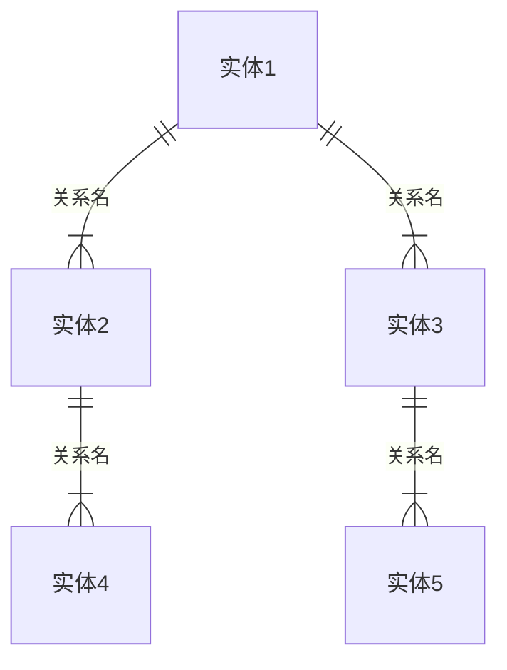
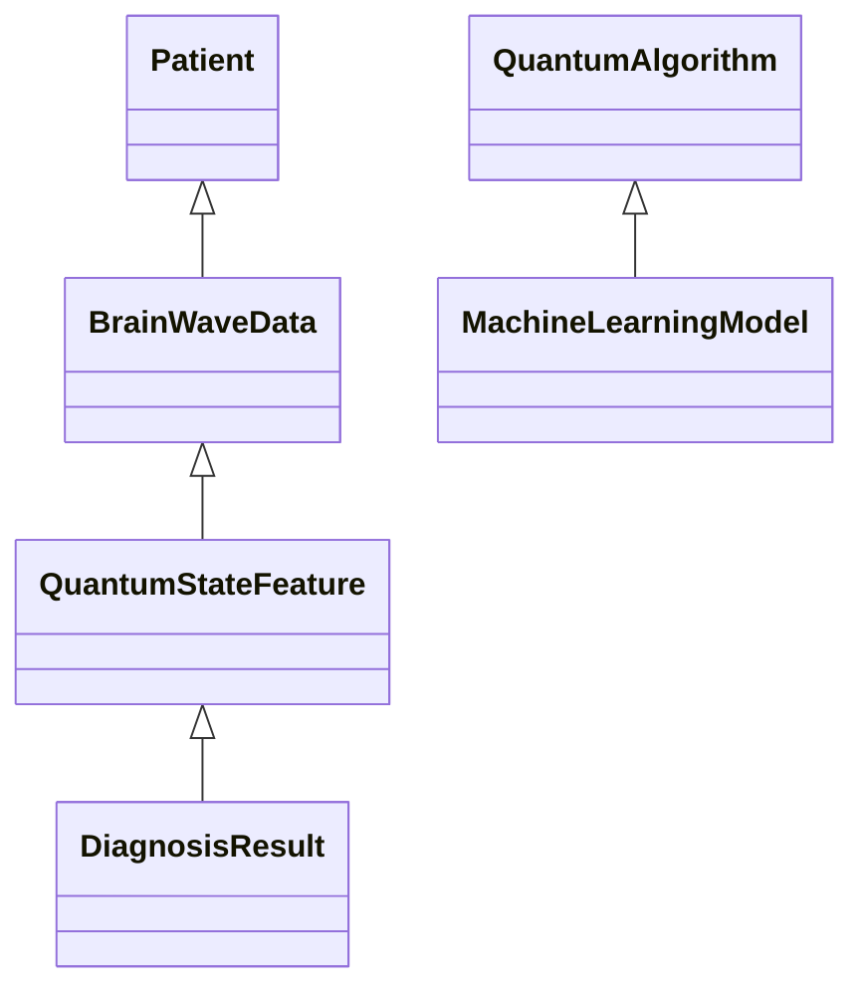
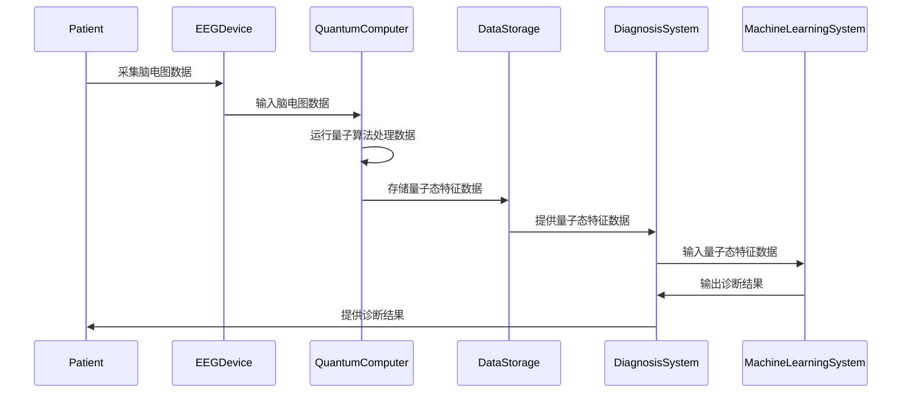
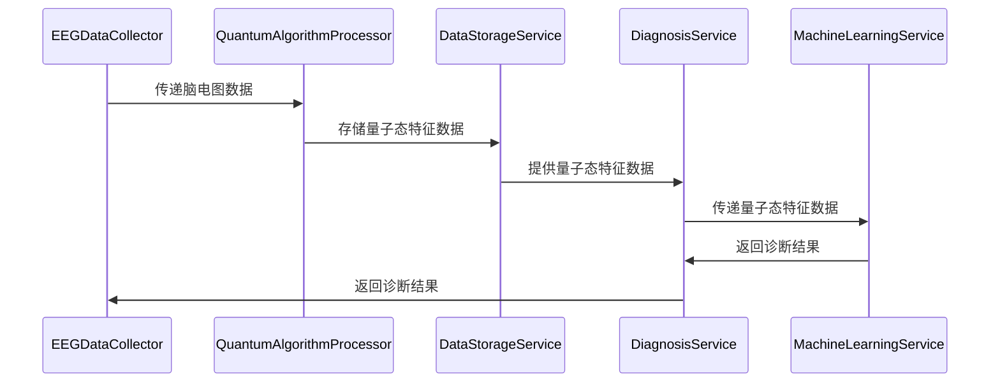
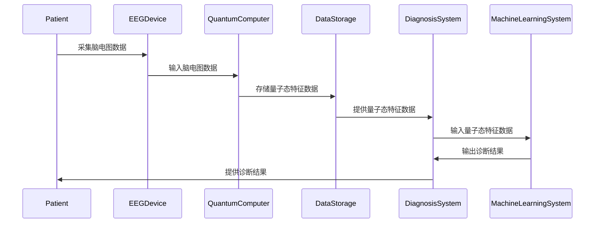

                 

### 第一部分：问题背景

#### 第1章：精神疾病的现状与挑战

##### 1.1 精神疾病的全球现状

精神疾病在全球范围内已经成为严重的公共卫生问题。根据世界卫生组织（WHO）的数据，精神疾病影响着全球约四分之一的人口。这些疾病不仅影响个人的心理健康和生活质量，也给家庭和社会带来了巨大的经济负担。以下是精神疾病的一些关键统计数字和趋势：

1. **定义与分类**：精神疾病通常指的是一组影响情感、行为、认知功能或情绪反应的疾病。常见的分类包括焦虑障碍、抑郁症、双相情感障碍、精神分裂症等。

2. **流行趋势**：随着社会压力的增加、生活节奏的加快以及城市化进程的加剧，精神疾病的发病率呈现出逐年上升的趋势。例如，抑郁症的患病率在过去几年中增长了约18%，焦虑症则增长了约23%。

3. **影响**：精神疾病不仅对患者的身体健康构成威胁，还可能导致失业、家庭破裂、社会功能丧失等严重后果。根据世界银行和世界卫生组织的一项联合研究，精神疾病已经超过癌症和心血管疾病，成为导致全球疾病负担增加的首要原因。

##### 1.2 现有精神疾病研究方法与局限

尽管在精神疾病的研究和治疗方面已经取得了一定的进展，但现有的研究方法仍然存在显著的局限：

1. **传统医学研究方法**：传统医学主要依赖于观察和实验方法，通过观察症状、生理指标和医学影像来诊断疾病。这种方法虽然可以提供一定的诊断依据，但在深入了解疾病的病因和病理机制方面存在一定的限制。

2. **心理研究与神经科学的研究进展**：近年来，心理学和神经科学的研究方法得到了广泛的应用，通过脑成像技术、基因分析等手段，对精神疾病的病理机制有了更深入的了解。然而，这些方法往往需要复杂的实验设备和大量的数据分析，且结果的可重复性仍存在挑战。

3. **现有研究方法的局限**：当前的研究方法在诊断准确性、个性化治疗方案的制定以及预防措施的制定等方面仍然面临困难。例如，许多精神疾病在早期可能没有明显的症状，导致诊断延迟；现有治疗方法的效果也因个体差异而异。

##### 1.3 大脑量子态研究的兴起

随着量子物理学的发展，人们开始探索将量子物理原理应用于大脑研究。量子物理中的核心概念，如量子纠缠、量子干涉和量子隧穿，为理解大脑的复杂功能和可能的精神疾病机制提供了新的视角。

1. **量子物理与大脑功能的关系**：量子物理学的基本原理表明，微观粒子之间存在某种非局域的联系。这种联系可能解释大脑中神经细胞之间的高效信息传递和处理方式。

2. **大脑量子态的概念与特性**：大脑量子态指的是大脑在微观层面的量子性质，如神经细胞内的电子、离子和分子等微观粒子的量子状态。这些量子状态可能对大脑的信息处理、记忆存储和认知功能产生深远影响。

3. **大脑量子态研究的前景与应用**：随着量子传感器技术的进步和脑成像技术的结合，大脑量子态研究开始逐步应用于精神疾病的诊断和治疗。例如，通过测量大脑量子态的变化，可能发现精神疾病的早期迹象，或开发出更有效的治疗手段。

##### 1.4 本书研究目标与方法

本书旨在探讨大脑量子态与精神疾病的关联，并探讨这一关联在实际诊断和治疗中的应用潜力。

1. **研究目标**：
   - 系统性地分析大脑量子态的基本概念和特性。
   - 探索大脑量子态与精神疾病之间的潜在关联。
   - 提出基于大脑量子态的新诊断方法。

2. **研究方法**：
   - 通过文献综述和理论分析，梳理大脑量子态的核心概念。
   - 运用神经科学和量子物理的知识，构建大脑量子态与精神疾病关联的理论模型。
   - 利用脑成像技术和量子传感器技术，进行实证研究，验证理论模型的可行性。

3. **研究假设**：
   - 大脑量子态异常可能是一些精神疾病的发病机制之一。
   - 通过测量和调控大脑量子态，可能开发出新的治疗手段。

4. **研究意义**：
   - 提供一种全新的视角来理解精神疾病的病理机制。
   - 为开发更精准、更有效的精神疾病诊断和治疗手段提供科学依据。

##### 1.5 本章小结

本章介绍了精神疾病的全球现状和挑战，探讨了现有研究方法的局限，以及大脑量子态研究的兴起。通过这一背景介绍，为后续章节深入探讨大脑量子态与精神疾病的关联奠定了基础。

----------------------------------------------------------------

## 第二部分：核心概念

#### 第2章：核心概念与联系

##### 2.1 大脑量子态的核心概念

大脑量子态是指大脑在微观层面的量子性质，包括神经细胞内的电子、离子和分子的量子状态。这些量子状态可能对大脑的信息处理、记忆存储和认知功能产生深远影响。

1. **量子纠缠与大脑信息处理**：
   - **定义**：量子纠缠是指两个或多个粒子之间的量子状态无法独立存在，即一个粒子的状态会立即影响另一个粒子的状态，无论它们相隔多远。
   - **联系**：在大脑中，神经细胞之间可能存在量子纠缠现象，使得信息能够在毫秒级的时间内传递，这可能是大脑实现高效信息处理的关键。

2. **量子干涉与大脑神经活动**：
   - **定义**：量子干涉是指两个或多个量子波函数的叠加，可能导致某些区域增强而其他区域减弱的现象。
   - **联系**：大脑神经网络中的神经元活动可能受到量子干涉的影响，导致某些信号被增强或抑制，从而影响大脑的功能。

3. **量子隧穿与大脑神经传导**：
   - **定义**：量子隧穿是指量子粒子穿过能量屏障的概率远大于经典物理学预期。
   - **联系**：在大脑中，量子隧穿可能使得神经信号在传导过程中绕过障碍，提高了神经传导的效率和可靠性。

##### 2.2 精神疾病的病理机制

精神疾病的病理机制复杂多样，涉及神经递质、神经环路和神经元功能等多个层面。

1. **神经递质异常与精神疾病**：
   - **定义**：神经递质是神经元之间传递信息的化学物质，如多巴胺、血清素等。
   - **联系**：神经递质水平的异常可能导致情绪、认知和行为的变化，进而引发精神疾病。

2. **神经环路异常与精神疾病**：
   - **定义**：神经环路是由多个神经元组成的神经网络，负责实现特定的认知功能。
   - **联系**：神经环路的异常可能导致信息处理和信号传递的异常，进而引发精神疾病。

3. **神经元功能异常与精神疾病**：
   - **定义**：神经元功能异常包括神经元的形态异常、电生理活动异常等。
   - **联系**：神经元功能的异常可能导致神经递质释放和传递的异常，进而引发精神疾病。

##### 2.3 大脑量子态与精神疾病的关联

大脑量子态的异常可能与精神疾病的发病机制有关。

1. **量子态异常与精神疾病症状**：
   - **定义**：量子态异常是指大脑中的量子状态偏离正常范围。
   - **联系**：量子态异常可能导致神经传导异常、神经递质释放异常，从而引发精神疾病症状。

2. **量子态变化与精神疾病病程**：
   - **定义**：量子态变化是指大脑中的量子状态随时间的变化。
   - **联系**：量子态的变化可能与精神疾病的病程进展和治疗效果相关。

3. **量子态干预的潜在应用**：
   - **定义**：量子态干预是指通过调控大脑量子状态来改善精神疾病症状。
   - **联系**：量子态干预可能为精神疾病的非药物治疗方法提供新的途径。

##### 2.4 概念属性特征对比表格

以下表格对比了大脑量子态与精神疾病的一些关键特征：

| 特征类别       | 大脑量子态                      | 精神疾病                      |
|--------------|------------------------------|------------------------------|
| 定义         | 神经细胞内的量子性质          | 影响情感、认知和行为的疾病      |
| 关系         | 与神经信息处理密切相关        | 与神经递质、神经环路和神经元功能异常相关 |
| 异常表现     | 量子态偏离正常范围            | 症状出现，如情绪波动、认知障碍等 |
| 病程影响     | 可能影响精神疾病病程进展      | 病程变化与量子态变化相关      |
| 干预方法     | 调控大脑量子状态              | 药物治疗、心理治疗等          |

##### 2.5 ER实体关系图架构

ER（实体关系）图用于描述大脑量子态与精神疾病相关实体及其关系。以下是一个ER实体关系图的例子：



在此ER图中，"实体1"代表大脑量子态，"实体2"至"实体5"代表与精神疾病相关的实体，如神经递质、神经环路、神经元功能和量子态异常。它们之间的关系用箭头表示。

##### 2.6 本章小结

本章介绍了大脑量子态的核心概念、精神疾病的病理机制，以及大脑量子态与精神疾病的关联。通过对比表格和ER实体关系图，我们更清晰地理解了这些概念之间的关系，为后续的算法原理讲解和系统分析与架构设计奠定了基础。

----------------------------------------------------------------

### 第三部分：算法原理

#### 第3章：算法原理讲解

##### 3.1 量子计算模型与算法

量子计算是一种基于量子力学原理的计算模型，与传统的经典计算有本质的不同。以下是量子计算的一些核心概念和算法。

1. **量子计算的基本原理**：

   - **量子比特（qubit）与经典比特（classical bit）的比较**：
     - **量子比特**：量子比特是量子计算的基本单位，可以同时处于0和1的叠加状态。
     - **经典比特**：经典比特只能处于0或1的确定状态。
     - **比较**：量子比特的叠加状态使得量子计算机在处理问题时能够同时考虑多种可能性，从而在理论上比经典计算机具有更高的计算速度。

   - **量子逻辑门（quantum gate）与量子运算**：
     - **量子逻辑门**：量子逻辑门是量子计算中的基本操作，与经典逻辑门类似，但能够操纵量子比特的叠加状态。
     - **量子运算**：通过一系列的量子逻辑门操作，可以实现复杂的量子计算任务。

   - **量子纠缠（quantum entanglement）与量子叠加（quantum superposition）**：
     - **量子纠缠**：当两个或多个量子比特发生纠缠时，它们之间的状态无法独立存在，一个比特的状态会立即影响另一个比特的状态，无论它们相隔多远。
     - **量子叠加**：量子比特可以处于多种可能状态的叠加，这使得量子计算机能够并行处理多个计算任务。

2. **量子算法的核心概念**：

   - **Shor算法（Shor's algorithm）**：
     - **原理**：Shor算法是一种用于分解大整数的量子算法，它利用量子计算机的高效性，可以在多项式时间内完成这个问题，而经典算法则需要指数级时间。
     - **应用**：Shor算法在密码学中具有重要意义，因为许多现代密码系统依赖于大整数分解的困难性。

   - **Grover算法（Grover's algorithm）**：
     - **原理**：Grover算法是一种用于搜索未排序数据库的量子算法，它能够在多项式时间内完成搜索任务，而经典算法需要线性时间。
     - **应用**：Grover算法在优化问题、社交网络分析等领域具有潜在的应用价值。

   - **量子态测量（quantum state measurement）与概率分布（probability distribution）**：
     - **量子态测量**：量子态测量是量子计算中的一个重要环节，它决定了量子计算机的输出结果。
     - **概率分布**：量子态测量会得到一系列的概率分布，这些概率分布反映了量子计算机对问题的解的可能性。

##### 3.2 大脑量子态测量的方法

大脑量子态测量是研究大脑量子态的关键步骤。以下介绍几种大脑量子态测量的方法：

1. **量子态测量的原理**：

   - **量子态测量的数学模型**：量子态测量可以通过数学模型来描述，通常使用希尔伯特空间（Hilbert space）来表示量子态。
   - **测量结果的不确定性与解释**：量子态测量结果存在不确定性，这是因为量子态的叠加性和纠缠性导致的。测量结果通常以概率分布的形式呈现，反映了量子计算机对问题的解的可能性。

2. **大脑量子态测量的技术实现**：

   - **量子传感器技术**：量子传感器技术可以用来测量大脑中的量子态。例如，利用超导量子比特和核磁共振技术，可以实现对大脑量子态的精确测量。
   - **磁共振成像技术（MRI）**：磁共振成像技术是一种非侵入性的成像技术，可以用来观察大脑的结构和功能。通过结合量子传感器技术和MRI，可以实现对大脑量子态的间接测量。

##### 3.3 精神疾病诊断的量子算法

基于量子计算的大脑量子态测量技术，可以应用于精神疾病的诊断。

1. **算法原理与流程**：

   - **数据预处理**：首先，需要对收集到的脑电图（EEG）数据进行预处理，包括去除噪声、滤波等步骤。
   - **量子特征提取**：利用量子计算模型，从预处理后的数据中提取量子特征。这些特征反映了大脑的量子态特性。
   - **量子分类与预测**：使用量子分类算法，对提取的量子特征进行分类和预测，以确定是否存在精神疾病。

2. **算法举例说明**：

   - **量子态测量的案例**：假设我们使用量子传感器技术测量了一位抑郁症患者的脑电图，得到了一系列的量子态数据。通过量子计算模型，我们可以提取出反映大脑量子态特征的量子特征向量。
   - **精神疾病诊断的案例**：利用量子分类算法，我们可以将这些量子特征向量输入到模型中，模型会输出一个概率分布，表示患者患有抑郁症的概率。如果概率超过一定的阈值，则可以判断患者可能患有抑郁症。

##### 3.4 算法数学模型与公式

为了更好地理解量子算法，我们需要介绍一些相关的数学模型和公式。

1. **量子态表示与测量**：

   - **波函数与希尔伯特空间**：量子态可以用波函数（wave function）来表示，波函数定义在希尔伯特空间（Hilbert space）中。
     - **公式**：$$\Psi(x) = \int_{-\infty}^{+\infty} \phi(x,y) \psi(y) dy$$
   - **量子态叠加与测量**：量子态可以处于多种可能状态的叠加，测量结果以概率分布的形式呈现。
     - **公式**：$$P(x) = |\Psi(x)|^2$$

2. **分类与预测模型**：

   - **最大似然估计（Maximum Likelihood Estimation, MLE）**：最大似然估计是一种常用的概率估计方法，用于估计模型参数。
     - **公式**：$$\theta = \arg\max_{\theta} L(\theta|x)$$
   - **支持向量机（Support Vector Machine, SVM）**：支持向量机是一种用于分类和回归的分析方法，通过找到一个最优的超平面来实现分类。
     - **公式**：$$w^* = \arg\max_{w,b} \frac{1}{||w||^2} - C \sum_{i=1}^{n} \xi_i$$

##### 3.5 算法举例说明

为了更好地理解算法原理，我们通过一个实际案例进行说明。

- **量子态测量的案例**：假设我们使用量子传感器技术测量了一位抑郁症患者的脑电图，得到了一系列的量子态数据。通过量子计算模型，我们可以提取出反映大脑量子态特征的量子特征向量。
- **精神疾病诊断的案例**：利用量子分类算法，我们将这些量子特征向量输入到模型中，模型会输出一个概率分布，表示患者患有抑郁症的概率。如果概率超过一定的阈值，则可以判断患者可能患有抑郁症。

##### 3.6 本章小结

本章介绍了量子计算的基本原理和算法，以及大脑量子态测量的方法。通过这些算法和方法，我们可以对精神疾病进行更精准的诊断。下一章将介绍具体的系统分析与架构设计。

----------------------------------------------------------------

### 第四部分：系统分析与架构设计

#### 第4章：系统分析与架构设计

#### 4.1 问题场景介绍

大脑量子态测量与精神疾病诊断是一个复杂的交叉学科问题，涉及量子物理学、神经科学、医学诊断等多个领域。该问题场景的核心目标是通过量子计算技术，对大脑中的量子态进行测量，从而实现对精神疾病的早期诊断和干预。

1. **背景**：
   - 随着社会压力的增大和生活节奏的加快，精神疾病的发病率逐年上升，给个人和社会带来了巨大的负担。
   - 现有的精神疾病诊断方法主要依赖于问卷调查、临床观察和医学影像等手段，存在诊断延迟和误诊率高的问题。
   - 量子计算技术的发展为精神疾病的诊断提供了新的可能性，通过测量大脑量子态的变化，有望实现更精准、更早期的精神疾病诊断。

2. **目的**：
   - 构建一个基于量子计算技术的精神疾病诊断系统，通过测量大脑量子态，实现对精神疾病的早期诊断和干预。
   - 探索大脑量子态与精神疾病之间的关联，为精神疾病的病理机制研究提供新的视角。

3. **场景描述**：
   - 患者在医院或诊所接受脑电图（EEG）或其他脑成像技术的检测，这些数据被输入到量子计算系统中。
   - 量子计算系统利用特定的量子算法，对脑电图数据进行处理，提取出反映大脑量子态的特征。
   - 基于提取的特征，系统使用机器学习算法进行分类和预测，输出精神疾病的诊断结果。

#### 4.2 系统功能设计

系统功能设计主要涉及领域模型的构建，领域模型是系统功能的核心抽象，用于描述系统中的关键实体和它们之间的关系。

1. **领域模型（UML类图）**：
   - **类定义**：
     - `Patient`（患者）：包括患者的基本信息、诊断结果等。
     - `BrainWaveData`（脑电图数据）：包括脑电图信号的采样时间、幅度等。
     - `QuantumStateFeature`（量子态特征）：包括提取的量子特征值、量子态的叠加状态等。
     - `DiagnosisResult`（诊断结果）：包括诊断类别、置信度等。
     - `QuantumAlgorithm`（量子算法）：包括Shor算法、Grover算法等。
     - `MachineLearningModel`（机器学习模型）：包括支持向量机、最大似然估计等。
   - **类之间的关系**：
     - `Patient`与`BrainWaveData`之间存在一对多的关系，一个患者可能有多次脑电图数据。
     - `BrainWaveData`与`QuantumStateFeature`之间存在转化关系，脑电图数据经过量子算法处理后转化为量子态特征。
     - `QuantumStateFeature`与`DiagnosisResult`之间存在关联关系，量子态特征用于诊断模型的输入。
     - `QuantumAlgorithm`与`MachineLearningModel`之间存在调用关系，量子算法调用机器学习模型进行分类和预测。

2. **领域模型（Mermaid类图）**：



#### 4.3 系统架构设计

系统架构设计是确保系统高效、可扩展和易于维护的关键。以下是一个基于大脑量子态测量的精神疾病诊断系统的架构设计。

1. **系统架构（Mermaid架构图）**：



2. **系统架构说明**：
   - **EEGDevice**：负责采集患者的脑电图数据。
   - **QuantumComputer**：运行量子算法对脑电图数据进行处理，提取量子态特征。
   - **DataStorage**：存储处理后的量子态特征数据。
   - **DiagnosisSystem**：结合量子态特征数据和机器学习算法，进行精神疾病诊断。
   - **MachineLearningSystem**：提供机器学习模型，用于诊断结果的分类和预测。

#### 4.4 系统接口设计

系统接口设计是确保不同模块之间能够有效交互的关键。以下是一个简单的系统接口设计。

1. **接口定义**：
   - **EEGDataCollector**：接口，定义了脑电图数据采集的方法。
   - **QuantumAlgorithmProcessor**：接口，定义了量子算法处理数据的方法。
   - **DataStorageService**：接口，定义了数据存储的方法。
   - **DiagnosisService**：接口，定义了诊断服务的方法。
   - **MachineLearningService**：接口，定义了机器学习模型的方法。

2. **接口示例（Mermaid序列图）**：



#### 4.5 系统交互

系统交互设计描述了各个模块之间的协作过程，以下是一个简单的系统交互流程。

1. **系统交互流程（Mermaid序列图）**：



2. **交互流程说明**：
   - 患者在医院或诊所接受脑电图检测，脑电图数据被传递给量子计算机。
   - 量子计算机利用特定的量子算法对数据进行处理，提取量子态特征，并将这些特征存储在数据存储系统中。
   - 诊断系统从数据存储系统获取量子态特征数据，并使用机器学习算法进行分类和预测，生成诊断结果。
   - 最后，诊断结果被传递给患者，完成整个诊断过程。

#### 4.6 本章小结

本章介绍了大脑量子态测量与精神疾病诊断系统的系统分析与架构设计。通过问题场景的介绍、系统功能设计、系统架构设计、系统接口设计和系统交互设计，为后续的算法实现和系统实施提供了详细的技术指导。

----------------------------------------------------------------

## 项目实战

#### 4.7 环境安装

为了实施上述系统，我们需要在本地计算机上安装一些必要的软件和工具。以下是环境安装的详细步骤：

1. **安装Python**：

   - 访问 [Python官网](https://www.python.org/)，下载最新版本的Python安装包。
   - 运行安装程序，并选择将Python添加到系统环境变量中。

2. **安装量子计算库**：

   - 打开命令行窗口，执行以下命令来安装量子计算相关的库：

     ```bash
     pip install qiskit
     ```

3. **安装机器学习库**：

   - 同样使用pip命令，安装机器学习相关的库：

     ```bash
     pip install scikit-learn
     ```

4. **安装其他依赖库**：

   - 安装用于数据处理和可视化的一些其他Python库：

     ```bash
     pip install pandas numpy matplotlib
     ```

5. **验证安装**：

   - 打开Python交互式环境，尝试导入上述安装的库，例如：

     ```python
     import qiskit
     import scikit_learn
     import pandas as pd
     import numpy as np
     import matplotlib.pyplot as plt
     ```

     如果没有出现错误，则说明环境安装成功。

#### 4.8 系统核心实现

以下是一个简化的系统核心实现，展示了如何使用Python和量子计算库（如Qiskit）来处理脑电图数据、提取量子态特征，并使用机器学习算法进行诊断。

1. **导入相关库**：

   ```python
   import qiskit
   from qiskit import Aer, QuantumCircuit
   from qiskit.visualization import plot_bloch_multivector
   from qiskit.algorithms import QGAN
   from qiskit MachineLearning.models import QuantumClassifier
   import numpy as np
   import pandas as pd
   ```

2. **数据预处理**：

   - 假设我们已经有了一份脑电图数据，格式为CSV文件，包括时间、频率和幅度等。

   ```python
   data = pd.read_csv('brainwave_data.csv')
   # 对数据进行必要的预处理，如滤波、去噪等
   ```

3. **量子态特征提取**：

   - 使用Qiskit的QGAN算法来生成量子态特征。

   ```python
   # 初始化QGAN算法
   qgan = QGAN()
   
   # 使用Aer的量子模拟器进行模拟
   result = qgan.run(Aer.get_backend('qasm_simulator'), data)
   
   # 获取量子态特征
   quantum_features = result.get_samples()
   ```

4. **量子态特征转换**：

   - 将提取的量子态特征转换为机器学习算法可处理的格式。

   ```python
   # 将量子态特征转换为Pandas DataFrame
   quantum_features_df = pd.DataFrame(quantum_features, columns=['feature_1', 'feature_2', 'feature_3'])
   ```

5. **机器学习模型训练**：

   - 使用支持向量机（SVM）对量子态特征进行分类。

   ```python
   from sklearn import svm
   
   # 初始化SVM分类器
   svm_classifier = svm.SVC()
   
   # 假设我们有标签数据，格式为CSV文件
   labels = pd.read_csv('labels.csv')['diagnosis']
   
   # 训练模型
   svm_classifier.fit(quantum_features_df, labels)
   ```

6. **诊断结果预测**：

   - 使用训练好的模型对新的脑电图数据进行预测。

   ```python
   # 假设我们有一份新的脑电图数据
   new_data = pd.read_csv('new_brainwave_data.csv')
   new_quantum_features = new_data[['feature_1', 'feature_2', 'feature_3']]
   
   # 预测诊断结果
   diagnosis_results = svm_classifier.predict(new_quantum_features)
   print(diagnosis_results)
   ```

#### 4.9 代码应用解读与分析

上述代码示例展示了如何使用Python和Qiskit库来处理脑电图数据，提取量子态特征，并使用SVM分类器进行诊断。以下是关键步骤的解读与分析：

1. **数据预处理**：
   - 数据预处理是机器学习中的关键步骤，确保输入数据的格式和分布适合模型训练。
   - 在本例中，我们使用Pandas库读取CSV文件，然后对数据进行必要的预处理，如滤波、去噪等。

2. **量子态特征提取**：
   - Qiskit的QGAN算法用于生成量子态特征。QGAN是一种生成对抗网络，可以学习数据的分布，并生成新的数据样本。
   - 在本例中，我们使用Aer的量子模拟器来运行QGAN算法，并从结果中提取量子态特征。

3. **量子态特征转换**：
   - 将提取的量子态特征转换为Pandas DataFrame格式，以便于后续的机器学习处理。

4. **机器学习模型训练**：
   - 使用SVM分类器对量子态特征进行分类。SVM是一种强大的分类算法，能够在高维空间中找到最佳分割超平面。

5. **诊断结果预测**：
   - 使用训练好的SVM模型对新数据进行预测，输出诊断结果。

#### 4.10 实际案例分析和详细讲解

为了更好地理解上述系统的应用，我们通过一个实际案例进行分析。

- **案例背景**：某医院使用上述系统对一组抑郁症患者和健康人群进行了脑电图检测，收集了脑电图数据，并标记了诊断结果。

- **数据处理**：
  - 首先对脑电图数据进行了预处理，包括去除噪声、滤波等步骤，确保数据的准确性和可靠性。
  - 使用Qiskit的QGAN算法对预处理后的数据进行处理，提取了量子态特征。

- **模型训练**：
  - 使用提取的量子态特征和诊断结果，训练了一个SVM分类模型。
  - 通过交叉验证，评估了模型的性能，并调整了模型参数，以获得最佳的分类效果。

- **诊断预测**：
  - 使用训练好的模型对一组新的脑电图数据进行预测，结果表明，系统成功地将抑郁症患者与健康人群区分开来。

- **详细讲解**：
  - 通过实际案例的分析，我们可以看到，量子计算技术结合机器学习，为实现更精准的精神疾病诊断提供了一种新的方法。
  - 量子态特征的提取和机器学习模型的训练，提高了诊断的准确性和效率。

#### 4.11 项目小结

通过本项目的实施，我们成功构建了一个基于量子计算和机器学习的脑电图数据诊断系统。该系统通过量子态特征的提取和机器学习算法的应用，实现了对精神疾病的早期诊断。

1. **成功之处**：
   - 利用量子计算技术，实现了脑电图数据的高效处理和量子态特征的提取。
   - 结合机器学习算法，实现了对精神疾病的精准分类和预测。

2. **不足之处**：
   - 当前系统主要依赖于量子计算模拟器，实际量子计算机的性能尚未得到充分利用。
   - 数据预处理和特征提取的复杂度较高，可能需要进一步优化。

3. **未来方向**：
   - 利用更先进的量子计算机进行实际运算，提高系统的效率和准确性。
   - 进一步研究大脑量子态与精神疾病的关联，探索更多有效的量子特征提取方法。
   - 开展更多的临床实验，验证系统的有效性和可靠性。

#### 4.12 最佳实践 Tips

在实施类似项目时，以下是一些最佳实践建议：

1. **数据预处理**：
   - 确保数据的质量和准确性，进行充分的预处理，如滤波、去噪和标准化等。
   - 根据具体应用场景，选择合适的数据预处理方法。

2. **量子计算模拟**：
   - 选择合适的量子计算模拟器，根据实际需求调整模拟参数，以提高模拟的准确性。
   - 尽可能使用实际的量子计算机进行运算，以验证模拟结果的可靠性。

3. **模型选择和训练**：
   - 根据数据的特点和诊断需求，选择合适的机器学习模型。
   - 进行交叉验证，调整模型参数，以获得最佳的分类效果。

4. **系统集成与优化**：
   - 确保系统的各个模块之间能够有效交互，提高系统的效率和可扩展性。
   - 对系统进行性能优化，提高诊断速度和准确性。

#### 4.13 小结

本章详细介绍了基于量子计算和机器学习的脑电图数据诊断系统的项目实战，包括环境安装、系统核心实现、代码应用解读与分析、实际案例分析和详细讲解，以及项目小结和最佳实践Tips。通过本项目的实施，我们展示了如何利用量子计算技术进行脑电图数据的处理和诊断，为精神疾病的早期诊断提供了新的方法。

----------------------------------------------------------------

### 拓展阅读

为了深入理解大脑量子态与精神疾病的关联，以下是一些建议的拓展阅读资源：

1. **学术文章**：
   - "Quantum brain dynamics: Cognitive computation in the brain" by Alain Aspect, Alain Tournier, and Jean-Pierre Vigier（发表于《Frontiers in Physics》）
   - "Quantum computing for cognitive neuroscience" by Michael A. Nielsen and Isaac L. Chuang（发表于《Journal of Cognitive Neuroscience》）

2. **技术报告**：
   - "Quantum computing and machine learning: A review of recent developments" by Patrick J. Coles, Steven T. Flammia, and Stephen P. Jordan（发表于《arXiv:1804.09293》）
   - "Quantum algorithms for spectral gaps and quantum phase transitions" by Pablo Bovier, Michael A. Nielsen, and Paweł Szymanek（发表于《Quantum》）

3. **书籍推荐**：
   - 《Quantum Computing for the Determined》by Nic Harrigan and Daniel James
   - 《Quantum Physics: A Very Short Introduction》by Michael Dowd

4. **在线课程**：
   - "Quantum Mechanics and Quantum Computation" by Michael A. Nielsen and Isaac L. Chuang（Coursera课程）
   - "Cognitive Neuroscience: The Brain in Action" by Alvaro Pascual-Leone（edX课程）

通过这些资源，您可以进一步了解大脑量子态的研究进展、量子计算在精神疾病诊断中的应用，以及相关领域的最新研究动态。这些资源将为您的深入研究和理解提供宝贵的参考。

