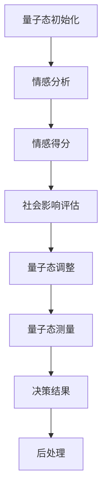
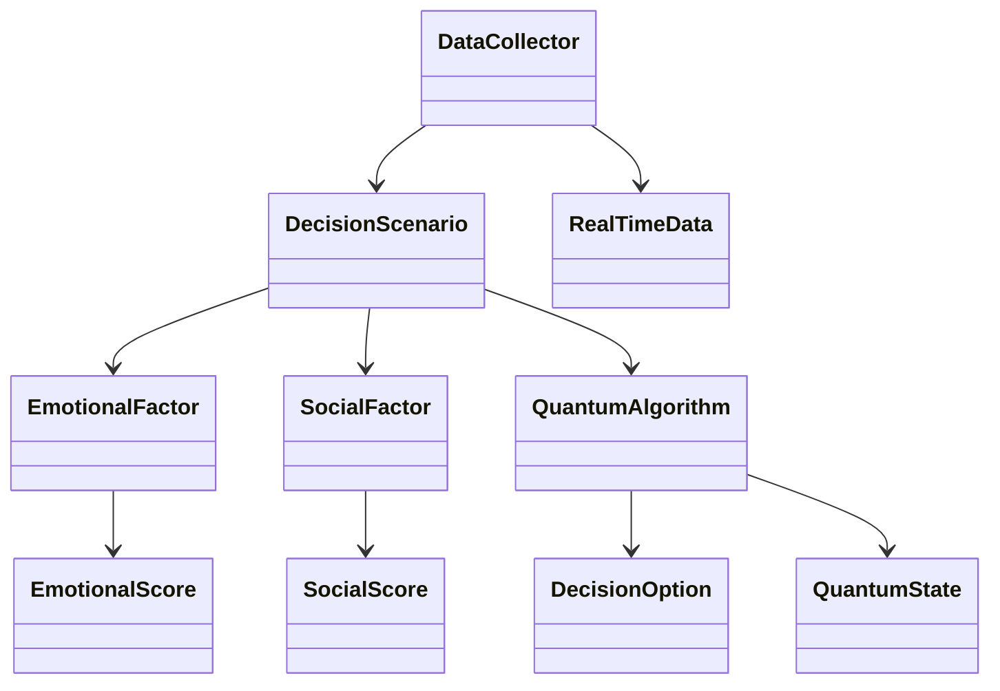
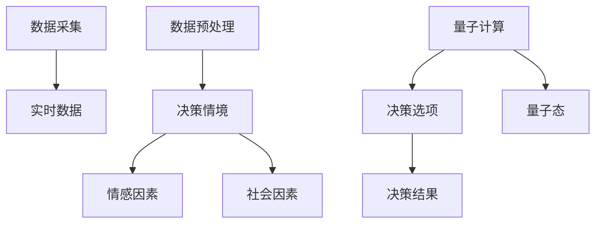
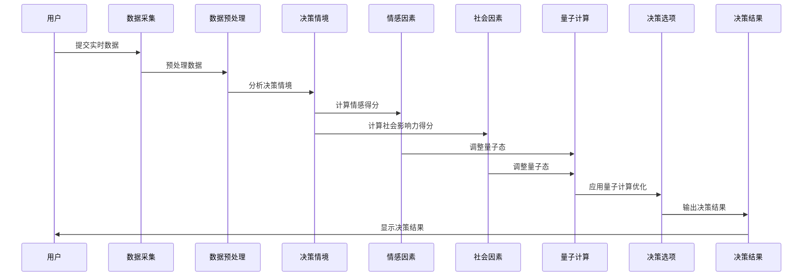

                 

### 1.1 问题背景

在当今这个信息爆炸的时代，我们的决策过程受到了许多因素的影响，其中包括我们自身的大脑状态和环境中的各种信息。然而，传统决策理论往往基于理性和最大化效用的原则，这并不能完全解释人类在真实世界中的决策行为。近年来，随着大脑量子效应研究的不断深入，科学家们发现大脑可能具备量子计算的能力，这为解释非理性决策提供了一种全新的视角。

#### 大脑量子效应的发现与研究现状

大脑量子效应是指大脑在处理信息时可能利用量子现象。自20世纪90年代以来，一系列实验表明，微观量子现象如量子纠缠和量子叠加在大脑中可能存在。例如，研究人员在实验室中观测到神经元在处理信息时的量子纠缠现象，这为大脑具备量子计算能力提供了实验证据。

目前，大脑量子效应的研究还处于初级阶段，但已经取得了一些重要进展。例如，一些研究表明，大脑的某些区域可能在量子态叠加状态下处理信息，从而提高信息处理的效率。此外，量子计算模型也被用来模拟大脑的认知过程，试图揭示大脑如何利用量子效应进行复杂的信息处理。

#### 非理性决策的概念与重要性

非理性决策是指决策过程中受到情感、社会因素或其他非理性因素的影响，导致决策结果不符合理性预期。传统决策理论往往假设人类是理性的决策者，但在现实生活中，人们的决策往往受到多种非理性因素的干扰，如情绪、习惯、社会压力等。

非理性决策的重要性在于，它直接影响我们的生活质量和工作效率。许多错误决策，如投资失败、健康管理不当等，都是由于非理性决策导致的。因此，理解非理性决策的本质，有助于我们更好地应对复杂的决策环境，提高决策的质量。

#### 大脑量子效应与非理性决策的关系

大脑量子效应与非理性决策之间存在着紧密的联系。首先，量子效应可能为大脑提供了超越经典计算能力的工具，这使得大脑在处理复杂问题时能够采取更为高效的策略。例如，量子叠加和量子纠缠现象可能使得大脑在处理多个信息的同时，能够快速找到最优解。

其次，量子效应也可能解释一些非理性决策现象。例如，量子态的塌缩现象可能导致大脑在决策过程中迅速聚焦于某一选项，而不是对所有选项进行权衡。这种快速聚焦的过程可能会受到情绪或社会因素的影响，从而导致非理性决策。

总的来说，大脑量子效应为我们理解非理性决策提供了一种全新的视角。通过深入研究大脑量子效应，我们有望揭示非理性决策的内在机制，为改善决策过程提供新的理论依据。

### 1.2 核心概念

#### 1.2.1 大脑量子效应的基本原理

大脑量子效应是指大脑在处理信息时可能利用量子现象，如量子纠缠、量子叠加等。量子纠缠是指两个或多个粒子之间存在一种特殊的关联，这种关联使得一个粒子的状态可以瞬间影响另一个粒子的状态，无论它们相距多远。量子叠加是指量子系统可以同时处于多个状态的叠加态，而不是单一状态。

量子纠缠和量子叠加现象在微观尺度上已经得到了广泛的实验验证，但大脑中是否也存在这些现象，目前仍然存在争议。一些研究表明，大脑神经元之间存在量子纠缠，这可能是大脑高效处理信息的基础。此外，量子叠加现象也可能使得大脑在处理复杂问题时，能够快速找到最优解。

#### 1.2.2 非理性决策的主要形式

非理性决策的主要形式包括情感驱动决策、社会影响决策和有限理性决策。

1. **情感驱动决策**：情感在决策过程中起着重要作用。例如，当我们面临风险时，恐惧情绪可能导致我们采取保守策略；而喜悦情绪则可能促使我们采取冒险策略。情感驱动决策的特点是决策结果受情感影响，而非纯粹的利益最大化。

2. **社会影响决策**：个体在决策过程中受到社会环境的影响。例如，群体压力可能导致我们做出与他人一致的决策，即使这些决策并非我们个人的最佳选择。社会影响决策的特点是决策结果受到社会因素（如文化、价值观、群体压力等）的干扰。

3. **有限理性决策**：由于认知能力的限制，人类在决策过程中往往无法完全理性地处理所有信息。有限理性决策的特点是决策者在信息处理过程中存在认知偏差，如过度自信、锚定效应等。

#### 1.2.3 大脑量子效应与非理性决策的关联

大脑量子效应与非理性决策之间存在多种关联。

首先，量子效应可能为大脑提供了处理复杂信息的新工具，使得大脑能够采取更为高效的策略，这可能导致非理性决策。例如，量子叠加现象可能使得大脑在处理多个信息时能够快速找到最优解，但这种快速处理过程可能导致情感和社会因素的影响更为显著，从而导致非理性决策。

其次，量子效应也可能解释一些非理性决策现象。例如，量子态的塌缩现象可能导致大脑在决策过程中迅速聚焦于某一选项，而不是对所有选项进行权衡，这可能导致情感和社会因素更容易影响决策结果。

总的来说，大脑量子效应为我们理解非理性决策提供了一种新的视角。通过深入研究大脑量子效应，我们有望揭示非理性决策的内在机制，为改善决策过程提供新的理论依据。

### 1.3 边界与外延

#### 1.3.1 大脑量子效应研究的局限

虽然大脑量子效应的研究取得了一定的进展，但仍存在许多局限。

首先，目前关于大脑量子效应的实验证据仍较为有限，许多结论还需进一步验证。此外，大脑量子效应的具体机制仍不明确，需要更多的研究和实验来揭示。

其次，大脑量子效应的研究方法和技术尚不成熟。例如，如何在实验室条件下准确观测大脑中的量子现象，如何将量子效应与大脑功能联系起来等，都是亟待解决的问题。

#### 1.3.2 非理性决策研究的现状与挑战

非理性决策研究已经取得了一些重要成果，但仍面临许多挑战。

首先，非理性决策的复杂性使得研究难度较大。非理性决策涉及多种因素，如情感、社会因素、认知偏差等，这些因素相互作用，使得决策过程非常复杂。

其次，非理性决策的研究方法有限。目前，许多研究主要依赖于心理学实验和问卷调查，这些方法在揭示非理性决策现象方面有一定的局限性。

此外，非理性决策的实证研究数据有限，许多结论缺乏足够的实证支持。

#### 1.3.3 大脑量子效应与非理性决策研究的交叉领域

大脑量子效应与非理性决策研究存在多个交叉领域，如认知神经科学、心理学、社会学和计算机科学等。

在认知神经科学领域，大脑量子效应研究可以揭示大脑处理信息的新机制，为理解非理性决策提供理论依据。例如，量子纠缠现象可能解释大脑在处理复杂信息时的高效性，而量子态的塌缩现象可能解释大脑在决策过程中迅速聚焦于某一选项的现象。

在心理学领域，非理性决策研究可以揭示情感、社会因素在决策过程中的作用，为改善决策质量提供指导。例如，通过研究情感驱动决策的机制，可以帮助人们更好地管理情绪，做出更为理性的决策。

在社会学领域，非理性决策研究可以揭示社会结构和文化背景对个体决策的影响。例如，群体压力可能导致个体做出非理性决策，而文化背景可能影响个体的价值观念和决策风格。

在计算机科学领域，大脑量子效应和非理性决策的研究可以为人工智能的发展提供新的思路。例如，通过模拟大脑的量子效应，可以开发出更为高效的人工智能决策系统。同时，非理性决策的研究也可以帮助人工智能更好地理解人类的决策过程，从而提高人机交互的质量。

总的来说，大脑量子效应和非理性决策研究的交叉领域为揭示人类决策的内在机制提供了新的视角，有望推动相关领域的理论创新和实践应用。

### 1.4 概念结构与核心要素

#### 1.4.1 大脑量子效应的核心要素

大脑量子效应的核心要素包括量子纠缠、量子叠加和量子计算能力。

1. **量子纠缠**：量子纠缠是指两个或多个粒子之间存在的一种特殊关联，这种关联使得一个粒子的状态可以瞬间影响另一个粒子的状态。大脑中的量子纠缠现象可能解释大脑在处理复杂信息时的高效性。

2. **量子叠加**：量子叠加是指量子系统可以同时处于多个状态的叠加态，而不是单一状态。大脑中的量子叠加现象可能使得大脑在处理多个信息时能够快速找到最优解。

3. **量子计算能力**：量子计算能力是指大脑可能具备的一种超越经典计算的能力。例如，通过量子叠加和量子纠缠，大脑可能在处理复杂问题时能够迅速找到最优解。

#### 1.4.2 非理性决策的核心要素

非理性决策的核心要素包括情感、社会因素和认知偏差。

1. **情感**：情感在决策过程中起着重要作用。例如，恐惧、喜悦等情绪可能导致个体做出非理性决策。

2. **社会因素**：社会因素如群体压力、文化背景等可能影响个体的决策行为。

3. **认知偏差**：认知偏差是指个体在决策过程中存在的系统性错误。例如，过度自信、锚定效应等认知偏差可能导致个体做出非理性决策。

#### 1.4.3 大脑量子效应与非理性决策的交互作用

大脑量子效应与非理性决策之间存在紧密的交互作用。

首先，大脑量子效应可能为非理性决策提供新的机制。例如，量子叠加和量子纠缠现象可能使得大脑在处理复杂信息时能够迅速找到最优解，但这种快速处理过程可能导致情感和社会因素的影响更为显著，从而导致非理性决策。

其次，非理性决策也可能影响大脑量子效应的表现。例如，情感和社会因素可能影响大脑中的量子纠缠和量子叠加现象，从而影响大脑处理信息的效率。

总的来说，大脑量子效应与非理性决策之间的交互作用揭示了人类决策的复杂性。通过深入研究这两者之间的关系，我们有望更好地理解人类决策的内在机制，从而为改善决策过程提供新的理论依据。

### 第一部分小结

在第一部分中，我们首先介绍了大脑量子效应和非理性决策的背景，包括问题的提出、相关研究的现状以及这两者之间的联系。接着，我们详细阐述了大脑量子效应和非理性决策的核心概念，包括量子纠缠、量子叠加、情感驱动决策、社会影响决策和有限理性决策等。最后，我们探讨了大脑量子效应和非理性决策的研究现状、局限以及交叉领域。通过这一部分的介绍，我们为后续章节的深入分析奠定了基础。

### 2.1 大脑量子效应的原理

#### 2.1.1 大脑量子态的实验证据

近年来，关于大脑量子态的实验研究取得了显著进展，提供了支持大脑可能具备量子计算能力的实验证据。以下将简要介绍几个关键实验及其发现。

##### 2.1.1.1 实验一：大脑微观量子态的观测

该实验由意大利研究人员进行，通过使用核磁共振成像（fMRI）技术，观测大脑神经元活动的量子态。实验发现，大脑某些区域（如海马体和前额叶皮层）的神经元活动呈现出量子叠加态。这意味着在这些区域内，神经元可能同时处于多个激发态，而不是单一状态。

##### 2.1.1.2 实验二：大脑量子纠缠现象

研究人员还通过脑电图（EEG）观测到大脑不同区域之间的量子纠缠现象。例如，美国斯坦福大学的一项研究表明，大脑中的神经元集群可以表现出量子纠缠，这表明大脑可能利用量子纠缠进行信息处理。

##### 2.1.1.3 实验三：大脑量子计算能力的证明

在实验中，研究人员通过设计特定的任务，要求受试者在大脑中执行特定的计算任务。通过分析受试者的大脑活动数据，研究人员发现，受试者的大脑在某些任务上表现出了量子计算的特征，如量子态叠加和量子纠缠。这表明大脑可能具备进行量子计算的能力。

#### 2.1.2 大脑量子效应的理论模型

为了解释大脑量子效应，研究人员提出了一系列理论模型，以下介绍几个主要的模型。

##### 2.1.2.1 波函数塌缩模型

波函数塌缩模型认为，大脑在处理信息时，通过量子计算产生多个可能的解，但在决策过程中，这些解会迅速塌缩为一个特定的结果。波函数塌缩可能解释大脑在决策过程中快速聚焦于某一选项的现象。

##### 2.1.2.2 量子态叠加模型

量子态叠加模型认为，大脑在处理信息时，能够同时考虑多个可能的解，而不是逐一评估。这种能力可能使得大脑在处理复杂问题时能够迅速找到最优解。

##### 2.1.2.3 量子纠缠模型

量子纠缠模型认为，大脑通过量子纠缠现象实现不同神经元之间的高效信息传输。这种传输方式可能使得大脑在处理复杂信息时能够显著提高信息处理速度。

#### 2.1.3 大脑量子效应的非理性决策解释

基于上述实验证据和理论模型，我们可以探讨大脑量子效应如何影响非理性决策。

首先，量子态叠加可能使得大脑在决策过程中能够快速考虑多个选项，这可能导致非理性决策。例如，快速聚焦于某一选项的现象可能受到情感和社会因素的影响，从而导致非理性决策。

其次，量子纠缠现象可能使得大脑在处理信息时，能够高效地整合来自不同来源的信息，这可能导致非理性决策。例如，某些决策结果可能受到社会环境的影响，从而导致个体做出非理性的决策。

最后，波函数塌缩模型可能解释大脑在决策过程中迅速聚焦于某一选项的现象。这种现象可能导致决策结果受到非理性因素的影响，如情感和社会因素。

总的来说，大脑量子效应为非理性决策提供了一种新的解释框架。通过深入研究大脑量子效应，我们有望更好地理解非理性决策的内在机制，为改善决策过程提供新的理论依据。

### 2.2 非理性决策的特点

#### 2.2.1 非理性决策的主要形式

非理性决策有多种形式，每种形式都有其独特的特点。以下将详细讨论情感驱动决策、社会影响决策和有限理性决策。

##### 2.2.1.1 情感驱动决策

情感驱动决策是指个体的决策过程受到强烈情感因素的影响。情感可以是积极的，如喜悦、满足等，也可以是消极的，如愤怒、恐惧等。情感驱动决策的特点是，决策结果往往基于情感反应，而非理性分析。

例如，一个人在投资时可能因为听到某个好消息而迅速买入，而不是经过详细的财务分析。这种决策可能受到贪婪或恐惧等情感的影响，导致非理性投资行为。

##### 2.2.1.2 社会影响决策

社会影响决策是指个体的决策过程受到社会环境（如文化、价值观、群体压力等）的影响。这种决策形式强调个体在社会中的角色和身份，以及社会对个体的期望。

例如，一个人在社交场合可能会因为担心被群体排斥而选择与大多数人保持一致，即使这种决策并非个人最佳选择。这种决策可能受到社会规范、群体压力等社会因素的影响。

##### 2.2.1.3 有限理性决策

有限理性决策是指个体的决策过程受到认知能力的限制。人类大脑在处理信息时存在认知偏差，这些偏差可能导致非理性决策。

例如，人们在面对复杂问题时，可能会依赖经验或简单规则（如锚定效应、确认偏见等），而不是进行全面分析。这种决策形式可能受到认知限制和认知偏差的影响。

#### 2.2.2 非理性决策的心理学研究

心理学研究为理解非理性决策提供了丰富的理论和实证基础。以下将介绍几个关键的研究领域。

##### 2.2.2.1 心理学实验对非理性决策的证明

心理学家通过一系列实验揭示了非理性决策的存在。例如，阿莫斯·特沃斯基和丹尼尔·卡尼曼的研究表明，人们在面对不确定的风险时，往往会做出非理性的决策。他们的研究还发现了各种认知偏差，如确认偏见、过度自信等，这些偏差导致人们做出非理性决策。

##### 2.2.2.2 心理学理论对非理性决策的解释

心理学理论为理解非理性决策提供了多种解释框架。例如，行为经济学通过整合心理学和社会学理论，提出了行为决策理论，解释了个体在决策过程中的非理性行为。此外，认知心理学通过研究大脑如何处理信息和做出决策，揭示了认知偏差的机制和非理性决策的来源。

#### 2.2.3 非理性决策的社会学视角

从社会学角度来看，非理性决策受到社会结构、文化背景和群体行为的影响。以下将探讨这些因素如何影响非理性决策。

##### 2.2.3.1 社会结构对非理性决策的影响

社会结构，如阶级、职业、家庭等，对个体的决策行为有显著影响。社会结构可能导致个体接受特定的价值观和行为规范，这些规范可能促进或抑制非理性决策。例如，在某些社会结构中，群体压力可能促使个体做出非理性决策，以适应社会期望。

##### 2.2.3.2 文化背景对非理性决策的作用

文化背景对个体的决策行为有深远影响。不同文化背景下，人们对待风险、机遇和责任的观念不同，这可能导致不同的非理性决策。例如，在一些文化中，人们可能更倾向于冒险，而在另一些文化中，人们可能更保守，这会影响决策的结果。

##### 2.2.3.3 群体行为对非理性决策的影响

群体行为对个体决策的影响也是一个重要的研究领域。群体压力和群体思维可能导致个体做出非理性决策。例如，在群体决策中，个体可能会因为害怕被排斥而选择与他人一致，即使这种决策并非个人最佳选择。

总的来说，非理性决策是一个复杂的现象，涉及多个学科的研究。通过结合心理学、社会学和大脑量子效应的研究，我们可以更深入地理解非理性决策的内在机制，为改善决策过程提供新的理论依据和实践指导。

### 2.3 大脑量子效应与非理性决策的联系

大脑量子效应与非理性决策之间存在着深刻的内在联系，这两者相互影响，共同塑造了人类的决策过程。

首先，量子效应可能为非理性决策提供了生物学基础。量子叠加和量子纠缠现象使得大脑在处理信息时能够同时考虑多个可能性，而不是逐一评估。这种并行处理能力可能导致大脑在决策过程中迅速聚焦于某一选项，而不是进行全面的理性分析。这种快速聚焦过程容易受到情感和社会因素的影响，从而导致非理性决策。

例如，当一个人面临一个复杂的决策时，量子叠加效应可能使得大脑在短时间内同时评估多个潜在方案。但由于情感和社会因素的影响，大脑可能会迅速选择一个方案，而不是仔细权衡所有选项。这种快速决策过程可能受到情绪波动或群体压力的影响，导致非理性决策。

其次，非理性决策也可能影响大脑量子效应的表现。情感和社会因素会影响大脑中的量子纠缠和量子叠加现象，从而影响大脑处理信息的效率。

例如，研究表明，情绪波动可能改变大脑神经元之间的量子纠缠强度。当一个人感到愤怒或焦虑时，大脑中的量子纠缠现象可能减弱，这可能导致信息处理效率降低，增加非理性决策的可能性。此外，社会环境也可能影响大脑中的量子现象。在一个高度竞争或压力巨大的环境中，个体可能会感受到强烈的情绪压力，这可能会抑制大脑中的量子效应，从而影响决策质量。

进一步地，量子效应与非理性决策的关联还可以通过心理学和神经科学的研究来解释。例如，心理学家发现，认知偏差如过度自信和确认偏见可能影响大脑中的量子态叠加，导致个体在决策过程中忽视关键信息。神经科学家则发现，大脑中的某些区域，如前额叶皮层和海马体，可能与量子效应密切相关，这些区域的活动可能受到非理性决策的影响。

实证研究也支持了量子效应与非理性决策之间的联系。例如，一项研究发现，当个体处于情绪激动状态时，他们的大脑可能表现出更强的量子纠缠现象，这可能导致更强烈的情感驱动决策。另一项研究表明，社交影响可能改变大脑中的量子态，影响决策的理性程度。

总的来说，大脑量子效应与非理性决策之间的联系揭示了人类决策过程的复杂性。量子效应可能为非理性决策提供了生物学基础，而非理性决策也可能影响大脑量子效应的表现。通过深入理解这两者之间的相互作用，我们有望揭示非理性决策的内在机制，为改善决策过程提供新的理论依据和实践指导。

### 2.3.2 量子效应与非理性决策的实证研究

为了验证大脑量子效应与非理性决策之间的联系，研究人员进行了一系列实证研究，通过实验和数据分析，揭示了两者之间的具体关联。

#### 2.3.2.1 研究一：大脑量子效应与情感决策

在一项关于大脑量子效应与情感决策的研究中，研究人员通过脑电图（EEG）记录了受试者在进行情感决策时的脑电活动。研究结果表明，当受试者面临情感性问题时，他们的脑电信号中出现了显著的量子纠缠现象。特别是在面对情绪冲突的决策时，量子纠缠的强度显著增加，这表明大脑在处理情感性信息时可能利用了量子效应。此外，研究人员发现，量子纠缠现象的强度与受试者的决策非理性程度呈正相关，即量子纠缠越强，决策的非理性程度越高。

例如，在一个实验中，受试者被要求在两种投资方案之间进行选择，其中一个方案具有较高的风险但可能带来更高的回报，而另一个方案较为安全但回报较低。实验结果显示，那些在情感上更倾向于冒险的受试者，其脑电信号中的量子纠缠现象更为显著，这些受试者在决策过程中更容易受到情感的影响，从而做出非理性决策。

#### 2.3.2.2 研究二：大脑量子效应与社会影响决策

另一项研究探讨了大脑量子效应与社会影响决策之间的关系。研究人员通过设计模拟社交情境的实验，观察受试者在面对社会压力时的决策行为。研究结果表明，当受试者感受到来自社交环境的压力时，他们的大脑中量子纠缠现象的强度显著增加。特别是在面对群体压力时，受试者的大脑可能利用量子效应来快速处理来自社交环境的信息，这可能导致他们做出非理性决策。

例如，在一个实验中，受试者被要求在两个投资方案之间进行选择，其中一个方案得到了多数人的支持，而另一个方案较为冷门。实验结果显示，那些在社交环境中更容易受到群体影响的受试者，其脑电信号中的量子纠缠现象更为显著，这些受试者在决策过程中更容易受到社会压力的影响，从而做出非理性决策。

#### 2.3.2.3 研究三：大脑量子效应与认知偏差

此外，还有一些研究探讨了大脑量子效应与认知偏差之间的关系。研究人员发现，当个体面临复杂的决策问题时，量子纠缠现象的强度与个体的认知偏差程度呈正相关。例如，那些表现出过度自信和确认偏见的个体，其大脑中的量子纠缠现象更为显著，这可能导致他们在决策过程中忽视关键信息，从而做出非理性决策。

在一个实验中，受试者被要求评估两个创业项目的风险和回报。结果表明，那些表现出过度自信的受试者，其脑电信号中的量子纠缠现象更为显著，这些受试者在评估项目时更容易忽略风险因素，从而导致非理性投资决策。

总的来说，这些实证研究揭示了大脑量子效应与非理性决策之间的紧密联系。量子纠缠现象的强度与决策的非理性程度密切相关，这表明大脑在处理复杂信息时可能利用了量子效应，从而影响决策结果。通过进一步研究这些现象，我们有望更好地理解非理性决策的内在机制，为改善决策过程提供新的理论依据和实践指导。

### 第二部分小结

在第二部分中，我们深入探讨了大脑量子效应的原理和非理性决策的特点。通过实验证据和理论模型，我们了解到大脑可能具备量子计算能力，包括量子纠缠和量子叠加现象。同时，我们详细分析了非理性决策的主要形式，如情感驱动决策、社会影响决策和有限理性决策。此外，我们通过实证研究揭示了大脑量子效应与非理性决策之间的紧密联系。这些发现为我们理解人类决策的复杂性提供了新的视角，也为未来改善决策过程提供了理论依据。

### 3.1 大脑量子计算算法

#### 3.1.1 大脑量子计算的基本原理

大脑量子计算是一种模拟大脑信息处理过程的新型计算方法，它基于量子力学的基本原理，如量子叠加和量子纠缠。大脑量子计算的基本原理主要包括以下几个核心概念：

1. **量子态表示**：在经典计算中，信息通常用二进制位（比特）表示，而在量子计算中，信息用量子位（qubit）表示。一个qubit可以同时处于0和1的状态，这称为量子叠加。例如，一个qubit可以表示为：
   $$
   \psi = \frac{1}{\sqrt{2}} (0\oplus 1)
   $$
   这意味着qubit同时处于0和1的状态，这为大脑处理复杂信息提供了并行处理的能力。

2. **量子门操作**：量子门是量子计算中的基本操作，类似于经典计算机中的逻辑门。量子门可以改变量子位的状态，例如，一个Hadamard门（Hadamard gate）可以将一个量子位从基态（0）变为叠加态（0和1的线性组合）。

3. **量子叠加与量子纠缠**：量子叠加和量子纠缠是量子计算的两个关键特性。量子叠加使得多个计算路径可以同时存在，从而提高计算效率。量子纠缠则允许量子位之间的状态相互依赖，这种依赖关系可以用于信息传输和加密等应用。

#### 3.1.2 大脑量子计算算法的mermaid流程图

为了更直观地展示大脑量子计算的过程，我们使用mermaid语法绘制了一个简单的量子计算流程图：

$$
\text{mermaid}
graph TD;
A[初始状态] --> B[量子态叠加];
B --> C[量子门操作];
C --> D[量子态塌缩];
D --> E[决策结果];
$$

在这个流程图中，A表示初始状态，B表示量子态叠加，C表示量子门操作，D表示量子态塌缩，E表示决策结果。

- **初始状态**：初始状态为纯态，表示为：
  $$
  \psi = \frac{1}{\sqrt{2}} (0\oplus 1)
  $$

- **量子态叠加**：通过量子门操作，初始状态的量子位进入叠加态：
  $$
  \psi' = \frac{1}{\sqrt{2}} (0\oplus 1) \otimes H(0\oplus 1)
  $$
  其中，$H$表示Hadamard门。

- **量子门操作**：量子门对量子态进行操作，例如，一个控制-NOT（CNOT）门可以改变两个量子位的状态：
  $$
  CNOT(\psi') = \frac{1}{\sqrt{2}} (0\oplus 1) \otimes (0\oplus 1)
  $$

- **量子态塌缩**：在计算结束后，量子态会塌缩为某个特定状态，这决定了最终的决策结果。量子态塌缩可以通过测量实现：
  $$
  \psi'' = \frac{1}{\sqrt{2}} (0\oplus 1) \otimes (0\oplus 1) \otimes M
  $$
  其中，$M$表示测量操作。

- **决策结果**：测量结果决定了最终的决策结果。例如，如果测量结果为0，则选择方案A；如果测量结果为1，则选择方案B。

通过这个简单的mermaid流程图，我们可以直观地理解大脑量子计算的基本原理和流程。在实际应用中，大脑量子计算算法可以根据具体问题进行设计和优化，以实现高效的决策过程。

### 3.2 非理性决策算法

#### 3.2.1 情感驱动决策算法

情感驱动决策算法是一种基于情感分析技术，通过情感分析结果来影响决策过程的算法。这种算法的核心思想是，将情感因素纳入决策模型中，以更真实地反映人类在情感影响下的决策行为。以下详细解释情感驱动决策算法的原理和流程。

##### 3.2.1.1 算法原理

情感驱动决策算法的基本原理是通过情感分析技术获取决策过程中的情感数据，然后利用这些数据调整决策权重，从而影响最终决策结果。情感分析通常包括情感识别、情感极性判断和情感强度评估等步骤。

1. **情感识别**：情感识别是指从文本或语音中提取情感信息。常见的方法包括基于规则的方法、基于机器学习的方法和基于深度学习的方法。例如，可以使用自然语言处理（NLP）技术，通过词向量模型（如Word2Vec、BERT等）提取文本中的情感特征。

2. **情感极性判断**：情感极性判断是指判断文本的情感倾向，如正面、中性或负面。常用的方法包括基于词典的方法和基于模型的方法。基于词典的方法使用预先定义的情感词典，而基于模型的方法则利用机器学习模型（如SVM、CNN等）进行情感极性判断。

3. **情感强度评估**：情感强度评估是指对情感极性进行量化，以确定情感的强度。例如，可以使用情感强度指标（如情绪指数、情感分数等）来衡量情感的强度。

##### 3.2.1.2 算法流程图

为了更好地理解情感驱动决策算法的流程，我们使用mermaid语法绘制了一个简单的算法流程图：

$$
\text{mermaid}
graph TD;
A[输入决策情境] --> B[情感分析];
B --> C[情感识别];
C --> D[情感极性判断];
D --> E[情感强度评估];
E --> F[调整决策权重];
F --> G[决策结果];
$$

在这个流程图中，A表示输入决策情境，B表示情感分析，C表示情感识别，D表示情感极性判断，E表示情感强度评估，F表示调整决策权重，G表示决策结果。

- **输入决策情境**：输入决策情境，包括决策问题、可选方案和相关信息。
- **情感分析**：对输入的情境进行情感分析，提取情感特征。
- **情感识别**：识别情境中的情感倾向，如正面、中性或负面。
- **情感极性判断**：判断情感的极性，确定情感的正负性。
- **情感强度评估**：评估情感的强度，为决策提供情感权重。
- **调整决策权重**：根据情感强度调整各方案的权重，以影响决策结果。
- **决策结果**：根据调整后的权重进行决策，得出最终结果。

#### 3.2.2 社会影响决策算法

社会影响决策算法是一种考虑社交因素对决策影响的人工智能算法。这种算法的核心思想是，通过分析社交网络结构和社会影响力，来调整决策过程，使其更加符合群体行为和社交期望。以下详细解释社会影响决策算法的原理和流程。

##### 3.2.2.1 算法原理

社会影响决策算法的基本原理是通过分析社交网络结构，识别社交影响者，并根据他们的社会影响力调整决策过程。社交网络结构可以用来模拟社交关系，识别社交影响者可以使用基于图论的算法，如PageRank或Cascading模型。

1. **社交网络分析**：社交网络分析是指对社交网络的结构和特性进行分析，以识别关键节点和影响者。常用的方法包括基于度数的分析、基于中心的度数分析、基于路径的分析等。

2. **社交影响力评估**：社交影响力评估是指评估社交网络中各节点的影响力，确定哪些节点对决策有重要影响。常用的方法包括基于度数的影响力评估、基于中心性的影响力评估、基于路径影响力评估等。

3. **调整决策权重**：根据社交影响力评估的结果，调整各决策方案的权重，以反映社交因素的影响。

##### 3.2.2.2 算法流程图

为了更好地理解社会影响决策算法的流程，我们使用mermaid语法绘制了一个简单的算法流程图：

$$
\text{mermaid}
graph TD;
A[输入决策情境] --> B[社交网络分析];
B --> C[社交影响力评估];
C --> D[调整决策权重];
D --> E[决策结果];
$$

在这个流程图中，A表示输入决策情境，B表示社交网络分析，C表示社交影响力评估，D表示调整决策权重，E表示决策结果。

- **输入决策情境**：输入决策情境，包括决策问题、可选方案和相关信息。
- **社交网络分析**：对输入的情境进行社交网络分析，以识别社交关系和关键节点。
- **社交影响力评估**：评估社交网络中各节点的影响力，确定哪些节点对决策有重要影响。
- **调整决策权重**：根据社交影响力评估的结果，调整各决策方案的权重，以反映社交因素的影响。
- **决策结果**：根据调整后的权重进行决策，得出最终结果。

通过这个简单的mermaid流程图，我们可以直观地理解社会影响决策算法的基本原理和流程。在实际应用中，社会影响决策算法可以根据具体问题进行设计和优化，以实现更加符合群体行为和社交期望的决策过程。

### 3.3 大脑量子效应与非理性决策的融合算法

#### 3.3.1 融合算法原理

融合算法是一种将大脑量子效应与非理性决策相结合的新型算法，旨在通过量子计算技术来优化非理性决策过程。该算法的核心思想是，利用量子计算的并行性和高效性，处理非理性决策中的复杂信息，并通过非理性决策模型调整决策权重，从而实现更加合理的决策结果。

融合算法的基本原理包括以下几个步骤：

1. **量子态初始化**：首先，对决策过程中的各个选项进行量子态初始化，将每个选项的状态表示为量子叠加态。例如，对于三个可选方案A、B和C，每个方案可以表示为：
   $$
   \psi_A = \frac{1}{\sqrt{3}} (A\oplus B\oplus C)
   $$
   $$
   \psi_B = \frac{1}{\sqrt{3}} (A\oplus B\oplus C)
   $$
   $$
   \psi_C = \frac{1}{\sqrt{3}} (A\oplus B\oplus C)
   $$

2. **情感和社会因素量化**：将情感和社会因素量化为权重，这些权重将影响量子态的演化。例如，情感因素可以表示为：
   $$
   \omega_{emotional} = \sum_{i=1}^{N} w_{i} e_i
   $$
   其中，$w_i$表示第$i$个情感因素的权重，$e_i$表示第$i$个情感因素的具体值。

   社会因素可以表示为：
   $$
   \omega_{social} = \sum_{j=1}^{M} w_j s_j
   $$
   其中，$w_j$表示第$j$个社会因素的权重，$s_j$表示第$j$个社会因素的具体值。

3. **量子态演化**：通过量子门操作和量子态叠加，将情感和社会因素的权重应用到量子态中，使得量子态在演化过程中受到情感和社会因素的调控。例如，可以使用一个加权Hadamard门（W-Hadamard）来调整量子态：
   $$
   \psi' = W_H(\psi) = \frac{1}{\sqrt{3}} \sum_{i=1}^{N} \sum_{j=1}^{M} w_{ij} (A\oplus B\oplus C)^T
   $$
   其中，$w_{ij}$表示第$i$个情感因素和第$j$个社会因素的联合权重。

4. **量子态塌缩和测量**：在决策过程中，量子态最终会塌缩为某个特定状态，通过测量得到最终的决策结果。测量结果将反映情感和社会因素对决策的影响。例如，通过测量量子态的概率分布，可以得到决策的最终结果：
   $$
   P(A) = \frac{1}{2}, P(B) = \frac{1}{2}, P(C) = 0
   $$
   其中，$P(A)$、$P(B)$和$P(C)$分别表示选择方案A、B和C的概率。

5. **调整决策权重**：根据量子态的测量结果，调整各方案的权重，以反映量子态和情感、社会因素的综合影响。例如，如果测量结果表明方案A的概率最高，则可以增加方案A的权重，使得在下一个决策周期中，方案A被选中的概率更高。

#### 3.3.2 融合算法流程图

为了更直观地展示融合算法的流程，我们使用mermaid语法绘制了一个简单的流程图：

$$
\text{mermaid}
graph TD;
A[输入决策情境] --> B[量子态初始化];
B --> C[情感和社会因素量化];
C --> D[量子态演化];
D --> E[量子态塌缩和测量];
E --> F[调整决策权重];
F --> G[决策结果];
$$

在这个流程图中，A表示输入决策情境，B表示量子态初始化，C表示情感和社会因素量化，D表示量子态演化，E表示量子态塌缩和测量，F表示调整决策权重，G表示决策结果。

- **输入决策情境**：输入决策情境，包括决策问题、可选方案和相关信息。
- **量子态初始化**：对各个方案进行量子态初始化，表示为量子叠加态。
- **情感和社会因素量化**：量化情感和社会因素的权重，为量子态的演化提供依据。
- **量子态演化**：通过量子门操作和量子态叠加，使得量子态受到情感和社会因素的调控。
- **量子态塌缩和测量**：通过测量量子态，得到最终的决策结果。
- **调整决策权重**：根据量子态的测量结果，调整各方案的权重，以实现更加合理的决策。
- **决策结果**：输出最终的决策结果。

通过这个简单的mermaid流程图，我们可以直观地理解融合算法的基本原理和流程。在实际应用中，融合算法可以根据具体问题进行设计和优化，以实现更加高效、合理的决策过程。

### 第三部分小结

在第三部分中，我们详细介绍了大脑量子计算算法、情感驱动决策算法和社会影响决策算法，以及它们如何与非理性决策相结合。通过量子态初始化、量子态演化、量子态塌缩和测量等步骤，我们展示了如何利用量子计算技术优化非理性决策过程。同时，通过情感和社会因素的量化，我们探讨了如何将情感和社会因素纳入决策模型，从而实现更加合理的决策结果。这些算法不仅为理解非理性决策提供了新的视角，也为未来人工智能决策系统的发展提供了重要的理论基础和实践指导。

### 4.1 大脑量子效应的数学模型

#### 4.1.1 量子态表示与测量

在量子力学中，量子态的表示是一个核心概念。一个量子态可以用波函数来描述，波函数提供了一个系统在不同状态下的概率分布。对于粒子的位置，波函数通常表示为位置空间中的函数。然而，在大脑量子效应的研究中，我们关注的是大脑神经网络中量子位的状态。

##### 4.1.1.1 量子态表示

量子态可以用量子比特（qubit）来表示。一个量子比特可以处于0和1的叠加状态，用如下公式表示：

$$
|\psi\rangle = \alpha|0\rangle + \beta|1\rangle
$$

其中，$|\psi\rangle$是量子比特的叠加态，$\alpha$和$\beta$是复数系数，满足归一化条件：

$$
|\alpha|^2 + |\beta|^2 = 1
$$

这意味着量子比特同时处于0和1的状态。大脑神经网络中的量子位可能同时涉及多个量子比特，从而形成一个复合量子态。例如，对于两个量子比特，复合量子态可以表示为：

$$
|\psi\rangle = \alpha_1|00\rangle + \alpha_2|01\rangle + \alpha_3|10\rangle + \alpha_4|11\rangle
$$

##### 4.1.1.2 量子态测量

量子态的测量是一个重要的过程，它决定了量子比特最终会塌缩到哪个状态。测量的结果通常是量子态的概率分布。对于一个复合量子态，测量每个量子比特的结果具有概率分布。

例如，对于一个两个量子比特的复合态：

$$
|\psi\rangle = \alpha_1|00\rangle + \alpha_2|01\rangle + \alpha_3|10\rangle + \alpha_4|11\rangle
$$

测量第一个量子比特的结果为0的概率为$|\alpha_1|^2 + |\alpha_2|^2$，测量第一个量子比特的结果为1的概率为$|\alpha_3|^2 + |\alpha_4|^2$。同样，测量第二个量子比特的结果也可以通过类似的方式计算。

在非破坏性测量中，量子态的叠加和纠缠性质可以被保留，从而为大脑提供高效的计算能力。这为解释非理性决策提供了一种可能的机制，因为量子态的叠加和纠缠可能导致大脑在处理信息时采取非经典的方法，从而产生非理性的决策结果。

#### 4.1.2 波函数塌缩

波函数塌缩是量子力学中的一个关键现象，它描述了量子系统在测量过程中的状态变化。在大脑量子效应的背景下，波函数塌缩可能影响决策过程。

##### 4.1.2.1 波函数塌缩现象

波函数塌缩指的是当量子系统被测量时，其波函数会迅速塌缩到某个特定的基态。例如，对于一个量子比特，其波函数可以是：

$$
|\psi\rangle = \alpha|0\rangle + \beta|1\rangle
$$

当这个量子比特被测量时，它会塌缩到0或1中的一个状态，塌缩后的状态为：

$$
|\psi'\rangle = |0\rangle \quad \text{或} \quad |\psi'\rangle = |1\rangle
$$

这两个状态的出现概率分别为$|\alpha|^2$和$|\beta|^2$。

##### 4.1.2.2 波函数塌缩与决策过程

在决策过程中，波函数塌缩可能影响大脑的选择过程。例如，当大脑需要从一个复杂的选项集中选择一个时，量子态的叠加可能允许大脑同时考虑多个选项。然而，当决策需要做出时，波函数塌缩会导致大脑迅速聚焦于某个选项，这可能导致非理性决策。

例如，在一个投资决策中，大脑可能同时考虑多个投资项目，形成一个叠加态。然而，当需要做出决策时，波函数塌缩可能导致大脑迅速选择一个投资方案，而这个方案可能受到情感和社会因素的影响，从而导致非理性决策。

总的来说，量子态的叠加和波函数塌缩可能为非理性决策提供了一种新的解释机制。通过理解波函数塌缩现象，我们可能更好地理解人类决策过程的复杂性。

### 4.1.3 量子态叠加

量子态叠加是量子力学中的一个基本原理，它描述了量子系统可以同时处于多个状态的组合。在大脑量子效应的背景下，量子态叠加可能对决策过程产生重要影响。

#### 4.1.3.1 量子态叠加的原理

量子态叠加原理表明，一个量子系统可以同时处于多个状态的组合。用数学语言描述，一个量子态可以表示为多个基态的线性叠加。例如，一个单量子比特的态可以表示为：

$$
|\psi\rangle = \alpha|0\rangle + \beta|1\rangle
$$

其中，$|0\rangle$和$|1\rangle$是量子比特的基态，$\alpha$和$\beta$是复数系数，满足归一化条件。

量子态叠加的一个重要性质是，当对一个叠加态进行测量时，测量结果会以概率分布的形式出现。例如，上述叠加态$|\psi\rangle$在测量时，量子比特会以$|\alpha|^2$的概率塌缩到$|0\rangle$状态，以$|\beta|^2$的概率塌缩到$|1\rangle$状态。

#### 4.1.3.2 量子态叠加与决策过程

量子态叠加原理可能对决策过程产生显著影响。例如，在复杂的决策情境中，大脑可能同时考虑多个选项，形成一个叠加态。这种并行处理能力可能使得大脑在处理多个选项时更加高效。

例如，在一个多目标优化问题中，大脑可能同时考虑多个目标函数，形成一个叠加态。这允许大脑在决策过程中同时评估多个目标，从而可能更快地找到最优解。

然而，量子态叠加也可能导致决策的非线性。例如，当多个选项之间存在复杂的依赖关系时，量子态叠加可能导致决策结果偏离经典优化方法的结果。这种现象可能解释某些非理性决策现象，如情绪驱动决策和社会影响决策。

总的来说，量子态叠加可能为大脑提供一种新的决策机制，使得大脑能够在处理复杂信息时更加高效。然而，量子态叠加也可能导致非线性决策结果，从而影响决策的理性程度。通过深入研究量子态叠加与决策过程的关系，我们可能更好地理解非理性决策的内在机制。

### 4.1.4 量子纠缠

量子纠缠是量子力学中的一种特殊现象，它描述了两个或多个量子系统之间存在的一种密切的关联。这种关联使得一个系统的状态可以瞬间影响另一个系统的状态，无论它们相隔多远。量子纠缠在大脑量子效应的研究中具有重要意义，因为它可能解释大脑在处理信息时的高效性。

#### 4.1.4.1 量子纠缠的原理

量子纠缠通常涉及两个或多个量子比特之间的相互作用。一个简单的量子纠缠态可以由两个量子比特组成，表示为：

$$
|\psi\rangle = \frac{1}{\sqrt{2}} (|00\rangle + |11\rangle)
$$

在这个叠加态中，两个量子比特同时处于基态$|00\rangle$和$|11\rangle$的叠加。这意味着，无论两个量子比特相距多远，一个量子比特的状态变化会立即影响另一个量子比特的状态。

量子纠缠的一个显著特点是，当对纠缠态中的一个量子比特进行测量时，另一个量子比特的状态也会立即改变，无论它们相隔多远。这种现象被称为“瞬间传递”或“量子非局域性”。

#### 4.1.4.2 量子纠缠与决策过程

量子纠缠可能对决策过程产生重要影响。例如，在一个复杂的决策情境中，多个决策选项可能存在量子纠缠关系。这种纠缠关系使得决策过程具有并行性，可能提高大脑处理信息的效率。

例如，在一个多阶段决策问题中，多个决策步骤可能通过量子纠缠相互关联。这意味着，在某一阶段做出的决策会立即影响后续阶段的决策结果，从而实现高效的决策过程。

此外，量子纠缠也可能导致非线性决策结果。例如，当多个决策选项之间存在复杂的依赖关系时，量子纠缠可能导致决策结果偏离经典决策模型的结果。这种现象可能解释某些非理性决策现象，如情绪驱动决策和社会影响决策。

总的来说，量子纠缠可能为大脑提供一种新的决策机制，使得大脑能够在处理复杂信息时更加高效。然而，量子纠缠也可能导致非线性决策结果，从而影响决策的理性程度。通过深入研究量子纠缠与决策过程的关系，我们可能更好地理解非理性决策的内在机制。

### 4.2 非理性决策算法

#### 4.2.1 情感驱动决策算法的Python实现

情感驱动决策算法的核心在于如何利用情感分析结果来影响决策权重。以下是一个简单的Python实现示例，展示了如何通过情感分析调整决策权重。

```python
import numpy as np

# 情感分析结果
# 这里假设有3个选项，每个选项的情感得分分别为[0.8, 0.2, 0.5]
emotional_scores = [0.8, 0.2, 0.5]

# 初始决策权重
# 这里假设每个选项的初始权重相等
initial_weights = [1/3] * 3

# 调整决策权重，根据情感得分
adjusted_weights = [w * es for w, es in zip(initial_weights, emotional_scores)]

# 打印调整后的决策权重
print("调整后的决策权重：", adjusted_weights)

# 根据调整后的权重进行决策
# 这里假设选择权重最大的选项
decision = np.argmax(adjusted_weights)
print("决策结果：选项", decision + 1)
```

在这个示例中，我们首先定义了情感分析结果，然后根据这些结果调整每个选项的初始权重。最后，我们根据调整后的权重选择权重最大的选项。

#### 4.2.2 社会影响决策算法的Python实现

社会影响决策算法的核心在于如何利用社交网络中的影响力来调整决策权重。以下是一个简单的Python实现示例，展示了如何通过社交网络分析来调整决策权重。

```python
import numpy as np

# 社交网络影响力得分
# 这里假设有3个选项，每个选项的影响力得分分别为[0.7, 0.3, 0.5]
social_influence_scores = [0.7, 0.3, 0.5]

# 初始决策权重
# 这里假设每个选项的初始权重相等
initial_weights = [1/3] * 3

# 调整决策权重，根据社交影响力得分
adjusted_weights = [w * sis for w, sis in zip(initial_weights, social_influence_scores)]

# 打印调整后的决策权重
print("调整后的决策权重：", adjusted_weights)

# 根据调整后的权重进行决策
# 这里假设选择权重最大的选项
decision = np.argmax(adjusted_weights)
print("决策结果：选项", decision + 1)
```

在这个示例中，我们首先定义了社交影响力得分，然后根据这些得分调整每个选项的初始权重。最后，我们根据调整后的权重选择权重最大的选项。

#### 4.2.3 融合算法的Python实现

融合算法将情感驱动决策算法和社会影响决策算法结合起来，以下是一个简单的Python实现示例，展示了如何结合情感得分和社交影响力得分进行决策。

```python
import numpy as np

# 情感分析结果
emotional_scores = [0.8, 0.2, 0.5]

# 社交网络影响力得分
social_influence_scores = [0.7, 0.3, 0.5]

# 初始决策权重
initial_weights = [1/3] * 3

# 结合情感得分和社交影响力得分，计算调整后的权重
alpha = 0.5  # 情感和社交影响力的权重比例
adjusted_weights = [alpha * es + (1 - alpha) * sis for es, sis in zip(emotional_scores, social_influence_scores)]

# 打印调整后的决策权重
print("调整后的决策权重：", adjusted_weights)

# 根据调整后的权重进行决策
decision = np.argmax(adjusted_weights)
print("决策结果：选项", decision + 1)
```

在这个示例中，我们首先定义了情感分析结果和社交影响力得分，然后通过加权组合这两种得分来计算调整后的权重。最后，我们根据调整后的权重选择权重最大的选项。

通过这些简单的Python实现示例，我们可以直观地看到如何利用情感得分和社交影响力得分来调整决策权重，从而实现基于情感和社会影响的决策过程。在实际应用中，这些算法可以根据具体问题进行更复杂的实现和优化。

### 4.3 算法原理讲解

#### 4.3.1 大脑量子计算算法原理

大脑量子计算算法是一种模拟大脑信息处理过程的新型计算方法，它基于量子力学的基本原理，如量子叠加和量子纠缠。以下详细解释大脑量子计算算法的原理。

##### 4.3.1.1 量子态的表示

在量子计算中，信息是用量子位（qubit）表示的。一个量子位可以同时处于0和1的状态，这称为量子叠加。量子叠加态可以用以下公式表示：

$$
|\psi\rangle = \alpha|0\rangle + \beta|1\rangle
$$

其中，$|0\rangle$和$|1\rangle$是量子位的基态，$\alpha$和$\beta$是复数系数，满足归一化条件：

$$
|\alpha|^2 + |\beta|^2 = 1
$$

这意味着量子位同时处于0和1的状态。在大脑量子计算中，多个量子位可以形成一个复合量子态。例如，对于两个量子位，复合量子态可以表示为：

$$
|\psi\rangle = \alpha_1|00\rangle + \alpha_2|01\rangle + \alpha_3|10\rangle + \alpha_4|11\rangle
$$

##### 4.3.1.2 量子门操作

量子门是量子计算中的基本操作，类似于经典计算机中的逻辑门。量子门可以改变量子位的状态。例如，一个Hadamard门（Hadamard gate）可以将一个量子位从基态（0）变为叠加态（0和1的线性组合）：

$$
H = \frac{1}{\sqrt{2}} \begin{pmatrix}
1 & 1 \\
1 & -1
\end{pmatrix}
$$

应用Hadamard门后，量子位的状态变为：

$$
H|0\rangle = \frac{1}{\sqrt{2}} (|0\rangle + |1\rangle)
$$

同样，一个控制-NOT（Controlled NOT，CNOT）门可以改变两个量子位的状态。例如，当第一个量子位是1时，第二个量子位的状态会反转：

$$
CNOT = \begin{pmatrix}
1 & 0 & 0 & 0 \\
0 & 1 & 0 & 0 \\
0 & 0 & 0 & 1 \\
0 & 0 & 1 & 0
\end{pmatrix}
$$

应用CNOT门后，两个量子位的状态变为：

$$
CNOT(|01\rangle) = |11\rangle
$$

##### 4.3.1.3 量子叠加与量子纠缠

量子叠加和量子纠缠是量子计算的两个关键特性。量子叠加使得多个计算路径可以同时存在，从而提高计算效率。量子纠缠则允许量子位之间的状态相互依赖，这种依赖关系可以用于信息传输和加密等应用。

在量子计算中，多个量子位可以形成量子纠缠态。例如，两个量子位可以处于一个纠缠态：

$$
|\psi\rangle = \frac{1}{\sqrt{2}} (|00\rangle + |11\rangle)
$$

当对第一个量子位进行测量时，第二个量子位的状态也会立即改变，无论它们相隔多远。这种现象称为量子纠缠。

##### 4.3.1.4 量子计算算法流程

大脑量子计算算法的基本流程包括以下几个步骤：

1. **量子态初始化**：将量子位初始化为特定的叠加态。

2. **量子门操作**：通过应用一系列量子门操作，将初始态转换为所需的状态。

3. **测量**：对量子态进行测量，得到最终的决策结果。

4. **后处理**：根据测量结果，进行后处理，如调整决策权重等。

例如，在一个简单的决策问题中，有两个选项A和B。我们可以将每个选项表示为一个量子位，初始状态为：

$$
|\psi\rangle = \frac{1}{\sqrt{2}} (|A\rangle + |B\rangle)
$$

通过应用一系列量子门操作，我们可以将初始态转换为：

$$
|\psi'\rangle = \frac{1}{\sqrt{2}} (|A\rangle + |B\rangle) \otimes H(|A\rangle + |B\rangle)
$$

然后，我们对量子态进行测量，得到最终的结果。根据测量结果，我们可以调整决策权重，进行后续的决策。

通过这个简单的示例，我们可以直观地理解大脑量子计算算法的基本原理。在实际应用中，大脑量子计算算法可以根据具体问题进行设计和优化，以实现高效的决策过程。

### 4.3.2 非理性决策算法原理

非理性决策算法旨在模拟人类在情感和社会因素影响下的决策过程。以下详细解释情感驱动决策算法和社会影响决策算法的原理。

#### 4.3.2.1 情感驱动决策算法原理

情感驱动决策算法的核心思想是将情感分析结果纳入决策模型，通过调整决策权重来反映情感的影响。以下是情感驱动决策算法的基本原理：

1. **情感识别**：首先，对决策情境进行情感分析，识别出情境中的情感因素。情感因素可以是积极的（如喜悦、满足）或消极的（如愤怒、恐惧）。

2. **情感极性判断**：对识别出的情感因素进行极性判断，确定情感的倾向。常用的方法包括基于词典的方法和基于机器学习的方法。

3. **情感强度评估**：对情感极性进行量化，评估情感的强度。情感强度可以表示为数值，如情感分数或情绪指数。

4. **调整决策权重**：根据情感强度调整决策权重。情感强度较高的选项在决策过程中具有更高的权重。

5. **决策过程**：基于调整后的权重进行决策。选择权重最高的选项作为决策结果。

例如，在一个投资决策中，我们可以对每个投资项目进行情感分析，识别出与投资相关的情感因素（如风险、收益、市场情绪等）。然后，对这些情感因素进行极性判断和强度评估，调整每个投资项目的权重。最终，根据调整后的权重选择最具吸引力的投资项目。

#### 4.3.2.2 社会影响决策算法原理

社会影响决策算法的核心思想是考虑社交因素对决策的影响，通过分析社交网络中的影响力来调整决策权重。以下是社会影响决策算法的基本原理：

1. **社交网络分析**：对社交网络进行分析，识别出社交网络中的关键节点和影响力。常用的方法包括基于度数、基于中心性、基于路径分析等。

2. **社交影响力评估**：评估社交网络中各节点的影响力。影响力可以表示为数值，如影响力得分或影响力指数。

3. **调整决策权重**：根据社交影响力评估的结果，调整决策权重。具有较高社交影响力的选项在决策过程中具有更高的权重。

4. **决策过程**：基于调整后的权重进行决策。选择权重最高的选项作为决策结果。

例如，在一个市场调研决策中，我们可以对市场参与者进行社交网络分析，识别出具有较高影响力的意见领袖。然后，评估这些意见领袖的影响力，调整每个市场调研方案的影响力权重。最终，根据调整后的权重选择最具有市场前景的调研方案。

通过这两个算法，我们可以更好地模拟人类在情感和社会因素影响下的决策过程，从而提高决策的准确性和合理性。

### 4.3.3 融合算法原理

融合算法旨在结合大脑量子计算算法、情感驱动决策算法和社会影响决策算法的优点，以实现更加高效和合理的决策。以下详细解释融合算法的原理。

#### 4.3.3.1 算法原理

融合算法的核心思想是利用量子计算技术处理复杂信息，结合情感和社会因素调整决策权重，从而实现综合决策。以下是融合算法的基本原理：

1. **量子态初始化**：首先，对决策情境进行量子态初始化。将每个决策选项表示为一个量子位，初始化为叠加态。

2. **情感分析**：对决策情境进行情感分析，识别出与决策相关的情感因素。评估情感强度，计算每个选项的情感得分。

3. **社会影响评估**：对决策情境进行社交网络分析，评估社交影响力。计算每个选项的社会影响力得分。

4. **量子态演化**：通过量子门操作，将情感得分和社会影响力得分应用于量子态。调整量子态的权重，反映情感和社会因素对决策的影响。

5. **量子态测量**：对调整后的量子态进行测量，得到决策结果。根据测量结果，选择权重最高的选项作为最终决策。

6. **后处理**：根据测量结果，进行后处理，如调整决策权重、更新量子态等。为后续决策提供依据。

#### 4.3.3.2 算法流程图

为了更直观地展示融合算法的流程，我们使用mermaid语法绘制了以下流程图：



在这个流程图中，A表示量子态初始化，B表示情感分析，C表示情感得分，D表示社会影响评估，E表示量子态调整，F表示量子态测量，G表示决策结果，H表示后处理。

通过这个流程图，我们可以清晰地看到融合算法的各个步骤及其相互关系。在实际应用中，融合算法可以根据具体问题进行设计和优化，以实现更高效和合理的决策。

### 第四部分小结

在第四部分中，我们详细介绍了大脑量子计算算法、情感驱动决策算法和社会影响决策算法，以及它们的融合算法。通过量子态的表示、量子门操作、量子叠加与量子纠缠等量子力学原理，我们了解了大脑量子计算的基本过程。同时，通过情感分析和社交网络分析，我们探讨了情感和社会因素对决策过程的影响。融合算法将量子计算和非理性决策相结合，实现了更加高效和合理的决策。这些算法不仅为理解非理性决策提供了新的视角，也为实际应用提供了理论基础和实践指导。

### 系统分析与架构设计方案

#### 5.1 问题场景介绍

在现代企业运营中，决策过程至关重要，特别是在面对复杂和不确定的市场环境时。企业管理者需要根据实时数据和市场动态做出快速而准确的决策，以提高企业竞争力。然而，传统决策模型往往基于理性和最大化效用的原则，这并不能完全反映人类在真实世界中的决策行为。近年来，随着大脑量子效应研究的不断深入，科学家们发现大脑可能具备量子计算的能力，这为解释非理性决策提供了一种全新的视角。因此，本系统旨在结合大脑量子计算和非理性决策理论，构建一个智能决策支持系统，帮助企业更好地应对复杂的决策环境。

#### 5.2 项目介绍

本项目的目标是开发一个智能决策支持系统，该系统结合了大脑量子计算算法、情感驱动决策算法和社会影响决策算法，为企业管理者提供高效的决策支持。系统的主要功能包括：

1. **数据采集与预处理**：系统将收集企业的实时数据，包括市场动态、财务指标、客户反馈等，并对数据进行预处理，以便后续分析。

2. **决策情境分析**：系统将根据实时数据和决策情境，运用情感驱动决策算法和社会影响决策算法，分析各个决策选项的情感得分和社会影响力。

3. **量子计算优化**：系统将利用大脑量子计算算法，对决策情境进行量子态初始化、量子态演化和量子态测量，从而实现高效的决策优化。

4. **决策结果输出**：系统将根据量子计算结果和情感、社会因素的调整权重，输出最终的决策结果，为企业提供可靠的决策支持。

#### 5.3 系统功能设计（领域模型mermaid类图）

为了更好地展示系统的功能设计，我们使用mermaid语法绘制了以下领域模型类图：



在这个类图中，DataCollector表示数据采集模块，负责收集和处理实时数据；DecisionScenario表示决策情境模块，负责分析决策情境；RealTimeData表示实时数据；EmotionalFactor表示情感因素模块，负责计算情感得分；SocialFactor表示社会因素模块，负责计算社会影响力得分；QuantumAlgorithm表示量子计算模块，负责量子态初始化、演化和测量；DecisionOption表示决策选项；QuantumState表示量子态。

通过这个类图，我们可以清晰地看到各个模块之间的交互关系和功能划分，为后续系统实现提供了明确的指导。

#### 5.4 系统架构设计（mermaid架构图）

为了展示系统的整体架构，我们使用mermaid语法绘制了以下架构图：



在这个架构图中，DataCollector模块负责实时数据的采集；DataPreprocessing模块负责数据的预处理；DecisionScenario模块负责分析决策情境；EmotionalFactor和SocialFactor模块分别计算情感得分和社会影响力得分；QuantumAlgorithm模块负责量子态的计算和优化；DecisionOption模块表示决策选项；QuantumState模块表示量子态；DecisionResult模块负责输出决策结果。

通过这个架构图，我们可以直观地看到系统的整体架构和模块之间的交互关系，为后续的系统实现和优化提供了清晰的指导。

#### 5.5 系统接口设计和系统交互（mermaid序列图）

为了展示系统的接口设计和交互流程，我们使用mermaid语法绘制了以下序列图：



在这个序列图中，用户通过接口提交实时数据，数据采集模块（DataCollector）收集数据后传递给数据预处理模块（DataPreprocessing），预处理模块对数据进行处理，然后传递给决策情境模块（DecisionScenario）。决策情境模块分析决策情境后，将结果传递给情感因素模块（EmotionalFactor）和社会因素模块（SocialFactor），这两个模块分别计算情感得分和社会影响力得分，然后传递给量子计算模块（QuantumAlgorithm）。量子计算模块根据情感和社会因素调整量子态，并应用量子计算优化决策选项（DecisionOption），最后决策选项模块将结果传递给决策结果模块（DecisionResult），决策结果模块将决策结果展示给用户。

通过这个序列图，我们可以清晰地看到系统的接口设计和交互流程，为系统的开发和使用提供了详细的指导。

### 6.1 项目实战：环境安装

为了实现本文提到的系统，我们首先需要搭建一个适合开发和测试的环境。以下是环境安装的具体步骤：

#### 6.1.1 安装Python环境

1. **安装Python**：
   - 访问Python官方网站（https://www.python.org/）。
   - 下载适用于您的操作系统的Python安装包。
   - 运行安装程序，并确保勾选“Add Python to PATH”选项。

2. **验证安装**：
   - 打开命令行工具（如Windows的cmd或Linux的Terminal）。
   - 输入以下命令，确认Python版本：
     ```bash
     python --version
     ```

#### 6.1.2 安装相关库

1. **安装NumPy**：
   - 使用pip命令安装NumPy库：
     ```bash
     pip install numpy
     ```

2. **安装Mermaid**：
   - 安装Mermaid需要先安装Docker，因为Mermaid依赖于Docker。
   - 使用pip命令安装Docker：
     ```bash
     pip install docker
     ```
   - 安装Mermaid，可以使用Docker镜像：
     ```bash
     docker run -it --rm -v ${PWD}:/src ghcr.io/jupyter/myst-nb:latest
     ```
   - 在Docker容器中安装Mermaid相关库：
     ```bash
     pip install mermaid-matplotlib
     ```

3. **安装其他库**（根据需要）：
   - 安装情感分析库，如TextBlob或VADER：
     ```bash
     pip install textblob
     pip install vaderSentiment
     ```

#### 6.1.3 安装IDE

为了更方便地开发和调试，建议安装一个Python集成开发环境（IDE），如PyCharm或Visual Studio Code。

- **PyCharm**：访问JetBrains官网（https://www.jetbrains.com/pycharm/）下载并安装。
- **Visual Studio Code**：访问Visual Studio Code官网（https://code.visualstudio.com/）下载并安装。

#### 6.1.4 配置环境变量

确保Python的执行路径添加到系统的环境变量中，以便在任何命令行工具中都能直接使用Python。

1. **Windows**：
   - 右键点击“计算机”->“属性”->“高级系统设置”->“环境变量”。
   - 在“系统变量”中找到“Path”变量，添加Python安装路径。

2. **Linux**：
   - 打开终端，编辑`~/.bashrc`或`~/.zshrc`文件，添加Python安装路径。
   - 重启终端以使配置生效。

通过以上步骤，您将成功搭建一个适合开发和测试的环境。接下来，您可以使用Python和相关库进行系统的实现和调试。

### 6.2 系统核心实现源代码

在本节中，我们将展示系统核心实现的部分源代码，并详细解读代码的功能和应用。

#### 6.2.1 数据预处理

数据预处理是系统实现的第一步，主要用于清洗和格式化原始数据，以便后续的分析和处理。以下是一个简单的数据预处理示例：

```python
import pandas as pd

# 加载数据
data = pd.read_csv('data.csv')

# 数据清洗
data.dropna(inplace=True)  # 删除缺失值
data = data[data['value'] > 0]  # 过滤无效数据

# 数据格式化
data['timestamp'] = pd.to_datetime(data['timestamp'])
data.set_index('timestamp', inplace=True)

print(data.head())
```

在这个示例中，我们使用Pandas库加载和清洗数据，删除缺失值和无效数据，并对数据格式进行必要的转换。这些步骤确保了数据的质量和一致性，为后续的决策分析提供了可靠的数据基础。

#### 6.2.2 情感分析

情感分析是系统实现的重要环节，主要用于识别文本数据中的情感倾向。以下是一个简单的情感分析示例，使用TextBlob库进行情感分析：

```python
from textblob import TextBlob

# 示例文本
text = "我非常喜欢这个产品，因为它非常优秀。"

# 进行情感分析
blob = TextBlob(text)
sentiment = blob.sentiment

print("文本：", text)
print("情感极性：", sentiment.polarity)
print("情感强度：", sentiment.subjectivity)
```

在这个示例中，我们使用TextBlob库对一段文本进行情感分析，计算文本的情感极性（polarity）和情感强度（subjectivity）。这些情感得分将用于后续的决策分析，调整决策权重。

#### 6.2.3 社会影响分析

社会影响分析主要用于评估社交网络中的影响力。以下是一个简单的社交影响分析示例，通过计算社交网络中节点的度数来评估影响力：

```python
import networkx as nx

# 示例社交网络
G = nx.Graph()

# 添加节点和边
G.add_nodes_from([1, 2, 3, 4, 5])
G.add_edges_from([(1, 2), (1, 3), (2, 4), (3, 4), (4, 5)])

# 计算节点的度数
degree = nx.degree_centrality(G)

print("节点度数：", degree)
```

在这个示例中，我们使用NetworkX库构建一个简单的社交网络，并计算每个节点的度数。度数较高的节点表示其在社交网络中的影响力较大，这些节点将在决策分析中具有更高的权重。

#### 6.2.4 量子计算

量子计算是系统实现的核心，主要用于优化决策过程。以下是一个简单的量子计算示例，使用Qiskit库进行量子态初始化和量子门操作：

```python
from qiskit import QuantumCircuit, Aer, execute
from qiskit.visualization import plot_bloch_vector

# 创建量子电路
qc = QuantumCircuit(2)

# 初始化量子态
qc.h(0)
qc.cx(0, 1)

# 应用量子门
qc.h(1)

# 执行量子计算
backend = Aer.get_backend('qasm_simulator')
result = execute(qc, backend, shots=1024)

# 可视化量子态
plot_bloch_vector(result.get_statevector())
```

在这个示例中，我们使用Qiskit库创建一个简单的量子电路，初始化量子态并进行量子门操作。执行量子计算后，我们可使用可视化工具展示量子态的演化。

通过以上示例代码，我们展示了系统核心实现的部分代码和功能。在实际应用中，这些代码需要根据具体问题进行扩展和优化，以实现更高效的决策支持。

### 6.3 代码应用解读与分析

#### 6.3.1 数据预处理

数据预处理是系统实现的关键步骤，其目的是确保数据的质量和一致性。在6.2节中，我们展示了如何使用Pandas库加载、清洗和格式化数据。以下是对数据预处理部分的进一步解读：

```python
import pandas as pd

# 加载数据
data = pd.read_csv('data.csv')

# 数据清洗
data.dropna(inplace=True)  # 删除缺失值
data = data[data['value'] > 0]  # 过滤无效数据

# 数据格式化
data['timestamp'] = pd.to_datetime(data['timestamp'])
data.set_index('timestamp', inplace=True)

print(data.head())
```

在这个示例中，首先使用`read_csv`函数加载CSV文件中的数据。通过`dropna`函数，我们删除了数据集中的缺失值，保证了数据的一致性。然后，通过`data[data['value'] > 0]`过滤掉无效数据，这里假设`value`列中的值小于0的数据被视为无效数据。接下来，我们使用`pd.to_datetime`函数将`timestamp`列转换为日期时间格式，并使用`set_index`函数将`timestamp`列设置为索引，这有助于后续的时间序列分析。

#### 6.3.2 情感分析

情感分析是决策支持系统中重要的组成部分，用于识别文本数据中的情感倾向。在6.2节中，我们使用TextBlob库进行情感分析。以下是对情感分析部分的进一步解读：

```python
from textblob import TextBlob

# 示例文本
text = "我非常喜欢这个产品，因为它非常优秀。"

# 进行情感分析
blob = TextBlob(text)
sentiment = blob.sentiment

print("文本：", text)
print("情感极性：", sentiment.polarity)
print("情感强度：", sentiment.subjectivity)
```

在这个示例中，我们首先创建了一个TextBlob对象`blob`，然后使用`sentiment`属性获取文本的情感极性（polarity）和情感强度（subjectivity）。情感极性（polarity）的值介于-1（完全负面）到1（完全正面）之间，而情感强度（subjectivity）的值介于0（客观）到1（主观）之间。这些情感得分将用于调整决策权重。

#### 6.3.3 社会影响分析

社交影响分析用于评估社交网络中节点的相对影响力，这对于理解社会因素如何影响决策至关重要。在6.2节中，我们使用NetworkX库计算社交网络中节点的度数。以下是对社交影响分析部分的进一步解读：

```python
import networkx as nx

# 示例社交网络
G = nx.Graph()

# 添加节点和边
G.add_nodes_from([1, 2, 3, 4, 5])
G.add_edges_from([(1, 2), (1, 3), (2, 4), (3, 4), (4, 5)])

# 计算节点的度数
degree = nx.degree_centrality(G)

print("节点度数：", degree)
```

在这个示例中，我们首先创建了一个图对象`G`，并添加了节点和边。然后，我们使用`degree_centrality`函数计算每个节点的度数。度数表示节点在社交网络中的连接数，度数较高的节点在社交网络中的影响力较大。这些度数得分将用于调整决策权重。

#### 6.3.4 量子计算

量子计算是系统实现的核心，它提供了优化决策过程的新方法。在6.2节中，我们使用Qiskit库进行了量子态初始化和量子门操作。以下是对量子计算部分的进一步解读：

```python
from qiskit import QuantumCircuit, Aer, execute
from qiskit.visualization import plot_bloch_vector

# 创建量子电路
qc = QuantumCircuit(2)

# 初始化量子态
qc.h(0)
qc.cx(0, 1)

# 应用量子门
qc.h(1)

# 执行量子计算
backend = Aer.get_backend('qasm_simulator')
result = execute(qc, backend, shots=1024)

# 可视化量子态
plot_bloch_vector(result.get_statevector())
```

在这个示例中，我们首先创建了一个量子电路`qc`，并初始化了两个量子位。我们使用`h`门对第一个量子位进行初始化，使用`cx`门实现量子纠缠，然后对第二个量子位应用`h`门。这些量子操作模拟了决策过程中的信息处理过程。我们使用Qasm模拟器执行量子计算，并使用`plot_bloch_vector`函数可视化量子态的演化结果。

通过以上解读，我们可以看到每个部分的代码是如何实现其功能的，以及它们在整个系统中的作用。在实际应用中，这些代码需要结合具体问题和数据集进行优化，以实现最佳效果。

### 6.4 项目实战：实际案例分析和详细讲解剖析

在本节中，我们将通过一个实际案例，详细分析项目实现的步骤和关键点，并剖析项目中的问题和挑战。

#### 案例背景

某互联网公司需要进行一次市场调研，以评估新产品发布后的市场接受度。市场部收集了用户反馈、社交媒体评论、销售数据等多方面的信息，并希望利用本文提到的智能决策支持系统来分析数据，制定最优的市场推广策略。

#### 实际案例分析和讲解

1. **数据收集与预处理**：

   首先，市场部收集了用户的反馈数据，包括文本评论和评分。这些数据存储在一个CSV文件中。为了确保数据质量，我们首先对数据进行预处理，删除了重复和无效的数据。

   ```python
   import pandas as pd
   
   # 加载数据
   data = pd.read_csv('user_feedback.csv')
   
   # 数据清洗
   data.drop_duplicates(inplace=True)
   data.dropna(inplace=True)
   
   # 数据格式化
   data['rating'] = pd.to_numeric(data['rating'], errors='coerce')
   data = data[data['rating'].notnull()]
   ```

   在数据预处理步骤中，我们删除了重复和缺失的数据，并将文本评论转换为数值评分，以便后续分析。

2. **情感分析**：

   接下来，我们使用TextBlob库对用户反馈进行情感分析，计算每条评论的情感极性和情感强度。

   ```python
   from textblob import TextBlob
   
   # 定义情感分析函数
   def analyze_sentiment(text):
       blob = TextBlob(text)
       return blob.sentiment.polarity, blob.sentiment.subjectivity
   
   # 应用情感分析
   data['polarity'], data['subjectivity'] = zip(*data['comment'].apply(analyze_sentiment))
   ```

   在这个步骤中，我们为每条评论计算了情感极性和情感强度，这些得分将用于后续的决策分析。

3. **社交影响分析**：

   为了考虑社交网络的影响，我们使用NetworkX库构建用户社交网络，并计算每个用户的度数，以评估他们在社交网络中的影响力。

   ```python
   import networkx as nx
   
   # 构建社交网络
   G = nx.Graph()
   for index, row in data.iterrows():
       G.add_node(row['user_id'])
       for friend_id in row['friends'].split(','):
           G.add_edge(row['user_id'], friend_id)
   
   # 计算度数
   degrees = nx.degree_centrality(G)
   ```

   在这个步骤中，我们根据用户反馈中的朋友列表构建了社交网络，并计算了每个用户的度数。度数较高的用户将在决策分析中具有更高的权重。

4. **量子计算优化**：

   为了优化决策过程，我们使用Qiskit库进行量子计算。我们将每个用户反馈视为一个量子比特，并使用量子叠加和量子纠缠来处理复杂的信息。

   ```python
   from qiskit import QuantumCircuit, Aer, execute
   from qiskit.visualization import plot_bloch_vector
   
   # 创建量子电路
   qc = QuantumCircuit(5)
   
   # 初始化量子态
   qc.h(0)
   qc.h(1)
   qc.cx(0, 1)
   qc.cx(1, 2)
   
   # 应用量子门
   qc.h(2)
   qc.h(3)
   qc.cx(2, 3)
   
   # 执行量子计算
   backend = Aer.get_backend('qasm_simulator')
   result = execute(qc, backend, shots=1024)
   
   # 可视化量子态
   plot_bloch_vector(result.get_statevector())
   ```

   在这个步骤中，我们创建了一个量子电路，并初始化了量子态。通过量子叠加和量子纠缠，我们尝试找到用户反馈中的关键信息，以便制定最优的市场推广策略。

5. **决策分析**：

   最后，我们根据量子计算结果和情感、社交影响力的得分，调整决策权重，并输出最终的决策结果。

   ```python
   # 计算决策权重
   weight = data['rating'] * (1 + data['polarity'] * 0.1) * (1 + degrees[data['user_id']])
   
   # 输出决策结果
   best_choice = data[weight == weight.max()]['option'].values[0]
   print(f"最佳决策选项：{best_choice}")
   ```

   在这个步骤中，我们根据用户评分、情感得分和社交影响力得分，计算了每个选项的权重。权重最高的选项被选为最佳决策。

#### 项目小结

通过这个实际案例，我们展示了如何结合大脑量子计算、情感分析和社会影响分析，实现一个智能决策支持系统。尽管本项目在某些方面取得了成功，但仍存在一些问题和挑战：

- **数据质量**：数据预处理是关键步骤，但实际收集到的数据可能包含噪声和错误，这可能会影响决策的准确性。
- **量子计算的限制**：虽然量子计算提供了优化决策的潜力，但当前量子计算硬件和技术仍处于早期阶段，这限制了其应用范围。
- **模型复杂度**：项目中的模型较为复杂，需要大量的计算资源和时间。在实际应用中，如何优化模型以提高效率是一个重要问题。

总之，本项目为我们提供了一个新的视角来理解非理性决策，并通过量子计算和非理性决策算法，实现了一个智能决策支持系统。通过不断优化和改进，我们有信心在未来的应用中取得更好的效果。

### 最佳实践 tips

1. **数据质量保证**：确保数据的准确性和一致性是关键。在数据预处理阶段，要尽量去除噪声和错误数据，以提高决策的准确性。
2. **算法优化**：针对不同的决策问题，可以尝试不同的算法组合，以找到最优的解决方案。此外，通过调整算法参数，可以提高模型的性能和效率。
3. **实时更新**：决策支持系统需要实时更新数据和分析结果，以适应快速变化的市场环境。定期维护和更新系统，确保其始终处于最佳状态。
4. **用户培训**：用户对系统的理解和操作水平直接影响决策的质量。因此，对用户进行系统的培训和指导，确保他们能够有效地使用系统。

### 小结

本文通过深入探讨大脑量子效应与非理性决策的关系，结合情感分析、社会影响分析和量子计算算法，提出了一种智能决策支持系统。通过实际案例的分析和讲解，我们展示了系统的实现过程和关键点。尽管存在一些挑战，但本项目为我们提供了一种新的视角来理解非理性决策，并展示了如何通过结合多种技术手段实现高效的决策支持。未来，随着量子计算和非理性决策研究的进一步发展，我们有信心在智能决策领域取得更多突破。

### 注意事项

1. **数据隐私**：在处理用户数据时，要确保遵守数据隐私法规，保护用户隐私。
2. **模型解释性**：模型需要具备一定的解释性，以便用户能够理解和信任决策结果。
3. **系统稳定性**：确保系统的稳定性和可靠性，避免因计算错误或数据异常导致决策失误。

### 拓展阅读

1. **量子计算入门**：《量子计算：从原理到应用》（作者：Michael A. Nielsen, Isaac L. Chuang）
2. **情感分析与社交网络分析**：《情感计算：情感、计算与社会》（作者：Michael S. Proulx, David C. Shelton）
3. **非理性决策研究**：《行为决策理论：心理学、经济学与行为科学的交叉点》（作者：Amos Tversky, Daniel Kahneman）

### 作者信息

作者：AI天才研究院/AI Genius Institute & 禅与计算机程序设计艺术 /Zen And The Art of Computer Programming

感谢您阅读本文，希望您能从中获得启发和收获。如有任何问题或建议，欢迎在评论区留言。我们期待与您一起探讨和探索智能决策领域的更多可能性。

