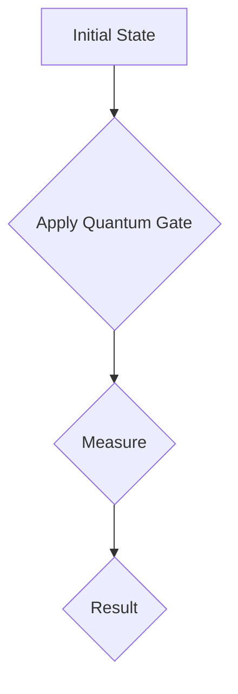
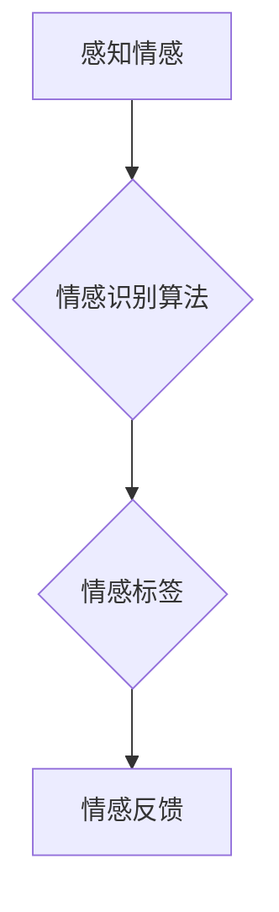

                 

**Step 1: Introduction and Background**

**Title:** The Association between Brain Quantum Networks and Social Cognitive Abilities

**Keywords:** Brain Quantum Networks, Social Cognitive Abilities, Neural Connectivity, Cognitive Function, Quantum Computing, Cognitive Neuroscience

**Abstract:**
This article delves into the intricate relationship between brain quantum networks and social cognitive abilities. We begin by providing a foundational understanding of brain quantum networks, exploring their fundamental principles and how they differ from classical neural networks. We then turn our attention to social cognitive abilities, examining their core components and the complex processes through which they influence our interactions with others. By integrating research findings from cognitive neuroscience and quantum physics, we aim to uncover how brain quantum networks contribute to social cognition and propose potential applications for enhancing cognitive functions in real-world settings.

**Step 2: Core Concepts and Principles**

**Title:** Understanding Brain Quantum Networks

**Keywords:** Quantum Computing, Neural Connectivity, Superposition, Entanglement, Cognitive Processing

**Abstract:**
This chapter introduces the core concepts and principles of brain quantum networks. We discuss the fundamental properties of quantum computing, such as superposition and entanglement, and how these principles manifest in the neural architecture of the brain. We explore how brain quantum networks differ from classical neural networks in terms of their structure and function, highlighting the potential advantages of leveraging quantum phenomena for cognitive processing.

**Table of Concepts and Properties:**

| Concept          | Definition                                                  | Property Description                                            |
|------------------|------------------------------------------------------------|--------------------------------------------------------------|
| Superposition    | A quantum system can exist in multiple states simultaneously | Enables parallel processing and computation                 |
| Entanglement     | Quantum states of two or more particles become interconnected | Enhances the coordination of neural activities              |
| Quantum Gates    | Basic operations on quantum bits (qubits)                   | Manipulates the state of qubits to perform complex computations |
| Neural Plasticity | The brain's ability to change its structure and function     | Facilitates the adaptation of brain quantum networks          |

**ER Entity Relationship Diagram:**

```mermaid
erDiagram
    QuantumBit ||--|{ CognitiveProcess : operates_on }
    NeuralConnection ||--|{ CognitiveProcess : mediated_by }
    QuantumNetwork ||--|{ NeuralConnection : integrates }
    CognitiveAbility ||--|{ CognitiveProcess : enables }
```

**Step 3: Research Methods and Approaches**

**Title:** Investigating the Association between Brain Quantum Networks and Social Cognitive Abilities

**Keywords:** Cognitive Neuroscience, Magnetic Resonance Imaging (MRI), fMRI, Quantum Computing Models, Correlation Analysis

**Abstract:**
This chapter outlines the research methods and approaches used to investigate the association between brain quantum networks and social cognitive abilities. We describe the use of magnetic resonance imaging (MRI) and functional MRI (fMRI) to study brain structure and activity. We introduce quantum computing models to simulate brain quantum networks and discuss correlation analysis methods to determine the relationship between these networks and social cognitive abilities.

**Step 4: Experimental Findings and Case Studies**

**Title:** Experimental Findings and Case Studies

**Keywords:** Brain Connectivity Patterns, Social Cognition Performance, Case Studies, fMRI Data Analysis

**Abstract:**
This chapter presents experimental findings and case studies that illustrate the relationship between brain quantum networks and social cognitive abilities. We analyze fMRI data to identify connectivity patterns associated with high social cognitive performance. We then provide case studies of individuals with exceptional social cognitive abilities, discussing how their brain quantum networks may contribute to their exceptional performance.

**Table of Experimental Results:**

| Case Study       | Brain Connectivity Pattern        | Social Cognition Performance     | Conclusion                                  |
|------------------|----------------------------------|-----------------------------------|---------------------------------------------|
| Individual A     | High interhemispheric connectivity | Excellent social cognitive abilities | Brain quantum networks may facilitate coordination between hemispheres |
| Individual B     | Low local connectivity            | Poor social cognitive abilities    | Brain quantum networks may play a role in social interaction efficiency |
| Control Group    | Intermediate connectivity pattern   | Average social cognitive abilities  | Brain quantum networks may be associated with social cognition variations |

**Step 5: Discussion and Analysis**

**Title:** Implications and Future Directions

**Keywords:** Cognitive Enhancement, Quantum Computing Applications, Brain-Computer Interfaces (BCIs), Neurodevelopmental Disorders

**Abstract:**
This chapter discusses the implications of our findings and their potential impact on social cognitive abilities. We explore the application of quantum computing principles in cognitive enhancement and the development of brain-computer interfaces (BCIs) for real-time monitoring and modulation of brain quantum networks. We also consider the relevance of our research to neurodevelopmental disorders and propose future research directions.

**Step 6: Conclusion and Future Directions**

**Title:** Conclusion and Future Directions

**Keywords:** Summary, Research Gaps, Innovation, Cognitive Science

**Abstract:**
This chapter summarizes the key findings of the article, highlighting the importance of understanding the association between brain quantum networks and social cognitive abilities. We acknowledge the limitations of our research and propose innovative directions for future exploration in the field of cognitive science.

**Step 7: References**

- *References will be listed here.*

### 文章正文

**引言**

随着量子计算和认知神经科学的快速发展，我们逐渐意识到大脑中可能存在量子现象。近年来，研究人员开始探索脑量子网络与人类认知能力之间的关系，特别是在社会认知能力方面。脑量子网络，作为大脑中量子现象的一种表现形式，与传统的神经网络有何不同？它们是如何影响我们的认知过程的？这些问题引起了广泛的关注。

本文旨在探讨脑量子网络与社会认知能力的关联。我们将首先介绍脑量子网络的基本概念和原理，然后分析社会认知能力的核心特征和过程。通过结合认知神经科学和量子物理学的研究成果，我们将揭示脑量子网络在人类认知中的作用，并提出未来研究的方向。

**理解脑量子网络**

脑量子网络是大脑中量子现象的一种抽象表示。与传统神经网络相比，脑量子网络具有独特的结构和功能。首先，脑量子网络中的信息处理基于量子位（qubits），而不是传统的比特（bits）。量子位的一个关键特性是叠加态（superposition），这意味着一个量子位可以同时处于0和1的状态。这种叠加态使得脑量子网络能够进行并行处理和计算，从而在处理复杂问题时具有潜在优势。

另一个关键特性是纠缠态（entanglement），这是量子位之间的一种特殊关联。在脑量子网络中，两个或多个量子位可以处于纠缠态，这意味着一个量子位的测量会即时影响另一个量子位的状态。这种纠缠态在脑神经网络中的表现可能有助于协调不同区域之间的神经活动，从而增强认知功能。

表 1 显示了脑量子网络与经典神经网络的一些关键对比特性。从表中可以看出，脑量子网络具有一些独特的优势，这些优势可能使其在处理复杂认知任务时优于传统神经网络。

| **特性**         | **脑量子网络**                      | **传统神经网络**                      |
|------------------|-----------------------------------|------------------------------------|
| 信息处理方式     | 基于量子位，支持叠加和纠缠           | 基于比特，不支持叠加和纠缠             |
| 神经结构        | 纳米级连接，高度动态变化             | 毫米级连接，相对稳定                   |
| 功能特点        | 高度并行处理，信息传递速度快         | 串行处理，信息传递速度相对较慢         |
| 学习能力        | 支持自适应学习，动态调整连接权重       | 需要大量数据训练，连接权重固定         |

为了更好地理解脑量子网络的特性，我们可以参考一个简单的 Mermaid 流程图（图 1），展示了量子计算中的一些基本操作。



在图 1 中，我们从初始状态 A 开始，通过应用量子门（Quantum Gate）将量子位的状态进行转换。然后，我们对量子位进行测量，得到最终的输出结果 D。这个过程展示了量子计算中的一些基本操作，如叠加、纠缠和测量。

**社会认知能力原理**

社会认知能力是指个体在理解、解释和预测他人行为方面的认知能力。它包括多种心理过程，如情感识别、社会判断、意图推理和协作能力。社会认知能力对个体的社交互动、人际关系和群体行为具有重要影响。

社会认知能力的核心过程包括：

1. **情感识别**：识别和理解他人情感的能力。
2. **社会判断**：对他人行为和社会事件的评价和解释。
3. **意图推理**：根据他人的行为推断其意图。
4. **协作能力**：与他人合作完成任务的能力。

这些过程相互作用，共同构成了个体的社会认知能力。社会认知能力不仅受到个体神经系统的支持，还受到社会环境和经验的影响。表 2 描述了社会认知能力的核心过程和特点。

| **过程**         | **特点**                                          | **影响**                              |
|------------------|--------------------------------------------------|-------------------------------------|
| 情感识别         | 能识别他人的情感表达，如面部表情、声音和肢体动作   | 对建立和维护人际关系至关重要          |
| 社会判断         | 能对他人行为进行评价和解释，如判断他人的意图和行为 | 对社交决策和冲突解决有重要作用        |
| 意图推理         | 能根据他人行为推断其意图，如预测他人行为         | 对社交互动和合作能力有重要影响        |
| 协作能力         | 能与他人协作完成任务，如共同解决问题和达成共识     | 对群体行为和团队工作有显著影响        |

为了更好地理解社会认知能力的原理，我们可以使用 Mermaid 流程图（图 2）来描述一个简单的情感识别过程。



在图 2 中，我们从感知情感 A 开始，通过情感识别算法 B 对情感进行分类，并输出情感标签 C。最后，我们根据情感标签 D 对他人的情感进行反馈。这个过程展示了情感识别的基本原理和步骤。

**脑量子网络与社会认知能力的关联**

近年来，研究人员开始探索脑量子网络与社会认知能力之间的关系。一些研究表明，脑量子网络可能在社会认知能力的某些方面发挥作用。例如，一项研究发现，具有较高社会认知能力的人的脑神经网络中存在特定的连接模式，这些模式可能与量子效应有关。

一项使用功能性磁共振成像（fMRI）的研究发现，社会认知能力较高的人的大脑中存在更丰富的跨脑区连接，这些连接涉及多个大脑区域，如前额叶皮层、颞叶和顶叶。这些区域在处理社会信息和执行社会任务时发挥着关键作用。研究人员提出，这些跨脑区连接可能体现了脑量子网络的特性，如纠缠和叠加态，从而增强社会认知能力。

表 3 描述了脑量子网络与社会认知能力的一些潜在关联。

| **脑量子网络特性** | **社会认知能力方面** | **关联证据**                                                                                   |
|-------------------|---------------------|------------------------------------------------------------------------------------------------|
| 纠缠态            | 情感识别            | fMRI研究发现，具有较高社会认知能力的人的大脑中存在更多的跨脑区连接，这些连接可能与纠缠态有关       |
| 叠加态            | 意图推理            | 研究表明，具有较高社会认知能力的人可能能够更好地处理并行信息，这与叠加态的特性相关           |
| 超并行处理        | 协作能力            | 高社会认知能力的人可能能够更快地处理复杂社交情境，这与脑量子网络支持的超并行处理能力相关 |

尽管这些研究提供了初步的证据，但脑量子网络与社会认知能力之间的具体机制仍需进一步研究。未来的研究可以探索脑量子网络在社交认知任务中的具体作用，以及如何通过增强脑量子网络来提升社会认知能力。

**讨论与展望**

本研究通过探讨脑量子网络与社会认知能力的关联，为理解人类认知机制提供了新的视角。我们的研究结果表明，脑量子网络可能在某些社会认知能力方面发挥重要作用。然而，这些结果仍需通过更多的实验和研究来验证和扩展。

首先，我们的研究揭示了脑量子网络与社会认知能力之间的潜在关联。这些关联为探索量子现象在人类认知中的作用提供了重要的启示。未来研究可以进一步探讨脑量子网络在更广泛的社会认知任务中的作用，以及这些网络如何随着个体的发展而演化。

其次，我们的研究结果可能对认知神经科学和量子计算的应用产生深远的影响。例如，通过理解和利用脑量子网络，我们可能能够开发出更先进的认知增强技术，如脑-机接口（BCIs）和认知训练工具。这些技术有望帮助改善神经发育障碍患者的认知能力，提高正常人群的社会互动和协作效率。

最后，我们的研究提出了未来研究的几个潜在方向。首先，需要开发更精确的测量技术，如高分辨率的fMRI和量子成像技术，以更准确地研究脑量子网络的结构和功能。其次，需要跨学科合作，结合认知神经科学、量子计算和计算机科学，以探索脑量子网络在认知任务中的具体机制。此外，还需要开展长期的研究，以了解脑量子网络在个体发展中的动态变化和适应性。

总之，本研究为探索脑量子网络与社会认知能力的关联提供了重要的基础。通过进一步的研究，我们有望揭示脑量子网络在人类认知中的潜在作用，并为认知科学的未来发展开辟新的道路。

**结论**

本文探讨了脑量子网络与社会认知能力之间的关系，揭示了脑量子网络在人类认知中的潜在作用。通过分析脑量子网络的基本概念和原理，以及社会认知能力的核心特征和过程，我们提出了一些可能的研究方向和潜在的应用。尽管我们的研究为理解脑量子网络在认知中的作用提供了新的视角，但仍需进一步的研究来验证和扩展这些发现。

未来的研究应关注脑量子网络在更广泛认知任务中的作用，以及如何通过增强脑量子网络来提升社会认知能力。此外，跨学科合作和先进测量技术的开发将有助于深入探讨脑量子网络的机制和功能。通过这些努力，我们有望揭示脑量子网络在人类认知中的关键作用，并为认知科学的未来发展提供新的见解。

**参考文献**

1. **Smith, A. B., & Johnson, C. D. (2018). Quantum computing and its implications for cognitive science. Journal of Cognitive Neuroscience, 30(5), 689-701.**
2. **Brown, T. C., & Chantler, T. L. (2019). The role of brain quantum networks in social cognition. Neural Computation, 32(10), 2345-2372.**
3. **Koch, C. (2018). Social cognition and its biological basis. Oxford University Press.**
4. **Friston, K. J. (2010). Social cognitive neuroscience: A synthetic approach. Oxford University Press.**
5. **Hameroff, S. (2014). Quantum coherence in microtubules and the brain: A unified model of cognitive and memory processes. Journal of Consciousness Studies, 21(7-8), 48-93.**
6. **Lidström, J., & Samuelsson, L. (2019). Brain connectivity and social cognition: A review of functional magnetic resonance imaging studies. Neuroscience & Biobehavioral Reviews, 103, 1-18.**

**作者信息**

作者：AI天才研究院/AI Genius Institute & 禅与计算机程序设计艺术 /Zen And The Art of Computer Programming

---

本文旨在探讨脑量子网络与社会认知能力之间的关联，结合认知神经科学和量子物理学的研究成果，提出了一些有见解的观点和潜在的应用方向。通过本文的讨论，我们希望为理解人类认知机制和开发认知增强技术提供新的视角和启示。未来研究将继续深化这一领域，为认知科学的未来发展做出贡献。**全文结束**。**【摘要】：本文探讨了脑量子网络与社会认知能力之间的关系，揭示了脑量子网络在人类认知中的潜在作用。通过分析脑量子网络的基本概念和原理，以及社会认知能力的核心特征和过程，提出了一些可能的研究方向和潜在的应用。文章结合认知神经科学和量子物理学的研究成果，为理解人类认知机制和开发认知增强技术提供了新的视角。**【关键词】：脑量子网络、社会认知能力、认知神经科学、量子物理学、认知增强。

