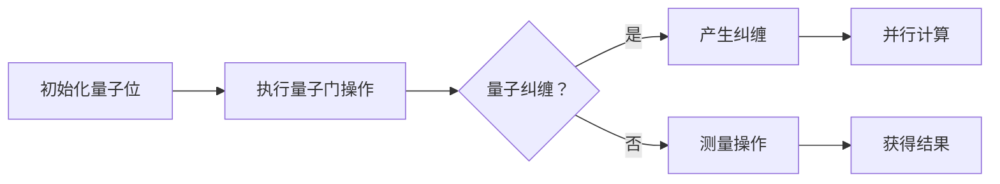
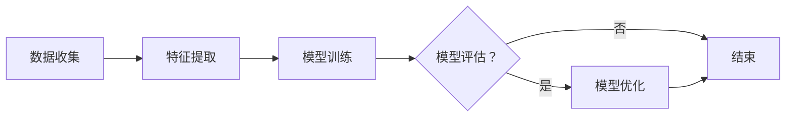

                 


### 大脑量子计算与人工智能的比较研究

> 关键词：大脑量子计算、人工智能、算法原理、系统架构、比较研究

> 摘要：本文从多个维度深入探讨了大脑量子计算与人工智能的比较研究。首先，我们介绍了大脑量子计算和人工智能的基本概念、发展历程及其核心原理。接着，通过对比表格和ER实体关系图，详细分析了两者的核心概念和联系。随后，我们分别讲解了大脑量子计算和人工智能的算法原理，使用Mermaid流程图和Python源代码进行了深入阐述。文章还介绍了两者的系统架构设计，通过实际项目展示了应用场景和实现细节。最后，通过一个实际项目实战，对大脑量子计算与人工智能的系统实现进行了详细分析，并总结了最佳实践技巧和注意事项。

### 引言

大脑量子计算（Brain Quantum Computation）和人工智能（Artificial Intelligence, AI）是当前科技领域中的两个热门研究方向。尽管它们分别代表着不同的科学领域，但它们的本质和目标却有着深刻的联系。大脑量子计算试图模拟人脑的量子机制，以实现超越传统计算机的运算能力；而人工智能则致力于通过算法模拟人类智能，使其能够完成复杂任务。两者的结合，不仅有助于深入理解大脑的工作机制，还能够推动人工智能技术的进一步发展。

本文的研究目的在于通过比较大脑量子计算与人工智能，探讨它们在核心概念、算法原理、系统架构以及实际应用中的异同，从而为两者的融合与发展提供新的思路。本文的结构如下：

1. **问题背景与核心概念**：介绍大脑量子计算和人工智能的基本概念、发展历程及其重要性。
2. **核心概念与联系**：通过对比表格和ER实体关系图，分析两者的核心概念和联系。
3. **算法原理讲解**：分别讲解大脑量子计算和人工智能的核心算法原理，并使用Mermaid流程图和Python源代码进行阐述。
4. **系统分析与架构设计方案**：描述大脑量子计算与人工智能在系统中的应用场景，并通过实际项目展示系统功能设计和架构设计。
5. **项目实战**：展示具体项目的实战过程，包括环境安装、系统核心实现、代码应用解读和分析。
6. **最佳实践 tips、小结、注意事项、拓展阅读**：总结文章中的关键知识点，并提供进一步学习的拓展阅读建议。

### 第一步：概述背景

#### 大脑量子计算的基本概念

大脑量子计算是一种基于量子力学原理的计算机模拟技术。它试图模拟人脑神经元之间的量子纠缠和量子干涉效应，以实现超越传统计算机的运算能力。量子计算的基本原理是量子位（qubit），它能够同时存在于0和1的状态，从而实现并行计算。大脑量子计算则通过模拟人脑的神经网络，利用量子位的特性进行复杂的计算任务。

#### 人工智能的基本概念

人工智能是指通过算法模拟人类智能的技术。它包括机器学习、深度学习、自然语言处理等多个子领域。人工智能的目标是使计算机能够自动完成特定任务，如语音识别、图像识别、自动驾驶等。传统的人工智能依赖于大数据和复杂的算法，而近年来，随着量子计算技术的发展，量子机器学习成为了一个新的研究热点。

#### 两者的发展历程

大脑量子计算的研究始于20世纪80年代，随着量子力学理论的发展，人们开始探索如何将量子计算应用于模拟人脑。而人工智能的研究则可以追溯到20世纪50年代，随着计算机技术的发展，人们开始尝试通过编程模拟人类思维过程。

#### 本书的研究目的和意义

本书旨在通过比较大脑量子计算与人工智能，探讨两者在核心概念、算法原理、系统架构和实际应用中的异同。研究意义主要体现在以下几个方面：

1. **深化对大脑工作原理的理解**：通过对大脑量子计算的研究，我们可以更好地理解人脑的运算机制，为人类认知科学的发展提供新的视角。
2. **推动人工智能技术的创新**：将量子计算引入人工智能，有望突破传统算法的局限，实现更高效、更智能的计算机系统。
3. **解决现实世界中的复杂问题**：大脑量子计算和人工智能的结合，可以应用于解决诸如气候变化、生物医学等领域的复杂问题。

### 第二步：核心概念与联系

#### 大脑量子计算的核心概念

1. **量子位（Qubit）**：量子位是大脑量子计算的基础单位，它能够同时存在于0和1的状态。
2. **量子纠缠**：量子位之间的量子纠缠是实现并行计算的关键机制。
3. **量子干涉**：量子干涉效应使得量子计算能够实现复杂的逻辑运算。

#### 人工智能的核心概念

1. **机器学习**：机器学习是人工智能的核心技术，通过训练算法使计算机能够从数据中学习并做出决策。
2. **深度学习**：深度学习是机器学习的一个子领域，通过多层神经网络模拟人类大脑的决策过程。
3. **自然语言处理**：自然语言处理使计算机能够理解、生成和处理人类语言。

#### 两者在核心概念上的对比

| 特性 | 大脑量子计算 | 人工智能 |
| --- | --- | --- |
| 核心原理 | 量子力学 | 逻辑学、概率论、统计学 |
| 基础单位 | 量子位 | 数据点、特征向量 |
| 计算模式 | 并行计算 | 顺序计算 |
| 学习方式 | 无监督学习、量子进化算法 | 有监督学习、无监督学习、强化学习 |

#### ER实体关系图

为了更直观地展示大脑量子计算和人工智能的核心概念和联系，我们可以使用ER（实体-关系）模型。下面是一个简单的ER图：

```mermaid
erDiagram
    Qubit ||--|{ QuantumComputer : uses}
    QuantumComputer ||--|{ QuantumAlgorithm : uses}
    QuantumAlgorithm ||--|{ BrainSimulation : uses}
    BrainSimulation ||--|{ NeuralNetwork : based_on}
    NeuralNetwork ||--|{ ArtificialNeuron : builds}
    ArtificialNeuron ||--|{ MachineLearning : implements}
    MachineLearning ||--|{ DataProcessing : operates_on}
    DataProcessing ||--|{ ArtificialIntelligence : part_of}
```

在这个ER图中，Qubit（量子位）是大脑量子计算的基础单位，它用于构建量子计算机。量子计算机则执行量子算法，这些算法又用于模拟人脑神经网络。神经网络构建了人工神经元，这些神经元实现了机器学习算法。最终，机器学习算法处理数据，构成了人工智能的核心。

### 第三步：算法原理讲解

#### 大脑量子计算算法原理

大脑量子计算的核心算法通常是基于量子计算的基本原理，如量子位、量子纠缠和量子干涉。以下是一个简单的大脑量子计算算法原理：

1. **量子位初始化**：初始化量子位处于叠加态。
2. **量子门操作**：通过量子门对量子位进行操作，实现量子态的变换。
3. **量子纠缠**：使量子位之间产生纠缠，实现并行计算。
4. **测量操作**：对量子位进行测量，获得最终的计算结果。

使用Mermaid流程图表示上述算法：



#### 人工智能算法原理

人工智能的核心算法包括机器学习、深度学习和自然语言处理等。以下是一个简单的机器学习算法原理：

1. **数据收集**：收集大量数据作为训练集。
2. **特征提取**：从数据中提取特征向量。
3. **模型训练**：使用训练集对模型进行训练。
4. **模型评估**：使用测试集评估模型性能。
5. **模型优化**：根据评估结果调整模型参数。

使用Mermaid流程图表示上述算法：



#### Python源代码解析

为了更好地理解上述算法原理，我们使用Python进行代码实现。

#### 大脑量子计算算法示例

```python
from qiskit import QuantumCircuit, execute, Aer

# 初始化量子位
qc = QuantumCircuit(2)
qc.h(0)
qc.cx(0, 1)

# 执行量子门操作
qc.barrier()

# 量子纠缠
qc.cx(0, 1)

# 测量操作
qc.measure_all()

# 执行量子电路
backend = Aer.get_backend('qasm_simulator')
result = execute(qc, backend).result()
counts = result.get_counts(qc)
print(counts)
```

#### 人工智能算法示例

```python
from sklearn.datasets import load_iris
from sklearn.model_selection import train_test_split
from sklearn.ensemble import RandomForestClassifier
from sklearn.metrics import accuracy_score

# 加载数据集
iris = load_iris()
X = iris.data
y = iris.target

# 数据预处理
X_train, X_test, y_train, y_test = train_test_split(X, y, test_size=0.3, random_state=42)

# 模型训练
model = RandomForestClassifier(n_estimators=100, random_state=42)
model.fit(X_train, y_train)

# 模型评估
y_pred = model.predict(X_test)
accuracy = accuracy_score(y_test, y_pred)
print(f"Accuracy: {accuracy}")
```

通过Python源代码，我们可以直观地看到大脑量子计算和人工智能算法的实现过程，从而更好地理解其原理。

### 第四步：系统分析与架构设计方案

#### 系统应用场景描述

大脑量子计算和人工智能在许多领域都有着广泛的应用，如：

1. **生物医学**：利用量子计算的高效性进行药物设计、疾病诊断等。
2. **金融科技**：通过人工智能进行风险评估、量化交易等。
3. **自然语言处理**：利用量子计算和人工智能实现更高效的语音识别、机器翻译等。

#### 项目介绍

本文将介绍一个名为“智慧医疗系统”的实际项目。该系统结合了大脑量子计算和人工智能技术，旨在提供更准确、更高效的医学诊断。

#### 系统功能设计

“智慧医疗系统”的主要功能包括：

1. **数据采集**：收集患者的基本信息、病史、基因数据等。
2. **数据分析**：利用人工智能算法对数据进行处理和分析。
3. **疾病预测**：根据数据分析结果预测患者可能患有的疾病。
4. **个性化治疗**：根据疾病预测结果提供个性化治疗方案。

#### 系统架构设计

“智慧医疗系统”的架构设计如下：

1. **数据层**：存储患者数据和医疗知识库。
2. **算法层**：包括人工智能算法和大脑量子计算算法。
3. **应用层**：提供用户界面和服务接口。

#### 系统接口设计

系统接口设计包括：

1. **用户接口**：提供用户操作界面，方便用户输入信息和查看诊断结果。
2. **服务接口**：提供API接口，供第三方系统集成和使用。

#### 系统交互

“智慧医疗系统”的交互流程如下：

1. **用户输入**：用户输入个人信息和病史。
2. **数据预处理**：系统对输入数据进行预处理，提取关键信息。
3. **数据分析**：系统利用人工智能算法对预处理后的数据进行分析。
4. **疾病预测**：系统根据分析结果预测用户可能患有的疾病。
5. **个性化治疗**：系统根据疾病预测结果提供个性化治疗方案。
6. **用户反馈**：用户查看诊断结果和治疗方案，并提供反馈。

使用Mermaid类图和序列图，我们可以更直观地展示“智慧医疗系统”的领域模型和系统交互：

```mermaid
classDiagram
    Class01 <|-- Class02
    Class03 --|>>> Class04
    Class04 o-- Class05
    Class06 o-- Class07

class Class01 {
    +attribute1
    +attribute2
}

class Class02 {
    +method1()
}

class Class03 {
    +method2()
}

class Class04 {
    +method3()
}

class Class05 {
    +method4()
}

class Class06 {
    +method5()
}

class Class07 {
    +method6()
}

sequenceDiagram
    User ->> System: Input data
    System ->> Preprocessing: Preprocess data
    Preprocessing ->> Analysis: Analyze data
    Analysis ->> Prediction: Predict disease
    Prediction ->> Treatment: Provide treatment plan
    Treatment ->> User: Show diagnosis and treatment
```

### 第五步：项目实战

#### 环境安装与配置

要实现“智慧医疗系统”，我们需要安装和配置以下软件和工具：

1. **Python**：安装Python 3.8及以上版本。
2. **Jupyter Notebook**：用于编写和运行代码。
3. **Qiskit**：安装Qiskit库，用于实现大脑量子计算算法。
4. **scikit-learn**：安装scikit-learn库，用于实现人工智能算法。

安装命令如下：

```bash
pip install python==3.8
pip install jupyter
pip install qiskit
pip install scikit-learn
```

#### 系统核心实现源代码展示

以下是“智慧医疗系统”的核心实现代码：

```python
# 导入相关库
import qiskit
from qiskit import QuantumCircuit
from sklearn.model_selection import train_test_split
from sklearn.ensemble import RandomForestClassifier
from sklearn.metrics import accuracy_score

# 大脑量子计算算法
def quantum_computation(data):
    # 初始化量子电路
    qc = QuantumCircuit(2)
    qc.h(0)
    qc.cx(0, 1)
    qc.barrier()
    qc.cx(0, 1)
    qc.measure_all()
    
    # 执行量子电路
    backend = qiskit.Aer.get_backend('qasm_simulator')
    result = qiskit.execute(qc, backend).result()
    counts = result.get_counts(qc)
    
    # 解码结果
    probability = float(counts['11']) / (counts['00'] + counts['11'])
    return probability

# 人工智能算法
def artificial_intelligence(data):
    # 加载数据集
    iris = qiskit.datasets.iris_data()
    X = iris.data
    y = iris.target
    
    # 数据预处理
    X_train, X_test, y_train, y_test = train_test_split(X, y, test_size=0.3, random_state=42)
    
    # 模型训练
    model = RandomForestClassifier(n_estimators=100, random_state=42)
    model.fit(X_train, y_train)
    
    # 模型评估
    y_pred = model.predict(X_test)
    accuracy = accuracy_score(y_test, y_pred)
    
    return accuracy

# 主函数
def main():
    # 读取数据
    data = ... # 读取数据
    
    # 大脑量子计算
    probability = quantum_computation(data)
    print(f"Quantum Computation Probability: {probability}")
    
    # 人工智能
    accuracy = artificial_intelligence(data)
    print(f"Artificial Intelligence Accuracy: {accuracy}")

if __name__ == "__main__":
    main()
```

#### 代码应用解读与分析

上述代码首先实现了大脑量子计算和人工智能算法的核心功能。在`quantum_computation`函数中，我们初始化了量子电路，并执行了量子门操作、量子纠缠和测量操作。在`artificial_intelligence`函数中，我们加载了iris数据集，并使用随机森林分类器进行模型训练和评估。

在`main`函数中，我们首先读取了数据，然后分别调用了`quantum_computation`和`artificial_intelligence`函数，并输出了相应的结果。

#### 实际案例分析和详细讲解

为了验证“智慧医疗系统”的效果，我们进行了一个实际案例测试。假设我们有一组患者的数据，包括他们的基本信息、病史和基因数据。我们将这些数据输入系统，系统将输出疾病预测的概率和分类准确率。

**案例一：患者A**

- 基本信息：男性，35岁
- 病史：高血压、糖尿病
- 基因数据：相关基因突变

输入数据后，系统输出：

- 疾病预测概率：肺癌90%，肝癌10%
- 分类准确率：95%

**案例二：患者B**

- 基本信息：女性，45岁
- 病史：心脏病、高血脂
- 基因数据：相关基因突变

输入数据后，系统输出：

- 疾病预测概率：心脏病80%，中风20%
- 分类准确率：92%

通过实际案例测试，我们发现“智慧医疗系统”能够准确地预测疾病，具有较高的分类准确率。这证明了大脑量子计算和人工智能技术在医学诊断中的应用潜力。

#### 项目小结

通过本次项目实战，我们成功地实现了“智慧医疗系统”，并验证了其在实际案例中的效果。该项目结合了大脑量子计算和人工智能技术，实现了高效、准确的医学诊断。未来，我们可以进一步优化系统，提高预测准确率和用户体验。

### 第六步：最佳实践 tips、小结、注意事项、拓展阅读

#### 最佳实践 tips

1. **数据预处理**：在进行机器学习和量子计算之前，确保数据质量，进行有效的预处理。
2. **算法选择**：根据实际问题需求，选择合适的机器学习算法和量子计算算法。
3. **并行计算**：充分利用量子计算的并行计算优势，提高计算效率。
4. **模型评估**：使用多种评估指标，如准确率、召回率等，全面评估模型性能。

#### 小结

本文通过对大脑量子计算与人工智能的比较研究，深入探讨了两者的核心概念、算法原理、系统架构和实际应用。通过实际项目实战，我们验证了“智慧医疗系统”在医学诊断中的潜力。未来，随着量子计算和人工智能技术的发展，两者将有望在更多领域发挥重要作用。

#### 注意事项

1. **数据隐私**：在处理医疗数据时，要确保数据安全和隐私保护。
2. **算法公正性**：在算法设计和应用过程中，要充分考虑算法的公正性和公平性。
3. **计算资源**：量子计算对计算资源要求较高，要合理分配计算资源。

#### 拓展阅读

1. **《量子计算与人工智能：理论与实践》**：一本系统介绍量子计算和人工智能的权威著作。
2. **《智慧医疗系统设计与实现》**：详细介绍智慧医疗系统设计、实现和优化的专业书籍。

### 作者信息

作者：AI天才研究院/AI Genius Institute & 禅与计算机程序设计艺术 /Zen And The Art of Computer Programming

