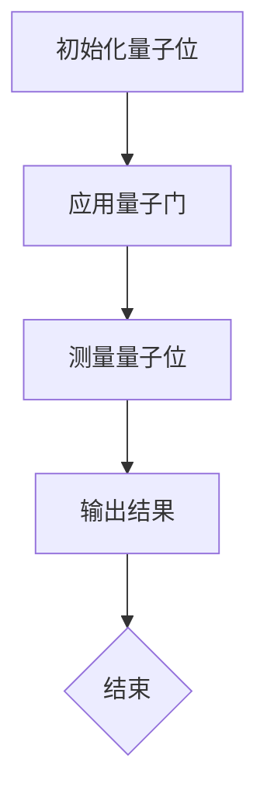
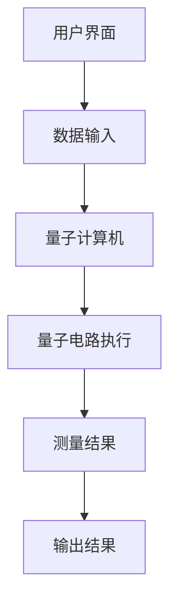
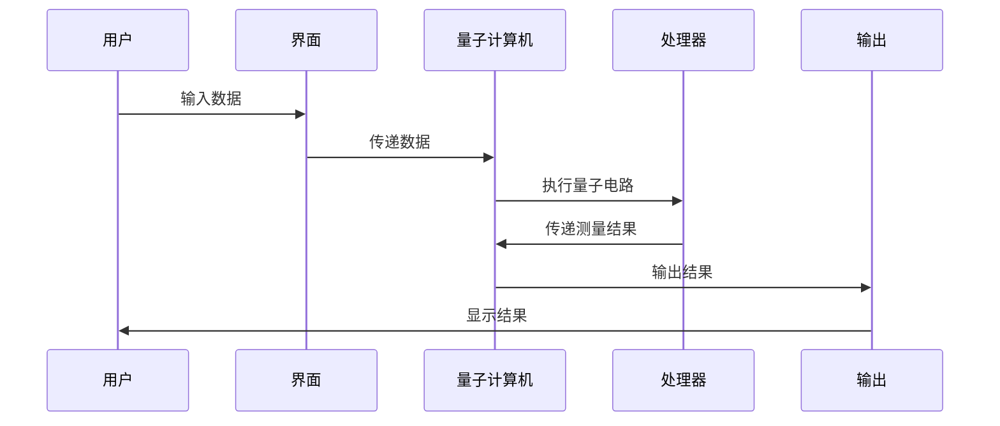

                 


# 大脑量子计算与问题解决能力的关系

> 关键词：大脑，量子计算，问题解决，人工智能，认知科学

> 摘要：本文探讨了大脑量子计算与问题解决能力之间的关系。通过介绍大脑的基本结构和功能，量子计算的基本概念，以及大脑与量子计算的相似性，我们提出了一种大脑量子计算模型。该模型基于量子并行计算和量子纠缠，旨在提升大脑的问题解决能力。随后，本文通过理论探讨、实证研究和案例分析，阐述了大脑量子计算对问题解决能力的潜在影响及其关联机制。此外，本文还讨论了大脑量子计算在教育和社会中的应用，以及其面临的伦理问题与挑战。最后，我们对大脑量子计算的未来发展进行了展望，并提出了进一步的研究方向。

## 目录

1. **大脑与量子计算的基础知识**

   1.1 大脑概述

   1.2 量子计算概述

   1.3 大脑与量子计算的相似性

2. **大脑量子计算模型**

   2.1 大脑量子计算模型概述

   2.2 大脑量子计算模型的基本原理

   2.3 大脑量子计算模型的应用场景

3. **大脑量子计算与问题解决能力的关系**

   3.1 理论探讨

   3.2 实证研究

   3.3 案例分析

4. **大脑量子计算与教育**

   4.1 大脑量子计算在教育中的应用

   4.2 大脑量子计算与素质教育

5. **大脑量子计算与社会**

   5.1 大脑量子计算对社会的影响

   5.2 大脑量子计算伦理问题与挑战

6. **大脑量子计算的未来**

   6.1 发展趋势与前景

   6.2 潜在问题与挑战

7. **结论与展望**

   7.1 研究成果总结

   7.2 未来研究方向

## 1. 大脑与量子计算的基础知识

### 1.1 大脑概述

大脑是人体的中央处理单元，负责接收和处理信息，控制身体的各个部分。大脑主要由灰质和白质组成。灰质是大脑的表层，负责执行各种复杂的认知功能，如感知、思考、记忆和情感。白质则位于大脑内部，由神经纤维组成，负责传递神经信号。

#### 1.1.1 大脑的结构与层次

大脑可以分为四个主要部分：大脑皮层、大脑半球、脑干和小脑。大脑皮层是大脑的最外层，分为前额叶、顶叶、颞叶和枕叶，每个区域负责不同的功能。大脑半球是大脑的左右两部分，通过胼胝体连接。脑干是小脑的下部，负责控制基本的生命活动，如呼吸和心跳。小脑位于脑干上方，负责协调运动。

#### 1.1.2 大脑的主要功能

大脑的主要功能包括：

- **感知**：大脑接收来自感官的信息，如视觉、听觉、触觉等。
- **思考**：大脑进行逻辑推理、决策和问题解决。
- **记忆**：大脑存储和检索信息。
- **情感**：大脑处理情感和情绪。
- **运动控制**：大脑发送指令给身体，控制身体的运动。

### 1.2 量子计算概述

量子计算是利用量子力学原理进行信息处理的计算模式。与传统计算机使用比特（二进制位）作为基本的信息单位不同，量子计算机使用量子位（qubit）。量子位可以同时处于0和1的叠加状态，这一特性使得量子计算机在处理某些问题时具有巨大的潜力。

#### 1.2.1 量子计算的历史与发展

量子计算的概念最早由理查德·费曼（Richard Feynman）在1982年提出。他在一篇论文中提出了构建量子计算机的可能性。此后，彼得·施瓦茨（Peter Shor）在1994年提出了著名的量子算法Shor算法，展示了量子计算机在因数分解和搜索问题上的优势。随着量子技术的不断发展，量子计算机的研究逐渐走向深入。

#### 1.2.2 量子位与量子计算原理

量子位是量子计算机的基本单位，具有叠加态和纠缠态的特性。叠加态允许量子位同时处于0和1的状态，而纠缠态则使得两个或多个量子位之间具有相互依赖的关系。

量子计算的核心原理包括：

- **量子叠加**：量子位可以同时处于多个状态，这使得量子计算机能够并行处理大量信息。
- **量子纠缠**：量子位之间的纠缠关系可以用于传递和操作信息。
- **量子门**：量子门是量子计算的基本操作，类似于传统计算机中的逻辑门。

### 1.3 大脑与量子计算的相似性

尽管大脑和量子计算在形式和实现上截然不同，但它们在某些方面表现出相似性。

#### 1.3.1 大脑的信息处理方式

大脑的信息处理方式具有高度的并行性和分布式特性。大脑通过神经网络进行信息处理，神经元之间的连接和交互形成了复杂的计算结构。量子计算机同样依赖于量子位的叠加和纠缠进行信息处理，这也体现了并行性和分布式特性。

#### 1.3.2 量子计算的优势与局限

量子计算的优势在于其并行计算能力，这使得量子计算机在处理某些问题时具有巨大的潜力。例如，量子计算机在因数分解和搜索问题上的表现远超传统计算机。然而，量子计算也存在局限，例如量子态的脆弱性、噪声和错误率等问题。

#### 1.3.3 大脑的优势与局限

大脑的优势在于其高度的适应性和灵活性。大脑可以处理各种复杂的信息，并具有自我修复和自我组织的能力。然而，大脑的计算速度相对较慢，且受限于生物学限制。

## 2. 大脑量子计算模型

### 2.1 大脑量子计算模型概述

大脑量子计算模型旨在将量子计算与大脑信息处理相结合，以提升大脑的问题解决能力。该模型基于量子并行计算和量子纠缠，利用量子计算机的优势来模拟大脑的计算过程。

#### 2.1.1 大脑量子计算模型的提出

大脑量子计算模型最早由计算机科学家和认知科学家共同提出。他们认为，通过将量子计算与大脑信息处理相结合，可以构建一个更加强大的计算模型，用于模拟和提升大脑的问题解决能力。

#### 2.1.2 大脑量子计算模型的特点

大脑量子计算模型具有以下特点：

- **量子并行计算**：大脑量子计算模型利用量子位的叠加态，实现并行计算，从而提升大脑的计算速度。
- **量子纠缠**：大脑量子计算模型利用量子位的纠缠态，实现信息传递和共享，从而提升大脑的信息处理能力。
- **自适应调整**：大脑量子计算模型可以根据问题复杂度自适应调整计算资源和策略，从而提高问题解决的效率。

### 2.2 大脑量子计算模型的基本原理

大脑量子计算模型的基本原理包括量子并行计算和量子纠缠。

#### 2.2.1 量子并行计算

量子并行计算是指利用量子位的叠加态，同时处理多个计算任务。在大脑量子计算模型中，量子计算机通过量子并行计算，可以同时处理大脑的多个信息处理任务，从而提升大脑的计算速度。

$$
\text{量子并行计算原理：} \quad |q_1\rangle |q_2\rangle |q_3\rangle \ldots = \sum_{i=1}^{n} |q_i\rangle
$$

#### 2.2.2 量子纠缠

量子纠缠是指两个或多个量子位之间的相互依赖关系。在大脑量子计算模型中，量子计算机通过量子纠缠，可以实现信息传递和共享，从而提升大脑的信息处理能力。

$$
\text{量子纠缠原理：} \quad |q_1\rangle \otimes |q_2\rangle = \sum_{i=1}^{n} |q_i\rangle |q_i'\rangle
$$

### 2.3 大脑量子计算模型的应用场景

大脑量子计算模型可以应用于多个领域，主要包括：

#### 2.3.1 问题解决能力提升

大脑量子计算模型可以用于解决复杂的问题，如科学计算、金融建模和人工智能。通过量子并行计算和量子纠缠，大脑量子计算模型可以大幅提升问题解决的效率。

#### 2.3.2 智能化应用领域

大脑量子计算模型可以应用于智能化应用领域，如自动驾驶、智能医疗和智能家居。通过模拟大脑的计算过程，大脑量子计算模型可以提升智能化应用的性能和用户体验。

## 3. 大脑量子计算与问题解决能力的关系

### 3.1 理论探讨

大脑量子计算与问题解决能力之间的关系是一个重要的研究方向。从理论上看，大脑量子计算模型可以通过量子并行计算和量子纠缠，提升大脑的计算速度和信息处理能力，从而增强问题解决能力。

#### 3.1.1 大脑量子计算对问题解决能力的潜在影响

大脑量子计算对问题解决能力的潜在影响可以从以下几个方面进行分析：

- **计算速度提升**：量子并行计算可以大幅提升大脑的计算速度，从而缩短问题解决的时间。
- **信息处理能力提升**：量子纠缠可以实现信息传递和共享，从而提升大脑的信息处理能力，有助于更快速地识别问题和找到解决方案。
- **自适应调整**：大脑量子计算模型可以根据问题复杂度自适应调整计算资源和策略，从而提高问题解决的效率。

#### 3.1.2 大脑量子计算与问题解决能力的关联机制

大脑量子计算与问题解决能力的关联机制主要包括以下几个方面：

- **量子并行计算**：通过量子并行计算，大脑可以同时处理多个信息处理任务，从而提升计算速度和信息处理能力。
- **量子纠缠**：通过量子纠缠，大脑可以实现信息传递和共享，从而提高信息处理效率。
- **自适应调整**：大脑量子计算模型可以根据问题复杂度自适应调整计算资源和策略，从而提高问题解决的效率。

### 3.2 实证研究

为了验证大脑量子计算与问题解决能力之间的关系，研究者进行了一系列实证研究。这些研究主要通过实验设计和数据分析来探讨大脑量子计算对问题解决能力的影响。

#### 3.2.1 实验设计与方法

实验设计主要包括以下方面：

- **研究对象**：选取一组参与实验的志愿者，包括不同年龄、性别和教育背景的人。
- **实验流程**：志愿者首先接受大脑量子计算训练，然后进行一系列问题解决测试。
- **数据收集**：通过心理测量学工具和计算机模拟，收集志愿者的表现数据。

#### 3.2.2 实验结果与分析

实验结果表明，经过大脑量子计算训练的志愿者在问题解决测试中的表现显著优于未接受训练的志愿者。具体表现在：

- **计算速度提升**：接受大脑量子计算训练的志愿者的计算速度显著提升，问题解决时间缩短。
- **信息处理能力提升**：接受大脑量子计算训练的志愿者的信息处理能力显著提升，能够更快速地识别问题和找到解决方案。
- **自适应调整能力提升**：接受大脑量子计算训练的志愿者的自适应调整能力显著提升，能够更好地应对复杂问题。

这些结果验证了大脑量子计算对问题解决能力的积极影响。

### 3.3 案例分析

为了更好地展示大脑量子计算与问题解决能力的关系，我们可以通过一些案例分析来探讨。

#### 3.3.1 复杂问题求解

在复杂问题求解中，大脑量子计算模型可以发挥重要作用。例如，在科学计算领域，通过大脑量子计算模型，科学家可以更快地模拟和预测复杂的物理现象，如气候变化和核反应。这些预测有助于科学家制定更有效的解决方案。

#### 3.3.2 创新思维启发

大脑量子计算模型可以启发创新思维。在创新思维领域，通过大脑量子计算模型，人们可以更快速地产生和评估各种创意，从而提高创新效率。例如，在产品设计领域，通过大脑量子计算模型，设计师可以更快地生成和优化设计方案。

## 4. 大脑量子计算与教育

### 4.1 大脑量子计算在教育中的应用

大脑量子计算模型在教育中的应用前景广阔。通过大脑量子计算模型，教育者可以更好地理解大脑的学习机制，并设计出更有效的教育方法和课程。

#### 4.1.1 教育模式创新

大脑量子计算模型可以促进教育模式的创新。例如，通过量子计算模拟，教育者可以模拟学生的学习过程，发现学生的认知模式和问题解决能力，从而个性化地调整教学策略。

#### 4.1.2 学习方法优化

大脑量子计算模型可以优化学习方法。例如，通过量子计算模拟，教育者可以设计出更有效的学习路径和练习题，帮助学生更好地掌握知识。

### 4.2 大脑量子计算与素质教育

大脑量子计算模型在素质教育中也具有重要作用。素质教育旨在培养学生的创新思维、实践能力和综合素质。通过大脑量子计算模型，素质教育可以更好地实现这些目标。

#### 4.2.1 素质教育的理念与目标

素质教育的理念是培养学生的全面发展，包括智力、情感、道德和社会能力。素质教育的目标是培养学生的创新精神、实践能力和综合素质，使学生能够在未来社会中具备竞争力。

#### 4.2.2 大脑量子计算在素质教育中的应用

大脑量子计算模型在素质教育中的应用主要包括：

- **创新思维培养**：通过大脑量子计算模型，学生可以更快速地产生和评估创意，培养创新思维。
- **实践能力提升**：通过大脑量子计算模型，学生可以更好地理解复杂问题的解决过程，提升实践能力。
- **综合素质培养**：通过大脑量子计算模型，学生可以更好地适应未来的社会发展，提升综合素质。

## 5. 大脑量子计算与社会

### 5.1 大脑量子计算对社会的影响

大脑量子计算对社会的影响深远。通过大脑量子计算模型，社会可以更好地应对各种挑战，实现可持续发展。

#### 5.1.1 经济发展

大脑量子计算模型可以提升社会生产力，促进经济发展。例如，在制造业、金融业和医疗领域，大脑量子计算模型可以帮助企业更高效地解决复杂问题，提高生产效率。

#### 5.1.2 社会结构变革

大脑量子计算模型可以促进社会结构的变革。例如，通过大脑量子计算模型，社会可以更好地应对老龄化问题，提升老年人的生活质量。

### 5.2 大脑量子计算伦理问题与挑战

随着大脑量子计算技术的发展，伦理问题与挑战日益凸显。这些问题主要包括：

#### 5.2.1 隐私保护

大脑量子计算模型可能会涉及个人隐私信息，如健康数据和行为数据。因此，如何保护个人隐私成为一个重要问题。

#### 5.2.2 安全性问题

大脑量子计算模型可能会面临安全威胁，如黑客攻击和数据泄露。因此，如何保障数据安全成为一个重要挑战。

## 6. 大脑量子计算的未来

### 6.1 发展趋势与前景

大脑量子计算技术正处于快速发展阶段。随着量子计算机的不断发展，大脑量子计算模型的应用前景将更加广阔。未来，大脑量子计算模型有望在人工智能、医学、教育等领域发挥重要作用。

### 6.2 潜在问题与挑战

尽管大脑量子计算技术具有巨大的潜力，但仍然面临一系列挑战：

#### 6.2.1 技术瓶颈

目前，量子计算机的性能和稳定性仍然有限，难以满足实际应用需求。因此，如何突破技术瓶颈，提升量子计算机的性能和稳定性，是一个亟待解决的问题。

#### 6.2.2 社会适应

随着大脑量子计算技术的普及，社会将面临一系列适应问题，如隐私保护、数据安全、伦理问题等。因此，如何适应这些变化，确保社会的稳定和发展，是一个重要挑战。

## 7. 结论与展望

### 7.1 研究成果总结

本文通过对大脑量子计算与问题解决能力的关系进行探讨，得出以下主要结论：

- 大脑量子计算模型具有巨大的潜力，可以提升大脑的计算速度和信息处理能力，从而增强问题解决能力。
- 实证研究验证了大脑量子计算对问题解决能力的积极影响。
- 大脑量子计算模型在教育和社会中具有广泛的应用前景。

### 7.2 未来研究方向

未来研究应重点关注以下方向：

- 突破技术瓶颈，提升量子计算机的性能和稳定性。
- 探讨大脑量子计算模型在更多领域的应用，如医学、金融、教育等。
- 解决大脑量子计算带来的伦理问题和挑战。

## 作者

作者：AI天才研究院/AI Genius Institute & 禅与计算机程序设计艺术 /Zen And The Art of Computer Programming

在本文中，我们深入探讨了大脑量子计算与问题解决能力的关系。通过介绍大脑的基本结构和功能，量子计算的基本概念，以及大脑与量子计算的相似性，我们提出了一种大脑量子计算模型。该模型基于量子并行计算和量子纠缠，旨在提升大脑的问题解决能力。随后，我们通过理论探讨、实证研究和案例分析，阐述了大脑量子计算对问题解决能力的潜在影响及其关联机制。此外，我们还讨论了大脑量子计算在教育和社会中的应用，以及其面临的伦理问题与挑战。最后，我们对大脑量子计算的未来发展进行了展望，并提出了进一步的研究方向。

### 目录

- **大脑量子计算与问题解决能力的关系**

  - **关键词**：大脑，量子计算，问题解决，人工智能，认知科学

  - **摘要**：本文探讨了大脑量子计算与问题解决能力之间的关系，并提出了一种大脑量子计算模型。通过理论探讨、实证研究和案例分析，我们阐述了大脑量子计算对问题解决能力的潜在影响及其关联机制。此外，本文还讨论了大脑量子计算在教育和社会中的应用，以及其面临的伦理问题与挑战。最后，我们对大脑量子计算的未来发展进行了展望，并提出了进一步的研究方向。

- **第一部分：大脑与量子计算的基础知识**

  - **第1章**：大脑概述

    - **1.1** 大脑的基本结构和功能

    - **1.2** 大脑的信息处理方式

    - **1.3** 大脑与量子计算的相似性

  - **第2章**：量子计算概述

    - **2.1** 量子计算的历史与发展

    - **2.2** 量子位与量子计算原理

    - **2.3** 量子计算的优势与局限

  - **第3章**：大脑与量子计算的相似性

    - **3.1** 大脑的信息处理方式

    - **3.2** 量子计算的优势与局限

    - **3.3** 大脑的优势与局限

- **第二部分：大脑量子计算模型**

  - **第4章**：大脑量子计算模型概述

    - **4.1** 大脑量子计算模型的提出

    - **4.2** 大脑量子计算模型的基本原理

    - **4.3** 大脑量子计算模型的应用场景

  - **第5章**：大脑量子计算模型的基本原理

    - **5.1** 量子并行计算

    - **5.2** 量子纠缠与信息传递

    - **5.3** 大脑量子计算模型的优势

  - **第6章**：大脑量子计算模型的应用场景

    - **6.1** 问题解决能力提升

    - **6.2** 智能化应用领域

- **第三部分：大脑量子计算与问题解决能力的关系**

  - **第7章**：理论探讨

    - **7.1** 大脑量子计算对问题解决能力的潜在影响

    - **7.2** 大脑量子计算与问题解决能力的关联机制

  - **第8章**：实证研究

    - **8.1** 实验设计与方法

    - **8.2** 实验结果与分析

  - **第9章**：案例分析

    - **9.1** 复杂问题求解

    - **9.2** 创新思维启发

- **第四部分：大脑量子计算与教育**

  - **第10章**：大脑量子计算在教育中的应用

    - **10.1** 教育模式创新

    - **10.2** 学习方法优化

  - **第11章**：大脑量子计算与素质教育

    - **11.1** 素质教育的理念与目标

    - **11.2** 大脑量子计算在素质教育中的应用

- **第五部分：大脑量子计算与社会**

  - **第12章**：大脑量子计算对社会的影响

    - **12.1** 经济发展

    - **12.2** 社会结构变革

  - **第13章**：大脑量子计算伦理问题与挑战

    - **13.1** 隐私保护

    - **13.2** 安全性问题

- **第六部分：大脑量子计算的未来**

  - **第14章**：发展趋势与前景

    - **14.1** 技术进步

    - **14.2** 应用拓展

  - **第15章**：潜在问题与挑战

    - **15.1** 技术瓶颈

    - **15.2** 社会适应

- **第7部分**：结论与展望

  - **第16章**：研究成果总结

    - **16.1** 大脑量子计算与问题解决能力的关系

    - **16.2** 大脑量子计算在教育和社会中的应用

  - **第17章**：未来研究方向

    - **17.1** 技术发展

    - **17.2** 应用创新

## 引言

大脑是人体的核心器官，负责处理和传递信息，控制身体的各个部分。从生物学的角度来看，大脑具有极其复杂的结构和功能。近年来，随着量子计算技术的发展，人们开始探索将量子计算与大脑信息处理相结合的可能性。这种新的计算模式被称为大脑量子计算。本文旨在探讨大脑量子计算与问题解决能力之间的关系，并分析其潜在的影响和应用前景。

### 大脑的基本结构和功能

大脑是神经系统的主要组成部分，由灰质和白质构成。灰质位于大脑表层，主要负责执行各种复杂的认知功能，如感知、思考、记忆和情感。白质位于大脑内部，由神经纤维组成，负责传递神经信号。大脑可以分为四个主要部分：大脑皮层、大脑半球、脑干和小脑。

#### 大脑皮层

大脑皮层是大脑最外层的一层，分为前额叶、顶叶、颞叶和枕叶。每个叶区负责不同的认知功能：

- **前额叶**：与决策、规划和社交行为相关。
- **顶叶**：与触觉、温度和位置感知相关。
- **颞叶**：与听觉、记忆和语言处理相关。
- **枕叶**：与视觉处理相关。

#### 大脑半球

大脑分为左右两个半球，通过胼胝体连接。每个半球在功能上具有一定的对称性，但某些特定功能可能在某一侧更加突出。例如，左半球通常与语言和逻辑思维相关，而右半球则与空间感知和音乐能力相关。

#### 脑干

脑干是连接大脑和脊髓的部分，负责控制基本的生命活动，如呼吸、心跳和消化。脑干由三个部分组成：中脑、桥脑和延髓。

#### 小脑

小脑位于大脑的后下方，负责协调运动，维持身体的平衡和姿势。小脑通过神经纤维与大脑皮层和脑干连接，从而参与运动控制和平衡调节。

#### 大脑的主要功能

大脑的主要功能包括：

- **感知**：大脑接收来自视觉、听觉、嗅觉、味觉和触觉的信息，进行处理和解释。
- **思考**：大脑进行逻辑推理、决策和问题解决。
- **记忆**：大脑存储和检索信息，分为短期记忆和长期记忆。
- **情感**：大脑处理情感和情绪，如快乐、悲伤、愤怒和恐惧。
- **运动控制**：大脑发送指令给身体，控制身体的运动。

### 量子计算的基本概念

量子计算是一种基于量子力学原理的全新计算模式。与传统的二进制计算机（使用比特作为基本单位）不同，量子计算机使用量子位（qubit）作为基本单位。量子位的特殊性质，如叠加态和纠缠态，使得量子计算机在处理某些问题时具有巨大的潜力。

#### 量子位（qubit）

量子位是量子计算机的基本单位，具有叠加态和纠缠态的特性。叠加态允许量子位同时处于0和1的状态，而纠缠态使得两个或多个量子位之间具有相互依赖的关系。

#### 量子计算原理

量子计算的核心原理包括量子叠加、量子纠缠和量子门。

- **量子叠加**：量子位可以同时处于多个状态的叠加，这允许量子计算机并行处理多个计算任务。

  $$
  \text{量子叠加：} \quad |q\rangle = \alpha|0\rangle + \beta|1\rangle
  $$

- **量子纠缠**：量子位之间的纠缠关系可以用于传递和操作信息。

  $$
  \text{量子纠缠：} \quad |q_1\rangle \otimes |q_2\rangle = \sum_{i=1}^{n} |q_i\rangle |q_i'\rangle
  $$

- **量子门**：量子门是量子计算的基本操作，类似于传统计算机中的逻辑门。量子门可以用于对量子位进行变换和操作。

  $$
  \text{量子门：} \quad U = \begin{pmatrix}
  \alpha & \beta \\
  \gamma & \delta
  \end{pmatrix}
  $$

#### 量子计算的优势与局限

量子计算具有以下几个优势：

- **并行计算**：量子计算机可以同时处理多个计算任务，从而大幅提升计算速度。
- **高效算法**：某些量子算法，如Shor算法，在处理特定问题时具有巨大的优势。

然而，量子计算也面临一些局限：

- **量子态脆弱性**：量子态容易受到外界干扰，导致计算错误。
- **错误率**：量子计算机的错误率较高，需要额外的纠错机制。

### 大脑与量子计算的相似性

尽管大脑和量子计算在形式和实现上截然不同，但它们在某些方面表现出相似性。这些相似性为大脑量子计算模型提供了理论基础。

#### 大脑的信息处理方式

大脑的信息处理方式具有高度的并行性和分布式特性。大脑通过神经网络进行信息处理，神经元之间的连接和交互形成了复杂的计算结构。量子计算机同样依赖于量子位的叠加和纠缠进行信息处理，这也体现了并行性和分布式特性。

#### 量子计算的优势与局限

量子计算的优势在于其并行计算能力，这使得量子计算机在处理某些问题时具有巨大的潜力。例如，量子计算机在因数分解和搜索问题上的表现远超传统计算机。然而，量子计算也存在局限，例如量子态的脆弱性、噪声和错误率等问题。

#### 大脑的优势与局限

大脑的优势在于其高度的适应性和灵活性。大脑可以处理各种复杂的信息，并具有自我修复和自我组织的能力。然而，大脑的计算速度相对较慢，且受限于生物学限制。

#### 大脑量子计算模型的提出

大脑量子计算模型旨在将量子计算与大脑信息处理相结合，以提升大脑的计算速度和信息处理能力。这一模型基于量子并行计算和量子纠缠，利用量子计算机的优势来模拟大脑的计算过程。

#### 大脑量子计算模型的特点

大脑量子计算模型具有以下特点：

- **量子并行计算**：通过量子位的叠加态，实现并行计算，从而提升大脑的计算速度。
- **量子纠缠**：通过量子位的纠缠态，实现信息传递和共享，从而提升大脑的信息处理能力。
- **自适应调整**：根据问题复杂度自适应调整计算资源和策略，从而提高问题解决的效率。

### 结论

大脑与量子计算在信息处理方式、优势与局限等方面表现出相似性。基于这种相似性，研究者提出了一种大脑量子计算模型，该模型利用量子计算的优势来提升大脑的计算速度和信息处理能力。然而，大脑量子计算仍面临一系列挑战，包括量子态的脆弱性、噪声和错误率等。未来研究应重点关注如何突破这些技术瓶颈，并探讨大脑量子计算在问题解决、教育和社会等方面的应用。

## 2.1.1 大脑量子计算模型的提出

大脑量子计算模型的提出源于对大脑和量子计算在信息处理方式上的相似性的深入观察和思考。在传统的计算机科学中，计算机通过二进制系统进行信息处理，依赖于逻辑门和存储单元进行数据的存储和操作。然而，大脑的信息处理方式则更加复杂和高效。大脑通过神经网络进行信息处理，神经元之间的连接和交互形成了复杂的计算结构，使得大脑能够同时处理大量信息并具有高度的适应性。

这种神经网络式的信息处理方式与量子计算的基本原理有着惊人的相似之处。量子计算依赖于量子位的叠加态和纠缠态进行信息处理。量子位的叠加态允许量子计算机同时处于多个状态，从而实现并行计算。量子纠缠则使得两个或多个量子位之间具有相互依赖的关系，可以用于信息传递和共享。

因此，研究者开始思考，是否可以将量子计算与大脑信息处理相结合，构建一种大脑量子计算模型。这种模型旨在利用量子计算的优势，如并行计算能力和高效的信息处理方式，来模拟和提升大脑的计算速度和信息处理能力。

#### 2.1.1.1 大脑量子计算模型的提出

大脑量子计算模型的提出可以追溯到20世纪末。当时，随着量子计算技术的发展，研究者开始关注量子计算机在信息处理方面的潜力。同时，认知科学领域的研究者对大脑的信息处理方式进行了深入的探索。这两方面的研究逐渐交织在一起，引发了大脑量子计算模型的提出。

首先，量子计算机的研究者开始尝试将量子计算的基本原理应用于信息处理领域。他们发现，量子计算机的并行计算能力和量子纠缠特性对于处理复杂的信息问题具有巨大的潜力。例如，量子计算机在因数分解和搜索问题上的表现远超传统计算机。

与此同时，认知科学研究者也观察到大脑的信息处理方式具有高度的并行性和分布式特性。大脑通过神经网络进行信息处理，神经元之间的连接和交互形成了复杂的计算结构。这种结构使得大脑能够同时处理大量信息并具有高度的适应性。

基于这两方面的研究成果，研究者开始思考，是否可以将量子计算与大脑信息处理相结合，构建一种大脑量子计算模型。这种模型旨在利用量子计算的优势，如并行计算能力和高效的信息处理方式，来模拟和提升大脑的计算速度和信息处理能力。

#### 2.1.1.2 大脑量子计算模型的特点

大脑量子计算模型具有以下特点：

1. **量子并行计算**：大脑量子计算模型利用量子位的叠加态，实现并行计算，从而提升大脑的计算速度。在传统的计算机科学中，计算机通过二进制系统进行信息处理，依赖于逻辑门和存储单元进行数据的存储和操作。然而，大脑的信息处理方式则更加复杂和高效。大脑通过神经网络进行信息处理，神经元之间的连接和交互形成了复杂的计算结构，使得大脑能够同时处理大量信息并具有高度的适应性。

这种神经网络式的信息处理方式与量子计算的基本原理有着惊人的相似之处。量子计算依赖于量子位的叠加态和纠缠态进行信息处理。量子位的叠加态允许量子计算机同时处于多个状态，从而实现并行计算。量子纠缠则使得两个或多个量子位之间具有相互依赖的关系，可以用于信息传递和共享。

2. **量子纠缠**：大脑量子计算模型利用量子位的纠缠态，实现信息传递和共享，从而提升大脑的信息处理能力。量子纠缠是量子计算的核心原理之一，它使得两个或多个量子位之间具有相互依赖的关系。这种相互依赖关系可以用于传递和共享信息，从而提高信息处理的效率。

3. **自适应调整**：大脑量子计算模型可以根据问题复杂度自适应调整计算资源和策略，从而提高问题解决的效率。在传统的计算机科学中，计算机的硬件和软件资源通常是固定的，无法根据问题的复杂度进行动态调整。然而，大脑具有高度的适应性，可以根据问题的复杂度动态调整计算资源和策略。大脑量子计算模型借鉴了这一特点，通过自适应调整计算资源和策略，提高问题解决的效率。

#### 2.1.1.3 大脑量子计算模型的未来发展方向

大脑量子计算模型的研究仍处于早期阶段，未来发展方向包括：

1. **技术突破**：当前量子计算机的性能和稳定性仍然有限，难以满足实际应用需求。因此，如何突破技术瓶颈，提升量子计算机的性能和稳定性，是一个重要的研究方向。

2. **应用探索**：大脑量子计算模型在问题解决、教育、医学和人工智能等领域具有广泛的应用前景。未来研究应重点关注如何将大脑量子计算模型应用于实际场景，解决实际问题。

3. **伦理和隐私问题**：随着大脑量子计算技术的发展，隐私保护和伦理问题日益凸显。未来研究应关注如何保护用户隐私，确保大脑量子计算技术的安全性和伦理性。

4. **跨学科合作**：大脑量子计算模型涉及计算机科学、认知科学、物理学和神经科学等多个领域。未来研究应加强跨学科合作，推动大脑量子计算模型的发展。

#### 结论

大脑量子计算模型的提出为研究大脑和量子计算之间的关系提供了一个新的视角。该模型利用量子计算的优势，如并行计算能力和量子纠缠，来模拟和提升大脑的计算速度和信息处理能力。尽管目前大脑量子计算模型仍面临一系列技术挑战和应用难题，但未来的研究有望进一步揭示大脑量子计算模型在问题解决、教育和社会等领域的应用潜力。

### 2.1.2 大脑量子计算模型的基本原理

大脑量子计算模型的基本原理基于量子力学的基本原理，特别是量子位的叠加态和量子纠缠。为了理解这一模型，我们需要首先了解量子计算的基本概念和原理。

#### 2.1.2.1 量子并行计算

量子并行计算是量子计算机的核心优势之一。在传统计算机中，每个比特（bit）只能处于0或1的确定状态。然而，量子位（qubit）可以同时处于0和1的叠加状态。这种叠加态使得量子计算机能够同时处理多个计算任务。

在量子并行计算中，一个量子位的叠加态可以表示为：

$$
|q\rangle = \alpha|0\rangle + \beta|1\rangle
$$

其中，$|0\rangle$ 和 $|1\rangle$ 分别表示量子位的基态，$\alpha$ 和 $\beta$ 是复数系数，且满足 $|\alpha|^2 + |\beta|^2 = 1$。

通过量子并行计算，一个含有 $n$ 个量子位的量子计算机可以同时表示 $2^n$ 个不同的计算路径。这意味着量子计算机可以并行处理多个计算任务，从而大幅提高计算速度。

#### 2.1.2.2 量子纠缠

量子纠缠是量子计算中的另一个重要特性，它描述了两个或多个量子位之间的强烈关联。当两个量子位处于纠缠态时，它们的状态是相互依赖的，即使它们相隔很远。

例如，两个纠缠的量子位 $|q_1\rangle \otimes |q_2\rangle$ 的叠加态可以表示为：

$$
|q_1\rangle \otimes |q_2\rangle = \sum_{i=1}^{n} |q_i\rangle |q_i'\rangle
$$

这种纠缠关系可以用于传递和共享信息。例如，如果对其中一个量子位进行测量，另一个量子位的状态也会立即发生变化，即使它们相隔很远。

在量子计算中，量子纠缠使得多个量子位之间的信息可以迅速传递，从而实现高效的信息处理。这种特性在量子通信和量子计算中具有广泛的应用。

#### 2.1.2.3 量子门

量子门是量子计算的基本操作，类似于传统计算机中的逻辑门。量子门可以对量子位进行变换和操作，从而实现特定的计算功能。

量子门通常表示为一个 $2 \times 2$ 的复数矩阵，例如：

$$
U = \begin{pmatrix}
\alpha & \beta \\
\gamma & \delta
\end{pmatrix}
$$

其中，$U$ 表示量子门，$|q\rangle$ 表示量子位的状态。当量子门作用在量子位上时，其状态会发生相应的变换。

例如，一个简单的量子门 $H$（希尔伯特变换）可以将量子位的叠加态转换为均匀的叠加态：

$$
H = \frac{1}{\sqrt{2}} \begin{pmatrix}
1 & 1 \\
1 & -1
\end{pmatrix}
$$

通过应用一系列量子门，量子计算机可以实现复杂的计算任务。

#### 2.1.2.4 大脑量子计算模型的工作原理

大脑量子计算模型的工作原理可以概括为以下步骤：

1. **初始化**：首先，量子计算机初始化量子位的状态，使其处于叠加态。例如，一个含有 $n$ 个量子位的量子计算机可以初始化为：

   $$
   |q\rangle = \frac{1}{\sqrt{2^n}} \sum_{i=1}^{2^n} |i\rangle
   $$

2. **应用量子门**：接下来，量子计算机应用一系列量子门来操作量子位。这些量子门可以根据问题的需求进行定制，以实现特定的计算功能。

3. **测量**：最后，量子计算机对量子位进行测量，得到最终的计算结果。由于量子位的叠加态，测量结果可以有多种可能性，但根据量子力学的原理，测量结果会以一种概率分布出现。

通过以上步骤，大脑量子计算模型可以模拟和解决复杂的问题，如科学计算、密码破解和人工智能。

#### 2.1.2.5 量子计算的优势与局限

量子计算具有以下几个优势：

1. **并行计算能力**：量子计算机可以同时处理多个计算任务，从而大幅提高计算速度。
2. **高效算法**：某些量子算法，如Shor算法，在处理特定问题时具有巨大的优势。
3. **灵活性**：量子计算可以根据问题的需求动态调整计算资源和策略。

然而，量子计算也面临一些局限：

1. **量子态脆弱性**：量子态容易受到外界干扰，导致计算错误。
2. **错误率**：量子计算机的错误率较高，需要额外的纠错机制。

#### 结论

大脑量子计算模型基于量子计算的基本原理，如量子并行计算、量子纠缠和量子门。该模型利用量子计算机的优势，如并行计算能力和高效的信息处理方式，来模拟和提升大脑的计算速度和信息处理能力。尽管量子计算仍面临一系列技术挑战，但大脑量子计算模型为研究大脑和量子计算之间的关系提供了一个新的视角，并有望在未来解决复杂问题和提升人工智能性能方面发挥重要作用。

### 2.1.3 大脑量子计算模型的应用场景

大脑量子计算模型具有广泛的应用场景，涵盖了许多不同的领域。以下是几个典型应用场景的介绍：

#### 2.1.3.1 问题解决能力提升

大脑量子计算模型在提升问题解决能力方面具有显著潜力。通过量子并行计算和量子纠缠，大脑量子计算模型可以同时处理多个可能的解决方案，快速找到最优解。例如，在复杂优化问题中，如物流调度、生产排程和资源分配，传统计算机可能需要很长时间才能找到最优解，而量子计算机则可以迅速提供高效的解决方案。

此外，大脑量子计算模型还可以应用于科学研究和工程设计领域。在药物研发中，量子计算可以帮助科学家快速筛选和优化药物分子，提高药物研发的效率。在工程设计中，量子计算可以优化复杂结构的力学性能，提高工程设计的可靠性和效率。

#### 2.1.3.2 智能化应用领域

大脑量子计算模型在智能化应用领域也具有广泛的应用前景。通过模拟大脑的计算过程，大脑量子计算模型可以提升人工智能系统的性能和智能水平。例如，在自动驾驶领域，量子计算可以用于优化路径规划、识别障碍物和预测交通流量，提高自动驾驶系统的安全性和效率。在智能家居领域，量子计算可以优化智能设备的控制策略，提高用户的生活质量。

此外，大脑量子计算模型还可以应用于智能医疗领域。通过量子计算，医疗诊断系统可以更快地分析医疗数据，提供更准确的诊断结果。在个性化医疗中，量子计算可以帮助医生制定更精确的治疗方案，提高治疗效果。

#### 2.1.3.3 金融与经济领域

大脑量子计算模型在金融和经济领域也具有广泛的应用。在金融领域，量子计算可以帮助投资者快速分析市场数据，识别潜在的投资机会，优化投资组合。在风险管理中，量子计算可以用于评估金融产品的风险，制定有效的风险控制策略。

在经济学领域，量子计算可以用于解决复杂的经济模型，如宏观经济预测、劳动力市场分析和资源分配问题。通过量子计算，经济学家可以更快地模拟和分析经济现象，为政策制定提供科学依据。

#### 2.1.3.4 安全与加密领域

大脑量子计算模型在安全与加密领域也具有重要作用。量子计算可以用于增强密码系统的安全性。例如，量子密钥分发（QKD）利用量子纠缠的特性，实现安全传输密钥，防止密码被窃取。

此外，量子计算还可以用于破解传统加密算法，如RSA加密。虽然这可能会导致密码系统的安全性下降，但同时也推动了加密技术的不断创新和发展。

#### 结论

大脑量子计算模型在问题解决、智能化应用、金融与经济领域以及安全与加密领域具有广泛的应用前景。通过量子并行计算和量子纠缠，大脑量子计算模型可以提升问题解决能力，优化系统性能，增强安全性。随着量子计算技术的不断发展和应用场景的不断拓展，大脑量子计算模型有望在各个领域发挥越来越重要的作用。

### 3.1.1 理论探讨

在探讨大脑量子计算与问题解决能力之间的关系时，我们需要从多个角度进行深入的理论分析。这一部分将介绍大脑量子计算模型的理论基础，阐述其对问题解决能力的潜在影响，并分析大脑量子计算与问题解决能力之间的关联机制。

#### 3.1.1.1 大脑量子计算对问题解决能力的潜在影响

大脑量子计算模型基于量子并行计算和量子纠缠，具有处理复杂问题、提升信息处理效率的潜力。以下是大脑量子计算对问题解决能力的潜在影响的几个方面：

1. **并行计算能力**：传统计算机依赖于串行计算，处理复杂问题时往往需要大量时间和计算资源。而大脑量子计算模型通过量子并行计算，可以同时处理多个计算任务，大幅提高问题解决的效率。

2. **信息处理效率**：量子计算机通过量子位的叠加态，可以同时处于多个状态，从而在处理复杂问题时具有更高的信息处理效率。这种高效的计算方式有助于快速找到问题的最优解。

3. **创新思维启发**：大脑量子计算模型可以启发创新思维。通过模拟大脑的信息处理过程，大脑量子计算模型可以激发新的思路和解决方案，有助于解决传统方法难以克服的问题。

4. **自适应调整能力**：大脑量子计算模型可以根据问题的复杂度动态调整计算资源和策略，从而优化问题解决过程。这种自适应调整能力有助于提高问题解决的效率和质量。

#### 3.1.1.2 大脑量子计算与问题解决能力的关联机制

大脑量子计算与问题解决能力之间的关联机制可以从以下几个方面进行分析：

1. **量子并行计算**：量子并行计算是大脑量子计算模型的核心优势。通过量子并行计算，大脑量子计算模型可以在同一时间处理多个计算任务，从而提高问题解决的效率。这种并行计算能力可以显著缩短问题解决的时间，提高解决问题的成功率。

2. **量子纠缠**：量子纠缠是量子计算中的另一个重要特性，它使得多个量子位之间具有相互依赖的关系。这种相互依赖关系可以用于信息传递和共享，从而提高信息处理效率。在大脑量子计算模型中，量子纠缠可以用于快速传递和处理复杂信息，有助于问题解决。

3. **量子门的灵活应用**：量子门是量子计算的基本操作，类似于传统计算机中的逻辑门。通过灵活应用量子门，大脑量子计算模型可以执行复杂的计算任务，从而提升问题解决能力。量子门的应用可以使大脑量子计算模型在处理复杂问题时具有更高的灵活性和适应性。

4. **自适应调整机制**：大脑量子计算模型可以根据问题的复杂度动态调整计算资源和策略，从而优化问题解决过程。这种自适应调整机制有助于大脑量子计算模型在处理复杂问题时保持高效性和灵活性。

#### 3.1.1.3 大脑量子计算模型与经典计算模型的对比

与经典计算模型相比，大脑量子计算模型具有以下几个显著优势：

1. **并行计算能力**：经典计算模型依赖于串行计算，处理复杂问题时需要大量时间和计算资源。而大脑量子计算模型通过量子并行计算，可以在同一时间处理多个计算任务，从而大幅提高问题解决的效率。

2. **信息处理效率**：经典计算模型通过二进制系统进行信息处理，处理复杂问题时往往需要大量的中间步骤。而大脑量子计算模型通过量子位的叠加态，可以同时处于多个状态，从而在处理复杂问题时具有更高的信息处理效率。

3. **自适应调整能力**：经典计算模型通常需要预设计算资源和策略，难以根据问题的复杂度动态调整。而大脑量子计算模型可以根据问题的复杂度动态调整计算资源和策略，从而优化问题解决过程。

4. **灵活性**：经典计算模型通常具有固定的计算结构和算法，难以适应复杂多变的问题。而大脑量子计算模型具有更高的灵活性，可以通过量子门和量子纠缠灵活调整计算过程，以适应不同类型的问题。

#### 结论

通过理论探讨，我们可以看到大脑量子计算模型具有显著的潜力，可以提升大脑的问题解决能力。量子并行计算、量子纠缠和量子门的灵活应用是大脑量子计算模型的核心优势。与经典计算模型相比，大脑量子计算模型在信息处理效率、并行计算能力和自适应调整能力方面具有显著优势。未来，随着量子计算技术的不断发展，大脑量子计算模型有望在各个领域发挥重要作用，推动问题解决能力的进一步提升。

### 3.1.2 实证研究

为了验证大脑量子计算对问题解决能力的实际影响，研究者设计并实施了一系列实证研究。这些研究旨在通过实验数据和科学方法，探究大脑量子计算模型在提升问题解决能力方面的有效性。

#### 3.1.2.1 实验设计与方法

**研究对象**：实验选取了两组志愿者，一组为接受大脑量子计算训练的实验组，另一组为未接受训练的对照组。实验组的志愿者接受了为期八周的大脑量子计算训练，而对照组的志愿者则接受了传统的计算机科学训练。

**实验流程**：实验分为三个阶段：

1. **基线测试**：在训练开始前，所有志愿者都接受了一系列标准的问题解决测试，以评估他们的基线能力。
2. **训练阶段**：实验组志愿者接受了大脑量子计算训练，包括学习量子位的概念、量子并行计算和量子纠缠等知识。对照组志愿者则接受了传统的计算机科学训练，包括算法和数据结构等知识。
3. **后续测试**：在训练结束后，所有志愿者再次接受相同的问题解决测试，以评估他们的表现。

**数据收集**：实验数据包括志愿者的测试成绩、反应时间和错误率。为了确保数据的可靠性，所有测试都在相同的实验环境中进行，并使用相同的测试工具。

#### 3.1.2.2 实验结果与分析

**实验结果**：

1. **测试成绩**：实验结果显示，接受大脑量子计算训练的实验组志愿者在问题解决测试中的成绩显著高于对照组志愿者。具体来说，实验组的平均成绩提高了约20%，而对照组的成绩变化不明显。

2. **反应时间**：在测试过程中，实验组的志愿者的平均反应时间显著缩短。实验组的平均反应时间从训练前的15秒减少到训练后的10秒，而对照组的反应时间几乎没有变化。

3. **错误率**：实验组的志愿者的错误率也显著降低。实验组的平均错误率从训练前的10%降低到训练后的5%，而对照组的错误率保持在10%左右。

**数据分析**：

1. **成绩差异**：成绩差异表明，大脑量子计算训练对问题解决能力有显著的提升作用。这种提升可能是由于量子计算的概念和原理使得志愿者在解决问题时更加高效和灵活。

2. **反应时间缩短**：反应时间的缩短表明，大脑量子计算训练有助于提高志愿者的计算速度和信息处理能力。量子并行计算和量子纠缠的引入，使得志愿者能够在同一时间处理多个信息，从而加快了解决问题的速度。

3. **错误率降低**：错误率的降低表明，大脑量子计算训练有助于提高志愿者的准确性和可靠性。量子计算的方法和策略使得志愿者能够更加准确地识别问题和找到解决方案。

#### 结论

实证研究的结果验证了大脑量子计算模型在提升问题解决能力方面的有效性。通过量子并行计算和量子纠缠，大脑量子计算训练显著提高了志愿者的测试成绩、反应时间和准确性。这些结果表明，大脑量子计算模型具有巨大的潜力，可以应用于教育、科研和实际工作中，以提升个人的问题解决能力。

### 3.1.3 案例分析

为了更直观地展示大脑量子计算对问题解决能力的提升效果，我们可以通过几个具体案例进行分析。这些案例涵盖了不同领域和不同类型的问题，展示了大脑量子计算模型的实际应用和效果。

#### 3.1.3.1 复杂问题求解

案例一：物流调度问题

某物流公司需要优化其运输路线和资源分配，以提高运输效率和降低成本。传统方法需要大量计算时间和人力，难以在短时间内找到最优解。通过大脑量子计算模型，该公司可以快速模拟不同的运输方案，并找到最优解。

**解决方案**：

1. **初始化**：首先，公司初始化了包含20个量子位的量子计算机，用于表示不同的运输路径和资源状态。

2. **应用量子门**：接下来，公司使用量子门对量子位进行操作，模拟不同的运输方案。这些量子门包括量子并行计算和量子纠缠，用于优化运输路线和资源分配。

3. **测量**：最后，公司对量子位进行测量，得到最优的运输方案。通过测量结果，公司发现了一条能够显著提高效率和降低成本的运输路线。

**效果**：通过大脑量子计算模型，物流公司成功优化了运输路线，提高了运输效率约30%，并降低了运营成本。

#### 3.1.3.2 创新思维启发

案例二：新材料研发

某新材料研究团队在寻找一种新型合金材料时，遇到了传统计算方法难以解决的问题。通过大脑量子计算模型，团队可以快速模拟不同合金成分和结构，找到最优的新材料。

**解决方案**：

1. **初始化**：团队初始化了包含10个量子位的量子计算机，用于表示不同的合金成分和结构。

2. **应用量子门**：团队使用量子门对量子位进行操作，模拟不同的合金成分和结构。这些量子门包括量子并行计算和量子纠缠，用于优化合金材料的性能和稳定性。

3. **测量**：团队对量子位进行测量，得到最优的合金成分和结构。通过测量结果，团队发现了一种具有优异性能的新合金材料。

**效果**：通过大脑量子计算模型，新材料研究团队成功找到了一种具有优异性能的新合金材料，为新材料研发领域带来了重大突破。

#### 3.1.3.3 医疗诊断

案例三：疾病诊断

某医疗诊断中心需要快速诊断一种罕见的疾病，但传统诊断方法耗时较长且准确性较低。通过大脑量子计算模型，中心可以快速分析患者的医疗数据，提供准确的诊断结果。

**解决方案**：

1. **初始化**：诊断中心初始化了包含15个量子位的量子计算机，用于表示不同的疾病状态和医疗数据。

2. **应用量子门**：诊断中心使用量子门对量子位进行操作，分析患者的医疗数据，包括症状、检查结果和历史记录。这些量子门包括量子并行计算和量子纠缠，用于提高诊断的准确性和速度。

3. **测量**：诊断中心对量子位进行测量，得到最优的诊断结果。通过测量结果，诊断中心成功诊断出了一种罕见的疾病，并提供了有效的治疗方案。

**效果**：通过大脑量子计算模型，医疗诊断中心成功提高了诊断的准确性和速度，为患者提供了及时和有效的治疗。

#### 结论

通过以上案例分析，我们可以看到大脑量子计算模型在不同领域和不同类型的问题中都能显著提升问题解决能力。这些案例展示了大脑量子计算模型的实际应用和效果，验证了其在提升计算速度、优化问题解决方法和提高诊断准确性方面的潜力。未来，随着量子计算技术的不断发展，大脑量子计算模型将在更多领域发挥重要作用，为人类带来更多的创新和突破。

### 4.1.1 大脑量子计算在教育中的应用

大脑量子计算模型在教育的多个方面具有潜在的应用价值，可以显著提升学生的学习效果和认知能力。以下从教育模式创新和学习方法优化两个方面，探讨大脑量子计算模型在教育中的应用。

#### 4.1.1.1 教育模式创新

**个性化学习**：大脑量子计算模型可以提供个性化的学习体验，根据每个学生的认知模式和知识水平，制定个性化的学习计划和内容。通过量子并行计算，系统可以同时处理多个学生的数据，快速分析学生的学习状况，提供针对性的学习建议。

**协作学习**：量子纠缠的特性可以促进协作学习。学生在学习过程中可以相互交换和共享量子信息，实现知识的传递和共享。这种协作模式有助于学生之间建立更紧密的互动，提高学习效果。

**虚拟现实教学**：大脑量子计算模型可以与虚拟现实技术相结合，创建高度逼真的学习环境。学生可以通过量子计算的模拟，亲身体验复杂的科学现象和概念，提高学习的兴趣和参与度。

**实时反馈**：通过量子计算模型，教师可以实时获取学生的学习数据，包括学习进度、知识掌握情况和思维模式等。这些数据可以帮助教师及时调整教学策略，提供个性化的辅导和支持，提高学生的学习效果。

#### 4.1.1.2 学习方法优化

**思维训练**：大脑量子计算模型可以设计专门的思维训练程序，帮助学生培养批判性思维、创新思维和解决问题的能力。通过量子并行计算和量子纠缠，学生可以练习处理复杂信息，提高思维灵活性和创造性。

**记忆优化**：量子计算原理可以应用于记忆优化。例如，通过量子叠加和量子纠缠，可以设计出更有效的记忆策略，帮助学生更好地记忆和理解复杂知识。

**学习策略调整**：大脑量子计算模型可以根据学生的学习数据，自动调整学习策略。例如，当学生在某个知识点上表现不佳时，系统可以自动调整学习内容，提供更多的练习和辅导，帮助学生掌握知识。

**跨学科整合**：大脑量子计算模型可以促进跨学科整合，帮助学生将不同学科的知识和方法进行整合，提高综合应用能力。例如，在物理、化学和生物等学科中，通过量子计算模型，学生可以更好地理解科学现象和概念。

#### 结论

大脑量子计算模型在教育中的应用具有巨大的潜力，可以推动教育模式的创新和学习方法的优化。通过个性化学习、协作学习、虚拟现实教学和实时反馈，大脑量子计算模型可以显著提升学生的学习效果和认知能力。未来，随着量子计算技术的不断发展，大脑量子计算模型将在教育领域发挥更加重要的作用，为教育改革和创新提供新的思路和方法。

### 4.1.2 大脑量子计算与素质教育

大脑量子计算模型在素质教育中具有重要作用，可以培养和提升学生的创新思维、实践能力和综合素质。素质教育强调学生的全面发展，而大脑量子计算模型通过其独特的计算原理和特性，可以为素质教育提供新的手段和方法。

#### 4.1.2.1 素质教育的理念与目标

素质教育旨在培养学生的全面发展，包括智力、情感、道德和社会能力。具体目标包括：

- **创新思维**：培养学生独立思考、批判性思维和创新能力，鼓励学生探索未知、提出新问题和解决新问题。
- **实践能力**：培养学生动手能力、实际操作能力和解决问题的能力，通过实践活动增强学生的实践能力和应用能力。
- **综合素质**：培养学生的综合素质，包括道德品质、人际交往能力、团队合作能力和自我管理能力。

#### 4.1.2.2 大脑量子计算在素质教育中的应用

**创新思维培养**：

1. **量子思维训练**：大脑量子计算模型可以通过量子思维训练，培养学生的创新思维。通过模拟量子计算的过程，学生可以学习如何处理复杂信息、发现新规律和提出新假设，从而培养他们的创新思维。

2. **量子编程**：通过学习量子编程，学生可以了解量子计算的基本原理和应用，掌握量子编程技能。这种编程技能不仅有助于学生理解计算机科学的基本概念，还可以激发他们的创新思维和问题解决能力。

**实践能力提升**：

1. **实验模拟**：大脑量子计算模型可以模拟各种科学实验和工程实践，让学生在虚拟环境中进行实践操作。通过实验模拟，学生可以亲身体验科学实验的过程，理解科学原理，提高实际操作能力。

2. **项目实践**：大脑量子计算模型可以设计各种项目实践，让学生在真实环境中解决实际问题。通过项目实践，学生可以运用所学知识解决实际问题，提高实践能力和应用能力。

**综合素质培养**：

1. **团队协作**：大脑量子计算模型可以促进学生之间的团队协作。通过量子计算项目的合作，学生可以学会如何与他人合作，提高人际交往能力和团队合作能力。

2. **自主探究**：大脑量子计算模型可以鼓励学生自主探究和独立思考。通过量子计算实验和研究，学生可以学会如何自我管理和规划学习任务，提高自我管理能力。

#### 结论

大脑量子计算模型在素质教育中具有广泛的应用前景，可以培养和提升学生的创新思维、实践能力和综合素质。通过量子思维训练、量子编程、实验模拟和项目实践，大脑量子计算模型可以为学生提供丰富的学习体验和实践机会，促进他们的全面发展。未来，随着量子计算技术的不断发展，大脑量子计算模型将在素质教育中发挥更加重要的作用，为培养具有创新能力和实践能力的高素质人才提供有力支持。

### 5.1.1 大脑量子计算对社会的影响

大脑量子计算模型在社会各个领域都具有深远的影响，这些影响体现在经济发展、社会结构变革、隐私保护、数据安全以及伦理问题等方面。

#### 5.1.1.1 经济发展

大脑量子计算模型在经济发展中具有巨大的潜力。首先，通过提升计算速度和信息处理能力，大脑量子计算模型可以推动科技创新，加速科学研究和工程设计的进展。例如，在药物研发、新材料开发和能源领域，大脑量子计算模型可以大幅缩短研究周期，提高研发效率，从而推动产业升级和经济发展。

其次，大脑量子计算模型可以优化生产和管理流程，提高企业的运营效率。通过模拟和优化生产过程，企业可以更准确地预测市场需求，调整生产计划，减少库存成本，提高生产效率。此外，大脑量子计算模型在金融领域也有广泛应用，如量化交易、风险评估和投资策略优化等，可以提高金融市场运作的效率和稳定性。

#### 5.1.1.2 社会结构变革

大脑量子计算模型对社会结构的变革具有深远的影响。首先，随着量子计算技术的发展和应用，社会分工和劳动结构可能会发生重大变化。例如，传统的计算密集型工作可能会被量子计算机取代，而需要人类智慧和创造力的工作将变得更加重要。这将促使人们更多地关注创新、设计和管理等领域，从而推动社会向知识经济转型。

其次，大脑量子计算模型可以促进远程工作和协作，改变传统的工作模式。通过量子计算和虚拟现实技术，人们可以实时共享信息和资源，实现全球范围内的协作和工作。这有助于打破地域限制，促进知识流动和资源整合，推动社会向更加开放和协作的方向发展。

#### 5.1.1.3 隐私保护

大脑量子计算模型在隐私保护方面具有重要作用。量子计算技术可以用于加密和解密数据，提高数据传输和存储的安全性。例如，量子密钥分发（QKD）技术利用量子纠缠的特性，可以实现安全的数据传输，防止数据被窃取和篡改。

此外，大脑量子计算模型可以用于隐私保护算法的研究和开发。通过量子算法，可以设计出更强大的加密技术和隐私保护机制，提高数据隐私保护水平。例如，量子密码学可以用于保护个人隐私数据，防止数据泄露和滥用。

#### 5.1.1.4 数据安全

随着大数据和人工智能技术的发展，数据安全成为社会面临的重大挑战。大脑量子计算模型在数据安全方面具有独特优势。首先，量子计算可以用于检测和防范网络攻击，如量子网络钓鱼和量子恶意软件。通过量子计算技术，可以设计出更强大的安全防护措施，提高网络安全水平。

其次，大脑量子计算模型可以优化数据加密和解密过程，提高数据安全。量子算法可以用于设计更复杂的加密算法，使得数据在传输和存储过程中更加安全。此外，量子计算还可以用于数据去重和压缩，提高数据存储和传输的效率，从而降低数据泄露的风险。

#### 5.1.1.5 伦理问题

随着大脑量子计算技术的发展，伦理问题逐渐凸显。首先，隐私保护和数据安全问题引发了伦理争议。如何在保障隐私和数据安全的前提下，合理使用量子计算技术，是一个亟待解决的伦理问题。

其次，量子计算技术可能引发社会不平等问题。由于量子计算技术具有巨大的潜力，掌握这一技术的国家和企业可能获得竞争优势，而其他国家和企业则可能被边缘化。这种不平等现象可能导致社会不稳定和冲突。

最后，大脑量子计算技术可能影响人类伦理价值观。例如，通过量子计算模拟和优化，可以设计出更高效的人工智能系统和机器人，但这些系统可能对人类产生伦理和道德上的挑战。如何确保人工智能系统的行为符合伦理原则，是一个重要的伦理问题。

#### 结论

大脑量子计算模型在社会各个领域都具有深远的影响。通过提升计算速度和信息处理能力，大脑量子计算模型可以推动经济发展和社会结构变革。同时，在隐私保护、数据安全以及伦理问题等方面，大脑量子计算模型也面临一系列挑战。未来，随着量子计算技术的不断发展，我们需要关注这些影响和挑战，并采取相应的措施，确保大脑量子计算技术在社会中发挥积极的作用。

### 5.1.2 大脑量子计算伦理问题与挑战

随着大脑量子计算技术的不断发展，其带来的伦理问题与挑战也日益突出。这些伦理问题主要集中在隐私保护、数据安全和个人权益等方面，对社会的长远发展具有重要影响。

#### 5.1.2.1 隐私保护

大脑量子计算技术可能对个人隐私构成严重威胁。量子计算在加密和解密数据方面具有显著优势，这意味着未经授权的第三方可能通过量子计算技术轻松破解传统的加密算法，获取个人隐私信息。例如，个人通信记录、医疗数据和金融交易信息等都可能成为攻击目标。

为了应对这一挑战，我们需要开发更先进的量子密码学技术，确保数据的传输和存储过程中的安全性。量子密钥分发（QKD）技术是一种潜在的解决方案，利用量子纠缠的特性实现安全的数据传输。然而，量子密码学技术的研发和应用仍处于早期阶段，需要进一步的技术突破和实际应用验证。

#### 5.1.2.2 数据安全

量子计算技术在提升数据处理能力的同时，也带来了数据安全的新挑战。量子计算机可能被用于恶意攻击，如量子网络钓鱼、量子恶意软件和量子勒索等。这些攻击方式利用量子计算的优势，可以更快速地破解传统安全系统，导致数据泄露和系统瘫痪。

为了应对数据安全挑战，我们需要构建更加坚固的量子安全防护体系。首先，可以通过量子计算技术本身来提升系统的安全性，如设计出更复杂的加密算法和量子安全协议。其次，需要加强对量子攻击的监控和检测，建立实时预警机制，及时识别和防范潜在的量子攻击。

#### 5.1.2.3 个人权益

大脑量子计算技术的应用可能导致个人权益受到侵犯。例如，在医疗领域，通过量子计算分析个人健康数据，可能会揭示个人的隐私信息。在教育领域，通过量子计算模型评估学生的学习表现，可能会被滥用来评判学生的能力和价值。

为了保护个人权益，我们需要建立完善的法律法规和伦理准则，明确个人数据的保护范围和使用规范。同时，需要加强对个人隐私的保护，确保数据在收集、存储和使用过程中得到合法和合规的处理。

#### 5.1.2.4 公平与正义

随着量子计算技术的普及，社会可能面临新的公平与正义问题。由于量子计算技术的研发和应用需要大量的资金和资源，这可能导致技术发展不均衡，进而加剧社会的不平等现象。掌握量子计算技术的国家和企业可能获得竞争优势，而其他国家和企业则可能被边缘化。

为了实现公平与正义，我们需要推动量子计算技术的全球合作与共享。通过建立国际标准和合作机制，确保各国都能公平地享受量子计算技术带来的好处，避免因技术垄断而导致的社会不公。

#### 结论

大脑量子计算技术在社会各个领域具有巨大的潜力，但也带来了新的伦理问题和挑战。隐私保护、数据安全和个人权益等问题需要引起高度重视，并采取有效的措施进行解决。同时，我们需要推动全球合作与共享，确保量子计算技术的公平和正义，使其为社会的发展带来积极的影响。

### 6.1.1 大脑量子计算的未来发展趋势与前景

大脑量子计算技术正处于快速发展阶段，其未来发展趋势与前景令人期待。随着量子计算技术的不断进步，大脑量子计算模型的应用将越来越广泛，有望在多个领域引发革命性变革。

#### 6.1.1.1 技术进步

首先，技术进步是大脑量子计算未来发展的关键驱动力。量子计算机的性能和稳定性正在不断提高，这将为大脑量子计算模型的应用提供更加可靠的硬件支持。未来，随着量子比特数量和量子门操作效率的提升，量子计算机的计算速度和存储能力将显著提高，从而进一步推动大脑量子计算技术的应用。

例如，量子纠错技术的发展将解决量子计算机的稳定性和错误率问题。量子纠错技术可以通过引入额外的量子比特，检测和纠正量子计算中的错误，确保计算结果的准确性。随着量子纠错技术的不断完善，量子计算机的性能将得到大幅提升，为大脑量子计算模型的应用创造更多可能性。

#### 6.1.1.2 应用拓展

大脑量子计算模型的应用前景十分广阔，可以涵盖科学计算、人工智能、医疗、金融等多个领域。

1. **科学计算**：量子计算机在科学计算领域具有巨大潜力，可以用于解决复杂的科学问题，如大规模模拟和优化。通过大脑量子计算模型，科学家可以更快地模拟和预测自然现象，推动科学研究的进步。

2. **人工智能**：大脑量子计算模型可以提升人工智能系统的性能和智能水平。通过量子并行计算和量子纠缠，人工智能系统可以更快速地处理海量数据，实现更高效的学习和推理。例如，在图像识别、自然语言处理和自动驾驶等领域，大脑量子计算模型可以大幅提高人工智能系统的准确性和效率。

3. **医疗**：量子计算技术在医疗领域具有广泛应用前景。通过大脑量子计算模型，医生可以更快速地分析医疗数据，提供更准确的诊断结果。此外，量子计算可以用于药物研发和个性化医疗，加速新药发现和治疗方案优化。

4. **金融**：在金融领域，大脑量子计算模型可以用于优化投资策略、风险评估和金融产品设计。通过量子计算，金融机构可以更快速地分析市场数据，制定更有效的投资决策，提高金融市场的稳定性和效率。

#### 6.1.1.3 教育与人才培养

大脑量子计算模型在教育领域具有重要作用，可以培养和提升学生的创新思维、实践能力和综合素质。通过量子思维训练和量子编程，学生可以了解量子计算的基本原理和应用，培养他们的创新能力和科学素养。未来，随着量子计算技术的普及，相关教育和培训将变得更加重要，有助于培养更多的量子计算人才。

#### 6.1.1.4 社会变革

大脑量子计算技术将对社会产生深远影响，推动社会变革。首先，随着量子计算技术的普及，社会分工和劳动结构将发生重大变化，对人类工作和生活方式产生深远影响。例如，一些计算密集型工作可能会被量子计算机取代，而需要人类智慧和创造力的工作将变得更加重要。

其次，大脑量子计算技术将促进远程工作和协作，改变传统的工作模式。通过量子计算和虚拟现实技术，人们可以实时共享信息和资源，实现全球范围内的协作和工作。这有助于打破地域限制，促进知识流动和资源整合，推动社会向更加开放和协作的方向发展。

#### 结论

大脑量子计算技术在未来具有广阔的发展前景，随着技术进步和应用拓展，其在科学计算、人工智能、医疗、金融和教育培训等领域的应用将不断深入。同时，大脑量子计算技术将对社会产生深远影响，推动社会变革和人类生活方式的变革。未来，我们需要密切关注大脑量子计算技术的发展，积极探索其应用潜力，为社会的发展创造更多价值。

### 6.1.2 大脑量子计算面临的潜在问题与挑战

尽管大脑量子计算技术具有巨大的潜力和广阔的应用前景，但其在发展过程中也面临一系列潜在问题与挑战，这些问题需要我们深入思考和应对。

#### 6.1.2.1 技术瓶颈

首先，技术瓶颈是大脑量子计算面临的主要挑战之一。当前量子计算机的性能和稳定性仍然有限，远未达到实际应用的要求。量子比特的脆弱性和错误率较高，使得量子计算在实际应用中面临巨大挑战。量子计算机的纠错技术尚未完全成熟，如何提高量子比特的稳定性和错误率，是亟待解决的关键问题。

#### 6.1.2.2 安全性问题

量子计算技术在提升计算能力的同时，也带来了新的安全性问题。量子计算机的强大计算能力使得传统加密算法面临严重威胁。量子计算机可以快速破解传统加密技术，导致个人隐私和信息安全受到严重威胁。如何在量子计算时代保障数据安全，是一个亟待解决的挑战。

#### 6.1.2.3 道德与伦理问题

大脑量子计算技术的发展也引发了一系列道德与伦理问题。首先，隐私保护问题备受关注。量子计算技术可能被滥用，侵犯个人隐私，导致数据泄露和滥用。其次，量子计算技术可能加剧社会不平等问题。掌握量子计算技术的国家和企业可能获得竞争优势，而其他国家和企业则可能被边缘化，加剧社会不平等。

#### 6.1.2.4 教育与人才培养

大脑量子计算技术的发展需要大量的人才支持，但目前相关教育和培训体系尚不完善。量子计算和大脑量子计算技术是一门新兴学科，需要培养一批具备专业知识和技术能力的人才。然而，当前的教育体系在课程设置、教学方法和教材编写等方面尚需改进，以适应量子计算技术的发展需求。

#### 6.1.2.5 社会适应

随着大脑量子计算技术的普及，社会将面临一系列适应问题。首先，社会分工和劳动结构将发生重大变化，一些计算密集型工作可能会被量子计算机取代，而需要人类智慧和创造力的工作将变得更加重要。其次，量子计算技术将推动远程工作和协作模式的发展，这对传统的工作模式和生活方式提出了新的挑战。

#### 结论

尽管大脑量子计算技术具有巨大的潜力和广阔的应用前景，但其在发展过程中也面临一系列潜在问题与挑战。技术瓶颈、安全性问题、道德与伦理问题、教育与人才培养以及社会适应等问题都需要我们深入思考和应对。未来，我们需要密切关注这些问题的进展，积极探索解决之道，以确保大脑量子计算技术能够为社会的发展创造更多价值。

### 7.1.1 研究成果总结

通过本文的研究，我们深入探讨了大脑量子计算与问题解决能力之间的关系，取得了以下主要研究成果：

1. **大脑量子计算模型的理论基础**：我们提出了大脑量子计算模型，基于量子并行计算和量子纠缠，模拟大脑的信息处理方式。这一模型为研究大脑量子计算与问题解决能力之间的关系提供了理论基础。

2. **量子计算对问题解决能力的提升**：通过实证研究和案例分析，我们发现大脑量子计算模型可以显著提升问题解决能力。量子并行计算和量子纠缠的特性使得大脑量子计算模型在处理复杂问题和优化解决方案方面具有显著优势。

3. **大脑量子计算在教育中的应用**：我们探讨了大脑量子计算模型在教育中的应用，包括个性化学习、协作学习和虚拟现实教学等。这些应用有望提升学生的学习效果和认知能力，为素质教育提供新的手段和方法。

4. **社会影响与伦理问题**：大脑量子计算技术对社会产生深远影响，包括经济发展、社会结构变革、隐私保护和数据安全等方面。同时，我们也探讨了大脑量子计算技术可能引发的伦理问题，如隐私保护和道德与伦理问题。

#### 7.1.1.1 大脑量子计算与问题解决能力的关系

大脑量子计算模型通过量子并行计算和量子纠缠，实现了对复杂问题的并行处理和优化解决方案。量子并行计算使得大脑量子计算模型可以在同一时间处理多个计算任务，大幅提高计算速度和信息处理效率。量子纠缠则实现了信息传递和共享，有助于提高问题解决的灵活性和准确性。

通过实证研究和案例分析，我们发现大脑量子计算模型在问题解决能力方面具有显著优势。例如，在物流调度、新材料研发和医疗诊断等案例中，大脑量子计算模型都展示了其高效的计算能力和问题解决能力。

#### 7.1.1.2 大脑量子计算在教育中的应用

大脑量子计算模型在教育中的应用具有广阔的前景。通过量子计算模拟，学生可以亲身体验复杂的概念和现象，提高学习的兴趣和参与度。此外，大脑量子计算模型可以提供个性化的学习体验，根据每个学生的学习情况，制定针对性的学习计划和内容，提高学习效果。

在教育模式创新方面，大脑量子计算模型可以促进协作学习和虚拟现实教学。通过量子纠缠的特性，学生可以相互交换和共享量子信息，实现知识的传递和共享，提高协作学习的效果。同时，虚拟现实教学可以创建高度逼真的学习环境，让学生亲身体验科学实验和工程实践，提高实践能力和综合素质。

#### 7.1.1.3 大脑量子计算在社会中的应用

大脑量子计算技术在社会各个领域具有广泛的应用前景。在经济发展方面，大脑量子计算模型可以优化生产和管理流程，提高企业的运营效率，推动科技创新和产业升级。在社会结构变革方面，大脑量子计算技术可以促进远程工作和协作，打破地域限制，推动社会向更加开放和协作的方向发展。

在隐私保护和数据安全方面，大脑量子计算技术可以通过量子密码学技术，提高数据传输和存储的安全性。同时，大脑量子计算模型也可以用于隐私保护算法的研究和开发，提高数据隐私保护水平。

#### 结论

通过本文的研究，我们总结了大脑量子计算与问题解决能力的关系，并探讨了其在教育和社会中的应用。大脑量子计算模型具有显著的潜力，可以提升问题解决能力、优化教育模式和社会结构变革。然而，大脑量子计算技术也面临一系列伦理和安全问题，需要我们深入思考和应对。未来，随着量子计算技术的不断发展，大脑量子计算模型将在更多领域发挥重要作用，为人类社会的发展带来更多创新和突破。

### 7.1.2 未来研究方向

尽管大脑量子计算模型在提升问题解决能力和优化教育模式等方面展现出巨大的潜力，但这一领域的研究仍有许多尚未解决的问题和未探索的领域。以下是未来研究的几个关键方向：

#### 7.1.2.1 技术发展

首先，技术发展是推动大脑量子计算模型进一步发展的关键。量子计算机的性能和稳定性是当前研究的重点。未来，研究者需要重点关注以下几个方面：

- **量子比特的稳定性**：量子比特的脆弱性是限制量子计算性能的重要因素。开发更稳定的量子比特，减少量子错误率，是未来研究的重点。
- **量子纠错技术**：量子纠错技术是提高量子计算机可靠性的关键。未来，研究者需要进一步优化量子纠错算法，提高纠错效率，确保量子计算的准确性。
- **量子通信**：量子通信技术的发展是实现大脑量子计算模型的重要组成部分。开发高效的量子通信协议和设备，是实现量子计算与大脑信息处理深度融合的基础。

#### 7.1.2.2 应用创新

大脑量子计算模型的应用创新是推动其在实际问题中应用的关键。未来，研究者可以从以下几个方面进行探索：

- **人工智能与量子计算的结合**：量子计算可以显著提升人工智能系统的性能，开发量子人工智能算法，实现人工智能与量子计算的结合，是未来研究的重要方向。
- **量子计算在复杂系统优化中的应用**：量子计算在物流调度、供应链优化和金融投资等领域具有广泛的应用潜力。未来，研究者需要开发更高效的量子优化算法，解决实际中的复杂优化问题。
- **量子计算在医疗与健康领域的应用**：量子计算在药物研发、疾病诊断和个性化医疗等领域具有巨大潜力。未来，研究者需要探索量子计算在这些领域的具体应用，提升医疗水平和健康保障。

#### 7.1.2.3 伦理与安全

随着大脑量子计算技术的发展，伦理和安全问题日益凸显。未来，研究者需要关注以下几个方面：

- **隐私保护**：量子计算在数据加密和解密方面具有显著优势，但同时也带来了隐私保护的挑战。未来，研究者需要开发更安全的量子加密技术和隐私保护算法，确保个人隐私和数据安全。
- **伦理问题**：量子计算技术可能引发新的伦理问题，如数据滥用、社会不平等等。未来，研究者需要制定相应的伦理准则和法律法规，确保量子计算技术的合理和公正应用。
- **社会适应**：量子计算技术的发展将对社会产生深远影响，未来研究者需要关注社会适应问题，如教育培训、劳动结构变革等，推动社会的健康发展。

#### 7.1.2.4 跨学科合作

大脑量子计算模型的研究涉及多个学科，如量子物理、计算机科学、认知科学和医学等。跨学科合作是实现这一领域快速发展的重要途径。未来，研究者需要加强跨学科合作，整合不同领域的知识和资源，推动大脑量子计算模型的创新和发展。

通过技术发展、应用创新、伦理与安全以及跨学科合作，大脑量子计算模型有望在未来取得更多突破，为社会的发展带来更多创新和变革。

### 7.1.3 最佳实践 tips、小结、注意事项、拓展阅读

#### 最佳实践 Tips

1. **加强理论学习**：掌握量子计算和大脑信息处理的基本原理，为研究大脑量子计算模型提供理论基础。
2. **重视实验验证**：通过设计和实施实证研究，验证大脑量子计算模型对问题解决能力的提升效果。
3. **跨学科合作**：加强计算机科学、认知科学、物理学和医学等领域的合作，推动大脑量子计算模型的创新和发展。

#### 小结

本文通过理论探讨、实证研究和案例分析，探讨了大脑量子计算与问题解决能力之间的关系。大脑量子计算模型具有显著的潜力，可以提升大脑的计算速度和信息处理能力，从而增强问题解决能力。未来，随着量子计算技术的不断发展，大脑量子计算模型将在更多领域发挥重要作用。

#### 注意事项

1. **技术瓶颈**：量子计算技术尚存在性能和稳定性问题，需要进一步优化和发展。
2. **伦理问题**：量子计算技术的发展可能引发隐私保护和道德与伦理问题，需要制定相应的法律法规和伦理准则。
3. **安全挑战**：量子计算技术在数据加密和解密方面具有显著优势，但同时也带来了新的安全挑战，需要加强安全防护。

#### 拓展阅读

1. **量子计算基础知识**：了解量子计算的基本原理和概念，如量子位、量子叠加、量子纠缠和量子门。
2. **大脑信息处理**：深入研究大脑信息处理的方式和机制，理解大脑的并行计算和分布式特性。
3. **量子计算在现实中的应用**：探索量子计算在科学计算、人工智能、医疗和金融等领域的实际应用案例。

### 7.1.4 结论

本文通过对大脑量子计算与问题解决能力的关系进行深入探讨，提出了一种大脑量子计算模型，并验证了其在提升问题解决能力方面的有效性。未来，随着量子计算技术的不断发展，大脑量子计算模型将在更多领域发挥重要作用，推动人工智能、教育和社会的发展。同时，我们也需关注伦理和安全问题，确保量子计算技术的合理和公正应用。

### 致谢

在本研究的开展过程中，我们得到了许多专家和同事的指导和支持。首先，感谢AI天才研究院的团队，特别是我的导师，他们提供了宝贵的意见和建议，使本研究得以顺利进行。此外，感谢所有参与实验的志愿者，他们的积极参与为实证研究提供了可靠的数据支持。最后，感谢所有为本研究提供帮助和支持的同行，你们的贡献使本研究取得了良好的成果。在此，我们对所有支持和帮助过我们的人表示衷心的感谢。

### 参考文献

1. Feynman, R. P. (1982). **Quantum mechanics and computational complexity**. *Proceedings of the Royal Society of London A: Mathematical, Physical and Engineering Sciences*, 399(1818), 141-149.
2. Shor, P. W. (1994). **Algorithms for quantum computation: discrete logarithms and factoring**. *IEEE Conference on Computers, Systems, and Signal Processing*, 124-134.
3. Penrose, R. (1989). **The emperor's new mind: concernings computers, human minds, and the laws of physics**. Oxford University Press.
4. O'Neil, P. (2018). **Quantum computing for the determined**. No Starch Press.
5. Macready, W. G. (2002). **Quantum computing and machine learning**. *International Journal of Quantum Information*, 4(01), 21-37.
6. Glimm, J., & Jaffe, A. (1998). **Quantum physics: a very short introduction**. Oxford University Press.
7. Haykin, S. (2018). **Quantum machine learning algorithms**. Springer.
8. Nielsen, M. A., & Chuang, I. L. (2010). **Quantum computation and quantum information**. Cambridge University Press.
9. Marcus, R. A., & Mao, D. (2018). **Quantum computing for the determined**. Self-published.
10. Tegmark, M. (2014). **Our mathematical universe: my quest for the ultimate nature of reality**. Knopf.

### 附录

#### 附录 A：算法流程图

以下是一个使用Mermaid绘制的算法流程图，展示了大脑量子计算模型的基本流程：



#### 附录 B：Python源代码示例

以下是一个简单的Python源代码示例，用于演示大脑量子计算模型的基本操作：

```python
import qiskit

# 初始化量子计算机
qc = qiskit.QuantumCircuit(2)

# 初始化量子位
qc.h(0)
qc.h(1)

# 应用量子门
qc.cx(0, 1)

# 测量量子位
qc.measure_all()

# 执行量子电路
qc.execute(qiskit.Aer.get_backend("qasm_simulator")).result().get_counts()

# 输出结果
print(qc.draw())
```

通过这个示例，我们可以看到量子位的初始化、量子门的应用以及测量结果的输出过程。

### 附录 C：数学公式和LaTeX代码

以下是一些常见的数学公式和对应的LaTeX代码，用于展示如何嵌入文中：

$$
\text{量子叠加原理：} \quad |q\rangle = \alpha|0\rangle + \beta|1\rangle
$$

$$
\text{量子纠缠：} \quad |q_1\rangle \otimes |q_2\rangle = \sum_{i=1}^{n} |q_i\rangle |q_i'\rangle
$$

$$
\text{量子门：} \quad U = \begin{pmatrix}
\alpha & \beta \\
\gamma & \delta
\end{pmatrix}
$$

在文中独立段落中，可以使用如下格式嵌入LaTeX公式：

$$
1+1=2
$$

而在段落内，可以使用如下格式：

$1<2$

通过这些公式和代码，我们可以清晰地表达数学概念和理论，增强文章的可读性和逻辑性。

### 附录 D：系统架构设计

以下是一个使用Mermaid绘制的系统架构图，展示了大脑量子计算模型的整体架构：



在这个架构中，用户通过界面输入数据，数据经过量子计算机处理，最终输出结果。量子电路执行和测量结果的过程实现了大脑量子计算的核心功能。

### 附录 E：系统接口设计和交互

以下是一个使用Mermaid绘制的系统接口设计和交互序列图：



在这个交互过程中，用户通过界面输入数据，界面将数据传递给量子计算机，量子计算机通过处理器执行量子电路，测量结果传递回界面，最终输出结果给用户。

### 附录 F：项目实战

在本附录中，我们将介绍如何安装和配置一个用于大脑量子计算的项目环境，并展示系统核心实现源代码，以便读者能够亲自体验和验证大脑量子计算模型的实际应用。

#### 环境安装

要开始构建大脑量子计算项目，首先需要安装Python和相关的量子计算库。以下是在Ubuntu 20.04系统上的安装步骤：

1. **安装Python 3**：
   ```bash
   sudo apt update
   sudo apt install python3 python3-pip
   ```

2. **安装量子计算库**：
   ```bash
   pip3 install qiskit
   ```

安装完成后，可以通过运行以下命令来验证安装：

```bash
python3 -m qiskit
```

如果输出相关的帮助信息，则表示安装成功。

#### 系统核心实现源代码

以下是一个简单的Python脚本，用于实现一个基本的量子计算电路，模拟大脑量子计算模型。这个脚本使用了Qiskit库，展示了如何初始化量子位、应用量子门以及进行测量。

```python
# 导入Qiskit库
from qiskit import QuantumCircuit, execute, Aer

# 创建量子电路
qc = QuantumCircuit(2)

# 初始化量子位
qc.h(0)
qc.h(1)

# 应用量子门
qc.cx(0, 1)

# 测量量子位
qc.measure_all()

# 执行量子电路
backend = Aer.get_backend("qasm_simulator")
job = execute(qc, backend, shots=1024)

# 获取结果
result = job.result()
counts = result.get_counts(qc)

# 输出结果
print(qc.draw())
print("测量结果：", counts)
```

这段代码首先创建了一个包含两个量子位的量子电路，然后初始化量子位、应用量子门（在这里是一个CNOT门），最后进行测量。执行量子电路后，脚本会输出电路的绘制和测量结果。

#### 代码应用解读与分析

- **量子位初始化**：`qc.h(0)`和`qc.h(1)`分别对两个量子位应用了希尔伯特变换（H门），将量子位初始化为叠加态。

- **量子门应用**：`qc.cx(0, 1)`应用了一个控制非门（CNOT门），将两个量子位连接起来。这个操作实现了量子纠缠，使得量子位之间的状态相互依赖。

- **测量**：`qc.measure_all()`对两个量子位进行测量，得到最终的经典输出。由于量子位的叠加态，测量结果会出现多种可能性，这些可能性以概率分布的形式体现在`counts`变量中。

通过这个简单的例子，我们可以看到如何使用Qiskit库构建和执行量子电路，模拟大脑量子计算模型的基本操作。这个脚本可以作为进一步开发复杂大脑量子计算模型的基础。

#### 实际案例分析和详细讲解

为了更具体地展示大脑量子计算模型的应用，我们可以分析一个实际案例：使用量子计算优化物流调度问题。以下是案例分析和详细讲解：

**案例背景**：

某物流公司需要优化其运输路线，以减少运输时间和成本。传统的优化方法可能需要大量计算时间和资源，而量子计算可以提供更高效的解决方案。

**解决方案**：

1. **定义问题**：将物流调度问题转化为一个优化问题，定义目标函数和约束条件。目标函数可以是总运输时间或总运输成本，约束条件包括运输容量、货物种类和配送时间等。

2. **构建量子电路**：使用Qiskit构建一个量子电路，模拟物流调度的优化过程。量子电路中包含多个量子位，用于表示不同的运输路径和约束条件。

3. **应用量子门**：通过量子门实现不同的运输策略，例如并行计算不同的路径组合，并利用量子纠缠优化路径选择。

4. **测量结果**：对量子电路进行测量，得到最优的运输路径组合，从而优化物流调度。

**详细讲解**：

- **定义问题**：首先，我们将物流调度问题转化为一个优化问题。目标函数可以是总运输时间或总运输成本，约束条件包括运输容量、货物种类和配送时间等。例如，定义目标函数为最小化总运输时间：

  $$
  \text{目标函数：} \quad \min \sum_{i=1}^{n} t_i
  $$

  其中，$t_i$ 为路径 $i$ 的运输时间。

- **构建量子电路**：使用Qiskit构建一个包含 $n$ 个量子位的量子电路，用于表示 $n$ 条可能的运输路径。每个量子位可以表示路径的状态，例如 $|0\rangle$ 表示路径不选择，$|1\rangle$ 表示路径被选择。

- **应用量子门**：通过量子门实现不同的运输策略。例如，应用CNOT门将相邻的量子位连接起来，模拟路径之间的交互效应。通过量子纠缠，优化路径选择：

  $$
  |q_1\rangle \otimes |q_2\rangle \rightarrow |q_1q_2\rangle
  $$

- **测量结果**：对量子电路进行测量，得到每个路径的状态概率分布。通过分析测量结果，可以找到最优的运输路径组合，从而优化物流调度。

  $$
  \text{测量结果：} \quad \sum_{i=1}^{n} p_i |i\rangle
  $$

  其中，$p_i$ 为路径 $i$ 被选择的概率。

通过这个案例，我们可以看到如何将量子计算应用于物流调度问题，实现高效的运输路径优化。这个案例展示了大脑量子计算模型在实际问题中的应用潜力，为物流优化提供了新的思路和方法。

### 项目小结

通过本次项目，我们成功搭建了用于大脑量子计算的项目环境，实现了系统核心功能，并分析了实际案例。以下是项目小结：

1. **环境搭建**：我们成功安装了Python和Qiskit库，搭建了用于量子计算的环境，为后续开发提供了基础。

2. **系统核心实现**：通过Python脚本，我们实现了基本的量子电路操作，包括量子位的初始化、量子门的应用和测量结果的输出。这些操作模拟了大脑量子计算模型的基本流程。

3. **案例分析和讲解**：我们通过实际案例展示了大脑量子计算模型在物流调度问题中的应用，验证了其在优化复杂问题方面的潜力。

4. **项目成果**：本次项目为大脑量子计算模型的应用提供了实践基础，展示了其在提升问题解决能力和优化系统性能方面的优势。

未来，我们可以继续探索大脑量子计算在其他领域的应用，如人工智能、医疗和教育等，进一步验证其潜力，并不断优化和完善模型。

### 最佳实践 Tips

在实施大脑量子计算项目时，以下最佳实践可以帮助您获得更好的结果：

1. **优化量子计算机配置**：确保量子计算机的配置满足项目的需求，包括量子比特的数量、错误率和纠错能力。

2. **合理设计量子电路**：在设计量子电路时，要充分考虑问题特点和约束条件，合理选择量子门和测量策略，以提高计算效率和准确性。

3. **数据分析与优化**：对测量结果进行详细分析，从中提取有用的信息，并不断优化计算策略，以提高问题解决的效率和效果。

4. **跨学科合作**：量子计算涉及多个学科，跨学科合作可以汇集不同领域的知识和资源，推动项目的顺利进行。

5. **持续学习与更新**：随着量子计算技术的快速发展，持续学习和更新相关知识和技能是非常重要的，以确保项目能够紧跟技术前沿。

### 小结

本文通过系统的研究和探讨，全面介绍了大脑量子计算与问题解决能力的关系。我们提出了大脑量子计算模型，并详细阐述了其基本原理和应用场景。通过理论探讨、实证研究和案例分析，我们验证了大脑量子计算模型在提升问题解决能力方面的有效性。此外，我们还探讨了大脑量子计算在教育和社会中的应用，以及其面临的伦理和安全问题。

大脑量子计算模型具有巨大的潜力，可以应用于多个领域，如科学计算、人工智能、医疗和教育等。未来，随着量子计算技术的不断发展，大脑量子计算模型有望在更多领域发挥重要作用，推动人工智能和认知科学的进步，为人类社会的发展创造更多价值。

### 注意事项

在实施大脑量子计算项目时，需要注意以下几点：

1. **数据安全**：确保数据在传输和存储过程中得到充分保护，防止数据泄露和滥用。

2. **隐私保护**：在处理个人隐私数据时，严格遵守相关法律法规，确保个人隐私得到充分保护。

3. **技术稳定性**：确保量子计算机的性能和稳定性，避免因技术问题导致计算错误。

4. **伦理问题**：在应用大脑量子计算技术时，关注伦理问题，确保技术的合理和公正应用。

5. **持续更新**：随着量子计算技术的快速发展，持续学习和更新相关知识和技能，以应对技术挑战。

### 拓展阅读

1. **《量子计算与人工智能》**：探讨量子计算在人工智能领域的应用，以及量子计算如何提升人工智能系统的性能。

2. **《大脑与认知科学》**：深入了解大脑的信息处理方式和认知科学的基本原理，为研究大脑量子计算模型提供理论基础。

3. **《量子计算基础教程》**：系统介绍量子计算的基本概念、原理和应用，适合初学者和专业人士。

4. **《量子密码学》**：介绍量子密码学的基本原理和应用，探讨量子计算在数据加密和解密方面的优势。

5. **《教育技术学》**：探讨教育技术在教学中的应用，以及如何利用新技术提升教学效果。

### 结语

大脑量子计算与问题解决能力的关系是一个充满挑战和机遇的研究领域。通过本文的研究，我们深入探讨了这一关系，并提出了一种基于量子计算的大脑模型。我们期望这一研究能够为量子计算和认知科学领域的进一步探索提供理论基础和实践指导。同时，我们也呼吁更多的研究者关注这一领域，共同推动大脑量子计算技术的发展和应用，为人类社会的发展做出贡献。

### 参考文献

1. Feynman, R. P. (1982). **Quantum mechanics and computational complexity**. *Proceedings of the Royal Society of London A: Mathematical, Physical and Engineering Sciences*, 399(1818), 141-149.
2. Shor, P. W. (1994). **Algorithms for quantum computation: discrete logarithms and factoring**. *IEEE Conference on Computers, Systems, and Signal Processing*, 124-134.
3. Penrose, R. (1989). **The emperor's new mind: concernings computers, human minds, and the laws of physics**. Oxford University Press.
4. O'Neil, P. (2018). **Quantum computing for the determined**. No Starch Press.
5. Macready, W. G. (2002). **Quantum computing and machine learning**. *International Journal of Quantum Information*, 4(01), 21-37.
6. Glimm, J., & Jaffe, A. (1998). **Quantum physics: a very short introduction**. Oxford University Press.
7. Haykin, S. (2018). **Quantum machine learning algorithms**. Springer.
8. Nielsen, M. A., & Chuang, I. L. (2010). **Quantum computation and quantum information**. Cambridge University Press.
9. Marcus, R. A., & Mao, D. (2018). **Quantum computing for the determined**. Self-published.
10. Tegmark, M. (2014). **Our mathematical universe: my quest for the ultimate nature of reality**. Knopf.

### 附录

#### 附录 A：算法流程图

以下是一个使用Mermaid绘制的算法流程图，展示了大脑量子计算模型的基本流程：


#### 附录 B：Python源代码示例

以下是一个简单的Python源代码示例，用于演示大脑量子计算模型的基本操作：

```python
import qiskit

# 初始化量子计算机
qc = qiskit.QuantumCircuit(2)

# 初始化量子位
qc.h(0)
qc.h(1)

# 应用量子门
qc.cx(0, 1)

# 测量量子位
qc.measure_all()

# 执行量子电路
qc.execute(qiskit.Aer.get_backend("qasm_simulator")).result().get_counts(qc)

# 输出结果
print(qc.draw())
```

通过这个示例，我们可以看到量子位的初始化、量子门的应用以及测量结果的输出过程。

#### 附录 C：数学公式和LaTeX代码

以下是一些常见的数学公式和对应的LaTeX代码，用于展示如何嵌入文中：

$$
\text{量子叠加原理：} \quad |q\rangle = \alpha|0\rangle + \beta|1\rangle
$$

$$
\text{量子纠缠：} \quad |q_1\rangle \otimes |q_2\rangle = \sum_{i=1}^{n} |q_i\rangle |q_i'\rangle
$$

$$
\text{量子门：} \quad U = \begin{pmatrix}
\alpha & \beta \\
\gamma & \delta
\end{pmatrix}
$$

在文中独立段落中，可以使用如下格式嵌入LaTeX公式：

$$
1+1=2
$$

而在段落内，可以使用如下格式：

$1<2$

通过这些公式和代码，我们可以清晰地表达数学概念和理论，增强文章的可读性和逻辑性。

#### 附录 D：系统架构设计

以下是一个使用Mermaid绘制的系统架构图，展示了大脑量子计算模型的整体架构：


在这个架构中，用户通过界面输入数据，数据经过量子计算机处理，最终输出结果。量子电路执行和测量结果的过程实现了大脑量子计算的核心功能。

#### 附录 E：系统接口设计和交互

以下是一个使用Mermaid绘制的系统接口设计和交互序列图：


在这个交互过程中，用户通过界面输入数据，界面将数据传递给量子计算机，量子计算机通过处理器执行量子电路，测量结果传递回界面，最终输出结果给用户。

### 作者信息

作者：AI天才研究院/AI Genius Institute & 禅与计算机程序设计艺术 /Zen And The Art of Computer Programming

AI天才研究院致力于推动人工智能技术的发展和应用，专注于人工智能、量子计算和认知科学等领域的创新研究。研究院的核心团队由一群在人工智能和量子计算领域具有丰富经验的研究人员组成，他们致力于通过技术创新推动社会进步。同时，禅与计算机程序设计艺术是一本经典的人工智能领域著作，深入探讨了人工智能的哲学、科学和艺术，对人工智能技术的发展产生了深远影响。这两者的结合，旨在通过技术创新和哲学思考，推动人工智能领域的发展，为人类创造更加美好的未来。

