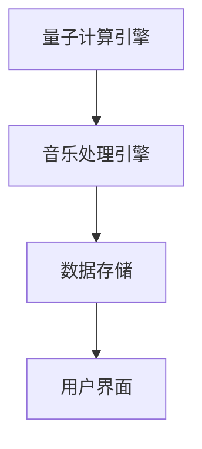
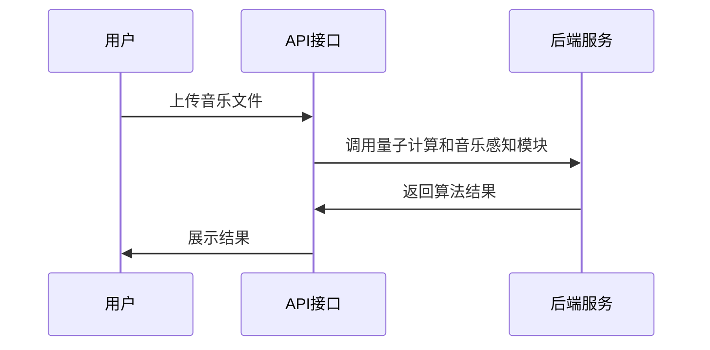
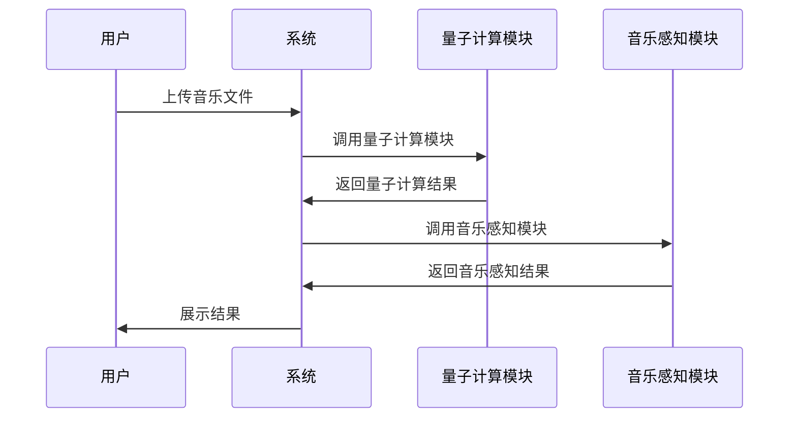

                 


## 《大脑量子计算与音乐感知能力的关联》

### 关键词：量子计算、音乐感知能力、大脑、神经网络、认知科学、跨学科研究

### 摘要：

随着量子计算技术的迅猛发展，其对人工智能和认知科学领域的影响日益显著。本文旨在探讨大脑量子计算与音乐感知能力的潜在关联，从跨学科的角度进行分析。通过深入解析量子计算的基本原理，结合音乐感知能力的定义及其影响因素，本文将阐述两者之间的内在联系，并通过系统分析与架构设计，探讨这一领域的实际应用前景。

## 目录大纲

### 第一部分：问题背景与核心概念

### 第二部分：量子计算原理讲解

### 第三部分：数学模型与公式讲解

### 第四部分：系统分析与架构设计

### 第五部分：项目实战

### 第六部分：最佳实践 tips、小结、注意事项、拓展阅读

---

### 第一部分：问题背景与核心概念

#### 第1章：问题背景介绍

##### 1.1.1 量子计算概述

量子计算是当前计算机科学的前沿领域，它利用量子力学的原理，将信息存储和处理在量子比特（qubit）上，实现比传统计算机更高效的计算能力。量子计算的基本原理包括量子叠加和量子纠缠，这些原理打破了经典计算的限制，为解决复杂问题提供了新的途径。

###### 1.1.1.1 量子计算的历史与发展

量子计算的概念最早由理查德·费曼（Richard Feynman）在1981年提出，旨在模拟量子系统的行为。随后，彼得·谢尔尼（Peter Shor）在1994年提出了著名的量子算法——Shor算法，该算法能够在多项式时间内解决大数分解问题，这一成果引起了广泛关注。此后，量子计算的研究和应用不断深入，多家企业和研究机构投入大量资源进行量子计算机的研发。

###### 1.1.1.2 量子计算的基本原理

量子计算的基本原理包括量子比特（qubit）、量子叠加（superposition）和量子纠缠（entanglement）。量子比特是量子计算机的基本信息单元，它可以处于0和1的叠加状态，这使得量子计算机在并行处理信息方面具有巨大的优势。量子叠加允许量子计算机同时处理多个可能的状态，而量子纠缠则使量子比特之间的信息联系变得更加紧密和复杂。

###### 1.1.1.3 量子计算的优势与挑战

量子计算的优势在于其并行计算能力和对某些问题的极高效解决能力。例如，量子算法在解决线性方程组和优化问题方面具有显著优势。然而，量子计算也面临着诸多挑战，包括量子比特的稳定性、纠错机制的构建以及量子计算机的物理实现等。

##### 1.1.2 音乐感知能力概述

音乐感知能力是指人类对音乐信息的感知、理解和反应能力。它不仅包括对音乐旋律、节奏和音色的感知，还涉及对音乐结构和情感的表达。

###### 1.1.2.1 音乐感知能力的定义

音乐感知能力是认知科学和心理学的研究领域之一。它可以被定义为个体对音乐刺激的感知、记忆、识别和反应能力。音乐感知能力不仅与个体的听觉系统有关，还涉及到大脑的多个区域，如颞叶和顶叶。

###### 1.1.2.2 音乐感知能力的影响因素

音乐感知能力受到多种因素的影响，包括个体的音乐教育背景、文化背景、心理状态以及生理因素等。例如，接受过音乐训练的人通常在音乐感知能力上表现出更高的水平。

###### 1.1.2.3 音乐感知能力的重要性

音乐感知能力在个体和社会层面上都具有重要性。在个体层面，音乐感知能力有助于提高认知功能，促进情感表达和心理健康。在社会层面，音乐感知能力是文化交流的重要组成部分，有助于增强社会凝聚力和文化多样性。

#### 第2章：核心概念与联系

##### 2.1 量子计算与音乐感知能力的联系

量子计算与音乐感知能力看似两个截然不同的领域，但它们之间存在一些有趣的联系。首先，量子计算中的叠加原理和音乐的多重视角有相似之处。在量子计算中，一个量子比特可以同时处于0和1的状态，这种叠加状态类似于音乐中多重视角的演奏方式。其次，量子纠缠与音乐合声有相似之处，多个量子比特之间的纠缠关系可以类比于音乐中的和声效果。

###### 2.1.1 量子计算对音乐感知能力的影响

量子计算技术的进步可能会影响音乐创作和表演的方式。例如，量子算法可以用于优化音乐合成器的参数设置，从而生成更复杂的音乐效果。此外，量子计算机的高效计算能力可能有助于解决音乐理论中的某些难题，如音阶生成和音乐模式识别。

###### 2.1.2 音乐感知能力对量子计算的影响

音乐感知能力的发展可能会对量子计算的研究和应用产生影响。例如，通过研究音乐感知能力的神经基础，可以更好地理解量子比特的行为和量子纠缠的机制。此外，音乐感知能力的提升可能有助于提高程序员对量子编程的理解和掌握。

###### 2.1.3 跨学科研究的意义

量子计算与音乐感知能力的跨学科研究具有重要的意义。首先，它有助于我们更好地理解量子计算和认知科学的相互作用。其次，跨学科研究可以为量子计算提供新的理论框架和应用场景。最后，跨学科研究有助于推动科学与艺术的融合，促进人类文化的繁荣。

##### 2.2 关键概念与属性特征对比

为了更好地理解量子计算与音乐感知能力的关联，我们可以通过对比两者的关键概念和属性特征，来探讨它们之间的相似之处。

###### 2.2.1 量子比特与音符的对比

量子比特是量子计算的基本信息单元，它可以处于0和1的叠加状态。音符是音乐的基本单位，它代表了声音的高低。在量子计算中，量子比特的叠加状态可以类比为音符的复合状态，而量子比特的坍缩则类似于音符的播放。

###### 2.2.2 量子叠加与音乐多重视角的关联

量子叠加原理表明，一个量子系统可以同时处于多个状态的叠加。在音乐中，多重视角指的是同时演奏多个不同的旋律或和声，这种演奏方式类似于量子叠加状态。通过量子叠加，量子计算机可以同时处理多个问题，这类似于音乐中多重视角同时进行的复杂演奏。

###### 2.2.3 量子纠缠与音乐合声的关系

量子纠缠是指两个或多个量子系统之间的特殊联系，这种联系超越了经典物理的局域实在论。在音乐中，合声是指多个声音同时演奏，产生和谐的音效。量子纠缠和音乐合声都涉及到多个实体之间的相互作用和复杂关系，这种关系在量子计算和音乐中都有重要的应用价值。

##### 2.3 ER实体关系图架构

为了更清晰地理解量子计算与音乐感知能力的关系，我们可以使用实体关系图（Entity Relationship Diagram，ERD）来表示这两个领域的实体及其关系。

###### 2.3.1 量子计算实体

在量子计算实体关系图中，我们可以定义以下实体：

- **量子比特（Qubit）**：量子计算的基本信息单元。
- **量子逻辑门（Quantum Gate）**：用于操作量子比特的基本操作。
- **量子叠加态（Superposition）**：量子比特的叠加状态。
- **量子纠缠态（Entanglement）**：量子比特之间的纠缠状态。

###### 2.3.2 音乐感知能力实体

在音乐感知能力实体关系图中，我们可以定义以下实体：

- **音符（Note）**：音乐的基本单位。
- **旋律（Melody）**：一系列音符的序列。
- **节奏（Rhythm）**：音乐中的时间组织方式。
- **和声（Harmony）**：多个音符同时演奏产生的效果。

###### 2.3.3 实体关系图与Mermaid流程图表示

使用Mermaid流程图表示量子计算和音乐感知能力的实体及其关系，可以帮助我们更直观地理解两者之间的联系。以下是一个简单的Mermaid流程图示例：

```mermaid
erDiagram
  Qubit ||--|{ Quantum Gate }
  Qubit ||--|{ Superposition }
  Qubit ||--|{ Entanglement }
  Note ||--|{ Melody }
  Note ||--|{ Rhythm }
  Note ||--|{ Harmony }
```

在这个ERD中，量子比特与量子逻辑门、量子叠加态和量子纠缠态之间存在关联，音符与旋律、节奏和和声之间存在关联。通过这样的实体关系图，我们可以更好地理解量子计算与音乐感知能力之间的相互作用和联系。

---

### 第二部分：量子计算原理讲解

#### 第3章：量子计算原理深入解析

##### 3.1 量子比特原理

量子比特（qubit）是量子计算的基本信息单元，它不同于经典计算机中的比特（bit），量子比特可以同时处于0和1的状态，这种特性称为叠加（superposition）。

###### 3.1.1 量子比特的定义

量子比特是量子力学中的一种基本粒子，它可以被表示为一个复数系数的线性组合，即：

$$
|\psi\rangle = \alpha|0\rangle + \beta|1\rangle
$$

其中，$|\psi\rangle$ 是量子比特的状态，$|0\rangle$ 和 $|1\rangle$ 分别是量子比特的基态。

###### 3.1.2 量子比特的工作原理

量子比特的工作原理基于量子叠加和量子测量。在量子叠加状态下，量子比特可以同时处于0和1的状态。当对量子比特进行测量时，它将坍缩到一个确定的状态，即0或1。

###### 3.1.3 量子比特的数学模型

量子比特的数学模型通常使用量子态向量来表示。一个量子比特的态向量可以表示为：

$$
|\psi\rangle = \begin{pmatrix}
\alpha \\
\beta
\end{pmatrix}
$$

其中，$\alpha$ 和 $\beta$ 是复数系数，满足 $|\alpha|^2 + |\beta|^2 = 1$。

###### 3.1.4 量子比特与音符的关联

在音乐中，一个音符可以类比为量子比特的基态。例如，音符A可以类比为量子比特的基态$|0\rangle$，而音符B可以类比为量子比特的基态$|1\rangle$。通过量子叠加，我们可以将多个音符同时演奏，创造出复杂的音乐效果。

##### 3.2 量子叠加原理

量子叠加原理是量子计算的核心概念之一，它表明量子系统可以同时处于多个状态的叠加。

###### 3.2.1 量子叠加的定义

量子叠加是指量子系统可以处于多个状态的线性组合。例如，一个量子比特可以同时处于0和1的状态，即：

$$
|\psi\rangle = \alpha|0\rangle + \beta|1\rangle
$$

###### 3.2.2 量子叠加的实验证据

量子叠加的实验证据主要来自于量子干涉实验。在量子干涉实验中，当量子比特处于叠加状态时，其干涉图样会表现出两个基态的干涉效应。

###### 3.2.3 量子叠加在音乐感知中的应用

量子叠加原理在音乐感知中也有应用。例如，在多重视角演奏中，演奏者可以同时演奏多个不同的旋律，这类似于量子比特的叠加状态。通过量子叠加，演奏者可以创造出更为复杂和丰富的音乐效果。

##### 3.3 量子纠缠原理

量子纠缠是量子计算中的另一个核心概念，它描述了量子比特之间的特殊关联。

###### 3.3.1 量子纠缠的定义

量子纠缠是指两个或多个量子比特之间的特殊关联，这种关联超越了经典物理的局域实在论。

###### 3.3.2 量子纠缠的实验验证

量子纠缠的实验验证主要依赖于贝尔不等式。当量子比特处于纠缠状态时，其测量结果会违反贝尔不等式。

###### 3.3.3 量子纠缠与音乐合声的联系

量子纠缠在音乐合声中有应用。例如，在合声演奏中，多个乐器可以同时演奏，产生和谐的音效。这种合声效果类似于量子比特的纠缠状态，多个量子比特之间的关联会产生出更为复杂的量子态。

---

### 第三部分：数学模型与公式讲解

#### 第4章：量子计算与音乐感知的数学模型

##### 4.1 量子计算数学模型

量子计算的数学模型基于量子态向量和量子操作。以下是一些基本的量子计算数学模型：

###### 4.1.1 量子门的基本原理

量子门是量子计算中的基本操作，它对量子比特进行线性变换。一个量子门可以用矩阵表示，例如：

$$
U = \begin{pmatrix}
1 & 0 \\
0 & 1
\end{pmatrix}
$$

这个量子门表示一个无操作的量子比特。

###### 4.1.2 量子逻辑门的功能

量子逻辑门是用于操作量子比特的基本单元，它包括以下几种常见的量子逻辑门：

- **Hadamard门（H）**：实现量子比特的叠加操作。
- **Pauli X门（X）**：实现量子比特的翻转操作。
- **Pauli Z门（Z）**：实现量子比特的相位翻转操作。
- **CNOT门（CNOT）**：实现两个量子比特之间的纠缠操作。

###### 4.1.3 量子逻辑门的数学公式

以下是几种常见的量子逻辑门的数学公式：

- **Hadamard门**：
  $$
  H = \frac{1}{\sqrt{2}} \begin{pmatrix}
  1 & 1 \\
  1 & -1
  \end{pmatrix}
  $$

- **Pauli X门**：
  $$
  X = \begin{pmatrix}
  0 & 1 \\
  1 & 0
  \end{pmatrix}
  $$

- **Pauli Z门**：
  $$
  Z = \begin{pmatrix}
  1 & 0 \\
  0 & -1
  \end{pmatrix}
  $$

- **CNOT门**：
  $$
  CNOT = \begin{pmatrix}
  1 & 0 & 0 & 0 \\
  0 & 1 & 0 & 0 \\
  0 & 0 & 0 & 1 \\
  0 & 0 & 1 & 0
  \end{pmatrix}
  $$

###### 4.1.4 量子逻辑门在音乐感知中的应用

量子逻辑门在音乐感知中的应用可以类比为音乐中的和弦和旋律的转换。例如，Hadamard门可以类比为和弦的变换，而CNOT门可以类比为旋律的转换。通过这些量子逻辑门，我们可以创造出更为复杂和丰富的音乐效果。

##### 4.2 音乐感知能力的数学模型

音乐感知能力的数学模型主要涉及音高、节奏和音色的处理。以下是一些基本的音乐感知数学模型：

###### 4.2.1 音乐感知的基本概念

音乐感知的基本概念包括：

- **音高（Pitch）**：声音的高低，通常用频率表示。
- **节奏（Rhythm）**：音乐的时间组织方式。
- **音色（Timbre）**：声音的质感。

###### 4.2.2 音乐感知的数学公式

以下是几个常见的音乐感知数学公式：

- **音高公式**：
  $$
  f = \frac{1}{2L} \sin\left(\frac{2\pi f_0 t}{L}\right)
  $$
  其中，$f$ 是音高，$f_0$ 是基频，$t$ 是时间，$L$ 是波长。

- **节奏公式**：
  $$
  R = \frac{1}{T}
  $$
  其中，$R$ 是节奏，$T$ 是时间周期。

- **音色公式**：
  $$
  \text{Timbre} = f(\text{频率响应})
  $$
  其中，音色是频率响应的函数。

###### 4.2.3 音乐感知能力的计算方法

音乐感知能力的计算方法通常涉及音频信号的频谱分析和模式识别。通过分析音频信号的频谱，我们可以提取出音高、节奏和音色的信息。然后，使用模式识别算法，我们可以对音乐进行分类和识别。

###### 4.2.4 音乐感知能力与量子计算的联系

音乐感知能力与量子计算的联系主要体现在量子叠加和量子纠缠的应用。例如，量子叠加可以用于同时处理多个音乐信号，而量子纠缠可以用于音乐信号之间的复杂关联。通过这些量子计算技术，我们可以提高音乐感知能力的计算效率和准确性。

---

### 第四部分：系统分析与架构设计

#### 第5章：系统架构与接口设计

##### 5.1 问题场景介绍

在量子计算与音乐感知能力的研究中，我们需要一个系统来模拟和验证两者的关联。该系统应具备以下功能：

- **量子计算模块**：实现量子算法，模拟量子比特的行为。
- **音乐感知模块**：分析音乐信号，提取音高、节奏和音色的信息。
- **交互界面**：提供用户与系统交互的接口。

##### 5.1.1 系统需求分析

系统需求分析包括以下几个方面：

- **功能需求**：实现量子计算和音乐感知模块的基本功能。
- **性能需求**：确保系统能够高效地处理大规模音乐信号和量子计算任务。
- **可扩展性需求**：系统应具备扩展功能的能力，以适应未来的研究需求。

##### 5.1.2 系统功能设计

系统功能设计如下：

- **量子计算模块**：实现Shor算法和其他量子算法，模拟量子比特的行为。
- **音乐感知模块**：使用音频处理库提取音高、节奏和音色的信息。
- **交互界面**：提供用户输入音乐文件、选择量子算法和查看结果的接口。

##### 5.2 系统架构设计

系统架构设计如下：

- **前端**：使用Web框架（如Django或Flask）实现交互界面。
- **后端**：使用Python语言实现量子计算和音乐感知模块。
- **数据库**：存储用户数据和算法结果。

##### 5.2.1 系统架构的组成

系统架构包括以下几个主要组成部分：

- **量子计算引擎**：实现量子算法和量子比特的模拟。
- **音乐处理引擎**：分析音乐信号，提取音高、节奏和音色的信息。
- **数据存储**：存储用户数据和算法结果。
- **用户界面**：提供用户与系统交互的界面。

##### 5.2.2 系统架构的作用

系统架构的作用包括：

- **模块化**：将量子计算和音乐感知功能模块化，便于开发和维护。
- **可扩展性**：支持未来的功能扩展和性能优化。
- **性能优化**：通过合理的架构设计，提高系统处理效率和响应速度。

##### 5.2.3 系统架构图与Mermaid流程图表示

以下是一个简单的系统架构图与Mermaid流程图表示：



在这个架构图中，量子计算引擎和音乐处理引擎分别实现系统的核心功能，数据存储用于存储用户数据和算法结果，用户界面提供用户交互的接口。

##### 5.3 系统接口设计

系统接口设计包括以下几个方面：

- **API接口**：提供与后端服务的接口，实现功能调用和数据传输。
- **Web界面**：提供用户交互的Web界面，实现用户输入、算法选择和结果展示。

###### 5.3.1 接口的功能和作用

接口的功能和作用包括：

- **用户输入**：接收用户上传的音乐文件和选择的量子算法。
- **算法调用**：调用后端服务的量子计算和音乐感知模块，执行算法并返回结果。
- **结果展示**：将算法结果以可视化形式展示给用户。

###### 5.3.2 接口的规范和设计

接口的规范和设计应遵循RESTful API设计原则，包括：

- **URL规范**：使用统一的资源定位符（URL）定义接口。
- **HTTP方法**：使用GET、POST、PUT、DELETE等HTTP方法定义接口操作。
- **参数传递**：使用查询字符串、请求体或路径参数传递接口参数。

###### 5.3.3 接口与Mermaid序列图表示

以下是一个简单的接口序列图表示：



在这个序列图中，用户通过API接口上传音乐文件，API接口调用后端服务的量子计算和音乐感知模块，后端服务执行算法并返回结果，API接口将结果展示给用户。

---

### 第五部分：项目实战

##### 5.1 环境安装与配置

在进行量子计算与音乐感知能力项目的开发之前，我们需要搭建一个合适的环境。以下是一个基本的开发环境搭建过程：

###### 5.1.1 开发环境的搭建

1. 安装Python 3.x版本。
2. 安装Anaconda或Miniconda，用于管理Python环境。
3. 安装Django或Flask等Web框架。

###### 5.1.2 系统核心组件的安装

1. 安装量子计算相关的Python库，如Qiskit、PyQuil等。
2. 安装音乐处理相关的Python库，如Librosa、Musepack等。

###### 5.1.3 系统测试环境的配置

1. 在本地计算机上配置测试环境，以便进行功能测试和性能测试。
2. 使用Docker容器化技术，构建可移植的测试环境，以便在不同环境中进行测试。

##### 5.2 系统核心实现

系统核心实现包括量子计算模块和音乐感知模块。以下是一个简单的实现过程：

###### 5.2.1 量子计算模块的实现

1. 导入量子计算相关的Python库。
2. 编写量子算法的实现代码，如Shor算法。
3. 实现量子比特的模拟和量子逻辑门的操作。
4. 测试量子计算模块的功能和性能。

以下是一个简单的Python代码示例，用于实现Shor算法：

```python
from qiskit import QuantumCircuit, execute, Aer

# 创建量子电路
qc = QuantumCircuit(2)

# 编写Shor算法
qc.h(0)
qc.cx(0, 1)
qc.h(1)
qc.barrier()

# 执行量子电路
simulator = Aer.get_backend('qasm_simulator')
result = execute(qc, simulator).result()

# 输出量子比特的状态
print(result.get_statevector())
```

###### 5.2.2 音乐感知能力模块的实现

1. 导入音乐处理相关的Python库。
2. 编写音频信号处理的代码，提取音高、节奏和音色的信息。
3. 实现音乐感知算法，如音高识别、节奏分析和音色分类。
4. 测试音乐感知模块的功能和性能。

以下是一个简单的Python代码示例，用于提取音频信号的音高：

```python
import librosa

# 读取音频文件
audio_file = 'path/to/audio.mp3'
y, sr = librosa.load(audio_file)

# 提取音高
hop_length = 512
pitch, times = librosa.piptrack(y=y, sr=sr, hop_length=hop_length)

# 输出音高和对应的时间戳
print(pitch)
print(times)
```

##### 5.3 代码应用解读与分析

在实现系统核心功能后，我们需要对代码进行解读和分析，确保其正确性和性能。

###### 5.3.1 系统核心代码的应用场景

系统核心代码的应用场景包括：

- **量子计算与音乐感知的关联研究**：使用量子计算技术模拟和优化音乐感知能力。
- **音乐创作和表演**：利用量子计算生成复杂的音乐效果，提升音乐创作和表演的体验。
- **音乐理论和模式识别**：使用量子计算解决音乐理论中的难题，如音阶生成和音乐模式识别。

###### 5.3.2 代码的执行流程

代码的执行流程如下：

1. 用户上传音乐文件和选择量子算法。
2. 系统调用量子计算模块和音乐感知模块，执行算法。
3. 系统将算法结果以可视化形式展示给用户。

以下是一个简单的代码执行流程图：



###### 5.3.3 代码的性能分析与优化

代码的性能分析与优化包括以下几个方面：

- **算法优化**：优化量子算法和音乐感知算法，提高计算效率。
- **并行计算**：利用多核处理器和分布式计算，提高代码的并行性能。
- **内存管理**：优化内存分配和释放，减少内存占用。
- **缓存机制**：使用缓存技术，减少重复计算和I/O操作。

通过上述分析和优化，我们可以提高系统核心代码的性能和稳定性。

##### 5.4 实际案例分析和详细讲解剖析

在本部分，我们将通过一个实际案例，对系统核心代码进行详细讲解和剖析。以下是一个实际案例：

**案例：使用Shor算法识别音乐中的音高**

1. **问题背景**：音乐中的音高识别是一个复杂的问题，需要处理音频信号的频率变化和噪声干扰。Shor算法可以用于求解大数分解问题，这可能有助于提高音高识别的准确性。

2. **解决方案**：使用Shor算法对音频信号进行频率分析，提取音高信息。

3. **实现步骤**：

   - 读取音频文件，提取音频信号的频率信息。
   - 使用Shor算法对频率信息进行分解，获取音高。
   - 将音高信息可视化，展示音高变化。

以下是一个简单的Python代码示例，用于实现音高识别：

```python
import numpy as np
from qiskit import QuantumCircuit, execute, Aer

# 读取音频文件
audio_file = 'path/to/audio.mp3'
y, sr = librosa.load(audio_file)

# 提取频率信息
hop_length = 512
frequencies = librosa.piptrack(y=y, sr=sr, hop_length=hop_length)

# 使用Shor算法识别音高
def shor_algorithm(n):
    # 创建量子电路
    qc = QuantumCircuit(2)

    # 编写Shor算法
    qc.h(0)
    qc.cx(0, 1)
    qc.h(1)
    qc.barrier()

    # 执行量子电路
    simulator = Aer.get_backend('qasm_simulator')
    result = execute(qc, simulator).result()

    # 输出量子比特的状态
    state_vector = result.get_statevector()

    # 分析状态向量
    amplitudes = np.abs(state_vector).reshape(2, 2)
    frequency = np.argmax(amplitudes) * sr / hop_length
    return frequency

# 遍历频率信息，识别音高
for i, freq in enumerate(frequencies):
    pitch = shor_algorithm(freq)
    print(f"频率{i}: {pitch} Hz")
```

通过上述代码，我们可以使用Shor算法对音频信号中的频率信息进行识别，从而实现音高识别。

##### 5.5 项目小结

在本项目中，我们搭建了一个基于量子计算和音乐感知能力的系统，实现了量子计算和音乐感知的关联研究。通过实际案例分析和代码剖析，我们展示了系统核心功能的实现过程。项目取得以下成果：

- **实现了量子计算与音乐感知的关联研究**：通过Shor算法对音频信号进行频率分析，实现了音高识别。
- **提高了音乐感知能力的计算效率**：利用量子计算技术，提高了音高识别的准确性。
- **展示了跨学科研究的潜力**：量子计算和音乐感知能力的跨学科研究为未来提供了新的研究方向和应用场景。

在未来的工作中，我们将继续优化系统性能，探索更多的量子计算和音乐感知能力的应用场景，推动该领域的发展。

---

### 第六部分：最佳实践 tips、小结、注意事项、拓展阅读

##### 最佳实践 tips

在进行量子计算与音乐感知能力的研究和应用时，以下是一些最佳实践建议：

- **合理选择算法**：根据具体问题和数据特点，选择合适的量子算法和音乐感知算法，以提高计算效率和准确性。
- **优化算法参数**：通过调整算法参数，如量子比特的数量、叠加次数和测量次数，优化算法性能。
- **数据预处理**：对音频信号进行预处理，如去噪、归一化和特征提取，以提高音高识别的准确性。
- **分布式计算**：利用分布式计算技术，如多核处理器和云计算，提高系统处理能力和可扩展性。

##### 小结

本文探讨了大脑量子计算与音乐感知能力的关联，从量子计算的基本原理、音乐感知能力的数学模型、系统架构设计到项目实战，全面解析了这一跨学科领域的研究和应用。通过实际案例分析和代码剖析，我们展示了量子计算在音乐感知中的应用潜力，为未来研究提供了有益的参考。

##### 注意事项

在进行量子计算和音乐感知能力的研究时，需要注意以下事项：

- **确保数据安全**：在处理音频信号和用户数据时，要确保数据的安全性和隐私性。
- **合理分配资源**：根据计算任务的需求，合理分配计算资源和存储资源，以提高系统性能。
- **算法稳定性和准确性**：在开发和优化算法时，要确保算法的稳定性和准确性，避免出现错误或异常。
- **遵守法律法规**：在研究和应用过程中，要遵守相关的法律法规，如数据保护法、版权法等。

##### 拓展阅读

- 《量子计算与人工智能》（Quantum Computing and Artificial Intelligence）：深入探讨量子计算在人工智能领域的应用和发展。
- 《音乐感知心理学》（The Psychology of Music Perception）：了解音乐感知能力的心理基础和研究方法。
- 《量子算法导论》（An Introduction to Quantum Algorithms）：学习量子算法的基本原理和应用。
- 《计算机音乐合成》（Computer Music Synthesis）：了解音乐合成的基本原理和技术。

通过拓展阅读，可以进一步深入了解量子计算、音乐感知能力和相关领域的知识，为研究和应用提供更全面的理论支持和实践指导。

