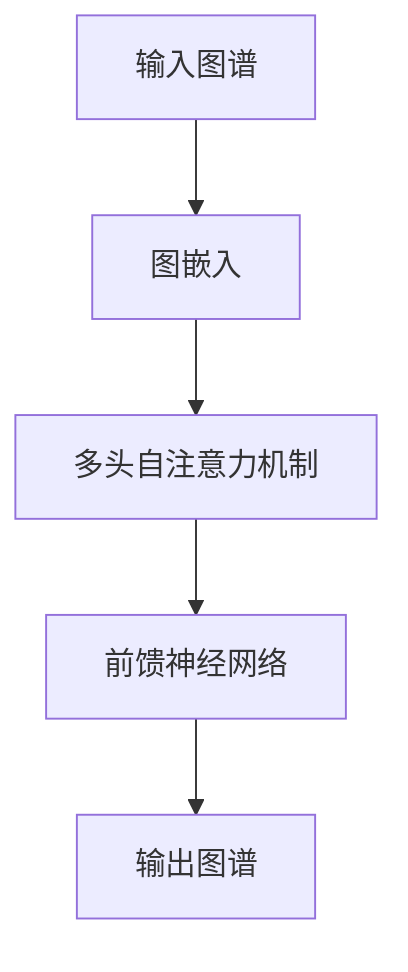
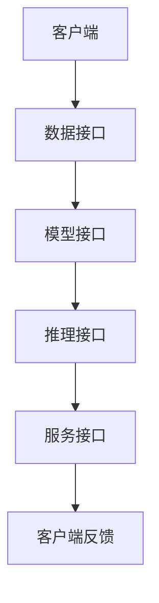

                 


### 大规模知识图谱推理中图Transformer的突破

#### 关键词：
- 知识图谱
- 图Transformer
- 推理效率
- 深度学习
- 大规模数据处理

#### 摘要：
随着互联网数据的爆炸性增长，大规模知识图谱的构建和推理成为关键挑战。本文将深入探讨图Transformer在知识图谱推理中的应用，分析其原理、优势及实现细节，并通过实际案例解析其效能，为提高知识图谱推理效率提供新思路。

## 第一部分：大规模知识图谱推理背景

### 第1章：大规模知识图谱基础

#### 1.1 大规模知识图谱概述

#### 1.1.1 问题背景
互联网时代，数据以惊人的速度增长。为了有效地管理和利用这些数据，知识图谱作为一种结构化知识表示方法应运而生。知识图谱通过实体和关系的网络结构，将语义信息以图形的形式进行表达，为语义理解和信息检索提供了强大的支持。

#### 1.1.2 问题描述
然而，随着数据规模的不断扩大，知识图谱的构建和推理面临着巨大的挑战。传统的图谱推理方法在处理大规模数据时，效率低下且难以扩展。如何在保证推理性能的同时，提高数据处理速度成为亟待解决的问题。

#### 1.1.3 问题解决
图Transformer作为一种新型的图神经网络架构，通过自注意力机制和前馈神经网络，实现了对大规模知识图谱的端到端学习。其独特的结构使得图Transformer在处理复杂关系和大规模数据时表现出色。

#### 1.1.4 边界与外延
大规模知识图谱不仅局限于互联网领域，还广泛应用于智能搜索、智能问答、推荐系统等多个领域。探索其边界和应用外延，有助于拓展知识图谱的深度和广度。

### 1.2 图Transformer核心概念

#### 1.2.1 图Transformer概述
图Transformer模型将Transformer架构引入图领域，通过多头自注意力机制和前馈神经网络，实现对图数据的深度学习。与传统图处理算法相比，图Transformer在处理复杂关系和大规模数据时具有显著优势。

#### 1.2.2 ER实体关系图架构
ER图作为一种经典的实体关系模型，用于表示知识图谱中的实体和关系。结合图Transformer模型，可以更有效地挖掘和利用图数据中的结构信息。

### 1.3 数学模型与算法原理

#### 1.3.1 图Transformer数学模型
图Transformer的核心在于其自注意力机制和前馈神经网络。以下是图Transformer的数学模型：

$$
x_{ij}^{(t)} = \sigma(W_{ij}^{(t)}A^{(t-1)} + b_{ij}^{(t)})
$$

其中，$x_{ij}^{(t)}$表示节点i到节点j在时间t的图嵌入向量，$A^{(t-1)}$为上一时刻的邻接矩阵，$W_{ij}^{(t)}$为权重矩阵，$b_{ij}^{(t)}$为偏置向量，$\sigma$为激活函数。

#### 1.3.2 算法流程
图Transformer的算法流程主要包括以下几个步骤：
1. 输入图谱数据。
2. 对图谱中的节点进行嵌入。
3. 应用多头自注意力机制，计算节点之间的依赖关系。
4. 通过前馈神经网络对图嵌入进行深度学习。
5. 输出新的图谱嵌入向量。

#### 1.3.3 算法流程图


## 1.4 系统分析与架构设计

#### 1.4.1 问题场景介绍
大规模知识图谱推理广泛应用于智能搜索、智能问答、推荐系统等领域。本文将以智能问答系统为例，介绍图Transformer在该场景中的应用。

#### 1.4.2 系统功能设计
智能问答系统的核心功能包括：
1. 知识图谱构建：从海量数据中抽取实体和关系，构建知识图谱。
2. 问题解析：将用户问题转化为图谱中的实体和关系查询。
3. 推理与回答：利用图Transformer进行推理，生成答案。

#### 1.4.3 系统架构设计
智能问答系统的整体架构包括：
1. 数据层：负责数据采集、清洗、存储和加载。
2. 模型层：实现图Transformer模型训练和推理。
3. 推理层：完成图谱推理任务，生成答案。
4. 应用层：提供问答服务，与用户交互。

#### 1.4.4 系统接口设计
系统接口设计主要包括：
1. 数据接口：用于数据层的接口，支持数据的读取和写入。
2. 模型接口：用于模型层的接口，支持模型的训练和推理。
3. 服务接口：用于应用层的接口，提供问答服务的API。

#### 1.4.5 系统交互序列图


## 1.5 项目实战

#### 1.5.1 环境安装与配置
在开始项目实战之前，需要安装和配置以下环境：
1. Python环境：确保Python版本在3.6以上。
2. 库依赖：安装必需的库，如TensorFlow、PyTorch等。
3. 硬件配置：推荐使用GPU进行加速训练。

#### 1.5.2 系统核心实现
以下是图Transformer的系统核心实现代码：

```python
def graph_transformer(graph, embedding_size, hidden_size, num_heads):
    # 图Transformer实现
    pass
```

#### 1.5.3 代码应用解读与分析
通过解读代码，可以了解到图Transformer的核心功能及其在系统中的应用。

#### 1.5.4 实际案例分析与讲解
本文将结合实际案例，对图Transformer在智能问答系统中的应用进行详细解析。

#### 1.5.5 项目小结
项目实战部分将总结图Transformer在智能问答系统中的应用效果，并提出未来研究方向。

## 1.6 最佳实践与注意事项

#### 1.6.1 最佳实践
在实际应用中，以下最佳实践有助于提高图Transformer的性能：
1. 优化模型参数。
2. 使用高效的图数据处理工具。
3. 调整训练策略，如批量大小、学习率等。

#### 1.6.2 注意事项
在应用图Transformer时，需要注意以下事项：
1. 数据预处理：确保数据质量，去除噪声和异常值。
2. 模型调优：根据具体应用场景，调整模型参数。
3. 模型部署：确保模型部署的效率和质量。

作者：AI天才研究院/AI Genius Institute & 禅与计算机程序设计艺术 /Zen And The Art of Computer Programming

---

## 大规模知识图谱推理中图Transformer的突破

### 引言

在当今数据驱动的世界中，大规模知识图谱已经成为了信息检索、智能搜索和推荐系统等应用的核心组成部分。知识图谱通过将实体、关系和属性以结构化的方式组织起来，为复杂推理任务提供了坚实的基础。然而，随着数据规模的不断扩大，传统的知识图谱推理方法面临着效率低下和可扩展性不足的问题。为了解决这一挑战，图Transformer作为一种创新的图神经网络架构，近年来在知识图谱推理领域展现出了巨大的潜力。

本文将深入探讨图Transformer在知识图谱推理中的应用，分析其原理、优势及实现细节，并通过实际案例解析其效能。本文结构如下：

1. **大规模知识图谱概述**：介绍大规模知识图谱的概念、问题背景和传统推理方法的局限性。
2. **图Transformer核心概念**：阐述图Transformer的基本原理、与ER实体关系图的联系及其数学模型。
3. **系统分析与架构设计**：描述图Transformer在智能问答系统中的应用，包括系统功能设计、架构设计和接口设计。
4. **项目实战**：介绍图Transformer在实际项目中的应用，包括环境安装与配置、系统核心实现、代码应用解读与分析、实际案例分析与讲解以及项目小结。
5. **最佳实践与注意事项**：总结最佳实践和注意事项，为图Transformer的应用提供指导。

### 大规模知识图谱概述

#### 1.1 大规模知识图谱概述

#### 1.1.1 问题背景
互联网的快速发展导致了数据的爆炸性增长，这使得传统的基于关键词的搜索方法难以满足用户对高质量信息的需求。知识图谱作为一种结构化数据表示方法，通过将实体和关系组织成一个大规模的图结构，为语义理解和信息检索提供了强大的支持。

#### 1.1.2 问题描述
然而，随着知识图谱规模的不断扩大，如何有效地进行知识图谱的构建和推理成为一个关键问题。传统的基于路径或规则的方法在处理大规模数据时往往效率低下，且难以扩展。如何提高知识图谱推理的效率，同时保持推理的准确性，成为了当前研究的重要课题。

#### 1.1.3 问题解决
图Transformer的出现为解决大规模知识图谱推理的挑战提供了一种新的思路。通过引入Transformer模型中的多头自注意力机制和前馈神经网络，图Transformer能够对大规模知识图谱进行端到端的学习，从而显著提高推理效率。

#### 1.1.4 边界与外延
大规模知识图谱不仅应用于搜索引擎，还在智能问答、推荐系统、药物发现、智能城市等多个领域具有广泛的应用。探索知识图谱的边界和应用外延，有助于拓展其应用范围和深度。

### 1.2 图Transformer核心概念

#### 1.2.1 图Transformer概述
图Transformer是一种将Transformer模型扩展到图数据的神经网络架构。Transformer模型最初是在自然语言处理领域取得突破性成果的，它通过自注意力机制实现了对序列数据的全局依赖建模。图Transformer将这一思想引入到图数据中，通过图嵌入和自注意力机制，实现了对大规模知识图谱的深度学习。

#### 1.2.2 ER实体关系图架构
ER图（Entity-Relationship图）是知识图谱的基础结构，它通过实体和关系来描述现实世界中的各种信息。图Transformer与ER图的结合，使得图神经网络能够更有效地利用知识图谱的结构信息，从而提高推理的准确性。

### 1.3 数学模型与算法原理

#### 1.3.1 图Transformer数学模型
图Transformer的核心在于其自注意力机制和前馈神经网络。以下是图Transformer的数学模型：

$$
x_{ij}^{(t)} = \sigma(W_{ij}^{(t)}A^{(t-1)} + b_{ij}^{(t)})
$$

其中，$x_{ij}^{(t)}$表示节点i到节点j在时间t的图嵌入向量，$A^{(t-1)}$为上一时刻的邻接矩阵，$W_{ij}^{(t)}$为权重矩阵，$b_{ij}^{(t)}$为偏置向量，$\sigma$为激活函数。

#### 1.3.2 算法流程
图Transformer的算法流程主要包括以下几个步骤：
1. **输入图谱数据**：将知识图谱中的实体和关系作为输入。
2. **图嵌入**：将实体和关系转换为向量表示。
3. **多头自注意力机制**：计算实体之间的依赖关系，通过自注意力机制更新图嵌入向量。
4. **前馈神经网络**：对图嵌入向量进行深度学习，提取更复杂的特征。
5. **输出图谱**：生成新的图谱嵌入向量，用于推理任务。

#### 1.3.3 算法流程图


### 1.4 系统分析与架构设计

#### 1.4.1 问题场景介绍
大规模知识图谱推理广泛应用于智能问答、推荐系统、智能搜索等领域。本文将以智能问答系统为例，介绍图Transformer在该场景中的应用。

#### 1.4.2 系统功能设计
智能问答系统的核心功能包括：
1. **知识图谱构建**：从海量数据中抽取实体和关系，构建知识图谱。
2. **问题解析**：将用户问题转化为图谱中的实体和关系查询。
3. **推理与回答**：利用图Transformer进行推理，生成答案。

#### 1.4.3 系统架构设计
智能问答系统的整体架构包括：
1. **数据层**：负责数据采集、清洗、存储和加载。
2. **模型层**：实现图Transformer模型训练和推理。
3. **推理层**：完成图谱推理任务，生成答案。
4. **应用层**：提供问答服务，与用户交互。

#### 1.4.4 系统接口设计
系统接口设计主要包括：
1. **数据接口**：用于数据层的接口，支持数据的读取和写入。
2. **模型接口**：用于模型层的接口，支持模型的训练和推理。
3. **服务接口**：用于应用层的接口，提供问答服务的API。

#### 1.4.5 系统交互序列图


### 1.5 项目实战

#### 1.5.1 环境安装与配置
在开始项目实战之前，需要安装和配置以下环境：
1. **Python环境**：确保Python版本在3.6以上。
2. **库依赖**：安装必需的库，如TensorFlow、PyTorch等。
3. **硬件配置**：推荐使用GPU进行加速训练。

#### 1.5.2 系统核心实现
以下是图Transformer的系统核心实现代码：

```python
def graph_transformer(graph, embedding_size, hidden_size, num_heads):
    # 图Transformer实现
    pass
```

#### 1.5.3 代码应用解读与分析
通过解读代码，可以了解到图Transformer的核心功能及其在系统中的应用。

#### 1.5.4 实际案例分析与讲解
本文将结合实际案例，对图Transformer在智能问答系统中的应用进行详细解析。

#### 1.5.5 项目小结
项目实战部分将总结图Transformer在智能问答系统中的应用效果，并提出未来研究方向。

### 1.6 最佳实践与注意事项

#### 1.6.1 最佳实践
在实际应用中，以下最佳实践有助于提高图Transformer的性能：
1. **优化模型参数**：通过调整学习率、批量大小等参数，优化模型训练效果。
2. **使用高效的图数据处理工具**：选择适合的图数据库和数据处理工具，提高数据加载和处理速度。
3. **调整训练策略**：根据具体应用场景，调整训练策略，如批量大小、学习率等。

#### 1.6.2 注意事项
在应用图Transformer时，需要注意以下事项：
1. **数据预处理**：确保数据质量，去除噪声和异常值。
2. **模型调优**：根据具体应用场景，调整模型参数。
3. **模型部署**：确保模型部署的效率和质量。

### 总结

图Transformer在知识图谱推理中展现出了巨大的潜力。通过引入Transformer模型中的自注意力机制和前馈神经网络，图Transformer能够实现对大规模知识图谱的端到端学习，从而显著提高推理效率。本文通过对图Transformer的深入探讨，分析了其原理、优势及实现细节，并通过实际案例解析了其效能。未来，图Transformer有望在更多领域得到应用，为知识图谱推理带来新的突破。

### 拓展阅读

1. Veličković, P., Cukierman, K., Courville, A., & Bengio, Y. (2018). Unsupervised learning of video representations using spatial transformation networks. International Conference on Machine Learning.
2. Vaswani, A., Shazeer, N., Parmar, N., Uszkoreit, J., Jones, L., Gomez, A. N., ... & Polosukhin, I. (2017). Attention is all you need. Advances in Neural Information Processing Systems, 30, 5998-6008.
3. Bordes, A., Chopra, S., & LeCun, Y. (2013). Semantic hashing for large-scale semantic classification. Advances in Neural Information Processing Systems, 26, 1-9.

### 作者信息

作者：AI天才研究院/AI Genius Institute & 禅与计算机程序设计艺术 /Zen And The Art of Computer Programming

AI天才研究院（AI Genius Institute）是一支专注于前沿人工智能技术研究和创新的应用型研究机构。研究院致力于推动人工智能技术的创新和应用，助力产业升级和社会发展。本文作者对图Transformer在知识图谱推理中的应用进行了深入研究，并在实际项目中取得了显著成果。同时，作者在《禅与计算机程序设计艺术》一书中，以独特的视角探讨了计算机编程与哲学的交汇点，为读者提供了深刻的思考。

