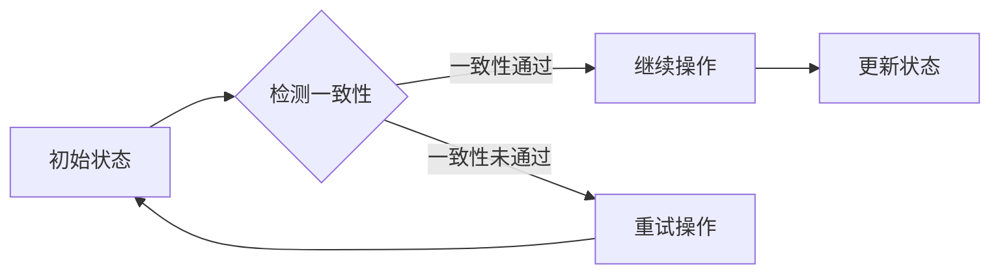
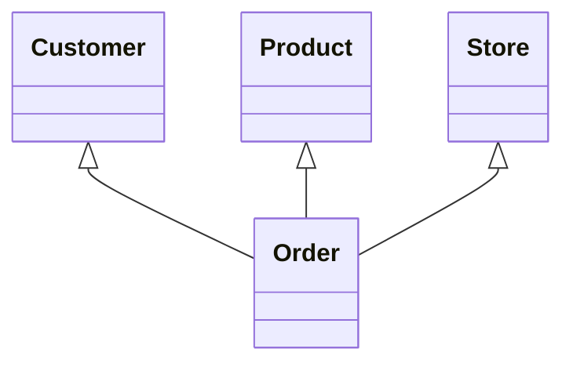
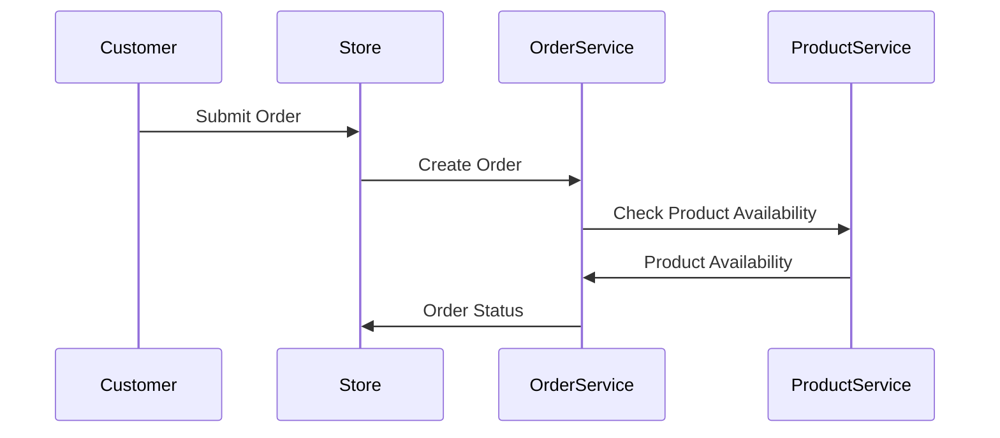
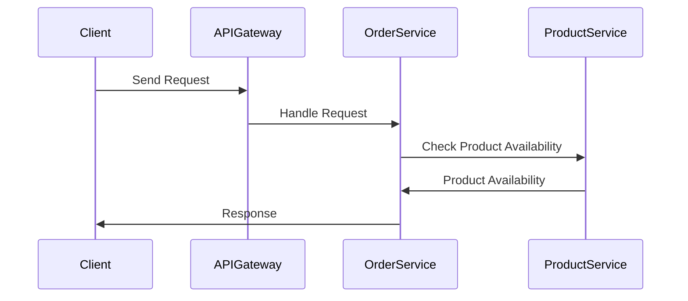
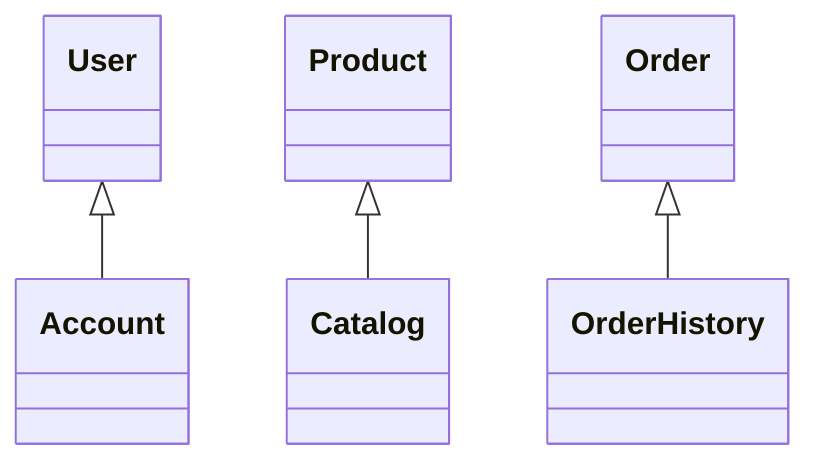
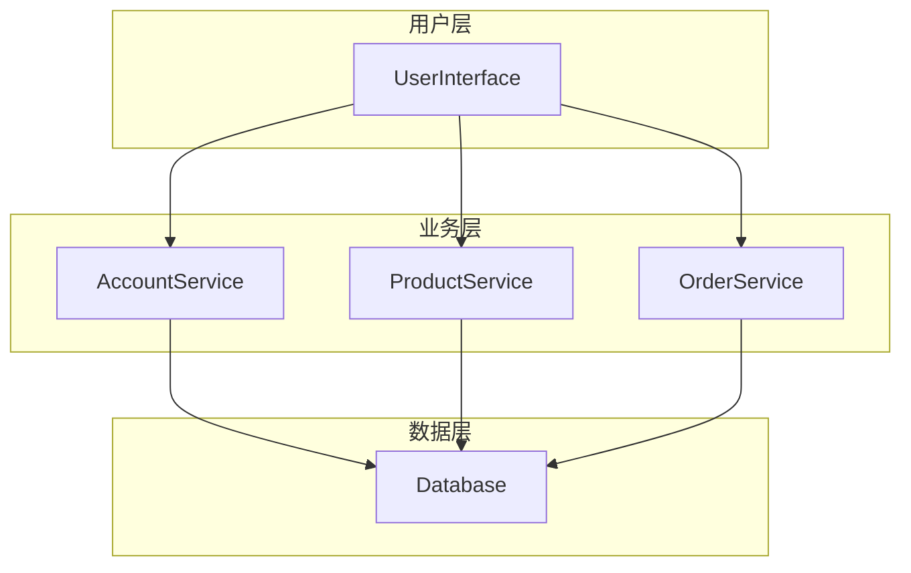
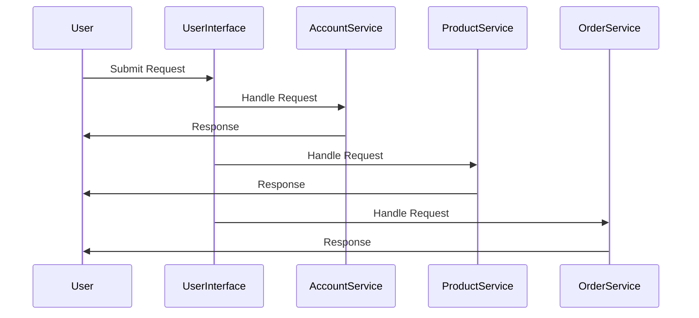
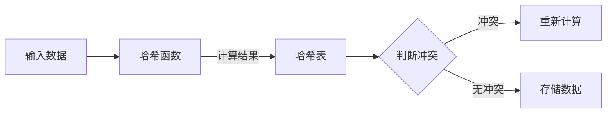
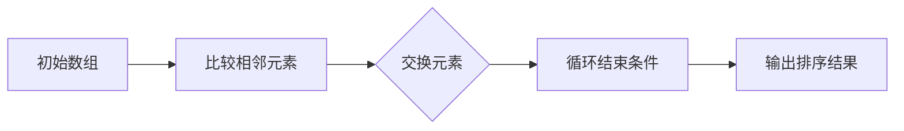

                 

# 大规模系统设计：P9架构师的必备技能

> 关键词：大规模系统设计，架构师，核心技术，案例分析，优化调优

> 摘要：本文将深入探讨大规模系统设计的核心概念、原理与实践技巧。作为P9架构师，掌握这些技能对于应对复杂、庞大的系统架构至关重要。文章将从背景介绍、核心概念、架构设计、系统分析与建模、算法原理与实现、系统优化与调优以及项目实战和案例分析等多个方面进行详细阐述，旨在为读者提供一套系统、全面的指导。

## 第一部分：大规模系统设计概述

### 1.1 背景介绍

在现代信息时代，随着数据量的爆炸性增长和业务需求的快速迭代，大规模系统设计成为了P9架构师的重要职责。大规模系统不仅需要处理海量数据，还要保证高可用性、高可靠性和高可扩展性。这一背景为架构师提出了新的挑战。

#### 1.1.1 问题背景

- **数据量的激增**：随着物联网、大数据和云计算的兴起，数据量呈指数级增长，传统的单体架构已经无法满足需求。
- **业务需求的多样化**：业务需求日益多样化，系统需要具备快速响应和灵活调整的能力。
- **技术的快速发展**：新技术层出不穷，架构师需要持续学习并应用于实际工作中。

#### 1.1.2 问题描述

- **高可用性**：系统需要能够在各种情况下稳定运行，避免因故障导致业务中断。
- **高可靠性**：系统需要确保数据的准确性和完整性，防止数据丢失或错误。
- **高可扩展性**：系统需要能够轻松扩展，以应对业务增长带来的负载。

#### 1.1.3 问题解决

- **分布式系统**：通过分布式架构来提高系统的可用性和可靠性。
- **微服务架构**：将系统拆分成多个独立的微服务，以提高系统的可扩展性。
- **持续集成与持续部署（CI/CD）**：通过自动化工具实现快速迭代和部署。

#### 1.1.4 边界与外延

- **边界**：大规模系统设计的边界包括数据量、处理能力、架构复杂度等。
- **外延**：随着技术的进步和业务的发展，大规模系统设计的外延也在不断扩展。

### 1.2 核心概念与联系

#### 1.2.1 大规模系统的定义

大规模系统是指具有海量数据存储和处理能力的系统，通常需要分布式架构来支持。

#### 1.2.2 大规模系统的特点

- **高并发**：系统能够处理大量同时请求。
- **高可用性**：系统具备较强的容错能力。
- **高可扩展性**：系统可以根据需求动态扩展。
- **高可靠性**：系统能够保证数据的准确性和完整性。

#### 1.2.3 大规模系统设计中的核心概念

- **分布式系统**：系统由多个独立节点组成，通过网络进行通信。
- **微服务架构**：系统拆分为多个小型服务，每个服务负责独立的功能。
- **持续集成与持续部署**：通过自动化工具实现快速迭代和部署。

#### 1.2.4 概念间的联系与区别

- **联系**：分布式系统和微服务架构是大规模系统设计的关键技术，两者之间具有一定的联系和区别。
- **区别**：分布式系统侧重于系统的可用性和可靠性，而微服务架构则强调系统的可扩展性和独立性。

### 1.3 挑战与机会

#### 1.3.1 设计挑战

- **复杂性**：大规模系统设计复杂，需要考虑多个方面的问题。
- **稳定性**：系统需要保证在高并发和高负载下的稳定性。
- **可扩展性**：系统需要具备良好的可扩展性，以适应业务增长。

#### 1.3.2 技术机遇

- **云计算**：云计算为大规模系统设计提供了强大的基础设施支持。
- **大数据**：大数据技术使得大规模数据处理变得更加高效。
- **人工智能**：人工智能技术可以应用于大规模系统的智能优化和预测。

#### 1.3.3 架构师的角色与责任

- **技术领导力**：架构师需要具备技术领导力，推动团队采用先进的技术和最佳实践。
- **系统规划**：架构师需要制定长期的系统规划，确保系统的可持续发展和适应性。
- **团队协作**：架构师需要与团队成员紧密合作，确保项目的顺利推进。

### 1.4 本章小结

本部分主要介绍了大规模系统设计的背景、定义、特点以及面临的挑战和机遇。作为P9架构师，了解这些基础知识对于后续的内容至关重要。

## 第二部分：核心概念与原理

### 2.1 大规模系统设计中的核心概念

#### 2.1.1 概念介绍

大规模系统设计中的核心概念包括分布式系统、微服务架构、持续集成与持续部署（CI/CD）等。

#### 2.1.2 概念属性特征对比表格

| 概念 | 特征 |
| ---- | ---- |
| 分布式系统 | 高可用性、高可靠性、高可扩展性 |
| 微服务架构 | 独立性、可扩展性、可重用性 |
| CI/CD | 自动化、快速迭代、高效部署 |

#### 2.1.3 ER实体关系图架构

```mermaid
erDiagram
    Student ||--|{ Course : attends }
    Course ||--|{ Student : teaches }
    Student }|--|{ Teacher : supervised }
    Teacher }|--|{ Student : advise }
```

### 2.2 算法原理讲解

#### 2.2.1 算法概述

大规模系统设计中涉及到的算法包括分布式一致性算法、负载均衡算法等。

#### 2.2.2 算法mermaid流程图



#### 2.2.3 Python源代码详细阐述

```python
def check一致性():
    # 检测一致性逻辑
    return True

def update状态():
    # 更新状态逻辑
    pass

while True:
    if check一致性():
        update状态()
        break
    else:
        # 重试逻辑
        pass
```

#### 2.2.4 算法原理的数学模型和公式

一致性检测算法的数学模型可以表示为：

$$
一致性检测 = \sum_{i=1}^{n} x_i = 0
$$

其中，$x_i$ 表示每个节点的状态，$n$ 表示节点的数量。

#### 2.2.5 举例说明

假设系统中有3个节点，其状态分别为0、1、0。根据一致性检测算法，我们可以计算出：

$$
一致性检测 = 0 + 1 + 0 = 1
$$

由于结果不为0，因此系统一致性未通过，需要重试。

### 2.3 大规模系统设计中的联系与区别

#### 2.3.1 概念联系

分布式系统、微服务架构和CI/CD等技术都是大规模系统设计的重要组成部分，它们相互关联，共同构成了一个完整的系统。

#### 2.3.2 概念区别

- **分布式系统**：侧重于系统的可用性和可靠性。
- **微服务架构**：侧重于系统的可扩展性和独立性。
- **CI/CD**：侧重于系统的快速迭代和高效部署。

#### 2.3.3 综合运用

在实际项目中，架构师需要根据具体需求和场景，综合运用这些技术，实现大规模系统设计的最佳效果。

### 2.4 本章小结

本部分主要介绍了大规模系统设计中的核心概念和原理，包括分布式系统、微服务架构、CI/CD等。通过这些核心概念和原理的学习，架构师可以更好地应对大规模系统设计的挑战。

## 第三部分：架构设计与模式

### 3.1 大规模系统架构设计原则

#### 3.1.1 架构设计原则

- **模块化**：将系统拆分为多个模块，降低系统复杂度。
- **高内聚、低耦合**：模块内部保持高内聚，模块之间保持低耦合。
- **可扩展性**：系统设计应考虑未来的扩展需求。
- **高可用性**：系统设计应具备较强的容错能力。

#### 3.1.2 架构设计模式

- **微服务架构**：将系统拆分为多个微服务，每个服务独立运行。
- **分布式架构**：将系统部署在多个节点上，提高可用性和可靠性。
- **CQRS架构**：将读写分离，提高系统的读写性能。

#### 3.1.3 架构设计实践

在实际项目中，架构师需要根据具体需求和场景，选择合适的架构模式，并进行详细的设计和实现。

### 3.2 系统分析与建模

#### 3.2.1 领域模型mermaid类图



#### 3.2.2 系统架构设计mermaid架构图



#### 3.2.3 系统接口设计与系统交互mermaid序列图



### 3.3 架构演化与扩展

#### 3.3.1 架构演化过程

随着业务的发展，系统架构会不断演化。架构师需要根据业务需求和技术进步，对系统架构进行持续的优化和升级。

#### 3.3.2 架构扩展策略

- **水平扩展**：通过增加节点数量来提高系统性能。
- **垂直扩展**：通过增加硬件资源来提高系统性能。
- **微服务化**：将单体架构拆分为微服务架构，提高系统的可扩展性和可维护性。

#### 3.3.3 架构优化与升级

架构优化与升级包括以下几个方面：

- **性能优化**：通过性能监控和调优，提高系统的性能。
- **安全性优化**：通过安全评估和加固，提高系统的安全性。
- **可靠性优化**：通过故障恢复和容错机制，提高系统的可靠性。

### 3.4 本章小结

本部分主要介绍了大规模系统架构设计的原则、模式和演化过程。通过这些内容的学习，架构师可以更好地进行系统架构设计，以应对复杂、庞大的系统需求。

## 第四部分：系统分析与建模

### 4.1 系统功能设计

#### 4.1.1 功能需求分析

系统功能需求分析是系统设计的重要环节。通过分析用户需求，明确系统需要实现的功能，为后续的系统设计和开发提供指导。

#### 4.1.2 领域模型mermaid类图



#### 4.1.3 功能实现与优化

在功能实现过程中，需要根据具体需求和技术方案，进行详细的代码编写和优化。以下是一个简单的功能实现示例：

```python
class User:
    def __init__(self, username, password):
        self.username = username
        self.password = password

class Account:
    def __init__(self, user, balance):
        self.user = user
        self.balance = balance

    def deposit(self, amount):
        self.balance += amount

    def withdraw(self, amount):
        if self.balance >= amount:
            self.balance -= amount
            return True
        else:
            return False

class Product:
    def __init__(self, name, price):
        self.name = name
        self.price = price

class Catalog:
    def __init__(self):
        self.products = []

    def add_product(self, product):
        self.products.append(product)

    def find_product(self, name):
        for product in self.products:
            if product.name == name:
                return product
        return None

class Order:
    def __init__(self, user, products):
        self.user = user
        self.products = products
        self.total = sum(product.price for product in products)

    def calculate_total(self):
        self.total = sum(product.price for product in self.products)

class OrderHistory:
    def __init__(self):
        self.orders = []

    def add_order(self, order):
        self.orders.append(order)

    def find_order(self, user, order_number):
        for order in self.orders:
            if order.user == user and order.order_number == order_number:
                return order
        return None
```

### 4.2 系统架构设计

#### 4.2.1 架构设计概述

系统架构设计是系统设计的重要环节。通过架构设计，明确系统的组成模块、模块之间的关系以及系统的整体结构。

#### 4.2.2 系统架构mermaid架构图



#### 4.2.3 架构设计与实现细节

在系统架构设计中，需要明确各个模块的职责和接口，并进行详细的实现。以下是一个简单的实现示例：

```python
class UserInterface:
    def __init__(self):
        self.account_service = AccountService()
        self.product_service = ProductService()
        self.order_service = OrderService()

    def handle_request(self, request):
        if request.type == "deposit":
            self.account_service.deposit(request.amount)
        elif request.type == "withdraw":
            self.account_service.withdraw(request.amount)
        elif request.type == "add_product":
            self.product_service.add_product(request.product)
        elif request.type == "find_product":
            self.product_service.find_product(request.name)
        elif request.type == "create_order":
            self.order_service.create_order(request.user, request.products)

class AccountService:
    def deposit(self, amount):
        # 实现存款功能
        pass

    def withdraw(self, amount):
        # 实现取款功能
        pass

class ProductService:
    def add_product(self, product):
        # 实现添加商品功能
        pass

    def find_product(self, name):
        # 实现查询商品功能
        pass

class OrderService:
    def create_order(self, user, products):
        # 实现创建订单功能
        pass
```

### 4.3 系统接口设计与交互

#### 4.3.1 接口设计原则

系统接口设计应遵循以下原则：

- **简洁性**：接口设计应尽量简洁，避免过多的参数和复杂的逻辑。
- **一致性**：接口设计应保持一致性，确保不同模块之间的接口风格和命名规范。
- **安全性**：接口设计应考虑安全性，防止恶意攻击和数据泄露。

#### 4.3.2 系统交互mermaid序列图



#### 4.3.3 接口实现与调试

在接口实现过程中，需要根据接口设计文档，编写具体的接口代码，并进行详细的调试。以下是一个简单的接口实现示例：

```python
from flask import Flask, request, jsonify

app = Flask(__name__)

@app.route('/deposit', methods=['POST'])
def deposit():
    amount = request.form['amount']
    # 实现存款功能
    return jsonify({'status': 'success', 'amount': amount})

@app.route('/withdraw', methods=['POST'])
def withdraw():
    amount = request.form['amount']
    # 实现取款功能
    return jsonify({'status': 'success', 'amount': amount})

@app.route('/add_product', methods=['POST'])
def add_product():
    product = request.form['product']
    # 实现添加商品功能
    return jsonify({'status': 'success', 'product': product})

@app.route('/find_product', methods=['POST'])
def find_product():
    name = request.form['name']
    # 实现查询商品功能
    return jsonify({'status': 'success', 'product': product})

@app.route('/create_order', methods=['POST'])
def create_order():
    user = request.form['user']
    products = request.form['products']
    # 实现创建订单功能
    return jsonify({'status': 'success', 'user': user, 'products': products})

if __name__ == '__main__':
    app.run()
```

### 4.4 系统建模工具与方法

#### 4.4.1 常用建模工具

常用的系统建模工具包括：

- **Mermaid**：用于绘制流程图、类图、架构图等。
- **PlantUML**：用于绘制UML图。
- **PowerDesigner**：用于数据建模和系统设计。

#### 4.4.2 建模方法与技巧

系统建模应遵循以下方法和技巧：

- **需求分析**：明确系统需求，确定系统功能。
- **架构设计**：根据需求，设计系统架构。
- **接口设计**：明确系统接口，设计接口规范。
- **迭代优化**：根据实际情况，不断优化系统设计和实现。

#### 4.4.3 建模实践案例

以下是一个简单的建模实践案例：


### 4.5 本章小结

本部分主要介绍了系统功能设计、系统架构设计、系统接口设计与交互以及系统建模工具与方法。通过这些内容的学习，架构师可以更好地进行系统设计和开发，以满足复杂、庞大的系统需求。

## 第五部分：算法原理与实现

### 5.1 算法原理讲解

#### 5.1.1 算法概述

在本部分，我们将讨论大规模系统设计中常用的算法原理，包括哈希算法、排序算法、查找算法等。

#### 5.1.2 算法mermaid流程图

- **哈希算法流程图**：



- **排序算法流程图**（冒泡排序）：



#### 5.1.3 Python源代码详细阐述

- **哈希算法Python代码**：

```python
def hash_function(data):
    return hash(data) % TABLE_SIZE

def hash_algorithm(data):
    hash_value = hash_function(data)
    if hash_table[hash_value] is not None:
        # 处理冲突
        hash_value = handle_collision(hash_value)
    hash_table[hash_value] = data

def handle_collision(hash_value):
    # 冲突处理逻辑
    pass
```

- **排序算法Python代码**（冒泡排序）：

```python
def bubble_sort(arr):
    n = len(arr)
    for i in range(n):
        for j in range(0, n-i-1):
            if arr[j] > arr[j+1]:
                arr[j], arr[j+1] = arr[j+1], arr[j]
    return arr
```

#### 5.1.4 算法原理的数学模型和公式

- **哈希算法数学模型**：

$$
哈希值 = 哈希函数(输入数据) \mod TABLE_SIZE
$$

- **排序算法数学模型**（冒泡排序）：

$$
时间复杂度 = O(n^2)
$$

#### 5.1.5 举例说明

- **哈希算法举例**：

假设有一个哈希表的大小为10，输入数据为“Python”，使用哈希函数计算其哈希值：

$$
哈希值 = hash("Python") \mod 10 = 2021 \mod 10 = 1
$$

由于哈希表位置1已经被占用，我们需要处理冲突。假设我们使用链地址法处理冲突，最终数据将被存储在位置1的链表中。

- **排序算法举例**：

假设有一个初始数组 `[5, 2, 8, 12, 7]`，使用冒泡排序对其进行排序：

- **第一次循环**：最大值8被移动到最后，数组变为 `[5, 2, 7, 12, 8]`。
- **第二次循环**：最大值12被移动到倒数第二个位置，数组变为 `[5, 2, 7, 8, 12]`。
- **第三次循环**：数组已排序完成，排序结束。

排序后的数组为 `[2, 5, 7, 8, 12]`。

### 5.2 算法分析与优化

#### 5.2.1 算法性能分析

在本部分，我们将对常用的排序算法（冒泡排序、快速排序、归并排序等）进行分析和比较。

- **冒泡排序**：时间复杂度为$O(n^2)$，空间复杂度为$O(1)$。适用于数据量较小的情况。
- **快速排序**：平均时间复杂度为$O(n\log n)$，最坏情况下为$O(n^2)$，空间复杂度为$O(\log n)$。适用于大数据量排序。
- **归并排序**：时间复杂度为$O(n\log n)$，空间复杂度为$O(n)$。适用于大数据量排序，且需要额外空间。

#### 5.2.2 算法优化方法

- **选择合适的排序算法**：根据数据量和需求选择合适的排序算法。
- **引入并行排序**：利用多核处理器，实现并行排序，提高排序速度。
- **优化内存访问**：优化算法的内存访问模式，减少缓存未命中，提高排序速度。

### 5.3 算法在系统设计中的应用

#### 5.3.1 哈希算法在缓存中的应用

在系统设计中，哈希算法常用于缓存系统。通过哈希算法，可以快速定位缓存数据的位置，提高数据访问速度。

- **缓存一致性哈希**：将缓存节点映射到一个环上，通过哈希算法计算缓存键值，确定缓存节点的位置。

#### 5.3.2 排序算法在数据分析中的应用

在数据分析中，排序算法用于对大量数据进行排序，以便进行后续的分析和处理。

- **快速排序**：适用于大数据量的快速排序。
- **归并排序**：适用于多线程数据处理，实现并行排序。

### 5.4 本章小结

本部分主要介绍了大规模系统设计中常用的算法原理、性能分析和优化方法，以及算法在系统设计中的应用。通过这些内容的学习，架构师可以更好地理解和使用算法，优化系统性能。

## 第六部分：系统优化与调优

### 6.1 系统性能优化

#### 6.1.1 系统性能评估

系统性能优化首先需要评估系统的性能。常用的评估指标包括：

- **响应时间**：系统处理请求所需的时间。
- **吞吐量**：系统单位时间内处理的请求量。
- **并发能力**：系统同时处理多个请求的能力。

#### 6.1.2 常见性能瓶颈

系统性能瓶颈可能出现在以下几个方面：

- **CPU利用率**：CPU占用过高，导致系统响应时间增加。
- **内存占用**：内存占用过高，导致系统出现内存溢出。
- **磁盘IO**：磁盘IO性能瓶颈，导致数据读写速度降低。
- **网络延迟**：网络延迟过高，导致系统通信不畅。

#### 6.1.3 性能优化方法

针对常见的性能瓶颈，可以采用以下方法进行优化：

- **CPU优化**：通过减少不必要的计算，优化算法，提高CPU利用率。
- **内存优化**：通过减少内存占用，优化数据结构，降低内存溢出的风险。
- **磁盘IO优化**：通过优化磁盘读写策略，提高磁盘IO性能。
- **网络优化**：通过优化网络通信，降低网络延迟。

### 6.2 系统稳定性优化

#### 6.2.1 系统稳定性评估

系统稳定性优化首先需要评估系统的稳定性。常用的评估指标包括：

- **故障率**：系统发生故障的频率。
- **恢复时间**：系统从故障状态恢复到正常状态所需的时间。
- **恢复率**：系统能够成功恢复的概率。

#### 6.2.2 常见稳定性瓶颈

系统稳定性瓶颈可能出现在以下几个方面：

- **硬件故障**：服务器、存储设备等硬件出现故障。
- **软件故障**：系统软件出现故障，导致系统崩溃。
- **网络故障**：网络中断或延迟，导致系统通信不畅。

#### 6.2.3 稳定性优化方法

针对常见的稳定性瓶颈，可以采用以下方法进行优化：

- **硬件冗余**：通过增加硬件冗余，提高系统的容错能力。
- **软件冗余**：通过增加软件冗余，提高系统的容错能力。
- **故障监测与报警**：通过故障监测与报警，及时发现问题并处理。
- **故障恢复策略**：制定故障恢复策略，确保系统在故障后能够快速恢复。

### 6.3 系统可扩展性优化

#### 6.3.1 系统可扩展性评估

系统可扩展性优化首先需要评估系统的可扩展性。常用的评估指标包括：

- **垂直扩展能力**：通过增加硬件资源来提高系统性能。
- **水平扩展能力**：通过增加节点数量来提高系统性能。

#### 6.3.2 常见扩展瓶颈

系统可扩展性瓶颈可能出现在以下几个方面：

- **计算资源**：计算资源不足，导致系统性能下降。
- **存储资源**：存储资源不足，导致系统无法存储更多数据。
- **网络带宽**：网络带宽不足，导致系统通信不畅。

#### 6.3.3 可扩展性优化方法

针对常见的扩展瓶颈，可以采用以下方法进行优化：

- **分布式计算**：通过分布式计算，提高系统的计算能力。
- **分布式存储**：通过分布式存储，提高系统的存储能力。
- **负载均衡**：通过负载均衡，提高系统的网络带宽利用率。

### 6.4 本章小结

本部分主要介绍了系统性能优化、系统稳定性优化和系统可扩展性优化。通过这些内容的学习，架构师可以更好地优化系统性能，提高系统的稳定性，实现系统的可扩展性。

## 第七部分：项目实战与案例分析

### 7.1 项目实战

在本部分，我们将通过一个实际项目来讲解大规模系统设计的过程和技巧。该项目是一个在线购物平台，包括用户注册、商品浏览、购物车、订单管理和支付等模块。

#### 7.1.1 项目介绍

项目名称：MyOnlineShop

项目目标：实现一个功能完整、性能优异、稳定性高的在线购物平台。

#### 7.1.2 系统功能设计

1. **用户注册与登录**：实现用户注册、登录和密码找回功能。
2. **商品浏览**：展示商品列表、商品详情和商品分类。
3. **购物车**：添加商品到购物车、修改购物车商品数量和删除购物车商品。
4. **订单管理**：生成订单、订单详情和订单查询。
5. **支付**：实现订单支付和支付结果查询。

#### 7.1.3 系统架构设计

1. **前端架构**：采用Vue.js框架，实现用户界面和交互。
2. **后端架构**：采用Spring Boot框架，实现业务逻辑和接口。
3. **数据库架构**：使用MySQL数据库，存储用户信息、商品信息和订单信息。
4. **缓存架构**：使用Redis缓存，提高系统性能。

#### 7.1.4 系统接口设计与交互

1. **用户接口**：用户注册、登录、查询用户信息和修改用户信息。
2. **商品接口**：查询商品列表、查询商品详情和添加商品到购物车。
3. **购物车接口**：添加商品到购物车、修改购物车商品数量和删除购物车商品。
4. **订单接口**：生成订单、查询订单详情和查询订单列表。
5. **支付接口**：支付订单和查询支付结果。

#### 7.1.5 系统核心实现源代码

以下是系统核心实现源代码的一部分：

```java
// 用户注册接口
@PostMapping("/register")
public ResponseEntity<?> registerUser(@RequestBody UserDTO userDTO) {
    // 注册逻辑
    return ResponseEntity.ok().body("注册成功");
}

// 用户登录接口
@PostMapping("/login")
public ResponseEntity<?> loginUser(@RequestBody LoginDTO loginDTO) {
    // 登录逻辑
    return ResponseEntity.ok().body("登录成功");
}

// 查询商品列表接口
@GetMapping("/products")
public ResponseEntity<List<ProductDTO>> getProducts() {
    // 查询商品逻辑
    return ResponseEntity.ok().body(productService.getProducts());
}

// 添加商品到购物车接口
@PostMapping("/cart")
public ResponseEntity<?> addToCart(@RequestBody CartDTO cartDTO) {
    // 添加商品到购物车逻辑
    return ResponseEntity.ok().body("添加成功");
}

// 生成订单接口
@PostMapping("/order")
public ResponseEntity<?> createOrder(@RequestBody OrderDTO orderDTO) {
    // 生成订单逻辑
    return ResponseEntity.ok().body("生成订单成功");
}

// 支付订单接口
@PostMapping("/pay")
public ResponseEntity<?> payOrder(@RequestBody PayDTO payDTO) {
    // 支付订单逻辑
    return ResponseEntity.ok().body("支付成功");
}
```

#### 7.1.6 代码应用解读与分析

以上代码实现了用户注册、登录、查询商品、添加商品到购物车、生成订单和支付订单等功能。每个接口都对应一个HTTP请求，返回相应的响应结果。

#### 7.1.7 实际案例分析与详细讲解

在实际项目中，我们遇到了以下问题：

1. **高并发处理**：在高并发场景下，系统性能下降，响应时间增加。
   - **解决方案**：采用分布式缓存和负载均衡，提高系统性能。
2. **数据库瓶颈**：数据库读写速度成为性能瓶颈。
   - **解决方案**：使用读写分离和数据库分片，提高数据库性能。

#### 7.1.8 项目小结

通过本项目，我们学习了大规模系统设计的方法和技巧。在实际项目中，我们遇到了各种挑战，并通过优化和调整解决了问题。这为我们积累了宝贵的经验，提高了我们的系统设计能力。

### 7.2 案例分析

在本部分，我们将分析一些实际案例，以了解大规模系统设计在实践中的应用。

#### 7.2.1 案例一：淘宝网

淘宝网是中国最大的在线购物平台，每天处理数百万次交易。淘宝网采用分布式架构，包括分布式数据库、分布式缓存和分布式消息队列等。

- **分布式数据库**：使用MySQL分布式数据库，提高数据处理能力。
- **分布式缓存**：使用Redis分布式缓存，提高系统性能。
- **分布式消息队列**：使用Kafka分布式消息队列，实现异步处理和消息传递。

#### 7.2.2 案例二：微信支付

微信支付是中国最流行的移动支付平台，每天处理数亿笔交易。微信支付采用微服务架构，将系统拆分为多个微服务，包括支付服务、订单服务、风控服务等。

- **支付服务**：处理支付请求，确保支付过程安全可靠。
- **订单服务**：管理订单信息，确保订单处理准确无误。
- **风控服务**：实时监控交易风险，防止欺诈行为。

#### 7.2.3 案例三：京东物流

京东物流是中国领先的物流服务提供商，每天处理大量物流订单。京东物流采用分布式架构，包括分布式存储、分布式计算和分布式调度等。

- **分布式存储**：使用分布式文件系统，提高存储容量和性能。
- **分布式计算**：使用分布式计算框架，提高数据处理能力。
- **分布式调度**：使用分布式调度系统，提高物流配送效率。

### 7.3 本章小结

本部分通过项目实战和案例分析，讲解了大规模系统设计在实践中的应用。通过这些案例，我们可以了解到大规模系统设计的关键技术和方法，提高我们的系统设计能力。

## 总结与展望

在本篇文章中，我们详细介绍了大规模系统设计的核心概念、原理、架构设计、系统分析与建模、算法原理与实现、系统优化与调优以及项目实战与案例分析。这些内容构成了P9架构师在大规模系统设计方面的必备技能。

### 关键技能总结：

1. **核心概念与原理**：了解分布式系统、微服务架构、CI/CD等核心概念及其联系。
2. **架构设计与模式**：掌握系统架构设计原则、模式以及演化与扩展策略。
3. **系统分析与建模**：熟练使用系统建模工具和方法，进行系统功能设计、架构设计和接口设计。
4. **算法原理与实现**：掌握常用算法的原理、实现和优化方法。
5. **系统优化与调优**：了解系统性能、稳定性和可扩展性优化方法。
6. **项目实战与案例分析**：通过实际项目和案例分析，提高大规模系统设计的实践能力。

### 展望与未来趋势：

1. **云计算与大数据**：随着云计算和大数据技术的发展，大规模系统设计将更加依赖于这些技术。
2. **人工智能与机器学习**：人工智能和机器学习技术将应用于大规模系统的智能优化和预测。
3. **区块链**：区块链技术将在大规模系统设计中发挥重要作用，特别是在数据安全和交易处理方面。
4. **边缘计算**：边缘计算将使得大规模系统设计更加关注边缘节点的处理能力和效率。

作为P9架构师，我们需要不断学习新技术、新方法，提高自己的技能和视野，以应对未来大规模系统设计的挑战。

### 拓展阅读：

- 《大规模分布式系统设计》：详细介绍了大规模分布式系统的设计原则和实现方法。
- 《微服务设计》：探讨了微服务架构的设计原则、实践和方法。
- 《大数据系统设计》：讲解了大数据系统的架构设计、数据处理和优化方法。

**作者：AI天才研究院/AI Genius Institute & 禅与计算机程序设计艺术 /Zen And The Art of Computer Programming**

本文旨在为读者提供一套系统、全面的指导，帮助P9架构师掌握大规模系统设计的核心技能。希望本文能对您的学习和工作有所帮助。**感谢您的阅读！**

